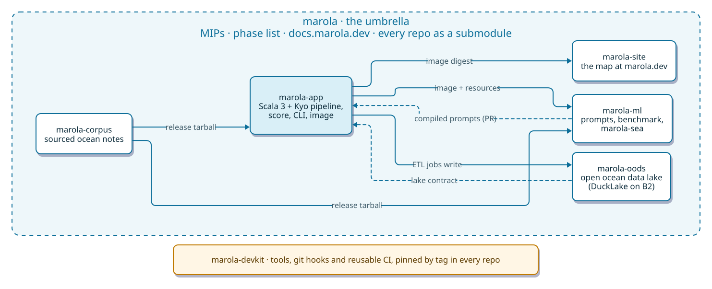

<h1 align="center">🌊 marola</h1>

<p align="center">
<a href="https://github.com/marola-dev/marola/actions/workflows/ci.yml"></a>
<a href="https://github.com/marola-dev/marola-site/actions/workflows/site.yml"></a>
<!-- Python statement coverage of scripts/**/*.py while each script's own --self-test runs, the only way marola tests Python (there is no pytest suite). ci.yml's repo-stats job (scripts/repo_stats.py) writes it and the badges below as shields.io endpoint JSON to marola-site's site-data branch, which marola.dev serves. The Scala badges are marola-app's README's. -->
<a href="https://github.com/marola-dev/marola/actions/workflows/ci.yml"></a>
<!-- How many of the last main run's steps went green out of the steps that actually ran (skipped ones excluded), and cloc's code-line count for the Python trees (this repo's scripts/ and marola-app's). -->
<a href="https://github.com/marola-dev/marola/actions/workflows/ci.yml"></a>

<a href="https://marola.dev/"></a>
<a href="https://doi.org/10.5281/zenodo.23224155"></a>
<a href="./LICENSE"></a>
</p>

<p align="center"><b>A friendly guide to the sea near you, built in the open, as citizen science.</b></p>

<p align="center"><a href="./README.pt-BR.md">🇧🇷 Leia em português</a> · <a href="https://marola.dev/">🗺️ Open the live map</a></p>

## What is marola?

Imagine a friend who knows the sea really well. You ask *"can I swim tomorrow, and when?"*, and
they look at the waves, the wind, the water temperature, whether the water is clean enough, the
tide, even whether jellyfish or whales are around, and then they tell you the best hour, and
**why**.

That friend is marola. You can see it today at **[marola.dev](https://marola.dev/)**: a map of the
beaches around Florianópolis, Rio de Janeiro and Salvador, each one ranked for today and tomorrow.

<p align="center"><a href="https://marola.dev/"></a></p>

A few promises marola keeps:

- **It never makes things up.** Every number comes from real, public data, and anything that could
  hurt you (dirty water, rough sea) is decided by plain rules a person can read, not by an AI's
  guess. The AI only helps explain it in words.
- **It's free, and it runs on your own computer.** No account, no paid service needed.
- **It says when it doesn't know.** "No data" is shown as "no data", never hidden.

## What you get

- **Best hour tomorrow, per beach**: OpenStreetMap beaches, Open-Meteo sea/weather/tide forecasts, a 0-100 swimability score with the reasons, never at night.
- **Official bathing-water quality, per sampling point**: IMA/SC, INEA and INEMA bulletins; unfit water zeroes the score in code, not a prompt.
- **Tides, swell, wind, UV, jellyfish and whale odds**, and a sourced "did you know?" about the sea in front of you.
- **Ask the ocean**: local RAG with `[n]` citations; off-corpus questions get an "unsourced" label instead of a refusal.

## The map: what's live and what's next

[marola.dev](https://marola.dev/) has a layer rail at the top right. Two layers are live today;
the rest sit on the rail greyed out as "em breve" (coming soon), or are written up as a MIP, and
each one is switched on once its data is checked live.

| Layer | Status | What it shows | Where it's designed |
|---|---|---|---|
| 🏖️ Beaches | **Live** | Every OpenStreetMap beach around Florianópolis, Rio de Janeiro and Salvador, ranked for today and tomorrow with the best hour | [MIP-0005](./docs/MIPs/MIP-0005-map-and-static-site.md) |
| 💧 Water quality (*balneabilidade*) | **Live** | The official sampling points of IMA/SC, INEA (RJ) and INEMA (BA), coloured by their last bulletin | [MIP-0016](./docs/MIPs/MIP-0016-water-quality-map-markers.md), [MIP-0031](./docs/MIPs/MIP-0031-water-quality-inea-inema.md) |
| 🥾 Coastal trails | Planned | OSM trails near the coast, long routes like the Transcarioca included | [MIP-0030](./docs/MIPs/MIP-0030-coastal-trails.md) |
| 🌬️ Wind and 🌊 waves | Built, switched off | Windy-like animated particles (`flow.js`), today interpolated from the beaches' own readings; a real field beyond the beaches comes next | [marola-site#45](https://github.com/marola-dev/marola-site/issues/45) |
| 🛰️ Satellite | Built, switched off | NASA GIBS true-colour imagery, public and keyless, on once its tiles are checked live | [marola-site#45](https://github.com/marola-dev/marola-site/issues/45) |
| 🌡️ Sea heat | Built, switched off | Sea-surface temperature, its anomalies (marine heatwaves) and an El Niño view, from NASA GIBS | [marola-site#45](https://github.com/marola-dev/marola-site/issues/45) |
| ⛰️ Depth | Planned | Bathymetry (*batimetria*) | [marola-site#45](https://github.com/marola-dev/marola-site/issues/45) |
| ⚠️ Hazards and disasters | Planned | Official alerts per state (INMET, the Navy) and *ressaca*, the storm surf | [MIP-0062](./docs/MIPs/MIP-0062-ressaca-hazard.md), [MIP-0034](./docs/MIPs/MIP-0034-rss-feeds-and-content-syndication.md), [marola#542](https://github.com/marola-dev/marola/pull/542), [marola-site#10](https://github.com/marola-dev/marola-site/issues/10) |
| 📷 Live cameras | Later | "How does it look right now?", from cameras people share | [MIP-0006](./docs/MIPs/MIP-0006-live-look-user-cameras.md) |

## Run it in five minutes

marola is a set of single-purpose repos; this one, the umbrella, ties them together as git
submodules. The app you run is [marola-app](https://github.com/marola-dev/marola-app):

```bash
git clone --recurse-submodules https://github.com/marola-dev/marola && cd marola/marola-app
```

```bash
# in a marola-app checkout
nix develop                                                        # JDK 25, sbt, just, ollama — see its flake.nix
just run -- --brief --lat -27.6733 --lon -48.4700                  # fastest path: ranked list, no LLM
just ollama-up                                                     # starts `ollama serve`, pulls llama3.2 if missing
just run -- --summarize --lat -27.6733 --lon -48.4700              # ranked list + top-pick block + LLM summary + review
just ask "what should I do if I get caught in a rip current?"      # grounded answer with sources
```

No cloud account, no API key needed for any of the above. Full walkthrough with real output:
[RUN-LOCALLY](https://docs.marola.dev/1-Using-marola/RUN-LOCALLY/).

## Why it's open source: citizen science 🔬

marola is a **citizen-science** project. The sea belongs to everyone, and so should
the knowledge about it. Public agencies already measure a lot (water quality, waves, weather), but
that data is scattered, technical and hard to use at the beach. marola gathers it, checks it,
explains it in plain language, and gives it back to the public. And the people who swim, surf,
fish and dive every day can give something back too: what they see in the water. That's why
everything here is open: the code, the data sources, the rules, and every design decision.
Anyone can read it, check it, and help improve it.

## Where it starts, and where it's going

**First use case: the swim agent.** *"What's the best hour tomorrow to swim nearby?"* It already
works: beaches from OpenStreetMap, sea and weather forecasts from Open-Meteo, official
bathing-water quality from the state environmental agencies, all turned into a score from 0 to
100 with the reasons spelled out.

**The bigger ambition: the ocean intelligence layer for the coast.** Swimming is just the first
question. The same data, and much more, can help protect people and places:

- 🌊 **Coastal hazard warnings.** Starting with *ressaca* (storm surf that erodes Brazil's
  beaches), with a hard "don't go in" when the sea gets dangerous
  ([MIP-0062](./docs/MIPs/MIP-0062-ressaca-hazard.md)).
- 🛰️ **Disaster forecasting with the same models the big agencies use.** marola's wave data
  already includes NOAA's **WAVEWATCH III** model (through NCEP's GFS-Wave). The plan is to show
  several models side by side, say openly when they disagree, and one day run a detailed wave
  model for our own bays ([MIP-0051](./docs/MIPs/MIP-0051-wave-model-ensemble.md),
  [MIP-0038](./docs/MIPs/MIP-0038-forecast-model-spread.md),
  [MIP-0052](./docs/MIPs/MIP-0052-wave-model-compute.md)).
- 🧪 **An open archive of Brazil's beach water quality**, versioned so anyone can study it
  ([MIP-0056](./docs/MIPs/MIP-0056-oods-open-ocean-data-store.md)).
- 🪼 **Reports from people at the beach.** Jellyfish, whales, and later photos of how the sea
  looks right now, so real observations can check and improve the forecasts.
- 🏄 **The rest of the sea.** Surfing, diving and fishing, as new questions over the same data.

These are ideas at different stages. Each one is written up as a public design doc (a "MIP") before
it's built, so you can see exactly what is done and what is still a plan: [`docs/MIPs/`](./docs/MIPs/README.md).

## How you can help (no coding needed)

- **Use the map** at [marola.dev](https://marola.dev/) and tell us when it's wrong. That's
  valuable data.
- **Tell us what you see in the water**, like jellyfish or whales, or a beach that's missing.
- **Share local knowledge**: sea safety, marine life, local conditions. Every fact marola explains
  comes from a sourced note in [marola-corpus](https://github.com/marola-dev/marola-corpus).
- **Open an issue**, in English or Portuguese: [github.com/marola-dev/marola/issues](https://github.com/marola-dev/marola/issues).

---

## How the umbrella works

marola is not one repo but a family of small ones, each with one job, its own `AGENTS.md`, docs,
CI and issues. This repo, `marola-dev/marola`, is the **umbrella** that ties them together
([MIP-0070](./docs/MIPs/MIP-0070-umbrella-and-polyrepo-split.md)). It holds no code: it holds the
design docs (MIPs), the phase list, the ways of working, the docs site, and every code repo as a
git submodule pinned at a commit.

<p align="center"></p>

- **Contracts, not shared code.** A repo never reads another repo's tree. A consumer pins a
  producer's published artifact (a release tarball, an image digest) and moves to a new version by
  bumping that pin in a PR. Who publishes and pins what:
  [REPOS](docs/2-Building-marola/REPOS.md).
- **Change in the repo the change belongs to.** One PR per repo; a change across repos uses the
  same branch name everywhere, the producer merges first, then each consumer bumps its pin.
- **The umbrella's pointers move only through one bot PR** (`pointer-sync.yml`), never by hand.
- **One docs site.** [docs.marola.dev](https://docs.marola.dev/) is built from this repo's `docs/`
  plus every repo's `README.md` and `docs/`.
- **Design before code.** Anything non-trivial starts as a MIP in [`docs/MIPs/`](./docs/MIPs/README.md);
  its tasks become issues, and an agent picks up only issues a person marked `agent-ready`.

## The repos, and what's happening in each

Status as of October 2026; the linked issues and PRs are the live view.

| Repo | What it is | In flight now |
|---|---|---|
| [marola](https://github.com/marola-dev/marola) (this one) | The umbrella: MIPs, phase list, ways of working, [docs.marola.dev](https://docs.marola.dev/) | Design PRs for the lake contract (MIP-0075, [#686](https://github.com/marola-dev/marola/pull/686)), Zenodo DOIs ([#683](https://github.com/marola-dev/marola/pull/683)), local artists ([#681](https://github.com/marola-dev/marola/pull/681)), official alerts ([#542](https://github.com/marola-dev/marola/pull/542), [#669](https://github.com/marola-dev/marola/pull/669)) · [PRs](https://github.com/marola-dev/marola/pulls) |
| [marola-app](https://github.com/marola-dev/marola-app) | The product, in Scala 3 with [Kyo](https://getkyo.io/) on the JVM: pipeline, score and safety veto, CLI, MCP server, the image that builds the map's boards | Salvador's INEMA bulletins ([#62](https://github.com/marola-dev/marola-app/pull/62)), the lake's `oods` module ([#54](https://github.com/marola-dev/marola-app/pull/54)), Kyo 1.0.0-RC7 review ([#56](https://github.com/marola-dev/marola-app/pull/56)), Overpass timeouts saved as beach lists ([#60](https://github.com/marola-dev/marola-app/issues/60)) · [issues](https://github.com/marola-dev/marola-app/issues) |
| [marola-site](https://github.com/marola-dev/marola-site) | The map at [marola.dev](https://marola.dev/): Mapbox GL, no server, rebuilt every 3 hours from the app's image; Rio and Salvador's agencies reached through a Brazilian proxy | Florianópolis showing 13 beaches ([#73](https://github.com/marola-dev/marola-site/issues/73)), local artists in the footer ([#69](https://github.com/marola-dev/marola-site/pull/69)), alerts page spec ([#58](https://github.com/marola-dev/marola-site/pull/58)), news page ([#54](https://github.com/marola-dev/marola-site/pull/54)), SEO ([#31](https://github.com/marola-dev/marola-site/issues/31)) · [issues](https://github.com/marola-dev/marola-site/issues) |
| [marola-oods](https://github.com/marola-dev/marola-oods) | The Open Ocean Data Store: an open data lake of beaches and bathing-water samples, DuckLake on Cloudflare R2 (no data yet) | Lake schema as migrations ([#22](https://github.com/marola-dev/marola-oods/pull/22)), spec 001 ([#3](https://github.com/marola-dev/marola-oods/pull/3)), MIP-0075 tasks [#9](https://github.com/marola-dev/marola-oods/issues/9)–[#19](https://github.com/marola-dev/marola-oods/issues/19) |
| [marola-ml](https://github.com/marola-dev/marola-ml) | Offline Python: DSPy prompt compile, benchmark gate, [marola-sea](https://huggingface.co/h0ffmann/marola-sea-tiny-GGUF) | No open PRs; GPU runners ([#2](https://github.com/marola-dev/marola-ml/issues/2)), a RAG retrieval regression ([#4](https://github.com/marola-dev/marola-ml/issues/4)), can water quality be forecast? ([#23](https://github.com/marola-dev/marola-ml/issues/23)) |
| [marola-corpus](https://github.com/marola-dev/marola-corpus) | The sourced ocean knowledge marola answers from | Stable; new documents welcome · [issues](https://github.com/marola-dev/marola-corpus/issues) |
| [marola-devkit](https://github.com/marola-dev/marola-devkit) | The dev harness every repo pins (a Nix flake input, not a submodule): tools, hooks, Claude Code skills, reusable CI such as the Gemini review | Cross-repo wiring tables (MIP-0076, [#32](https://github.com/marola-dev/marola-devkit/pull/32), [#33](https://github.com/marola-dev/marola-devkit/pull/33)) · [issues](https://github.com/marola-dev/marola-devkit/issues) |

Three more repos are curated lists, not part of the product:
[awesome-ocean-science](https://github.com/marola-dev/awesome-ocean-science) is marola's own list
of ocean software, data and tools; [open-sustainable-technology](https://github.com/marola-dev/open-sustainable-technology)
and [awesome-open-climate-science](https://github.com/marola-dev/awesome-open-climate-science) are
forks of community lists marola will be proposed to.

## In progress: the open ocean data lake

**[MIP-0075](./docs/MIPs/MIP-0075-water-quality-store-r2.md), in progress.** Today every map
build fetches beaches and water quality from scratch, and history is lost. MIP-0075 keeps them in
an open data lake: a [DuckLake](https://ducklake.select/) (Parquet plus a DuckDB catalog) in a
Cloudflare R2 bucket, written by scheduled ETL jobs in marola-app's `oods` module, with
marola-oods owning the schema. Beaches go first, then Santa Catarina's water quality, then Rio and
Bahia. Where it stands: the lake contract revision ([marola#686](https://github.com/marola-dev/marola/pull/686)),
the schema migrations ([marola-oods#22](https://github.com/marola-dev/marola-oods/pull/22)), the
spec ([marola-oods#3](https://github.com/marola-dev/marola-oods/pull/3)) and the task issues
[marola-oods#9](https://github.com/marola-dev/marola-oods/issues/9)–[#19](https://github.com/marola-dev/marola-oods/issues/19).

The score and its safety veto are deterministic Scala; the model only interprets and phrases, and
never overturns a veto. Why it's built this way: [PHILOSOPHY](docs/3-Ways-of-working/PHILOSOPHY.md).
How it works: [ARCHITECTURE](https://docs.marola.dev/2-Building-marola/ARCHITECTURE/). Everything
else, from every repo, is searchable at **[docs.marola.dev](https://docs.marola.dev/)**.

If you're an AI coding agent: read [`AGENTS.md`](./AGENTS.md) first, then the `AGENTS.md` of the
repo you're changing.

## Contributing

Small PRs, one topic each, in the repo the change belongs to; non-trivial changes start as a MIP
under `docs/MIPs/` here; every commit carries `Tested:`, `Cost:` and
`Co-Authored-By: Claude <noreply@anthropic.com>` trailers. AI agents are first-class contributors here and follow `AGENTS.md` like anyone else.
Full guide: [Contributing](https://docs.marola.dev/3-Ways-of-working/CONTRIBUTING/). Please also read the
[Code of Conduct](https://github.com/marola-dev/.github/blob/main/CODE_OF_CONDUCT.md) and, for a vulnerability, the [security policy](https://github.com/marola-dev/.github/blob/main/SECURITY.md).

## Gemini review

Request the reviewer `marola-dev/gemini` on a pull request (sidebar → Reviewers, or
`gh pr edit <N> --add-reviewer marola-dev/gemini`). `marola-gemini-bot` posts one review with at
most 10 inline comments tagged `[high]`/`[medium]`/`[low]`, then pushes one commit with the fixes
it is sure of. Request it again after new commits for a fresh review. It runs only when
asked, reviews fork pull requests without pushing to them, and never edits `.github/`. `.github/workflows/gemini.yml`
calls the devkit's [`gemini-review`](https://github.com/marola-dev/marola-devkit/blob/main/docs/4-reference_workflows.md#gemini-review)
workflow.

## How to cite

Each release of this repo (`just release X.Y.Z`) is archived on [Zenodo](https://zenodo.org/),
which gives it a DOI. Cite the concept DOI, [10.5281/zenodo.23224155](https://doi.org/10.5281/zenodo.23224155), which always
resolves to the latest version. The record lists every marola repository as a part of it, and the
WW3 GPU Lab ([10.5281/zenodo.23221351](https://doi.org/10.5281/zenodo.23221351)) as related work. GitHub's **Cite this repository**
button (right sidebar) exports APA and BibTeX from [`CITATION.cff`](./CITATION.cff). That file is generated from
[`.zenodo.json`](./.zenodo.json) by `just citation`, and `just contributor-add` adds a person to
both (MIP-0079).

<!-- citation:start -->

BibTeX:

```bibtex
@software{hoffmann_2026_marola,
  author    = {Hoffmann, Matheus and Valério, Bruno and Soares da Silva Junior, Rob Kler and Oliveira, Elisa and Almeida, Leonardo Ramos and Ribeiro, Pablo},
  title     = {{marola: an open, non-profit platform for sea conditions and bathing-water quality at Brazilian beaches, built on public data}},
  year      = {2026},
  publisher = {Zenodo},
  doi       = {10.5281/zenodo.23224155},
  url       = {https://github.com/marola-dev/marola}
}
```

APA:

> Hoffmann, M., Valério, B., Soares da Silva Junior, R. K., Oliveira, E., Almeida, L. R., & Ribeiro, P. (2026). *marola: an open, non-profit platform for sea conditions and bathing-water quality at Brazilian beaches, built on public data* [Computer software]. Zenodo. https://doi.org/10.5281/zenodo.23224155

ABNT (NBR 6023):

> HOFFMANN, Matheus; VALÉRIO, Bruno; SOARES DA SILVA JUNIOR, Rob Kler; OLIVEIRA, Elisa; ALMEIDA, Leonardo Ramos; RIBEIRO, Pablo. **marola**: an open, non-profit platform for sea conditions and bathing-water quality at Brazilian beaches, built on public data. [S. l.]: Zenodo, 2026. DOI 10.5281/zenodo.23224155.

<!-- citation:end -->

## Thanks

marola stands on other people's work. Five it could not exist without, alphabetically:

- **[Kyo](https://getkyo.io/)**: the effect system the entire Scala side is written in. Its
  direct-style `.now`/`defer` is what lets the pipeline read like ordinary code while keeping
  effects visible in the types.
- **[Mapbox GL JS](https://github.com/mapbox/mapbox-gl-js)**: draws the map at marola.dev, inside Mapbox's
  free map-load tier.
- **[Ollama](https://ollama.com/)**: runs the models locally, which is what makes marola usable
  with no cloud account and no API key.
- **[Open-Meteo](https://open-meteo.com/)**: the sea temperature, wind and wave forecasts every
  score is computed from, free and keyless.
- **[OpenStreetMap](https://www.openstreetmap.org/copyright)** contributors: every beach, trail
  and facility on the map is theirs, under ODbL.

Also relied on daily: Scala 3, MUnit, sbt, Nix, just, DSPy, Hugging Face (`transformers`, `peft`,
`trl`) and SmolLM2, llama.cpp, PDFBox, OpenTelemetry, MLflow, the Model Context Protocol SDK, and
[ai-jail](https://github.com/akitaonrails/ai-jail). The map's water quality comes from bulletins
published by INEA (Rio de Janeiro), INEMA (Bahia) and IMA/SC (Santa Catarina).

## Contact

For any request about marola, write to [admin@marola.dev](mailto:admin@marola.dev).
Vulnerabilities go through the private channel in the [security policy](https://github.com/marola-dev/.github/blob/main/SECURITY.md).

## License

[MIT](./LICENSE), © 2026 marola contributors.
</content>
