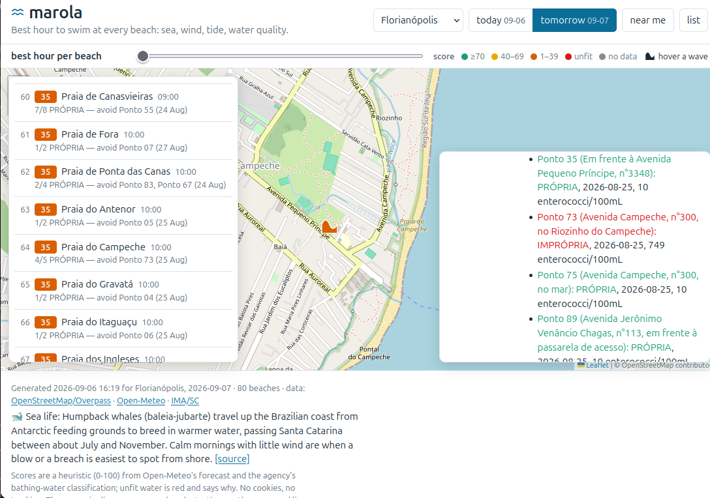
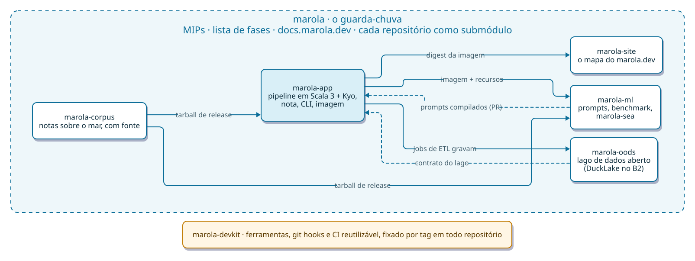

<h1 align="center">🌊 marola</h1>

<p align="center"><b>Um guia amigável para o mar perto de você, feito em código aberto, como ciência cidadã.</b></p>

<p align="center"><a href="./README.md">🇬🇧 Read in English</a> · <a href="https://marola.dev/">🗺️ Abrir o mapa ao vivo</a></p>

## O que é o marola? (a versão curta)

Imagine um amigo que conhece muito bem o mar. Você pergunta *"dá pra nadar amanhã? que horas?"*, e
ele olha as ondas, o vento, a temperatura da água, se a água está própria para banho, a maré, e
até se tem água-viva ou baleia por perto. Depois ele te diz qual é o melhor horário, e **por quê**.

Esse amigo é o marola. Você já pode usar hoje em **[marola.dev](https://marola.dev/)**: um mapa
das praias de Florianópolis, do Rio de Janeiro e de Salvador, cada uma com uma nota para hoje e
para amanhã.

<p align="center"><a href="https://marola.dev/"></a></p>

Algumas promessas que o marola cumpre:

- **Ele nunca inventa.** Todo número vem de dados reais e públicos. Tudo o que pode te colocar em
  risco (água imprópria, mar agitado) é decidido por regras simples que qualquer pessoa pode ler,
  e não pelo palpite de uma IA. A IA só ajuda a explicar em palavras.
- **É gratuito e roda no seu próprio computador.** Não precisa de conta nem de serviço pago.
- **Ele avisa quando não sabe.** "Sem dados" aparece como "sem dados", nunca é escondido.

## O mapa: o que já está no ar e o que vem aí

O [marola.dev](https://marola.dev/) tem uma barra de camadas no canto superior direito. Duas
camadas já estão no ar; as outras aparecem na barra, apagadas, como "em breve", ou estão escritas
como MIP, e cada uma só é ligada depois que os dados dela são conferidos no ar.

| Camada | Situação | O que mostra | Onde está o projeto |
|---|---|---|---|
| 🏖️ Praias | **No ar** | Todas as praias do OpenStreetMap em Florianópolis, no Rio de Janeiro e em Salvador, com nota para hoje e amanhã e o melhor horário | [MIP-0005](./docs/MIPs/MIP-0005-map-and-static-site.md) |
| 💧 Balneabilidade | **No ar** | Os pontos de coleta oficiais do IMA/SC, do INEA (RJ) e do INEMA (BA), com a cor do último boletim | [MIP-0016](./docs/MIPs/MIP-0016-water-quality-map-markers.md), [MIP-0031](./docs/MIPs/MIP-0031-water-quality-inea-inema.md) |
| 🥾 Trilhas perto da costa | Planejada | Trilhas do OSM perto do mar, inclusive as longas, como a Transcarioca | [MIP-0030](./docs/MIPs/MIP-0030-coastal-trails.md) |
| 🌬️ Vento e 🌊 ondas | Pronta, desligada | Partículas animadas, no estilo do Windy (`flow.js`), hoje interpoladas das leituras de cada praia; o próximo passo é um campo de verdade, além das praias | [marola-site#45](https://github.com/marola-dev/marola-site/issues/45) |
| 🛰️ Satélite | Pronta, desligada | Imagem de satélite em cor real da NASA GIBS, pública e sem chave; liga quando os tiles forem conferidos no ar | [marola-site#45](https://github.com/marola-dev/marola-site/issues/45) |
| 🌡️ Calor do mar | Pronta, desligada | Temperatura da superfície do mar, as anomalias (ondas de calor marinhas) e uma visão do El Niño, da NASA GIBS | [marola-site#45](https://github.com/marola-dev/marola-site/issues/45) |
| ⛰️ Profundidade | Planejada | Batimetria | [marola-site#45](https://github.com/marola-dev/marola-site/issues/45) |
| ⚠️ Riscos e desastres | Planejada | Alertas oficiais por estado (INMET, Marinha) e a *ressaca* | [MIP-0062](./docs/MIPs/MIP-0062-ressaca-hazard.md), [MIP-0034](./docs/MIPs/MIP-0034-rss-feeds-and-content-syndication.md), [marola#542](https://github.com/marola-dev/marola/pull/542), [marola-site#10](https://github.com/marola-dev/marola-site/issues/10) |
| 📷 Câmeras ao vivo | Mais adiante | "Como está o mar agora?", a partir de câmeras que as pessoas compartilham | [MIP-0006](./docs/MIPs/MIP-0006-live-look-user-cameras.md) |

## Por que é código aberto: ciência cidadã 🔬

O marola é um projeto de **ciência cidadã**. O mar é de todos, e o conhecimento sobre ele também
deveria ser.

Os órgãos públicos já medem muita coisa: balneabilidade, ondas, vento, tempo. Só que esses dados
estão espalhados em sites e boletins diferentes, são técnicos e difíceis de usar na hora de ir à
praia. O marola junta essas informações, confere, explica em linguagem simples e devolve tudo ao
público.

E o caminho também é de volta: quem nada, surfa, pesca e mergulha todo dia vê coisas que nenhum
satélite vê. Essas observações podem conferir e melhorar as previsões.

Por isso tudo aqui é aberto: o código, as fontes de dados, as regras e cada decisão de projeto.
Qualquer pessoa pode ler, conferir e ajudar a melhorar.

## Onde começa, e aonde quer chegar

**Primeiro caso de uso: o agente de natação.** *"Qual o melhor horário amanhã para nadar aqui
perto?"* Isso já funciona: as praias vêm do OpenStreetMap, a previsão do mar e do tempo vem do
Open-Meteo, e a balneabilidade oficial vem dos órgãos ambientais estaduais (IMA/SC, INEA e
INEMA). Tudo vira uma nota de 0 a 100, com os motivos explicados.

**A ambição maior: a camada de inteligência do oceano para o litoral.** Nadar é só a primeira
pergunta. Os mesmos dados, e muitos outros, podem ajudar a proteger pessoas e lugares:

- 🌊 **Alertas de risco costeiro.** Começando pela *ressaca*, que erode as praias do Brasil, com
  um "não entre" firme quando o mar fica perigoso
  ([MIP-0062](./docs/MIPs/MIP-0062-ressaca-hazard.md)).
- 🛰️ **Previsão de desastres com os mesmos modelos das grandes agências.** Os dados de ondas do
  marola já incluem o **WAVEWATCH III**, o modelo de ondas da NOAA (a agência americana de
  oceanos e atmosfera), através do GFS-Wave do NCEP. O plano é mostrar vários modelos lado a lado,
  dizer abertamente quando eles discordam e, um dia, rodar um modelo de ondas detalhado para as
  nossas próprias baías ([MIP-0051](./docs/MIPs/MIP-0051-wave-model-ensemble.md),
  [MIP-0038](./docs/MIPs/MIP-0038-forecast-model-spread.md),
  [MIP-0052](./docs/MIPs/MIP-0052-wave-model-compute.md)).
- 🧪 **Um arquivo aberto da balneabilidade das praias brasileiras**, versionado para que qualquer
  pessoa possa estudar ([MIP-0056](./docs/MIPs/MIP-0056-oods-open-ocean-data-store.md)).
- 🪼 **Relatos de quem está na praia.** Água-viva, baleia e, mais adiante, fotos de como o mar
  está agora, para que observações reais confiram as previsões.
- 🏄 **O resto do mar.** Surfe, mergulho e pesca, como novas perguntas sobre os mesmos dados.

Essas ideias estão em estágios diferentes. Cada uma é escrita antes como um documento público de
projeto (uma "MIP"), para que você veja exatamente o que já está pronto e o que ainda é plano:
[`docs/MIPs/`](./docs/MIPs/README.md) (em inglês).

## Como você pode ajudar (sem programar)

- **Use o mapa** em [marola.dev](https://marola.dev/) e conte quando ele errar. Isso é um dado
  valioso.
- **Conte o que você vê na água**, como água-viva ou baleia, ou uma praia que está faltando.
- **Compartilhe conhecimento local**: segurança no mar, vida marinha, condições da sua praia. Tudo
  o que o marola explica vem de uma nota com fonte em [marola-corpus](https://github.com/marola-dev/marola-corpus).
- **Abra uma issue**, em português ou em inglês:
  [github.com/marola-dev/marola/issues](https://github.com/marola-dev/marola/issues).

---

## Para rodar em cinco minutos

O marola é um conjunto de repositórios de propósito único; este aqui, o repositório guarda-chuva
(*umbrella*), junta todos como submódulos git. O app que você roda é o
[marola-app](https://github.com/marola-dev/marola-app):

```bash
git clone --recurse-submodules https://github.com/marola-dev/marola && cd marola/marola-app
```

```bash
# in a marola-app checkout
nix develop                                                        # JDK 25, sbt, just, ollama (veja o flake.nix dele)
just run -- --brief --lat -27.6733 --lon -48.4700                  # caminho mais rápido: lista em ordem, sem LLM
just ollama-up                                                     # inicia o `ollama serve` e baixa o llama3.2
just run -- --summarize --lat -27.6733 --lon -48.4700              # lista + resumo do LLM + revisão
just ask "o que fazer se eu for pego por uma corrente de retorno?" # resposta com fontes
```

Sem conta na nuvem, sem chave de API. Passo a passo com saída real (em inglês):
[RUN-LOCALLY](https://docs.marola.dev/1-Using-marola/RUN-LOCALLY/).

## Como funciona o repositório guarda-chuva

O marola não é um repositório só, e sim uma família de repositórios pequenos, cada um com uma
função, o seu próprio `AGENTS.md`, documentação, CI e issues. Este aqui, `marola-dev/marola`, é o
**guarda-chuva** (*umbrella*) que junta todos ([MIP-0070](./docs/MIPs/MIP-0070-umbrella-and-polyrepo-split.md)).
Ele não tem código: guarda os documentos de projeto (MIPs), a lista de fases, o jeito de trabalhar,
o site de documentação e cada repositório de código como um submódulo git, fixado num commit.

<p align="center"></p>

- **Contratos, não código compartilhado.** Um repositório nunca lê a árvore de outro. Quem consome
  fixa um artefato publicado por quem produz (um tarball de release, o digest de uma imagem) e
  passa para uma versão nova trocando esse pino num PR. Quem publica e quem fixa o quê:
  [REPOS](docs/2-Building-marola/REPOS.md) (em inglês).
- **A mudança vai no repositório a que pertence.** Um PR por repositório; uma mudança que cruza
  repositórios usa o mesmo nome de branch em todos, o produtor faz merge primeiro e depois cada
  consumidor atualiza o pino.
- **Os ponteiros do guarda-chuva só andam por um PR automático** (`pointer-sync.yml`), nunca à mão.
- **Um site de documentação só.** O [docs.marola.dev](https://docs.marola.dev/) é montado com o
  `docs/` deste repositório mais o `README.md` e o `docs/` de cada um dos outros.
- **Primeiro o projeto, depois o código.** Tudo o que não é trivial começa como uma MIP em
  [`docs/MIPs/`](./docs/MIPs/README.md); as tarefas viram issues, e um agente só pega issues que
  uma pessoa marcou como `agent-ready`.

## Os repositórios, e o que está acontecendo em cada um

Situação em outubro de 2026; as issues e os PRs linkados mostram o estado de agora.

| Repositório | O que é | Em andamento |
|---|---|---|
| [marola](https://github.com/marola-dev/marola) (este) | O guarda-chuva: MIPs, lista de fases, jeito de trabalhar, [docs.marola.dev](https://docs.marola.dev/) | PRs de projeto para o contrato do lago (MIP-0075, [#686](https://github.com/marola-dev/marola/pull/686)), DOIs no Zenodo ([#683](https://github.com/marola-dev/marola/pull/683)), artistas locais ([#681](https://github.com/marola-dev/marola/pull/681)), alertas oficiais ([#542](https://github.com/marola-dev/marola/pull/542), [#669](https://github.com/marola-dev/marola/pull/669)) · [PRs](https://github.com/marola-dev/marola/pulls) |
| [marola-app](https://github.com/marola-dev/marola-app) | O produto, em Scala 3 com [Kyo](https://getkyo.io/) na JVM: pipeline, nota e veto de segurança, linha de comando, servidor MCP, a imagem que monta os dados do mapa | Boletins do INEMA para Salvador ([#62](https://github.com/marola-dev/marola-app/pull/62)), o módulo `oods` do lago ([#54](https://github.com/marola-dev/marola-app/pull/54)), revisão do Kyo 1.0.0-RC7 ([#56](https://github.com/marola-dev/marola-app/pull/56)), respostas do Overpass que expiram e viram lista de praias ([#60](https://github.com/marola-dev/marola-app/issues/60)) · [issues](https://github.com/marola-dev/marola-app/issues) |
| [marola-site](https://github.com/marola-dev/marola-site) | O mapa em [marola.dev](https://marola.dev/): Mapbox GL, sem servidor, refeito a cada 3 horas a partir da imagem do app; os órgãos do Rio e da Bahia são acessados por um proxy no Brasil | Florianópolis mostrando só 13 praias ([#73](https://github.com/marola-dev/marola-site/issues/73)), artistas locais no rodapé ([#69](https://github.com/marola-dev/marola-site/pull/69)), spec da página de alertas ([#58](https://github.com/marola-dev/marola-site/pull/58)), página de notícias ([#54](https://github.com/marola-dev/marola-site/pull/54)), SEO ([#31](https://github.com/marola-dev/marola-site/issues/31)) · [issues](https://github.com/marola-dev/marola-site/issues) |
| [marola-oods](https://github.com/marola-dev/marola-oods) | O Open Ocean Data Store: um lago de dados aberto com as praias e as amostras de balneabilidade, um DuckLake no Backblaze B2 (ainda sem dados) | Esquema do lago como migrations ([#22](https://github.com/marola-dev/marola-oods/pull/22)), spec 001 ([#3](https://github.com/marola-dev/marola-oods/pull/3)), tarefas da MIP-0075 [#9](https://github.com/marola-dev/marola-oods/issues/9)–[#19](https://github.com/marola-dev/marola-oods/issues/19) |
| [marola-ml](https://github.com/marola-dev/marola-ml) | Python offline: compilação de prompts com DSPy, portão de benchmark, [marola-sea](https://huggingface.co/h0ffmann/marola-sea-tiny-GGUF) | Nenhum PR aberto; runners de GPU ([#2](https://github.com/marola-dev/marola-ml/issues/2)), uma regressão na busca do RAG ([#4](https://github.com/marola-dev/marola-ml/issues/4)), dá para prever a balneabilidade? ([#23](https://github.com/marola-dev/marola-ml/issues/23)) |
| [marola-corpus](https://github.com/marola-dev/marola-corpus) | O conhecimento sobre o mar, com fontes, de onde o marola tira as respostas | Estável; documentos novos são bem-vindos · [issues](https://github.com/marola-dev/marola-corpus/issues) |
| [marola-devkit](https://github.com/marola-dev/marola-devkit) | As ferramentas de desenvolvimento que todo repositório fixa (entra como input do flake Nix, não como submódulo): scripts, hooks, skills do Claude Code, CI reutilizável, como a revisão do Gemini | Tabelas da ligação entre repositórios (MIP-0076, [#32](https://github.com/marola-dev/marola-devkit/pull/32), [#33](https://github.com/marola-dev/marola-devkit/pull/33)) · [issues](https://github.com/marola-dev/marola-devkit/issues) |

Outros três repositórios são listas curadas, fora do produto: o
[awesome-ocean-science](https://github.com/marola-dev/awesome-ocean-science) é a lista do próprio
marola com software, dados e ferramentas sobre o oceano; o
[open-sustainable-technology](https://github.com/marola-dev/open-sustainable-technology) e o
[awesome-open-climate-science](https://github.com/marola-dev/awesome-open-climate-science) são forks
de listas da comunidade onde o marola ainda vai ser proposto.

## Em andamento: o lago de dados aberto do oceano

**[MIP-0075](./docs/MIPs/MIP-0075-water-quality-store-r2.md), em andamento.** Hoje cada build do
mapa busca praias e balneabilidade do zero, e o histórico se perde. A MIP-0075 guarda tudo num lago
de dados aberto: um [DuckLake](https://ducklake.select/) (Parquet mais um catálogo DuckDB) num
bucket do Backblaze B2, gravado por jobs de ETL agendados no módulo `oods` do marola-app, com o
esquema sob responsabilidade do marola-oods. Primeiro vêm as praias, depois a balneabilidade de
Santa Catarina, depois Rio e Bahia. Onde está: a revisão do contrato do lago
([marola#686](https://github.com/marola-dev/marola/pull/686)), as migrations do esquema
([marola-oods#22](https://github.com/marola-dev/marola-oods/pull/22)), a spec
([marola-oods#3](https://github.com/marola-dev/marola-oods/pull/3)) e as issues de tarefa
[marola-oods#9](https://github.com/marola-dev/marola-oods/issues/9)–[#19](https://github.com/marola-dev/marola-oods/issues/19).

A nota e o veto de segurança são Scala determinístico; o modelo apenas interpreta e redige, e nunca
derruba um veto. Toda a documentação técnica, de todos os repositórios, está em inglês em
**[docs.marola.dev](https://docs.marola.dev/)**; veja também o [PHILOSOPHY](docs/3-Ways-of-working/PHILOSOPHY.md),
o guia de [contribuição](https://docs.marola.dev/3-Ways-of-working/CONTRIBUTING/) e o [Código de Conduta](https://github.com/marola-dev/.github/blob/main/CODE_OF_CONDUCT.md). Se você é um
agente de IA: leia primeiro o [`AGENTS.md`](./AGENTS.md), depois o `AGENTS.md` do repositório que
vai mudar.

## Como citar

Cada release deste repositório (`just release X.Y.Z`) é arquivada no [Zenodo](https://zenodo.org/),
que dá a ela um DOI. Cite o DOI conceitual, [10.5281/zenodo.23224155](https://doi.org/10.5281/zenodo.23224155), que sempre
aponta para a versão mais recente. O registro lista cada repositório do marola como parte dele, e o
WW3 GPU Lab ([10.5281/zenodo.23221351](https://doi.org/10.5281/zenodo.23221351)) como trabalho relacionado. O botão **Cite this
repository** do GitHub (barra lateral direita) exporta APA e BibTeX a partir do
[`CITATION.cff`](./CITATION.cff).

<!-- citation:start -->

BibTeX:

```bibtex
@software{hoffmann_2026_marola,
  author    = {Hoffmann, Matheus and Valério, Bruno and Soares da Silva Junior, Rob Kler and Oliveira, Elisa and Almeida, Leonardo Ramos and Ribeiro, Pablo},
  title     = {{marola: an open, non-profit platform for sea conditions and bathing-water quality at Brazilian beaches, built on public data}},
  year      = {2026},
  publisher = {Zenodo},
  doi       = {10.5281/zenodo.23224155},
  url       = {https://github.com/marola-dev/marola}
}
```

APA:

> Hoffmann, M., Valério, B., Soares da Silva Junior, R. K., Oliveira, E., Almeida, L. R., & Ribeiro, P. (2026). *marola: an open, non-profit platform for sea conditions and bathing-water quality at Brazilian beaches, built on public data* [Computer software]. Zenodo. https://doi.org/10.5281/zenodo.23224155

ABNT (NBR 6023):

> HOFFMANN, Matheus; VALÉRIO, Bruno; SOARES DA SILVA JUNIOR, Rob Kler; OLIVEIRA, Elisa; ALMEIDA, Leonardo Ramos; RIBEIRO, Pablo. **marola**: an open, non-profit platform for sea conditions and bathing-water quality at Brazilian beaches, built on public data. [S. l.]: Zenodo, 2026. DOI 10.5281/zenodo.23224155.

<!-- citation:end -->

## Agradecimentos

O marola existe graças ao trabalho de muita gente: os colaboradores do
[OpenStreetMap](https://www.openstreetmap.org/copyright) (cada praia do mapa é deles, sob a ODbL),
o [Open-Meteo](https://open-meteo.com/) (as previsões do mar e do tempo), o
[Mapbox GL JS](https://github.com/mapbox/mapbox-gl-js) (o mapa), o [Ollama](https://ollama.com/) e o
[Kyo](https://getkyo.io/). Os dados de balneabilidade vêm dos boletins do INEA (Rio de Janeiro), do
INEMA (Bahia) e do IMA/SC (Santa Catarina).

## Contato

Para qualquer pedido sobre o marola, escreva para [admin@marola.dev](mailto:admin@marola.dev).
Vulnerabilidades vão pelo canal privado descrito na [política de segurança](https://github.com/marola-dev/.github/blob/main/SECURITY.md).

## Licença

[MIT](./LICENSE), © 2026 colaboradores do marola.
