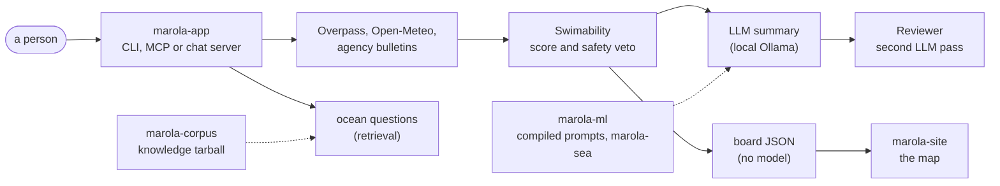
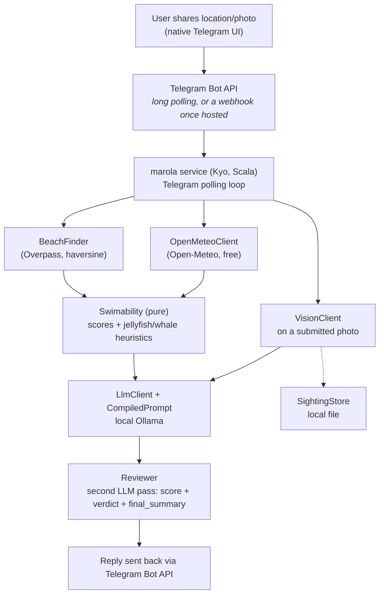

# Architecture

The system: what marola is for, how a request crosses the repos, the pattern every integration
follows, where the Telegram bot fits, and the cloud options. The app's internals (the module map,
the CLI, each integration's code and status, the full data-source table) moved from this page to
marola-app's [Design](https://docs.marola.dev/5-Repos/marola-app/1-design/) pages, and what marola
cannot tell you to [Limitations](../1-Using-marola/LIMITATIONS.md). Old section links land on the
stubs under [Moved from this page](#moved-from-this-page). Which repo owns what is
[Repos](REPOS.md).

**Status:** the pipeline and its integrations run locally on free backends; no cloud resource is
provisioned and no Telegram bot is registered yet ([Phases](../PHASES.md)).

## Vision

marola is the ocean intelligence layer for a stretch of coast. Its first use case:

**MVP hypothesis:** a Telegram message ("what's the best hour tomorrow to swim nearby?") gets back a
ranked list of nearby open-water swim spots, each with its best hour tomorrow, sea temperature,
wind, wave height, a jellyfish-likelihood heuristic and (informational, not safety-relevant; see
[Limitations](../1-Using-marola/LIMITATIONS.md#the-jellyfish-and-whale-heuristics-honest-limitations))
a whale-sighting-likelihood heuristic, backed by live marine and weather data and a Telegram-native
location share, not a typed-in address.

**Non-goals for the POC:** multi-day forecasts, saved or favourite spots, push notifications ("tell
me when conditions turn good"), any deployment at all yet.

### Why Telegram, not WhatsApp or a Streamlit page

A personal tool with no closed-beta allowlist or business-identity requirement, so the choice came
down to a Telegram bot or a Streamlit web app:

| | Telegram bot | Streamlit page |
|---|---|---|
| Location sharing | Native "Share Location" (one-time or live) in every client, no extra code | The browser Geolocation API plus a JS bridge component (Streamlit has no direct JS access): an extra dependency and a permission prompt per session |
| Mobile experience | First-class: it's a chat app | Fine, but a browser tab is a step down from "message a bot" on a beach |
| Hosting | Long polling needs **no public HTTPS endpoint**, so the POC runs from a laptop | A hosted, publicly reachable process from day one |
| Auth | The Telegram user ID *is* the identity: borrow, don't build | Its own session and identity story |

**Decision: Telegram bot.**

## The request pipeline across repos

A request runs in one process, marola-app's: find the nearby beaches, fetch their sea, weather and
water quality, score each one deterministically (the safety veto included), then have a local model
turn the top result into a sentence that a second model pass reviews. A question about the ocean
takes the other path, answered from the corpus by retrieval. The same scoring, with no model at all,
builds the boards the map shows.

The other repos are not on the request path. marola-corpus and marola-ml ship what the app pins
(the knowledge tarball, compiled prompts merged into its resources, the marola-sea model served by
Ollama), and marola-site renders the boards the app's image builds every 3 hours. The contracts are
in [Repos](REPOS.md#the-contracts), each step's code in marola-app's
[pipeline](https://docs.marola.dev/5-Repos/marola-app/1-design/#the-pipeline).

Dashed edges are pinned at build time, not called per request.

### How marola uses AI

Two uses today, kept apart because they fail differently: the map is deterministic, so a wrong
number is a parser or scoring bug; the chat and the summary are generative, fenced by a reviewer
pass, the corpus and tools, so a bad answer is a model, retrieval or prompt problem. The reasoning
and the code are in marola-app's
[Two uses of AI, kept apart](https://docs.marola.dev/5-Repos/marola-app/1-design/#two-uses-of-ai-kept-apart).

### Use 3, planned: forecasting with time-series foundation models

Neither use predicts anything. The map reports what the agencies and Open-Meteo measured; the chat
explains it. A third use, **forecasting marola's own accumulated series with a pretrained
time-series transformer**, is designed in
[MIP-0007](../MIPs/MIP-0007-time-series-foundation-models.md), prompted by Nixtla's TimeGPT, with
the open-weight models (Chronos, TimesFM, Moirai) as the local-first candidates.

It is a different shape from both: not a language model, but a numeric forecaster run zero-shot over
a history, the kind of thing that could calibrate the jellyfish and whale heuristics
([Limitations](../1-Using-marola/LIMITATIONS.md#the-jellyfish-and-whale-heuristics-honest-limitations))
against real accumulated reports instead of hand-tuned thresholds.

**Deliberately not started.** MIP-0007 is Draft, Phase 4, and parked: it needs weeks of marola's
own series before any backtest means anything, and zero-shot models may simply lose to "last result
persists" on series this small and noisy. Only the accumulation is worth doing now. When it arrives
it will be a third thing that can be wrong in a third way, and it should not be folded into either
of the two that exist.

## Local-first integration pattern

Every integration has the same shape, and a MIP that adds a data path follows it:

- **A trait in marola-app's `core`, a local implementation, and an `AppConfig` factory** that picks
  the backend from the environment. The local implementation needs no account, no key and no spend:
  Ollama for models, a file for storage, a free public API for data.
- **Callers take the trait, never the implementation**, so `core` never references a backend
  ([ADR 0001](https://github.com/marola-dev/marola-app/blob/main/docs/adr/0001-three-sbt-modules.md)).
- **A cloud backend is one more implementation of the same trait, opt-in per integration**, never a
  package deal. GCP is the path under discussion
  ([MIP-0057](../MIPs/MIP-0057-gcp-as-opt-in-cloud-backend.md)), and it waits on Phase 1.
- **The local default comes first.** "Runs entirely locally with a free model" is a product
  promise: a new data path names its local default before any hosted one.

The integrations today (query synthesis, agentic tool access, the chat server, sighting reports,
photo analysis, observability, bathing-water quality, facilities and trails, ocean knowledge), each
with its trait, local backend and status, are in marola-app's
[Integrations](https://docs.marola.dev/5-Repos/marola-app/1-design_integrations/).

## Target architecture: the Telegram bot

Phase 1 ([MIP-0002](../MIPs/MIP-0002-telegram-bot-phase-1.md)) puts a Telegram polling loop in
front of the same pipeline:

The MCP server is a parallel entry point to the same pipeline for any MCP client, not a stage in it.
Tracing wraps the pipeline and each LLM call when configured. Rate limiting per Telegram user and a
cost-governor check before any paid call are built early, not bolted on
([MIP-0003](../MIPs/MIP-0003-fast-replies-caching-and-fan-out.md)).

## Data sources

All free and keyless: OpenStreetMap's Overpass for beaches, facilities and trails; Open-Meteo for
sea and weather; the state agencies' bathing-water data (IMA/SC, INEA/RJ, INEMA/BA); public IP
geolocation as the CLI's fallback origin; the Telegram Bot API; and OpenStreetMap tiles under the
map. Each source's terms are in marola-app's
[Data sources](https://docs.marola.dev/5-Repos/marola-app/4-reference/), the tile policy in
marola-site's [Reference](https://docs.marola.dev/5-Repos/marola-site/4-reference/#tile-policy).

## Cloud options

Nothing is provisioned, and nothing is required. Per `AGENTS.md`'s cost-safety rule, nothing gets
provisioned without an explicit go-ahead. GCP is the opt-in cloud path under discussion
([MIP-0057](../MIPs/MIP-0057-gcp-as-opt-in-cloud-backend.md)), for whichever integrations are worth
it, and only in Phase 2, after the bot works.

The bot itself needs no cloud: register it with [@BotFather](https://core.telegram.org/bots#botfather)
(free) and run the service locally with long polling and `MAROLA_TELEGRAM_BOT_TOKEN` set
([Telegram bot setup](../1-Using-marola/TELEGRAM-SETUP.md)). Every integration works locally, so the
bot is testable end to end before anything is spent.

## Moved from this page

### 1. Problem & product vision

Now [Vision](#vision).

### 2. Why Telegram, not WhatsApp or a Streamlit page

Now [Why Telegram, not WhatsApp or a Streamlit page](#why-telegram-not-whatsapp-or-a-streamlit-page).

### 3. What's actually built

Moved to marola-app's [Design](https://docs.marola.dev/5-Repos/marola-app/1-design/#module-map).

### 3.1 `Main`'s CLI surface

Moved to marola-app's [CLI reference](https://docs.marola.dev/5-Repos/marola-app/4-reference_cli/).

### 3b. Two different uses of AI today, a third planned — deliberately not one

The two uses moved to marola-app's
[Design](https://docs.marola.dev/5-Repos/marola-app/1-design/#two-uses-of-ai-kept-apart); the
third is [Use 3, planned](#use-3-planned-forecasting-with-time-series-foundation-models).

### 4. Target architecture (Telegram bot, once built)

Now [Target architecture: the Telegram bot](#target-architecture-the-telegram-bot).

### 5. The six pluggable integrations

The pattern is now [Local-first integration pattern](#local-first-integration-pattern); each
integration's code moved to marola-app's
[Integrations](https://docs.marola.dev/5-Repos/marola-app/1-design_integrations/).

### 5a. Query synthesis — `llm/`

Moved to marola-app's
[Query synthesis](https://docs.marola.dev/5-Repos/marola-app/1-design_integrations/#query-synthesis).

### 5b. Beach distance — haversine

Moved to marola-app's
[Beach distance](https://docs.marola.dev/5-Repos/marola-app/1-design/#beach-distance).

### 5c. Agentic tool access — `agent/SwimConditionsMcpServer.scala`

Moved to marola-app's
[Agentic tool access](https://docs.marola.dev/5-Repos/marola-app/1-design_integrations/#agentic-tool-access).

### 5d. Sighting reports — `sightings/`

Moved to marola-app's
[Sighting reports](https://docs.marola.dev/5-Repos/marola-app/1-design_integrations/#sighting-reports).

### 5e. Photo analysis — `vision/`

Moved to marola-app's
[Photo analysis](https://docs.marola.dev/5-Repos/marola-app/1-design_integrations/#photo-analysis).

### 5f. Observability

Moved to marola-app's
[Observability](https://docs.marola.dev/5-Repos/marola-app/1-design_integrations/#observability).

### 5g. Bathing-water quality, tides, and sea lore — `water/`, `conditions/Tides`, `lore/`

Moved to marola-app's
[Bathing-water quality](https://docs.marola.dev/5-Repos/marola-app/1-design_integrations/#bathing-water-quality),
[Tides](https://docs.marola.dev/5-Repos/marola-app/1-design_heuristics/#tides) and
[Sea lore](https://docs.marola.dev/5-Repos/marola-app/1-design_heuristics/#sea-lore).

### 5h. Ocean knowledge — local RAG, and local fine-tuning — marola-corpus, marola-ml

How the corpus reaches marola-app and marola-ml is in [Repos](REPOS.md#the-contracts); retrieval
moved to marola-app's
[Ocean knowledge](https://docs.marola.dev/5-Repos/marola-app/1-design_integrations/#ocean-knowledge-retrieval),
the fine-tune to marola-ml's
[Fine-tune](https://docs.marola.dev/5-Repos/marola-ml/3-development_finetune/).

### 6. Cloud infrastructure needed

Now [Cloud options](#cloud-options).

### 7. Third-party APIs used (all free, no key, confirmed live against real data)

Now [Data sources](#data-sources); the full table moved to marola-app's
[Data sources](https://docs.marola.dev/5-Repos/marola-app/4-reference/).

### 8. The jellyfish and whale heuristics — honest limitations

Moved to [Limitations](../1-Using-marola/LIMITATIONS.md#the-jellyfish-and-whale-heuristics-honest-limitations).

### 9. Other known limitations (POC-stage, not hidden)

Moved to [Limitations](../1-Using-marola/LIMITATIONS.md#other-known-limitations-poc-stage-not-hidden).
