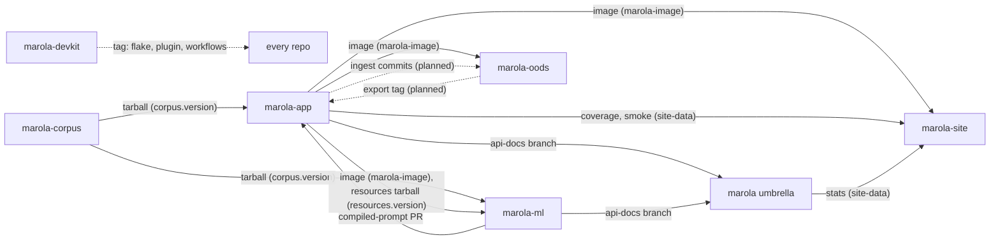

# Repos

marola is seven repos: the umbrella, the devkit and five code or data repos. This page says which
repo owns what, what each publishes, and how a consumer pins it. How the product works end to end
is [Architecture](ARCHITECTURE.md); why the code was split this way is [The split](SPLIT.md).

## Three layers

| Layer | Holds | Can a repo override it? |
|---|---|---|
| **Umbrella** (`marola-dev/marola`) | The workspace `AGENTS.md`, the ways of working, MIPs and their `.tasks.md`, MIP and cross-repo parent issues, the phase list, the aggregated docs site, the submodule pointers | — |
| **Devkit** (`marola-devkit`) | The shared harness at a tag: dev-flow tools, git hooks, the Claude Code plugin, reusable workflows, the `just` module, the invariants block | Yes: a repo opts into each piece, and its `AGENTS.md` says what it leaves out |
| **Repo** | Its own `AGENTS.md`, `docs/`, build, tests, gates, repo-only skills and rules | It owns them outright |

The [org invariants](https://github.com/marola-dev/marola/blob/main/AGENTS.md#org-invariants) are
the exception to "the repo wins": cost and deployment safety, no secrets in code, the `agent-ready`
gate, the three commit trailers and phase discipline. A repo may make them stricter, never looser.
Every repo's `AGENTS.md` carries them as the devkit's invariants block, and `agents-check` compares
that copy with the pinned devkit's.

## The routing table

Where a change belongs, and what moves when it lands. This is the table's only copy: the umbrella's
`AGENTS.md` links here, and `scripts/agents_repos_check.sh` fails if it restates it.

| Repo | Owns | Publishes | Consumers | Moved by → pin |
|---|---|---|---|---|
| [marola](https://github.com/marola-dev/marola) (umbrella) | Ways of working, MIPs, research, `PHASES.md`, the docs site, the submodule pointers | [docs.marola.dev](https://docs.marola.dev/); `stats/` on marola-site's `site-data` | Readers; marola-site's stats panel | `docs.yml` deploys the site; `pointer-sync.yml` → the gitlinks; `ci.yml` → `site-data` |
| [marola-devkit](https://github.com/marola-dev/marola-devkit) (not a submodule) | Dev-flow tools, git hooks, the `marola-devkit` plugin, reusable workflows, the invariants block | A tag: flake input, plugin marketplace, `uses:` workflows | Every repo | A tag → `flake.lock`, each workflow's `@v…` and `devkit-ref:`, the marketplace `ref` in `.claude/settings.json`, bumped together |
| [marola-app](https://github.com/marola-dev/marola-app) | The Scala 3 + Kyo product on JDK 25 (sbt modules `core`, `local`, `cli`): the pipeline, CLI, MCP and chat servers, the benchmark runner; the OODS ingest code with MIP-0056 | The image `ghcr.io/marola-dev/marola-app`; `ml-resources-<tag>.tar.gz`; Scaladoc on its `api-docs` branch; `coverage/` and `smoke/` on `site-data` | site, ml, oods; the umbrella's docs | `docker.yml` → `marola-image`; `release.yml` (a `v*` tag) → `resources.version`; `api-docs.yml` → `api-docs`; `ci.yml`, `docker-smoke.yml` → `site-data` |
| [marola-site](https://github.com/marola-dev/marola-site) | The map: the static page, `areas.json`, live checks, the `site-data` branch | [marola.dev](https://marola.dev/) on GitHub Pages | Visitors | `site.yml`: every 3 h, on a `marola-image` bump, on a `site-data-updated` dispatch |
| [marola-corpus](https://github.com/marola-dev/marola-corpus) | The sourced ocean knowledge (Markdown under `knowledge`), the `corpus-doc` skill | `marola-corpus-<tag>.tar.gz` | app, ml | `release.yml` (a `v*` tag) → `corpus.version` |
| [marola-ml](https://github.com/marola-dev/marola-ml) | Offline Python: the DSPy prompt compile, the marola-sea fine-tune, the benchmark gate and its kept runs | Compiled-prompt PRs; marola-sea on Hugging Face; pdoc on its `api-docs` branch | app; the umbrella's docs | `compile-prompt.yml` → a PR into marola-app; `marola-sea-publish.yml` → Hugging Face; `api-docs.yml` → `api-docs` |
| [marola-oods](https://github.com/marola-dev/marola-oods) | The Open Ocean Data Store's data only (`data/oods/`, MIP-0056); empty for now | The dataset; an export tag (planned, MIP-0056 §5.5) | app | The app's ingest workflow commits here (with MIP-0056); `oods-check.yml` runs against `marola-image` |

Each repo's README is its landing page on this site, under 5 Repos.

## The contracts

**No repo reads another repo's tree, in CI or in tests, and no consumer builds its producer from
source.** A producer publishes a versioned artifact; a consumer pins it and moves to a new version by
bumping the pin in a PR. Inside an umbrella checkout the submodules sit side by side, but that is a
convenience for people and agents, never a build input.

| Artifact | Produced by | Read by | Pinned by |
|---|---|---|---|
| The app image, `ghcr.io/marola-dev/marola-app:<tag>@<digest>` | marola-app `docker.yml`, on a push to `main` | marola-site `site.yml` (the boards, data only), marola-ml `docker-local.yml` (the benchmark), marola-oods `oods-check.yml` | `marola-image` in each consumer, tag and digest |
| `marola-corpus-<tag>.tar.gz` | marola-corpus `release.yml`, on a `v*` tag | marola-app (unpacked into `.tmp/knowledge`; the image ships `/app/knowledge`), marola-ml | `corpus.version` in each consumer |
| `ml-resources-<tag>.tar.gz` (the app's prompt and fixture resources) | marola-app `release.yml`, on a `v*` tag | marola-ml's fine-tune dataset and benchmark gate | `resources.version` |
| Each repo's `api-docs` branch: one force-pushed commit of generated API docs | marola-app and marola-ml `api-docs.yml` (the devkit's reusable workflow), on a push to `main` | The umbrella's `prepare-docs.sh`, under `5-Repos/<name>/api-docs/` | None: the latest `main` |
| Compiled-prompt PRs (`recommendation_prompt.json`, `review_prompt.json`) | marola-ml `compile-prompt.yml`, run by hand | marola-app's resources, once the PR merges | The file in marola-app |
| The `site-data` branch: `coverage/`, `smoke/`, `stats/` | marola-app `ci.yml` and `docker-smoke.yml`, the umbrella's `ci.yml`, then a `site-data-updated` dispatch | marola-site `site.yml` | None: the branch's content |
| OODS ingest commits and export | marola-app's ingest workflow (MIP-0056, not built) | marola-oods; the export back to marola-app | An export tag and its env var (planned) |
| `notify-umbrella` dispatches (`submodule-docs-updated`) | Every repo's `notify-umbrella.yml`, on a push to `main` touching `README.md` or `docs/` | The umbrella's `docs.yml` and `pointer-sync.yml` | The gitlinks, moved by the sync PR |
| A devkit tag | marola-devkit | Every repo | `flake.lock`, `@v…`/`devkit-ref:`, the marketplace `ref` |

The `api-docs.tar.gz` release asset is retired: the site reads the `api-docs` branches instead
(marola-dev/marola-ml#17, marola-dev/marola-app#51).

A contract change follows the producer: it merges and releases first, each consumer bumps its pin
in its own PR, and the umbrella's pointers move last, through the sync PR.
