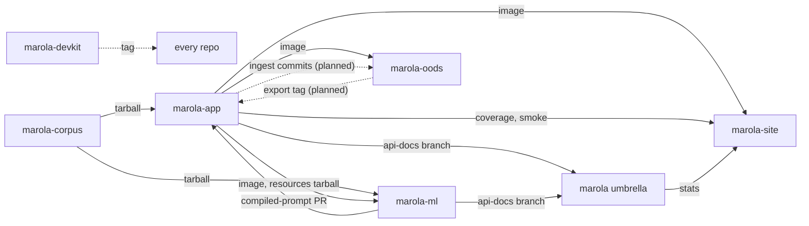

# Repos

marola is seven repos: the umbrella, the devkit and five code or data repos. This page says which
repo owns what, what each publishes, and how a consumer pins it. How the product works end to end
is [Architecture](ARCHITECTURE.md); why the code was split this way is [The split](SPLIT.md).

## Three layers

| Layer | Holds | Can a repo override it? |
|---|---|---|
| **Umbrella** (`marola-dev/marola`) | The workspace `AGENTS.md`, the ways of working, MIPs and their `.tasks.md`, MIP and cross-repo parent issues, the phase list, the aggregated docs site, the submodule pointers | — |
| **Devkit** (`marola-devkit`) | The shared harness at a tag: dev-flow tools, git hooks, the Claude Code plugin, reusable workflows, the `just` module, the invariants block | Yes: a repo opts into each piece, and its `AGENTS.md` says what it leaves out |
| **Repo** | Its own `AGENTS.md`, `docs/`, build, tests, gates, repo-only skills and rules | It owns them outright |

The [org invariants](https://github.com/marola-dev/marola/blob/main/AGENTS.md#org-invariants) are
the exception to "the repo wins": cost and deployment safety, no secrets in code, the `agent-ready`
gate, the three commit trailers and phase discipline. A repo may make them stricter, never looser.
Every repo's `AGENTS.md` carries them as the devkit's invariants block, and `agents-check` compares
that copy with the pinned devkit's.

## The routing table

Where a change belongs, and what moves when it lands. This is the table's only copy: the umbrella's
`AGENTS.md` links here, and `scripts/agents_repos_check.sh` fails if it restates it. The pin each
artifact moves is in [Artifacts, pins and dispatches](#artifacts-pins-and-dispatches).

| Repo | Owns | Publishes | Consumers | Moved by |
|---|---|---|---|---|
| [marola](https://github.com/marola-dev/marola) (umbrella) | Ways of working, MIPs, research, `PHASES.md`, the docs site, the submodule pointers, the `eli5` skill | [docs.marola.dev](https://docs.marola.dev/); `stats/` on marola-site's `site-data` | Readers; marola-site's stats panel | `docs.yml`, `pointer-sync.yml`, `ci.yml` |
| [marola-devkit](https://github.com/marola-dev/marola-devkit) (not a submodule) | Dev-flow tools, git hooks, the `marola-devkit` plugin, reusable workflows, the invariants block | A tag: flake input, plugin marketplace, `uses:` workflows | Every repo | A tag |
| [marola-app](https://github.com/marola-dev/marola-app) | The Scala 3 + Kyo product on JDK 25 (sbt modules `core`, `local`, `cli`): the pipeline, CLI, MCP and chat servers, the benchmark runner; the OODS ingest code with MIP-0056 | The image `ghcr.io/marola-dev/marola-app`; `ml-resources-<tag>.tar.gz`; Scaladoc on its `api-docs` branch; `coverage/` and `smoke/` on `site-data` | site, ml, oods; the umbrella's docs | `docker.yml`, `release.yml` (a `v*` tag), `api-docs.yml`, `ci.yml`, `docker-smoke.yml` |
| [marola-site](https://github.com/marola-dev/marola-site) | The map: the static page, `areas.json`, live checks, the `site-data` branch | [marola.dev](https://marola.dev/) on a Cloudflare Worker, GitHub Pages as fallback | Visitors | `site.yml`: every 3 h, on an image bump or a site-data dispatch |
| [marola-corpus](https://github.com/marola-dev/marola-corpus) | The sourced ocean knowledge (Markdown under `knowledge`), the `corpus-doc` skill | `marola-corpus-<tag>.tar.gz` | app, ml | `release.yml` (a `v*` tag) |
| [marola-ml](https://github.com/marola-dev/marola-ml) | Offline Python: the DSPy prompt compile, the marola-sea fine-tune, the benchmark gate and its kept runs | Compiled-prompt PRs; marola-sea on Hugging Face; the image `ghcr.io/marola-dev/marola-ml` (Ollama with the fine-tuned model, `:local` once the benchmark gate passes); pdoc on its `api-docs` branch | app; the umbrella's docs | `compile-prompt.yml`, `marola-sea-publish.yml`, `docker-local.yml`, `api-docs.yml` |
| [marola-oods](https://github.com/marola-dev/marola-oods) | The Open Ocean Data Store's data only (`data/oods/`, MIP-0056); empty for now | The dataset; an export tag (planned, MIP-0056 §5.5) | app | The app's ingest workflow (with MIP-0056); `oods-check.yml` |

Each repo's README is its landing page on this site, under 5 Repos.

## The contracts

**No repo reads another repo's tree, in CI or in tests, and no consumer builds its producer from
source.** A producer publishes a versioned artifact; a consumer pins it and moves to a new version by
bumping the pin in a PR. Inside an umbrella checkout the submodules sit side by side, but that is a
convenience for people and agents, never a build input.

A contract change follows the producer: it merges and releases first, each consumer bumps its pin
in its own PR, and the umbrella's pointers move last, through the sync PR.

### Artifacts, pins and dispatches

`just wiring` (marola-devkit's `wiring`,
[MIP-0076](../MIPs/MIP-0076-agent-routing-tooling.md)) generates these tables from every repo's
workflows, pin files and scripts at the pinned commits, and `wiring --check` fails when they are
stale. An edit between the markers is overwritten.

<!-- wiring:start -->

| Artifact | Published by | Pinned in | Read by |
|---|---|---|---|
| `ghcr.io/marola-dev/marola-app` image | marola-app `docker.yml` (on a push to `main` touching 11 paths) | marola-site `marola-image`, marola-ml `marola-image`, marola-oods `marola-image` | marola-site `scripts/board-schema.sh`, marola-ml `scripts/app-image.sh`, marola-app `docker-compose.yml`, marola-oods `scripts/app-image.sh` |
| `ghcr.io/marola-dev/marola-ml` image | marola-ml `docker-local.yml` (on a push to `main` touching 10 paths) | — | marola-app `docker-compose.yml` |
| `marola-corpus-<tag>.tar.gz` release asset | marola-corpus `release.yml` (on a `v*` tag) | marola-ml `corpus.version`, marola-app `corpus.version` | marola-ml `scripts/corpus-fetch.sh`, marola-app `build.sbt`, marola-app `scripts/corpus-fetch.sh` |
| `ml-resources-<tag>.tar.gz` release asset | marola-app `release.yml` (on a `v*` tag) | marola-ml `resources.version` | marola-ml `scripts/resources-fetch.sh` |
| `api-docs` branch | marola-ml `api-docs.yml` (`api-docs.yml@v0.8.1`, on a push to `main`), marola-app `api-docs.yml` (`api-docs.yml@v0.8.1`, on a push to `main`) | — | marola `scripts/fetch-api-docs.sh` |
| `site-data` branch of marola-site | marola `ci.yml` (on a push to `main`), marola-app `ci.yml` (on a push to `main`), marola-app `docker-smoke.yml` (on a schedule) | — | marola-site `site.yml` |
| PRs into each repo in `.github/consumers.txt` | marola-devkit `bump-consumers.yml` | — | marola, marola-app, marola-site, marola-ml, marola-corpus, marola-oods |
| PRs into marola-app: `recommendation_prompt.json`, `review_prompt.json` | marola-ml `compile-prompt.yml` (by hand) | — | marola-app |
| a marola-devkit tag | marola-devkit | marola `flake.lock` v0.8.1, marketplace v0.8.1; marola-site `flake.nix` v0.8.1, marketplace v0.8.1; marola-corpus `flake.nix` v0.8.1, marketplace v0.8.1; marola-ml `flake.nix` v0.8.1, marketplace v0.8.1; marola-app `flake.lock` v0.8.1, marketplace v0.8.1; marola-oods `flake.nix` v0.8.1, marketplace v0.8.1 | `agents-check.yml` v0.8.1 (marola marola-site marola-corpus marola-ml marola-app marola-oods); `api-docs.yml` v0.8.1 (marola-ml marola-app); `ci-short-circuit.yml` v0.8.1 (marola marola-site marola-corpus marola-ml marola-app marola-oods); `gemini-review.yml` v0.8.1 (marola marola-site marola-corpus marola-ml marola-app marola-oods); `labels-sync.yml` v0.8.1 (marola marola-site marola-corpus marola-ml marola-app marola-oods); `notify-umbrella.yml` v0.8.1 (marola-site marola-corpus marola-ml marola-app marola-oods); `pr-body.yml` v0.8.1 (marola marola-site marola-corpus marola-ml marola-app marola-oods); `python-ci.yml` v0.8.1 (marola marola-site marola-ml marola-app); `scala-ci.yml` v0.8.1 (marola-app); `skills-update.yml` v0.8.1 (marola marola-site); `static-ci.yml` v0.8.1 (marola marola-site marola-corpus marola-ml marola-app marola-oods) |

| Dispatch | Sent by | Triggers |
|---|---|---|
| `site-data-updated` | marola-app `ci.yml` (on a push to `main`), marola-app `docker-smoke.yml` (on a schedule) | marola-site `site.yml` |
| `submodule-docs-updated` | marola-site `notify-umbrella.yml` (`notify-umbrella.yml@v0.8.1`, on a push to `main`), marola-corpus `notify-umbrella.yml` (`notify-umbrella.yml@v0.8.1`, on a push to `main`), marola-ml `notify-umbrella.yml` (`notify-umbrella.yml@v0.8.1`, on a push to `main`), marola-app `notify-umbrella.yml` (`notify-umbrella.yml@v0.8.1`, on a push to `main`), marola-oods `notify-umbrella.yml` (`notify-umbrella.yml@v0.8.1`, on a push to `main`) | marola `docs.yml`, marola `pointer-sync.yml` |
| `submodule-released` | — | marola `pointer-sync.yml` |
| `submodule-updated` | marola-site `notify-umbrella.yml` (`notify-umbrella.yml@v0.8.1`, on a push to `main`), marola-corpus `notify-umbrella.yml` (`notify-umbrella.yml@v0.8.1`, on a push to `main`), marola-ml `notify-umbrella.yml` (`notify-umbrella.yml@v0.8.1`, on a push to `main`), marola-app `notify-umbrella.yml` (`notify-umbrella.yml@v0.8.1`, on a push to `main`), marola-oods `notify-umbrella.yml` (`notify-umbrella.yml@v0.8.1`, on a push to `main`) | marola `pointer-sync.yml` |

| Pin bump | Workflow |
|---|---|
| marola `flake.lock` | marola `docs.yml` |
| marola-app `corpus.version` | marola-app `docker.yml` |
| marola-ml `marola-image` | marola-ml `docker-local.yml` |
| marola-ml `resources.version` | marola-ml `docker-local.yml` |
| marola-oods `marola-image` | marola-oods `oods-check.yml` |
| marola-site `marola-image` | marola-site `board-schema.yml`, marola-site `site.yml` |

| Deploy | Site |
|---|---|
| marola `docs.yml` | docs.marola.dev |
| marola-site `site.yml` | marola.dev |

<!-- wiring:end -->
