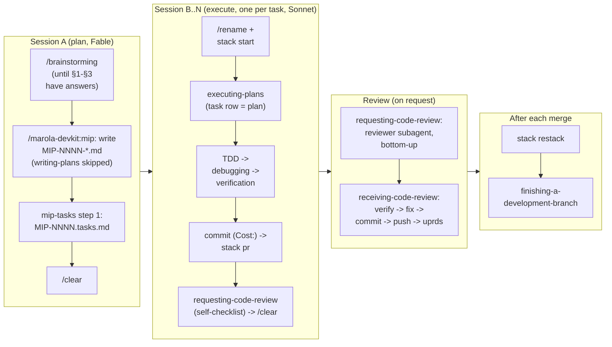

# Agent skills

Which Claude Code skills marola uses, which repo has each, and when to reach for them. Every
loaded skill costs context on every turn, so adopt the ones that map to a real step of the
workflow and skip the rest.

A repo's own skills are plain `SKILL.md` files under its `.claude/skills/`, which OpenCode also
discovers; plugins (marola-devkit, superpowers, skill-creator) are Claude Code only
([MIP-0013](../MIPs/MIP-0013-opencode-tryout.md)). A skill loads only in a session started in the
repo that has it, so start the agent in the repo you are changing.

## 1. Skills across the org

| Where | Skills and agents | Declared in |
|---|---|---|
| The `marola-devkit` plugin | `mip`, `mip-tasks`, `mip-solve-perpetual`, `triage`, `voice-note-ingest`, `voice-to-feature`, `humanizer`, `ponytail`, `ponytail-review`, `ponytail-audit`, `sharingan`/`skill-copy`, `obsidian-vault`; the agents `mip-reviewer` and `mip-claims-auditor` | every repo's `.claude/settings.json`, at the devkit tag |
| marola-site | `site-frontend`, the entry point for anything a visitor sees, which orders the others: `ptbr-humanizer`, `citizen-science-site`, and vendored design, testing and `mapbox-*` skills | its `.claude/skills/` |
| marola-corpus | `corpus-doc` (adding a document) | its `.claude/skills/` |
| marola-app | no skills; the Scala and Kyo rules (`.claude/rules/scala.md`) and the `jar-verifier` agent | its `.claude/` |
| the umbrella | `eli5` (explaining a sea or marola topic from zero; it reads the corpus and the app through the submodules); `architecture-diagram` (a README diagram as a hand-written SVG, adapted from Cocoon-AI/architecture-diagram-generator@4b9087d, MIT); `zenodo-release` (cutting a citable release and keeping `.zenodo.json` right, MIP-0079, adapted from h0ffmann/ww3-gpu's `release`); `citation-cff` (exporting and checking the citation, vendored unchanged from zircote/github-social@4fa6579, MIT) | its `.claude/skills/` |
| marola-ml, marola-oods | no skills of their own | — |
| superpowers, skill-creator | §2 and §2.2 | the umbrella's and marola-app's `.claude/settings.json` |

Each repo's `AGENTS.md` says when its skills apply. corpus's skill runs marola's recipes, so those
steps need a marola-app checkout pointed at the corpus with `MAROLA_KNOWLEDGE_DIR`, as its
`AGENTS.md` says.

## 1.1 marola-devkit plugin skills

What each plugin skill and agent is for, and which a person must start by hand, is on the devkit's
[plugin](https://docs.marola.dev/5-Repos/marola-devkit/4-reference_plugin/) page. Where a vendored
skill disagrees with a repo's `AGENTS.md`, `AGENTS.md` wins.

## 2. superpowers — what fits, what doesn't

The plugin (Jesse Vincent, `obra/superpowers`) ships workflow skills that activate from context. It
is **declared in the repo**, not installed by hand: `.claude/settings.json` has `"enabledPlugins":
{"superpowers@claude-plugins-official": true}`, so Claude Code installs and enables it for whoever
opens the umbrella or marola-app and accepts the trust dialog: the nearest thing to `nix develop`
for plugins (plugin code is cached under `~/.claude/plugins`, not vendored; it is not pinned to a
version). Opt out on one machine with the same key set to `false` in `.claude/settings.local.json`.
Verify with `/plugin` → installed list. Manual install elsewhere: `/plugin install
superpowers@claude-plugins-official`. As of 2026-09-05 it lists these; the mapping to marola's
workflow is ours:

| superpowers skill | Fit for marola | How it slots in |
|---|---|---|
| **brainstorming** | Yes — before a MIP | Socratic refinement of a raw idea (a WhatsApp voice note, a friend's suggestion) *into* the MIP's §1-§3. Stop when the MIP template's sections have answers. |
| **writing-plans** | Partly — overlaps the MIP | A MIP *is* the plan. Use `writing-plans` only to break an accepted MIP into ordered implementation tasks (the §7 verification plan already lists the tests). Don't produce a second plan document. |
| **executing-plans** | Yes — the execute session | Run an accepted MIP's tasks in a fresh session (`/clear`, `/rename <branch>`), with the human checkpoints at: after the first failing test, before any paid cloud resource, before a push. |
| **test-driven-development** | Yes — the testing rule already | `AGENTS.md` asks for a failing test before a fix; marola-app's golden fixture suite and scripted-LLM specs are the harness. Red-green-refactor maps 1:1. |
| **systematic-debugging** | Yes | Especially for the effect/typing errors Kyo produces and for "works live, fails offline" fixture drift. Phase 1 of it (reproduce) = a golden test. |
| **verification-before-completion** | Yes — hard rule | Matches "report outcomes faithfully": the repo's gates, then a live run when data paths changed, then the `Cost:` line. |
| **requesting-code-review** / **receiving-code-review** | Yes — the final review, **on request only** | Reviewer subagent per PR of a stack (BASE = the PR's base branch, HEAD = the task branch, plan = the task row); author verifies findings before acting. Pre-PR checklist = the `Cost:` line, docs updated in the same change, MIP status flipped. [DEV-FLOW §5](DEV-FLOW.md#5-final-review-only-when-asked). |
| **using-git-worktrees** | Yes, for parallel work | One worktree per MIP implementation; pairs with "one feature, one session". The ai-jail sandbox maps the repo directory, so worktrees must live *inside* it or be mapped. |
| **finishing-a-development-branch** | Yes | Squash-merge is the habit; rebuild follow-ups on `origin/main` via cherry-pick rather than stacking. |
| **dispatching-parallel-agents** / **subagent-driven-development** | Selectively | Subagents are where Fable's cost is saved: research, doc review, fixture recording on Sonnet/Haiku. Not for the core scoring/safety code, which the human and the main session should read. |
| **writing-skills** | Used | marola-site's `site-frontend` was written with it (a baseline run without it, then with it); candidates for more below. |
| **using-superpowers** | Read once | Framework intro. |

## 2.1 Using superpowers here — one MIP, start to finish

Superpowers activates from context, so mostly you just work; but here is the explicit sequence
for a MIP, with which skill does what and which session it runs in:

The whole loop (including how a MIP gets *accepted* and what GitHub shows for a stack) is
written once in [DEV-FLOW](DEV-FLOW.md); this section is the skill-by-skill view of it.

What you don't need to invoke by name: superpowers' skills trigger on phrases like "let's plan",
"write the test first", "it's still failing": say what you're doing and the right one loads.
`using-git-worktrees` is optional: with one task per session, a plain branch switch is enough;
use worktrees when two tasks of the same stack are in flight at once.

## 2.2 skill-creator — declared like superpowers

`skill-creator@claude-plugins-official` (Anthropic, Apache-2.0) is in `enabledPlugins` next to
superpowers rather than vendored: its SKILL.md, scripts and eval viewer track upstream, and a copy
here would drift. Use it for the parts of skill work `writing-skills` leaves to you:

- **Evals** — skill-creator's two formats: `{prompt, expected_output, assertions}` output cases in
  `evals/evals.json`, `{query, should_trigger}` trigger sets in `evals/trigger-evals.json`
  (marola-corpus's `corpus-doc` predates the split and keeps its trigger set in `evals.json`).
  `scripts/quick_validate.py` checks frontmatter against the portable spec only, so it flags
  Claude Code's own keys (`model`, `effort`, `argument-hint`, …) — expected.
- **Description tuning** — its trigger-rate loop, when a skill fires too often or never.
- **A new skill from scratch.** Porting one from another repo is the devkit's `sharingan`
  instead, which hands off to skill-creator for the evals step when it is installed.

## 3. Skills still to write (candidates for `writing-skills`)

Proposed, with hooks, rules, subagents and a permission allowlist, as
[MIP-0011](../MIPs/MIP-0011-claude-code-best-practices.md) (task 8 is these four skills). Each
would live in the repo whose code it touches.

- **`fixture-refresh`** (marola-app): re-record the golden fixtures
  ([marola-app's testing](https://docs.marola.dev/5-Repos/marola-app/3-development/#re-recording-the-fixtures))
  and bump the pinned date in `PipelineGoldenSpec`; the most repeated manual procedure.
- **`benchmark-compare`** (marola-ml): run the benchmark twice at temperature 0, diff against
  marola-ml's kept runs, and write the comparison paragraph a PR needs when it touches prompts,
  corpus or embedder.
- **`corpus-doc`**: written, in marola-corpus: a document with a title, one `Source:` URL and
  paragraphs, then one question to marola that should cite it.
- **`water-provider`** (marola-app): probe a new agency feed the way MIP-0001 §4.1 probed IMA, and
  scaffold a `WaterQualityClient` + fixture + spec.

## 4. Not adopted, and why

- Any skill that generates safety text or marine facts: violates the "no unsourced text reaches a
  user" rule (`/marola-devkit:mip`).
