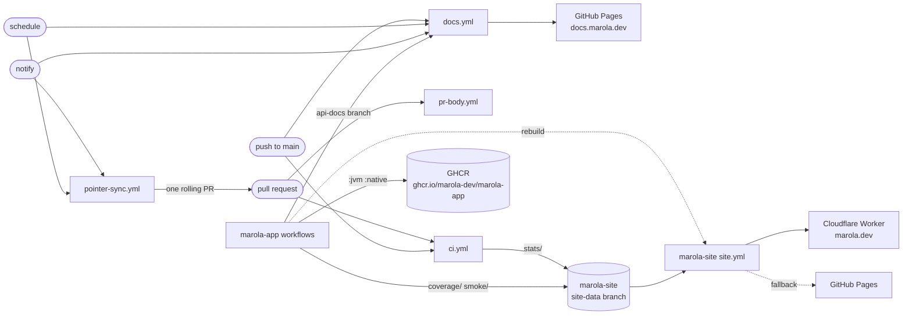
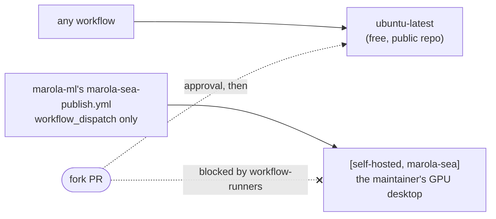

# CI/CD

Every gate and every deploy, in every marola repo, is a GitHub Actions workflow on GitHub's standard
`ubuntu-latest` runner, except marola-ml's GPU publish (below). The design behind this layout is
[MIP-0065](../MIPs/MIP-0065-ci-cd-on-github-hosted-runners.md). The generic jobs are marola-devkit's
[reusable workflows](https://docs.marola.dev/5-Repos/marola-devkit/4-reference_workflows/), called
at the same tag as the flake input; bump them together. This page has the umbrella's own workflows,
the org secret and the settings no workflow can change; each repo's workflows are on its own page.

## How a change reaches marola.dev and docs.marola.dev

Which repo produces each artifact, who reads it and what pins it is REPOS'
[artifacts, pins and dispatches](../2-Building-marola/REPOS.md#artifacts-pins-and-dispatches)
table. Each repo's own CI, releases and secrets:

- marola-app: build, test, the image, e2e, coverage and the release
  ([3-development](https://docs.marola.dev/5-Repos/marola-app/3-development/)).
- marola-site: the map's build and deploy to marola.dev, and its health checks
  ([3-development](https://docs.marola.dev/5-Repos/marola-site/3-development/)).
- marola-corpus: the corpus tarball on each `v*` tag
  ([3-development](https://docs.marola.dev/5-Repos/marola-corpus/3-development/)).
- marola-ml: the prompt compile, the benchmark gate, the ml image and the GPU publish
  ([3-development](https://docs.marola.dev/5-Repos/marola-ml/3-development/)).
- marola-oods: `oods-check` against the pinned app image
  ([3-development](https://docs.marola.dev/5-Repos/marola-oods/3-development/)).
- marola-devkit: its self-tests and the release rule
  ([3-development](https://docs.marola.dev/5-Repos/marola-devkit/3-development/)).

## The workflows

| Workflow | Trigger | Runner | Gates or deploys | Secrets and variables | By hand |
|---|---|---|---|---|---|
| `ci.yml` | PR; push to `main` | `ubuntu-latest` | The merge gates, each run only when `dorny/paths-filter` says its inputs changed: `python-ci` (devkit: ruff and marola's `scripts/*` self-tests), `static-ci` (devkit: actionlint, hadolint and `docker compose config` on the mkdocs stack), `agents-check` (devkit: the AGENTS.md invariants block), `quality-other` (nix: `flake.lock` is current, `just --list`, `workflow-runners`, `docs-lint`), `docs-build` (`docs.yml`'s aggregated `mkdocs --strict`, on the PR's pinned submodule commits). On `main` only: `repo-stats` publishes the stats, Scala lines counted in the marola-app submodule, to marola-site's `site-data` | `GITHUB_TOKEN`, `MAROLA_CROSS_REPO_PAT` | `just quality` locally; re-run from the Actions tab |
| `ci-short-circuit.yml` | PR closed | `ubuntu-latest` | Devkit `ci-short-circuit`: cancels the closed PR's in-flight runs, which the concurrency group can't see | `GITHUB_TOKEN` | — |
| `pr-body.yml` | PR opened, reopened, ready, pushed | `ubuntu-latest` | Devkit `pr-body`: fills the description from the commits (`uprd`); skips forks and bot branches | `GITHUB_TOKEN` | `just uprd` |
| `labels.yml` | dispatch only | `ubuntu-latest` | Devkit `labels-sync`: applies the devkit's label manifest to this repo | `GITHUB_TOKEN` | `gh workflow run labels.yml`; `just labels-sync` locally |
| `docs.yml` | `repository_dispatch: submodule-docs-updated`; push to `main` touching `docs/**`, `mkdocs/**`, `README.md`, `flake.lock` or the docs scripts; daily; dispatch | `ubuntu-latest` | Builds docs.marola.dev from every repo and, on `main`, **deploys** it to Pages (`github-pages` environment): [DOCS-SITE.md](DOCS-SITE.md) | `GITHUB_TOKEN` | `gh workflow run docs.yml`; `just docs` locally |
| `pointer-sync.yml` | `repository_dispatch: submodule-updated` or `submodule-docs-updated`; daily; dispatch | `ubuntu-latest` | The only thing that moves submodule pointers (MIP-0070 §5.6): `scripts/pointer-sync.sh` runs `git submodule update --remote` and commits whatever moved, with `REPOS.md`'s wiring block regenerated by `wiring` (from `nix develop .#lint`) in the same commit, onto `chore/pointer-sync`, force-pushed, with one open PR listing each submodule's old → new commit and a compare link; when `main` has caught up, that PR is closed. Pushed and opened with the PAT so the PR's CI runs | `MAROLA_CROSS_REPO_PAT` | `gh workflow run pointer-sync.yml` |
| `profile-activity.yml` | PR merged into `main` | `ubuntu-latest` (reusable workflow's `runner:` input) | Pings `h0ffmann/h0ffmann` to refresh its activity list; without the token it only leaves a notice | `PROFILE_DISPATCH_TOKEN` | — |
| `pointer-sync-merge.yml` | `CI` or `PR body` completed on `chore/pointer-sync`; hourly; dispatch | `ubuntu-latest` | Squash-merges the sync PR as the `marola-pointer-sync` App (#739) when every check and status on its head passed, the head is still the commit they ran on, and it changes only gitlinks and REPOS.md's wiring table, each moved gitlink on its marola-dev repo's default branch; otherwise one PR comment says why and a person merges it. Each merge is one more push to `main`, so one more `ci.yml` run | `POINTER_SYNC_APP_ID` (variable), `POINTER_SYNC_APP_KEY` | `gh workflow run pointer-sync-merge.yml`; `scripts/pointer-sync-merge.sh --repo marola-dev/marola --dry-run` |

`repo-stats` writes to marola-site's `site-data` through `scripts/site-data-push.sh`, which
retries when two pushes race, and sends no dispatch: the map picks the stats up on its next build.

## The self-hosted rule

No workflow here may run on a self-hosted runner: the one that does, `marola-sea-publish.yml`, is
marola-ml's, and it may never gain a `pull_request`, `pull_request_target` or `workflow_call`
trigger. A `runs-on:` or `runner:` value must be a literal, never a `${{ }}` expression that could
resolve to the desktop. `workflow-runners` enforces this in `quality-other` here and in marola-ml's
CI there.

The repo is public, and on a public repo anyone can open a pull request. A `pull_request` job on
a self-hosted runner would run a fork's code on the maintainer's machine, which is what GitHub
warns against in "Self-hosted runners should almost never be used for public repositories".
Standard hosted runners are free for public repos; larger and GPU runners are always billed, so
GPU training stays on the desktop, behind a manual dispatch.

## The maintainer's manual settings

Repository settings that no workflow or agent can change. MIP-0065 depends on them:

- **Fork PR approval:** Settings → Actions → General → "Require approval for all external
  contributors". The two weaker levels stop asking once a user has had any commit merged.
- **The desktop runner** carries the `marola-sea` label only, so no `runs-on: ubuntu-latest` job
  can land on it. It serves marola-ml's `marola-sea-publish.yml`.
- **No `CI_RUNNER` variable.** The repo's only Actions variable is `POINTER_SYNC_APP_ID`.
- **The app image is marola-app's package**, `ghcr.io/marola-dev/marola-app`. A package's first
  push creates it private:
  either make it public, so `docker pull ghcr.io/marola-dev/marola-app:jvm` works logged out, or
  grant marola-site, marola-ml and marola-oods read access under its "Manage Actions access".
- **Secrets:** `HF_TOKEN` is marola-ml's and `STEWARD_GH_TOKEN` marola-app's (their
  `3-development` pages). Here: optionally `PROFILE_DISPATCH_TOKEN`. `MAROLA_CROSS_REPO_PAT` is an
  org secret: a fine-grained token that needs Contents read and write on **both** marola and
  marola-site (and on each new repo as it is created). marola uses it to push to marola-site's
  `site-data` and to push `chore/pointer-sync` and open its PR (so it also needs Pull requests
  read and write on marola). marola-site and marola-ml use it for their notify-umbrella dispatch,
  and marola-ml to open compiled-prompt PRs in marola-app; every dispatch is in REPOS'
  [wiring table](../2-Building-marola/REPOS.md#artifacts-pins-and-dispatches).
- **The `marola-pointer-sync` App** (#739): installed on marola only, with Contents and Pull
  requests write and Checks, Statuses and Metadata read, and a pull-request-only bypass actor on
  `main-rule`, so it can merge a PR without review but never push to `main`. Only
  `pointer-sync-merge.yml` mints its token, and it merges only when every moved pointer is on its
  repo's default branch, never a fork's commit that GitHub also serves through the parent repo. Its id is the `POINTER_SYNC_APP_ID` variable and its
  private key the `POINTER_SYNC_APP_KEY` secret; whoever holds that key can merge any PR into
  marola's `main` unreviewed. To rotate it, generate a new key in the App's settings, run
  `gh secret set POINTER_SYNC_APP_KEY -R marola-dev/marola < new-key.pem`, then delete the old key.
- **Pages:** source "GitHub Actions", custom domain `docs.marola.dev` (a DNS `CNAME` to
  `marola-dev.github.io`). An Actions-deployed site ignores a `CNAME` file, so the domain lives
  only in this setting.
