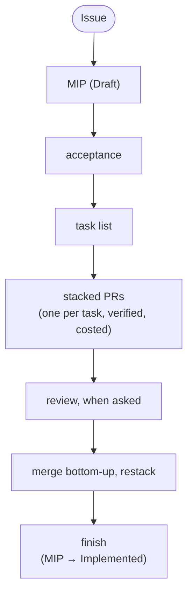
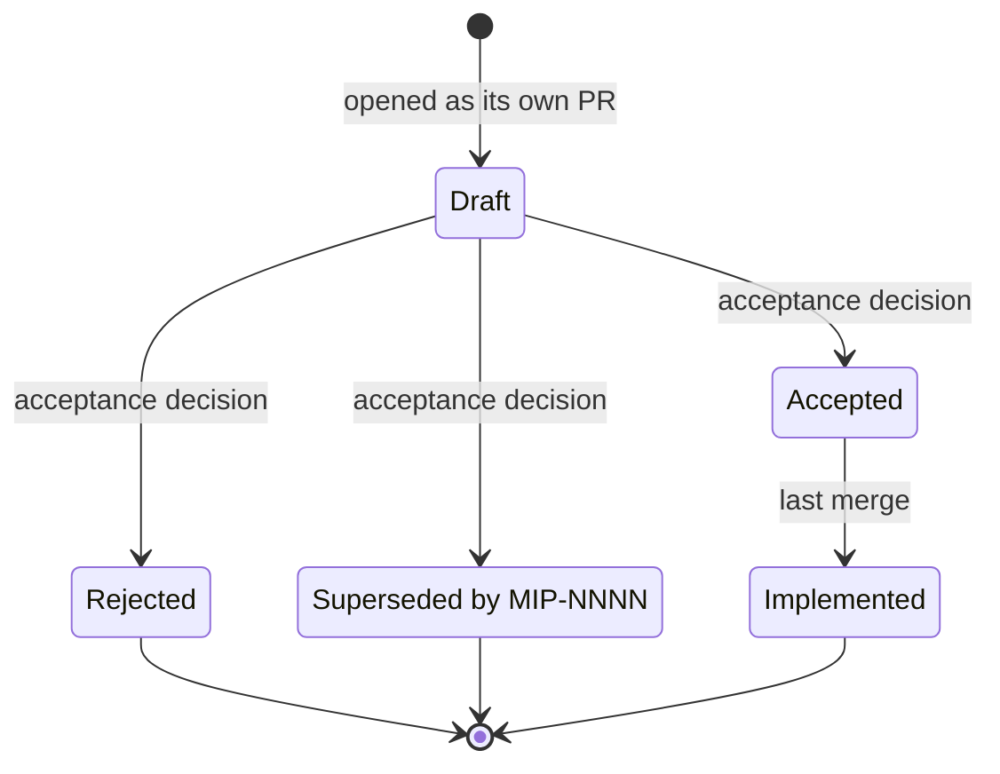
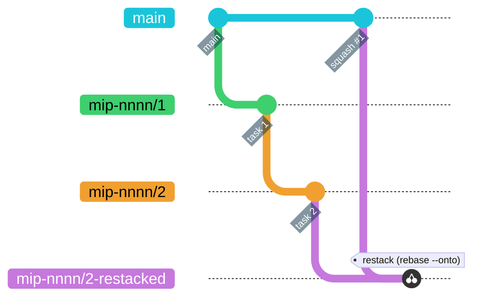

# Development flow



This page is the one place the whole loop is written down, and it holds in every repo. The pieces
live in the `/marola-devkit:mip` and `/marola-devkit:mip-tasks` skills, `AGENTS.md` (the hard
rules), [AGENT-SKILLS](AGENT-SKILLS.md) (which skill does what) and the devkit's
[tools](https://docs.marola.dev/5-Repos/marola-devkit/4-reference_tools/) (`stack`, `uprd`,
`issues`, `cost-split`, …, on `PATH` inside `nix develop`). MIPs and their task files live in the
umbrella's `docs/MIPs/`; the code they change lives in the repo each task names. A change that
spans repos also follows [WORKING-ACROSS-REPOS](WORKING-ACROSS-REPOS.md).

Sessions: one per MIP for planning, one per task for execution (`/clear`, `/rename
mip-nnnn/k-slug`), one per review. That is what makes `/usage` and `just claude-cost` map to PRs.

## 1. From an idea to an issue, then a MIP (Draft)

1. **File the issue first** — the idea is not work until it is one, and the tier decides what
   follows: tier 1 (bug, chore, docs) and tier 2 (small enhancement, the issue body *is* the spec)
   stop here and go straight to §4; only tier 3 (a new data source, a scoring change, a new
   integration, anything paid) continues into a MIP, as a **MIP proposal** issue that is
   relabelled rather than replaced when the MIP PR opens. Filing is a human's act: the `/marola-devkit:triage`
   skill drafts the body and runs the readiness check, a person presses the button
   ([ISSUE-FLOW](ISSUE-FLOW.md), MIP-0063 §5.6). An agent picks work up from `just issue-queue` and takes
   it with `just issue-claim <n>`; it may not start on an issue without `agent-ready`.
2. **Refine the idea**: superpowers `brainstorming` (activates on "let's plan", "I have an idea"):
   Socratic questions until MIP §1-§3 (summary, motivation, user-visible change) have answers.
   Voice notes and chat pastes go through `just context-mips` + a browser session first
   ([below](#voice-notes-into-mips-in-a-browser-session)).
3. **Write the MIP**: the `/marola-devkit:mip` skill: next number from `docs/MIPs/README.md`, the template,
   every external claim fetched and dated, what was *not* checked said so, open questions listed.
   Add the index row. Link it from [FUTURE-WORK](../4-Research-and-plans/FUTURE-WORK.md) if it
   closes something.
4. **Open it as its own PR**, status **Draft**. A MIP is never built in the same change (`mip`
   skill, step 8). The PR body ends with a `Cost:` line like any other.

### Voice notes into MIPs in a browser session

`just context-mips` packs what a MIP author needs, and no code, with repomix into
`.tmp/marola-context-mips.md` and copies it to the clipboard: the README, AGENTS.md, marola-app's
README (so run `git submodule update --init` first), ARCHITECTURE, PHASES, FUTURE-WORK, the
`/marola-devkit:mip` skill and every existing MIP. In a browser Claude chat, paste it, attach the
WhatsApp voice notes (`.ogg`) or the chat text, and say "convert the audios into MIP proposals".
The pack's instruction section (`repomix-instruction.md`) fixes the template, the numbering, the
transcript appendix and the rule that unverified claims go under "Open questions". Save the
returned files under `docs/MIPs/` and let the in-repo agent verify the sources.

## 2. Acceptance

Acceptance is a human decision, recorded in the MIP's status table and the index. The reviewer
of a MIP PR reads, in this order:

- **§4 sources and dependencies**: was each claim verified (URL + date)? Anything unverified must
  sit in §11, not in §5.
- **§6 scoring / safety**: deterministic, in marola-app's `scoring` package, unit-tested; never
  model output.
  **Phase** row against `AGENTS.md`'s phase discipline: a later-phase MIP is fine to accept, but
  the missing earlier-phase prerequisite must be named.
- **§8 caveats and §11 open questions**: answer what can be answered now; what cannot becomes a
  numbered decision in the tasks file (next section), so implementation is never blocked on it.
- **Cost**: the MIP's own cost model (§4/§8) and whether any paid resource is involved
  (`AGENTS.md`: a paid cloud resource needs an explicit go-ahead, in the MIP, before any task).

Outcome: **Accepted** (status row + `docs/MIPs/README.md`, in the MIP PR or a one-line follow-up
commit), **Rejected** (keep the file; the reasoning is the value) or **Superseded by MIP-NNNN**.
"Implement MIP-NNNN" from the human counts as acceptance; the first task's commit flips the
status to `Accepted` and links the tasks file.

The status row's own lifecycle:



## 3. The task list

`mip-tasks` step 1 (superpowers `writing-plans` is skipped: the MIP is the plan): read the MIP,
`AGENTS.md` and the code it touches, write `docs/MIPs/MIP-NNNN.tasks.md`:

- one row per task = one PR in one repo (its `delivers` cell): ≤ ~400 changed lines, one concern,
  **its test named up front** (from MIP §7), green on that repo's gates by itself;
- ordered by dependency, then risk; docs travel with the task that changes behaviour;
- a **Decisions** list answering the MIP's §11 for v1, so nothing is re-litigated per task;
- a restack note: no task rewrites a file an earlier task created.

The tasks file is committed in the umbrella; the MIP gets a `Tasks:` row. Project it into
GitHub with `just tasks-to-issues MIP-NNNN`: a parent issue in the umbrella, one sub-issue per row
in the repo that row delivers to, each row's `#` cell rewritten into a link, one native
`blocked by` edge per `depends on` entry. One-way and re-runnable — after it, the issues own
status and the file owns the plan.

## 4. Stacked PRs — one task, one branch, one PR

Per task, in its own session, started in the repo the task delivers to (superpowers
`executing-plans`: the task row is the plan; checkpoints = first failing test, before push). In a
submodule, branch from that repo's `origin/main`
([WORKING-ACROSS-REPOS](WORKING-ACROSS-REPOS.md#branch-inside-a-submodule)):

```bash
stack start MIP-NNNN <k> <slug>        # branch mip-nnnn/k-slug off the nearest lower task branch in this repo, else origin/main
# red → green → refactor  (superpowers test-driven-development; systematic-debugging when green won't come)
just quality                                       # the repo's gates (its AGENTS.md names them) + a live check whenever a data path changed (superpowers verification-before-completion: evidence, then the claim)
git commit                                         # message ends with Tested: and Cost: trailers (AGENTS.md) — the PR's Tested/Cost sections come from them
just pr                                            # fills any missing trailer and a task's Closes line (just cost-fill), pushes, opens/updates the PR — stack pr's base logic on a mip-NNNN/k-* branch
```

The git history this produces — two stacked tasks, squash-merged bottom-up, then restacked:



`just pr --dry-run` prints every step (the trailers `cost-fill` would add, the body `uprd` would
write) without pushing or touching `gh`. It refuses the same way the real run would (on `main`, or a
dirty tree) so the preview matches what actually happens.

Every push (`stack pr`, `just uprds`, a plain `git push`) goes through the devkit's pre-push
hook, which runs the repo's `just prepush`: the gates CI would fail the push on (here
`just quality-other`; each repo's AGENTS.md names its own). Code is linted before the last push,
not found red in CI after the merge; `git push --no-verify` skips the hook, CI does not.

Or, once every branch of the stack is pushed, all PRs at once with their shared "Stack" section:

```bash
just uprds MIP-NNNN         # regenerate every PR body (What changed + Cost + Stack), create the missing PRs on the right base
just stack-link MIP-NNNN    # link the open PRs into a GitHub Stack (gh stack link) — the "Preview stack" box in the PR UI, from the CLI
just stack-view             # the stack as GitHub sees it; just stack status MIP-NNNN for the local view
```

What GitHub shows: a stacked PR is a PR whose base is the previous branch; its page says "into
`mip-nnnn/1-…` from `mip-nnnn/2-…`" and its diff is that task alone. The Stack (native GitHub
feature, `gh stack`) adds the ordered list at the top of each PR; `just uprds` writes the same list
at the end of each body, with the summed Cost, for readers without the feature.

A PR opened any other way (the GitHub UI's "Compare & pull request", a bare `gh pr create`) gets
the same body without anyone running `just uprd`: `.github/workflows/pr-body.yml` runs
`uprd <PR#>` when the PR is opened, reopened, marked ready, or gets new commits, as long
as the body is empty, still the raw template, or carries uprd's own first-line marker (a
hand-written body is left alone; delete the marker line to stop regeneration). It also replaces a
title that is still the branch name with the first commit's subject. Forks and bot PRs are skipped.

The generated body follows `.github/PULL_REQUEST_TEMPLATE.md`'s shape: bold labels, a compact
MIP/Tested/Cost table, no `#` headings, one screen for a typical two-commit PR; the PR title is
the first commit's subject on the branch, capped at 70 characters (the devkit's [`scripts/lib/uprd_title.sh`](https://github.com/marola-dev/marola-devkit/blob/v0.4.1/scripts/lib/uprd_title.sh)) so
it stays skimmable. `just uprd`/`just uprds` print a warning when a title had to be cut, worth a
manual retitle if the cut reads awkwardly.

Cost: a measured figure is always preferred over an estimate. One session per task → `/usage` or
`just claude-cost`. One session for several tasks → `just cost-split MIP-NNNN` splits the session
log by commit time (subagent transcripts included: `<session>/subagents/*.jsonl`) and prints the
trailer per branch; amend with `GIT_COMMITTER_DATE` preserved so the split stays stable, re-stack,
force-push with lease, `just uprds`. Nothing logged at all for a commit (a subagent whose worktree
session never re-attached, a commit from another machine) → `just cost-fill` (or plain `just pr`)
adds `cost-split --estimate`'s diff-size estimate instead, always labelled `est.` so it
reads differently from a measured number at a glance.

## 5. Final review — only when asked

Nothing reviews a PR automatically. (Proposed change: [MIP-0060](../MIPs/MIP-0060-open-code-review-on-ready.md),
an advisory local-model pass when a PR is marked ready.) Reviews start when the human says so ("review the stack",
"claude review #21", `/code-review`). Three ways, cheapest first; all of them review **one PR
against its own base**, bottom of the stack first, because that is the diff a reviewer sees.

1. **superpowers `requesting-code-review`**: in a fresh session, per PR: dispatch the reviewer
   subagent with `BASE_SHA = git rev-parse origin/<base branch>`, `HEAD_SHA = git rev-parse
   origin/<task branch>`, `PLAN_OR_REQUIREMENTS` = the task's row in `MIP-NNNN.tasks.md` plus the
   MIP's §6/§7, `DESCRIPTION` = the PR title. It returns Critical/Important/Minor findings; fix
   Critical and Important before merging, note Minor in the PR. This is the default for "final
   review using superpowers".
2. **`/code-review <PR#>`** (built-in; `--comment` posts the findings as inline PR comments) or the
   `code-review` plugin's `/code-review` (five parallel agents, ≥ 80-confidence findings only,
   one comment on the PR). Both look for `CLAUDE.md`; in every marola repo it imports `AGENTS.md` for
   Claude Code sessions and tells any tool reading it as plain text to open `AGENTS.md`. The
   plugin's confidence scorer only credits rules it can read, so keep that instruction there.
3. **`/code-review ultra <PR#>`**: the multi-agent cloud review, for the riskiest PR of a stack
   (scoring, safety text, a new data source). User-triggered and billed; never launched by the agent.
4. **`/gemini review`** as a PR comment, in a repo that installed Gemini Code Assist on GitHub
   (marola-app: its [code review](https://docs.marola.dev/5-Repos/marola-app/3-development/#code-review)
   setup). Free, advisory, on request only, and skips `.github/workflows/**` by design. Source goes
   to Google, so a human installs it, never an agent.
   [GEMINI-CODE-ASSIST](../4-Research-and-plans/GEMINI-CODE-ASSIST.md) is the evaluation.

Author side: superpowers `receiving-code-review`: verify each finding before implementing it,
push back with reasoning when it is wrong, then fix → commit (`Cost:` trailer) → push → `just
uprds MIP-NNNN`. Pre-review checklist (superpowers `requesting-code-review` + this repo): Cost
line present and measured; docs updated in the same PR; the test named in the tasks row exists and
is green; MIP status right.

## 6. Merge, restack, finish

- Approve per PR (GitHub reviews are per PR), then merge either one at a time or the whole stack
  at once: `just stack-merge <stack#> --squash` merges every PR of the stack bottom-up in one
  all-or-nothing operation (`gh stack merge`), no restack in between.
- One at a time: **bottom-up**, squash (the repo's habit). GitHub retargets the next PR to `main`
  when the merged branch is deleted; the commits still need a rebase:
  `stack restack` on the next branch, or `just stack-sync MIP-NNNN` for the whole
  stack (it adopts the stack from GitHub first; `gh stack link` keeps no local state).
- A task branch's own commit carries `Closes #N` for the issue its `MIP-NNNN.tasks.md` row links
  (`cost-fill`, run by `stack pr` — itself run by `just pr`, or directly per
  step 2 of `/marola-devkit:mip-tasks` — writes it above the trailers), so the
  squash-merge commit on `main` closes the issue and the board moves it to Done. The PR body
  carries the same line too (`uprd` copies it there so the link shows on GitHub), but in this
  repo the body-only line did not close anything: #514–#519 carried it and their issues
  #502–#507 stayed open past merge (cause unknown, #524), while #511/#512 closed on a commit-body
  one. `TASK_PARTIAL=1 just pr` skips the line for a task that only delivers part of its row,
  before the PR (and its `task-partial` label) exist; the issue stays open. A PR merged into
  another task branch closes nothing regardless; GitHub honours the keyword only on the default
  branch.
- `stack status` / `just stack-view` until every PR is merged.
- Last merge: superpowers `finishing-a-development-branch`: full suite green, delete the task
  branches, flip the MIP to **Implemented** with the PR numbers and the summed Cost in its status
  row, update `docs/MIPs/README.md`. A follow-up after a merge is a new branch off `main`, never a
  child of the old one. Across repos, the umbrella's pointers then move through the sync PR
  ([WORKING-ACROSS-REPOS](WORKING-ACROSS-REPOS.md#producer-first-pointer-last)).

### Dependency PRs

dependabot (each repo's `.github/dependabot.yml`) and, in marola-app, scala-steward
(its `.github/workflows/scala-steward.yml`) each open their own one-off PR per bump. Left alone, ten open bumps cost ten separate CI runs to
land. `just deps-stack` chains the open **dependabot** PRs (`--include-steward` adds
scala-steward's, once its author identity on this repo is confirmed; see
`deps-stack`'s header) into one `deps/<date>/k-slug` stack, github-actions PRs first
then pip, same shape as a MIP's task branches: run it weekly, or right before a release, rather
than merging bumps one at a time. A PR's head branch can't be moved after it's opened, so the
default (and only implemented) path opens one *new* PR per chain branch, stacked on the previous,
and closes each original dependabot PR with a pointer comment. dependabot's own branches are
never touched, so an abandoned stack doesn't stop dependabot from re-opening or updating them
normally. The whole chain is built in a dedicated worktree, `.tmp/wt-deps-stack`, never your own
checkout: a run of `just deps-stack` (`status`, `clean`, `--resume`, or a conflict mid-run
included) never switches your branch or touches your index. Two dependency bumps landing on
adjacent lines of the same file (the only conflict shape dependabot produces) resolve
themselves: `*requirements*.txt` keeps the higher lower bound per package
(the devkit's [`scripts/lib/req_merge.py`](https://github.com/marola-dev/marola-devkit/blob/v0.4.1/scripts/lib/req_merge.py)), a workflow's `uses: owner/action@vN` steps keep the higher version
per action ([`scripts/lib/uses_merge.py`](https://github.com/marola-dev/marola-devkit/blob/v0.4.1/scripts/lib/uses_merge.py), the `actions/checkout@v7`-next-to-`hadolint-action@v3.5.0`
case); anything else still stops the script
with the branch left mid-cherry-pick in that worktree and prints the exact `cd .tmp/wt-deps-stack
&& git status` / resolve / `git cherry-pick --continue` / `just deps-stack --resume` steps. Once
the chain is up, it's a normal stack: `gh stack link` runs automatically, `just stack-merge
<stack#> --squash` merges it bottom-up in one CI run instead of one-per-bump, and `just deps-stack
clean` deletes the chain branches (and the worktree) once every stacked PR shows MERGED.

### MIP draft PRs

Drafts pile up the same way bumps do: one `docs/mip-NNNN-*` branch per proposal, each open for
days, and they fight over one line: every draft appends its row to `docs/MIPs/README.md` at the
same place, so the moment one merges the rest conflict there. `just mip-stack` chains the open
draft PRs (any PR whose head is `docs/mip-*` or that adds a `docs/MIPs/MIP-NNNN-*.md`; task
branches `mip-NNNN/k-*` are left to `stack`) into one `mips/<date>/k-slug` stack
ordered by MIP number, the exact shape `just deps-stack` gives dependabot: built in its own
worktree (`.tmp/wt-mip-stack`), one new PR per chain branch stacked on the previous, the original
PR closed with a pointer, `gh stack link` at the end, `just mip-stack status` / `clean` /
`--resume` / `--skip` / `--dry-run` as for deps. The index-row conflict resolves itself
(the devkit's [`scripts/lib/mip_index_merge.py`](https://github.com/marola-dev/marola-devkit/blob/v0.4.1/scripts/lib/mip_index_merge.py): both sides' rows, one per MIP, in number order; the same row
edited differently on both sides is a real edit and stops for a human). A draft that merged
another draft's branch to stay mergeable is fine: merge commits are skipped and commits the
chain already carries are dropped by patch-id. Then `just stack-merge <stack#> --squash` lands
the lot bottom-up.

## 7. Overnight/unattended runs

`/marola-devkit:mip-solve-perpetual` works through a task file unattended. Its mechanics, the
usage guard (and what the `heavy-usage` plugin can and cannot stop) and the stop conditions are on
the devkit's [runners](https://docs.marola.dev/5-Repos/marola-devkit/4-reference_runners/#unattended-mip-runs)
page; the skill itself is on its [plugin](https://docs.marola.dev/5-Repos/marola-devkit/4-reference_plugin/)
page. Merging stays a human act: every repo's `.claude/settings.json` should deny `gh pr merge`,
`gh pr close`, `gh stack merge`, `gh stack unstack` and `gh stack delete`; check it before a run.

## 8. The docs site

Moved to [DOCS-SITE.md](DOCS-SITE.md): what the build mounts where, the landing and link rules, the
per-repo skeleton and ADRs, redirects, the checks, preview and deploy.

## 9. Command reference

Every devkit tool and recipe used above (PRs and stacks, cost and trailers, issues and the board,
labels and rulesets) is on the devkit's
[tools](https://docs.marola.dev/5-Repos/marola-devkit/4-reference_tools/) page. Each repo's gates
are in its `AGENTS.md` and its `3-development` page, the umbrella's recipes are `just --list`
here, and which checkout a recipe needs is in
[WORKING-ACROSS-REPOS](WORKING-ACROSS-REPOS.md#which-checkout-a-recipe-needs).
