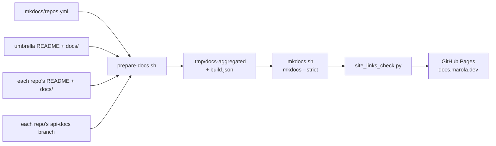

# The docs site

<https://docs.marola.dev/> is built from every repo: this one at the root and each other repo at
`5-Repos/<name>/`. mkdocs-material renders it, with a self-hosted Kroki for the diagram fences
([MIP-0064](../MIPs/MIP-0064-mkdocs-documentation-site.md)). The layout and its rules are
[MIP-0074](../MIPs/MIP-0074-docs-umbrella-landing-and-repo-docs.md)'s. Prose ships the way code
does, with the same gates.

## How a build runs



[`scripts/prepare-docs.sh`](../../scripts/prepare-docs.sh) writes the site's source tree into the
gitignored `.tmp/docs-aggregated/`; the tracked `docs/` is never written to.

| Source | Mounted at |
|---|---|
| this repo's `README.md` | `index.md`, the site's landing |
| this repo's `docs/**` | the root (`1-Using-marola/` … `4-Research-and-plans/`, `PHASES.md`) |
| this repo's `docs/MIPs/` | `6-MIPs/` |
| each repo in [`mkdocs/repos.yml`](../../mkdocs/repos.yml): its `README.md`, then `docs/**` | `5-Repos/<name>/index.md`, then beside it |
| that repo's `api-docs` branch | `5-Repos/<name>/api-docs/` |

**Which commit.** `docs.yml` builds each submodule at its `main` tip (`git submodule update
--remote`), not at the umbrella's pointers, so the prose follows the code readers see on GitHub.
`ci.yml`'s `docs-build` builds a PR at its pinned commits. marola-devkit is not a submodule: it is
fetched at `flake.lock`'s locked rev, the version every repo runs. `build.json` records the commit
each repo was built from, and each landing ends with a line naming it.

**What it generates.** Each repo's `adr/index.md`, below. A repo's `api-docs` branch is unpacked by
[`scripts/fetch-api-docs.sh`](../../scripts/fetch-api-docs.sh); a repo without one gets a notice,
and a link into its `api-docs/` then fails as broken.

## The landing rule

A repo's `README.md` is its landing page, this repo's included. No repo has a `docs/index.md`:
prepare-docs fails a repo that has both, and one with no README. The landing's shape is
[MIP-0074 §5.2](../MIPs/MIP-0074-docs-umbrella-landing-and-repo-docs.md#52-the-per-repo-skeleton):
what the repo is with a status line, run or try it, repo map, contracts, docs and AGENTS.md links.

## Links

Write every link so it works on GitHub; prepare-docs rewrites it for the site
([MIP-0074 Appendix A](../MIPs/MIP-0074-docs-umbrella-landing-and-repo-docs.md#a-link-rewrite-rules-53)
has every rule).

- **Inside a repo, relative.** `docs/x.md` from the README becomes `x.md`, `docs/` the landing,
  `../README.md` from a page the landing, `docs/adr/` the generated ADR index.
- **Outside `docs/`, relative too.** A file or directory elsewhere in the repo (`AGENTS.md`,
  `scripts/x.sh`, `mkdocs/`) becomes a GitHub link at the built commit, and so does a page under
  `exclude_docs` (`benchmarks/`). A repo's `AGENTS.md` rule to link such files by
  GitHub URL is no longer needed: a relative link works on GitHub and is pinned on the site. An
  own-repo `github.com/marola-dev/<repo>/blob/<branch>/…` link is pinned to the built commit too.
- **Across repos, absolute** `https://docs.marola.dev/…`, the umbrella included. A link that leaves
  the repo with `../` fails. Only the umbrella may link into a submodule's path
  (`marola-app/docs/x.md`), which becomes its site page, or its code, which becomes GitHub.
- **Refused:** `docs/index.md`, a root-absolute `/…` link (link `api-docs/…` relatively), an image
  outside `docs/`, a directory with no `index.md`, a path missing at the built commit. Each failure
  names the file and the link.
- Code spans and fences are left alone.
- **Recipes.** A doc names only its own repo's recipes and the devkit's. Any other carries the
  checkout marker: "in a marola-<name> checkout" in the same sentence, or
  `# in a marola-<name> checkout` as a fence's first line. `docs-lint` reads it.

## The skeleton

The umbrella holds what spans repos, in numbered directories:

| Directory | For |
|---|---|
| `docs/1-Using-marola/` | someone running marola, and what it cannot tell you |
| `docs/2-Building-marola/` | the system: architecture, the repos and how they connect |
| `docs/3-Ways-of-working/` | the process every repo follows |
| `docs/4-Research-and-plans/` | surveys and plans, most of them not built |
| `docs/MIPs/` | the proposals, served at `6-MIPs/` |

A code repo's `docs/` holds only what is specific to it, as numbered pages rather than
directories:

| Page | Holds |
|---|---|
| `1-design.md` | patterns, module map, effect boundary |
| `2-libraries.md` | each library and pinned tool: why, version, alternatives |
| `3-development.md` | this repo's build, test, CI, releases, secrets and cost |
| `4-reference.md` | config, CLI, data formats, hand-written API notes |
| `adr/NNNN-<slug>.md` | one decision that starts and ends inside the repo |

The nav label is the page's H1 and the order is the file name's; there is no `nav:`, so a new page
needs no edit to `mkdocs.yml`. A page that outgrows itself splits into `_` siblings, which sort
after it: `1-design.md`, then `1-design_integrations.md`. General guidelines (how every repo tests,
releases, reviews) are pages here, which repo pages link and do not restate.

### ADRs

An ADR records a decision inside one repo; anything crossing a repo boundary, or visible to users,
is a MIP. prepare-docs generates `adr/index.md` (number, title, status) from each
`docs/adr/NNNN-<slug>.md`, and fails a hand-written `docs/adr/index.md` (or `README.md`) and an ADR
without the H1 or the Status row. The template:

```markdown
# ADR-NNNN: <the decision, as one sentence>

| | |
|---|---|
| **Status** | Proposed / Accepted / Superseded by ADR-NNNN |
| **Date** | YYYY-MM-DD |
| **Related** | MIP-NNNN, PR #N, ADR-NNNN |

## Context
## Decision
## Consequences
## Alternatives
```

### API docs

Generated output only, never committed to a default branch: Scaladoc for marola-app, pdoc for
marola-ml. On a push to `main`, the devkit's `api-docs` workflow runs the repo's generator and
force-pushes one commit, the output plus its source sha in the message, to an orphan `api-docs`
branch, so the branch never grows. On a PR the same generator runs as a check and commits nothing.
The site fetches the branch (above); hand-written API notes go in `4-reference`.

## Redirects

A page that moves gets a `redirect_maps` entry in [`mkdocs/mkdocs.yml`](../../mkdocs/mkdocs.yml) in
the same PR, or PR pair when it is another repo's page. Whole-prefix moves (`/repos/`, `/MIPs/`,
`/api/`) are forwarded by [`mkdocs/overrides/404.html`](../../mkdocs/overrides/404.html), longest
prefix first, keeping path, query and hash; `node scripts/docs_redirect_check.js` tests it.

## The checks

| Check | Where | Catches |
|---|---|---|
| `prepare-docs.sh` | every build | the landing rule, refused links, a broken relative link (Markdown or HTML `href`/`src`), a hand-written ADR index |
| `mkdocs --strict` | every build | an unresolved page link; anchors are warnings |
| `strip_external_scripts.py --check` | `docs.yml` | a third-party script in the output |
| [`site_links_check.py`](../../scripts/site_links_check.py) | `docs-build` on a PR, and `docs.yml` before deploy | a `https://docs.marola.dev/…` link that resolves to nothing, and a URL of the live sitemap (fetched before the build) that is now neither a page, a redirect nor a forward |
| `docs-lint` (devkit) | each repo's `quality-other`, once its tree passes | a foreign recipe without the checkout marker, another repo's paths, `docs/index.md`, a link leaving the repo |

`--self-test` covers each script; `just quality` runs them.

## Preview

`just docs-serve` builds the whole site from your checkout and serves it on
<http://localhost:8001/>. The docs are baked into the image, so an edit needs a restart, not a
reload. `just docs` is the build alone. Both need `git submodule update --init` and a Docker or
Podman daemon, and neither is part of `just quality`, so a docs change is previewed by hand. To
preview a submodule's change, check its branch out under the umbrella first.

## How it ships

`docs.yml` builds and deploys to GitHub Pages on a push to `main` touching `docs/**`, `mkdocs/**`,
`README.md`, `flake.lock` or the docs scripts; on a `submodule-docs-updated` dispatch, which each
repo's `notify-umbrella.yml` sends (with the `submodule-updated` it sends on every push to `main`)
when the push touched `README.md` or `docs/**`; daily; and by hand. No code is built: API
docs come from the `api-docs` branches.
