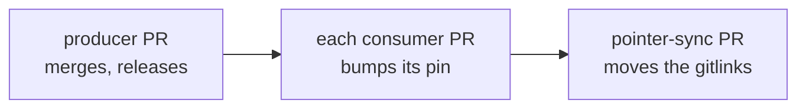

# Working across repos

marola is one umbrella, `marola-dev/marola`, with every code repo as a git submodule
([REPOS](../2-Building-marola/REPOS.md) has what each one owns). This page is how a change moves
through them. Why the code was split is [SPLIT](../2-Building-marola/SPLIT.md).

## Clone

```bash
git clone --recurse-submodules https://github.com/marola-dev/marola
git submodule update --init      # in an existing clone: every repo at its pinned commit
```

marola-devkit is not a submodule: each repo's `flake.lock` pins it, and `nix develop` links the
pinned tree at `.devkit`.

## Branch inside a submodule

A submodule is checked out on a detached HEAD at the commit the umbrella pins. To change one,
work in it as its own repo:

```bash
cd marola-app
git fetch origin && git switch -c fix/some-slug origin/main
# its gates (its AGENTS.md names them), commit, then
just pr                          # pushes and opens the PR against marola-app
```

Start the coding agent in that directory too, so its `CLAUDE.md`, settings and hooks load. Never
commit inside a submodule from the umbrella's own branch, and never commit the umbrella's pointer
to it by hand.

## Where a change belongs

- **One repo**: code, its docs, its workflows and its issues live in that repo, under its
  `AGENTS.md`. Most changes are this.
- **The umbrella**: how the team works, a MIP, the phase list, a page that spans repos, the docs
  site.
- **Across repos**: a contract changes (an artifact, a pin, a dispatch). Plan it first, in a MIP
  when it is non-trivial.

A page belongs to the umbrella when its reader needs no single repo's code to act on it; anything
specific to one repo is that repo's `docs/`
([DOCS-SITE](DOCS-SITE.md#the-skeleton)).

## Producer first, pointer last

Every artifact one repo produces and another reads, with the file or setting that pins it, is in
REPOS' [artifacts, pins and dispatches](../2-Building-marola/REPOS.md#artifacts-pins-and-dispatches)
table, its only copy. No repo reads another repo's tree, in CI or in tests, and no consumer builds
its producer from source. A contract change lands in this order:



1. The producer merges and releases (a tag, an image, a branch).
2. Each consumer bumps its pin in its own PR and runs its gates against the new version.
3. The umbrella's pointers move last, through the sync PR: `pointer-sync.yml` moves every
   submodule to its default branch's tip and keeps one rolling PR on `chore/pointer-sync`
   ([CI/CD](CI-CD.md#the-workflows)). It is the only thing that moves a pointer.

A devkit release is the same: the devkit tags, then each repo moves every devkit pin (REPOS'
[wiring table](../2-Building-marola/REPOS.md#artifacts-pins-and-dispatches)) together, in one PR.

## Cross-repo PRs

One branch name in every repo, one PR per repo, each PR linking the others with fully qualified
references. Each PR passes its own repo's gates on its own; the merge order is the one above. A MIP
whose tasks span repos uses `stack` per repo, and a task whose dependency lives in another repo
starts once that PR has merged
([DEV-FLOW §4](DEV-FLOW.md#4-stacked-prs-one-task-one-branch-one-pr)).

## Issues

- One issue per PR, in the repo the PR lands in, so `Closes #N` stays local.
- Cross-repo work is an umbrella parent issue with one sub-issue in each target repo;
  `just tasks-to-issues MIP-NNNN` files a MIP's task table that way.
- Every issue sits on the org [Project](https://github.com/orgs/marola-dev/projects/1).
- A reference to another repo's issue or PR is always fully qualified:
  `marola-dev/marola-app#15`.

The tiers, the Definition of Ready and the board are [ISSUE-FLOW](ISSUE-FLOW.md).

## Which checkout a recipe needs

| Recipes | Run in |
|---|---|
| the devkit's: `just pr`, `uprd`, `stack`, `issue-queue`, `issue-claim`, `cost-split`, `labels-sync`, … | any repo |
| `just quality`, `precommit`, `prepush` | every repo, each running its own gates |
| `just docs`, `docs-serve`, `context-mips`, `context-mip`, `worktree`, `jail-claude` | the umbrella |
| `just build`, `test`, `run`, `ask`, `e2e` | in a marola-app checkout |
| `just compile-prompt`, `benchmark-gate`, `finetune-*` | in a marola-ml checkout |
| `just site-build`, `site-serve` | in a marola-site checkout |

A doc names only its own repo's recipes and the devkit's; any other recipe carries the checkout
marker, as the table does ([DOCS-SITE](DOCS-SITE.md#links)).
