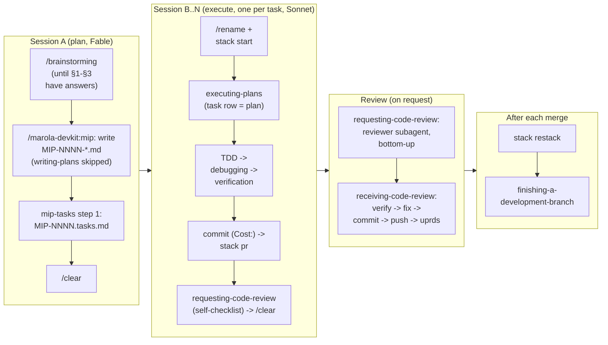

# Agent skills

Which Claude Code skills to use here, in-repo and from the **superpowers** plugin, and when. The
rule of thumb from `AGENTS.md`: every loaded skill costs context on every turn, so adopt the ones
that map to a real step of this repo's workflow and skip the rest.

Harness note: the in-repo skills (§1) are plain `SKILL.md` files that OpenCode also discovers
(`.claude/skills/` is on its search path); the marola-devkit plugin (§1.1) and superpowers (§2)
are Claude Code only. See
`docs/MIPs/MIP-0013-opencode-tryout.md`.

## 1. In-repo skills (`.claude/skills/`)

| Skill | Use when | Notes |
|---|---|---|
| `site-frontend` | Any change to what a visitor sees on the static map (`site/static/`), or a request to make it "modern", "appealing", a better first impression | The product layer for the page: look at the built page first (its `site_check.js` stub-DOM harness runs `app.js` against `site/dist`), one type scale, the data colours untouched, a red-flags list for the generated look. Written with `writing-skills`: a baseline agent produced a gradient header, frosted pills, Tailwind hex codes and 250 unrendered CSS lines; the recipe targets exactly that |
| `eli5` | Someone needs a topic explained from zero — a rip current, swell period, upwelling, the swimability score, the Kyo effect boundary — or `/eli5 <topic>` | The teaching layer, read-only: grounds the explanation in `knowledge/*.md` (for sea topics, the same corpus `--ask` answers from) or `docs/2-Building-marola/ARCHITECTURE.md`/`docs/MIPs/` (for internals), one picture before the prose, pt-BR or English to match the question. Writes nothing but an optional page under `.tmp/eli5/`; a fact that belongs in the corpus goes through `corpus-doc` instead. Adapted from the community `eli5` skill (Thariq Shihipar, MIT) |

## 1.1 marola-devkit plugin skills

The generic skills, and the `mip-reviewer`/`mip-claims-auditor` agents (as
`marola-devkit:mip-reviewer`, …), come from the `marola-devkit` plugin, declared in
`.claude/settings.json` (`extraKnownMarketplaces` + `enabledPlugins`) the same way superpowers is
(§2). Their source is [marola-devkit's `plugins/marola-devkit/`](https://github.com/marola-dev/marola-devkit/tree/v0.2.1/plugins/marola-devkit).

| Skill | Use when | Notes |
|---|---|---|
| `/marola-devkit:mip` | Any non-trivial change: new data source, integration, scoring change, user-visible output, autonomous behaviour | The plan layer. Produces `docs/MIPs/MIP-NNNN-*.md` with verified sources and open questions; implementation is a separate PR with a `Cost:` line |
| `/marola-devkit:mip-tasks` | An accepted MIP that is more than one PR of work | The delivery layer: `docs/MIPs/MIP-NNNN.tasks.md` (ordered tasks, each with its test) and stacked PRs, one per task, via `stack start / pr / restack / status` |
| `/marola-devkit:triage` | A raw idea, a voice-note fragment or a bug report that should become one tracked issue | The intake layer for MIP-0063's standard: picks the tier, drafts the body in the matching form's heading shape (`.github/ISSUE_TEMPLATE/`), proposes `area/*`/`layer/*`/`size/*` and checks the five-rule Definition of Ready — then **stops**. Human-invoked only (`disable-model-invocation: true`, MIP-0063 §5.6 Decision 2): an agent filing its own issues would pollute the queue faster than anyone can triage it |
| `/marola-devkit:voice-note-ingest` | A MIP or task references audio that needs a real transcript, or asked explicitly to transcribe a voice memo | Local Whisper only (`faster_whisper` preferred, `whisper` fallback), pt-BR default; writes `<audio>.txt` next to the file, never commits the audio, translates separately rather than via Whisper's `--task translate`, and anonymizes every name but the repo owner's by hand before the transcript reaches a tracked file. The skill's `scripts/transcribe.py --self-test` checks its own arg-parsing/output-path logic, not wired into `just quality` |
| `/marola-devkit:voice-to-feature` | Explicitly demoing "voice note to feature" end-to-end, or `/marola-devkit:voice-to-feature` | **Demo-only, not the normal dev flow** (its own description says so): collapses transcribe → draft MIP → scaffold → Draft PR into one pass, gated at the one point that matters — `gh pr merge`/close are tool-level `disallowed-tools`, so nothing it does can reach `main` unattended. Real feature work still goes through `/marola-devkit:mip` then `/marola-devkit:mip-tasks` |
| `/marola-devkit:humanizer` | Editing or reviewing prose — a doc, a MIP, a PR body, a comment — that reads as generated: staged contrasts, one-line closers, forced triads, dashes everywhere, inflated claims | Vendored verbatim from `blader/humanizer` v3.0.0 (MIT, `LICENSE` beside it), based on Wikipedia's "Signs of AI writing". It rewrites wording only; a claim, number or file reference stays exactly as it was |
| `/marola-devkit:ponytail`, `…:ponytail-review`, `…:ponytail-audit` | Writing code (`ponytail`), reviewing a diff for over-engineering (`ponytail-review`), or auditing the whole tree for it (`ponytail-audit`) | Vendored verbatim from `DietrichGebert/ponytail` (MIT, `LICENSE` beside each): reuse what the repo has, then the stdlib, then the platform, before writing new code. Review and audit list findings only. Where it disagrees with `AGENTS.md` (comment restraint, the `just build && just test && just quality` gate), `AGENTS.md` wins |
| `/marola-devkit:sharingan` (alias `/marola-devkit:skill-copy`) | A URL to a skill, workflow or pattern in another repo that should exist here too | Runs on Opus 5.5 at `xhigh`. Fetches the whole unit at a pinned sha, lets the licence decide vendor / adapt / rewrite, and maps every upstream concept to what Claude Code or marola already has (ADR → MIP, practices → `AGENTS.md`, resume → `claude --continue`) before writing, so a port never rebuilds a built-in. Evals go through skill-creator (§2.3) |
| `/marola-devkit:obsidian-vault` | Saving a session handoff, resuming one ("what was I working on"), or refreshing the marola note in the maintainer's Obsidian vault | Vault at `$MAROLA_OBSIDIAN_VAULT` (default `~/Documents/2nd-brain`), usually invisible inside the jail. Resume tries `claude --continue`/`--resume` first and checks a handoff against the repo before trusting it; sync writes one digest that links to MIPs and PRs, never copies of them. Rewritten via `sharingan` from `edvmorango/nix-home-config` (no licence) |

## 2. superpowers — what fits, what doesn't

The plugin (Jesse Vincent, `obra/superpowers`) ships workflow skills that activate from context.
It is **declared in the repo**, not installed by hand: `.claude/settings.json` has
`"enabledPlugins": {"superpowers@claude-plugins-official": true}`, so Claude Code installs and
enables it for whoever opens this folder and accepts the trust dialog: the nearest thing to
`nix develop` for plugins (plugin code is cached under `~/.claude/plugins`, not vendored; it is not
pinned to a version). Opt out on one machine with the same key set to `false` in
`.claude/settings.local.json`. Verify with `/plugin` → installed list. Manual install elsewhere:
`/plugin install superpowers@claude-plugins-official`. As of
2026-09-05 it lists these; the mapping to marola's workflow is ours:

| superpowers skill | Fit for marola | How it slots in |
|---|---|---|
| **brainstorming** | Yes — before a MIP | Socratic refinement of a raw idea (a WhatsApp voice note, a friend's suggestion) *into* the MIP's §1-§3. Stop when the MIP template's sections have answers. |
| **writing-plans** | Partly — overlaps the MIP | A MIP *is* the plan. Use `writing-plans` only to break an accepted MIP into ordered implementation tasks (the §7 verification plan already lists the tests). Don't produce a second plan document. |
| **executing-plans** | Yes — the execute session | Run an accepted MIP's tasks in a fresh session (`/clear`, `/rename <branch>`), with the human checkpoints at: after the first failing test, before any paid cloud resource, before a push. |
| **test-driven-development** | Yes — this repo's testing rule already | `AGENTS.md` asks for a failing test before a fix; the golden fixture suite and scripted-LLM specs are the harness. Red-green-refactor maps 1:1. |
| **systematic-debugging** | Yes | Especially for the effect/typing errors Kyo produces and for "works live, fails offline" fixture drift. Phase 1 of it (reproduce) = a golden test. |
| **verification-before-completion** | Yes — hard rule | Matches "report outcomes faithfully": `just build && just test && just quality`, then a live run when data paths changed, then the `Cost:` line. |
| **requesting-code-review** / **receiving-code-review** | Yes — the final review, **on request only** | Reviewer subagent per PR of a stack (BASE = the PR's base branch, HEAD = the task branch, plan = the task row); author verifies findings before acting. Pre-PR checklist = the `Cost:` line, docs updated in the same change, MIP status flipped, `FABLE_REVIEW.md` item closed if one applies. `docs/3-Working-on-the-repo/DEV-FLOW.md` §5. |
| **using-git-worktrees** | Yes, for parallel work | One worktree per MIP implementation; pairs with "one feature, one session". The ai-jail sandbox maps the repo directory, so worktrees must live *inside* it or be mapped. |
| **finishing-a-development-branch** | Yes | Squash-merge is the repo's habit; rebuild follow-ups on `origin/main` via cherry-pick rather than stacking (memory: single PR per deliverable). |
| **dispatching-parallel-agents** / **subagent-driven-development** | Selectively | Subagents are where Fable's cost is saved: research, doc review, fixture recording on Sonnet/Haiku. Not for the core scoring/safety code, which the human and the main session should read. |
| **writing-skills** | Used | `site-frontend` was the second in-repo skill (a baseline run without it, then with it); candidates for more below. |
| **using-superpowers** | Read once | Framework intro. |

## 2.1 Using superpowers here — one MIP, start to finish

Superpowers activates from context, so mostly you just work; but here is the explicit sequence
for a MIP, with which skill does what and which session it runs in:

The whole loop (including how a MIP gets *accepted* and what GitHub shows for a stack) is
written once in `docs/3-Working-on-the-repo/DEV-FLOW.md`; this section is the skill-by-skill view of it.

## 2.2 Other plugins in use on the maintainer's machine

Beyond superpowers, the maintainer's own `~/.claude/settings.json` (user-scope, not committed;
these are personal tool choices, not a repo requirement the way superpowers is) has these
enabled. Listed here so anyone reading a session transcript or a PR this repo produced knows what
tooling might have shaped it:

| Plugin | Source | What it's for |
|---|---|---|
| `code-review@claude-plugins-official` | Anthropic's official marketplace | `/code-review [PR#] [--comment]` / `/code-review ultra` — five-parallel-agent PR review, used on request per `docs/3-Working-on-the-repo/DEV-FLOW.md` §5. Its confidence scorer only credits repo rules it can read (`.claude/rules/*.md`, `AGENTS.md`), so review-relevant conventions stay written there, not only in prose to the agent. |
| `frontend-design@claude-plugins-official` | Anthropic's official marketplace | Design-review passes for `site/static/` changes — the `site-frontend` in-repo skill (§1 above) is the primary tool for this repo's actual look-and-feel rules; this plugin is a secondary opinion. |
| `heavy-usage@heavy-usage` (`heavyc-dev/heavy-usage`) | Third-party marketplace | Usage-window tracking (`/heavy-usage:usage`) feeding `/marola-devkit:mip-solve-perpetual`'s wind-down math — see `docs/3-Working-on-the-repo/DEV-FLOW.md`'s "verified against its actual source" section for exactly what it can and can't do (soft signal only, no hard `PreToolUse` block). |
| `portal@portal` (`spotify/portal-ai-plugins`) | Third-party marketplace, added 2026-09-07 | Spotify Portal (Backstage software-catalog) workflows — setup/search/service-briefing/diagnostics against the maintainer's own Portal instance via the Portal CLI. **Not used for marola's own code or workflow** — marola isn't cataloged in Backstage — this is general dev tooling the maintainer runs day to day, unrelated to this repo's own process. |

None of these are required to work on marola: only the in-repo skills (§1) and the committed
superpowers and skill-creator declarations (§2, §2.3) are. A contributor without them installed loses nothing but the
on-request review/design passes and the maintainer's personal usage dashboard.

What you don't need to invoke by name: superpowers' skills trigger on phrases like "let's plan",
"write the test first", "it's still failing": say what you're doing and the right one loads.
`using-git-worktrees` is optional: with one task per session, a plain branch switch is enough;
use worktrees when two tasks of the same stack are in flight at once.

## 2.3 skill-creator — declared like superpowers

`skill-creator@claude-plugins-official` (Anthropic, Apache-2.0) is in `enabledPlugins` next to
superpowers rather than vendored: its SKILL.md, scripts and eval viewer track upstream, and a copy
here would drift. Use it for the parts of skill work `writing-skills` leaves to you:

- **Evals** — skill-creator's two formats: `{prompt, expected_output, assertions}` output cases in
  `evals/evals.json`, `{query, should_trigger}` trigger sets in `evals/trigger-evals.json`
  (`corpus-doc` predates the split and keeps its trigger set in `evals.json`).
  `scripts/quick_validate.py` checks frontmatter against the portable spec only, so it flags
  Claude Code's own keys (`model`, `effort`, `argument-hint`, …) — expected.
- **Description tuning** — its trigger-rate loop, when a skill fires too often or never.
- **A new skill from scratch.** Porting one from another repo is `sharingan` (§1) instead, which
  hands off to skill-creator for the evals step when it is installed.

## 3. Skills this repo could still write (candidates for `writing-skills`)

Proposed, with hooks, rules, subagents and a permission allowlist, as
`docs/MIPs/MIP-0011-claude-code-best-practices.md` (task 8 is these four skills).

- **`fixture-refresh`**: re-record the golden fixtures (`docs/1-Using-marola/RUN-LOCALLY.md` §7) and bump the
  pinned date in `PipelineGoldenSpec`; the most repeated manual procedure here.
- **`benchmark-compare`**: run `just benchmark` twice at temperature 0, diff against
  `docs/benchmarks/`, and write the comparison paragraph a PR needs when it touches prompts, corpus
  or embedder.
- **`corpus-doc`**: add a `knowledge/*.md` document: title, one `Source:` URL, paragraphs, then the
  human-check note in `knowledge/README.md`, then re-index and one `just ask` that should now cite it.
- **`water-provider`**: probe a new agency feed the way MIP-0001 §4.1 probed IMA, and scaffold a
  `WaterQualityClient` + fixture + spec.

## 4. Not adopted, and why

- "Frontend design" style skills: relevant only once MIP-0005's map page exists; add then.
- Any skill that generates safety text or marine facts: violates the "no unsourced text reaches a
  user" rule (`/marola-devkit:mip`).
