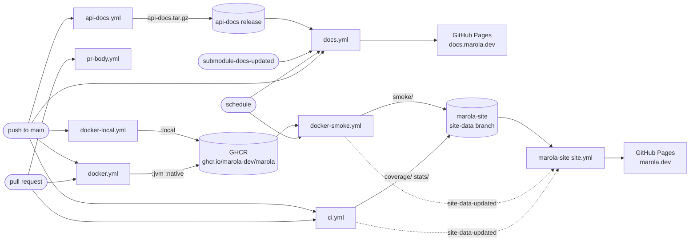
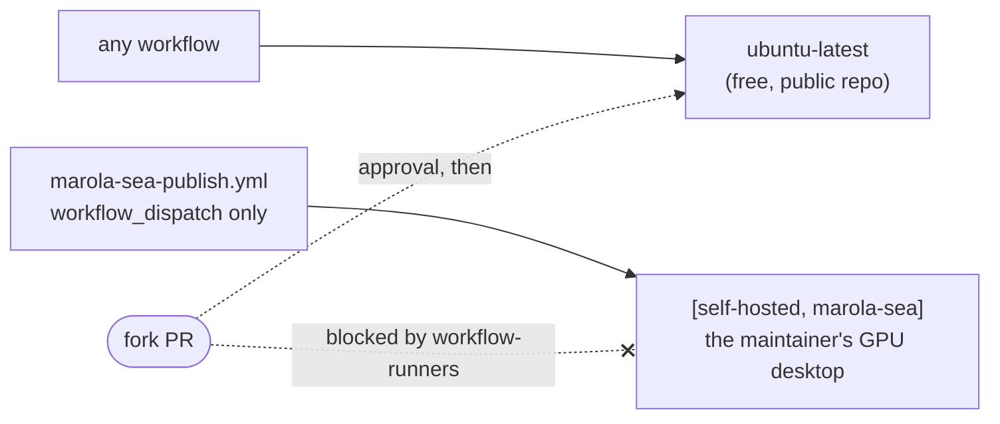

# CI/CD

Every gate and every deploy is a GitHub Actions workflow under
[`.github/workflows/`](https://github.com/marola-dev/marola/tree/main/.github/workflows). All of
them run on GitHub's standard `ubuntu-latest` runner except `marola-sea-publish`, which needs a GPU.
The design behind this layout is [MIP-0065](../MIPs/MIP-0065-ci-cd-on-github-hosted-runners.md).
The generic jobs are [marola-devkit](https://github.com/marola-dev/marola-devkit)'s reusable
workflows ([inputs](https://github.com/marola-dev/marola-devkit/blob/v0.2.2/docs/workflows.md)),
called at the same tag as the flake input; bump them together.

## How a change reaches marola.dev and docs.marola.dev

The map at marola.dev is [marola-site](https://github.com/marola-dev/marola-site)'s (MIP-0070
§5.8 step 3). Its `site-data` branch holds only generated output, and this repo's writers push to
it with `MAROLA_CROSS_REPO_PAT` through `scripts/site-data-push.sh`, which retries when two pushes
race. Its `site.yml` copies `smoke/`, `coverage/` and `stats/` into the page on every build. The
coverage and smoke writers dispatch `site-data-updated` to rebuild it right away; `repo-stats`
waits for its 3-hourly schedule. marola-site is also this repo's first submodule, and its
`README.md` + `docs/` are published under `docs.marola.dev/repos/marola-site/`.

The corpus is [marola-corpus](https://github.com/marola-dev/marola-corpus)'s (task 13): its
`release.yml` attaches `marola-corpus-<tag>.tar.gz` to each `v*` tag, and `corpus.version` here
pins one. `scripts/corpus-fetch.sh` unpacks it into `.tmp/knowledge` before anything reads it:
`build-test` and `coverage` through sbt's `corpusFetch` task (scala-ci runs only sbt), `docker.yml`
before the image build (the image's `/app/knowledge`), `docker-local.yml` before its benchmark. A
bump of `corpus.version` is what changes the image's corpus. marola-corpus is this repo's second
submodule, published under `docs.marola.dev/repos/marola-corpus/`.

## The workflows

| Workflow | Trigger | Runner | Gates or deploys | Secrets and variables | By hand |
|---|---|---|---|---|---|
| `ci.yml` | PR; push to `main` | `ubuntu-latest` | The merge gates, each run only when `dorny/paths-filter` says its inputs changed: `build-test` (devkit `scala-ci`: `corpusFetch`, scalafmt, scalafix, compile, test), `python-ci` (devkit: ruff and marola's `scripts/*` self-tests), `static-ci` (devkit: actionlint, hadolint, `docker compose config`), `agents-check` (devkit: the AGENTS.md invariants block), `quality-other` (nix: `flake.lock` is current, `just --list`, `workflow-runners`), `docs-build` (`docs.yml`'s aggregated `mkdocs --strict`, on the PR's pinned submodule commits). On `main` only: `coverage` publishes the badge and `repo-stats` the stats to marola-site's `site-data`, and `resources-tarball` uploads the `ml-resources` artifact (the app -> ml contract, MIP-0070 §5.4) for `finetune/build_dataset.py --resources` | `GITHUB_TOKEN`, `MAROLA_CROSS_REPO_PAT` | `just build && just test && just quality` locally; re-run from the Actions tab |
| `ci-short-circuit.yml` | PR closed | `ubuntu-latest` | Devkit `ci-short-circuit`: cancels the closed PR's in-flight runs, which the concurrency group can't see | `GITHUB_TOKEN` | — |
| `pr-body.yml` | PR opened, reopened, ready, pushed | `ubuntu-latest` | Devkit `pr-body`: fills the description from the commits (`uprd`); skips forks and bot branches | `GITHUB_TOKEN` | `just uprd` |
| `labels.yml` | dispatch only | `ubuntu-latest` | Devkit `labels-sync`: applies the devkit's label manifest to this repo | `GITHUB_TOKEN` | `gh workflow run labels.yml`; `just labels-sync` locally |
| `api-docs.yml` | push to `main` touching Scala, `scripts/**.py`; dispatch | `ubuntu-latest` | Builds scaladoc and pdoc and **publishes** them as `api-docs.tar.gz` on the rolling `api-docs` release, then runs `docs.yml` | `GITHUB_TOKEN` | `gh workflow run api-docs.yml` |
| `docs.yml` | `repository_dispatch: submodule-docs-updated`; push to `main` touching `docs/**`/`mkdocs/**`; daily; dispatch | `ubuntu-latest` | The umbrella aggregator (MIP-0070 §5.5): builds a gitignored aggregated tree (`scripts/prepare-docs.sh` — this repo's own `docs/` plus each submodule's `README.md` + `docs/`, submodules at their latest `main`), runs `mkdocs --strict` on it, folds in each submodule's API docs and this repo's own at `/api/` (`scripts/fetch-api-docs.sh`, release assets — no `sbt doc` here), and on `main` **deploys** to Pages at `docs.marola.dev` (`github-pages` environment) | `GITHUB_TOKEN` | `gh workflow run docs.yml`; `just docs` locally |
| `docker.yml` | PR and push to `main` touching the image inputs; dispatch | `ubuntu-latest` | PR: builds `jvm` and runs a start-up check, never pushes. `main` and dispatch: **push** `:jvm`, `:jvm-<sha>` (amd64 + arm64) and `:native`, `:native-<sha>` (amd64) to GHCR | `GITHUB_TOKEN` | `gh workflow run docker.yml [-f dev=true]` (`:dev` is dispatch-only) |
| `docker-local.yml` | push to `main` touching the model, `corpus.version` or benchmark; dispatch | `ubuntu-latest` | Builds `:local-<sha>`, runs `just benchmark` against it, and promotes it to `:local` only if it's within tolerance of `docs/benchmarks/` | `GITHUB_TOKEN` | `gh workflow run docker-local.yml [-f tolerance=0.05]` |
| `docker-smoke.yml` | daily 09:30 UTC; dispatch | `ubuntu-latest` | Runs the published image's `--summarize` live, writes `smoke/` to marola-site's `site-data` (the map's "Last live run") | `GITHUB_TOKEN`, `MAROLA_CROSS_REPO_PAT` | `gh workflow run docker-smoke.yml [-f lat=… -f lon=…]` |
| `marola-e2e.yml` | dispatch only | `ubuntu-latest` | `E2ESpec` against live Overpass/Open-Meteo/IMA, optionally with Ollama | — | `gh workflow run marola-e2e.yml [-f with_llm=true]`; `just e2e` locally |
| `scala-steward.yml` | Mondays 12:00 UTC; dispatch | `ubuntu-latest` | Opens dependency-update PRs for the sbt build (dependabot covers Actions and pip) | `STEWARD_GH_TOKEN`, falling back to `GITHUB_TOKEN` | `gh workflow run scala-steward.yml` |
| `profile-activity.yml` | PR merged into `main` | `ubuntu-latest` (reusable workflow's `runner:` input) | Pings `h0ffmann/h0ffmann` to refresh its activity list; without the token it only leaves a notice | `PROFILE_DISPATCH_TOKEN` | — |
| `marola-sea-publish.yml` | dispatch only | `[self-hosted, marola-sea]` | Trains marola-sea (SFT + DPO), exports GGUFs, **publishes** to Hugging Face, tags `marola-sea-v<N>` | `HF_TOKEN` | `gh workflow run marola-sea-publish.yml -f preset=tiny`; `just runner-up` first |

`site.yml` and `site-health.yml` moved to marola-site with the map (MIP-0070 task 11).
`ghcr-retention.yml` was deleted: it failed every week on an upstream bug, and it only existed
because GHCR storage used to be billed while the repo was private (MIP-0065 §4.4).

## The self-hosted rule

Only `marola-sea-publish.yml` may run on a self-hosted runner, and it may never gain a
`pull_request`, `pull_request_target` or `workflow_call` trigger. Everywhere else a `runs-on:` or
`runner:` value must be a literal, never a `${{ }}` expression that could resolve to the desktop. `workflow-runners` enforces this in
`quality-other`.

The repo is public, and on a public repo anyone can open a pull request. A `pull_request` job on
a self-hosted runner would run a fork's code on the maintainer's machine, which is what GitHub
warns against in "Self-hosted runners should almost never be used for public repositories". The
old reason for self-hosting was running out of minutes on a private repo (#340), and it no longer
applies: standard hosted runners are free for public repos. Larger and GPU runners are always
billed, so GPU training stays on the desktop, behind a manual dispatch.

## The maintainer's manual settings

Repository settings that no workflow or agent can change. MIP-0065 depends on them:

- **Fork PR approval:** Settings → Actions → General → "Require approval for all external
  contributors". The two weaker levels stop asking once a user has had any commit merged.
- **The desktop runner** carries the `marola-sea` label only, so no `runs-on: ubuntu-latest` job
  can land on it.
- **No `CI_RUNNER` variable.** The repo has no Actions variables at all (checked 2026-09-29).
- **The `marola-dev/marola` GHCR package is public**, so `docker pull ghcr.io/marola-dev/marola:jvm`
  works logged out. A package's first push creates it private; as of 2026-09-29 it still is.
- **Secrets:** `HF_TOKEN` (Hugging Face write, for `marola-sea-publish`), `STEWARD_GH_TOKEN` (a
  fine-grained token that lets scala-steward open PRs; `GITHUB_TOKEN` is refused by the org's
  Actions policy, #496), and optionally `PROFILE_DISPATCH_TOKEN`. `MAROLA_CROSS_REPO_PAT` is an
  org secret: a fine-grained token that needs Contents read and write on **both** marola and
  marola-site (and on each new repo as it is created). marola uses it to push to marola-site's
  `site-data` and to dispatch `site-data-updated`; marola-site uses it to dispatch
  `submodule-docs-updated` back to marola.
- **Pages:** source "GitHub Actions", custom domain `docs.marola.dev` (a DNS `CNAME` to
  `marola-dev.github.io`). An Actions-deployed site ignores a `CNAME` file, so the domain lives
  only in this setting.
