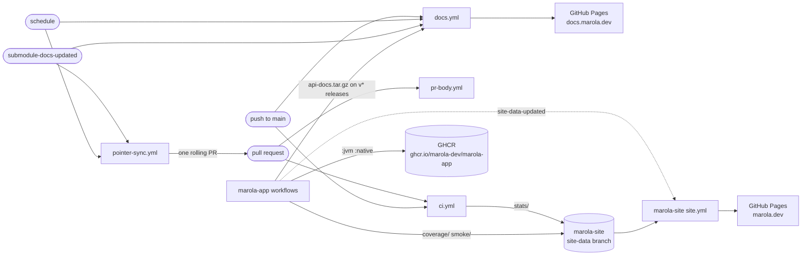
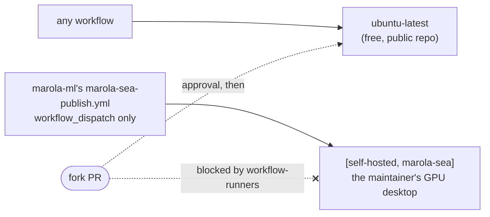

# CI/CD

Every gate and every deploy is a GitHub Actions workflow under
[`.github/workflows/`](https://github.com/marola-dev/marola/tree/main/.github/workflows). All of
them run on GitHub's standard `ubuntu-latest` runner. The GPU one, `marola-sea-publish`, moved to
marola-ml with the fine-tune (below).
The design behind this layout is [MIP-0065](../MIPs/MIP-0065-ci-cd-on-github-hosted-runners.md).
The generic jobs are [marola-devkit](https://github.com/marola-dev/marola-devkit)'s reusable
workflows ([inputs](https://github.com/marola-dev/marola-devkit/blob/v0.2.2/docs/workflows.md)),
called at the same tag as the flake input; bump them together.

## How a change reaches marola.dev and docs.marola.dev

The map at marola.dev is [marola-site](https://github.com/marola-dev/marola-site)'s (MIP-0070
§5.8 step 3). Its `site-data` branch holds only generated output: marola-app's coverage and smoke
writers and this repo's `repo-stats` push to it with `MAROLA_CROSS_REPO_PAT` through
`scripts/site-data-push.sh`, which retries when two pushes race. Its `site.yml` copies `smoke/`, `coverage/` and `stats/` into the page on every build. The
coverage and smoke writers dispatch `site-data-updated` to rebuild it right away; `repo-stats`
waits for its 3-hourly schedule. marola-site is also this repo's first submodule, and its
`README.md` + `docs/` are published under `docs.marola.dev/repos/marola-site/`.

The corpus is [marola-corpus](https://github.com/marola-dev/marola-corpus)'s (task 13): its
`release.yml` attaches `marola-corpus-<tag>.tar.gz` to each `v*` tag, and each consumer pins one in
its own `corpus.version`. marola-corpus is this repo's second submodule, published under
`docs.marola.dev/repos/marola-corpus/`.

The offline Python is [marola-ml](https://github.com/marola-dev/marola-ml)'s (task 14): `dspy/`,
`finetune/`, the benchmark gate and its kept runs, and the workflows that went with them,
`docker-local.yml` (now pushing `ghcr.io/marola-dev/marola-ml:local`) and `marola-sea-publish.yml`
(with `HF_TOKEN`). It never builds the app: its benchmark runs the app image, pinned by tag and
digest in its `marola-image`, and its gate reads the question set from the resources tarball on a
marola-app release. Its `compile-prompt.yml` sends the compiled prompts to marola-app as a pull
request, opened with `MAROLA_CROSS_REPO_PAT`. Its pdoc is `api-docs.tar.gz` on its
own releases, published under `docs.marola.dev/repos/marola-ml/api/` with its `README.md` + `docs/`.

The app is [marola-app](https://github.com/marola-dev/marola-app)'s (task 15), with the workflows
that build, test and publish it: its `ci.yml` (scala-ci, coverage to `site-data`), `docker.yml`
(the `ghcr.io/marola-dev/marola-app` image), `docker-smoke.yml`, `marola-e2e.yml`,
`scala-steward.yml`, and `release.yml`, which attaches Scaladoc (`api-docs.tar.gz`) and the ml
resources tarball to each `v*` tag. Nothing here builds Scala. marola-app is this repo's fourth
submodule and mounts at the site's root, so its `1-Using-marola/` and `2-Building-marola/` keep
their URLs, and its Scaladoc lands at `/api/`.

The water-quality dataset is [marola-oods](https://github.com/marola-dev/marola-oods)'s (task 16):
it starts empty, with only its own `oods-check.yml` — on a push or PR touching `data/` or
`marola-image`, it pulls the pinned app image (the same tag-and-digest pin marola-site and
marola-ml use) and runs a smoke command the image supports today, then checks `data/oods/`'s shape
against the formats MIP-0056 specifies; an empty tree passes. It never builds or writes to
anything. The actual ingest workflow, `oods-ingest.yml`, and the OODS command it checks against,
land in marola-app through the recreated MIP-0056 stack, not here. marola-oods is this repo's
fifth submodule, published under `docs.marola.dev/repos/marola-oods/`.

## The workflows

| Workflow | Trigger | Runner | Gates or deploys | Secrets and variables | By hand |
|---|---|---|---|---|---|
| `ci.yml` | PR; push to `main` | `ubuntu-latest` | The merge gates, each run only when `dorny/paths-filter` says its inputs changed: `python-ci` (devkit: ruff and marola's `scripts/*` self-tests), `static-ci` (devkit: actionlint, hadolint and `docker compose config` on the mkdocs stack), `agents-check` (devkit: the AGENTS.md invariants block), `quality-other` (nix: `flake.lock` is current, `just --list`, `workflow-runners`), `docs-build` (`docs.yml`'s aggregated `mkdocs --strict`, on the PR's pinned submodule commits). On `main` only: `repo-stats` publishes the stats, Scala lines counted in the marola-app submodule, to marola-site's `site-data` | `GITHUB_TOKEN`, `MAROLA_CROSS_REPO_PAT` | `just quality` locally; re-run from the Actions tab |
| `ci-short-circuit.yml` | PR closed | `ubuntu-latest` | Devkit `ci-short-circuit`: cancels the closed PR's in-flight runs, which the concurrency group can't see | `GITHUB_TOKEN` | — |
| `pr-body.yml` | PR opened, reopened, ready, pushed | `ubuntu-latest` | Devkit `pr-body`: fills the description from the commits (`uprd`); skips forks and bot branches | `GITHUB_TOKEN` | `just uprd` |
| `labels.yml` | dispatch only | `ubuntu-latest` | Devkit `labels-sync`: applies the devkit's label manifest to this repo | `GITHUB_TOKEN` | `gh workflow run labels.yml`; `just labels-sync` locally |
| `docs.yml` | `repository_dispatch: submodule-docs-updated`; push to `main` touching `docs/**`/`mkdocs/**`; daily; dispatch | `ubuntu-latest` | The umbrella aggregator (MIP-0070 §5.5): builds a gitignored aggregated tree (`scripts/prepare-docs.sh` — this repo's own `docs/` plus each submodule's `README.md` + `docs/`, submodules at their latest `main`), runs `mkdocs --strict` on it, folds in each submodule's API docs, marola-app's at `/api/` (`scripts/fetch-api-docs.sh`, the latest release's `api-docs.tar.gz` — no `sbt doc` here), and on `main` **deploys** to Pages at `docs.marola.dev` (`github-pages` environment) | `GITHUB_TOKEN` | `gh workflow run docs.yml`; `just docs` locally |
| `pointer-sync.yml` | `repository_dispatch: submodule-updated` or `submodule-docs-updated`; daily; dispatch | `ubuntu-latest` | The only thing that moves submodule pointers (MIP-0070 §5.6): `scripts/pointer-sync.sh` runs `git submodule update --remote` and commits whatever moved onto `chore/pointer-sync`, force-pushed, with one open PR listing each submodule's old → new commit and a compare link; when `main` has caught up, that PR is closed. Pushed and opened with the PAT so the PR's CI runs | `MAROLA_CROSS_REPO_PAT` | `gh workflow run pointer-sync.yml` |
| `profile-activity.yml` | PR merged into `main` | `ubuntu-latest` (reusable workflow's `runner:` input) | Pings `h0ffmann/h0ffmann` to refresh its activity list; without the token it only leaves a notice | `PROFILE_DISPATCH_TOKEN` | — |

`site.yml` and `site-health.yml` moved to marola-site with the map (MIP-0070 task 11),
`docker-local.yml` and `marola-sea-publish.yml` to marola-ml (task 14), and `api-docs.yml`,
`docker.yml`, `docker-smoke.yml`, `marola-e2e.yml` and `scala-steward.yml` to marola-app with the
code (task 15).
`ghcr-retention.yml` was deleted: it failed every week on an upstream bug, and it only existed
because GHCR storage used to be billed while the repo was private (MIP-0065 §4.4).

## The self-hosted rule

No workflow here may run on a self-hosted runner: the one that does, `marola-sea-publish.yml`, is
marola-ml's, and it may never gain a `pull_request`, `pull_request_target` or `workflow_call`
trigger. A `runs-on:` or `runner:` value must be a literal, never a `${{ }}` expression that could
resolve to the desktop. `workflow-runners` enforces this in `quality-other` here and in marola-ml's
CI there.

The repo is public, and on a public repo anyone can open a pull request. A `pull_request` job on
a self-hosted runner would run a fork's code on the maintainer's machine, which is what GitHub
warns against in "Self-hosted runners should almost never be used for public repositories". The
old reason for self-hosting was running out of minutes on a private repo (#340), and it no longer
applies: standard hosted runners are free for public repos. Larger and GPU runners are always
billed, so GPU training stays on the desktop, behind a manual dispatch.

## The maintainer's manual settings

Repository settings that no workflow or agent can change. MIP-0065 depends on them:

- **Fork PR approval:** Settings → Actions → General → "Require approval for all external
  contributors". The two weaker levels stop asking once a user has had any commit merged.
- **The desktop runner** carries the `marola-sea` label only, so no `runs-on: ubuntu-latest` job
  can land on it. It serves marola-ml's `marola-sea-publish.yml`.
- **No `CI_RUNNER` variable.** The repo has no Actions variables at all (checked 2026-09-29).
- **The app image is marola-app's package**, `ghcr.io/marola-dev/marola-app` (the old
  `ghcr.io/marola-dev/marola` stops receiving pushes). A package's first push creates it private:
  either make it public, so `docker pull ghcr.io/marola-dev/marola-app:jvm` works logged out, or
  grant marola-site and marola-ml read access under its "Manage Actions access".
- **Secrets:** `HF_TOKEN` moved to marola-ml with `marola-sea-publish`, and `STEWARD_GH_TOKEN` (a
  fine-grained token that lets scala-steward open PRs; `GITHUB_TOKEN` is refused by the org's
  Actions policy, #496) to marola-app with its workflow. Here: optionally
  `PROFILE_DISPATCH_TOKEN`. `MAROLA_CROSS_REPO_PAT` is an
  org secret: a fine-grained token that needs Contents read and write on **both** marola and
  marola-site (and on each new repo as it is created). marola uses it to push to marola-site's
  `site-data`, to dispatch `site-data-updated`, and to push `chore/pointer-sync` and open its PR
  (so it also needs Pull requests read and write on marola); marola-site uses it to dispatch
  `submodule-docs-updated` back to marola; marola-ml uses it for that and to open its
  compiled-prompt pull requests here.
- **Pages:** source "GitHub Actions", custom domain `docs.marola.dev` (a DNS `CNAME` to
  `marola-dev.github.io`). An Actions-deployed site ignores a `CNAME` file, so the domain lives
  only in this setting.
