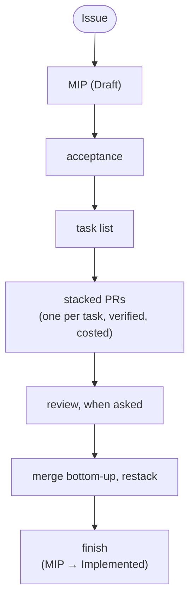
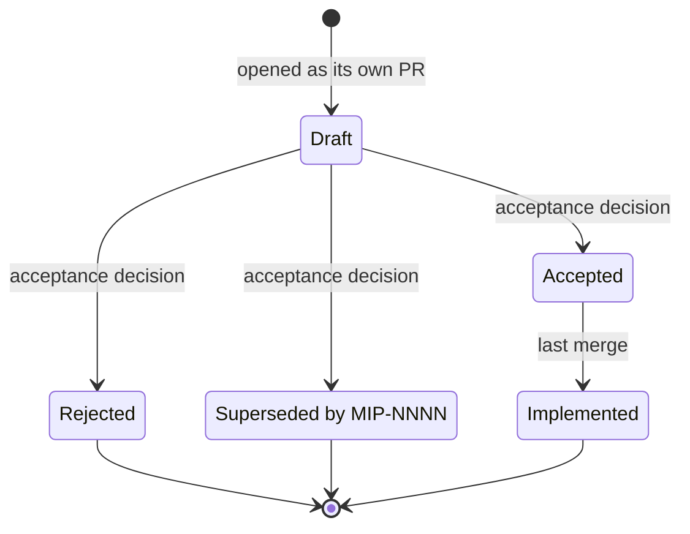
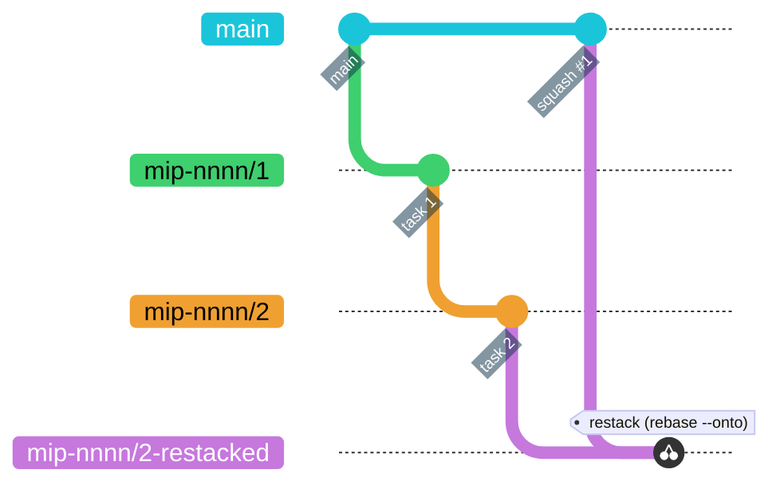

# Development flow



This page is the one place the whole loop is written down; the pieces live in the `mip` and
`mip-tasks` skills (`.claude/skills/`), `AGENTS.md` (the hard rules), `docs/3-Working-on-the-repo/AGENT-SKILLS.md`
(which superpowers skill does what) and the scripts under `scripts/`.

Sessions: one per MIP for planning, one per task for execution (`/clear`, `/rename
mip-nnnn/k-slug`), one per review. That is what makes `/usage` and `just claude-cost` map to PRs.

## 1. From an idea to an issue, then a MIP (Draft)

1. **File the issue first** — the idea is not work until it is one, and the tier decides what
   follows: tier 1 (bug, chore, docs) and tier 2 (small enhancement, the issue body *is* the spec)
   stop here and go straight to §4; only tier 3 (a new data source, a scoring change, a new
   integration, anything paid) continues into a MIP, as a **MIP proposal** issue that is
   relabelled rather than replaced when the MIP PR opens. Filing is a human's act: the `triage`
   skill drafts the body and runs the readiness check, a person presses the button
   (`docs/3-Working-on-the-repo/ISSUE-FLOW.md`, MIP-0063 §5.6). An agent picks work up from `just issue-queue` and takes
   it with `just issue-claim <n>`; it may not start on an issue without `agent-ready`.
2. **Refine the idea**: superpowers `brainstorming` (activates on "let's plan", "I have an idea"):
   Socratic questions until MIP §1-§3 (summary, motivation, user-visible change) have answers.
   Voice notes and chat pastes go through `just context-mips` + a browser session first
   (`RUN-LOCALLY.md` §8).
3. **Write the MIP**: the `mip` skill: next number from `docs/MIPs/README.md`, the template,
   every external claim fetched and dated, what was *not* checked said so, open questions listed.
   Add the index row. Link it from `FUTURE-WORK.md` if it closes something.
4. **Open it as its own PR**, status **Draft**. A MIP is never built in the same change (`mip`
   skill, step 8). The PR body ends with a `Cost:` line like any other.

## 2. Acceptance

Acceptance is a human decision, recorded in the MIP's status table and the index. The reviewer
of a MIP PR reads, in this order:

- **§4 sources and dependencies**: was each claim verified (URL + date)? Anything unverified must
  sit in §11, not in §5.
- **§6 scoring / safety**: deterministic, in `scoring/`, unit-tested; never model output.
  **Phase** row against `AGENTS.md`'s phase discipline: a later-phase MIP is fine to accept, but
  the missing earlier-phase prerequisite must be named.
- **§8 caveats and §11 open questions**: answer what can be answered now; what cannot becomes a
  numbered decision in the tasks file (next section), so implementation is never blocked on it.
- **Cost**: the MIP's own cost model (§4/§8) and whether any paid resource is involved
  (`AGENTS.md`: a paid cloud resource needs an explicit go-ahead, in the MIP, before any task).

Outcome: **Accepted** (status row + `docs/MIPs/README.md`, in the MIP PR or a one-line follow-up
commit), **Rejected** (keep the file; the reasoning is the value) or **Superseded by MIP-NNNN**.
"Implement MIP-NNNN" from the human counts as acceptance; the first task's commit flips the
status to `Accepted` and links the tasks file.

The status row's own lifecycle:



## 3. The task list

`mip-tasks` step 1 (superpowers `writing-plans` is skipped: the MIP is the plan): read the MIP,
`AGENTS.md` and the code it touches, write `docs/MIPs/MIP-NNNN.tasks.md`:

- one row per task = one PR: ≤ ~400 changed lines, one concern, **its test named up front** (from
  MIP §7), green on `just build && just test && just quality` by itself;
- ordered by dependency, then risk; docs travel with the task that changes behaviour;
- a **Decisions** list answering the MIP's §11 for v1, so nothing is re-litigated per task;
- a restack note: no task rewrites a file an earlier task created.

The tasks file is committed on task 1's branch; the MIP gets a `Tasks:` row. Project it into
GitHub with `just tasks-to-issues MIP-NNNN --milestone "<name>"`: one issue per row, each row's
`#` cell rewritten into a link, one native `blocked by` edge per `depends on` entry. One-way and
re-runnable — after it, the issues own status and the file owns the plan.

## 4. Stacked PRs — one task, one branch, one PR

Per task, in its own session (superpowers `executing-plans`: the task row is the plan; checkpoints
= first failing test, before push):

```bash
scripts/stack.sh start MIP-NNNN <k> <slug>        # branch mip-nnnn/k-slug off task k-1's branch (main for k = 1)
# red → green → refactor  (superpowers test-driven-development; systematic-debugging when green won't come)
just build && just test && just quality           # + a live check whenever a data path changed (superpowers verification-before-completion: evidence, then the claim)
git commit                                         # message ends with Tested: and Cost: trailers (AGENTS.md) — the PR's Tested/Cost sections come from them
just pr                                            # fills any missing trailer (just cost-fill), pushes, opens/updates the PR — scripts/stack.sh pr's base logic on a mip-NNNN/k-* branch
```

The git history this produces — two stacked tasks, squash-merged bottom-up, then restacked:



`just pr --dry-run` prints every step (the trailers `cost-fill` would add, the body `uprd` would
write) without pushing or touching `gh`. It refuses the same way the real run would (on `main`, or a
dirty tree) so the preview matches what actually happens.

Every push (`scripts/stack.sh pr`, `just uprds`, a plain `git push`) goes through
`.githooks/pre-push`, which runs `just quality-other` (ruff on every `.py`, the script self-tests,
actionlint, hadolint) and, when a pushed commit touches Scala, `just quality-scala` (scalafmt +
scalafix). Code is linted before the last push, not found red in CI after the merge; `git push
--no-verify` skips the hook, CI does not.

Or, once every branch of the stack is pushed, all PRs at once with their shared "Stack" section:

```bash
just uprds MIP-NNNN         # regenerate every PR body (What changed + Cost + Stack), create the missing PRs on the right base
just stack-link MIP-NNNN    # link the open PRs into a GitHub Stack (gh stack link) — the "Preview stack" box in the PR UI, from the CLI
just stack-view             # the stack as GitHub sees it; just stack status MIP-NNNN for the local view
```

What GitHub shows: a stacked PR is a PR whose base is the previous branch; its page says "into
`mip-nnnn/1-…` from `mip-nnnn/2-…`" and its diff is that task alone. The Stack (native GitHub
feature, `gh stack`) adds the ordered list at the top of each PR; `just uprds` writes the same list
at the end of each body, with the summed Cost, for readers without the feature.

A PR opened any other way (the GitHub UI's "Compare & pull request", a bare `gh pr create`) gets
the same body without anyone running `just uprd`: `.github/workflows/pr-body.yml` runs
`scripts/uprd.sh <PR#>` when the PR is opened, reopened, marked ready, or gets new commits, as long
as the body is empty, still the raw template, or carries uprd's own first-line marker (a
hand-written body is left alone; delete the marker line to stop regeneration). It also replaces a
title that is still the branch name with the first commit's subject. Forks and bot PRs are skipped.

The generated body follows `.github/PULL_REQUEST_TEMPLATE.md`'s shape: bold labels, a compact
MIP/Tested/Cost table, no `#` headings, one screen for a typical two-commit PR; the PR title is
the first commit's subject on the branch, capped at 70 characters (`scripts/lib/uprd_title.sh`) so
it stays skimmable. `just uprd`/`just uprds` print a warning when a title had to be cut, worth a
manual retitle if the cut reads awkwardly.

Cost: a measured figure is always preferred over an estimate. One session per task → `/usage` or
`just claude-cost`. One session for several tasks → `just cost-split MIP-NNNN` splits the session
log by commit time (subagent transcripts included: `<session>/subagents/*.jsonl`) and prints the
trailer per branch; amend with `GIT_COMMITTER_DATE` preserved so the split stays stable, re-stack,
force-push with lease, `just uprds`. Nothing logged at all for a commit (a subagent whose worktree
session never re-attached, a commit from another machine) → `just cost-fill` (or plain `just pr`)
adds `scripts/cost-split.py --estimate`'s diff-size estimate instead, always labelled `est.` so it
reads differently from a measured number at a glance.

## 5. Final review — only when asked

Nothing reviews a PR automatically. (Proposed change: `docs/MIPs/MIP-0060-open-code-review-on-ready.md`:
an advisory local-model pass when a PR is marked ready.) Reviews start when the human says so ("review the stack",
"claude review #21", `/code-review`). Three ways, cheapest first; all of them review **one PR
against its own base**, bottom of the stack first, because that is the diff a reviewer sees.

1. **superpowers `requesting-code-review`**: in a fresh session, per PR: dispatch the reviewer
   subagent with `BASE_SHA = git rev-parse origin/<base branch>`, `HEAD_SHA = git rev-parse
   origin/<task branch>`, `PLAN_OR_REQUIREMENTS` = the task's row in `MIP-NNNN.tasks.md` plus the
   MIP's §6/§7, `DESCRIPTION` = the PR title. It returns Critical/Important/Minor findings; fix
   Critical and Important before merging, note Minor in the PR. This is the default for "final
   review using superpowers".
2. **`/code-review <PR#>`** (built-in; `--comment` posts the findings as inline PR comments) or the
   `code-review` plugin's `/code-review` (five parallel agents, ≥ 80-confidence findings only,
   one comment on the PR). Both look for `CLAUDE.md`; in this repo it imports `AGENTS.md` for
   Claude Code sessions and tells any tool reading it as plain text to open `AGENTS.md`. The
   plugin's confidence scorer only credits rules it can read, so keep that instruction there.
3. **`/code-review ultra <PR#>`**: the multi-agent cloud review, for the riskiest PR of a stack
   (scoring, safety text, a new data source). User-triggered and billed; never launched by the agent.
4. **`/gemini review`** as a PR comment: Gemini Code Assist on GitHub, free, advisory, on request
   only (`.gemini/config.yaml` turns off review-on-open; `.gemini/styleguide.md` carries the
   `AGENTS.md` subset a diff reviewer can check). Cheapest hosted pass; source goes to Google, so
   it is installed by the human, never by an agent. `GEMINI-CODE-ASSIST.md` has the setup, by
   hand or as Besom. Skips `.github/workflows/**` by design.

Author side: superpowers `receiving-code-review`: verify each finding before implementing it,
push back with reasoning when it is wrong, then fix → commit (`Cost:` trailer) → push → `just
uprds MIP-NNNN`. Pre-review checklist (superpowers `requesting-code-review` + this repo): Cost
line present and measured; docs updated in the same PR; the test named in the tasks row exists and
is green; MIP status right; `docs/4-Research-and-plans/FABLE_REVIEW.md` item closed if one applies.

## 6. Merge, restack, finish

- Approve per PR (GitHub reviews are per PR), then merge either one at a time or the whole stack
  at once: `just stack-merge <stack#> --squash` merges every PR of the stack bottom-up in one
  all-or-nothing operation (`gh stack merge`), no restack in between.
- One at a time: **bottom-up**, squash (the repo's habit). GitHub retargets the next PR to `main`
  when the merged branch is deleted; the commits still need a rebase:
  `scripts/stack.sh restack` on the next branch, or `just stack-sync MIP-NNNN` for the whole
  stack (it adopts the stack from GitHub first; `gh stack link` keeps no local state).
- A task branch's own commit carries `Closes #N` for the issue its `MIP-NNNN.tasks.md` row links
  (`scripts/cost-fill.sh`, run by `just pr`, writes it above the trailers), so the squash-merge
  commit on `main` closes the issue and the board moves it to Done. The PR body carries the same
  line too (`uprd.sh` copies it there so the link shows on GitHub), but the body alone never
  closes anything — #524, after #513 through #519 stayed open past merge on a body-only line,
  while #511/#512 closed cleanly on a commit-body one. `TASK_PARTIAL=1 just pr` skips the line for
  a task that only delivers part of its row, before the PR (and its `task-partial` label) exist;
  the issue stays open. A PR merged into another task branch closes nothing regardless; GitHub
  honours the keyword only on the default branch.
- `scripts/stack.sh status` / `just stack-view` until every PR is merged.
- Last merge: superpowers `finishing-a-development-branch`: full suite green, delete the task
  branches, flip the MIP to **Implemented** with the PR numbers and the summed Cost in its status
  row, update `docs/MIPs/README.md`. A follow-up after a merge is a new branch off `main`, never a
  child of the old one.

### Dependency PRs

dependabot (`.github/dependabot.yml`) and scala-steward (`.github/workflows/scala-steward.yml`)
each open their own one-off PR per bump. Left alone, ten open bumps cost ten separate CI runs to
land. `just deps-stack` chains the open **dependabot** PRs (`--include-steward` adds
scala-steward's, once its author identity on this repo is confirmed; see
`scripts/deps-stack.sh`'s header) into one `deps/<date>/k-slug` stack, github-actions PRs first
then pip, same shape as a MIP's task branches: run it weekly, or right before a release, rather
than merging bumps one at a time. A PR's head branch can't be moved after it's opened, so the
default (and only implemented) path opens one *new* PR per chain branch, stacked on the previous,
and closes each original dependabot PR with a pointer comment. dependabot's own branches are
never touched, so an abandoned stack doesn't stop dependabot from re-opening or updating them
normally. The whole chain is built in a dedicated worktree, `.tmp/wt-deps-stack`, never your own
checkout: a run of `just deps-stack` (`status`, `clean`, `--resume`, or a conflict mid-run
included) never switches your branch or touches your index. Two dependency bumps landing on
adjacent lines of the same file (the only conflict shape dependabot produces) resolve
themselves: `*requirements*.txt` keeps the higher lower bound per package
(`scripts/lib/req_merge.py`), a workflow's `uses: owner/action@vN` steps keep the higher version
per action (`scripts/lib/uses_merge.py`, the `actions/checkout@v7`-next-to-`hadolint-action@v3.5.0`
case); anything else still stops the script
with the branch left mid-cherry-pick in that worktree and prints the exact `cd .tmp/wt-deps-stack
&& git status` / resolve / `git cherry-pick --continue` / `just deps-stack --resume` steps. Once
the chain is up, it's a normal stack: `gh stack link` runs automatically, `just stack-merge
<stack#> --squash` merges it bottom-up in one CI run instead of one-per-bump, and `just deps-stack
clean` deletes the chain branches (and the worktree) once every stacked PR shows MERGED.

### MIP draft PRs

Drafts pile up the same way bumps do: one `docs/mip-NNNN-*` branch per proposal, each open for
days, and they fight over one line: every draft appends its row to `docs/MIPs/README.md` at the
same place, so the moment one merges the rest conflict there. `just mip-stack` chains the open
draft PRs (any PR whose head is `docs/mip-*` or that adds a `docs/MIPs/MIP-NNNN-*.md`; task
branches `mip-NNNN/k-*` are left to `scripts/stack.sh`) into one `mips/<date>/k-slug` stack
ordered by MIP number, the exact shape `just deps-stack` gives dependabot: built in its own
worktree (`.tmp/wt-mip-stack`), one new PR per chain branch stacked on the previous, the original
PR closed with a pointer, `gh stack link` at the end, `just mip-stack status` / `clean` /
`--resume` / `--skip` / `--dry-run` as for deps. The index-row conflict resolves itself
(`scripts/lib/mip_index_merge.py`: both sides' rows, one per MIP, in number order; the same row
edited differently on both sides is a real edit and stops for a human). A draft that merged
another draft's branch to stay mergeable is fine: merge commits are skipped and commits the
chain already carries are dropped by patch-id. Then `just stack-merge <stack#> --squash` lands
the lot bottom-up.

## 7. Overnight/unattended runs

`.claude/skills/mip-solve-perpetual/SKILL.md` works through a `MIP-NNNN.tasks.md` file one task at
a time, unattended, via a `/goal` + `/loop`. Two mechanics can drive the recurring re-invocation.
Pick one per run, don't build both (MIP-0011 §11's OQ7 spike, resolved below):

- **Local `/goal` + `/loop`** (the one actually run, end to end, while writing this MIP's own
  task stack): the human types `/mip-solve-perpetual NNNN` once and that single turn works through
  the whole task file, checkpointing per task. **Chosen as the default**: no extra setup, and
  demonstrated for real (eleven MIP-0011 tasks, real pushed branches, real `GH_POST_MORTEM.md`
  entries when `gh` had no session auth). **What it cannot do, verified 2026-09-06 05:01:** start
  itself later. A `CronCreate`/wakeup whose prompt is the slash command arrives as plain text; the
  harness does not expand it and the Skill tool refuses it (`disable-model-invocation`). The
  earlier claim here that a 15-minute cron "re-invokes the skill" was never exercised (the stack
  finished inside the one typed turn) and is wrong. For a start at a fixed hour, the human types
  the command at that hour, or creates a cloud routine themselves: the agent's job is staging.
- **A cloud [routine](https://code.claude.com/docs/en/routines)** runs even after the laptop closes,
  but needs Claude Code on the web / a cloud environment. Not confirmed available in every
  contributor's setup, and MIP-0013's OpenCode tryout doesn't cover it either. Worth adopting once
  that access is confirmed; not assumed as a prerequisite here.

**The `heavy-usage` plugin's "stop before the wall" claim, verified against its actual source**
(MIP-0011 §11's OQ8: this needed reading `~/.claude/plugins/cache/heavy-usage`'s scripts, not
trusting its marketplace description): it is **real, but soft, not a hard block**.
`usage-meter.js`'s `UserPromptSubmit` hook computes a linear projection (`used% / elapsed_frac`)
against the official 5-hour/weekly `rate_limits` percentages, and at the `windDown` threshold
(90% five-hour / 95% weekly, `usage-lib.js`'s `STATE_DEFAULTS.thresholds`) injects: *"Do not start
new work. Finish the current step, commit what is done, write a brief state summary, then stop the
loop."* That is a **strongly worded prompt injection Claude is asked to comply with**, not a
`PreToolUse` block. Nothing in the plugin's `hooks` (`SessionStart` + `UserPromptSubmit` only,
`.claude-plugin/plugin.json`) can actually stop a tool call the way a `PreToolUse` hook's
exit 2 does. Its data source (`usage-live.json`) is populated only while the interactive statusLine
renders. The plugin's own comment says as much: *"the statusLine refreshes usage-live.json only
when the UI renders; if it stops (headless/unattended run) the hook would otherwise act on old data
silently. We annotate — never suppress a wind-down."* A cron-fired prompt inside a still-open
interactive session (this repo's chosen mechanic above) keeps the statusLine rendering, so this
staleness risk is mainly a concern for a genuinely headless/detached invocation, not the local
`/goal`+`/loop` mechanic chosen here. **Conclusion: treat `heavy-usage` as the backup layer
`mip-solve-perpetual`'s own usage guard already does** (`SKILL.md`'s "more conservative wins" rule),
never as the sole or primary stop condition, since compliance is advisory and its data can be
stale exactly when unattended.

**Stated stop condition for any overnight run**, regardless of mechanic: every task in the given
file has an open PR (or is logged blocked, per `GH_POST_MORTEM.md`'s convention when `gh` has no
session auth) or a real usage/blocker limit is hit. See `mip-solve-perpetual`'s own "Stop and
report" and checkpointing-contract sections for the exact contract. **Merging and closing PRs stay
denied at the permission layer regardless of mechanic**: `.claude/settings.json`'s
`permissions.deny` blocks `Bash(gh pr merge*)`/`Bash(gh pr close*)` project-wide, and (found and
closed 2026-09-07; the earlier text here claimed no override flag existed at all, which was
false: `gh stack merge --yes` merges an entire GitHub Stack non-interactively and was not covered)
also `Bash(gh stack merge*)`/`Bash(gh stack unstack*)`/`Bash(gh stack delete*)`, with no override
flag. Merging is a human decision, on
waking up, full stop.

## 8. The docs site

Everything under `docs/` is published at <https://marola.dev/docs/>, rendered and full-text
searchable, by mkdocs-material with a self-hosted Kroki rendering the Mermaid fences to SVG
(MIP-0064). The prose ships the same way the code does, so it carries the same gates.

**Where a new doc goes.** One of the four audience directories. Their `1-`…`4-` prefixes exist
only to order the sidebar: there is no `nav:` key, mkdocs builds the tree from the filenames, so
adding a doc needs no edit to `mkdocs/mkdocs.yml`.

| Directory | For |
|---|---|
| `docs/1-Using-marola/` | someone running marola |
| `docs/2-Building-marola/` | someone reading or changing the code |
| `docs/3-Working-on-the-repo/` | someone working the process — this file, `ISSUE-FLOW.md`, `AGENT-SKILLS.md` |
| `docs/4-Research-and-plans/` | surveys, roadmaps, reviews: ideas, most of them not built |
| `docs/MIPs/` | the proposals; no prefix — digits sort before letters, so it lands last on its own |

Add its row to `docs/index.md` in the same change: that file is the site's landing page as well as
the index of what inside each doc is MIP material. `docs/benchmarks/` and `docs/superpowers/` are
`exclude_docs`'d — repo artefacts, not documentation — and are linked at GitHub when referenced.

**Preview, and the gate.** `just docs-serve` serves the real build on
<http://localhost:8001/docs/>; the docs are baked into the image, so a doc edit needs a restart,
not a reload. `just docs` is the build alone, and it is `--strict`: one unresolved internal link
anywhere in `docs/` turns it red. Links that leave `docs/` — `AGENTS.md`, `PHILOSOPHY.md`,
`docs/benchmarks/` — are absolute GitHub URLs for exactly that reason. Both need a Docker or
Podman daemon (MIP-0064 decision 4); neither is part of `just quality`, so a docs change is
previewed by hand.

**How it ships.** A push to `main` touching `docs/**` or `mkdocs/**` runs `api-docs.yml`: scaladoc
and pdoc, then `scripts/mkdocs.sh`, then the API trees folded into the site under `api/`, then
`strip_external_scripts.py --check` over the merged tree, then the whole thing pushed to the
`site-data` branch. `site.yml` deploys from there. A docs-only edit therefore pays for the whole
job, scaladoc included, and appears on marola.dev after the next site deploy rather than on merge.

## 9. Command reference

| Step | Command |
|---|---|
| What is ready to be claimed | `just issue-queue [--milestone NAME]` |
| Claim one | `just issue-claim <n>` — re-checks the Definition of Ready, assigns, drops `agent-ready`, prints the branch line |
| Re-check one issue's readiness | `just issue-ready <n>` — names the rule that failed; adds or removes `agent-ready` |
| A MIP's task table into issues | `just tasks-to-issues MIP-NNNN [--milestone "<name>"]` — idempotent; the milestone must exist |
| New deliverable milestone | `just milestone-new "<name>" [--mip MIP-NNNN]` |
| Labels back in sync with the manifest | `just labels-sync` (`.github/labels.yml`; `--prune` to delete orphans) |
| The board | `just board-sync`; the one-time bootstraps have no recipe: `scripts/issues.sh board setup`, `scripts/issues.sh board gates` |
| One dependency or sub-issue edge by hand | `scripts/issues.sh deps add <n> --blocked-by <m>`, `deps list <n>`, `sub add <parent> <child>` — no recipe either; `tasks-to-issues` calls `deps add` for a whole table's worth |
| Pack docs for a browser MIP session | `just context-mips` |
| New task branch | `scripts/stack.sh start MIP-NNNN k slug` |
| Gates | `just build && just test && just quality` (`quality` = `quality-scala` + `quality-other`; `just quality-fix` for the auto-fixable part) |
| Before every push | `.githooks/pre-push` runs `just quality-other`, plus `just quality-scala` when Scala changed — automatic, `--no-verify` to bypass |
| Statement coverage (aggregated core/local/cli) | `just coverage`; published to the README badge by ci.yml on pushes to `main` |
| Live checks | `just run -- --brief`, `just e2e`; once MIP-0005 lands, `just site-build floripa && just site-serve` |
| The docs site | `just docs` (strict build into `mkdocs/generated-docs`), `just docs-serve` (preview on `localhost:8001/docs/`) — both need a Docker or Podman daemon |
| One PR, start to finish | `just pr` (`--dry-run` prints every step and the body, no push, no `gh`) — fills missing trailers, pushes, opens/updates the PR |
| Fill missing trailers only | `just cost-fill` (`--dry-run` to preview) — adds a measured or `est.` `Cost:` and a `ci-only` `Tested:` to any commit missing one, dates preserved |
| Diff-size Cost estimate | `scripts/cost-split.py --estimate [--verbose]` (whole branch), `--estimate-commit <sha>` (one commit) — used automatically by `cost-fill`/`uprd` when nothing was logged |
| One PR (lower-level) | `scripts/stack.sh pr` (`--dry-run` prints the gh commands) — what `just pr` calls for a `mip-NNNN/k-*` branch |
| gh inside the jail | `GH_TOKEN` in `.env` (fine-grained, this repo, PRs read/write) — `just jail-claude` passes it through, so the agent runs `just pr` itself |
| One PR by number | `just uprd 84` — head branch and base come from GitHub, so it works from any checkout |
| Every PR of a stack | `just uprds MIP-NNNN` |
| PR body shape / title length | `.github/PULL_REQUEST_TEMPLATE.md`; title capped at 70 chars, cut point printed as a warning |
| Tested row | `Tested: gates, e2e, live, ci-only — <not run, why>` trailer per commit (`just cost-fill` adds `ci-only` if one is missing); `just uprd` sets the ✅/⬜ glyphs, never guesses |
| GitHub Stack | `just stack-setup` once, then `just stack-link MIP-NNNN`, `just stack-view`, `just stack-sync MIP-NNNN` |
| Local stack view | `scripts/stack.sh status [MIP-NNNN]`, `just stack status MIP-NNNN` |
| After a base merged | `scripts/stack.sh restack` (one branch) or `just stack-sync MIP-NNNN` (whole stack) — it refuses, mid-stack, when the deleted base branch's head cannot be recovered from its merged PR; `scripts/stack.sh restack --onto-base <sha>` names it by hand |
| Merge the whole stack | `just stack-merge <stack#> --squash` (all-or-nothing, bottom-up) |
| Delete merged branches | `just branches-clean` (local + remote ref, skips current branch/main) |
| PR for a stray plain branch | `just branches-open` (base=main; stack branches point at `scripts/stack.sh pr`) |
| Stack the open dependency PRs | `just deps-stack` (`--dry-run`, `--resume`, `--skip <PR#>`, `--include-steward`); `just deps-stack status` / `just deps-stack clean` |
| Stack the open MIP draft PRs | `just mip-stack` (`--dry-run`, `--resume`, `--skip <PR#>`); `just mip-stack status` / `just mip-stack clean` |
| Cost per PR | `just cost-split MIP-NNNN [--session <id>] [--estimate]`, `just claude-cost` |
| Review (on request) | superpowers `requesting-code-review`; `/code-review <PR#> [--comment]`; `/code-review ultra <PR#>` |
| Status line | `.claude/statusline.sh`, shared via `.claude/settings.json` |
| Push text to the clipboard (write-only) | `just clip` — needs `JAIL_CLIPBOARD=1 just jail-claude` inside the jail, works directly outside it |
| Claude Code's own image paste (Ctrl+V) inside the jail | `JAIL_CLIPBOARD_PASTE=1 just jail-claude` — opt-in X11/Wayland display passthrough, off by default (bigger grant than the write-only bridge, see justfile's `jail-claude` comment) |
