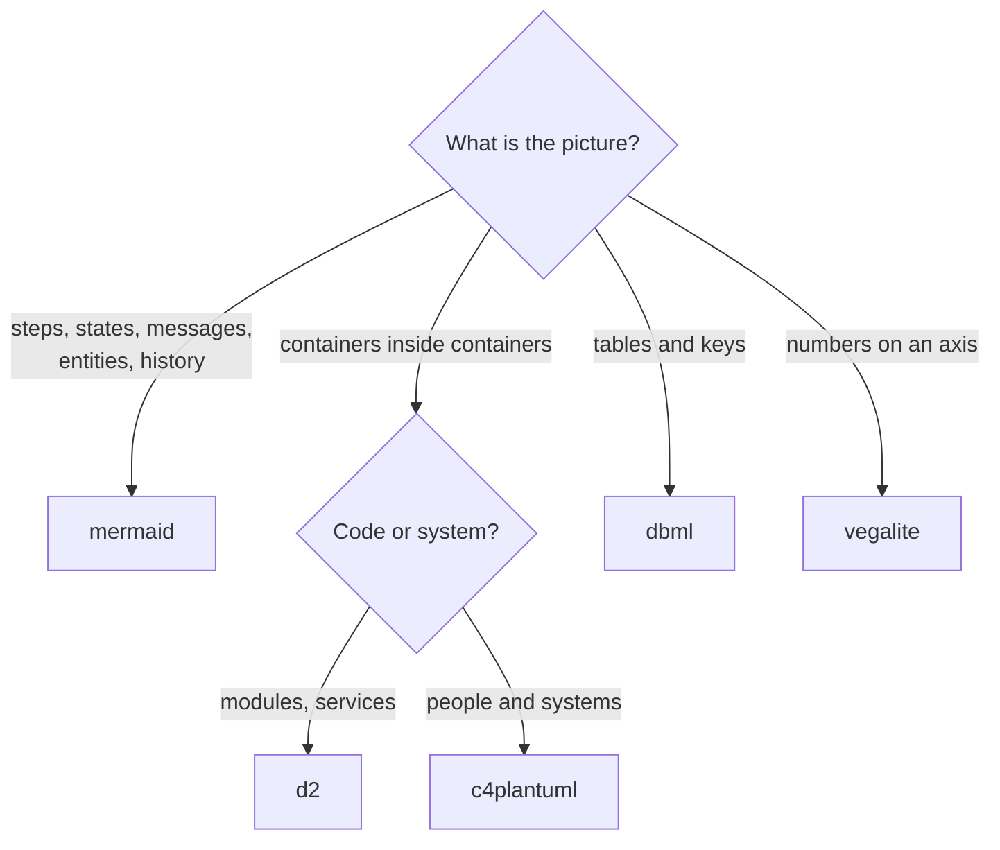

# Diagrams

The docs build renders diagram fences to SVG through a self-hosted
[Kroki](https://kroki.io) (`mkdocs/docker-compose.yml`), so a diagram's source lives in the page
beside the prose it summarises. The design is [MIP-0068](../MIPs/MIP-0068-diagrams-in-docs.md);
the rule below is also in `.claude/rules/docs.md`, which agents load for `docs/**`.

## Which fence

| Picture | Fence | Why this one |
|---|---|---|
| flow, decision tree, DAG, lifecycle, sequence, ER, class, gantt, git history | `mermaid` | covers most pictures, and also renders on GitHub |
| layered or zoned architecture, the module map | `d2` or `c4plantuml` | nested containers without Mermaid's subgraph crowding |
| a schema from DDL | `dbml` | reads like the SQL it mirrors |
| a chart from a results table | `vegalite` | a real axis and scale, not a table of numbers |
| a sketch or wireframe | `excalidraw` | not enabled yet: MIP-0068 task 7 adds its companion only if a sketch earns it |

- **Draw only what the prose beside it already says, and keep the prose.** The diagram is the
  summary; the text is the source of truth. A diagram that disagrees with its page is a bug in the
  diagram.
- **Under about 15 nodes.** Split a diagram rather than grow it.
- **`dbml` and `vegalite` fences take `{bg-dark=white}`.** Colours are injected into every other
  dialect in the table above for the slate theme; these two cannot be styled that way, so they are
  shown on a light card instead. Kroki's other dialects (erd, svgbob, pikchr, …) are uninjected
  too: stay inside the table.
- **`c4plantuml` needs one line after its `!include`**:
  `UpdateRelStyle($textColor="#ffffff", $lineColor="#1ac5da")`. C4 draws relationships in its own
  grey, which injection does not reach.
- **Two Mermaid types need their own first line**, merged over the injected theme. `gitGraph`
  otherwise draws black branches:
  `%%{init: {"themeVariables": {"git0": "#1ac5da", "git1": "#3ecf6e", "git2": "#f0a030", "git3": "#c678dd", "commitLabelColor": "#ffffff", "commitLabelBackground": "#082f45"}}}%%`.
  `gantt` needs a short `axisFormat %d %b`, or its dates overlap.
- **A broken diagram fails the build**, naming the page (`fail_fast`). `bpmn` and `diagramsnet`
  are off, so those fences stay code blocks.

The rest of this page is one working example per dialect. Each one's source is under it.

## mermaid

The rule above, as a decision tree:



??? note "Source"

    ````markdown
    ```mermaid
    flowchart TD
      q{What is the picture?}
      q -- "steps, states, messages,<br/>entities, history" --> m[mermaid]
      q -- "containers inside containers" --> z{Code or system?}
      z -- "modules, services" --> d2[d2]
      z -- "people and systems" --> c4[c4plantuml]
      q -- "tables and keys" --> db[dbml]
      q -- "numbers on an axis" --> vl[vegalite]
    ```
    ````

## d2

The docs build itself: `scripts/mkdocs.sh` stages `docs/` into a compose stack and copies the site
back out.

```d2
direction: down
host: "scripts/mkdocs.sh" {
  docs: "docs/"
  out: "mkdocs/generated-docs/"
}
stack: "compose project (one per checkout)" {
  mkdocs: "mkdocs build --strict"
  kroki: "kroki :8000"
  mermaid: "kroki-mermaid :8002"
  mkdocs -> kroki: "diagram source"
  kroki -> mermaid: "mermaid only"
}
host.docs -> stack.mkdocs: "baked into the image"
stack.mkdocs -> host.out: "copied out"
```

??? note "Source"

    ````markdown
    ```d2
    direction: down
    host: "scripts/mkdocs.sh" {
      docs: "docs/"
      out: "mkdocs/generated-docs/"
    }
    stack: "compose project (one per checkout)" {
      mkdocs: "mkdocs build --strict"
      kroki: "kroki :8000"
      mermaid: "kroki-mermaid :8002"
      mkdocs -> kroki: "diagram source"
      kroki -> mermaid: "mermaid only"
    }
    host.docs -> stack.mkdocs: "baked into the image"
    stack.mkdocs -> host.out: "copied out"
    ```
    ````

## c4plantuml

The Telegram bot's system context, from
[ARCHITECTURE.md §4](../2-Building-marola/ARCHITECTURE.md#4-target-architecture-telegram-bot-once-built):

```c4plantuml
@startuml
!include C4_Context.puml
UpdateRelStyle($textColor="#ffffff", $lineColor="#1ac5da")
Person(user, "Beachgoer", "shares a location or a photo")
System(marola, "marola", "Scala + Kyo: finds beaches, scores them, writes a reviewed summary")
System_Ext(telegram, "Telegram Bot API")
System_Ext(overpass, "Overpass", "OpenStreetMap beaches")
System_Ext(meteo, "Open-Meteo", "sea and weather")
System_Ext(ollama, "Ollama", "local LLM and vision")
Rel(user, telegram, "chats with")
Rel(telegram, marola, "updates")
Rel(marola, overpass, "nearby beaches")
Rel(marola, meteo, "hourly conditions")
Rel(marola, ollama, "summary, then review")
@enduml
```

??? note "Source"

    ````markdown
    ```c4plantuml
    @startuml
    !include C4_Context.puml
    UpdateRelStyle($textColor="#ffffff", $lineColor="#1ac5da")
    Person(user, "Beachgoer", "shares a location or a photo")
    System(marola, "marola", "Scala + Kyo: finds beaches, scores them, writes a reviewed summary")
    System_Ext(telegram, "Telegram Bot API")
    System_Ext(overpass, "Overpass", "OpenStreetMap beaches")
    System_Ext(meteo, "Open-Meteo", "sea and weather")
    System_Ext(ollama, "Ollama", "local LLM and vision")
    Rel(user, telegram, "chats with")
    Rel(telegram, marola, "updates")
    Rel(marola, overpass, "nearby beaches")
    Rel(marola, meteo, "hourly conditions")
    Rel(marola, ollama, "summary, then review")
    @enduml
    ```
    ````

## dbml

The keys of MIP-0056's two tables, trimmed from
[its DDL](../MIPs/MIP-0056-oods-open-ocean-data-store.md):

```dbml {bg-dark=white}
Table point {
  source_id varchar [not null]
  point_key varchar [not null]
  beach_name varchar [not null]
  lat double
  lon double
  indexes { (source_id, point_key) [pk] }
}
Table sample {
  source_id varchar [not null]
  point_key varchar [not null]
  sampled_on date [not null]
  condition varchar [not null, note: "propria | impropria | unknown"]
  channel varchar [not null, note: "csv | pdf | json"]
  indexes { (source_id, point_key, sampled_on, channel) [pk] }
}
Ref: sample.(source_id, point_key) > point.(source_id, point_key)
```

??? note "Source"

    ````markdown
    ```dbml {bg-dark=white}
    Table point {
      source_id varchar [not null]
      point_key varchar [not null]
      beach_name varchar [not null]
      lat double
      lon double
      indexes { (source_id, point_key) [pk] }
    }
    Table sample {
      source_id varchar [not null]
      point_key varchar [not null]
      sampled_on date [not null]
      condition varchar [not null, note: "propria | impropria | unknown"]
      channel varchar [not null, note: "csv | pdf | json"]
      indexes { (source_id, point_key, sampled_on, channel) [pk] }
    }
    Ref: sample.(source_id, point_key) > point.(source_id, point_key)
    ```
    ````

## vegalite

Coverage per arm in run 2 of the
[2026-09-05 ocean-answer benchmark](https://github.com/marola-dev/marola/blob/main/docs/benchmarks/2026-09-05.md):

```vegalite {bg-dark=white}
{
  "$schema": "https://vega.github.io/schema/vega-lite/v5.json",
  "data": {"values": [
    {"arm": "baseline", "questions": "in corpus", "coverage": 0.55},
    {"arm": "baseline", "questions": "general", "coverage": 0.92},
    {"arm": "rag-strict", "questions": "in corpus", "coverage": 0.73},
    {"arm": "rag-strict", "questions": "general", "coverage": 0.03},
    {"arm": "rag-general", "questions": "in corpus", "coverage": 0.92},
    {"arm": "rag-general", "questions": "general", "coverage": 0.78}
  ]},
  "mark": "bar",
  "encoding": {
    "x": {"field": "arm", "type": "nominal", "title": null},
    "xOffset": {"field": "questions"},
    "y": {"field": "coverage", "type": "quantitative", "scale": {"domain": [0, 1]}},
    "color": {"field": "questions", "type": "nominal"}
  }
}
```

??? note "Source"

    ````markdown
    ```vegalite {bg-dark=white}
    {
      "$schema": "https://vega.github.io/schema/vega-lite/v5.json",
      "data": {"values": [
        {"arm": "baseline", "questions": "in corpus", "coverage": 0.55},
        {"arm": "baseline", "questions": "general", "coverage": 0.92},
        {"arm": "rag-strict", "questions": "in corpus", "coverage": 0.73},
        {"arm": "rag-strict", "questions": "general", "coverage": 0.03},
        {"arm": "rag-general", "questions": "in corpus", "coverage": 0.92},
        {"arm": "rag-general", "questions": "general", "coverage": 0.78}
      ]},
      "mark": "bar",
      "encoding": {
        "x": {"field": "arm", "type": "nominal", "title": null},
        "xOffset": {"field": "questions"},
        "y": {"field": "coverage", "type": "quantitative", "scale": {"domain": [0, 1]}},
        "color": {"field": "questions", "type": "nominal"}
      }
    }
    ```
    ````
