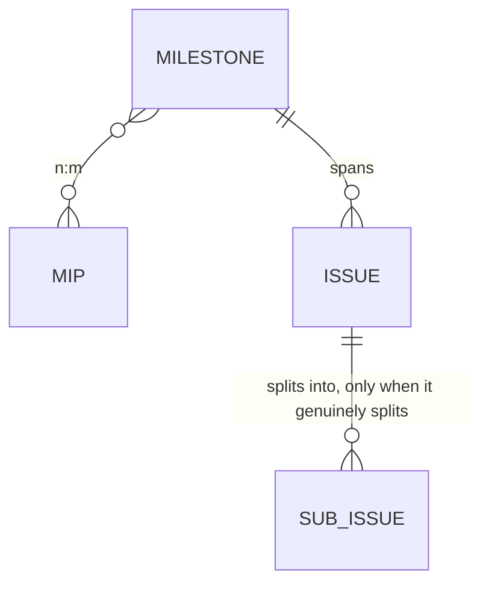
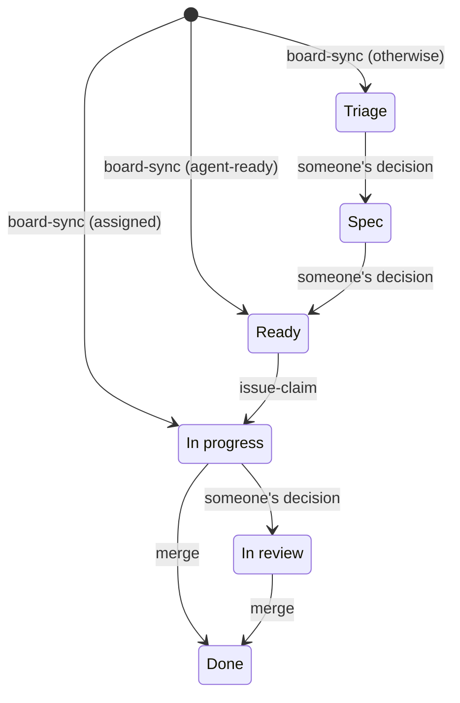

# Issue tracking

`MIP-0063` puts the backlog into GitHub issues and milestones instead of files. This doc is the
short version; the design and its verification are `docs/MIPs/MIP-0063-github-issue-tracking-standard.md`.

## The object model

| Object | Means | Carried by |
|---|---|---|
| **Milestone** | one deliverable / use case, spanning many issues and possibly several MIPs | native milestone + its progress bar |
| **Issue** | a story or task — the claimable, PR-closable unit | labels, assignee, milestone |
| **Sub-issue** | a subtask, only when a story genuinely splits | native sub-issues |

Milestones are named descriptively, carry no sequence, and order between them is a board decision.
A milestone and a MIP are **n:m** — one deliverable can span several MIPs, one MIP files its tasks
into one milestone.

## The three tiers

Pick the tier, then the matching issue form:

- **Tier 1 — bug, chore, docs.** One issue, no milestone, no spec. Use **Bug report**
  (`bug_report.yml`) for something broken in what a user touches — the pipeline, the CLI, the
  Telegram bot, the site. Use **Task** (`task.yml`) for everything else, *including* something
  broken in the repo's own tooling: a script, a hook, CI. `bug_report.yml` asks which LLM backend
  was running and for the `just run` line that triggers it, neither of which a broken shell script
  has.
- **Tier 2 — small enhancement** (roughly two tasks or fewer, no new dependency). One issue
  **whose body is the spec**, sub-issues if it splits, no MIP file. Use **Story** (`story.yml`).
- **Tier 3 — initiative** (a new data source, a scoring change, a new integration, anything
  paid). MIP proposal issue → MIP PR → Accepted → milestone → N issues. Use **MIP proposal**
  (`mip_proposal.yml`); it is **relabelled**, not replaced, once the MIP PR opens, so the design
  discussion stays attached to it.

## The Definition of Ready

An issue becomes `agent-ready` only once all five rules hold:

1. **Acceptance criteria**, as testable checkboxes (`### Acceptance criteria`).
2. **A named test** — file plus test name (`### Named test`).
3. `area/*` **and** `layer/*` set.
4. `size/*` set — S < 100 changed lines, M 100–400, L means split it.
5. **No open `blocked by` dependency**, read from the API rather than from a label.

A heading whose field the author left blank renders as `_No response_` and does not count.
`AGENTS.md` carries the rule that an agent may only begin implementation on an issue holding
`agent-ready`.

The rules follow the tier, because the forms do. A **MIP proposal** is a design request rather
than claimable work, so it is never `agent-ready`. A **bug report** is claimed on its own two
fields: **What you expected instead** stands for the acceptance criteria, and **Failing test** for
the named test.

**A bug report with no failing test is filed, and is not yet claimable.** The field is optional on
purpose — someone who cannot write Scala should still be able to report a bug, and losing that
report costs more than the missing line. So `issue-ready` answering "rule 2: named test" on such an
issue is the checker working, not a contradiction to fix: rule 2 exists so that what proves the bug
fixed is decided *before* someone claims it, and nobody has decided it yet. A maintainer owes the
report a named test — the test that is red today — and the issue becomes `agent-ready` when they
add it.

**A merged task PR closes its issue.** `uprd.sh` writes `Closes #N` into the body of a
`mip-NNNN/<k>-*` PR, for the issue that row `k` of `MIP-NNNN.tasks.md` links. The merge into
`main` closes it, and that clears rule 5 for every task blocked by it. A PR labelled `task-partial`
gets `Part of #N` instead, and the issue stays open. Any other PR closes its issue by a
`Closes #N` line of its own in a commit body, which `uprd.sh` copies into the PR body, the only
place GitHub reads it. GitHub's built-in board workflow then moves the closed issue's card to
**Done** (configured in the project UI, MIP-0063 §4.4).

## The commands

`scripts/issues.sh` is the whole surface, and every subcommand takes `--dry-run` (the reads it is
computed from still happen, so a login is needed either way). Seven of them have a `just` recipe:

| Command | Does |
|---|---|
| `just issue-queue [--milestone NAME]` | the unassigned `agent-ready` issues, sorted size then priority — the read an agent makes before claiming. The ready/blocked/in-triage counts come from the labels and the dependency edges, not from the board |
| `just issue-ready <n>` | runs the five rules, names the one that failed, adds `agent-ready` on an all-pass and removes it on a regression |
| `just issue-claim <n>` | re-runs the rules, assigns the issue to you, drops the label, sets the board Status to In progress, prints the `scripts/stack.sh start` line |
| `just tasks-to-issues MIP-NNNN [--milestone NAME]` | files a MIP's task table: one issue per row that has none, titled `NNNN-Tk: <slug>`, each row's `#` cell rewritten into a link, one native `blocked by` edge per `depends on` entry. Idempotent; the milestone must already exist |
| `just milestone-new "<name>" [--mip MIP-NNNN]` | creates a deliverable milestone; re-running with the same name changes nothing |
| `just labels-sync [--prune] [--force]` | reconciles the repo against `.github/labels.yml`, the versioned manifest; orphans are reported, and only deleted with `--prune` |
| `just board-sync` | puts every open issue on the board and sets its Status from the issue's own state — but only on a card carrying no Status, or `Backlog`, which is what the auto-add workflow writes rather than a state anyone chose. Any other Status is someone's decision and is left alone |

The rest are run through the script. `scripts/issues.sh board setup` (the Status options and the
views §5.2 names; needs `project` scope) and `board gates` (the five phase gate issues) are
one-time bootstraps, and reshaping a shared board or filing issues is not something `just` should
make easy. `sub add <parent> <child>`, `deps add <issue> --blocked-by <n>` and
`deps list <issue>` are the native edges themselves: `tasks-to-issues` calls `deps add` for a whole
task table, and all three are called directly for a one-off edge.

`tasks-to-issues` sets no `area/*`, `layer/*` or `size/*`: which they are is a human's call, so a
freshly filed row is not `agent-ready` until someone labels it and `issue-ready` passes.

## Readiness and the board

The `agent-ready` label (Definition of Ready, above) and the board's `Status` field
(Triage / Spec / Ready / In progress / In review / Done, MIP-0063 §5.2) move together, driven by
the commands above. The mapping `board-sync` uses on a card's first contact with the board
(MIP-0063 §5.2): an assigned issue goes to In progress, an issue carrying `agent-ready` goes to
Ready, otherwise it goes to Triage.

`board-sync` sets a new card's Status once, on first contact with the board, and never overwrites
it again. From there, a move into Spec or into In review is "someone's decision"; a move into In
progress is `issue-claim`; and a move into Done is the merge that closes the issue.

## What no command can do

- **Filing an issue is human-gated** (MIP §5.6, Decision 2). The `triage` skill drafts one and
  runs the readiness check; a person invokes it and a person files.
- **The board** — org project [Marola](https://github.com/orgs/marola-dev/projects/1) — **is
  private, and §5.2 wants it public.** There is no API for the switch.
- **The `Agent queue` view is not sorted by the script.** `ProjectV2View.sortByFields` is readable
  but not writable, so size-then-priority ordering is a UI action; `just issue-queue` sorts the
  same list from the terminal and needs no `project` scope.
