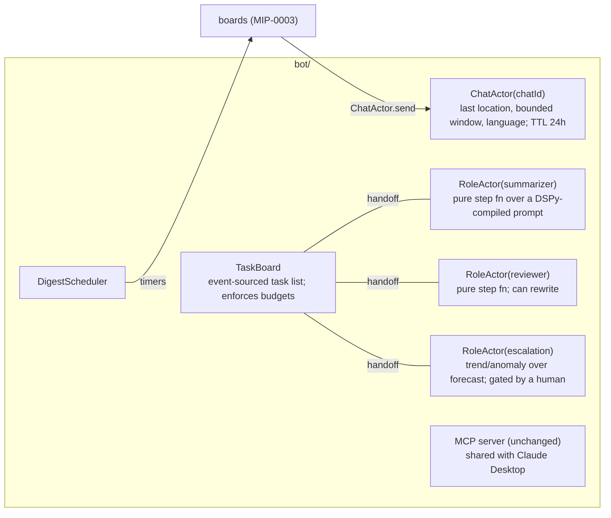

# Multi-agent frameworks survey

> Updated 2026-09-23: `AGENT-STACK-SURVEY.md` re-checks agent4s and llm4s, adds Google's ADK, and
> maps all three to the MIPs.

What exists for building multi-agent LLM systems on the JVM and in Scala, which ideas from the
Python agent frameworks are worth porting, and where Apache Pekko would fit marola. Written from a
web survey on 2026-09-05; every external claim links to its source at the bottom, and anything not
verified is marked. Same house rule as `docs/MIPs/`: a library named here is a *reference to read*,
not an adopted dependency, until a MIP says otherwise.

## 1. What exists today

### 1.1 Apache Pekko in multi-agent systems

- **A documented architecture, not a framework.** Scalac's "AI on the JVM: Multi-Agent
  Architecture with Apache Pekko, Java, and Rust" describes agents as actors, an A2A client at the
  edge, an MCP server in the middle and a Pekko HTTP endpoint behind it, with a bearer token carried
  through all three layers. The closest thing to a published Pekko multi-agent application found.
  *Not verified in detail: the article body could not be fetched from the sandbox; the summary is
  the search engine's, not a reading of the post.*
- **Pekko itself** is the Apache fork of Akka 2.6: typed actors (`Behavior`), supervision,
  mailboxes, timers, cluster, persistence, streams. Apache-2.0, actively released.
- **Akka's commercial agentic platform** (the project Pekko forked from) now ships an `Agent`
  component with session memory, declarative model orchestration and error handling, plus
  workflows, durable entities/views, endpoints and timers in one runtime. Akka cites Fox cutting a
  personalisation engine from 150,000 to 22,000 cores after porting. It is the most complete
  "actors as agents" runtime on the JVM, and it's proprietary (BSL), which is exactly why Pekko
  matters for an open project.

### 1.2 Scala libraries

| Library | Effect stack | What it gives | Maturity (as seen 2026-09-05) |
|---|---|---|---|
| **Kyo AI modules** (already marola's effect system) | Kyo | Typed tool inputs/outputs, resources and prompt templates, OAuth 2.1, MCP 2025-11-25 and 2026-07-28 protocol revisions with negotiation | Part of Kyo 1.x; marola pins RC7 — check what's in the pinned jar before relying on it (marola-app's [`AGENTS.md`](https://github.com/marola-dev/marola-app/blob/main/AGENTS.md) rule) |
| **agent4s** | cats-effect, fs2, http4s | Unified providers (Claude, OpenAI, Gemini, DeepSeek, Perplexity), type-safe tool calling with derived JSON schema, a **LangGraph-style graph module** (state-machine workflows, conditional routing) | v0.1.0, 0 stars, no Ollama listed — read the graph module, don't depend on it |
| **llm4s** | Scala (plain `Either`, `Future` for orchestration) | "Agentic and LLM programming in Scala"; roadmap aims at stable API contracts, provider parity, Java/Kotlin interop, security hardening. Checked against the 0.4.1 jar in MIP-0012: agent loop + handoffs + guardrails, MCP client (stdio/SSE/Streamable HTTP) and HTTP MCP server, `ResponseFormat.JsonSchema`; Ollama client drops tool messages; provider auth is key-only; 154 transitive jars | Active, pre-production per its own roadmap (v0.4.1, 2026-08-29) — **proposed as an opt-in module: `docs/MIPs/MIP-0012-llm4s-adoption-and-dspy-deprecation.md`** |
| **sttp-ai** | fs2 / ZIO / Pekko Streams / Ox | OpenAI, Anthropic, Gemini, **Ollama** and OpenAI-compatible endpoints; structured outputs, tool calling, streaming | Mature client layer; the only one listing Ollama and Pekko Streams explicitly |
| **LangChain4j** (Java) | plain Java, Quarkus/Spring | Unified providers and vector stores, tool calling incl. MCP, agents, RAG | The mature JVM option; builder-and-annotation idioms, usable from Scala |

Nothing in this list is a Scala-native *multi-agent* framework with termination, budgets and
per-step observability. That absence is the design space, not a reason to import one.

## 2. Python ideas worth porting, and their Scala shape

| Python idea | From | Scala equivalent | marola today |
|---|---|---|---|
| Graph of nodes over typed state with conditional edges | LangGraph | An `enum` of node types and a pure `step: (State, Event) => (State, Next)`; run it from an actor or a Kyo loop. Exhaustive `match` replaces LangGraph's runtime edge validation. | `Main.summarizeTop → Reviewer.review` is a two-node graph hardcoded in a for-comprehension |
| Roles with a shared task board and handoffs | CrewAI, AutoGen | One actor per role; the board is an actor holding an event-sourced task list; a handoff is a message. Pekko gives supervision, mailboxes, timeouts and location transparency for free. | Summarizer, reviewer, and the escalation agent (MIP-0004 / `FUTURE-WORK.md` §9.2) are three roles |
| Tools as typed function signatures | OpenAI Agents SDK, PydanticAI | `case class` parameters with a derived JSON schema (Kyo's typed tool I/O or agent4s's registry); MCP as the transport | [`SwimConditionsMcpServer`](https://github.com/marola-dev/marola-app/blob/main/cli/src/main/scala/marola/agent/SwimConditionsMcpServer.scala) exposes four tools with hand-written schemas |
| Structured outputs validated at the boundary | PydanticAI | Opaque types / Iron at the parse boundary, `Abort[E]` as the failure channel (the [Scala 3 and JDK review](https://docs.marola.dev/5-Repos/marola-app/2-libraries_scala3-jdk/#21-opaque-types-for-units-and-ranges-highest-payoff) §2.1, [§2.3](https://docs.marola.dev/5-Repos/marola-app/2-libraries_scala3-jdk/#23-typed-error-channels-with-aborte)) | [`Reviewer.extractJsonObject`](https://github.com/marola-dev/marola-app/blob/main/core/src/main/scala/marola/llm/Reviewer.scala) is the untyped version |
| Compiled prompts and optimisers | DSPy | `ds4s` (`FUTURE-WORK.md` §10): `Signature` as a case class, `Predict` as a Kyo effect, `BootstrapFewShot` over a trainset | Two DSPy-compiled artifacts loaded by `CompiledPrompt` |
| Human-in-the-loop interrupts, checkpoints | LangGraph | Persistent actors with snapshots, or a Kyo `Scope` around a durable store — the gate MIP-0004 requires before proactive alerts | Not built |
| Memory across turns and agents | AutoGen, Akka Memory | An actor per conversation holding a bounded window + `KnowledgeStore` for long-term recall | `FileKnowledgeStore` is long-term memory without the per-conversation part |
| Budgets, termination, tracing per step | every framework, none of the Scala libs | A hard cap on model calls per task and per role; a span per step through the existing `Tracing` seam; a `Terminated` node type in the graph | `Tracing.withSpan` wraps one call; no budgets anywhere |

## 3. Where Pekko fits marola — and where it doesn't

Pekko earns its place the moment marola has more than one **long-lived, stateful** thing running
concurrently: the Telegram poll loop, per-chat conversations, a digest scheduler, an escalation
agent watching conditions. Those are actors: they have state, outlive a request, need supervision
and backpressure. The current request-scoped pipeline does not need it; Kyo `Async` covers
fan-out inside one request (the [Scala 3 and JDK review](https://docs.marola.dev/5-Repos/marola-app/2-libraries_scala3-jdk/#3-jdk-the-project-is-on-25-what-21-offers-this-code) §3).

Sketch (a natural MIP-0005):

Pekko Typed's `Behavior` API keeps actors pure and testable with `BehaviorTestKit`, which fits
this repo's "logic outside the effect boundary" rule; Kyo effects run inside message handlers via
the same `AllowUnsafe` boundary the MCP server already uses. Actors give **concurrency and
resilience, not agent semantics**: termination, budgets and observability per step still have to be
designed. That is §2's last row, and the part a MIP must not skip.

## 4. Reading list, in order

1. Pekko Typed actors guide: the `Behavior` model and testkit.
2. agent4s's graph module: the smallest LangGraph-in-Scala to steal the shape from.
3. sttp-ai's Ollama + tool-calling API, if marola ever replaces `Http`/`JsonValue` for LLM calls
   (marola-app's [Libraries](https://docs.marola.dev/5-Repos/marola-app/2-libraries/#kyo-http-and-kyo-schema)
   page already considers kyo-http; sttp-ai is the alternative).
4. Akka SDK's Agent/Workflow docs: the most complete design to compare against, licence aside.
5. LangGraph's and PydanticAI's docs: for the *ideas* in §2, not the code.

## Sources

- [AI on the JVM: Multi-Agent Architecture with Apache Pekko, Java, and Rust — Scalac](https://scalac.io/blog/agentic-ai-is-engineering-challenge/)
- [Apache Pekko — Introduction to Actors](https://pekko.apache.org/docs/pekko/current/typed/actors.html)
- [Apache Pekko: Simplifying Concurrent Development with the Actor Model — InfoQ](https://www.infoq.com/news/2024/02/apache-pekko-actor/)
- [Akka SDK — Everything an agentic system needs](https://akka.io/platform/sdk)
- [Announcing the Akka Agentic Platform](https://akka.io/blog/announcing-akkas-agentic-ai-release)
- [agent4s — Scala 3 toolkit for building AI agents](https://github.com/razeghi71/agent4s)
- [llm4s — Agentic and LLM Programming in Scala](https://github.com/llm4s/llm4s)
- [Scala in AI 2026: Type Safety for LLM Systems — Scalac](https://scalac.io/blog/scala-ai-type-safety-llm/)
- [LangChain4j](https://github.com/langchain4j/langchain4j) · [LangChain4j agents tutorial](https://github.com/langchain4j/langchain4j/blob/main/docs/docs/tutorials/agents.md)
- [AI4JVM — Java & JVM AI ecosystem guide](https://ai4jvm.com/)
- [Java AI agent frameworks in 2026 — CodeWiz](https://codewiz.info/blog/java-ai-agent-frameworks-2026/)
