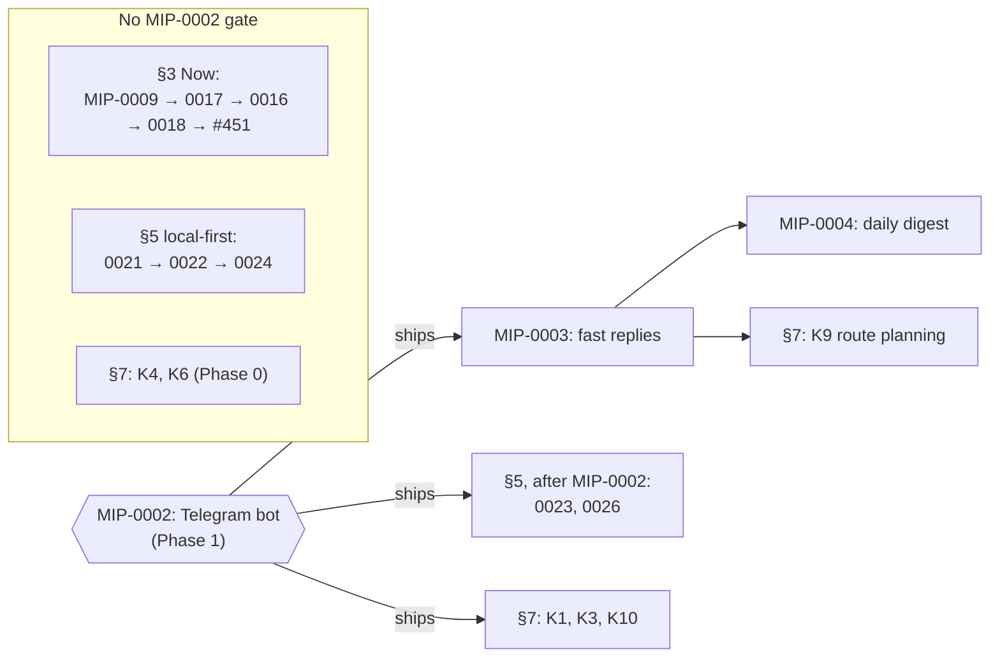

# Roadmap

What to do next, in what order, and why, balancing the bugs two reviews found today, the eighteen
MIPs already on file, and what marola's multi-agent design still needs. Written the day MIP-0011
finished: every hook, rule, subagent and skill it proposed is merged (#102, #108–110, #115–122), and
the two reviews that ran on that stack are the first evidence of whether the tooling holds up.
Statuses below are evidence-based: a row is "merged" only if `git log main` says so.

## 1. Where things stand

**Merged and load-bearing.** MIP-0001 (water quality + sea lore), MIP-0005 (map/static site),
MIP-0008 (Docker images + smoke test), MIP-0010 (MLflow ledger, v1 local), MIP-0011 (Claude Code
practices as hooks/rules/agents/skills). Today's stack also landed the perpetual runner's
proactive usage routing (#125), `mip-tasks` taking a bare number (#126), MIP-0009's task list
(#127), and the arXiv digest + MIP-0019 (#118).

**Verified today, for real.** `mip-reviewer` (MIP-0011 task 7) ran live against PR #120 and
found a Critical the author's check missed: the subagent pattern works. `/code-review ultra`
ran on the whole stack (free tier) and found 2 normal + 7 nit issues, all reproduced by hand
before filing. The `heavy-usage` "stop before the wall" claim was read from source: real but
soft, a prompt injection at a projected threshold, not a hard block (`DEV-FLOW.md` §7).

**Honest gaps.** MIP-0002 (the Telegram bot, Phase 1, the product's first user surface) is
still Draft. `AGENTS.md`'s phase discipline gates every cloud-live step behind it. The
multi-agent work (§5 below) can be designed and built local-first now.

## 2. P0 — before anything new

Two P0 blocks, and they are not the same kind of thing: **2a** is the bug backlog (fix it), **2b**
is the one shipping goal that outranks every new MIP (do it). Section numbers below 2 are left
alone on purpose: `MIP-0037`'s index row and others cite this file by section ("ROADMAP.md §7
K8"), so renumbering would break those pointers.

### 2a. Bugs found today

Six findings, all fixed: the Critical the same day (#129), the five nits the next (#224). The last
column is the change that fixed each one; open bugs live in the issue tracker.

| # | Finding | Severity | Fixed by |
|---|---|---|---|
| 10 | `.mcp.json`'s `just mcp-server` exits ~2 s after start under sbt in-process run — the registered MCP server was dead on arrival (mip-reviewer) | Critical | `build.sbt:118`,`:122`,`:123` — `fork` + `connectInput` + `StdoutOutput`; the handshake returns four tools. A fresh session's `/mcp` is still the human check |
| 04 | `stop-gate.sh` ignores newly created (untracked) `.scala` files — `git diff HEAD` by design | nit | `.claude/hooks/stop-gate.sh:23`, `ls-files --others --exclude-standard` |
| 08 | `stop-gate.sh` `mkdir`/`touch` under `set -e` can exit 1 (not 0/2) on a read-only runtime dir | nit | `.claude/hooks/stop-gate.sh:30`,`:34`, plus a self-test against an unwritable dir |
| 05 | `format.sh --self-test` hard-fails without `cs`/network, unlike its `ruff` guard — blocks every push in an air-gapped shell | nit | `.claude/hooks/format.sh:51`,`:77` |
| 06 | `mip-reviewer` runs `git rev-parse`, not in `permissions.allow` — two prompts per review | nit | `.claude/settings.json:39` |
| 03 | `DEV-FLOW.md` §7→§8 renumbering left stale section pointers | nit | `scripts/deps-stack.sh:3`,`:391`, `CONTRIBUTING.md:85` |

One later finding is still open, filed while building MIP-0063's own tooling: `cost-fill.sh` passes
`cherry-pick --empty=drop`, which needs git ≥ 2.45, so `just pr` exits 129 on an older git —
[#451](https://github.com/marola-dev/marola/issues/451).

Two lessons that outlive the fixes: (a) a test that can't distinguish "works" from "died silently"
isn't a test: `< /dev/null → 0 bytes` passed while the server was dead; the reviewer's piped
handshake is now the reference check for anything stdio; (b) safety gates get adversarial
self-tests (path prefixes, wrappers, hostile env values), not happy-path ones.

### 2b. Publish marola-sea to Hugging Face — after every pending merge

**P0. The gate is the merge queue, not the calendar**: this starts once every open PR has landed,
because the model that gets published has to be built from a main that already contains the
MIP-0025 dataset and training work. Merging first also keeps the model card honest: it cites
`docs/benchmarks/` numbers, and those move as the finetune PRs land.

What it is: MIP-0025 §5.1's export chain, task 6 (`hf-publish`) of
[`MIP-0025.tasks.md`](../MIPs/MIP-0025.tasks.md): `peft` merge → `convert_hf_to_gguf.py` →
quantize (Q4_K_M + Q8_0) → `CHECKSUMS` → Hugging Face `upload_folder` with a model card carrying
the base model, the training-data description, the `docs/benchmarks/` numbers and the IMPRÓPRIA
safety note from §6 verbatim.

Acceptance is MIP-0025 §7's own, unchanged and deliberately end-to-end: `ollama run
hf.co/<user>/<repo>` pulls and runs the model on a machine that never had it locally. Anything
short of that is tooling, not a publish.

Two things to check before starting, both real today:

- The tooling already exists on an open PR: `finetune/publish_hf.py`, on
  `mip-0025/2-hf-publish-tooling` (**#206**). Its PR title still reads "mip-0025 task 1:
  tier2-baseline-evidence", which is stale; the branch's actual diff is `publish_hf.py` +
  `finetune/README.md` + `requirements.txt` + `justfile`. Retitle it when it comes up for merge.
- The branch numbers in `mip-0025/N-*` do **not** line up with the task numbers in
  `MIP-0025.tasks.md`: `hf-publish` is task 6 there but branch 2 here. Read the task list as
  authoritative for order and the branch name as a label only.

## 3. Now (this week) — existing MIPs, cheapest first

1. **Merge the open PRs** in `GH_POST_MORTEM.md`'s order: the two P0 fixes, `docs/mip-0011-mark-verified`
   (flips MIP-0011 to Implemented with its real ~$12.86), the auto-pick step-4 fix.
2. **MIP-0009** (S, cheap win): task list merged; run `/mip-solve-perpetual 0009`. Four PRs; task 2
   builds the Node harness the MIP wrongly assumed existed.
3. **MIP-0017 §5.1/§5.2** (S): the flat-file run tracker for overnight runs and the "reviewer gets
   the diff inline" rule. §5.3 (skill-frontmatter audit) has no urgency.
4. **MIP-0016** (M, "do next"): water-quality marks placed in the sea; user value, no new source.
5. **MIP-0018** (M, cheap win): the post-planner + exporter; MIP-0020 (Instagram, in draft) becomes
   one more export target with a real API, unlike LinkedIn/Substack.
6. **#451** (`just cost-fill` on git < 2.45), the one open item from §2a.

## 4. Next (Phase 1) — the gate every cloud step waits on

**MIP-0002, the Telegram bot** (L, "do next"). Until it ships, nothing may be provisioned on a cloud
backend (`AGENTS.md`).
MIP-0003 (fast replies, M) follows it: a bot that takes ten seconds loses the user. MIP-0004
(daily digest, L) is the retention story after that.

What the gate does and does not hold up:

## 5. Multi-agent — what's missing and which MIP closes it

New MIP numbers proposed here start at 0023 (0020 is the Instagram bot, in draft; 0021 accessibility and 0022 the safety footer were drafted from §7 on 2026-09-06). None is built; each is design-first.

| Gap | Proposed MIP | Local-first? |
|---|---|---|
| A third agent: the pipeline is two sequential calls in `Main`, with no agent that has a genuinely different responsibility | **MIP-0023 — hazard/escalation agent**, `FUTURE-WORK.md` §9.2 word for word: trend/anomaly detection over the Open-Meteo series marola already fetches, false-positive-averse thresholds, a *human-confirmation gate on the alerting itself* (`AGENTS.md`), explicit non-replacement of official alerts. The single highest-value unbuilt multi-agent item; deterministic core in `scoring/` | yes |
| Topology: the orchestration is implicit, not documented | **MIP-0024 — roles as addressable units**: summarizer / reviewer / escalation as Pekko typed actors with supervision and mailboxes, the concrete Scala shape `docs/4-Research-and-plans/AGENT-FRAMEWORKS-SURVEY.md` already picked; each also exposed as an MCP tool so the topology is *observable*, not prose | yes |
| Evaluation: `Reviewer` evaluates one agent's output but is not a formal eval harness; multi-agent tracing has no direct JVM/Scala equivalent | **MIP-0026 — multi-agent eval harness + cross-agent traces**: per-agent contribution scoring on top of `just benchmark`, traces with a shared run id across summarizer/reviewer/escalation into MIP-0010's MLflow ledger | yes |

**Order among the new MIPs:** 0021 → 0022 → 0024 (all local) → then, after MIP-0002: 0023, 0026.

## 6. Dev tooling — what "state of the art" still lacks here, by this repo's own bar

MIP-0011 delivered gates-as-hooks, path-scoped rules, two subagents, a proactive perpetual runner,
MCP registration. Still missing, per `docs/4-Research-and-plans/AGENT-FRAMEWORKS-SURVEY.md` and `AGENT-SKILLS.md`:

- **Product agents as addressable units**: `.claude/agents/` holds only dev-tooling reviewers;
  nothing represents summarizer/reviewer/escalation. MIP-0024 closes it.
- **Adversarial self-tests for gates**: extend the pattern to `stop-gate.sh` and any future
  `PreToolUse` hook.
- **The three remaining `AGENT-SKILLS.md` §3 skills** (`fixture-refresh`, `benchmark-compare`,
  `water-provider`): follow-ups off `main`, one PR each, per MIP-0011.tasks decision #1.
- **Cost accounting for reviews**: an ultrareview is free 3×, then paid; MIP-0011's Cost row now
  says to log the real price the first time one is spent. Do it.

## 7. Candidate MIPs — external consolidation (Kimi, 2026-09-06), triaged

Ten ideas handed in by the maintainer from a Kimi session, kept verbatim in intent, triaged here
against what already exists. **No numbers claimed**: per the `mip` skill a number is taken when
the file is written (0020 is the Instagram bot, in draft; 0023, 0024 and 0026 are §5's proposals; 0021/0022 are K4/K6, now drafted),
so these are candidates until someone drafts one. "Verdict" uses the index's vocabulary.

| # | Candidate | Overlaps / builds on | Phase | Verdict |
|---|---|---|---|---|
| K1 | **Activity-aware scoring** — `Swimability` → an `ActivityScoring` trait: swim, surf (period + swell dir + tide), dive (Copernicus chlorophyll/turbidity), kayak (wind + current + entry); board gains `activity`; the bot asks first | `FUTURE-WORK.md` §1.3/§1.4 already sketch surf/dive; MIP-0005's map is the layer switch | 1 → 2 (Copernicus) | do when MIP-0002 lands — the "what are you doing?" turn needs the bot |
| K2 | **Proactive hazard alerts** — IMA flips PRÓPRIA→IMPRÓPRIA or a storm surge inside 6 h → unsolicited Telegram push to that beach's subscribers, behind a human-confirmation gate | **Same idea as §5's MIP-0023** (hazard/escalation agent, `FUTURE-WORK.md` §9.2); K2 adds the *delivery* half (consent, rate limit, kill switch) that needs MIP-0004's subscriber store | 2 | fold into MIP-0023 as its Phase-2 delivery section — one design doc, not two |
| K3 | **Calendar export** — `/calendario` + an `.ics` link on the card: best hour as an event with tide, water verdict, "leave now" reminder; pure formatter | MIP-0002 (bot), MIP-0005 (card), MIP-0004 (the digest habit it extends) | 1 | cheap win once the bot exists — one pure function, one spec |
| K4 | **Beach accessibility** — `AccessibilityClient` over Overpass tags (`wheelchair`, `parking`, `shower`, `lifeguard`), matched like `BeachFinder`, shown in notes/card; deterministic | `BeachFinder`'s Overpass path; `docs/2-Building-marola/ARCHITECTURE.md` §5 pluggable pattern | 0 → 1 | cheap win — the one candidate buildable *today* with no new provider |
| K5 | **Forecast verification** — store each served forecast, compare with next-day Open-Meteo past observations (or MIP-0006 `Look`s); weekly per-beach accuracy | `ARCHITECTURE.md` §8's calibration promise; feeds MIP-0007; reuses MIP-0010's ledger | 4 | park until there is a month of served boards to compare |
| K6 | **Safety RAG corpus** — `knowledge/safety/` (rip-current escape, jellyfish first aid, fishing-zone limits), retrieved first, standard lifeguard/SAMU footer | MIP-0001's corpus rules; the `corpus-doc` skill (MIP-0011 task 8) is the tool for exactly this | 0 → 1 | do next, via `corpus-doc`, one sourced doc per PR — no MIP needed for the corpus itself; the "safety footer always" rule *is* MIP material (touches safety text) |
| K7 | **Operational metrics/SLOs** — reply p99, cache hit rate, board freshness, Overpass 429s, IMA parse failures; `/metrics`, local `metrics.jsonl` | **Overlaps §5's MIP-0026** (eval + traces); MIP-0010 covers experiments, not production health | 3 | fold into MIP-0026 as its "operational" half, or split after MIP-0002 |
| K8 | **PWA for the map** — service worker caching last board + assets, manifest, install prompt, refresh button | MIP-0005's "plain files, no build" constraint — a service worker is plain JS, still no build | 1 | cheap win after MIP-0009 (same `app.js`, avoid two hands in one file) |
| K9 | **Route planning** — start/end (or Maps URL via `Coordinates.fromMapsUrl`), corridor sampling, score at arrival hour, ranked itinerary | `BeachFinder` gains a corridor mode; no new source | 1 | do when X lands (X = MIP-0003 — a corridor multiplies fetches; caching first) |
| K10 | **i18n framework** — `MessageBundle` trait, per-language JSON, plurals, CI gate for missing `pt-BR` | MIP-0002/0004 both mention pt-BR with no plumbing | 1 | do with MIP-0002, not before — the first user-facing strings are its |

**Where they slot into §3–§5's order:** K4 and K6 now (Phase 0, no new provider, `corpus-doc`
exists); K3, K8, K10 ride with MIP-0002/0009; K2 and K7 are absorbed into MIP-0023 and MIP-0026
rather than becoming separate docs; K1, K9 after Phase 1; K5 parked.

### Provider-query checklist — verify before any of these becomes a MIP

The `mip` skill's step 3: fetch the page, confirm format, update frequency, licence/terms, key
needed; record what was *not* checked. One line per external claim the candidates above make.
Tick with the date and the URL you actually read.

- [ ] **Overpass / OSM tags (K4)**: `wheelchair`, `parking`, `shower`, `lifeguard`, `amenity`
      coverage on Santa Catarina beaches: run the query, count how many of the ~40 beaches carry
      each tag (sparse tags make a feature that lies by omission); Overpass rate limits (the 429
      rate K7 wants to measure); ODbL attribution already satisfied by MIP-0005?
- [ ] **Copernicus Marine (K1 dive)**: chlorophyll-a / turbidity product for the SW Atlantic
      coast: product id, spatial resolution (is 4 km useful 300 m off a beach?), update cadence,
      account/key requirement, licence; whether the free tier is enough.
- [ ] **Open-Meteo Marine (K1 surf)**: `swell_wave_direction`, `swell_wave_period`, tide/sea-level
      fields already used by the golden fixtures; confirm which are hourly vs 3-hourly for the
      surf score.
- [ ] **Open-Meteo "past" observations (K5)**: the historical/`past_days` endpoint: is it
      re-analysis or the earlier forecast? (If it's the model's own hindcast, "verification" is
      circular.) Retention window, resolution, terms for storing series.
- [ ] **IMA/SC bulletins (K2)**: publication cadence and the flip latency PRÓPRIA→IMPRÓPRIA:
      how soon after sampling does the page change? (Determines whether a "push within 6 h" claim
      is honest.) Existing parser's failure modes (K7's "IMA parse failure rate").
- [ ] **Telegram push limits (K2)**: Bot API broadcast limits (messages/second, per-chat), and
      what "unsolicited" means under Telegram's terms once MIP-0004 has subscribers.
- [ ] **iCalendar (K3)**: RFC 5545 `VEVENT` with `VALARM`; how Telegram delivers an `.ics`
      (document vs link); timezone handling for `America/Sao_Paulo` (no DST since 2019, verify).
- [ ] **Service-worker constraints (K8)**: GitHub Pages serves over HTTPS (required); scope and
      cache-busting for `latest.json` written by `site.yml`; iOS Safari install-prompt behaviour.
- [ ] **Google Maps route URL shapes (K9)**: what `Coordinates.fromMapsUrl` parses today vs a
      directions URL (`/dir/…`); no Google API call is implied. Confirm the corridor is computed
      locally from the two coordinates only.
- [ ] **Sources for `knowledge/safety/` (K6)**: Brazilian lifeguard (CBMSC/GBS) rip-current
      guidance, SAMU 192, a jellyfish first-aid reference from a health authority; each must be a
      fetchable, citable URL: the corpus rule is "anything you can't verify, delete".
- [ ] **Prometheus/OTel metrics (K7)**: Kyo/JVM OTel metrics exporter availability vs the
      `claude_code.*` OTLP path `AGENTS.md` already names.
- [ ] **pt-BR plural rules (K10)**: CLDR data for `pt` (one/other) and whether a JVM
      `MessageFormat` suffices before adding a dependency.

## 8. Parked, deliberately

MIP-0007 (time-series foundation models), MIP-0015 (Interação matching, a social feature),
MIP-0014 (the book, XL), MIP-0012 (llm4s, XL, revisit when
MIP-0024's actor shape shows what the LLM layer needs), MIP-0013 (OpenCode tryout, S, cheap, but
only worth running once the hooks it would compare against have a month of use).

## 9. How this file stays true

Update it in the same PR that changes a status above (a MIP flipping to Implemented, a P0 closing,
a new review run). Stale roadmaps are worse than none. `docs/MIPs/README.md` is the index of
record for MIP status; this page is the ordering and the reasons, and defers to it on facts.
