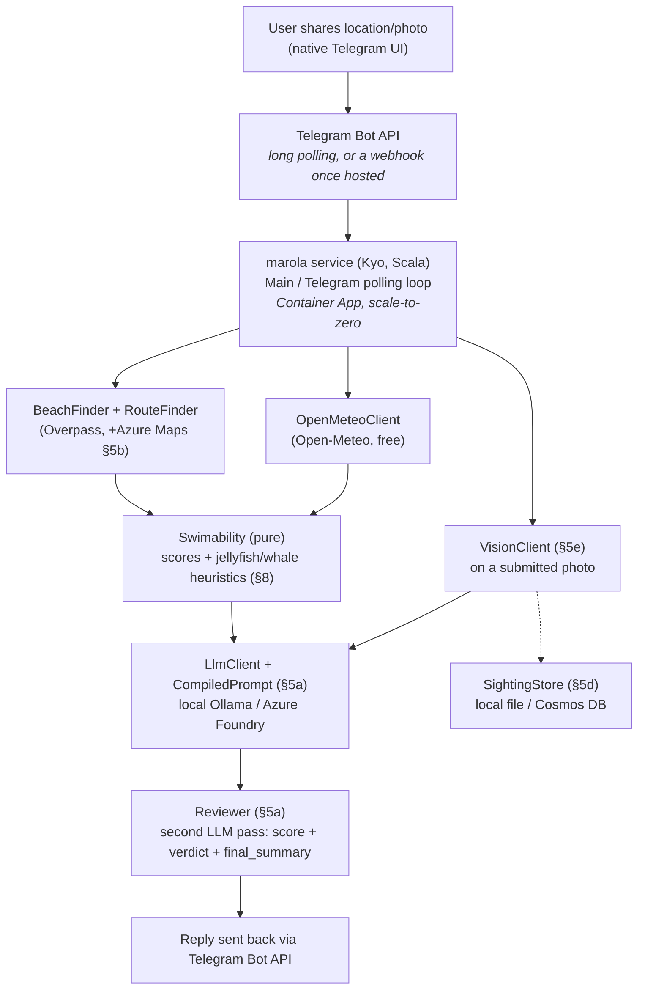

# marola — Architecture

**Status:** POC pipeline plus six pluggable local/Azure integrations, all implemented and
compiling; most exercised live (see the per-feature "Verified" notes in §3). No Azure resources
provisioned, no Telegram bot registered yet — everything Azure-flagged below is real, correct
client code checked against real SDKs/API references, not yet run against a live Azure account.

Related docs: [`FUTURE-WORK.md`](./FUTURE-WORK.md) (multi-activity support — diving, surfing, any
sea-related activity; three reviewed-not-adopted/deferred dependencies; evaluation-harness ideas),
[`EFFECTS-MAP.md`](./EFFECTS-MAP.md) (a Scala/FP-purity review — what's pure, what's `< Sync`, and
the one hidden untracked effect worth knowing about), [`RUN-LOCALLY.md`](./RUN-LOCALLY.md) (a
step-by-step guide to running the whole pipeline with a small local Ollama model, no Telegram, no
Azure), and [`TELEGRAM-SETUP.md`](./TELEGRAM-SETUP.md) (registering the bot and configuring
credentials for both the local-dev and Azure-Foundry paths).

marola is a real product **and** hands-on coverage of every AI-103 exam domain (see §10), built
around a language model synthesis step actually driven by an **offline-compiled DSPy prompt**, and
a **local-first design**: every Azure integration below has a free, local default and is entirely
optional, not a bootstrap-only stand-in.

## 1. Problem & product vision

**MVP hypothesis:** a Telegram message — "what's the best hour tomorrow to swim nearby?" — gets
back a ranked list of nearby open-water swim spots, each with its best hour tomorrow, sea
temperature, wind, wave height, a jellyfish-likelihood heuristic, and (informational, not
safety-relevant — see §8) a whale-sighting-likelihood heuristic, backed by live marine/weather data
and a Telegram-native location share, not a typed-in address.

**Non-goals for the POC:** multi-day forecasts, saved/favorite spots, push notifications
("tell me when conditions turn good"), any deployment at all yet.

## 2. Why Telegram, not WhatsApp or a Streamlit page

This is a personal tool with no closed-beta allowlist or business-identity requirement, so the
interface choice came down to Telegram vs. a Streamlit web app:

| | Telegram bot | Streamlit page |
|---|---|---|
| Location sharing | Native "Share Location" (one-time or live), built into every client, no extra code | Needs the browser Geolocation API + a JS bridge component (Streamlit has no direct JS access) — extra dependency, extra permission prompt per session |
| Mobile experience | First-class — it's a chat app | Fine, but a browser tab is a step down from "message a bot" for something you'd check standing on a beach |
| Hosting | Long-polling works with **no public HTTPS endpoint** (see §6) — can run from a laptop for the POC | Needs a hosted, publicly reachable process from day one |
| Auth | Telegram user ID *is* the identity — "borrow, don't build" | Needs its own session/identity story |

Telegram wins on every axis that matters for this use case. **Decision: Telegram bot.**

## 3. What's actually built

A real, runnable pipeline plus six independently pluggable local/Azure integrations — no mocks,
no stubs pretending to be real:

Four sbt modules at the repo root — `core`, `local`, `azure`, `cli` (see `FUTURE-WORK.md` §7.2 for
why, and the dependency-inversion fix that keeps `core` free of any Azure reference):

```
core/src/main/scala/marola/
  Recommender.scala              orchestrates the core pipeline, scores every nearby beach
  beaches/BeachFinder.scala      nearby beaches via OpenStreetMap Overpass (free, no key) —
                                  nodes, ways AND relations (most large beaches are relations)
  conditions/OpenMeteoClient.scala   hourly sea temp / wave height / wind / current / daylight
                                      via Open-Meteo (free, no key)
  scoring/Swimability.scala      pure heuristic scoring — jellyfish risk + whale sighting
                                  likelihood, no I/O, unit-tested
  llm/                           §5a — LlmClient (trait), CompiledPrompt (replays a
                                  DSPy-compiled artifact), Reviewer (a second LLM pass that
                                  grades/can override the summarizer's output)
  water/                         §5g — WaterQuality model, WaterQualityClient (trait),
                                  WaterQualityMatcher (pure: agency points → OSM beaches)
  conditions/Tides.scala         §5g — tide turns from Open-Meteo's hourly sea level (pure)
  lore/SeaLore.scala             §5g — curated, sourced "did you know?" paragraph (verbatim)
  knowledge/                     §5h — Embedder + KnowledgeStore (traits), Corpus chunker,
                                  FileKnowledgeStore (JSON vector index), OceanQa (grounded Q&A)
  sightings/                     §5d — SightingStore (trait) + Sighting model
  vision/                        §5e — VisionClient (trait)
  http/Http.scala                java.net.http.HttpClient wrapped at the Kyo Sync boundary
                                  (JSON POST, form POST, raw-bytes POST, GET)
  json/Json.scala                minimal hand-rolled JSON reader AND writer (no JSON library
                                  dependency)
  model/Models.scala             Coordinates, Beach, HourlyConditions, BestHour, JellyfishRisk,
                                  WhaleSightingLikelihood

local/src/main/scala/marola/     zero Azure SDK dependency — the always-available path
  llm/LocalLlmClient.scala       local Ollama chat backend
  vision/LocalVisionClient.scala local multimodal Ollama backend
  sightings/LocalFileSightingStore.scala   JSON-lines file store
  water/ImaScWaterQualityClient.scala      §5g — IMA/SC bathing-water feed (Santa Catarina)
  knowledge/OllamaEmbedder.scala           §5h — embeddings via Ollama's native /api/embed

azure/src/main/scala/marola/     every optional Azure integration lives here, nowhere else
  llm/AzureFoundryLlmClient.scala   §5a — Azure AI Foundry
  vision/AzureVisionClient.scala    §5e — Azure AI Vision
  beaches/RouteFinder.scala         §5b — Azure Maps real travel distance
  sightings/CosmosDbSightingStore.scala   §5d — Cosmos DB
  observability/Telemetry.scala     §5f — Application Insights via OpenTelemetry

cli/src/main/scala/marola/       depends on core + local + azure — the one place that picks
                                  a backend per integration
  Main.scala                     CLI entry point (KyoApp) — see §3.1 for its flags
  Report.scala                   pure text rendering: ranked list, detailed block, lore, answers
  AppConfig.scala                env config + a llmClient/sightingStore/visionClient/
                                  distanceRefiner factory method per pluggable integration
                                  (each: local default, Azure opt-in, returns None if Azure
                                  chosen but not fully configured)
  agent/SwimConditionsMcpServer.scala   §5c — exposes BeachFinder/Recommender as MCP tools

dspy/
  compile_recommendation_prompt.py   offline DSPy compile step (§5a) — defaults to a local Ollama
                                      model, run for real against one (see Status note below);
                                      optional Langfuse tracing
```

### 3.1 `Main`'s CLI surface

```
just run                                          # ranked list + detailed block + lore, no LLM
just run -- --lat <lat> --lon <lon>                # explicit location (else env vars, else IP — §3.1)
just run -- --summarize                            # + LLM natural-language summary (§5a)
just run -- --report-sighting <jellyfish|whale|pollution> <beach> [note]   # §5d
just run -- --analyze-photo <path>                  # §5e
just run -- --brief                                 # the pre-MIP-0001 one-line list, no block/lore
just run -- --ask "<question>"                      # §5h — grounded Q&A over knowledge/ (just ask ...)
just run -- --reindex                               # §5h — re-embed knowledge/ (just knowledge-index)
```

Since MIP-0001 the default output is the ranked list with a **water-quality column**, a
**detailed block** for the top pick (per-point water quality, waves/period/swell, tide turns,
air, jellyfish, whales), the summary/review if `--summarize`, and one **sea-lore paragraph**
(`MAROLA_SEA_LORE=off` or `--no-lore` to drop it). See `RUN-LOCALLY.md` §4 for a real run.

Sample output against live data:

```
marola :: best hour tomorrow to swim nearby (POC)
origin -> lat=-22.9878, lon=-43.1913 (radius 15km)
 1. [ 75/100] Praia do Diabo         (0.2km away)  best at Sat 5 Sep, 00:00  |  23.5°C sea, 14km/h wind  |  jellyfish: Moderate  |  choppy (1.0m waves), some jellyfish likelihood
 2. [ 75/100] Cossetti's Playgroung  (3.2km away)  best at Sat 5 Sep, 00:00  |  23.5°C sea, 14km/h wind  |  jellyfish: Moderate  |  choppy (1.0m waves), some jellyfish likelihood
 ...
```

The whale-sighting field only shows up when non-`Low` (suppressed above because midnight has no
daylight); confirmed against live September daytime data instead: `06:00-10:00` all show `High`.

**Where "nearby" is measured from.** `Main` resolves the origin in this order and prints which one
it used on the `origin ->` line:

1. `--lat`/`--lon` flags (both required — one without the other is ignored with a warning).
2. `MAROLA_ORIGIN_LAT`/`MAROLA_ORIGIN_LON` env vars (same both-or-neither rule).
3. **IP geolocation** (`core/location/IpGeolocation.scala`): three free, keyless providers
   (ipinfo.io, ipwho.is, ip-api.com) are queried and the medoid answer wins, so a single provider
   mapping a Brazilian ISP's block to its head-office city is outvoted rather than trusted. The
   output says how many providers agreed (`3/3`, `2/3`, ...). Accuracy is city-level at best, so
   the search radius is widened to at least 20km (never narrowed below `MAROLA_BEACH_SEARCH_RADIUS_KM`
   if that's larger). Verified live from Florianópolis: all three providers agreed, the medoid
   landed in the centro, and the island's beaches came back.
4. The built-in Arpoador default, only if no provider answered at all (offline).

No Azure setup, no Telegram token are needed for any of the above — every integration defaults to
free/local, see §5's table.

## 4. Target architecture (Telegram bot, once built)



`SwimConditionsMcpServer` (§5c) exposes `BeachFinder`/`Recommender` as MCP tools for any MCP client
(Claude Desktop locally, or a Foundry agent once deployed) to call directly, as an alternative
entry point to the hardcoded pipeline above — not shown in the diagram since it's a parallel access
path, not a stage in this one.

  Telemetry (§5f) wraps the pipeline in an OpenTelemetry span when configured — cross-cutting,
  not shown as a pipeline stage.
```

Cross-cutting: rate limiting (per Telegram user ID) and a cost-governor check before any paid call,
built early, not bolted on.

## 5. The six pluggable integrations: local default, Azure opt-in

Every one of these follows the same shape: a trait, a local (free) implementation that's the
default, an Azure implementation that's opt-in via env vars, and an `AppConfig` factory method
(`llmClient`, `sightingStore`, `visionClient`) returning `None` if Azure is selected but not fully
configured (so `Main` can fail gracefully with a clear message rather than a stack trace).

| # | Capability | Local default | Azure opt-in | Env var to switch |
|---|---|---|---|---|
| 5a | Query synthesis (turn the #1 result into a sentence) | Ollama-compatible chat completion | Foundry/Azure OpenAI chat completion via `azure-identity` | `MAROLA_LLM_PROVIDER=azure` |
| 5b | Beach distance | Haversine ("as the crow flies") | Azure Maps real driving distance | set `AZURE_MAPS_SUBSCRIPTION_KEY` |
| 5c | Agentic tool access | MCP server over stdio (any local MCP client) | *(same server; a Foundry agent needs the HTTP/SSE transport variant instead — not built, see §5c)* | n/a — always available |
| 5d | Sighting reports | JSON-lines file | Cosmos DB container | `MAROLA_SIGHTING_STORE_PROVIDER=azure` |
| 5e | Photo analysis | Multimodal Ollama model (`llava`) | Azure AI Vision Image Analysis | `MAROLA_VISION_PROVIDER=azure` |
| 5f | Observability | Off (no-op) | Application Insights via OpenTelemetry | set `APPLICATIONINSIGHTS_CONNECTION_STRING` |
| 5g | Bathing-water quality (MIP-0001) | IMA/SC feed, auto-selected when the origin is in Santa Catarina; `none` elsewhere | *(none — regional agencies, not a cloud service; see MIP-0001 §5.2)* | `MAROLA_WATER_QUALITY_PROVIDER=auto\|ima-sc\|none` |
| 5h | Ocean knowledge Q&A — local RAG (MIP-0001, `FUTURE-WORK.md` §9.1) | `knowledge/*.md` embedded by Ollama (`llama3.2` itself by default), JSON index under `data/` | *(not built — Azure AI Search is the obvious sibling in Phase 2)* | `MAROLA_LOCAL_EMBED_MODEL`, `MAROLA_KNOWLEDGE_DIR` |

### 5a. Query synthesis — `llm/`

The ranked list in §3 is already useful without an LLM in the loop — every number comes straight
from real data and a deterministic heuristic. The LLM's job is narrower: turn the winning row into
one or two natural-language sentences, not decide the ranking itself. Keeping the ranking
deterministic and outside the model is deliberate: let the model do the part only it's good at, and
keep anything safety/correctness-sensitive in plain, testable code.

**The DSPy step** (`dspy/compile_recommendation_prompt.py`) optimizes the prompt that does
that summarization — a `dspy.Signature` over the structured `BestHour` fields (including
`whale_sighting_likelihood`), compiled offline with `dspy.teleprompt.BootstrapFewShot` against a
small hand-labeled trainset, using a metric that rewards mentioning jellyfish risk when
Moderate/High (weighted heavily) and whale sighting likelihood when Moderate/High (weighted lower —
a nice-to-know, per the Signature's own instruction not to let it crowd out the jellyfish/
conditions takeaway). `.compile(...).save(...)` produces a JSON artifact (instructions + few-shot
demos, not weights) at `marola/src/main/resources/recommendation_prompt.json`.

**`llm/CompiledPrompt.scala`** loads that JSON and turns it into a plain chat message list any
`LlmClient` can replay — a good-faith replication of DSPy's own `ChatAdapter` format (instructions
as the system message, each demo as a user/assistant pair, the real input as the final turn), not a
byte-identical replay (DSPy's internal adapter formatting isn't accessible from Scala). The JSON
schema this parses was not guessed — it's the real, confirmed output of `dspy.Predict(...).save()`
against a live `dspy==3.3.1` install (see the Status note below).

**`llm/LlmClient.scala`** is the trait both backends implement — `LocalLlmClient` (an
OpenAI-compatible endpoint, e.g. Ollama's `/v1/chat/completions`) and `AzureFoundryLlmClient` (a
plain REST chat-completions call against a Foundry/Azure OpenAI deployment, authenticated via
`DefaultAzureCredential` — deliberately *not* the full `azure-ai-agents` SDK, which is reserved for
§5c's actual agent orchestration). `AppConfig.llmClient` picks one based on `MAROLA_LLM_PROVIDER`
(default `local`).

**`llm/Reviewer.scala` — a second LLM pass that grades and can override the first.** Originally a
`FUTURE-WORK.md` §4.2 proposal, now built: a second DSPy signature (`ReviewSwimSummary`, compiled
alongside the summarizer in the same `compile_recommendation_prompt.py` run, saved separately to
`review_prompt.json`) checks the draft summary against the same jellyfish/whale mention policy plus
a hallucination check (does it assert anything not in the given facts), and returns a `0-100`
score, a `verdict` (`approve`/`revise`), and a `final_summary` — the reviewer's own correction when
`revise`. `CompiledPrompt` was generalized to support this: it now takes an explicit `outputField`
name (`"summary"` for the summarizer, `"review_json"` for the reviewer) rather than hardcoding
`"summary"`, since each DSPy signature's output field is a fact about that specific compiled
artifact. The review signature's output is deliberately a single JSON-string field rather than
three separate output fields — that's what let this reuse `CompiledPrompt`'s existing single-output
replay mechanics unchanged, instead of needing a second, structurally different prompt-building
path. `Main --summarize` now always runs both passes and prints the reviewer's verdict, not just
the raw draft.

**Status — genuinely run end to end, not just written:**
- The DSPy compile step was actually run against a real local Ollama model
  (`ollama_chat/dolphin-mixtral:8x7b`, `MAROLA_DSPY_API_BASE=http://localhost:11434`), producing a
  real compiled artifact with genuine LLM-bootstrapped demos (confirmed by inspecting the output
  JSON — each demo carries `"augmented": true`). Hit and fixed a real environment issue along the
  way: `tokenizers`' Rust extension needs `libstdc++.so.6`, which a Nix-based Python environment
  doesn't put on the default linker path — fixed via `LD_LIBRARY_PATH`, documented in
  `dspy/README.md`.
- `just run -- --summarize` was run against that same local Ollama model end to end: it
  loads the real compiled JSON artifact, replays it via `LocalLlmClient`, and got back a real
  natural-language summary. One honest finding: the model mentioned a whale despite
  `whaleSightingLikelihood=Low` (midnight, outside the visibility window) even though the compiled
  instructions say only to mention it when Moderate/High — a small/quantized local model's
  imperfect instruction-following, not a bug in this code. Worth knowing if the model choice
  changes.
- `AzureFoundryLlmClient` compiles against real `azure-identity`/`azure-core` APIs
  (`DefaultAzureCredentialBuilder().build().getTokenSync(...)`) but is unverified against a live
  Foundry deployment (none provisioned).
- **The reviewer pass was also run live**, against both the 26GB model above and a much smaller
  one (`llama3.2:1b`, 1.3GB — see `RUN-LOCALLY.md`): it reliably returns well-formed JSON matching
  the requested schema from both, and in one bootstrap run correctly caught and fixed a
  deliberately-planted flaw (a draft summary missing a required jellyfish mention). With the
  smaller model, the reviewer's own correction was noticeably lower quality (fixated on whale
  visibility instead of the more important jellyfish risk in one live run) — a real, honest
  instruction-following gap at that model size, not a code bug; see `RUN-LOCALLY.md`'s
  troubleshooting section.

### 5b. Real travel distance — `beaches/RouteFinder.scala`

Fixes a real, confirmed limitation of `BeachFinder`'s haversine ("as the crow flies") distance:
beaches across Guanabara Bay from Arpoador (Icaraí, Camboinhas in Niterói) show up "nearby" despite
not being reachable without a boat or a long drive around the bay. `Recommender.refineDistances`
upgrades each beach's distance via Azure Maps' Route Directions API
(`GET .../route/directions/json?api-version=1.0&query=lat1,lon1:lat2,lon2&subscription-key=...`,
`routes[0].summary.lengthInMeters` in the response) when `AZURE_MAPS_SUBSCRIPTION_KEY` is set —
applied only to the already radius-filtered short list, not every Overpass hit, to keep call volume
bounded, and a per-beach failure falls back to that beach's haversine distance rather than failing
the whole recommendation. REST shape confirmed against Azure's own published API reference; not
exercised against a live Azure Maps account (none provisioned).

### 5c. Agentic tool access — `agent/SwimConditionsMcpServer.scala`

Exposes `BeachFinder.nearby` and `Recommender.bestPerBeachTomorrow` as two MCP tools
(`find_nearby_beaches`, `get_swim_recommendation`) instead of `Recommender` hardcoding the call
order — an agent (Claude Desktop locally, or an Azure AI Foundry agent once deployed) can decide
when/how to call these itself. Runs over **stdio** (`StdioServerTransportProvider`), the simplest
MCP transport and the one needing zero network exposure: point any local MCP client's config at
`java -cp marola-assembly-*.jar marola.agent.SwimConditionsMcpServer` and it works, no Azure
account, no public URL. A Foundry agent's *remote* MCP tool config would need the SDK's
`HttpServletSseServerTransportProvider`/`HttpServletStreamableServerTransportProvider` instead —
not wired up, since that needs an actual servlet container and a public endpoint, i.e. real
deployment (`AGENTS.md`'s cost-safety rule).

Kyo effects (`< Sync`) are bridged into the MCP SDK's plain synchronous `BiFunction` tool handlers
via `Sync.Unsafe.evalOrThrow` under `AllowUnsafe.embrace.danger` — confirmed as the documented,
intended escape hatch for exactly this kind of foreign-callback boundary (Kyo's own docs: "at
application boundaries... you can import the proof directly").

**Status — verified live, not just compiled**, including two real bugs found and fixed along the
way:
1. Piped raw JSON-RPC (`initialize` → `notifications/initialized` → `tools/list` → `tools/call`)
   into the assembled jar's stdin and got back correct, real responses: `tools/list` returned both
   tool schemas; `tools/call find_nearby_beaches` and `tools/call get_swim_recommendation` both
   returned real live Overpass/Open-Meteo data.
2. **Bug found:** the first assembly run threw `ServiceConfigurationError: No
   JsonSchemaValidatorSupplier available` — `build.sbt`'s merge strategy blanket-discarded all of
   `META-INF`, which silently dropped the MCP SDK's `META-INF/services/*` ServiceLoader
   registration. Fixed: `META-INF/services/*` now merges via `MergeStrategy.concat` before the
   general `META-INF` discard rule.
3. **Bug found:** with two `main` methods in the module (`Main`, `SwimConditionsMcpServer`),
   `sbt run`/`just run` started prompting interactively to pick one, hanging in batch mode
   (`No main class detected`). Fixed: `Compile / run / mainClass` pinned to `marola.Main`; the MCP
   server is run via `sbt cli/runMain marola.agent.SwimConditionsMcpServer` (`just mcp-server`) instead.

NOT verified: an actual MCP client (Claude Desktop, a Foundry agent) launching and using this
server — that needs configuring an external client, which wasn't available to test here.

### 5d. Sighting reports — `sightings/`

The missing piece for the calibration feedback loop §8 describes: `SightingStore` (`record`,
`recentFor`) with `LocalFileSightingStore` (JSON-lines, default) and `CosmosDbSightingStore`
(partitioned by `beach_name`, since every query here filters by beach). Cosmos items are passed as
plain `java.util.Map`, not a typed POJO, avoiding a Jackson-annotation dependency on `Sighting`
itself — consistent with this module's "no JSON library dependency" stance elsewhere.

**Phase-discipline note** (`AGENTS.md`): the natural way to *submit* a sighting is through the
Telegram bot, which doesn't exist yet (§11 Phase 1). `Main`'s `--report-sighting` flag is the local
stand-in — fully testable end to end without the bot, but the bot is still the missing prerequisite
for how a real user would ever call this.

**Status:** `--report-sighting jellyfish Arpoador "note"` run live, wrote a real, correctly-shaped
JSON line to `./data/sightings.jsonl`, confirmed by reading the file back. `CosmosDbSightingStore`
compiles against a real `com.azure:azure-cosmos:4.71.0` API surface (verified via jar inspection:
`CosmosClientBuilder`, `createItem(item, PartitionKey, options)`, `queryItems(SqlQuerySpec, ...)`)
but is unverified against a live Cosmos DB account (none provisioned).

### 5e. Photo analysis — `vision/`

`VisionClient.describe(imageBytes)`: `LocalVisionClient` (a multimodal Ollama model — `llava`,
`moondream` — over the same `/v1/chat/completions` endpoint as `LocalLlmClient`, with an
`image_url` content part per the standard OpenAI vision message format) and `AzureVisionClient`
(Azure AI Vision's Image Analysis 4.0 API — structured captioning with a confidence score, a
genuinely different capability from a conversational model, not just a redundant path). Same
phase-discipline note as §5d: photos arrive via the Telegram bot, which doesn't exist yet;
`--analyze-photo <path>` is the local stand-in.

**Status:** run live against the real local Ollama server. No multimodal model was installed in
this environment (only the text-only `dolphin-mixtral:8x7b` — confirmed via `ollama list`, and
pulling a several-GB vision model wasn't done unprompted), so the actual description call fails —
but everything up to that point is genuinely confirmed working: base64 image encoding, the
multimodal JSON request shape, the HTTP round-trip to Ollama, and Ollama's own `model 'llava' not
found` error surfacing cleanly through the `Abort`/`Result` error handling rather than crashing.
Running `ollama pull llava` would complete the verification. `AzureVisionClient`'s REST shape is
confirmed against Microsoft's own published docs, unverified against a live account.

### 5f. Observability — `observability/Telemetry.scala`

Application Insights via OpenTelemetry — infra-level tracing (HTTP calls, latency, errors),
complementing rather than replacing Langfuse's *LLM-specific* tracing in the DSPy compile step
(§5a). `Telemetry.initialize` returns `None` (no-op) unless `APPLICATIONINSIGHTS_CONNECTION_STRING`
is set — Azure's own standard env var name, used directly since (unlike Langfuse's Python env
vars) it already matches how every other Azure Monitor SDK/agent auto-detects it.
`Telemetry.withSpan` wraps `Recommender.bestPerBeachTomorrow`'s call in `Main`.

**Deliberately shallow integration, documented as such in the code:** `withSpan` starts and ends a
span around the two `Sync.defer` boundaries of a Kyo effect rather than a true try/finally — a span
is left unclosed if the wrapped effect throws. Acceptable for a demonstration plug-in point in a
CLI (no long-lived process where an orphaned span accumulates), not something to copy into a real
production service without hardening.

**Status:** compiles against real `com.azure:azure-monitor-opentelemetry-autoconfigure:1.4.0` and
`io.opentelemetry:opentelemetry-sdk-extension-autoconfigure:1.49.0` APIs (confirmed via jar
inspection: `AutoConfiguredOpenTelemetrySdkBuilder implements AutoConfigurationCustomizer`, so it
passes straight into `AzureMonitorAutoConfigure.customize`). Unverified against a live Application
Insights resource (none provisioned) — the no-op default path (`otel = None`) was exercised via
every other live-tested run above, all of which had no connection string set.

### 5g. Bathing-water quality, tides, and sea lore — `water/`, `conditions/Tides`, `lore/`

Designed in [`mips/MIP-0001-water-quality-and-sea-lore.md`](./mips/MIP-0001-water-quality-and-sea-lore.md)
and implemented as designed, with one addition found by test: the matcher's distance fallback
refuses inland-water points (LAGOA/CANAL/RIO...), because Lagoa da Conceição's Ponto 72 sits
1.3km from Praia da Joaquina's centroid and would otherwise have been attached to it.

- `ImaScWaterQualityClient` (`local/`): one empty `POST` to IMA's undocumented map feed, 260 points
  with coordinates and the last five samples, parsed tolerantly. `WaterQualityMatcher` assigns
  points to OSM beaches by normalised name (word-prefix aware), then by distance ≤ 2.5km for
  unmatched sea points only. `Swimability.waterVerdict` applies MIP-0001 §6: all-IMPRÓPRIA veto,
  mixed −20 naming the spots, PRÓPRIA nothing, stale (> 45 days) nothing-but-say-so.
- `Tides.extrema` reads high/low water off Open-Meteo's hourly `sea_level_height_msl`;
  `OpenMeteoClient` now also fetches `wave_period`, `wave_direction`, `swell_wave_height`,
  `swell_wave_period` for the detailed block.
- `SeaLore.pick`: eight sourced entries in `core/src/main/resources/sea_lore.json`, filtered by
  region/season, chosen deterministically by date × beach, appended verbatim — never through the
  LLM. The reviewer does **not** receive the lore (deviation from MIP-0001 §5.4, deliberately:
  the lore never enters a model, so there is nothing for the reviewer to check).
- `SightingKind.Pollution`; MCP gains `get_water_quality` and `water_quality`/`tides` fields.

**Status — verified live from Campeche on 2026-09-05:** Ponto 73 (Riozinho) shows IMPRÓPRIA with
749 enterococci/100mL, the other four PRÓPRIA, Campeche scores −20 with the location named; tide
turns print from the sea-level series. Unit tests: matcher, verdict rows, tides, lore, IMA parser
on a real-feed fixture (44 tests total). Known limits: §9 (centroid distance, Overpass slowness)
plus MIP-0001 §8 (undocumented endpoint, off-season staleness).

### 5h. Ocean knowledge — local RAG, and local fine-tuning — `knowledge/`, `finetune/`

`FUTURE-WORK.md` §9.1's first cut, local-only by request: **RAG first, fine-tuning as a labelled
scaffold.**

- **RAG.** `knowledge/*.md` (six documents: rip currents, jellyfish/man o' war and sting first aid,
  bathing-water quality, whales off Santa Catarina, waves/tides/upwelling glossary, sea foam and
  water colour — each with a `Source:` URL; see `knowledge/README.md` for their honest status) is
  chunked by `Corpus`, embedded by `OllamaEmbedder` (`/api/embed`, `llama3.2` itself by default —
  no extra model to pull; `nomic-embed-text` is a one-env-var upgrade), stored as a JSON vector
  index under `data/` by `FileKnowledgeStore`, and searched by cosine. `OceanQa` has the local LLM
  answer **only** from the top passages, citing `[n]`, and never calls the model when nothing was
  retrieved. Surfaces: `just ask "..."` / `--ask`, MCP `ask_ocean_question`.
- **Fine-tuning.** `finetune/` (README there is the honest status): Tier 1 is an Ollama
  `Modelfile` variant `marola-llama3.2` (persona + decoding parameters, no weight change) — built
  and run. Tier 2 is a QLoRA recipe (`build_dataset.py` → 41 chat examples from the DSPy demos,
  sea lore and corpus; `train_lora.py` with peft/trl; `Modelfile.adapter`) — written, not run: no
  GPU, gated base weights. Facts are deliberately *not* what the fine-tune targets — format and
  tone are; facts stay in RAG with citations.

## 6. Azure infrastructure needed

Nothing is provisioned yet — per `AGENTS.md`'s cost-safety rule, nothing gets provisioned without
your explicit go-ahead. When it's time, per integration:

| Resource | Backs | Notes |
|---|---|---|
| Foundry project + one model deployment (e.g. `gpt-4o-mini`) | §5a | Cheapest capable model — this is short summarization, not reasoning |
| Managed identity (`azure-identity`) | §5a | `DefaultAzureCredential` everywhere — no hardcoded keys, see `AGENTS.md` |
| Azure Maps account | §5b | Has a free monthly transaction allotment — check current terms before relying on it at volume |
| Cosmos DB account + container (partition key `beach_name`) | §5d | Serverless pricing tier keeps idle cost near zero |
| Azure AI Vision resource | §5e | |
| Application Insights resource | §5f | |
| Container App (scale-to-zero) | Hosting the Telegram bot process | Only needed once running as a **webhook**; long-polling can run anywhere with outbound HTTPS, including a laptop |
| Budget + Action Group | Cost guardrail across all of the above | Same email-alert pattern as `infra/main.bicep`, not a hard cap (see that file's own caveat) — factor shared Bicep if/when actually provisioned |

**Not needed yet:** Document Intelligence (IMA has a JSON feed; the PDF bulletin is only the
fallback), Azure AI Search (the RAG corpus is local, §5h — Search is its Phase 2 sibling), Event
Grid/Communication Services (Telegram's own Bot API replaces that whole layer — see §2).

**To actually test the Telegram bot without any Azure spend**: register a bot via
[@BotFather](https://core.telegram.org/bots#botfather) (free), run the service locally with
long-polling and `MAROLA_TELEGRAM_BOT_TOKEN` set — every integration in §5 works with its local
default, so the bot is fully testable end-to-end before spending anything on Azure.

## 7. Third-party APIs used (all free, no key, confirmed live against real data)

| API | Used for | Free-tier terms (as checked) |
|---|---|---|
| [Overpass API](https://overpass-api.de) (OpenStreetMap) | Nearby named beaches (`natural=beach`) around a point | No key, no signup; fair-use rate limited — see [Overpass's own policy](https://wiki.openstreetmap.org/wiki/Overpass_API#Introduction). Fine for a personal POC; a public deployment calling this often should self-host Overpass or cache results |
| [Open-Meteo Marine API](https://open-meteo.com/en/docs/marine-weather-api) | Wave height, sea surface temperature, current velocity | Free for non-commercial use, no key required |
| [Open-Meteo Forecast API](https://open-meteo.com/en/docs/) | Air temperature, wind, precipitation probability, daylight (`is_day`) | Same terms as above |
| [Telegram Bot API](https://core.telegram.org/bots/api) | Location sharing, photos, sending/receiving messages | Free; rate-limited per Telegram's own bot API limits |
| [Ollama](https://ollama.com) | Local LLM (§5a) and multimodal vision (§5e) backends | Free, runs entirely on your own hardware |
| [ipinfo.io](https://ipinfo.io), [ipwho.is](https://ipwho.is), [ip-api.com](https://ip-api.com) | CLI origin fallback via public-IP geolocation (§3.1), majority vote across the three | Free, no key; ip-api.com's free tier is HTTP-only and non-commercial; each has a modest per-minute/day rate limit, fine for a CLI |

No jellyfish- or whale-specific API exists (checked) — see §8.

## 8. The jellyfish and whale heuristics — honest limitations

**Jellyfish (safety-relevant — feeds into `score`):** there is no free (or, as far as could be
found, any) public jellyfish-bloom forecast API. `Swimability.jellyfishRisk` scores four commonly
cited ecological correlates instead — warm sea surface temperature, weak wind, calm seas, weak
current — and calls it "High" when at least three line up. This is a heuristic, not a validated
model, and it has a real quirk: three of its four signals are also exactly what makes for
*pleasant* swimming conditions, so a genuinely great, calm day is often also flagged as
jellyfish-elevated (confirmed in `SwimabilitySpec`). Treat the output as "worth a visual check
before wading in," not a guarantee either way.

**Whale sighting likelihood (informational only — never feeds into `score`):**
`Swimability.whaleSightingLikelihood` combines one calendar fact (humpback whales migrate along the
Brazilian coast roughly July-November, austral winter/spring) with two visibility signals from the
same Open-Meteo data: daylight (a hard requirement) and calm-enough wind/seas (rougher thresholds
than swim comfort — you only need to *see* a whale, not swim in those conditions). Same honesty
caveat as jellyfish: a heuristic, not a validated sighting-probability model. Deliberately excluded
from `score` — whether you might see a whale doesn't make an hour more or less safe or pleasant to
swim in.

**How §5d/§5e actually close this loop, not just gesture at it:** `SightingStore` (§5d) and
`VisionClient` (§5e) are the concrete mechanism for "let users report sightings back... accumulate
that as real labeled data" — not yet wired into either heuristic's thresholds, but the storage and
photo-analysis pieces now exist, which they didn't before this change. Feeding accumulated reports
back into `dspy/compile_recommendation_prompt.py`'s trainset (LLM phrasing) or retraining the
heuristics' thresholds/weights (the bigger lift) remains future work.

## 9. Other known limitations (POC-stage, not hidden)

- **Beach distance defaults to haversine** ("as the crow flies") unless `AZURE_MAPS_SUBSCRIPTION_KEY`
  is set (§5b) — confirmed on real data: beaches across Guanabara Bay from Arpoador show up within
  the 15km radius despite not being reachable without a boat or a long drive around the bay.
- **A beach's distance is measured to its OSM centroid, not its nearest shoreline.** Large beaches
  are multipolygon relations and Overpass's `out center` gives the polygon's centre, so a 4km-long
  beach you live 200m from can show as "2.1km away" (confirmed: Praia do Campeche). Ranking is
  unaffected in practice — it's the same beach — but the printed distance undersells how close it is.
  Nearest-edge distance would need the full geometry (`out geom`), a much bigger payload.
- **Overpass relation queries are slow** — ~30s observed for a 15km radius on the public instance,
  and it enforces a per-IP slot/rate limit (2 concurrent), so hammering `just run` back-to-back can
  return 429s. `BeachFinder` allows 45s server-side / 60s client-side; caching (Phase 4) is the real fix.
- **Nearby beaches often show near-identical numbers.** Open-Meteo's underlying weather models
  have finite grid resolution, so beaches a few km apart genuinely get the same or near-same
  forecast cell. Real, not a bug.
- **No caching, no persistence for the core pipeline, no rate limiting yet.** Every query re-fetches
  from Overpass and Open-Meteo live. Fine for a personal POC; a public bot needs both before real
  usage (Overpass's fair-use policy, §7, is the more pressing one).
- **No tests for any of the HTTP/JSON integration layer** — only the pure `Swimability` scoring
  logic is unit-tested (`SwimabilitySpec`), consistent with this repo's "pure logic is where the
  tests are cheap" convention (`AGENTS.md`'s code style section). Every integration layer was
  instead verified by actually running it against live services/data — see each subsection of §5
  for exactly what was and wasn't exercised.
- **`Telemetry.withSpan`'s shallow try/finally gap** — see §5f.
- **`CompiledPrompt`'s chat-message replay is a good-faith approximation** of DSPy's own
  `ChatAdapter` formatting, not byte-identical — see §5a.

## 10. Exam coverage: AI-103 and AI-500

Full domain-by-domain mapping lives in its own docs now, not inline here:

- [`AI-103-MAPPING.md`](./AI-103-MAPPING.md) — every AI-103 skill area against what marola actually
  builds, including an honest list of remaining gaps (RAG/fine-tuning, first-class text analysis).
- [`AI-500-MAPPING.md`](./AI-500-MAPPING.md) — AI-103's mandatory-prerequisite follow-on exam
  (multi-agent solutions); a design target for where marola's summarizer/reviewer pipeline grows
  into a real multi-agent architecture, not a record of what's built yet.

## 11. Development phases

1. **Phase 0 — POC pipeline + six pluggable integrations (done, this change).** Beach discovery,
   live conditions, heuristic scoring, CLI entry point, and local/Azure options for query synthesis,
   distance, agentic tool access, sighting storage, photo analysis, and observability. Zero
   Azure/Telegram setup required for any of it.
2. **Phase 1 — Telegram bot.** Long-polling loop, native location sharing, `AppConfig`'s
   `telegramBotToken` actually wired up, `--report-sighting`/`--analyze-photo`'s CLI stand-ins
   replaced by real Telegram message/photo handlers. Still zero Azure spend. See
   `TELEGRAM-SETUP.md` for registering the bot and getting credentials ready ahead of this phase.
3. **Phase 2 — Go live on Azure, deliberately.** Provision whichever of §6's resources you actually
   want (all optional, none required): Foundry for query synthesis, Azure Maps for real distances,
   Cosmos DB for shared sighting storage, Azure AI Vision, Application Insights. First real Azure
   spend, entirely your choice which pieces.
4. **Phase 3 — Deploy.** Container App + webhook (Bicep, `azd`).
5. **Phase 4 — Harden & calibrate.** Caching, per-user rate limiting, feeding accumulated
   `SightingStore` reports back into the jellyfish/whale heuristics (§8).

Do not skip Phase 1 to get to Phase 2 early — see `AGENTS.md`'s phase-discipline rule: a Telegram
bot that can't yet share a real location or photo has nothing meaningful to feed §5's integrations
in production, even though every one of them is independently testable today via `Main`'s CLI flags.
