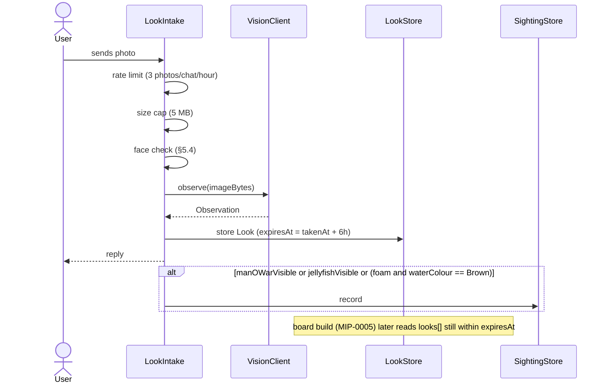

# MIP-0006: "How does it look right now?" — a live look at each beach, fed by users' cameras

| | |
|---|---|
| **Status** | Draft |
| **Author** | Claude Fable 5.1, for M. Hoffmann; motivated by a surfer friend who pays for a camera app just to see the sea before going |
| **Created** | 2026-09-05 |
| **Phase** | 1 (bot photo handler, local vision) |
| **Related** | `ARCHITECTURE.md` §5e (`VisionClient`, `--analyze-photo`), §5d (`SightingStore`), MIP-0002 (the photo arrives through the bot), MIP-0005 (the map shows it) |
| **Effort** | XL — new model+store, a bot photo pipeline, face-detection/rejection, retention/deletion, abuse controls |
| **Gain** | user value (closes the "what does it look like now" gap) |
| **Effort vs Gain** | do when X lands — needs MIP-0002 first; the privacy/face-rejection work alone is substantial |
| **Depends on** | MIP-0002 (photos arrive via the bot), MIP-0005 (the map shows it); Phase 1 prerequisite missing |
| **Risk** | a single leaked or misclassified face on the public map ends user trust — the reject-not-blur v1 design exists for exactly this |
| **Cost so far** | ~$0.7 shared with MIP-0007 (same drafting commit 5abeecc, not split further) |

## 1. Summary

Forecasts say what the sea should be doing; a photo says what it *is* doing. Paid surf-cam apps
exist because that gap is real. marola can close it without owning a single camera: users who are
already at the beach send a photo (or a short clip) through the bot or the map; a vision model
turns it into a structured, time-stamped observation (sea state, foam, crowd, jellyfish or
man-o'-war visible, water colour), and the beach's card shows "latest look: 09:12, choppy, foam at
the stream mouth", with the photo itself, for the next few hours. A local vision model does the
work, with strict rules on faces, retention and abuse from day one.

## 2. Motivation

- The friend's two paid apps: one for forecasts, one for cameras. marola has the first; the second
  is the feature people pay for, and here it can be crowd-fed instead of camera-fed.
- `VisionClient` and `--analyze-photo` already exist "waiting for the bot"; `SightingStore` already
  records jellyfish/whale/pollution reports. A photo is the richest sighting there is, and the
  calibration loop `ARCHITECTURE.md` §8 wants (real observations against the heuristics) needs it.
- A map (MIP-0005) with a "now" layer on top of "tomorrow" is a different product from a forecast
  list.

## 3. User-visible change

```
User (bot):  📷 photo, optionally with a caption "campeche agora"
Bot:         Valeu! Praia do Campeche, 09:12 — parece: mar mexido, espuma na foz do riozinho,
             pouca gente, sem água-viva visível. Fica no mapa por 6 h. (apagar: /apagar-foto)
Map card:    ▸ Latest look · 09:12 · [thumbnail] · "choppy, foam at the stream mouth, few people"
             ▸ 3 looks today · last 6 h
```

If the model sees something that reads as a hazard (man-o'-war, oil, sewage foam) the bot adds
the standard first-aid/lifeguard footer and files a `Pollution`/`Jellyfish` sighting too. No
photo is ever shown that contains a recognisable face (§5.4).

## 4. Data sources and dependencies reviewed

- **User photos via Telegram** (`getFile`, JPEG, EXIF often stripped by Telegram; location must
  come from the chat's last shared location or a beach name, not from the image). Verified: the
  Bot API's photo flow is documented; not exercised yet (no bot, MIP-0002).
- **Vision, local:** `LocalVisionClient` with a multimodal Ollama model (`llava`, `moondream`;
  `llama3.2-vision` is the family-consistent option). Status in `ARCHITECTURE.md` §5e: request
  path verified, description not, because no vision model was pulled. Pulling one (`ollama pull
  llama3.2-vision`, ~7 GB) is the first task.
- **Public webcams** (municipal, surf shops, Windguru-linked cams): would make the feature work
  before there are users, but every cam has its own terms; embedding or re-serving frames without
  permission is exactly the "reverse-engineered workaround" this repo avoids. **Not in v1**;
  §11 keeps it as a per-source question.
- **Storage:** photos and observations under `data/looks/` locally (files + JSON-lines, like
  sightings). Thumbnails only on the map; originals expire.

## 5. Design

### 5.1 Model

```scala
final case class Look(
    id: String, beachName: String, takenAt: Instant, source: LookSource,     // User(chatHash) | Cam(id)
    observation: Observation, photoRef: Option[String], expiresAt: Instant)

final case class Observation(               // structured, from the vision model, validated
    seaState: SeaState,                      // Calm | Choppy | Rough | Unknown
    foam: Boolean, crowd: Crowd,             // Empty | Few | Busy | Unknown
    jellyfishVisible: Boolean, manOWarVisible: Boolean,
    waterColour: WaterColour,                // Blue | Green | Brown | Unknown
    caption: String, confidence: Double)
```

`VisionClient` gains `observe(imageBytes): Observation < Sync` beside `describe`: the prompt asks
the local model for compact JSON with exactly these fields (same JSON-recovery approach as
`Reviewer`). `Observation` is what the card shows; `caption` is the model's sentence, labelled as
such.

### 5.2 Flow

bot photo → `LookIntake`: rate limit (3 photos/chat/hour) → size cap (5 MB) → **face check** (§5.4)
→ `VisionClient.observe` → `Look` stored with `expiresAt = takenAt + 6h` → reply → if
`manOWarVisible || jellyfishVisible || (foam && waterColour == Brown)` also `SightingStore.record`.
Map (MIP-0005): the board build includes `looks[]` per beach still within `expiresAt`.



### 5.3 Where it lives

`core/looks/` (model, trait `LookStore`, `LookIntake` pure validation), `local/looks/`
(`LocalFileLookStore`). The vision prompt is a resource (`observe_prompt.json`) so it can become
DSPy-compiled once there are labelled photos.

### 5.4 Privacy, safety, abuse — the non-negotiables

- **Faces.** Before storing: a face-detection pass (local: a small ONNX detector or the vision
  model's own "people visible?" answer). A photo with a recognisable person is either blurred at the
  detected boxes or **rejected** with a polite reply. v1 rejects; blur is a follow-up.
- **Retention.** 6 h on the map, original deleted at 24 h, thumbnails with it; `/apagar-foto`
  deletes immediately. No chat id stored with the look, only a salted hash for rate-limiting.
- **Consent line** in the bot's reply the first time: what is kept, for how long, how to delete.
- **Abuse.** Not-a-beach photos (vision says so) are acknowledged and dropped, never displayed;
  NSFW/violent content check via the same model; repeat offenders rate-limited to zero.
- **Never a safety claim.** The card says what the model *saw*, with its confidence; the water
  verdict and scores stay deterministic. "Looks calm" next to "IMPRÓPRIA" is exactly the point.

## 6. Scoring / safety impact

None to the score in v1 (a look is display + a sighting). Later: a fresh `Rough` observation can
add a note to the current hour ("reported rough at 09:12"), never change the water verdict.

## 7. Verification plan

- Unit: `LookIntake` rules (rate, size, expiry, hazard → sighting) with fixtures; `Observation`
  JSON recovery from messy model output (the `Reviewer` pattern); board includes only unexpired
  looks.
- Live, local: pull `llama3.2-vision`, run `--analyze-photo` on ten beach photos (author's own),
  check the structured fields by eye; record three as fixtures for the offline spec.
- Live, bot: send a photo from a phone; see the reply and the card; `/apagar-foto` removes it.
- Face rule: three photos with people → all rejected; three without → accepted.

## 8. Risks, limitations, and honest caveats

- **Cold start.** No users, no looks. The map shows "no look yet today" honestly; the author's
  own daily photo is the seed. Public cams would fix cold start and are excluded for terms reasons.
- **Small-model vision is weak.** `llava`-class models misjudge sea state. Show confidence, keep
  the caption labelled as the model's, and treat this as a calibration dataset in the making.
- **Privacy is the product risk.** A single face on the map is the end of trust; v1 rejects
  rather than blurs for that reason.
- **Storage growth.** Expiry bounds it; a cap of 50 looks/beach/day.

## 9. Alternatives considered

- **Buy camera access / partner with a cam provider.** Real cameras, real money, real contracts.
  Later, if the crowd-fed version proves demand.
- **Scrape public cams.** No.
- **Photos only in the bot, not on the map.** Halves the value; the map is where "now" belongs.

## 11. Open questions

1. Reject or blur faces in v1? (Proposal: reject.)
2. Which local vision model: `llama3.2-vision` (family-consistent, 7 GB) or `moondream` (small,
   fast, weaker)? Benchmark on the author's ten photos.
3. Short clips (Telegram video notes): first frame only, or three frames? (v1: first frame.)
4. Public webcams: which, and under what terms? Per-cam email before any use.
5. Should a look with `manOWarVisible` trigger a bot broadcast to subscribers of that beach
   (MIP-0004)? It is the first *proactive* message, so it needs a human-confirmation gate.
