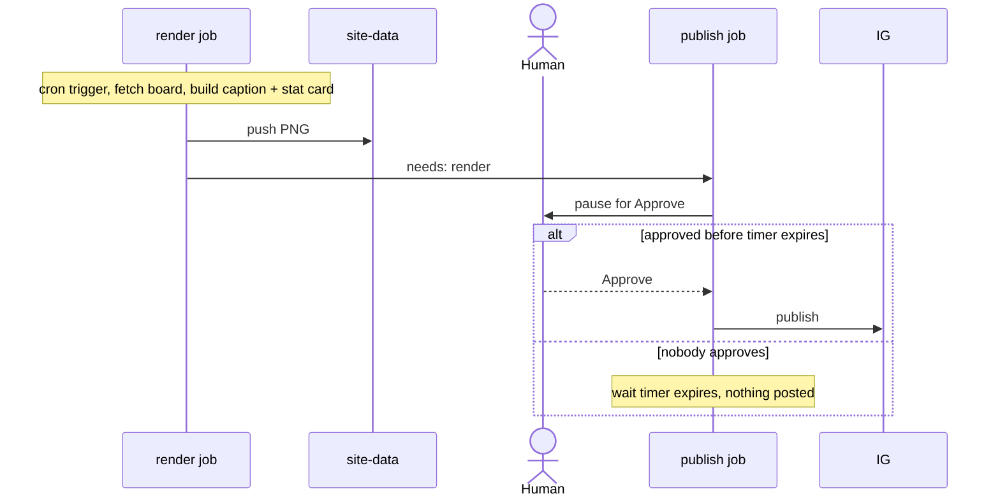

# MIP-0020: An Instagram account for marola — first post by hand, API publishing, and a gated daily pipeline

| | |
|---|---|
| **Status** | Draft |
| **Author** | Claude Fable 5.1, for M. Hoffmann (request of 2026-09-06: "create MIP for instagram bot account, with first post being github pages URL delivery … check if instagram bot account enable programatic posting"); the daily pipeline (§5.5) was drafted as MIP-0024 by Claude Sonnet 5 from the maintainer's pasted Graph API notes and folded in here on 2026-09-06 at the maintainer's request — "they are the same thing" |
| **Created** | 2026-09-06 |
| **Phase** | 0 — outreach for the project, not marola-the-product. No earlier-phase prerequisite; nothing here touches `Swimability`, `Recommender`, the CLI or the map |
| **Related** | MIP-0018 (self-documentation + multi-platform exporter — Instagram becomes one more export target, and the only one besides dev.to/Reddit with a publishing API a personal account can actually use), `docs/3-Working-on-the-repo/SELF-DOCUMENTING.md` (MIP-0018's research; it has no Instagram entry yet), MIP-0005 (the live map the first post points at), MIP-0014 (the other "community/outreach" MIP), MIP-0023 (wait-list and promotion — the platform-agnostic side of the same axis), `.claude/skills/mip/SKILL.md` "no unsourced facts reach a user" |
| **Effort** | M — no new module or JVM dependency: one Python script (`scripts/ig_publish.py`, stdlib, `--self-test` on a recorded fixture), one committed JPEG, one `just` recipe, one scheduled token-refresh workflow; the Meta developer-app setup is human clicking, not code. v3 (§5.5) adds one render script (Pillow — a new Python dependency), one cron workflow and one GitHub Environment with a required reviewer |
| **Gain** | community/outreach (a public, visual channel for the map — the product's most shareable surface); infra/dev-loop (MIP-0018's exporter gets a target that publishes for real instead of "copy-paste by hand") |
| **Effort vs Gain** | cheap win for v1 (a human posts the committed image from a phone with the exporter's caption — zero API work); `do when MIP-0018 lands` for the API path, since publishing without the planner/queue is a script with nothing to schedule; `do when X lands` for the daily pipeline — a daily approval click is only worth it once Phase 1 gives the caption something to say beyond "see the map" |
| **Depends on** | MIP-0005 (live, `https://h0ffmann.github.io/marola/`); MIP-0018 for anything beyond the first post. No Phase 1 gate, no paid resource: the Instagram API is free, an Instagram professional account is free, no Facebook Page is needed (§4.1) |
| **Risk** | a dormant account — MIP-0018's own research found changelog-style posts fail; an "Instagram bot" that posts machine text on a schedule is that failure with pictures. The API path is only worth building if the human actually writes the captions weekly. v3 turns the typed-`yes` gate into a scheduled job, the autonomy step this section warns against — §5.5 keeps a human click on every post; a later edit that replaces that approval with `--publish --yes` on a cron is the wrong thing to build toward |
| **Cost so far** | — |

## 1. Summary

marola gets an Instagram professional account whose first post is a picture of the live map with
the GitHub Pages URL in the caption and the bio. Programmatic posting is possible and free.
Meta's "Instagram API with Instagram Login" publishes single images, carousels, Reels and Stories
for a Business/Creator account, with no Facebook Page and no App Review as long as the app only
serves the account its developer owns (§4). v1 is deliberately a human posting from a phone; the
script that publishes through the API is v2, as an `instagram` target of MIP-0018's exporter; v3
(§5.5) is the daily pipeline: a fresh image and caption rendered from every day's board, pushed
through the same script, with a GitHub Environment approval so a human still clicks before each
post reaches the public account. It automates the busywork, not the consent.

## 2. Motivation

The map (`https://h0ffmann.github.io/marola/`, `README.md:22`) is the one artifact a non-developer
can look at and understand in five seconds, and today it is linked from a README badge and
nowhere else. MIP-0018 designed a weekly build-in-public workflow but every platform it researched
except dev.to/Reddit had no usable posting API (LinkedIn is gated to verified companies, Substack
has none). Instagram is the opposite case: visual-first, and, verified below, a personal
developer *can* publish to their own professional account programmatically. The question the
request asked ("does an Instagram bot account enable programmatic posting?") has a precise answer:
yes, for a **professional** account, with JPEG media hosted at a **public URL**, at most **100
posts per rolling 24 h**, and **no text-only posts**.

## 3. User-visible change

None for marola's Telegram/CLI users. For the public: an Instagram profile, e.g. `@marola.swim`
(name availability unverified — §11), bio:

```
marola — what's the best hour tomorrow to swim nearby?
Live map, Florianópolis, updated daily 👇
https://h0ffmann.github.io/marola/
```

First post: one square JPEG of the map (Florianópolis, wave markers coloured by score, after
MIP-0009; plain dots before it), caption built from the day's board, no model prose:

```
Tomorrow's best hour to swim, beach by beach — Florianópolis, 2026-09-07.
Best: Praia da Joaquina, 72/100 at 10:00.
Live map (updated daily, link in bio): h0ffmann.github.io/marola
#Florianópolis #praia #natação #openwater #swimming #marola
```

The URL in the caption is plain text (Instagram does not make caption links clickable), which is
why it is also the bio link.

**Daily-digest variant** (from the maintainer's pasted "Daily Ocean Intelligence" draft, 2026-09-06,
kept as a template, not a promise of daily cadence, §11 q4): every field below is read from the
day's board JSON (`site/dist/data/<area>/latest.json`) by the exporter; the emoji, labels and
hashtags are fixed strings in the template; nothing is model prose.

```
🌊 marola — Florianópolis, 2026-09-07
📍 Best window: Praia da Joaquina, 09:00–11:00 (72/100)        ← best.beach / hours[] ≥ best−5
💧 Water: PRÓPRIA (IMA/SC, sampled 25 Aug)                        ← water.summary
🪼 Jellyfish: Low   🐋 Whales: High (best 07:00)                 ← hours[].jellyfish / whales, whales.peak
Live map, link in bio: h0ffmann.github.io/marola
#Florianópolis #praia #natação #openwater #swimming #marola
```

Dropped from the pasted draft on purpose: "Rip Current Risk" (marola has no rip-current signal;
inventing one would be unsourced safety text, the one thing the `mip` skill forbids), "Powered by
local ocean models & RAG" and `#MadeWithAI` (marketing copy, not data; the repo's tone is the
number and its source).

**Unfit-water variant** (v3, §5.5, daily cadence means unsafe days will come up): when the
featured beach's water is `IMPRÓPRIA`, the warning is the *first* line and no swim window is shown
for that beach that day; the corpus line (§5.5) stays, verbatim with its source:

```
⚠️ Água IMPRÓPRIA hoje na Praia da Joaquina (IMA/SC, amostra 2026-09-05) — sem janela recomendada.
🌊 Outras praias no mapa ao vivo, link na bio: h0ffmann.github.io/marola
🪼 [uma frase sobre águas-vivas, com fonte] — knowledge/jellyfish-and-man-o-war.md
#Florianópolis #praia #marola
```

## 4. Data sources and dependencies reviewed

### 4.1 Instagram Platform — content publishing (Meta developer docs, fetched 2026-09-06)

`https://developers.facebook.com/docs/instagram-platform/content-publishing`:

- **Who can publish:** only "Instagram professional accounts", Business or Creator. A personal
  account cannot; converting is free and done in the app.
- **Flow:** two calls: `POST /<IG_ID>/media` creates a container (`image_url`, `caption`), then
  `POST /<IG_ID>/media_publish` with `creation_id`. Video/Reels containers are processed
  asynchronously (poll `status_code`).
- **Media:** single image, single video, Reels, Stories, carousels of up to 10 items. **No
  text-only posts.** "JPEG is the only image format supported." Media "must be hosted on a
  publicly accessible server", a URL, not an upload (video has an upload path; images do not).
  Carousel items are cropped to the first item's ratio, default 1:1. Single-image aspect-ratio
  limits and maximum size were **not stated on that page** (§11).
- **Limit:** "Instagram accounts are limited to 100 API-published posts within a 24-hour moving
  period. Carousels count as a single post." Check with `GET /<IG_ID>/content_publishing_limit`.
- **Permissions:** with Instagram Login, `instagram_business_basic`,
  `instagram_business_content_publish`; with Facebook Login, `instagram_basic`,
  `instagram_content_publish`, `pages_read_engagement` (plus `ads_*` in some Business Manager
  setups).

`https://developers.facebook.com/docs/instagram-platform/instagram-api-with-instagram-login` and
its `/overview` (same date):

- "This API setup does not require a Facebook Page to be linked to the Instagram professional
  account." Host `graph.instagram.com`. It "cannot access ads or tagging", irrelevant here.
- **Access levels:** Standard Access (the default, no review) is "sufficient if your app only
  serves your Instagram professional account or an account you manage". Advanced Access,
  "App Review and Business Verification", is required only for "accounts that you don't own or
  manage". marola's account is owned by the developer, so **no App Review for v2**.
- **Tokens:** short-lived "valid for one hour", long-lived "valid for 60 days and can be refreshed
  before they expire". A refresh job every <60 days is part of the design, not an afterthought.
- **Rate limit:** "4800 × number of impressions" calls per rolling 24 h, irrelevant at one post a
  week; the 100/24 h publishing cap is the binding one.

**Not checked (→ §11):** caption length (commonly cited as 2,200 characters) and the 30-hashtag
cap, not re-verified on Meta's pages today; how long a Meta developer account takes to create;
whether Meta later tightens Standard Access for publishing; Instagram's Platform Policy on
"automated" accounts beyond the API terms.

**What is *not* possible, plainly:** posting from a personal account; text-only posts; uploading an
image file directly (it must sit at a public URL); a clickable link in a caption; posting without
a Meta developer app and a long-lived token that someone renews.

### 4.2 The URL and the image

The Pages URL is `https://h0ffmann.github.io/marola/`, set by `.github/workflows/site.yml`
(`actions/deploy-pages@v5`, line 161; the URL is stated in its header comment, line 19), quoted
in `README.md:14,22` and `docs/1-Using-marola/RUN-LOCALLY.md:291`. It is derivable from the repo; nothing to
invent.

The image: the repo has **no PNG/JPEG of the map** and `site.yml` runs no headless browser
(`grep playwright|puppeteer|chromium` over the workflows and `justfile`: nothing). MIP-0005 keeps
the site "plain files, no build step". Three ways to get a public JPEG, weighed in §5.3.

### 4.3 The pick

Instagram API with Instagram Login (no Facebook Page, Standard Access, `graph.instagram.com`),
single-image posts, image served by GitHub Pages itself. v1 needs none of it.

## 5. Design

### 5.1 v1 — first post, by hand (this is the "cheap win")

1. Create the Instagram account, switch it to **Creator** (or Business), set the bio above.
2. Commit `site/static/social/marola-map.jpg`, a 1080×1080 JPEG screenshot of the live map taken
   by a human once, cropped square (§5.3 says why a committed file). `site.yml` already copies
   `site/static/**` into `site/dist`, so it becomes
   `https://h0ffmann.github.io/marola/social/marola-map.jpg`, the public URL v2 needs, for free.
3. Caption: `scripts/post-exporter.py` (MIP-0018 §5.3) gains an `instagram` formatter that
   renders the §3 template from `site/dist/data/<area>/latest.json` (best beach, score, hour,
   date), deterministic fields plus the fixed hashtag list; no LLM. Until MIP-0018 exists, the
   human types the same eight lines.
4. Post from the phone. Done: the first post exists, the URL is delivered.

### 5.2 v2 — publishing through the API (`do when MIP-0018 lands`)

- `scripts/ig_publish.py` (Python, stdlib `urllib`, like `scripts/arxiv_digest.py`):
  `--image-url`, `--caption-file`, `--dry-run` (prints the two requests, sends nothing),
  `--check-limit` (`content_publishing_limit` first; refuse if `quota_usage` ≥ 90),
  `--self-test` (a recorded container + publish response fixture under `scripts/fixtures/`, no
  network, same stance as `cost-split.py --self-test`). Token from `IG_ACCESS_TOKEN` in the
  gitignored `.env` locally or a GitHub Actions secret; `IG_USER_ID` likewise. Never a default,
  never committed (`AGENTS.md` secret rule; `.env.example` gets both as placeholders).
- **Container status is polled before publishing.** The pasted reference sketch (appendix D)
  gets this right and the first draft of this section left it implicit: after `POST …/media`,
  `GET /<CONTAINER_ID>?fields=status_code` every ~3 s until `FINISHED`; `ERROR` (or `EXPIRED`)
  aborts with the response body in the message; a ceiling of ~2 min before giving up. Meta
  documents the async processing for video/Reels; images usually return `FINISHED` at once, but
  publishing a container that is not `FINISHED` is the documented failure, so the poll is
  unconditional and cheap. `--self-test` covers `FINISHED`, `IN_PROGRESS`→`FINISHED`, and `ERROR`
  from the fixture.
- **Who pulls the trigger, spelled out** (`AGENTS.md`, the
  human-confirmation rule for any proactive behaviour): the script never runs on a schedule. v1
  is a human posting from a phone. v2's `just ig-post` is run by a human, and its default is
  `--dry-run`; the real post needs `--publish`, which prints the caption and the image URL and
  waits for a typed `yes`. The only unattended job is the token *refresh* (below), which posts
  nothing. "Autonomous daily posting", as the pasted draft calls it, is not a flag on this
  script: it is v3 (§5.5), with its own kill switch (an unapproved run expires and posts
  nothing), a per-day cap (one scheduled run) and a consent story (a human approves that day's
  image and caption).
- `just ig-post <caption-file>` wraps it; `just ig-post --dry-run` is the default form in docs.
- `.github/workflows/ig-token-refresh.yml`: cron every 45 days, `GET /refresh_access_token`,
  writes the new token back to the repo secret (`gh secret set`). This is the one piece of automation
  that must exist for v2 to survive past day 60.
- MIP-0018's post-planner records the post (platform `instagram`, the container and media ids)
  in its run log, so a week's post is one row there, not a separate ledger.
- **What goes through the LLM: nothing.** Captions are template fields from the board JSON or
  human-written text from MIP-0018's draft queue; the script refuses to post a caption file that
  is empty or that contains the exporter's `<!-- draft -->` marker.

### 5.3 The image, deterministically — three options

| Option | Cost | Verdict |
|---|---|---|
| **A. One committed JPEG**, human screenshot, refreshed by hand when the map changes visibly | zero code, one 200 kB file | **v1 and v2's default** — the first post and most weekly posts don't need a fresh render |
| B. Render from `latest.json` with a tiny raster | a new dependency (Pillow); a basemap-tile licence question if a tile is drawn | **v3's pick, without the tile** — a stat card (beach, numbers, the site's own colours), so the licence question never arises (§5.5) |
| C. Headless Chromium in `site.yml` screenshotting `site/dist` | Playwright in CI, minutes per run | not a site build step (MIP-0005's rule is about the *page*), but a heavy dependency; still rejected at daily cadence — a stat card carries the day's numbers without a browser in CI |

### 5.4 Setup checklist (human clicking, once), from the pasted draft, corrected against §4

1. Create the account; switch it to **Creator or Business** (Settings → Account type and tools).
2. ~~Attach a Facebook Page~~. **Not needed** on the Instagram-Login path this MIP uses (§4.1:
   "does not require a Facebook Page"). Only the Facebook-Login variant (`graph.facebook.com`,
   `instagram_basic` + `instagram_content_publish` + `pages_read_engagement`) needs one; marola
   would switch to it only for features Instagram Login "cannot access", ads, tagging, none of
   which this MIP wants (§9).
3. `developers.facebook.com` → create an app → add the **Instagram** product → "API setup with
   Instagram login"; add the account as an Instagram tester and accept the invite in the app.
4. Generate a token, exchange it for a **long-lived** one (60 days, `GET /access_token?
   grant_type=ig_exchange_token`), store it as `IG_ACCESS_TOKEN` (repo Actions secret or the
   gitignored `.env`; `.env.example` gets the placeholder) with `IG_USER_ID` from `GET /me`.
5. Image hosting: ~~S3/R2/CDN~~. **Not needed**: GitHub Pages already serves
   `https://h0ffmann.github.io/marola/social/marola-map.jpg` (§5.1 step 2), a public HTTPS JPEG,
   which is all the container endpoint asks for. No new vendor, no new cost.
6. First `just ig-post --dry-run`, then `--check-limit`, then one real publish with a human
   watching (§7).

### 5.5 v3 — the daily pipeline, gated (`do when X lands`)

v2 posts the one committed JPEG; posting it every day with only the caption changing is worse
than not automating (§5.3's table said to revisit rendering "only if posts become daily"; this is
that case). v3 renders each day's image and caption from that day's board and pushes it through
v2's `ig_publish.py`, unchanged, behind a human approval.

- `scripts/render_instagram_digest.py` (Python; `Pillow` becomes the first entry of a
  `scripts/requirements.txt`, none exists today, `grep -r Pillow` finds nothing): reads
  `site/dist/data/<area>/latest.json`, builds the caption (§3's daily template, or the unfit-water
  variant when the featured beach is `IMPRÓPRIA`, a function with a unit test, not a formatting
  convention), draws a 1080×1080 **stat card** (beach, score, hour, water verdict, jellyfish and
  whale reads, the site's `--c70…--cna` colours and system type from `site/static/style.css`, no
  basemap tile), and appends **one sourced line from `knowledge/*.md`**, picked deterministically
  (`hash(date + area) % len(chunks)`, so a re-run of the same day picks the same line and the
  corpus cycles over roughly its own length in days), shown verbatim with its file as the source.
  No model call anywhere in the job, so nothing for `Reviewer` to check.
- Image hosting: the PNG goes to the `site-data` orphan branch under `social/daily/<date>.png`,
  the same free static storage `site.yml` already uses for `smoke/` and `coverage/`, with a stable
  `social/marola-daily.png` copy; Meta reads the URL once at container creation (§4.1), so a
  stable path is fine.
- `.github/workflows/instagram-daily.yml`: `schedule` after `site.yml`'s own cron (e.g. `30 9 * *
  *`); job `render` (fetch the board, run the script, push the PNG) runs unattended, deterministic
  and reversible, nothing posted yet; job `publish` (`needs: render`, `environment:
  instagram-daily`) **pauses until a human clicks Approve** in the Actions UI. The Environment has
  a required reviewer, then runs `ig_publish.py --image-url … --caption-file … --publish` with the
  interactive prompt replaced by that approval. A run nobody approves expires (Environment wait
  timer) and posts nothing. Any failure fails the run visibly: no retry, no fallback post.
- **The consent gate, explicitly**: a cron job has no terminal for v2's
  typed `yes`, which is the concrete reason the v2 model does not transfer unchanged. The approval
  is weaker than typing `yes` (a click) but is on *that day's* image and caption, not a blanket
  "automate this forever"; the day someone wants to remove it, that is a new decision, not a flag.



## 6. Scoring / safety impact

None to `Swimability.score` or `Recommender`. v3 adds one rule on top of the template: **a
featured beach whose water is `IMPRÓPRIA` gets the unfit-water caption (§3), never the
window-first one**, enforced by the caption builder and its test (§7). No product code changes; nothing in `scoring/` or `Recommender` is touched. The only
safety-adjacent point is the caption: it must state numbers from the board verbatim (score, hour,
date) and never a recommendation the map itself would not show; the template is the guard.

## 7. Verification plan

- `scripts/ig_publish.py --self-test` in `just quality-other` (fixture-driven: container id
  parsed, `media_publish` body built, quota refusal at ≥ 90, empty/draft caption refused).
- `--dry-run` output reviewed in the PR body for the first API-published post.
- Live, by a human: `GET /me?fields=id,username` with the long-lived token → the expected
  account; `--check-limit` → `quota_usage: 0`; one real publish; the post visible; bio link
  resolves to the map.
- The refresh workflow's first run logged (a new `expires_in` ≈ 5,184,000 s).
- "Done" for v1: the first post is live with the URL in caption and bio, screenshot in the PR.
  "Done" for v2: one weekly post published by `just ig-post` from a MIP-0018 draft.
- v3: unit tests `caption_impropria_leads_with_warning`, `caption_normal_day_matches_template`,
  `corpus_line_deterministic_for_same_date`, `render_produces_valid_png`; live, with the account
  and token in place: the render job against a real `latest.json`, one deliberately *unapproved*
  run that expires and posts nothing, then one approved run whose post appears. "Done" for v3 =
  both of those, in the Actions log. The stat card needs a design pass (screenshot in the PR)
  before the first approved run.

## 8. Risks, limitations, and honest caveats

- **Standard Access is documented as sufficient for an owned account today**; Meta changes access
  tiers without notice. If publishing ever requires Advanced Access, that is App Review + Business
  Verification: weeks, and a registered business, and the answer becomes "post by hand".
- **A token that nobody refreshes dies in 60 days**, silently: the refresh workflow needs a
  failure notification (a failed Actions run is visible; whether anyone looks is the caveat).
- **The image is a public URL on GitHub Pages.** Fine for a screenshot of a public map; never
  reuse this path for anything that must not be world-readable.
- **"Bot" is the wrong word for what should exist:** the API posts, a human writes. MIP-0018's
  research is explicit that machine-generated changelog posts are the failure mode.
- Instagram's terms are Meta's; a policy strike takes the account with it. Keep the map's own
  channel (Pages) the source of truth, Instagram a mirror.
- **v3's daily approval is a recurring human burden.** If nobody clicks, nothing posts, the safe
  failure, but "automated" means automated *up to* the approval, by design (§5.5).
- **The stat card is a new visual, not the map.** It needs a real design pass (colours, type, the
  score colour as the one accent) before it ships; not designed further here.

## 9. Alternatives considered

- **Do nothing.** The map stays a README link. Loses the one visual channel a non-developer
  would follow; costs nothing. The honest default if nobody will write weekly captions.
- **Post from a phone forever** (v1 only). Genuinely fine at one post a week; the API path only
  pays off with MIP-0018's queue. This is why v2 is `do when MIP-0018 lands`, not `do next`.
- **Instagram API with Facebook Login.** Needs a Facebook Page linked to the account and
  `pages_read_engagement`; the Instagram-Login variant removes both for no loss marola cares
  about (ads/tagging). Rejected.
- **A third-party scheduler (Buffer/Later/Hootsuite).** Paid tiers for the useful parts, a second
  vendor holding the token; `AGENTS.md` keeps paid tooling out unless nothing free works. Rejected.
- **Unofficial/private-API clients.** Against Instagram's terms, ban risk, and they break
  monthly. Rejected outright.
- **Threads instead.** Has a publishing API too and is text-first; a different channel with a
  different audience. Not instead of, possibly in addition; out of scope.
- **A `--cron` flag on `ig_publish.py` that skips the typed `yes`.** Removes the consent step
  instead of replacing it; the Environment approval (§5.5) is the equivalent gate. Rejected.
- **No gate at all (true autonomy).** The most literal reading of "autonomous daily posting
  agent"; §8 above argues against removing a human confirmation from a repeated public action.
  Rejected.
- **A Telegram channel post first.** The same render + cron + approval shape with no Meta app,
  token or 60-day refresh; strictly simpler, and worth doing first if reach *outside* Instagram's
  audience is not the point. Noted for MIP-0004 (daily digest), not built here.

## 11. Open questions

1. Account handle and ownership: `@marola.swim`? Who holds the credentials, and does the token
   live in this repo's Actions secrets or a personal password manager only?
2. Single-image constraints Meta's publishing page did not state: aspect-ratio bounds (4:5 to
   1.91:1 is the app's rule, not verified for the API), maximum file size, whether PNG is
   rejected or silently converted. Verify with one `--dry-run`-then-real post before writing
   image guidance into docs.
3. Caption limits (2,200 chars, 30 hashtags): commonly cited, not re-verified on Meta's page.
4. Cadence: weekly with MIP-0018's post (v2), daily through v3, or only when the map changes
   (MIP-0009, MIP-0016)? The 100/24 h cap is irrelevant either way; the human's writing time
   (v2) or approval click (v3) is the real limit; v3 only pays off once Phase 1 gives the
   caption something beyond "see the map".
5. Should `site.yml` also emit a Story-sized 1080×1920 crop, or is one square image enough?
6. Threads as a second target of the same script (same Meta app, separate permissions): worth a
   one-line addition to MIP-0018 §4 rather than its own MIP?
7. v3's Environment wait timer: how long may an unapproved run wait before it expires? Not set.
8. v3's corpus-line rotation: should `hash(date + area)` also avoid repeating a chunk within a
   window, so consecutive days for one area never show the same line? Not resolved.
9. The stat card's design (§5.5, §8) needs a mockup before `render_instagram_digest.py` is written.

## Appendix

**A. Sources, fetched 2026-09-06**

- `https://developers.facebook.com/docs/instagram-platform/content-publishing`: account type,
  two-step flow, media types, "JPEG is the only image format supported", public-URL requirement,
  100 posts / 24 h, `content_publishing_limit`, permission names for both login variants.
- `https://developers.facebook.com/docs/instagram-platform/instagram-api-with-instagram-login`:
  "does not require a Facebook Page", "cannot access ads or tagging".
- `…/instagram-api-with-instagram-login/overview`: Standard vs Advanced Access wording, token
  lifetimes (1 h / 60 days, refreshable), `graph.instagram.com`, Business Verification trigger,
  4800 × impressions rate limit, the four `instagram_business_*` permissions.

**B. Repo facts checked 2026-09-06**

- Pages URL: `README.md:14` (badge), `README.md:22` ("Live map"), `docs/1-Using-marola/RUN-LOCALLY.md:291`,
  `.github/workflows/site.yml:19` (comment) and `:161` (`actions/deploy-pages@v5`).
- No `*.png`/`*.jpg` tracked anywhere in the repo; no headless-browser step in any workflow or
  `justfile` recipe.
- `docs/3-Working-on-the-repo/SELF-DOCUMENTING.md` has no Instagram entry. MIP-0018 §4 should gain one row when this
  MIP is accepted (Instagram: real API, professional account, JPEG at a public URL, 100/24 h).

**C. The two requests, for `--dry-run`'s reference**

```
POST https://graph.instagram.com/v21.0/<IG_USER_ID>/media
  image_url=https://h0ffmann.github.io/marola/social/marola-map.jpg
  caption=<§3 text>
  access_token=<long-lived>
→ {"id": "<CONTAINER_ID>"}

POST https://graph.instagram.com/v21.0/<IG_USER_ID>/media_publish
  creation_id=<CONTAINER_ID>
  access_token=<long-lived>
→ {"id": "<MEDIA_ID>"}
```

(API version `v21.0` is illustrative; pin whatever the dashboard offers when v2 is built.)

**D. The maintainer's pasted reference sketch (2026-09-06), annotated: the shape, not the spec**

Received as "MIP-0005: Instagram Autonomous Daily Posting Agent" (0005 is MIP-0005, the map; this
MIP is 0020). Kept for its three-step loop; every `←` note is a correction the §4 research forces.
(Fenced as `text`, not `python`: ruff 0.16 formats Python fences inside Markdown, and this is an
annotated sketch, not code to format.)

```text
INSTAGRAM_ACCOUNT_ID = os.getenv("INSTAGRAM_ACCOUNT_ID")   # ← IG_USER_ID here; from GET /me
ACCESS_TOKEN = os.getenv("INSTAGRAM_ACCESS_TOKEN")         # ← IG_ACCESS_TOKEN, long-lived, refreshed by the 45-day workflow
IMAGE_URL = "https://cdn.marola.app.br/digests/today.jpg"  # ← no CDN/S3/R2: https://h0ffmann.github.io/marola/social/marola-map.jpg (Pages, free)
CAPTION = """🌊 Daily Ocean Intelligence by Marola ..."""   # ← §3's template: board fields only; no "Rip Current Risk" (no such signal), no "#MadeWithAI"

def publish_daily_digest():                                # ← not daily, not scheduled: a human runs `just ig-post --publish` and types yes (§5.2)
    # 1. Create Media Container
    container_url = f"https://graph.facebook.com/v20.0/{INSTAGRAM_ACCOUNT_ID}/media"
    # ← graph.instagram.com on the Instagram-Login path (no Facebook Page); v20.0 illustrative
    res = requests.post(container_url, data={"image_url": IMAGE_URL, "caption": CAPTION,
                                             "access_token": ACCESS_TOKEN}).json()
    container_id = res.get("id")                           # ← keep; abort with the body if absent
    # 2. Poll status until FINISHED                        # ← keep — this is the step §5.2 now states explicitly
    while True:
        status = requests.get(f".../{container_id}", params={"fields": "status_code",
                                                              "access_token": ACCESS_TOKEN}).json().get("status_code")
        if status == "FINISHED": break
        elif status == "ERROR": raise RuntimeError(...)    # ← also EXPIRED; and a ~2 min ceiling — the sketch loops forever
        time.sleep(3)
    # 3. Publish                                           # ← keep; preceded by --check-limit (quota_usage < 90) in the real script
    requests.post(f".../{INSTAGRAM_ACCOUNT_ID}/media_publish",
                  data={"creation_id": container_id, "access_token": ACCESS_TOKEN})
```

Also from the pasted setup list: "convert to Business/Creator" (kept, §5.4 step 1); "attach a
Facebook Page" (dropped: not required on this path, §5.4 step 2); "`instagram_basic` +
`instagram_content_publish`" (those are the Facebook-Login permission names; Instagram Login uses
`instagram_business_basic` + `instagram_business_content_publish`, §4.1). `requests` → stdlib
`urllib`, matching `scripts/arxiv_digest.py`; no new Python dependency.

**E. Brand & domain, notes for a human decision, no recommendation**

Pasted by the maintainer on 2026-09-06; what could be checked cheaply is marked, the rest is
carried as given. A domain is a purchase, so this is the human's call (`AGENTS.md` cost rule in
spirit; it's not a cloud resource, but it is money).

| Option | Pasted note | Checked 2026-09-06 |
|---|---|---|
| `marola.ai` | taken | not re-checked |
| `.ocean`, `.sea` | not ICANN TLDs | consistent with the IANA root zone (no such entries); not fetched individually |
| `.br` bare | needs a category prefix (`.com.br`, `.app.br`, …) | Registro.br rule as stated; site is JavaScript-rendered, its pages fetched empty here, not re-verified |
| `marola.app.br` | ~R$40/yr on Registro.br, available, needs CPF/CNPJ | price/availability **not verified** (same empty fetch); the CPF/CNPJ requirement is Registro.br's standing rule |
| `marola.bot` / `marola.bot.br` | "official ICANN TLD via Google Registry" | `.bot` **is** a delegated gTLD (IANA root db, record updated 2025-02-14), but the registry is **Amazon Registry Services, Inc.**, not Google; `.bot` has historically been a restricted TLD (registrant must demonstrate a bot); check current policy before assuming it's a plain purchase |
| `marola.io`, `marola.dev`, `marolaagent.ai` | tech/ecosystem options | not checked |

Where the site lives today, `https://h0ffmann.github.io/marola/`, needs none of these; a custom
domain would be a `CNAME` in `site/` plus DNS, a one-line change to `site.yml` once decided.
