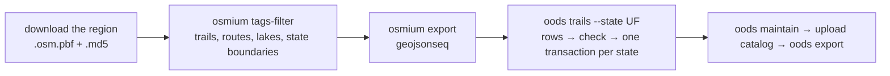

# MIP-0030: Trails on the map — OSM paths and hiking routes per state in the B2 lake, drawn near each beach and lake

| | |
|---|---|
| **Status** | Partially implemented (`TrailFinder`, the area Overpass query, and the board's `trails` array are on marola-app `main`; the site's trails layer is built but shown as "em breve". The rest is in [MIP-0030.tasks.md](./MIP-0030.tasks.md), marola-dev/marola#678) |
| **Author** | Claude Sonnet 5, for M. Hoffmann (request of 2026-09-06: "create a MIP for adding all trails info to the rendered map (only trails nearby the ocean or a lake), decide if the fetch mechanism should be the same as IMA/SC"); revised by Claude for M. Hoffmann (2026-10-06: "use wikiloc or other free provider to draw trails in marola-site … in case we need an ETL per state, which repository would fit … backblaze b2 for OPEN trail providers") |
| **Created** | 2026-09-06 (revised 2026-10-06: provider review, route relations, the per-state lake ETL, the Mapbox layer) |
| **Tasks** | [MIP-0030.tasks.md](./MIP-0030.tasks.md) |
| **Phase** | 0 for the board and the map (tasks 1–3). The lake ETL is Phase 2 (`docs/PHASES.md`: a cloud store), under the same scoped exception MIP-0075 §11 asks for: free tier only, written by scheduled CI, read by the site build, never on a user's request path |
| **Related** | `BeachFinder` (`core/src/main/scala/marola/beaches/BeachFinder.scala`); MIP-0021 (beach accessibility, the precedent: an OSM layer anchored on `BeachFinder`'s results, with "no data" never shown as "none"); MIP-0005/MIP-0009 (the map); MIP-0075 (the B2 DuckLake, its `oods` module, the `oods-lake` round trip, the area `trail` table its beach ETL writes); MIP-0070 §5.4 (where code, data and workflows live); `docs/2-Building-marola/ARCHITECTURE.md` §7 (Overpass fair use) |
| **Effort** | M — tasks 1–3 are S (one relation clause, two optional board fields, the toggle). The lake part is one migration and view, the `spatial` extension, `oods trails` in marola-app's `oods` module, one workflow and two input files in marola-oods, and a download in `site.yml` |
| **Gain** | `user value` — "can I walk somewhere from here" next to "is the water clean", long hiking routes included, and it stays on the map through an Overpass outage; `infra/dev-loop` — a build makes no Overpass call for trails; `cost/ops` — one Geofabrik download per region per week, $0 inside B2's free tier |
| **Effort vs Gain** | `cheap win` for tasks 1–3, because the board already carries trails. `do when MIP-0075 lands` for the lake, whose store, round trip and export are MIP-0075 rows 1–6, 10 and 11, already filed |
| **Depends on** | Tasks 1–3: nothing. The lake: MIP-0075 rows 1–6, 10, 11 and 22, and MIP-0075's people's gates (the Phase 2 exception, the bucket smoke test, marola-site's read-only key) |
| **Blocked by** | none |
| **Risk** | OSM's trail coverage varies with tagging, not geography: short local trails are named `highway=path`/`track` ways, and long waymarked trails are `route=hiking` relations, and a query for only one misses the other (§4.1). The Sudeste extract is 820 MB, so the job filters it with `osmium` before DuckDB sees anything |
| **Cost so far** | n/a |

## 1. Summary

marola shows named trails from OpenStreetMap near any beach or lake it already found for an area:
named `highway=path`/`track` ways and `route=hiking`/`foot` relations within 500 m of one. Each
trail keeps its OSM id, its mapped length, the `sac_scale` and `surface` tags when they are
present, and its geometry. The board carries them as a `trails` array, and the map draws them as
a line layer.

The trails come from a weekly ETL that loads every named trail and hiking route of a state from
Geofabrik's regional OSM extracts into MIP-0075's B2 DuckLake:

- `trail_route` holds the trails, partitioned by state (`uf`).
- `trail_source` records each provider with its licence. Only a provider whose licence was checked
  gets a row, and today that is OSM alone (ODbL).
- The `area_trail` view picks the trails near each map area, and `oods export` writes them as
  `exports/trails/<key>.json`.

The build reads that file, and asks Overpass only for an area the lake does not cover yet. Wikiloc
and AllTrails are not used, because neither licenses its tracks for reuse (§4.3). The code goes in
marola-app's `oods` module and the workflow in marola-oods. marola-site only downloads the export.

## 2. Motivation

- **The map has no trails.** Someone at Praia do Pântano do Sul gets a swim score and nothing else,
  although OSM knows the beach starts `Trilha da Lagoinha do Leste`. The board has carried a
  `trails` array since 2026-09-07, but the site still shows the trilhas toggle as "em breve".
- **The area query misses long routes.** The first version of this MIP found no `route=hiking`
  relation near Florianópolis and dropped relations. Rio's Transcarioca is one: relation 6906578,
  180 km officially, 68 km mapped (§4.1).
- **Every build asks Overpass again**, for data that changes weekly. Overpass time-outs broke
  main's deploys on 2026-10-06 (marola-dev/marola-site#63).
- **A provider needs a licence on record.** Wikiloc grants no reuse. A table that carries each
  provider's licence lets a second open provider join without a schema change, and keeps out any
  provider without one.
- **Where a per-state ETL lives** is already settled by MIP-0070 §5.4 and MIP-0075 §5.1. Code goes
  in marola-app (the `oods` sbt module), data in B2, and the workflow and its inputs in marola-oods,
  which holds no code of its own. marola-site is a static page with a build: an ETL there would
  make it read OSM extracts and write the lake, both of which it never does.

## 3. User-visible change

CLI (`--brief`/`--summarize`), one line per beach that has a trail within 500 m:

```
  Praia do Pântano do Sul   58/100 at 09:00  · trails nearby: Trilha da Lagoinha do Leste (2.1km)
  Praia da Joaquina         62/100 at 10:00  · trails: no data
```

On the map, the trilhas toggle is on. Each trail is a line along its real OSM geometry, coloured
by `sac_scale` (green for `hiking`, amber for `mountain_hiking` and above, grey when the tag is
missing), and a route is drawn slightly wider than a single way. The tooltip gives the name, the
length and "ver no OpenStreetMap", a link to the way or relation. The about page says: "Trilhas:
OpenStreetMap (© colaboradores do OpenStreetMap, ODbL), via Geofabrik, atualizadas toda semana".

The board's array:

```json
"trails": [
  { "name": "Trilha da Lagoinha do Leste", "osm": "way/123456789", "kind": "path",
    "length_km": 2.1, "difficulty": null, "surface": null,
    "near": [{"beach": "Praia do Pântano do Sul", "distance_km": 0.1}],
    "geometry": [[-27.7910, -48.4890], [-27.7925, -48.4871]] },
  { "name": "Trilha Transcarioca", "osm": "relation/6906578", "kind": "route",
    "length_km": 68.1, "difficulty": null, "surface": null,
    "near": [{"beach": "Praia de Grumari", "distance_km": 0.3}],
    "geometry": [[[-23.04, -43.52], [-23.05, -43.51]], [[-22.95, -43.28], [-22.96, -43.27]]] }
]
```

`osm` and `kind` are new and optional, and the schema stays 1. A route's `geometry` is a list of
lines, because a relation's members do not join into one line. `length_km` is the mapped length,
never a length the route's tags claim. `difficulty` and `surface` are `null` when OSM has no tag,
never a guess.

## 4. Data sources and dependencies reviewed

### 4.1 OpenStreetMap — verified live, 2026-09-06 and 2026-10-06

- **Named ways (2026-09-06, Overpass).** Named `highway=path`/`track` ways within 15 km of Pântano
  do Sul returned 45 results. They included `Trilha da Lagoinha do Leste`, `Trilha de Naufragados`
  (`trail_visibility: excellent`) and `Trilha Praia do Maço-Guarda` (`sac_scale: mountain_hiking`).
  Appendix A.1 has all three areas.
- **Route relations (2026-10-06, Waymarked Trails' API).** The same 15 km search found no
  `route=hiking` relation, and this MIP dropped relations on that result. That was wrong for Rio.
  `hiking.waymarkedtrails.org/api/v1/details/relation/6906578` returns `Trilha Transcarioca` with
  `route=hiking`, `network=rwn`, `official_length_m` 180000 and `mapped_length_m` 68121. Its search
  lists seven more relations named "Acesso a Trilha Transcarioca".

The area query (Overpass, free and keyless) stays as the fallback for an area with no export. It
gains the relation clause:

```
[out:json][timeout:60];
way["natural"="beach"]["name"](around:RADIUS,LAT,LON)->.beaches;
( way["natural"="water"]["water"~"^(lake|pond)$"](around:RADIUS,LAT,LON);
  relation["natural"="water"]["water"~"^(lake|pond)$"](around:RADIUS,LAT,LON); )->.lakes;
( way(around.beaches:500)["highway"~"^(path|track)$"]["name"];
  way(around.lakes:500)["highway"~"^(path|track)$"]["name"]; )->.ways;
( way(around.beaches:500)["highway"]; way(around.lakes:500)["highway"]; )->.near;
relation(bw.near)["type"="route"]["route"~"^(hiking|foot)$"]->.routes;
.ways out tags geom;
.routes out tags geom;
.lakes out center;
```

`out tags geom` returns each line's real path. A point at a multi-kilometre trail's bounding-box
centre can sit nowhere near the water. The relation clause has not been run against Overpass yet
(the sandbox cannot reach it), and task 2 runs it first.

### 4.2 Geofabrik's Brazil extracts and the tools — checked 2026-10-06

- **Geofabrik** (`download.geofabrik.de/south-america/brazil.html`) publishes five regional
  `.osm.pbf` files: Sul 406 MB, Sudeste 820 MB, Nordeste 421 MB, Centro-Oeste 196 MB and Norte
  152 MB. They are rebuilt daily (the page showed data up to 2026-10-04), each has an `.md5`
  beside it, and they come under ODbL 1.0 with no key and no usernames. There is no per-state
  extract, so the job takes the region a state is in and assigns `uf` from the state's own boundary
  in the same file (§5.3).
- **osmium-tool** (nixpkgs) streams the file. `osmium tags-filter` keeps only the trails, the routes
  and their members, the lakes and the state boundaries, and `osmium export -f geojsonseq` writes
  one feature per line. A whole region never sits in memory.
- **DuckDB `spatial`** has `ST_GeomFromGeoJSON`, `ST_Length_Spheroid` (metres on the ellipsoid),
  `ST_Contains`, `ST_AsGeoJSON` and `ST_Read` (duckdb.org's function list). `ST_ReadOSM` reads a
  `.pbf` directly, but it joins nodes to ways in SQL over the whole region, which is the memory risk
  `osmium` avoids. `spatial` is vendored and loaded from a file, as MIP-0075 row 2 does for
  `ducklake` and `httpfs`.

### 4.3 Other trail providers — checked 2026-10-06

| Provider | Data | Terms | Verdict |
|---|---|---|---|
| **OpenStreetMap** (Geofabrik; Overpass as fallback) | ways and route relations, global | ODbL 1.0, "© OpenStreetMap contributors" | **the source** |
| **Waymarked Trails** | renders OSM's route relations and has a JSON API | the data is OSM's; the API has no published usage policy | a cross-check and a link target, not a second source |
| **Wikiloc** | tracks uploaded by users | no public API found. In 2010 its founder declined blanket reuse unless three attributions were shown (wikiloc.com, the trail page and the author's page) ([OSM-talk](https://lists.openstreetmap.org/pipermail/talk/2010-May/050017.html)). The terms page refused automated fetches (403), so it was not read | **rejected**: copying tracks would need each author's permission |
| **AllTrails** | curated trails | proprietary; its affiliate programme declined marola on 2026-10-06 | rejected |
| **Trilha Transcarioca** (official site) | an app, PDF guides, and GPX "tracklogs" named in its page metadata | no reuse terms on its downloads page | not used; OSM maps 68 of its 180 km |

### 4.4 Why not the IMA/SC pattern

`ImaScWaterQualityClient` scrapes one state agency's undocumented endpoint, because bathing water
is measured and published by each state separately. Trails have no such split. The ETL runs per
state only because each state is one slice of the same OSM data, not a separate publisher.

## 5. Design

### 5.1 Where things live

| Piece | Repo | Path |
|---|---|---|
| `TrailFinder` (the board's trails: export first, Overpass fallback) | marola-app | `core/src/main/scala/marola/trails/` |
| `TrailLoad`, `oods trails`, the `trail_route` rows | marola-app | `oods/src/main/scala/marola/oods/trails/` |
| The migration, `area_trail`, the checks | marola-oods (copied into marola-app by MIP-0075 row 4's byte-identity test) | `specs/001-beach-persistence/contracts/{migrations/0002_trails.sql,views.sql,checks.sql}` |
| The workflow and its inputs | marola-oods | `.github/workflows/trail-etl.yml`, `etl/trail-states.json`, `etl/trail-sources.json`, `scripts/trail-extract.sh` |
| The data | B2 | `lake/main/trail_route/uf=<UF>/`, `exports/trails/<BeachSnapshot.key>.json` |
| The map and the download | marola-site | `site/static/{index,about}.html`, `app.js`'s `addTrailLayer()`, `site.yml` |

### 5.2 The board's trails

```scala
enum TrailKind:
  case Path, Route

final case class Trail(
  name: String,
  osm: String,                        // "way/123" | "relation/6906578", for the map's link
  kind: TrailKind,
  lengthKm: Double,                   // the mapped geometry's length, never a tag's claim
  difficulty: Option[String],         // OSM sac_scale, verbatim
  surface: Option[String],
  geometry: List[List[Coordinates]],  // one line for a way, one per member run for a route
  nearBeach: Option[(String, Double)],
  nearLake: Option[(String, Double)]
)
```

`TrailFinder.nearby` first reads `MAROLA_TRAILS_DIR/<BeachSnapshot.key>.json`, the lake's export
in this array's shape. It runs §4.1's Overpass query only when that file is missing, which is the
contract `BeachFinder` already has with `MAROLA_BEACHES_DIR`. Same-named ways in an area are merged
into one `Trail`, and a way that belongs to a returned relation is drawn only as part of it. Nothing
passes through an LLM.

### 5.3 The lake

| Table | One row is | Key | Written by |
|---|---|---|---|
| `trail_source` | a provider with its licence | `source_id` | trail ETL, mirrored from `etl/trail-sources.json` |
| `trail_route` | a named way or route relation in a state; partitioned by `uf` | `(source_id, uf, osm_ref)` | trail ETL |
| `lake` | a named lake or pond in a state, the anchor beside MIP-0075's `beach` | `(source_id, uf, osm_ref)` | trail ETL |

```dbml {bg-dark=white}
Table trail_source {
  source_id text [not null, note: "osm-geofabrik"]
  name text
  licence text [not null, note: "ODbL-1.0"]
  attribution text [not null, note: "© OpenStreetMap contributors"]
  url text
  licence_checked_on date [not null]
}
Table trail_route {
  source_id text [not null]
  uf char(2) [not null, note: "the state boundary holding the trail's midpoint"]
  osm_ref text [not null, note: "way/123 | relation/6906578"]
  kind text [not null, note: "path | route"]
  name text [not null]
  network text [note: "lwn | rwn | nwn, routes only"]
  sac_scale text [note: "verbatim"]
  surface text
  trail_visibility text
  length_km double [note: "ST_Length_Spheroid of the mapped geometry"]
  geometry text [note: "GeoJSON LineString | MultiLineString"]
  extract_date date
}
Table lake {
  source_id text
  uf char(2)
  osm_ref text
  name text
  geometry text [note: "GeoJSON Polygon | MultiPolygon"]
}
Ref: trail_route.source_id > trail_source.source_id
Ref: lake.source_id > trail_source.source_id
```

`area_trail` (in `views.sql`) joins `trail_route` to MIP-0075's `beach` table and to `lake`. It
returns each trail within 0.5 km of an area's beach or lake in §3's shape, merging same-named ways.
`checks.sql` refuses a `trail_route` row whose `source_id` has no `trail_source` row, an unknown
`kind`, a `uf` not in `etl/trail-states.json`, or a geometry outside Brazil's box. So a provider
without a recorded licence cannot load.

MIP-0075's area `trail` table (`(area_id, trail_name)`, written by its beach ETL through Overpass)
stays as filed until the export exists. Tasks 11 and 12 then stop the beach ETL from calling
`TrailFinder` and drop that table.

### 5.4 The ETL



- **What `osmium` keeps**: `w/highway=path,track` with a `name`, `r/route=hiking,foot` with their
  members (`--add-referenced`), named `wr/natural=water` with `water=lake,pond`, and
  `r/boundary=administrative` with `admin_level=4`.
- **One transaction per state.** `oods trails --state SC --features sul.geojsonseq --sources
  etl/trail-sources.json` reads the GeoJSONSeq with DuckDB `spatial`. It keeps the features whose
  midpoint lies inside the state's polygon (from the same file, matched by `ISO3166-2=BR-SC`) and
  upserts that state's partition with MIP-0075 §5.4's three statements. A re-run with an unchanged
  extract commits nothing. A load that would leave a state with under half its stored routes is
  refused (`SuspiciousShrink`).
- **The workflow** `trail-etl.yml` runs Sunday at `23 5 * * 0`, or on dispatch with `state` and
  `dry_run`.
  - It is a matrix over `etl/trail-states.json` (`SC → sul`, `RJ → sudeste`, `BA → nordeste`)
    with `max-parallel: 1`, `concurrency: oods-lake`, `timeout-minutes: 60`, and MIP-0075 row 11's
    `oods-lake` composite action.
  - It holds `contents: read` and `packages: read` only.
  - Each region is downloaded once, checked against its `.md5` and removed after its states load.
    No raw file goes to the bucket.
  - `osmium` comes from marola-oods's `flake.nix`, and `oods trails` runs in the pinned image.
- **The export.** After the catalog upload succeeds, `oods export` also writes
  `exports/trails/<BeachSnapshot.key>.json` for every area in `etl/areas.json`, from `area_trail`.
- **The build** (`site.yml`) downloads `exports/trails/` beside `exports/beaches/` with MIP-0075
  §5.6's read-only key and sets `MAROLA_TRAILS_DIR`. The page never calls B2, Geofabrik or
  Overpass, so `script-src 'self'` and the about page's list of third parties stay as they are.

```scala
final case class TrailRouteRow(source: TrailSourceId, uf: Uf, osmRef: OsmRef, kind: TrailKind,
    name: String, network: Option[String], sacScale: Option[String], surface: Option[String],
    visibility: Option[String], lengthKm: Double, geometry: GeoJson, extractDate: LocalDate)

trait OodsStore:   // MIP-0075 §5.4's trait, one method added
  def upsertState(source: TrailSourceId, uf: Uf, routes: Chunk[TrailRouteRow],
      lakes: Chunk[LakeRow]): Changed < (Sync & Abort[StoreFailure])
```

Effect rows are indicative, and are checked against the pinned Kyo jar when written.

## 6. Scoring / safety impact

None. Trails never change `Swimability.score` or any safety text. A trail's `sac_scale` is shown
as OSM's tag, not as advice that the walk is safe.

## 7. Verification plan

- **Task 2** first runs §4.1's query live for floripa, rio and salvador and records the counts and
  times in Appendix A.1. Rio must return the Transcarioca relation. `TrailFinderSpec` on the
  captured Rio answer: one `Route` with `osm = "relation/6906578"`, and no member way drawn twice.
- `scripts/site_check.js` (marola-site): a multi-line fixture trail gives one feature per line,
  and its tooltip carries the OSM link. The toggle is enabled, `?trails=0` hides the layer, and a
  board with no `trails` key still renders every beach.
- `TrailLoadSpec`, on a GeoJSONSeq cut from a real Sul extract with `trail-extract.sh`:
  - it gives exact rows;
  - a way outside SC is dropped;
  - a re-run makes no snapshot;
  - a half-size input is refused;
  - an unknown `source_id` fails `oods check` and writes nothing.
- `LakeExportSpec`: an export decodes into `Trail`s, and `TrailFinder` reads it from
  `MAROLA_TRAILS_DIR` with no request.
- marola-oods: a person dispatches `dry_run` for `SC`, then `state=all` twice, and the second run
  prints `changed=0`. The PR records the counts, download time, peak disk and seconds per state.
- Done means marola.dev draws trails from the export with Overpass blocked in the build. Praia do
  Pântano do Sul shows Trilha da Lagoinha do Leste, and the Transcarioca shows in Rio as one route.

## 8. Risks, limitations, and honest caveats

- **OSM's gaps stay gaps.** Only 68 of the Transcarioca's 180 km are mapped, and most
  Florianópolis trails have no `sac_scale`. The map shows what OSM has and never fills a gap.
- **Ways split into segments.** OSM often stores one named trail as several ways. They are merged
  by name within an area, so two different trails with the same name in one area would be drawn
  as one.
- **500 m is a guess.** It matches MIP-0021's radius, but a trailhead can sit a kilometre inland
  from the beach the trail is named after.
- **Download size.** The three regions add up to about 1.65 GB from Geofabrik per week. A runner
  has the disk for one region at a time, and the matrix runs one state at a time.
- **`uf` by midpoint** puts a route that crosses a state line in one state only. The Transcarioca
  is inside RJ.
- **Two trail tables for a while.** Until tasks 11 and 12, MIP-0075's area `trail` table and
  `area_trail` can differ. The build reads only the export.

## 9. Alternatives considered

- **Do nothing.** Free, but it leaves facts that are already mapped off a map that exists to show
  what is near a beach.
- **Overpass per area for good**: one query per build, no history, and an outage removes the
  trails. **Overpass per state**: a state-wide query goes far over `[timeout:60]` and against
  Overpass's fair use, and Geofabrik exists for exactly this.
- **Ways only** misses the Transcarioca, and **relations only** misses almost every local trail.
- **`ST_ReadOSM` straight on the `.pbf`** needs no extra tool, but it builds every way from its
  nodes over a whole region (§4.2).
- **A shell and SQL ETL in marola-oods**: smaller, but it gives that repo code of its own, which
  its AGENTS.md rules out, and duplicates `oods check`, `fetch_run` and `DuckLakeStore`'s upsert.
  **The ETL in marola-site**: the site would read extracts and write the lake (§2).
- **Wikiloc or AllTrails tracks** (§4.3): no reuse terms.

## 10. Exam-coverage mapping

None.

## 11. Open questions

- **Phase**: does MIP-0075 §11's exception cover the lake part too, or does it wait for Phase 1?
  Maintainer.
- **A "procurar no Wikiloc" link** in the tooltip: a search URL with the trail's name. No data
  would be copied and the page would make no request, but it adds a link to a commercial site that
  the about page would have to explain. Maintainer's call, and not in §5 until he decides.
- **A second open provider**: is there an official open trail dataset (ICMBio's federal parks, or
  the INEA or IMA state parks) with a licence and a machine-readable format? Not checked. Each one
  found becomes a `trail_source` row and its own adapter.
- **More states**: should `etl/trail-states.json` cover every coastal state now, at about one more
  region download each?

## Appendix

### A.1 The area query across the three areas (2026-09-07, ways only)

Overpass at each area's `site/areas.json` radius:

| Area | Origin | Radius | Trail ways | Unique names | Same-named groups | Named lakes | Query time |
|---|---|---|---|---|---|---|---|
| floripa | -27.60,-48.48 | 30km | 21 | 11 | 2 | 14 | ~22.5s |
| rio | -22.9878,-43.1913 | 20km | 100 | 63 | 19 | 67 | well under `[timeout:60]` |
| salvador | -12.9777,-38.5016 | 25km | 43 | 36 | 5 | 129 | ~18.6s |

Rio carried `sac_scale` on many trails (`hiking`, `mountain_hiking`,
`demanding_mountain_hiking`). The Florianópolis and Salvador answers carried none.

### A.2 `TrailFinderSpec`'s fixture

`core/src/test/resources/fixtures/overpass-trails-floripa.json` is the ways query captured live on
2026-09-07 (20 km around -27.6733,-48.4700): 20 ways and 10 names, including
`Caminho da Costa da Lagoa ao Canto dos Araçás` (8 segments) and `Trilha Parque Estadual do Rio
Vermelho` (4 segments). The relation case needs a new Rio capture (task 2).

### A.3 Checked and not checked (2026-10-06)

Checked:

- Geofabrik's Brazil page: the regions, the sizes, the daily rebuild and the ODbL notice.
- Waymarked Trails' API: relation 6906578.
- duckdb.org's spatial function list.
- marola-app `main`: `TrailFinder`, and `--site` passing trails to `Board.build`.
- marola-site `main`: the toggle `disabled` with the class `soon`.

Not checked:

- `osmium` on a real extract.
- A Geofabrik download from a GitHub runner.
- `spatial` loaded from a file inside the JVM image.
- The relation clause on Overpass.
