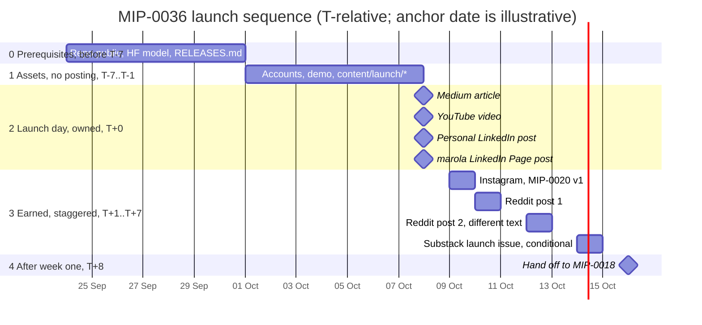

# MIP-0036: Marola Advertising Action (MAA) — the Release 0 launch, channel by channel, and how to sustain it after

| | |
|---|---|
| **Status** | Draft |
| **Author** | Claude Opus 5, for M. Hoffmann (request of 2026-09-07, verbatim: "growth strategy, create MAA marola advertising action.. after release 0 few things will happen and should happen. first. it needs to be planned ahead so all requirements meet. marola rss feed. marola repo becomes Public, LinkedIn post, reddit post, marola org LinkedIn post, YouTube post, Instagram post, medium post, stack post, try to be as loud as possible to gain traction and how to keep it up after, use opus for this one") |
| **Created** | 2026-09-07 |
| **Phase** | 0 — outreach about the project, not marola-the-product. Nothing here touches `Swimability`, `Recommender`, the CLI, the map or any cloud resource. It sits on MIP-0033's *Release* axis, not the `ARCHITECTURE.md` §11 Phase ladder |
| **Number note** | 0036, not 0034/0035 — both are claimed by open drafts on remote branches (`origin/docs/mip-0034-rss-feeds`, `origin/docs/mip-0035-map-plugin-api`) that the `docs/MIPs/README.md` index on `main` does not yet show. Confirmed free by `git fetch origin && git branch -r` on 2026-09-07 |
| **Related** | MIP-0033 (Release 0 — the hard prerequisite; its §5.1 repo-visibility gate is respected here, never routed around), MIP-0029 (the settled positioning every line of copy below obeys), MIP-0020 (Instagram — cited, not redesigned: §5.7 delegates the whole channel to it), MIP-0018 (the weekly post-planner/exporter that owns everything after launch week — §5.10 hands off rather than inventing a second cadence mechanism), MIP-0034 (marola's own outbound Atom feed §5.6, and the "stack" = Substack reading this MIP adopts on its authority), MIP-0023 (wait-list and promotion — the platform-agnostic half of the same axis), MIP-0014 (the book — a later outreach artifact, not launch material) |
| **Effort** | M — no Scala, no new module, no new dependency. The build is a `content/launch/` copy kit, one screen-recorded demo, and the human account-creation and posting sequence in §5.11. If MIP-0018 lands first, the per-channel formatters it already designs absorb most of the copy kit and this drops toward S |
| **Gain** | `community/outreach` (the whole point: Release 0 is currently a milestone nobody outside the repo would ever learn about); `infra/dev-loop` (a written, dependency-ordered launch sequence and a reusable copy kit make Release 1 cheap instead of another improvised week) |
| **Effort vs Gain** | `do when MIP-0033 lands` — verified 2026-09-07: `https://github.com/h0ffmann/marola` returns **404 anonymously** (still private) while `https://marola.dev/` returns **200**. Every post below says "read the code"; until that 404 becomes a 200 the loudest possible launch points at a door that does not open |
| **Depends on** | **MIP-0033 blocks execution outright** — the repo must be public, the chatbot live and the first HF model published before a single post goes out (§5.1 Stage 0), and MIP-0033 §5.1's secret-scan-then-flip checklist keeps its own in-the-moment human go-ahead; this MIP adds a gate, never removes one. **MIP-0029 must be reflected in the live copy** (README/site/CLI strings) before the posts quote it, or the posts and the landing page disagree. **MIP-0034 §5.6 (outbound Atom) is a should-have, not a blocker** — it gives a returning visitor a subscribe path on launch day; if it hasn't landed, launch anyway and add the feed link to the pinned follow-ups. **MIP-0020 owns Instagram**; **MIP-0018 owns week 2 onward**. No Phase 1 gate (nothing here needs the Telegram bot), no paid cloud resource, no `AGENTS.md` cost-rule exposure — every platform below is free at the tier used |
| **Blocked by** | 0033 |
| **Risk** | The "as loud as possible" failure mode is not obscurity, it is **removal**: eight near-identical posts on one day, from accounts with no history, pointing at a repo with zero stars, is the exact shape moderated communities filter as spam — and a Reddit removal or account flag on launch day costs more than a quieter launch would have earned (§8) |
| **Cost so far** | — |

## 1. Summary

Release 0 (MIP-0033) is a milestone with no audience: the repo goes public, a chatbot goes live, a
model lands on Hugging Face, and by default nobody outside this repository ever finds out. **MAA is
the launch plan**: a dependency-ordered sequence (prerequisites → owned surfaces → earned surfaces,
staggered over eight days rather than fired simultaneously), one subsection per channel with that
platform's real, checked account and posting requirements, and draft copy that uses MIP-0029's
settled positioning verbatim instead of inventing marketing language. It deliberately **stops at the
end of launch week** and hands the sustaining problem to MIP-0018, which already designed a
post-planner and multi-platform exporter for exactly that. This MIP creates no account, flips no
repo, and posts nothing. Every such step is a listed human action item (§5.11).

## 2. Motivation

Three concrete gaps, none of them "we should do marketing":

1. **The prerequisite is measurably unmet and easy to get backwards.** Verified today:
   `github.com/h0ffmann/marola` → 404 anonymously; `marola.dev` → 200. A launch post written before
   the flip links to a 404, and a launch post written *after* an unplanned flip has no assets ready.
   The ordering has to be written down before the week starts, which is precisely what the request
   asked for ("it needs to be planned ahead so all requirements meet").
2. **Five of the eight named channels need an account that does not exist yet**, and two of them
   have setup steps with real lead time (a YouTube channel wants phone verification before it will
   take a custom thumbnail; Instagram's path is MIP-0020's five-step §5.4 checklist). Discovering
   that on launch morning is how a launch slips a week.
3. **The repo already decided how it talks about itself** (MIP-0029: "marola — the ocean
   intelligence layer", swim as the *first case*, "no marketing adjectives… the number and its
   source"). Eight posts written ad hoc will drift from it. Writing the copy against §5.2's shared
   kit is cheaper than a second pass reconciling eight platforms.

## 3. User-visible change

None for marola's CLI/map/bot users (Phase 0). For the public: marola becomes findable. The shape
of the copy, using MIP-0029's positioning and this repo's tone (a number and its source, no
adjectives, no exclamation marks):

**The one-line description reused everywhere** (11 words, MIP-0029 §3.3, unchanged):

```
marola — the ocean intelligence layer.
The ocean near you: conditions, water quality, sea life, tides, hazards.
First case: the best hour tomorrow to swim nearby.
```

**The three links every post carries** (and no others):

```
Live map:  https://marola.dev/
Code:      https://github.com/h0ffmann/marola
Model:     https://huggingface.co/<user>/<repo>        (exact URL from MIP-0033 §5.3)
```

## 4. Platform requirements reviewed

Each subsection: what was fetched, on what date, what it actually said. Everything not fetched is
in "Not checked", including two platforms whose help centres refused this session.

### 4.1 LinkedIn — Page creation (fetched 2026-09-07)

`https://www.linkedin.com/help/linkedin/answer/a543852`: the only stated prerequisite is **"You must
have a LinkedIn account to create a Page."** The page lists no minimum profile strength, no
connection count, no account age, and no email-domain verification. The one other condition is a
creation-time confirmation that **"you have the right to act on behalf of the company or school."**

**So: no company registration, no CNPJ, no verified domain.** A personal LinkedIn account is
sufficient to create and administer a marola organization Page. This is the claim the request most
needed checked, and it checks out.

### 4.2 YouTube — channel and posts (fetched 2026-09-07)

- `https://support.google.com/youtube/answer/1646861`: a Google Account alone is not enough: "to
  upload videos, comment, or make playlists, you need a YouTube channel", created via Settings →
  "Add or manage channel(s)", with a profile picture, name and Handle.
- `https://support.google.com/youtube/answer/9890437`: the **Posts tab is a *standard* feature**,
  listed with a "Limited daily limit", i.e. available to a brand-new channel. Longer videos
  (>15 min), custom thumbnails and computer live-streaming are **intermediate**.
- `https://support.google.com/youtube/answer/9891124`: **"If you complete phone verification,
  you'll get access to intermediate features."** Advanced needs phone verification *plus* either
  built channel history or ID/video verification; "Active channels … can usually rebuild sufficient
  channel history within 2 months."
- `https://support.google.com/youtube/answer/9409631`: posts are unavailable on supervised accounts
  and on channels set as "Made for Kids". No subscriber threshold appears on any of these pages.

**So: "a YouTube post" for a brand-new channel means a real uploaded video, plus optionally a
Community/Posts-tab text post.** The widely repeated "you need 500/1,000 subscribers for the
Community tab" did **not** appear on the current pages fetched here (it was historically true; the
fetched page today lists Posts under standard). §5.6 therefore plans the video as the deliverable
and treats the text post as a free extra, and schedules phone verification in Stage 1 anyway,
because a custom thumbnail needs it.

### 4.3 Reddit — sitewide rule verified, per-subreddit rules **not obtainable this session**

`https://www.redditinc.com/policies/content-policy` (fetched 2026-09-07, HTTP 200), Rule 2, verbatim:

> **Abide by community rules.** Participate authentically in communities where you have a personal
> interest, and do not spam or engage in disruptive behaviors (including content manipulation) that
> interfere with Reddit communities.

Two honest findings that shape §5.5:

- **The famous "9:1 rule" is not in Reddit's current content policy.** It is not quoted above
  because it is not there. It survives in SEO blog posts; the enforceable text is "participate
  authentically … do not spam", plus whatever each subreddit's own sidebar says.
- **Per-subreddit rules could not be verified from this session at all.**
  `https://www.reddit.com/r/{opensource,scala,surfing,oceanography,SideProject}/about/rules.json`
  → **HTTP 403** for all five (browser User-Agent, following redirects); `www.reddit.com` and
  `old.reddit.com` are both refused by the fetch tool. Subscriber counts came only from third-party
  aggregator search summaries (r/opensource ≈ 378K, r/scala ≈ 43K) and are **not verified**.

Because a wrong guess here is exactly the failure mode this MIP is trying to avoid, §5.5 does not
assert what any subreddit permits. It makes reading each sidebar a blocking human step.

### 4.4 Medium — help centre blocked; Partner Program is about earning, not publishing

`https://help.medium.com/...` returned **HTTP 403** to both the fetch tool and a browser-UA `curl`
(a Zendesk-wide block, not a marola-specific one), so nothing below is a fetched quote. From search
summaries only (**not verified**): Partner Program eligibility is a complete profile, ≥ 6 published
stories, ≥ 3 months active, a bank account and taxes in an eligible country, 18+, and accepting
Medium's terms and AI-content policy, and **a paid Medium membership is not required to apply**.

The design does not lean on any of those numbers: the Partner Program governs *being paid* for a
story, and §5.8's launch article is published free and un-paywalled regardless: a paywalled launch
announcement defeats its own purpose. What §5.8 needs is only a free Medium account, which is not a
claim in dispute. Flagged in §11 for a human to confirm on the way in.

### 4.5 Substack — start-up requirements (fetched 2026-09-07)

`https://on.substack.com/p/start-basics` (Substack's own guide, HTTP 200): setup asks for a writer
profile with your name, a publication name, a one-line description, and a URL: automatically
`<name>.substack.com`, with a custom domain optional. **No approval, no minimum cadence:** the page
recommends no posting frequency, and explicitly accommodates "start[ing] slow, devoting a few hours
to your publications each week or month". Cost is not stated verbatim on that page (→ "Not
checked"); the paid tier's Stripe connection and $5/month minimum come from search summaries only.

**So starting is trivially cheap, which is exactly why §5.9 argues to be careful about it:** a
newsletter with one post and then silence is a worse artifact than no newsletter.

### 4.6 Instagram — already covered by MIP-0020, not re-derived

MIP-0020 §4.1 verified Meta's publishing rules on 2026-09-06 (professional account required, JPEG
at a public URL, no Facebook Page on the Instagram-Login path, no App Review for an owned account,
100 posts/24 h) and §5.4 is a five-step setup checklist. **Nothing about Instagram is re-checked or
redesigned here.** §5.7 delegates the channel entirely.

### 4.7 "stack" — relying on MIP-0034's finding, not re-verifying it

The request's "stack post" is the same ambiguous word MIP-0034 §4.4 hit ("youtube, medium, stack").
That MIP concluded **Substack**, and, importantly, checked the alternative rather than assuming:
`https://stackoverflow.com/feeds/tag/scala` returned **HTTP 403** behind a Cloudflare interstitial,
its content is CC BY-SA, and it is programming Q&A, not ocean knowledge; rejected on all three
grounds. Stack Overflow's self-promotion norms are strict in any case and it does not function as
an announcement channel.

**This MIP adopts that reading on MIP-0034's authority and did not re-verify it independently**,
stated plainly here rather than left to read as a second confirmation. If the maintainer meant
Stack Overflow, §5.9 is the wrong plan and the honest answer is "that is not an announcement
channel", not a worse post.

## 5. Design

### 5.1 The launch sequence

The ordering rule: **owned surfaces before earned ones, and one earned surface per day.** Everything
in Stage 0 is another MIP's work; MAA does not start until it is done.

| Stage | When | What | Owner |
|---|---|---|---|
| **0. Prerequisites** | before T-7 | MIP-0033 §5.1 secret scan → `SECURITY.md` → `.env.example` re-read → **repo visibility flipped with the maintainer's explicit in-the-moment go-ahead**; chatbot live; HF model published; `RELEASES.md` committed. MIP-0029's strings live in `README.md`/`index.html`/`Main.scala` | MIP-0033 / MIP-0029 |
| **1. Assets, no posting** | T-7 … T-1 | Create accounts (§5.11); YouTube phone verification; record the demo; write `content/launch/*`; if MIP-0034 §5.6 landed, confirm `feed.xml` is live and `<link rel="alternate">` is in `index.html` | human |
| **2. Launch day (owned)** | T+0 | Repo public is already true. Publish the **Medium article** (the anchor everything else links to), then the **YouTube video**, then the **personal LinkedIn post**, then the **marola Page post** | human |
| **3. Earned, staggered** | T+1 … T+7 | +1 Instagram (MIP-0020 v1) · +2 **one** Reddit post · +4 a **second, differently written** Reddit post elsewhere · +6 Substack launch issue **only if** §5.9's cadence commitment is real | human |
| **4. After week one** | T+8 → | **Hand off to MIP-0018.** No new mechanism (§5.10) | MIP-0018 |

No launch date is fixed; the chart below anchors T+0 to an illustrative date only, to
show the ordering and spacing of the table above:



Why this order and not "everything on Monday":

- **The Medium article goes first because it is the only piece with substance to link to.** Every
  other post is a pointer; a pointer to a bare repo is an ad, a pointer to a written argument is a
  reason to click. It also means each later post links to something that already exists rather than
  to a promise.
- **Reddit comes after the owned surfaces, never on day one, and never twice in one day.** By T+2
  the repo has a release tag, a video, and an article, a submission with context instead of a
  drive-by link, which is the difference Rule 2's "participate authentically" is pointing at.
- **The two Reddit posts are two days apart and are not the same text** (§5.5).
- **Substack is last and conditional**, because it is the only channel that is worse to start than
  to skip (§5.9).

**Stop rule (write it down before launch, not during):** if a post is removed by a moderator, do
not repost it and do not appeal on launch day. If two are removed, stop the Reddit arm entirely and
reassess after week one. A removal is information about fit, not an obstacle to route around.

### 5.2 The shared copy kit — `content/launch/`

One directory, one file per channel, human-written, plain Markdown; the same convention MIP-0018
§5.2 already uses for `content/posts/`. Files: `medium.md`, `youtube.md` (title, description,
chapters, the spoken outline), `linkedin-personal.md`, `linkedin-page.md`, `reddit-<sub>.md`,
`instagram.md` (or the MIP-0020 caption), `substack.md`. Shared, non-negotiable across all of them:

- **MIP-0029's positioning, verbatim** (§3): "the ocean intelligence layer", swim as the *first
  case*. No "AI-powered", "smart", "seamless", "revolutionary"; no exclamation marks.
- **The three links of §3**, and nothing that does not resolve.
- **The honest framing MIP-0033 §8 already commits to:** the chatbot's uptime is one person's
  machine, and the first published model is a pipeline proof, not a quality bar. Saying this in the
  launch copy costs nothing and pre-empts the first sceptical comment.
- **No safety claim.** marola is not a safety authority (§6).

Each file is a *rewrite* for its audience, never a paste of another. That is a spam-avoidance
mechanism as much as a quality one (§8).

### 5.3 Personal LinkedIn post

**Requirements:** none beyond the maintainer's existing account (§4.1 covers the Page; a personal
post needs nothing). No API: MIP-0018 §4 already established that LinkedIn's Community Management
API is gated to verified companies and unusable for an individual, so this is copy-paste, by hand,
by design.

**Shape:** first-person, the build story, one concrete engineering decision, then the links. The
audience here is colleagues, not the ocean-swimming public. Draft:

```
Six weeks ago I wanted to know what the best hour tomorrow was to swim near Florianópolis.
marola is what came out of it: the ocean intelligence layer — the ocean near you, from live
data, sourced or clearly labelled, never invented.

Every beach around a stretch of coast, ranked from Open-Meteo and OpenStreetMap, with official
bathing-water quality per sampling point, tides, and jellyfish/whale odds. Scala 3 on Kyo. It
runs entirely on your own machine with a free Ollama model.

The part I would defend in review: everything that decides whether marola tells you to swim is
plain, unit-tested Scala. The model writes the sentence; it never picks the number.

Map: marola.dev · Code: github.com/h0ffmann/marola · Write-up: <medium link>
```

### 5.4 marola LinkedIn organization Page

**Requirements, verified (§4.1):** a personal LinkedIn account, plus confirming at creation that you
have the right to act for the organization. **No company registration.** Created at
`linkedin.com/company/setup/new`; the personal account becomes the Page's admin.

**Why bother, honestly:** a Page is a durable, followable surface that outlives one post in a feed,
and it is the only LinkedIn object a future collaborator can follow without following the
maintainer personally. **What it is not:** an audience. A new Page has zero followers, so its first
post reaches nobody on its own. The reach comes from the personal post (§5.3), which is why the
sequence publishes the personal post *first* and the Page post after, with the personal account
resharing the Page's post rather than duplicating its text.

**Setup in Stage 1** (creating a Page is a shared-state, brand-facing action → §5.11 human item):
name `marola`, one-line description from §3, logo = the site's wave wordmark, website `marola.dev`,
industry ≈ software / environmental services (the maintainer's call), location Florianópolis.

### 5.5 Reddit

**What is verified:** only the sitewide Rule 2 (§4.3). **What is not:** every individual
subreddit's rules, which is where posts actually get removed.

**Therefore the design is a procedure, not a subreddit list.** Candidate communities, in the order
this MIP would try them (none of them confirmed active or confirmed to permit project posts):

| Candidate | Why it might fit | Must check before posting |
|---|---|---|
| r/scala | marola is a real Scala 3 / Kyo codebase; a "what I built" post is on-topic for a language community | whether showcase posts are allowed at all, or only in a weekly thread |
| r/opensource | a genuinely open-source project going public is that subreddit's subject matter | almost certainly has an explicit self-promotion rule; read it |
| r/SideProject | built for exactly this kind of post | low signal, high tolerance — use as fallback, not first choice |
| r/oceanography, r/surfing, r/openwaterswimming | the actual domain audience | most domain communities are the *least* tolerant of a developer's launch post; check whether a tool post is welcome at all before spending the good framing here |

**The blocking human step, before each post:** open the subreddit, read its rules and its sidebar,
read the last two weeks of front page, and confirm (a) posts like this exist there and were not
removed, (b) which flair to use, (c) whether a weekly showcase thread is the correct venue instead
of a top-level post. If the answer is unclear, post in the weekly thread or not at all.

**The post itself:** a **text self-post**, not a link post: a bare link from a new account is the
canonical spam shape. Lead with the technical substance and the honest limitation; put the links at
the bottom; no hashtags (MIP-0018 §5.3 already notes hashtags read as spam on Reddit); answer every
comment for 48 h. Two posts, two days apart, two different texts: r/scala gets the Kyo/effect-
boundary story, r/opensource gets the local-first/zero-key story. If the maintainer's Reddit account
is brand new with no history, prefer **one** post and the weekly-thread route. A new account
link-dropping into multiple subreddits is precisely the "content manipulation" pattern Rule 2 names.

### 5.6 YouTube

**Requirements, verified (§4.2):** a Google Account *plus* an explicitly created channel with a
handle. Posts tab is standard; **phone verification (intermediate) is needed for a custom thumbnail
and for videos over 15 minutes**: do it in Stage 1, it takes minutes and cannot be done under time
pressure on launch day.

**The deliverable is a 60–120 second screen-recorded demo**, not a talking-head or a slideshow:
`just run -- --summarize` producing a real answer, then the map at `marola.dev`, then the chatbot.
Unlisted first, reviewed, then public on T+0, and embedded in the Medium article (§5.8), which is
where most of its views will come from. Title and description from `content/launch/youtube.md`,
using §3's one-liner as the first description line so it survives truncation. The Community/Posts
text post is a free extra on launch day; it is not the channel's deliverable and reaches nobody at
zero subscribers.

### 5.7 Instagram — deferred entirely to MIP-0020

**MIP-0036 should not re-cover this channel, and does not.** MIP-0020 already verified Meta's
publishing requirements, wrote the bio and caption templates, chose the image path (a committed JPEG
served by the site), and staged the work v1 (post by hand) → v2 (API) → v3 (gated daily pipeline).
MAA's only additions are scheduling and consistency:

- Instagram is **T+1**, using **MIP-0020 §5.1 v1 (a human posting from a phone)**. Nothing in MAA
  waits for its API path.
- Two wording items MAA inherits rather than settles: the handle `@marola.swim` conflicts with
  MIP-0029's non-swim-only positioning (MIP-0029 §8 flagged it and explicitly left it to MIP-0020),
  and MIP-0020's bio still points at `h0ffmann.github.io/marola` while the live site is
  `marola.dev` (verified 200 today). **Both need to be resolved in MIP-0020 before T+1**, and they
  are §11 questions here, not decisions.

### 5.8 Medium

**Requirements:** a free Medium account. The Partner Program is about being paid and is not needed
to publish (§4.4, search-summary only, flagged). The launch article is **free and un-paywalled**;
do not enrol, do not lock the story.

**This is the anchor artifact of the whole launch**, the piece with enough room to earn the clicks
the other seven posts are asking for. ~1,200–1,800 words, structured as the repo actually thinks:
the question ("what is the best hour tomorrow to swim nearby?"), why it is harder than it sounds
(live data, a decision that can hurt someone if it is wrong), the deterministic-scoring /
LLM-writes-the-sentence boundary, local-first with a free Ollama model, one thing that was
rejected and why (the MIP-0018 §5.2 "candidate why hooks" heuristic finds these; MIP-0034 §4.4's
"checked the alternative and it failed anyway" is a good one), the honest limitations from §5.2,
then the links and the embedded video. Canonical-link the article back to `marola.dev` if a blog
repo exists (MIP-0018 §11's open question); otherwise Medium is the canonical home of this one post.

### 5.9 Substack ("stack") — the honest caveat channel

**Requirements, verified (§4.5):** a writer profile, a publication name, a one-line description and
a URL. No approval, no cost stated on the fetched page, **no required cadence**.

**And that is the problem.** Starting is free; *sustaining* is the commitment. A Substack with one
launch issue and then eight months of silence is a public artifact that says the project was
abandoned, strictly worse than never having created it, and worse than the same text as a Medium
post, which nobody expects a sequel to. A newsletter is a promise of a next issue; a blog post is
not.

**So the recommendation is conditional, and the condition is written down:** create the publication
in Stage 1 (reserve the name, that part is cheap and reversible), and publish the launch issue at
T+6 **only if** the maintainer commits to a realistic minimum (*one issue a month for six months*)
and MIP-0018's planner is the thing that will feed it. If that commitment is not real on launch day,
leave the publication dormant and unlaunched, and skip the channel. Choosing not to post is a valid
outcome of this subsection, not a failure of it.

### 5.10 After week one — handed to MIP-0018, not redesigned here

MIP-0018 already designed the sustaining mechanism: a weekly post-planner that mines merged PRs,
MIP metadata and operator logs for "candidate why hooks", a human-written `content/posts/YYYY-Www.md`
draft, and a multi-platform exporter emitting per-platform files (LinkedIn, blog, Substack, Reddit).
Its §9 already rejected LLM-generated post text for the right reason: "reads like a changelog".
**MAA does not build a second content-cadence mechanism.** Its hand-off is three concrete asks on
MIP-0018, no more:

1. Treat `content/launch/` as the seed corpus of `content/exports/`, same shape, one week earlier.
2. Add `instagram` and `youtube-post` to §5.3's formatter list (MIP-0020 §5.1 step 3 already asks
   for the first).
3. Name the launch channels in the planner's output so week 2 asks "which of these seven do you
   want this week?" rather than starting from a blank page.

**The RSS tie-in:** MIP-0034 §5.6's outbound Atom feed is the only sustaining channel that needs no
human writing at all. It updates itself from the board on every site build. It should be **live and
linked from every launch post's landing page before T+0** if it has landed, because it converts a
launch-day visitor into a subscriber without asking the maintainer to post again; and MIP-0034
§5.7a's corpus-changelog feed becomes genuinely useful the moment the repo is public. Neither blocks
the launch. GitHub's own `releases.atom` already exists for free (MIP-0034 §5.7c) and is worth naming
in the README as a follow path on launch day.

### 5.11 Human action items — everything this MIP will not do itself

Per `AGENTS.md`'s risk-assessment culture: creating public-facing
brand accounts and posting under them are irreversible, shared-state, identity-bearing actions.
**No agent performs any line of this table.** MIP-0036 lists and sequences them; a human does them.

| # | Action | Stage | Irreversible? |
|---|---|---|---|
| 1 | Flip repo visibility (MIP-0033 §5.1, its own go-ahead) | 0 | Yes — history is public forever |
| 2 | Create the marola LinkedIn Page | 1 | Deletable, but the name is claimed publicly |
| 3 | Create the YouTube channel + phone verification | 1 | Reversible |
| 4 | Create/confirm the Medium account | 1 | Reversible |
| 5 | Create the Substack publication (**do not launch it**) | 1 | Name claimed |
| 6 | Instagram account per MIP-0020 §5.4 | 1 | Name claimed |
| 7 | Confirm a Reddit account with real history exists, or accept the one-post plan (§5.5) | 1 | — |
| 8 | Read each target subreddit's rules and recent front page | 1 | — |
| 9 | Publish each post, in the §5.1 order | 2–3 | Each is public |

## 6. Scoring / safety impact

**None to `Swimability.score`, `Recommender`, or any file under `scoring/`.** This MIP changes no
product code. Two safety-adjacent constraints on the copy, which are real:

- **No launch post, caption, video line or article sentence may state a marine-safety fact that is
  not already sourced in `knowledge/`**: the `mip` skill's "no unsourced facts reach a user" rule
  does not stop applying because the surface is LinkedIn. Marketing copy is the easiest place for an
  invented "jellyfish risk is highest at dawn" to appear.
- **The demo video and any screenshot must show a real, unedited run**, including MIP-0022's safety
  footer where it appears. Cropping the footer out of a screenshot because it is visually
  inconvenient would misrepresent the product's own safety behaviour.

## 7. Verification plan

No test gate applies to a docs-and-copy change. Verification is a checklist, run by a human:

- **Before T+0:** `curl -o /dev/null -w '%{http_code}' https://github.com/h0ffmann/marola` returns
  **200** anonymously (today: 404); `marola.dev` returns 200; the HF model URL resolves from a
  machine that never had it; every link in every `content/launch/*` file resolves (a `just`
  recipe or one `curl` loop, not by eye).
- **Copy check:** grep each `content/launch/*` for "AI-powered", "smart", "seamless",
  "revolutionary", "!": zero hits, per MIP-0029 §3.3 and the site-frontend rule.
- **Positioning check:** every file contains "ocean intelligence layer" and frames swim as the
  first case, not the product.
- **Per channel:** the post exists at a public URL, and is still there 72 h later (the removal
  check that matters; see §5.1's stop rule).
- **"Done" for MAA** = all nine §5.11 items executed or explicitly declined, with each post's URL
  recorded in `docs/MIPs/RELEASES.md`'s Release 0 section (MIP-0033 §5.4), so the launch is part of
  the release record rather than scattered across seven platforms.

## 8. Risks, limitations, and honest caveats

- **"As loud as possible" and "removed as spam" are the same action seen from two sides.** Eight
  posts in one day, near-identical text, from accounts with no history, pointing at a repo with zero
  stars, is the pattern moderation systems and experienced communities are tuned to catch. The
  mitigations are the design, not an afterthought: stagger across eight days, rewrite per audience
  rather than paste, lead with the Medium article's substance and a real demo, and use text
  self-posts on Reddit rather than bare links.
- **A brand-new public repo with zero stars has a specific look**, and posting about it everywhere
  at once amplifies that look rather than hiding it. The honest counter is not to disguise it but to
  give a reader something that does not depend on social proof: a working map they can open, a video
  showing a real run, and a written argument. That is what §5.1's ordering optimises for.
- **Five new accounts is five new dormancy risks.** MIP-0020's own Risk row already named this ("a
  dormant account") for Instagram alone; MAA multiplies it by five. §5.9 declines one channel outright on those
  grounds, and §5.10's hand-off to MIP-0018 exists because launch-week energy is not a plan.
- **Reddit is the highest-variance channel and the least verified.** Per-subreddit rules could not be
  read this session at all (§4.3), the "9:1 rule" everyone repeats is not in Reddit's policy, and a
  removal or account flag on launch day is a real, plausible outcome. This is why §5.5 is a
  procedure with a blocking human read step rather than a list of subreddits to fire at.
- **Two help centres refused this session** (Medium, Substack support, Zendesk 403s), so §4.4's
  Partner Program figures and Substack's free-tier cost are search summaries, not fetched pages.
  Neither drives a design decision (§5.8 publishes free; §5.9's caveat is about cadence, not price),
  but they are not verified and are listed as such.
- **A launch is not traction.** Everything here produces a spike. Whether marola has an audience in
  three months is decided by MIP-0018's weekly habit and MIP-0034's self-updating feed, not by this
  week, and no amount of launch-day loudness substitutes for that.
- **Nothing here is measured.** MAA proposes no analytics, and `site/static/app.js` says "no
  analytics, no cookies" (MIP-0029 §6 keeps that verbatim). Follower counts, GitHub stars and each
  platform's own post stats are the only signal, and they are weak. Not a gap to fix with tracking.

## 9. Alternatives considered

- **Do nothing / a quiet release.** Push the release tag, tell nobody, let the repo be found. Costs
  nothing, risks nothing, and is a perfectly defensible choice for a project whose value does not
  depend on an audience. Rejected because the maintainer asked for the opposite, and because MIP-0033
  and MIP-0034 both already assume "the repo is public" is a thing people find out about.
- **Everything on launch day, simultaneously.** The most literal reading of "as loud as possible",
  and the one that maximises removal risk for a marginal gain in same-day coincidence. Rejected in
  favour of the eight-day stagger (§5.1).
- **One post, one channel (Reddit or LinkedIn only).** Lowest risk, lowest cost, and genuinely the
  right answer if the maintainer's time is the binding constraint. Not chosen because the request
  named eight channels, but it remains the fallback if Stage 1 runs out of time: **do §5.8 (Medium)
  and §5.3 (LinkedIn) and nothing else**: those two are the highest value per hour spent.
- **Paid promotion** (LinkedIn/Reddit ads). Rejected: money for reach with no product-market
  evidence yet, and `AGENTS.md` keeps paid tooling out unless nothing free works.
- **Automating the posting.** Rejected on this MIP's own §5.11 grounds and MIP-0018 §4's finding that
  most of these platforms have no usable API for an individual anyway. The one platform that does
  (Instagram) already has a designed human gate in MIP-0020 §5.5.
- **Product Hunt / Hacker News as launch channels.** Both are plausible and neither was researched
  here, so neither is designed in. Named in §11 rather than invented in §5.

## 11. Open questions

1. **The "stack" reading.** §4.7 adopts MIP-0034 §4.4's Substack conclusion without re-verifying it.
   If Stack Overflow was actually meant, §5.9 is the wrong plan, and the honest answer is that it
   is not an announcement channel.
2. **Does the Substack cadence commitment exist?** §5.9's whole recommendation turns on it. A human
   decision, needed by T+6, not before.
3. **The Instagram handle and bio URL**: `@marola.swim` vs. MIP-0029's positioning, and MIP-0020's
   `h0ffmann.github.io/marola` bio vs. the live `marola.dev`. Both belong to MIP-0020; MAA cannot
   post on T+1 until they are settled.
4. **Which subreddits, and does the maintainer have an account with history?** Unanswerable from
   here (§4.3's 403s). Needs the human read step in §5.5 before any Reddit post.
5. **The Medium/blog canonical question**: MIP-0018 §11 still asks what the blog repo is; if one
   exists, §5.8's article should be canonical there and syndicated to Medium, not the reverse.
6. **Is a launch-day tag/release worth cutting** (`v0.0`) so `releases.atom` has an entry to carry?
   Cheap, and it gives the free GitHub feed something to say. MIP-0033's call, not this one's.
7. **Follow-up MIP:** Product Hunt and Hacker News were named as plausible channels and deliberately
   not researched (§9). If the maintainer wants either, they need their own MIP with the same
   requirements pass; both have strong community norms about self-submission and timing, and
   guessing at them is exactly what §4 exists to prevent. Would need the next free MIP number.

## Appendix

### Checked live

All fetched 2026-09-07 unless stated.

- `https://github.com/h0ffmann/marola`: **HTTP 404** anonymously (browser UA, redirects followed);
  `https://api.github.com/repos/h0ffmann/marola`: **404**. The repo is still private, re-confirming
  MIP-0033 §3's finding of 2026-09-06.
- `https://marola.dev/`: **HTTP 200**. The site is already public (and is the live URL, not
  MIP-0020's older `h0ffmann.github.io/marola`).
- `https://www.linkedin.com/help/linkedin/answer/a543852`: "You must have a LinkedIn account to
  create a Page"; a creation-time confirmation that "you have the right to act on behalf of the
  company or school"; **no** other prerequisite listed (no profile strength, connections, account
  age, or email domain).
- `https://support.google.com/youtube/answer/1646861`: a Google Account is not sufficient; a
  channel must be created (profile picture, name, Handle) to upload, comment or make playlists.
- `https://support.google.com/youtube/answer/9890437`: "Posts tab" listed under **standard**
  features with a "Limited daily limit"; longer videos (>15 min), custom thumbnails and computer
  live-streaming listed under **intermediate**. No subscriber threshold on the page.
- `https://support.google.com/youtube/answer/9891124`: "If you complete phone verification, you'll
  get access to intermediate features"; advanced = phone verification + channel history or ID/video
  verification; "Active channels … can usually rebuild sufficient channel history within 2 months."
- `https://support.google.com/youtube/answer/9409631`: posts unavailable for supervised accounts
  and "Made for Kids" channels; no subscriber requirement stated.
- `https://www.redditinc.com/policies/content-policy`: **HTTP 200**, ~478 KB. Rule 2 quoted
  verbatim in §4.3. **No 9:1 / 90-10 self-promotion ratio appears anywhere in the policy.**
- `https://www.reddit.com/r/opensource/about/rules.json` and the same path for `scala`, `surfing`,
  `oceanography`, `SideProject`: **HTTP 403** on all five (browser UA, redirects followed).
  `www.reddit.com` and `old.reddit.com` are both refused by the fetch tool. Per-subreddit rules
  could not be read this session.
- `https://on.substack.com/p/start-basics`: setup requires a writer profile with your name, a
  publication name, a one-line description and a URL (`<name>.substack.com`, custom domain
  optional); no approval step; no recommended cadence, and it explicitly accommodates "start[ing]
  slow, devoting a few hours to your publications each week or month".
- `https://help.medium.com/hc/en-us/articles/39121627791639-Medium-Partner-Program-eligibility`:
  **HTTP 403**, both via the fetch tool and via `curl` with a desktop-Chrome User-Agent (Zendesk
  block).
- `https://support.substack.com/hc/en-us/articles/360037825111-...` and
  `https://support.reddithelp.com/hc/en-us/articles/360043504051-Content-Policy`: **HTTP 403**,
  same Zendesk block. `redditinc.com` was used instead for the content policy, successfully.
- `git fetch origin && git branch -r`: `origin/docs/mip-0034-rss-feeds` and
  `origin/docs/mip-0035-map-plugin-api` exist; **0036 is free**. `docs/MIPs/README.md` on `main`
  ends at MIP-0033.

### Not checked

- **Every individual subreddit's rules, activity level and subscriber count** (§4.3's 403s). The
  counts appearing in search summaries (r/opensource ≈ 378K, r/scala ≈ 43K) are third-party
  aggregator figures, not read from Reddit, and a claim that Reddit removed public subscriber counts
  in September 2025 came from the same kind of summary, repeated nowhere in this MIP's design.
- **Medium's Partner Program eligibility list** (complete profile, ≥ 6 stories, ≥ 3 months active,
  bank account, 18+, terms accepted; membership not required to apply), search-summary only, the
  help page 403'd. §5.8 does not depend on any of it.
- **Substack's free-tier cost and the $5/month paid minimum**: not stated on the page fetched;
  search-summary only.
- **Instagram's entire requirement set**: deliberately not re-verified; taken from MIP-0020 §4.1
  (verified there 2026-09-06).
- **The "stack" = Substack reading**: taken from MIP-0034 §4.4 (verified there 2026-09-07,
  including the Stack Overflow 403 and CC BY-SA check), not independently re-derived here.
- **LinkedIn's own posting rate limits, and whether a Page post from a zero-follower Page is
  distributed at all**: assumed to reach nobody organically in §5.4 based on how feeds generally
  work, not on a LinkedIn-documented statement.
- **Whether the Hugging Face model URL of MIP-0033 §5.3 exists yet**: it does not; §5.11 item 1's
  prerequisites are unmet, so it could not be link-checked.
- **Product Hunt and Hacker News norms**: not researched at all (§9, §11.7).
