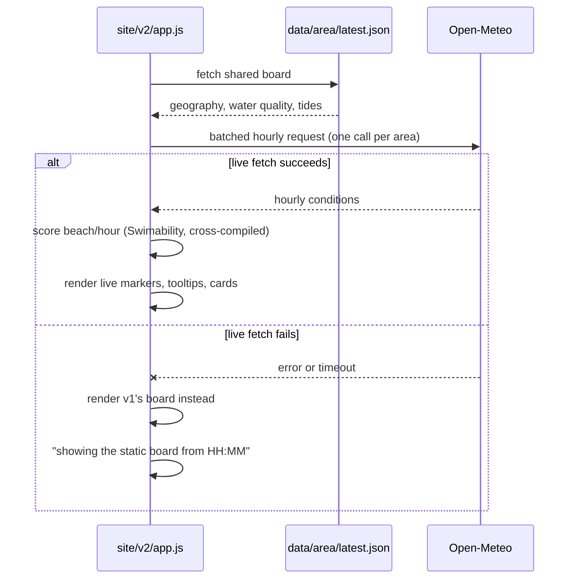

# MIP-0042: `marola.dev/v2` — a map that computes live, with v1 frozen and kept

| | |
|---|---|
| **Status** | Draft |
| **Author** | Claude Opus 5, for M. Hoffmann (request of 2026-09-07: "how to keep existing map in marola.dev/v1 and start to build marola.dev/v2 the new not statically rendered map") |
| **Created** | 2026-09-07 |
| **Phase** | 3 (Deploy — the same phase MIP-0005's static site already occupies; still free, still no cloud account, no new hosting). Phase 1 (the Telegram bot) is still not done; per `AGENTS.md`'s phase-discipline rule that is flagged here explicitly, but it does not gate this work any more than it gated MIP-0005/0009/0030/0037 — the site has run alongside Phase 1 since it existed |
| **Related** | MIP-0005 (v1 itself — its §5.3/§5.4 build-and-schedule design, and its §9 rejection of a "dynamic site (server + API)", which this MIP reopens on new evidence rather than overturning); MIP-0029 (positioning — a live layer is what "the ocean intelligence layer" claims to be); MIP-0033 (§5.2's Cloudflare-Tunnel-backed chat server — the repo's only precedent for a live origin behind `marola.dev`; researched here and deliberately **not** needed, §9.3); MIP-0035 (the plugin API's `ctx`/`onBoardUpdate` contract, which v2 must preserve — §5.5); MIP-0037 (the PWA — v1-shaped by construction, and v2's own offline story, §5.6) |
| **Effort** | L — a Scala.js cross-build of the scorer (this repo's first JS build target), a second client tree, and a `site.yml` that publishes both. Re-rated from M once §4.4 established that the scorer cannot be hand-ported to JavaScript without duplicating safety-relevant logic — copy this clause into the index cell, not a bare `L` |
| **Gain** | `user value` (a score for the hour you are actually standing on the beach in, from the newest forecast run — not a snapshot computed up to 3 h ago); `infra/dev-loop` (one scorer, two targets: the cross-build is reusable by every later browser-side feature); `cost/ops` (still exactly $0 per visitor — no server, no Worker, no account, no card on file) |
| **Effort vs Gain** | `do next` for §5.1 (the v1 freeze — small, reversible, and it unblocks everything else); `do when the Scala.js cross-build proves out` for §5.3/§5.4 (the live half) — §4.4's `java.time` shim is the one genuine unknown, and it is cheap to settle in a spike before committing to the rest |
| **Depends on** | Nothing blocks this. Real coordination, not blocking: MIP-0035 and MIP-0037 both edit `site/static/app.js`/`index.html`, and §5.1's freeze changes what "that file" means — so §5.1 should land either clearly before or clearly after them, not interleaved (MIP-0037 §8 already names this exact "two hands in one file" hazard). No paid cloud resource is involved, so `AGENTS.md`'s cost gate is not triggered; §8 states what would trigger it |
| **Blocked by** | none |
| **Risk** | Two clients, maintained forever. Every later map feature (MIP-0030's trails, MIP-0016's water markers, MIP-0035's plugins) has to choose a side or be built twice — and the honest failure mode is not that v2 breaks, it is that v1 quietly rots into a stale, half-featured page nobody removed |
| **Cost so far** | — |

## 1. Summary

Freeze today's static map at `marola.dev/v1/`, same files, same 3-hourly build, permanently
available, and start a second client at `marola.dev/v2/` that computes a beach's score **in the
visitor's browser, at the moment they load the page**, instead of reading a board baked hours
earlier. The finding that makes this possible without a server is in §4: Open-Meteo answers
cross-origin requests (`access-control-allow-origin: *`, verified live today on both the forecast
and marine endpoints), so the browser can fetch the forecast itself, while Overpass and the
water-quality bulletins **cannot** move to the browser (§4.2, §4.3), so beach geometry and water
quality stay precomputed exactly as they are now. v2 is therefore a *hybrid*: static geography,
live conditions. Nothing paid, nothing provisioned, one GitHub Pages deploy.

## 2. Motivation

v1 is honest about what it is and that is precisely its limit. `.github/workflows/site.yml` runs
`cron: "15 */3 * * *"` (verified live in this repo today), so `SiteBuilder` computes every area's
board at most eight times a day; `site/static/app.js` then only ever *reads* those files:
`fetchJson('data/areas.json')` → `data/<area>/latest.json` → `data/<area>/<day>.json`, with the
page refusing any board whose `schema` is not `1`. Three consequences a visitor actually feels:

- **The board can be 3 hours old**, and the page says so (`generated_at` is displayed, and
  `isPast()` visibly fades hours already gone), honest, but still stale.
- **Only three areas exist**, because each one costs an Overpass query per run: `site/areas.json`
  holds `floripa`, `rio`, `salvador` and nothing else. A visitor anywhere else gets no answer.
- **"Near me" is a sort, not a computation.** `app.js`'s Geolocation button reorders the existing
  beaches by distance; it cannot score the coordinates you are actually standing on.

MIP-0005 §9 rejected the obvious fix: "Dynamic site (server + API). Needs hosting, auth, rate
limiting — everything the static board avoids." That reasoning was right and is still right. What
it did not consider is the option this MIP proposes: dynamic **without** a server.

## 3. User-visible change

**Today (v1, unchanged, still at `/v1/` after this MIP):**

```
marola.dev  →  Florianópolis ▾   today | tomorrow          computed 2026-09-07 09:15 -03
               [map: 80 wave markers, each at its best hour]
               Praia do Campeche · 35/100 at 08:00 · 〰️ 1.4 m · 🌬️ breezy 28 km/h
```

**v2 (`marola.dev/v2/`):**

```
marola.dev/v2  →  Florianópolis ▾   now (13:42) | +1h | +2h | tomorrow      live · fetched just now
                  [same 80 beaches, scored from the forecast run fetched 4 s ago]
                  Praia do Campeche · 41/100 now · 〰️ 1.1 m · 🌬️ breezy 24 km/h
                  💧 4/5 PRÓPRIA — avoid Ponto 73 (25 Aug)   ← still from the 3-hourly build
                  ⓘ conditions live from Open-Meteo · beaches and water quality precomputed 09:15
```

The footer line is not decoration: it is the honesty requirement (§6). A v2 page mixes two
freshness classes and must show which is which, the same way v1 shows `generated_at` today.

Also new in v2, and the concrete answer to "near me": `marola.dev/v2/?lat=-27.69&lon=-48.48`
scores *those* coordinates against the nearest precomputed beach's geography. What v2 deliberately
does **not** do is discover new beaches on demand: that needs Overpass in the browser, which §4.2
rules out on the operator's own stated policy.

## 4. Data sources and dependencies reviewed

### 4.1 Open-Meteo — CORS-open, and the reason v2 needs no server

`curl -I -H "Origin: https://marola.dev"`, 2026-09-07, against both endpoints this repo already
uses (`core`'s only two forecast URLs): `https://api.open-meteo.com/v1/forecast` and
`https://marine-api.open-meteo.com/v1/marine`. Both returned `HTTP/1.1 200` with
`access-control-allow-origin: *`, `access-control-allow-methods: GET, POST, OPTIONS` and
`access-control-max-age: 600`. A browser on `marola.dev` can read these directly; no proxy needed.

Terms (`https://open-meteo.com/en/terms`, fetched 2026-09-07): free non-commercial use at
**600 calls/min, 5,000 calls/hour, 10,000 calls/day**, licence **CC-BY 4.0**, no API key mentioned.
Those limits are quotas against the *calling* IP, which in v2 is the visitor's, not marola's single
Actions runner, so browser-side fetching spends the visitor's allowance rather than concentrating
every visitor onto one address. **Not verified**: that Open-Meteo enforces per-IP specifically; the
terms page states the numbers without naming the subject. §8 treats this as an assumption.

### 4.2 Overpass — CORS-open, but its own policy says do not do this

`Access-Control-Allow-Origin: *` is present (POST with an `Origin` header, 2026-09-07, real
elements returned), so CORS is *not* the blocker. The blocker is the operator's fair-use document
(`dev.overpass-api.de/overpass-doc/en/preface/commons.html`, fetched 2026-09-07), which lists among
its problematic patterns: *"Operating end-user applications relying on public instances as backend
infrastructure"*, alongside a ~10,000 requests/day and ~1 GB/day expectation per user. Live
confirmation of how tight the per-IP budget is: `https://overpass-api.de/api/status`, 2026-09-07 →
`Rate limit: 2`, `2 slots available now`: two concurrent queries per IP.

**Conclusion: beach discovery stays server-side.** v2 keeps consuming the precomputed beach list
`SiteBuilder` already publishes. This is also what site.yml's own header comment has said since
MIP-0005 ("Overpass fair use: keep areas few and the cron at ≥ 3 h").

### 4.3 Water quality (IMA/SC, and MIP-0031's INEA/INEMA) — no CORS header at all

`curl -D - -H "Origin: https://marola.dev" https://balneabilidade.ima.sc.gov.br/relatorio/mapa`,
2026-09-07: `HTTP/1.1 200`, `Content-Type: text/html; charset=UTF-8`, and **no
`Access-Control-Allow-Origin` header in the response**. A browser cannot read this cross-origin:
not a policy question, a hard one. MIP-0031's INEA/INEMA sources are PDF bulletins needing a parser,
which is worse still for a browser. **Water quality stays precomputed, unconditionally.**

### 4.4 Scala.js — how the scorer reaches the browser without being rewritten

`core/src/main/scala/marola/scoring/Swimability.scala` is 220 lines and already pure: its only
imports are `java.time.{LocalDate, DateTimeFormatter}` and marola's own model/water types: no Kyo,
no HTTP, no file I/O. It is cross-compilable as-is, with one caveat.

- Scala.js **1.22.0** is current (`scala-js.org`, and `repo1.maven.org`'s
  `scalajs-library_2.13/maven-metadata.xml` → `<latest>1.22.0`, both 2026-09-07). Cross-builds use
  `sbt-scalajs` 1.22.0 + `sbt-scalajs-crossproject` 1.3.2 with `crossProject(JVMPlatform, JSPlatform)`
  (`scala-js.org/doc/project/cross-build.html`, fetched 2026-09-07).
- **Scala 3 on Scala.js is confirmed by artifact existence, not by a docs claim**:
  `https://repo1.maven.org/maven2/io/github/cquiroz/scala-java-time_sjs1_3/` returns `200`
  (2026-09-07), a published `_sjs1_3` (Scala.js 1.x, Scala 3) artifact. That same library is the
  caveat's fix: Scala.js's `javalib` does not ship `java.time`, so `scala-java-time` supplies it.
  **Not verified**: which exact version of `scala-java-time` to pin, and that `DateTimeFormatter`'s
  specific patterns `Swimability` uses are among what it implements. That is §7's spike.

### 4.5 Cloudflare Workers — researched, and rejected as unnecessary

`developers.cloudflare.com/workers/platform/limits/`, fetched 2026-09-07: Free plan is
**100,000 requests/day**, **10 ms CPU per HTTP request**, **50 subrequests per request**, **128 MB**
memory per isolate; *"Waiting on network requests (such as `fetch()` calls, KV reads, or database
queries) does not count toward CPU time"*, and no wall-clock limit for HTTP-triggered Workers on
free. Those numbers would in fact fit marola's workload: it is I/O-bound, not CPU-bound. The docs
page **does not state** whether a card is required to create a free Workers account; not verified.

It is still rejected for v2 (§9.2): once the browser can call Open-Meteo directly, a Worker adds an
account, a deploy path outside GitHub Actions, and a second thing that can be down, for nothing.
It is written down here as the **documented fallback** if a future v2 feature needs a CORS-closed
source live (a water-quality proxy is the obvious candidate), and §8 states the cost gate that
would then apply.

**The pick:** Open-Meteo in the browser (§4.1); Overpass and water quality precomputed (§4.2/§4.3);
the scorer cross-compiled with Scala.js (§4.4); no Worker, no tunnel, no paid service (§4.5).

## 5. Design

### 5.1 The URL split — one Pages deploy, two trees

`site/dist/` gains two client directories and keeps **one** copy of the data:

```
site/dist/
  index.html app.js style.css vendor/   ← v1, at the root, exactly as today (no link breaks)
  v1/  index.html app.js style.css vendor/   ← the same v1 files, at their permanent URL
  v2/  index.html app.js style.css vendor/   ← the new client
  data/ areas.json  <area>/latest.json  <area>/<day>.json   ← shared, written once
  CNAME smoke/ coverage/
```

Once v2 is declared ready, the root copy is swapped to v2 and `/v1/` stays, labelled in its own
footer as the static map. **Concrete choice made:** a path split on the one existing domain.
Rejected: `v2.marola.dev` (a new DNS record, and MIP-0005's CNAME-inside-the-artifact mechanism,
`echo "marola.dev" > site/dist/CNAME` in site.yml, covers one hostname, not two); rejected: a
`?v=2` toggle in one `app.js` (one file rendering two ways is exactly the "two hands in one file"
problem MIP-0037 §8 already flags).

Two mechanical consequences, both real, both found by reading the files:

- **Relative data paths break under `/v1/`.** `app.js` fetches `'data/areas.json'`, which under
  `/v1/` resolves to `/v1/data/areas.json`. Fix: derive a base from the script's own URL
  (`new URL('.', document.currentScript.src)`) and resolve `data/` against the *site root*, so one
  `data/` tree serves both clients and `just site-serve` on a subpath still works. Do not hardcode
  `/data/`: that would break the `h0ffmann.github.io/marola/` project-page URL site.yml still
  documents as resolving.
- **site.yml's publish allowlist rejects them.** Its `find . -mindepth 1 \( -path ./data -o -path
  ./smoke -o -path ./coverage -o -path ./vendor \) -prune -o -type f ! -name index.html ... -print`
  step fails the build on any file outside the list. `-path ./v1 -o -path ./v2` must be added to
  the prune set, and the "Required files" step extended to assert `v1/index.html` and `v2/index.html`
  exist: that step is the belt that caught a half-built deploy on 5 Sep 2026 and it should keep
  catching one.

### 5.2 The skeleton board — what the build still computes

`SiteBuilder` and `Board` are unchanged in shape; the board JSON v1 reads is exactly what v2 reads.
v2 simply uses a *subset* of it: `beaches[].{name,lat,lon}`, `water`, `facilities`, `tides`,
`sources`, `lore`, and ignores `hours[]`/`best`/`sea`, which it recomputes. No schema change, so
`site/board.schema.json` and its `"schema": 1` gate stay valid for both clients. That is deliberate:
a v2 that needed its own schema would force a second build path and double the Overpass cost.

### 5.3 The live half, in the browser

On load, `site/v2/app.js`:
1. fetches the shared board (as today) for geography, water quality and tides;
2. issues **one batched Open-Meteo call per area, not per beach**: both endpoints accept
   comma-separated `latitude`/`longitude` lists, so 80 beaches cost 2 requests, not 160. This keeps
   a page load inside §4.1's 600/min ceiling with room to spare, and is the single most important
   implementation constraint in this MIP;
3. scores every beach/hour by calling the cross-compiled `Swimability`, and renders, reusing v1's
   marker, tooltip and card code as the starting point rather than a rewrite.

If the live Open-Meteo fetch fails, v2 does not render an empty map: it falls back to the board it
already fetched in step 1 — the same static board v1 shows — and says so, never silently under a
"live" label (§5.6, §6):



### 5.4 One scorer, two targets

Extract the pure scorer and the model types it needs into a cross-compiled module; `core` depends on
its JVM output, so nothing about the JVM pipeline changes:

```scala
lazy val scoring = crossProject(JVMPlatform, JSPlatform)
  .crossType(CrossType.Pure).in(file("scoring"))
  .settings(libraryDependencies += "io.github.cquiroz" %%% "scala-java-time" % "<pin in §7's spike>")

// scoring/js — the only new public surface:
@JSExportTopLevel("marolaScore")
def score(hour: HourlyConditions, water: WaterQuality): ScoreResult = Swimability.score(...)
```

**This is the load-bearing decision of the whole MIP.** A hand-written JavaScript scorer would be a
second implementation of safety-relevant logic, free to drift from the Scala one: precisely what
the `mip` skill's house rules forbid ("Safety-relevant logic stays deterministic and out of the LLM
… plain Scala in `scoring/`, unit-tested"). If §7's spike shows the cross-build is not workable,
v2 as designed does not happen; §9.4 says what to do instead.

### 5.5 What v2 owes MIP-0035's plugin API

MIP-0035's `ctx` is `{ map, L, board, onBoardUpdate(fn) }`: a board *object* plus an update hook,
never a file URL. That contract survives v2 untouched: in v1 `ctx.board` is the fetched JSON, in v2
it is the same object with `hours[]`/`best` filled in client-side, and `onBoardUpdate` fires on a
live recompute exactly as it fires on an area/day change. MIP-0035's §4.2 conclusion, "no, this
does not require moving off GitHub Pages", is independently re-confirmed here for v2 (§4.1–§4.5).
The one thing v2 must not do is hand plugins a raw fetch URL instead of `ctx.board`; that would
couple every plugin to v1's file layout.

### 5.6 What v2 owes MIP-0037's PWA — and what it owes v2

**MIP-0037 is v1-shaped, and that is fine.** Its service worker is network-first over `/data/*.json`
and cache-first over the app shell, a design that presumes the board is a fetched static file, which
in v2 it only half is. Recommendation: **land MIP-0037 against v1, unchanged and independently**; it
is a real cheap win today and nothing in this MIP delays it. v2's own offline story is then a
stronger one than a cache: **when the live fetch fails, v2 falls back to v1's board and says so**,
the same static file v1 was already going to show. That is a concrete argument for keeping `/v1/`
alive permanently rather than deleting it after the switch (§8's rot risk cuts the other way here).

## 6. Scoring / safety impact

No threshold changes and no new notes: §5.4 exists precisely so the numbers are computed by the
same code. The safety-relevant change is **freshness honesty**, and it is a real one: v1's single
`generated_at` stamp no longer describes the whole page, because a v2 page carries live conditions
next to hours-old water quality. Required, not optional: v2 shows the live fetch time and the
board's `generated_at` separately (§3's footer), and a failed live fetch that falls back to v1's
board must say *"showing the static board from HH:MM"*, never silently render stale numbers under
a "live" label. An `unfit` water verdict remains a veto to score 0 in both clients, unchanged.

## 7. Verification plan

- **Spike first, before any other work** (§4.4's unknown): cross-compile `Swimability` to JS and
  run this repo's existing golden fixtures through it. `PipelineGoldenSpec` already pins real
  scored output; the spike passes when `scoringJVM/test` and `scoringJS/test` produce byte-identical
  scores from the same fixtures. **That shared-fixture test is the whole justification for the
  cross-build and must be a permanent CI gate, not a one-off check.**
- `SiteBuilderSpec` (new assertions): `site/dist` contains `v1/index.html`, `v2/index.html` and
  exactly one `data/` tree; no board JSON is duplicated.
- `scripts/site_check.js` (already in `just quality`): v2 renders markers from a fixture board plus
  a stubbed Open-Meteo response; and with the stub failing, v2 shows the §6 fallback banner rather
  than an empty map.
- Live, before merge: load `/v2/` against a real `just site-build`, confirm from devtools that a
  full page load costs **two** Open-Meteo requests per area (§5.3), not one per beach.
- "Done" = `/v1/` and `/v2/` both live on `marola.dev` from one deploy, v1 byte-identical to today,
  and the JVM/JS score-parity test green in CI.

## 8. Risks, limitations, and honest caveats

- **Two clients is the real cost, and it is permanent.** §5.6 argues `/v1/` should outlive the
  switch as v2's fallback, which makes the maintenance burden a feature, but it is still a burden,
  and every later map MIP now has to say which client it targets.
- **v2 shifts load onto visitors' networks and browsers.** A phone on beach signal doing two
  Open-Meteo calls plus a Scala.js scorer over 80 beaches is measurably slower than reading one
  pre-baked JSON. This is a genuine regression on the exact device marola is for, and MIP-0037's
  offline case makes it sharper. Not solvable by design: only measurable (§7) and reversible
  (`/v1/` stays).
- **Per-IP quota is assumed, not verified** (§4.1). If Open-Meteo's 10,000/day is per *application*
  rather than per IP, browser-side fetching does not distribute anything and v2's ceiling is roughly
  60 area-loads/day, which would kill the design. Settle this before §5.3 is built, not after.
- **Third-party terms can change.** v1 depends on Open-Meteo's terms too, but only from one CI
  runner; v2 depends on them from every visitor's browser, where a policy change or a CORS header
  removal is instantly and totally visible to users. `/v1/` staying live is the mitigation.
- **Cost gate, stated for the record.** Nothing in this MIP provisions anything: GitHub Pages,
  Actions, Open-Meteo and Overpass are all free and already in use. If a later change adopts §4.5's
  Worker fallback, that is an account on a third-party platform whose free-tier card requirement is
  **not verified**, and `AGENTS.md`'s cost-and-deployment rule ("propose the change, state the
  expected cost, wait for a go-ahead") applies in full at that point, generous free tier or not.

## 9. Alternatives considered

1. **Do nothing: v1 forever.** Genuinely defensible: v1 is free, honest and works. It loses the
   three things §2 names, and the request explicitly asked for v2. Rejected on the request.
2. **A Cloudflare Worker computing boards per request** (§4.5). Free-tier numbers fit. Rejected:
   once the browser can reach Open-Meteo itself, a Worker buys an extra account, an extra deploy
   path and an extra outage surface for no capability. Kept as the documented fallback for a
   CORS-closed source.
3. **A small always-on process behind MIP-0033's Cloudflare Tunnel.** The repo's own precedent, and
   MIP-0033 §5.2 already accepted narrowly overriding MIP-0005 §9's "no server" for the chatbot.
   Rejected here for a different reason than cost: MIP-0033 §8 states plainly that the chatbot's
   uptime *is the maintainer's machine's uptime*, which is an acceptable trade for an optional chat
   widget and an unacceptable one for the map itself. Worth noting that v2 as designed is a
   *smaller* departure from MIP-0005 §9 than MIP-0033 already is: it adds no origin at all.
4. **Port `Swimability` to hand-written JavaScript.** Half the effort of §5.4 and no new build
   target. Rejected as the one thing this repo's rules directly forbid: two implementations of
   safety-relevant scoring, free to diverge. If §7's spike fails, the answer is to shrink v2's scope
   (live *conditions display* with no client-side score, keeping v1's scores), not to port it.
5. **Full client-side, Overpass included**: v2 discovers beaches anywhere. Rejected on §4.2's
   operator policy, in the operator's own words. Revisit only behind marola's own Overpass instance,
   which is a server, which is alternative 2 or 3 again.

## 11. Open questions

- **Is Open-Meteo's 10,000/day per IP or per application?** (§4.1, §8.) The single question that
  decides whether v2 scales. Needs an answer from Open-Meteo's own docs or a maintainer email
  before §5.3 is built.
- **When does the root swap from v1 to v2?** A product call, not a technical one. This MIP proposes
  root-stays-v1 until v2 has run for a period the maintainer is happy with; it does not pick the
  period.
- **Which `scala-java-time` version, and does it cover `Swimability`'s `DateTimeFormatter`
  patterns?** (§4.4.) Settled by §7's spike, not assumed here.
- **Does a free Cloudflare Workers account require a card on file?** (§4.5.) Not stated on the
  limits page. Only matters if the §9.2 fallback is ever taken, but should be answered before it is
  proposed rather than during.
- **Follow-up MIP:** *a `GET /forecast?lat=&lon=` public API.* MIP-0035's own Windy survey already
  named this as "the most directly 'copy this' feature in the whole survey" and pointed it at
  MIP-0033's tunnel. §4.1's finding changes the answer: the same batched Open-Meteo call v2 makes
  client-side is most of that endpoint, and §5.4's cross-compiled scorer is the rest, so it could be
  a Worker (§4.5) rather than the maintainer's machine. Needs the next MIP number; explicitly not
  folded into this one.
- **Follow-up MIP:** *deciding what happens to `site/areas.json` under v2.* If live scoring makes
  areas cheap to *display* but Overpass still makes them expensive to *discover* (§4.2), the growth
  path is a periodic, cached expansion of the precomputed beach set, an ops/scheduling design, not
  a client one, and out of this MIP's scope.

## Appendix

### Checked live
- `https://api.open-meteo.com/v1/forecast` and `https://marine-api.open-meteo.com/v1/marine`:
  `curl -I -H "Origin: https://marola.dev"`, 2026-09-07: both `HTTP/1.1 200`, both
  `access-control-allow-origin: *`, `access-control-allow-methods: GET, POST, OPTIONS`,
  `access-control-max-age: 600`. (§4.1)
- `https://open-meteo.com/en/terms`: WebFetch, 2026-09-07: "600 calls / min", "5.000 calls /
  hour", "10.000 calls / day", CC-BY 4.0, no API key mentioned. Does not state whether the quota is
  per IP. (§4.1, §8)
- `https://overpass-api.de/api/interpreter`: POST with an `Origin` header, 2026-09-07: `HTTP/1.1
  200`, `Access-Control-Allow-Origin: *`, real `elements` returned. CORS is open. (§4.2)
- `https://overpass-api.de/api/status`: 2026-09-07: `Rate limit: 2`, `2 slots available now`. (§4.2)
- `https://dev.overpass-api.de/overpass-doc/en/preface/commons.html`: WebFetch, 2026-09-07:
  ~10,000 requests/day and ~1 GB/day per user; per-IP slot assignment; problematic patterns include
  "Operating end-user applications relying on public instances as backend infrastructure". (§4.2)
- `https://balneabilidade.ima.sc.gov.br/relatorio/mapa` (the endpoint
  `local/.../ImaScWaterQualityClient.scala:37` actually uses): `curl -D -` with an `Origin` header,
  2026-09-07: `HTTP/1.1 200`, `Content-Type: text/html`, **no `Access-Control-Allow-Origin` header
  present**. (§4.3)
- `https://developers.cloudflare.com/workers/platform/limits/`: WebFetch, 2026-09-07: Free plan
  100,000 requests/day, 10 ms CPU/request, 50 subrequests/request, 128 MB/isolate; "Waiting on
  network requests … does not count toward CPU time"; no duration limit for HTTP-triggered Workers.
  Card requirement not addressed on the page. (§4.5)
- `https://www.scala-js.org/` and `https://repo1.maven.org/maven2/org/scala-js/scalajs-library_2.13/maven-metadata.xml`,
  2026-09-07: current version 1.22.0 from both. (§4.4)
- `https://www.scala-js.org/doc/project/cross-build.html`: WebFetch, 2026-09-07: `sbt-scalajs`
  1.22.0, `sbt-scalajs-crossproject` 1.3.2, `crossProject` builder. The page's example pins Scala
  2.13.14 and says nothing about Scala 3. (§4.4)
- `https://repo1.maven.org/maven2/io/github/cquiroz/scala-java-time_sjs1_3/`: 2026-09-07: `200`.
  A published Scala.js-1.x/Scala-3 artifact, which is what actually evidences Scala 3 support here.
  (§4.4)
- This repo, read directly 2026-09-07: `.github/workflows/site.yml` (`cron: "15 */3 * * *"`, the
  `find`-based publish allowlist, the per-area "Required files" check, the CNAME-in-artifact step);
  `site/static/app.js` (`fetchJson('data/areas.json')` → `latest.json` → `<day>.json`, `SCHEMA = 1`
  gate, `generated_at`/`isPast()` staleness display, Geolocation used only to sort);
  `site/areas.json` (three areas: floripa, rio, salvador); `site/board.schema.json`;
  `cli/src/main/scala/marola/site/SiteBuilder.scala` (201 lines; `copyStatic` walks `site/static`
  into `site/dist`; `writeAreasIndex`); `core/src/main/scala/marola/scoring/Swimability.scala`
  (220 lines, imports only `java.time` + marola model/water types).
- Branch state, 2026-09-07: MIP-0029's file is on `main` (squash-merged; its
  `origin/mips/2026-09-06/7-…` branch is not an ancestor of `origin/main`). MIP-0035 exists only on
  `origin/docs/mip-0035-map-plugin-api` with an implementation branch `origin/mip-0035/1-plugin-api`;
  MIP-0038–0041 exist only on unmerged branches, which is why this MIP is 0042.

### Not checked
- Whether Open-Meteo's rate limits are enforced per IP, per application, or otherwise (§4.1, §8, §11):
  the terms page states numbers without a subject; not pursued further.
- Whether a free Cloudflare Workers account requires a payment method (§4.5, §11): the limits page
  does not address it, and no account was created.
- `scala-java-time`'s actual coverage of the `DateTimeFormatter` patterns `Swimability` uses, and
  which version to pin (§4.4): deferred to §7's spike rather than assumed.
- Any measurement of v2's real client-side cost (§8's phone-on-beach-signal regression): argued
  from first principles here, not benchmarked; §7 names the live check that would settle it.
- Scala.js's `javalib` contents were not read from a spec page (`scala-js.org/doc/internals/javalib.html`
  returned 404, 2026-09-07); the `java.time` gap is inferred from the existence and purpose of
  `scala-java-time`, not from a Scala.js docs statement.
