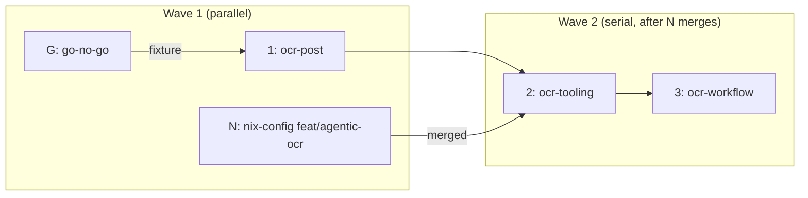

# MIP-0060 tasks

Source: [`MIP-0060-open-code-review-on-ready.md`](./MIP-0060-open-code-review-on-ready.md). Two
repositories: task **N** is a PR in `h0ffmann/nix-config`; tasks 1–3 are the marola stack
(`mip-0060/k-*`). Task **G** is the MIP's §7.1 go/no-go, a measurement, not a PR; its results land
in the MIP's appendix on task 1's branch.

| # | slug | delivers | tests (must exist before the PR) | depends on |
|---|---|---|---|---|
| G | go-no-go | `ocr review` by hand on three merged PRs (Scala, Python/shell, docs-only) against `qwen2.5-coder:7b`, inside ai-jail; wall time, comment count, a preliminary true/false-positive call per comment; one real JSON output kept as a fixture | — (it *is* the test) | – |
| N | nix-config `feat/agentic-ocr` | `labs/agentic`: package `ocr` (pinned, hashed), `jail-run ocr` mode — no `GH_TOKEN`, no `~/.claude` maps, project read-only, one writable output dir; README + `lab.json` | lab `just self-test` (token absent from the `jail-run ocr` sandbox line; `ocr version`), `nix flake check` | – |
| 1 | ocr-post | this file; `scripts/ocr-post.py` (stdlib): validate OCR's JSON, drop findings outside the PR diff, cap inline comments at 15, one `COMMENT` review, sticky summary upsert by `<!-- marola-ocr -->`, `--dry-run` prints instead of posting; fixtures under `scripts/fixtures/ocr/`; wired into `ci.yml` `quality-other`; G's results in the MIP appendix | `scripts/ocr-post.py --self-test`: out-of-diff dropped, cap honoured, upsert idempotent, malformed JSON → exit 0 + "no review" summary | G (fixture; soft — schema also read from upstream source) |
| 2 | ocr-tooling | `flake.nix`: `agentic` input repointed to `github:h0ffmann/nix-config?dir=labs/agentic` (main, like `lint`) and re-locked; `.opencodereview/` config (skip `docs/MIPs/**`, `knowledge/**`, `*.lock`, generated manifests); `scripts/ocr-review.sh` + `just ocr-review [<PR#>\|--from <ref>]` running `jail-run ocr` and piping to `ocr-post.py --dry-run` | `nix develop --command ocr version`; `scripts/ocr-review.sh --self-test`; `just ocr-review --from main` on a real branch | N merged, 1 |
| 3 | ocr-workflow | `.github/workflows/ocr-review.yml` (§5.2: `workflow_dispatch` only, PR resolved and fork/bot refused in a first step, per-PR concurrency, 30 min, `continue-on-error`, kill switch `vars.OCR_REVIEW`, config read from the base ref); `DEV-FLOW.md` §5 gains a fourth on-request route (the rule itself is unchanged); MIP status → Implemented | `actionlint`; throwaway PR: nothing runs until dispatched, dispatch → one review, re-dispatch → summary rewritten not duplicated, Dependabot branch → refused | 2 |

## Dependency graph

Wave 1 runs G, N and 1 in parallel, three worktrees, no shared files. Wave 2 (2, then 3) is serial
and starts once N is merged in nix-config, because task 2 locks the flake input to it.

## Notes

- **Gate.** G can end the stack: fewer than half of the comments useful → stop after task 1 (the
  poster is cheap and reusable), flip the MIP to `park`, close N or leave it as a generic tool.
- **Restack risk.** Only `justfile` and `ci.yml` are touched by more than one task (1: a
  `quality-other` step; 2: a recipe; 3: nothing in `ci.yml`). Different hunks; no reorder needed.
- **Hosted LLM (§5.5)** is not in this stack. It needs its own go-ahead with a measured per-PR cost.
