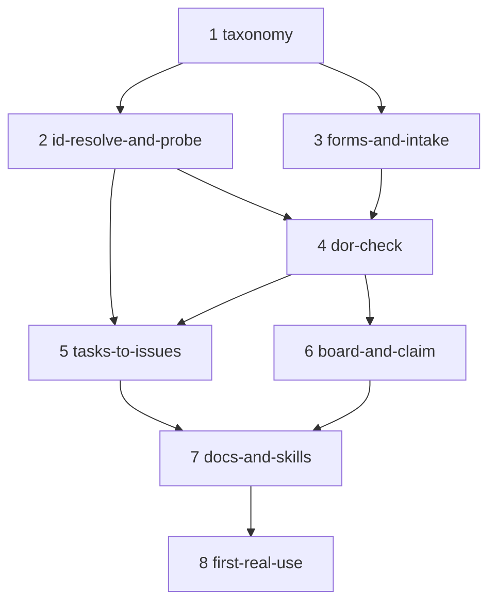

# MIP-0063 tasks

Ordered delivery of [MIP-0063](./MIP-0063-github-issue-tracking-standard.md) as stacked PRs
(`.claude/skills/mip-tasks/SKILL.md`, `scripts/stack.sh`). Branch `mip-0063/<k>-<slug>`, each based
on the previous; merge bottom-up, `scripts/stack.sh restack` after each squash-merge.

**Filed as issues 2026-09-27** ([milestone: Issue tracking standard live](https://github.com/h0ffmann/marola/milestone/1)).
Each `#` below links to its issue; the dependency edges in the last column are wired as native
GitHub `blocked by` relationships, so the ready set is computed rather than read off this table.
Right now that set is exactly **#414 (task 1)** — everything else is blocked. The run was done by
hand, since `tasks-to-issues` is task 5; what it found is in the MIP's Appendix.

**Scope is v1 as the MIP defines it**: the standard, the GitHub objects, the agent command surface.
CI gates (§11.1) and backfilling the 42 `Draft` MIPs are explicitly *not* in this stack — see
Decisions 4 and 1. Nothing below depends on either.

**Task 2 is the design-risk task and is deliberately early.** The 2026-09-27 run above proved
`blocked by` **between ordinary issues** — the ten edges wiring these eight together are real. What
it did not touch is the case §5.3 leans on hardest: two **sub-issues of the same parent** depending
on each other. Task 2 settles that before tasks 4 and 5 build on it, and Decision 8 says what
happens if GitHub refuses.

| # | slug | delivers | tests (must exist before the PR) | depends on |
|---|---|---|---|---|
| [1](https://github.com/h0ffmann/marola/issues/414) | taxonomy | `.github/labels.yml`, the versioned manifest: the existing labels with their current colours and descriptions, plus `agent-ready`, `size/S`, `size/M`, `size/L` (**created by hand during the 2026-09-27 run**, so `sync` is a no-op for them and the fixture test is what proves the diff logic), minus `layer/azure` (orphaned by 993b469, still present on the repo). `scripts/issues.sh` skeleton — arg parsing, `--dry-run`, `--self-test`, the `gh` guard — with its first subcommand `labels sync`, and `just labels-sync` | `scripts/issues.sh --self-test`: the label diff against a fixture manifest yields the expected adds and the one orphan; a manifest already matching the repo yields an empty diff (idempotence); `sync` without `--prune` never emits a delete. Live: `just labels-sync --dry-run` against the real repo reports only `layer/azure` as orphaned and nothing to add. Added to `quality-other` beside the existing `--self-test` calls | – |
| [2](https://github.com/h0ffmann/marola/issues/415) | id-resolve-and-probe | The single place that maps an issue **number** → **database id**, which both §4.1's `sub_issue_id` and §4.2's `issue_id` need and which silently attaches the wrong issue when skipped. `issues.sh sub add` and `issues.sh deps add/list` on top of it. Then the live probe answering §7 steps 5 and 7: one parent, two sub-issues, a `blocked by` edge **between the two siblings**, read back, probe issues closed afterwards. The result is written into the MIP — §5.3 confirmed and moved from "Not checked" to "Checked live", or Decision 8's fallback applied and §5.3/§8/§5.5 amended in this same PR | `issues.sh --self-test`: number→id resolution against a stubbed payload; the guard that **refuses to POST anything that looks like an issue number where an id is required** fires on a 3-digit value and passes a 9-digit one — the regression test for the trap itself. Live, recorded in the MIP's Appendix with the date: the probe's four calls and their responses, including the sibling-to-sibling edge | 1 |
| [3](https://github.com/h0ffmann/marola/issues/416) | forms-and-intake | The four forms: `bug_report.yml` gains **Failing test** (the repo already requires reproducing a bug with a failing test); new `task.yml`; `story.yml` replacing `feature_request.yml`; `mip_proposal.yml` updated to say what happens next. `config.yml` points questions at Discussions. `docs/3-Working-on-the-repo/ISSUE-FLOW.md` created with the object model and the three tiers — the intake half only; the command reference arrives in task 7 | `issues.sh --self-test`: every form's field labels are asserted equal to the exact heading spellings the readiness check greps for (`### Acceptance criteria`, `### Named test`, …), so a reworded label fails the build instead of silently breaking task 4. This is the contract §4.5 rests on and the only thing holding the two halves together. Live: open each form in the browser once and confirm the rendered body's `###` headings match | 1 |
| [4](https://github.com/h0ffmann/marola/issues/417) | dor-check | `issues.sh ready` — the five rules of §5.4, with rule 5 reading `dependencies/blocked_by` from the API rather than a label — and `issues.sh queue`; `just issue-ready`, `just issue-queue`. Output shape is §3's, naming the rule that failed | `issues.sh --self-test`: one fixture body per failing rule (no criteria, no named test, no `area/`+`layer/`, no `size/`, an open blocked-by) plus the all-pass case; asserts `agent-ready` is added only on all-pass, **removed** when a previously-ready issue regresses, and that the failing rule is named in the output. A blocked-by that is *closed* does not block | 2, 3 |
| [5](https://github.com/h0ffmann/marola/issues/418) | tasks-to-issues | `scripts/lib/tasks_issues.py` — parses marola's **table** format (`\| # \| slug \| delivers \| tests \| depends on \|`), dedup regex, row→issue-link rewrite on the `#` cell — and `issues.sh tasks-to-issues`, which files a MIP's task rows into a named milestone and wires each `blocked by` edge from the **`depends on` column**, which is a DAG. Never draws an edge by hand. **Not** the checkbox rewrite the MIP first described: no marola tasks file has ever used checkboxes | `scripts/lib/tasks_issues.py --self-test`: `\b0063-T\d+\b` matches `0063-T001`, `[0063-T1]`, `0063-T1:` and does **not** match `S0063-T1` or `0063-T0010`; the row rewrite is idempotent on an already-linked `#` cell; the `depends on` column parses `–`, `—`, `1` and `5, 6`, and a non-linear graph round-trips (MIP-0034's `6 ← 1`, MIP-0031's three roots). Live: `just tasks-to-issues MIP-0060 --dry-run` inspected, then re-run against **this** file — it must create zero issues and rewrite zero rows, since the 2026-09-27 hand run already filed them | 2, 4 |
| [6](https://github.com/h0ffmann/marola/issues/419) | board-and-claim | `issues.sh claim` (assign, drop `agent-ready`, set board Status, print the `scripts/stack.sh start` line), `issues.sh milestone new`, `issues.sh board sync`; the three `just` recipes. The project itself: `Status` single-select and the four views of §5.2, plus the five phase gate issues of §5.3 named from `ARCHITECTURE.md` §11, with `phase/*` labels | `issues.sh --self-test`: the claim transition against a stub — assign, label dropped, Status set, and the refusal to claim an issue that is not `agent-ready`. Live, after the human grants scope: `just board-sync` adds the open issues and sets Status from state; one `phase/2` issue shows **Blocked** on the board while its gate issue is open, and stops when the gate is closed | 4 |
| [7](https://github.com/h0ffmann/marola/issues/420) | docs-and-skills | `AGENTS.md`: the new hard rule (an agent may only begin work on an `agent-ready` issue) and the `ISSUE-FLOW.md` row in the docs table. `CONTRIBUTING.md`: the three tiers, and a **Find something to work on** section a stranger can act on without reading `AGENTS.md`. `DEV-FLOW.md` §1 gains the issue step ahead of the MIP step, §8 the six recipes. `docs/3-Working-on-the-repo/ISSUE-FLOW.md` completed with the command reference. `.claude/skills/triage/SKILL.md`, human-invoked per Decision 2. `mip-tasks` gains its `tasks-to-issues` final step | `just quality-other` green; `scripts/build_docs_index.py` picks up `ISSUE-FLOW.md` and `docs/README.md`'s generated index is not stale; every `docs/*.md` link added resolves | 5, 6 |
| [8](https://github.com/h0ffmann/marola/issues/421) | first-real-use | §7 step 6, on real debt rather than a fixture: file `docs/4-Research-and-plans/ROADMAP.md` §2a's five still-open findings (`stop-gate.sh` untracked files, `stop-gate.sh` read-only exit code, `format.sh` offline hard-fail, `mip-reviewer`'s unlisted `git rev-parse`, the §7→§8 pointer sweep) plus the `cost-fill.sh` git-version bug found opening PR #413, as Tier-1 issues through `triage`. `ROADMAP.md` §2a's **State** column is replaced by links to them, so the file stops being a tracker | Each of the six passes `just issue-ready <n>` without hand-editing; `just issue-queue` returns them sorted; `ROADMAP.md` §2a contains no state that is not a link. This is the acceptance test for the whole stack: the standard is used by the standard's own first contributor | 7 |

Task DAG, edges exactly equal to the `depends on` column above:

## Decisions

Taken so the tasks above are unambiguous. 1–3 and 5–6 come from the maintainer's review of PR #413.

1. **The board starts empty.** No backfill of the 42 `Draft` MIPs in this stack, retroactive or
   otherwise. Consolidation happens once the standard has been validated in use, as its own change.
2. **`triage` is human-invoked.** No label, webhook or schedule may start it. `AGENTS.md`'s
   human-confirmation gate for proactive agent behaviour is not lifted by this MIP.
3. **Dependencies are tracked at every level**, between issues and between sub-issues, and are
   always derived from the **`depends on` column** of `tasks.md` — never drawn by hand, and never
   inferred from task numbering. That column is a DAG: MIP-0034 has `6 ← 1`, MIP-0031 has three
   roots and two parallel branches, MIP-0056 has `7 ← 4`. This file has `2, 3 ← 1` and `6 ← 4`.
4. **CI gates are not in this stack.** §11.1's open question (what evidence earns enforcement) is
   left open on purpose and no task waits on it. v1 makes the standard checkable, not unavoidable.
5. **`docs/4-Research-and-plans/ROADMAP.md` keeps its narrative.** Only §2a's tracker table is replaced, in task 8.
   §11.2's long-term question — whether the project and its milestones become the roadmap's source
   of truth — stays open and is not answered here.
6. **No deliverable milestones are invented by this stack.** Task 6 creates only the five phase
   gate issues, whose names come from `ARCHITECTURE.md` §11. The maintainer names the deliverable
   milestones when the first ones are cut; §5.1's three examples are illustrations.
7. **`layer/azure` is deleted in task 1**, not deprecated. 993b469 removed Azure.
8. **If task 2's probe shows GitHub refuses a dependency between two sub-issues of the same
   parent**, §5.3 falls back to edges between issues only, sub-issue ordering returns to whoever
   owns the story, and tasks 4 and 5 drop the sub-issue edge wiring. Nothing else in the design
   moves, and task 2's own PR carries the amendment. This is the only branch point in the stack.

## Restack notes

- `scripts/issues.sh` is created in task 1 and gains one subcommand family per task (2, 4, 5, 6).
  A single linear line: each task adds, none rewrites an earlier task's subcommand. Reviewing
  bottom-up, each diff is one command surface.
- `docs/3-Working-on-the-repo/ISSUE-FLOW.md` is created in task 3 (intake) and completed in task 7 (commands). The split
  follows the skill's "docs travel with the task that changes behaviour": the tier rules ship with
  the forms that implement them, the command reference with the commands.
- `.github/labels.yml` is touched by task 1 and, for the five `phase/*` labels its gate issues
  need, by task 6 — the manifest is the only place a label may be defined (§5.2), so a task that
  needs one adds it there rather than creating it by hand. `AGENTS.md`, `CONTRIBUTING.md` and
  `DEV-FLOW.md` only by task 7.
- Two tasks need a human action before their live check, neither blocking the PR itself: task 3
  needs Discussions enabled, task 6 needs `gh auth refresh -s project` on the host. Both are named
  in `AGENTS.md`'s cost-and-deployment rule spirit — an agent does not widen its own token's scope.

## Sequencing note

Tasks 3 and 2 are independent of each other (forms vs. API), and 3 could be built first or in
parallel. It is stacked second-to-fourth anyway because task 4 needs both, and a linear stack is
cheaper to review and restack than a fork. If task 2's probe drags, task 3 can be lifted to run
against task 1 directly without touching any other row.
