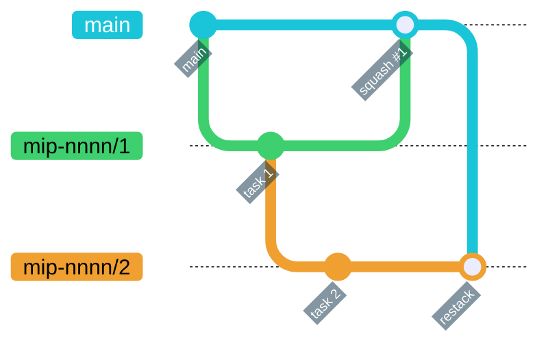
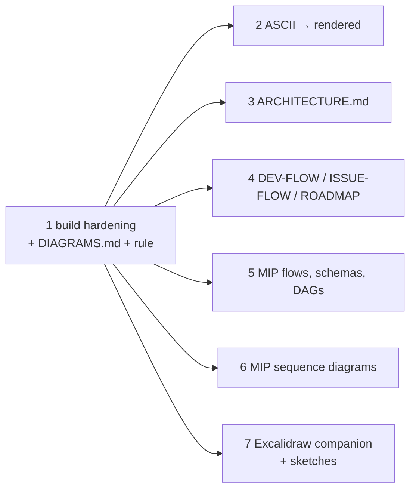

# MIP-0068: Diagrams in the docs — Mermaid by default, Kroki's other dialects where they earn it

| | |
|---|---|
| **Status** | Implemented — PRs #510 (task 1), #514–#519 (tasks 2–7, unstacked, all off task 1), #520 (#511, the Mermaid font pin found in task 1's review); merged 2026-09-30. Tasks: [`MIP-0068.tasks.md`](./MIP-0068.tasks.md). All seven §5.3 groups drawn; task 7's three sketches kept |
| **Author** | Claude (Opus 5.5), with Bruno |
| **Created** | 2026-09-29 |
| **Phase** | 3 — docs only, on the mkdocs/Kroki build MIP-0064 already shipped; no Phase 1 or Phase 2 prerequisite, no cloud spend |
| **Related** | MIP-0064 (the Kroki build this uses), MIP-0065 (`CI-CD.md`, the first page drawn this way), MIP-0063 (issues and milestone for the tasks) |
| **Effort** | M — one config hardening plus a companion container, then ~40 diagrams across ~25 existing pages; no Scala, no new script |
| **Gain** | `infra/dev-loop` — the stack, issue and MIP lifecycles and the module boundaries become pictures, not paragraphs; `user value` — ARCHITECTURE.md and the map MIPs read faster for a newcomer |
| **Effort vs Gain** | cheap win — the renderer is already running in CI; only the diagrams are missing |
| **Depends on** | MIP-0064 (implemented), whose `mkdocs/` stack and `scripts/mkdocs.sh --self-test` this edits. No Phase 1 gate, no paid resource |
| **Blocked by** | none |
| **Risk** | Diagrams drift from the prose beside them. A picture of the RAG abstain rule that is wrong reads as more authoritative than the paragraph it replaced |
| **Cost so far** | ~$46.39 excluding task 7 — design #500 $15.44, #510 $4.90, #514 $3.60, #515 $2.69, #516 $2.63, #517 $6.61, #518 $4.74, #520 $5.78 (summed `Cost:` trailers, mostly `est.`: seven parallel subagents in one session make the time split meaningless). #519's trailer reads ~$138.85 est., an artefact of the diff-size model counting ~4,300 lines of `.excalidraw` scene JSON; its real share is in the same range as the others |

## 1. Summary

MIP-0064 put a self-hosted Kroki behind the docs site, and five Mermaid diagrams use it
(`CI-CD.md` ×2, `ARCHITECTURE.md`, `MIPs/README.md`, the generated MIP graph). Everything else is
still arrow chains in prose, a handful of box-drawing sketches that render as monospace text, and
lifecycles described in numbered lists. This MIP sets the rules for which Kroki dialect to use,
hardens the plugin config so a bad diagram cannot ship, makes the site dark-only with diagrams
styled for it, adds the Excalidraw companion once a sketch needs it, and converts the strongest ~40 candidates from an inventory of all 105
pages under `docs/`.

## 2. Motivation

An inventory of every `.md` under `docs/` on 2026-09-29 (two read-only sweeps, guides and MIPs)
found:

- **Diagrams that are already diagrams, unrendered.** `MIPs/MIP-0060.tasks.md:16-22` is a
  box-drawing dependency graph; `4-Research-and-plans/AGENT-STACK-SURVEY.md:117-130` is box art
  whose right edge at line 124 is already misaligned; `3-Working-on-the-repo/AGENT-SKILLS.md:59-89`
  and `4-Research-and-plans/AGENT-FRAMEWORKS-SURVEY.md:67-76` are session and actor topologies in
  bare fences, the second with no arrows at all.
- **Lifecycles in prose.** The MIP status lifecycle (`DEV-FLOW.md:48-51`, `.claude/rules/docs.md`),
  the issue Definition of Ready and board Status (`ISSUE-FLOW.md:35-75`, `MIP-0063` §5.2), and
  stacked-PR restacking (`DEV-FLOW.md:69-110`) are the three mechanics people ask about most, and
  each is spread over several paragraphs.
- **Structure a tree can't show.** `ARCHITECTURE.md:51-104` lists the modules as a file tree, but
  the point of the split is the dependency direction (core traits ← local implementations, `cli`
  wires both), which a tree has no way to draw.
- **Task DAGs hidden in a column.** `MIP-0056.tasks.md:27` says "1 → 2 → 3 → 4 → 5 is the critical
  path … 7 forks from 4, 8 needs 6"; `MIP-0065.tasks.md` says the stack order and the real graph
  differ. MIP-0063 itself argues the `depends on` column "is a DAG, not a chain".

**The diagrams already there are hard to read.** On the site's dark (slate) palette the existing
Mermaid diagrams show as boxes with almost invisible arrows (maintainer review, #500). The cause is
in the generated SVG: Kroki renders Mermaid's default light theme, `.flowchart-link{stroke:#333333}`
and marker fill `#333333` on `background-color:transparent`, so dark-grey lines sit on a dark page.
Nothing in the build styles diagrams for the theme they are shown on.

The build also claims every Kroki dialect with a plain fence, including three whose companion
servers do not run (§4.2), so adding diagrams at scale is unsafe until that is closed.

## 3. User-visible change

Before, `DEV-FLOW.md` opens with:

```
Issue → MIP (Draft) → acceptance → task list → stacked PRs → review → merge/restack → finish
```

After, the same page opens with a rendered flowchart, and its stacking section carries:



A contributor writing a new page or MIP finds one short section on which fence to use, and
`3-Working-on-the-repo/DIAGRAMS.md` shows one rendered example of every dialect the build
accepts. A fence the build does not serve (` ```bpmn `) fails `just docs` with Kroki's message,
instead of shipping a red error box to marola.dev.

## 4. Data sources and dependencies reviewed

No new data source. The dependencies are the ones MIP-0064 pinned, read at their pinned versions.

### 4.1 Kroki 0.32.1 and its companions

The core `yuzutech/kroki` image serves, among others, D2, GraphViz, PlantUML with C4, Structurizr,
Vega/Vega-Lite, DBML, Erd, Nomnoml, WaveDrom, Svgbob, Pikchr, and the blockdiag family. Mermaid,
BPMN, Excalidraw and diagrams.net each need a companion container: `yuzutech/kroki-mermaid`,
`-bpmn`, `-excalidraw`, `-diagramsnet`. Kroki finds them through `KROKI_<NAME>_HOST`/`_PORT`
(Excalidraw: `KROKI_EXCALIDRAW_HOST`, default port 8004). `mkdocs/docker-compose.yml` runs only
the Mermaid companion today.

The companion images exist at the pinned tag: `kroki-excalidraw:0.32.1` is 612 MB compressed,
`kroki-bpmn:0.32.1` 460 MB, `kroki-mermaid:0.32.1` 464 MB. `kroki-mermaid` 0.32.1 bundles
Mermaid 11.16.0, which has `gitGraph`, `stateDiagram-v2`, `erDiagram`, `classDiagram`, `gantt`,
`timeline` and `mindmap`.

### 4.2 mkdocs-kroki-plugin 1.7.0

Read from the published wheel:

- `enable_bpmn`, `enable_excalidraw` and `enable_mermaid` default to `true`; `enable_diagramsnet`
  defaults to `false`. With `fence_prefix: ""` (MIP-0064's choice, so plain ` ```mermaid ` renders
  on GitHub too), a ` ```bpmn ` or ` ```excalidraw ` fence is claimed by the plugin today and sent
  to a Kroki that cannot render it.
- `fail_fast` defaults to `false`. A render error is logged at ERROR through
  `mkdocs.plugins.get_plugin_logger` and the page gets an inline `<details>` error block. Under
  `strict: true` the logged error should still fail the build at the end. That is read from the
  source, not run: §7 makes it a test.
- `@from_file:<path>` as a fence body loads the diagram source from a file relative to
  `docs_dir`. This keeps an `.excalidraw` scene (JSON) out of the Markdown and editable in the
  Excalidraw app.
- `styles` injects one set of colours (box, text, line, background) into every diagram's
  source before rendering; `styles_light`/`styles_dark` render each diagram twice and emit
  Material's `#only-light`/`#only-dark` pair. Both need `tag_format: img` (the default, which
  marola uses). Style injection covers mermaid, plantuml, c4plantuml, graphviz, d2, nomnoml, structurizr and
  blockdiag. It does not cover dbml, vegalite or excalidraw.

### 4.3 GitHub's Markdown renderer

GitHub renders four diagram fences: `mermaid`, `geojson`, `topojson` and `stl`. Every other
Kroki dialect shows as source on github.com. The site, not GitHub, is where the docs are read
(maintainer review, #500), so this is a tiebreaker between two equally good dialects, not a
reason to force a picture into Mermaid.

**Scope.** Only pages mkdocs renders. `docs/benchmarks/` and `docs/superpowers/` are in
`exclude_docs` (`mkdocs.yml:28`) and are out of scope.

**Pick:** the dialect best suited to each picture. In practice that is Mermaid for most flows,
lifecycles, sequences and ER models; D2 or C4-PlantUML for layered or zoned architecture; DBML
for schemas; Vega-Lite for charts; Excalidraw for hand-drawn sketches and wireframes. BPMN and
diagrams.net are disabled: nothing in the inventory needs them.

## 5. Design

### 5.1 The dialect rule

Written once, into `.claude/rules/docs.md` (auto-loaded for `docs/**`), and illustrated in the new
`docs/3-Working-on-the-repo/DIAGRAMS.md`:

| Picture | Fence | Why this one |
|---|---|---|
| flow, decision tree, DAG, lifecycle, sequence, ER, class, gantt, git history | `mermaid` | covers most pictures, and also renders on GitHub |
| layered or zoned architecture, the module map | `d2` or `c4plantuml` | nested containers without Mermaid's subgraph crowding |
| a schema from DDL | `dbml` | reads like the SQL it mirrors |
| a chart from a results table | `vegalite` | a real axis and scale, not a table of numbers |
| a sketch or wireframe | `excalidraw` with `@from_file:assets/diagrams/<name>.excalidraw` | hand-drawn is the honest register for a mock, and the scene opens in the Excalidraw app as a whiteboard and comes back as the same file |

Two more rules come with it. Draw only a picture the prose beside it already states, and keep
that prose: the diagram is the summary, the text is the source of truth. Keep a diagram under
about 15 nodes, and split it rather than grow it.

### 5.2 Build hardening (`mkdocs/mkdocs.yml`, `mkdocs/docker-compose.yml`, `scripts/mkdocs.sh`, `docs/assets/marola.css`)

```yaml
  - kroki:
      server_url: http://kroki:8000
      fence_prefix: ""
      http_method: POST
      fail_fast: true
      enable_bpmn: false
      enable_diagramsnet: false   # already the default; stated so the self-test can assert it
      styles: { ... }             # marola.css's cyan on slate: lines, text, box strokes
```

`fail_fast: true` turns a broken diagram into a failed build naming the page, instead of relying
on `strict` counting a plugin ERROR log. `enable_bpmn: false` hands a ` ```bpmn ` fence back to
Markdown as a code block, so it cannot render as an error. `scripts/mkdocs.sh --self-test` gains
one assertion per key, next to its existing `fence_prefix` check.

**Dark only.** `theme.palette` drops its `default` (light) entry and its toggle and keeps `slate`,
so there is one theme to style for: one `styles` block, one render per diagram, and nothing
to check twice. `marola.css`'s `[data-md-color-scheme="default"]` block goes with it. For the
dialects style injection skips (dbml, vegalite, excalidraw), `marola.css` gives the image a light
card background, so it stays legible. As built (task 1): the fence carries `{bg-dark=white}`, which
the plugin writes as an inline background that `marola.css` pads into a card, since the SVG file
names cannot tell dialects apart. C4 relationships and Mermaid `gitGraph` need one line of their
own each; `DIAGRAMS.md` carries both. The five existing diagrams are re-rendered by the same
change and checked in §7 step 4.

Task 7, and only if §5.3's Excalidraw cases hold up, adds the companion to the compose stack,
pinned and health-checked like `mermaid`:

```yaml
  excalidraw:
    image: yuzutech/kroki-excalidraw:0.32.1
    healthcheck: { test: ["CMD", "nc", "-z", "localhost", "8004"], ... }
  kroki:
    environment:
      - KROKI_MERMAID_HOST=mermaid
      - KROKI_EXCALIDRAW_HOST=excalidraw
```

### 5.3 The conversion set

Only the inventory's strong candidates. The medium list stays in the Appendix as the queue for
"draw it when you next touch the page".

- **ASCII to rendered:** `MIP-0060.tasks.md:16-22`, `AGENT-STACK-SURVEY.md:117-130` (d2),
  `AGENT-SKILLS.md:59-89`, `AGENT-FRAMEWORKS-SURVEY.md:67-76`.
- **ARCHITECTURE.md:** the module map from `:51-104` (d2, kept alongside the tree); the six
  integrations `:248-264` (classDiagram); origin resolution `:139-155` (flowchart; also fixes the
  duplicated "4."); DSPy summarize → review `:274-306` and the MCP handshake `:358`
  (sequenceDiagram); water-quality verdicts `:436-455` and RAG strict vs general `:463-478`
  (flowchart). The §3 Telegram diagram at `:221` keeps MCP out on purpose (`:237-243`) and stays
  as it is.
- **Process docs:** `DEV-FLOW.md` opening loop (flowchart), MIP lifecycle (stateDiagram-v2),
  stacking and restacking (gitGraph); `ISSUE-FLOW.md` object model (erDiagram) and readiness and
  board Status (stateDiagram-v2, transitions labelled with the `just` command); `ROADMAP.md`
  ordering with the MIP-0002 gate (flowchart).
- **MIPs:** MIP-0056 pipeline (flowchart) and schema (dbml); MIP-0063 §5.2 board Status and §5.5
  direction of truth; MIP-0065 §3 before/after; MIP-0025 §5 train-and-export pipeline; MIP-0039
  §5.2 mode × severity; MIP-0036 §5.1 launch schedule (gantt). Sequence diagrams for the
  multi-actor flows: MIP-0060 §5.2 (who holds the token), MIP-0042 §5.3 (with the fallback as an
  `alt`), MIP-0006 §5.2, MIP-0015 §5, MIP-0020 §5.5, MIP-0035 §5, MIP-0008 §5.5. Task DAGs for
  MIP-0056, 0063, 0065 and 0025 `.tasks.md`.
- **Excalidraw:** only where a sketch is the best picture, never to have the dialect. The
  cases so far: the MIP-0016 coastline-offset geometry (`:61`, `:113`), the MIP-0042 v1/v2 mocks
  (`:53`, `:61`), the MIP-0054 toolbar mock (`:55`). If review of task 7 finds none of them better
  as a sketch than as the ASCII it replaces, task 7 is dropped and the companion never lands.

Editing an Implemented MIP to add a diagram of what it already says does not change its status.
A diagram that contradicts its MIP is a finding for the MIP author, not a silent fix.

### 5.4 The `mip` skill

`.claude/skills/mip/SKILL.md`'s template gains one line under §5: "a flow, lifecycle, schema or
multi-actor exchange gets a diagram (`.claude/rules/docs.md` §Diagrams)". New MIPs then start
with a diagram, rather than waiting for a later conversion pass.

### 5.5 Task order



Nothing in 2–7 shares a file with another task, so after task 1 they can go in parallel.

Nothing here is deterministic scoring logic and nothing goes through an LLM.

## 6. Scoring / safety impact

None. The water-quality and RAG diagrams (§5.3) draw rules `Swimability` and `OceanQa` already
implement. They are checked against `core/` source in review, and the code stays authoritative.

## 7. Verification plan

1. **Fail-fast holds.** On a scratch branch, add a ` ```mermaid ` fence with a syntax error, then
   run `just docs`. It must exit non-zero and name the page. Then a ` ```bpmn ` fence: it must
   render as a plain code block, not as an error. Record both outputs in task 1's PR.
2. **Self-test.** `scripts/mkdocs.sh --self-test` asserts `fail_fast: true`,
   `enable_bpmn: false` and `enable_diagramsnet: false`, and fails if any key is removed.
3. **Every dialect renders.** `DIAGRAMS.md` holds one example each of mermaid, d2, c4plantuml,
   dbml and vegalite; task 7 adds excalidraw. With `fail_fast`, `just docs` passing is the render
   check for all of them.
4. **Legible on slate.** Screenshot `CI-CD.md`, `DIAGRAMS.md`, `ARCHITECTURE.md` and
   `MIPs/README.md` with `just docs-serve` and attach them to the PR. Every arrow and label must
   be readable at normal zoom; one that is not fails the task. Each later task attaches the same
   for the pages it touched.
5. **GitHub, best effort.** A Mermaid fence that GitHub's renderer rejects (its Mermaid version
   lags Kroki's) is noted in the PR. It is not simplified to suit GitHub unless that costs the
   site nothing.
6. **Gates.** `just quality` (the pre-push hook) and `ci.yml`'s docs job are green on every task
   PR.

Done means: all seven tasks merged, every §5.3 item drawn or listed in the PR as dropped with a
reason, and no ` ```text ` or bare fence left in `docs/` that is a diagram.

## 8. Risks, limitations, and honest caveats

- **Drift.** Nothing checks that a diagram matches the code or the prose. The mitigation is
  §5.1's rule (the diagram only summarizes text that stays) and review. A diagram is harder to
  diff than a paragraph.
- **Non-Mermaid dialects are site-only.** Someone reading `ARCHITECTURE.md` on GitHub sees D2
  source for the module map. Accepted: the site is the medium.
- **Excalidraw costs build time.** The companion adds a 612 MB pull to every CI docs build on
  `ubuntu-latest` (free on a public repo, but minutes of wall clock on a cold runner), and a
  scene file is JSON that nobody can review line by line. The PR must carry the rendered image.
- **Dark only removes a choice.** A reader who prefers light pages loses the toggle. Accepted in
  review (#500) to get one theme styled properly instead of two styled halfway. Dialects outside
  style injection get a light card rather than a true dark rendering.
- **`fail_fast` on a flaky Kroki.** A Kroki that is slow to start now fails the build instead of
  shipping error boxes. That is the right trade, and the compose health checks already wait for
  it.

## 9. Alternatives considered

- **Do nothing.** The ASCII keeps misaligning, and lifecycles stay paragraphs. Rejected: the
  renderer already runs on every docs build.
- **Mermaid only.** Simplest, and everything renders on GitHub. It optimises for a medium the
  docs are not mainly read in, and it makes the module map and MIP-0042's two-zone picture
  cramped.
- **Keep both themes, render each diagram twice** (`styles_light`/`styles_dark`). Doubles every
  render and every legibility check, for a light mode nobody asked to keep.
- **Commit rendered SVGs.** This would render on GitHub for every dialect, but it adds a second
  copy that goes stale and a regenerate step. Kroki exists so the source is the only copy.
- **kroki.io instead of self-hosted companions.** No 612 MB pull, but doc content would leave the
  build host, against MIP-0064 §4.3.
- **Generate the task DAGs from `depends on`.** It would be better than drawing them by hand, and
  it is left as a follow-up (§11).

## 11. Open questions

- **The `styles` values**: settled in task 1 — `marola.css`'s slate tokens plus a transparent
  background (`mkdocs/mkdocs.yml`).
- **Follow-up MIP:** generate each `MIP-NNNN.tasks.md` dependency graph from its `depends on`
  column, the same way `scripts/mip_graph.py` generates the MIP graph, so task DAGs cannot drift.
  Needs the next MIP number.

## Appendix

### Checked live

- `mkdocs/mkdocs.yml:56-69` at `69badea`: two palettes, `default` and `slate`, keyed on
  `prefers-color-scheme`, each with a toggle icon. So the site does have a light/dark toggle today.
- A local `scripts/mkdocs.sh` build of `CI-CD.md`, 2026-09-29: the Kroki SVG carries
  `background-color:transparent`, `.flowchart-link{stroke:#333333}` and marker fill `#333333`.

- `https://docs.kroki.io/kroki/setup/install/`, 2026-09-29: the list of core-image dialects, and
  the companion images for Mermaid, BPMN, Excalidraw and diagrams.net.
- `yuzutech/kroki` at tag `v0.32.1`, `docs/modules/setup/pages/configuration.adoc` and
  `examples/kroki-docker-compose.yml`, 2026-09-29: `KROKI_EXCALIDRAW_HOST`, default port 8004, and
  `KROKI_BPMN_HOST` at 8003.
- `yuzutech/kroki` at `v0.32.1`, `mermaid/package.json`, 2026-09-29: `"mermaid": "11.16.0"`.
- Docker Hub `yuzutech/kroki-{excalidraw,bpmn,mermaid}:0.32.1`, 2026-09-29: all present; 611,972,995,
  460,255,274 and 463,852,173 bytes; pushed 2026-08-12.
- `mkdocs_kroki_plugin-1.7.0-py3-none-any.whl` (pip download), 2026-09-29: `config.py` defaults
  (`enable_*`, `fail_fast`, `tag_format`, `styles_light`/`styles_dark`), `render.py`'s
  `_err_response`, `parsing.py`'s `@from_file:`, `styles.py`'s list of injectable types, and
  `logging.py`'s use of `get_plugin_logger`.
- `https://docs.github.com/en/get-started/writing-on-github/working-with-advanced-formatting/creating-diagrams`,
  2026-09-29: `mermaid`, `geojson`, `topojson`, `stl`.

### Not checked

- That `strict: true` fails on the plugin's ERROR log with `fail_fast: false`. This is read from
  the source, not run, and §7 step 1 makes it moot.
- A screenshot of today's diagrams on slate. The illegibility is the maintainer's observation
  (#500) plus the SVG's own CSS, read from a local `scripts/mkdocs.sh` build of `CI-CD.md`.
- GitHub's own Mermaid version, and whether it accepts every construct Mermaid 11.16 does.
- That the Excalidraw companion renders a scene exported by the current Excalidraw app.
- The inventory's line numbers are as of `69badea`; they drift as pages change.

### Medium candidates (the "when you touch it" queue)

`TELEGRAM-SETUP.md:69` polling vs webhook; `RUN-LOCALLY.md:201` chat-widget hops, `:291` site
build, `:368` Dockerfile stages; `GEMINI-CODE-ASSIST.md:44` app install and OAuth;
`EFFECTS-MAP.md:21` module map by effect class (d2); `ARCHITECTURE.md:160` two-lane map vs chat,
`:404` trace waterfall, `:580` phases (timeline); `DEV-FLOW.md:174` deps and mip stacks, `:301`
docs ship chain (extend `CI-CD.md:10`); `FUTURE-WORK.md:30` `ActivityScoring`, `:399` the three
agents; MIP-0003 cache decorator, MIP-0012 `/ask` loop, MIP-0011 hook lifecycle, MIP-0034 feeds,
MIP-0037 service worker, MIP-0038/0040/0062 decision rules, MIP-0051/0057 deployment (C4),
MIP-0055 hybrid retrieval, MIP-0064 its own build, MIP-0029 and MIP-0044 (mindmap), MIP-0052
grid cost (vegalite, borderline).
