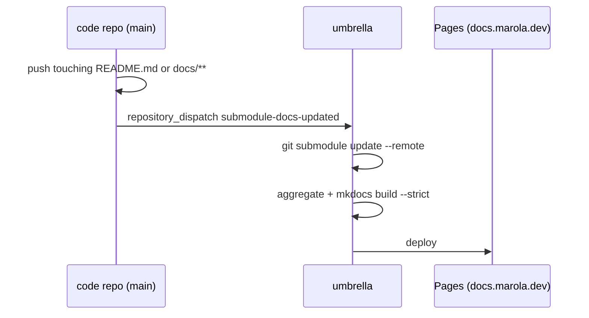

# MIP-0070: Split marola into single-purpose repos under an umbrella

| | |
|---|---|
| **Status** | Draft |
| **Author** | Claude (Opus 5.5), with Bruno, from a brainstorm on 2026-09-30 |
| **Created** | 2026-09-30 |
| **Phase** | Repo structure, orthogonal to `ARCHITECTURE.md` §11: no Phase 1 prerequisite, no runtime change, no paid resource |
| **Related** | `FUTURE-WORK.md` §7 (the earlier split *out of* a shared monorepo), MIP-0056 (OODS, whose code and data this separates), MIP-0063 (issue tracking, which stays in the umbrella), MIP-0064 (the docs site this re-homes), MIP-0065 (the workflows this redistributes), reference: [goflink/dispatching-team](https://github.com/goflink/dispatching-team) |
| **Effort** | XL — five new repos, one tooling repo published three ways (flake, plugin marketplace, reusable workflows), a cross-repo docs aggregator, history-preserving extraction of every directory, and a Pages/DNS move |
| **Gain** | `infra/dev-loop` — each repo builds and gates only its own stack (the site stops compiling Scala, ml stops pulling a JDK); parallel work stops colliding in one tree; `cost/ops` — CI minutes scale with what changed, not with the monorepo |
| **Effort vs Gain** | `do when X lands` — after the in-flight stacks (MIP-0056, MIP-0061, MIP-0063/64/65/68) merge; every open PR against a moved directory has to be recreated otherwise |
| **Depends on** | Coordination, not a merge edge: the MIP-0056 OODS stack (#372–#380) and MIP-0061 (#394/#395) should land first so their history moves with the code. One human-only configuration: a cross-repo credential (GitHub App or fine-grained PAT) for dispatch events and pointer-sync PRs, and one DNS `CNAME` for `docs.marola.dev`. No Phase 1 gate, no paid resource |
| **Blocked by** | none |
| **Risk** | The invariants (cost safety, `agent-ready`, trailers) drift between repos once each has its own AGENTS.md, and an agent in a single-repo clone never sees the umbrella's copy |
| **Cost so far** | — |

## 1. Summary

`marola-dev/marola` becomes an **umbrella**: the team layer (ways of working, MIPs, issues, the
aggregated docs site) with every code repo as a git submodule. Code moves out, with history, into
single-purpose repos split where the stack or the release cadence changes: `marola-app` (Scala),
`marola-site` (the map), `marola-corpus` (knowledge), `marola-ml` (Python), `marola-oods` (data),
plus `marola-devkit` for the shared harness. Every place where one directory reads another's path
today becomes a versioned artifact that the producer publishes and the consumer pins.

## 2. Motivation

One tree forces one build and one set of gates on everything. `site.yml` runs `sbt` to build the
boards, so a CSS change to the map waits on a Scala compile. `docker-local.yml` fires on
`knowledge/**`, `finetune/Modelfile` and `core/src/main/resources/**` at once, and `ci.yml` path-
filters six directories to avoid running everything. Parallel sessions already need a worktree each
(`.tmp/wt-*`, 30+ of them at the time of writing) to stay out of each other's way. OODS will add a
~40 MB data tree that grows ~2 MB/yr per state (MIP-0056 §Risk), with daily bot commits landing in
the same history as the code.

The monorepo's real advantage is that an agent sees everything at once. The umbrella keeps that:
check it out with submodules and the whole workspace is one directory again, with the team rules at
the root and each repo's own rules inside it.

## 3. User-visible change

For a marola user: none. The map stays at `https://marola.dev`; the docs move to
`https://docs.marola.dev`, and `marola.dev/docs/*` redirects there.

For a contributor:

```text
# before                                # after
git clone marola-dev/marola             git clone --recurse-submodules marola-dev/marola   # the workspace
just build && just test                 cd marola-app && just build && just test          # one repo's gates
                                        git clone marola-dev/marola-site                   # or just one repo, standalone
```

## 4. Data sources and dependencies reviewed

### 4.1 The reference umbrella: goflink/dispatching-team

Read through `gh api` on 2026-09-30: `AGENTS.md`, `.gitmodules`, `docs/centralized-docs/repo-guide.md`,
`.github/workflows/{deploy-docs,sync-submodule-pointers}.yml`. What we're adopting from it:

- **Two layers**: the umbrella's AGENTS.md describes itself as "the **team layer** of a two-layer
  harness"; each submodule's AGENTS.md holds "repo-level specifics (build/test/CI, service
  invariants)". The umbrella has no build ("No build at umbrella level").
- **Scope rules**: single-service work happens inside the submodule; cross-service work uses the
  same branch name in each, one PR per submodule, producer first, "Don't bump umbrella submodule
  pointers until all underlying PRs are merged".
- **Docs aggregation**: a repo's `README.md` → `docs/services/<repo>/index.md` and `docs/**`
  below it. Link rules: relative inside `docs/`, absolute GitHub URLs for code.
  `deploy-docs.yml` runs `git submodule update --remote` on every non-PR event, so docs track each
  repo's `main` even with stale pointers, and keeps pinned commits on PRs.
- **Pointer sync**: a daily cron, plus `repository_dispatch: submodule-updated`, feeding one rolling PR.

### 4.2 Distribution channels for the devkit

- **Nix flake inputs**: already how this repo consumes `lint`, `agentic` and `cuda` from
  `h0ffmann/nix-config` (`flake.nix`), pinned by `flake.lock`. No new mechanism.
- **Claude Code plugin marketplace**: a repo with `.claude-plugin/marketplace.json`. A plugin
  `source` can be `github`/`git-subdir`/`url`, and git-based sources can be pinned to a `ref` or
  `sha` (code.claude.com/docs/en/plugin-marketplaces, 2026-09-30). Projects enable plugins in
  `.claude/settings.json` `enabledPlugins`, as this repo already does for `superpowers`.
- **GitHub reusable workflows** (`uses: owner/repo/.github/workflows/x.yml@ref`): not re-checked
  this session (see Not checked).

### 4.3 Moving history and the domain

- `git filter-repo`: `--path` selects a union of paths, `--path-rename` renames them, and
  `--replace-message` takes an expressions file that supports `regex:` (its own documentation,
  2026-09-30). That makes it possible to rewrite a bare `#123` to `marola-dev/marola#123`.
- `repository_dispatch` needs a credential with write access to the *target* repo (classic PAT:
  `repo` scope). The source repo's `GITHUB_TOKEN` cannot do it, hence the human-provisioned
  credential in Depends on.
- GitHub Pages: a subdomain is configured with a DNS `CNAME` record. That a custom domain can be
  attached to only one Pages site is partly checked (§Not checked). It is why the map and the docs
  get separate hosts.

## 5. Design

### 5.1 Three layers

| Layer | Holds | Can a repo override it? |
|---|---|---|
| **Umbrella** (`marola`) | Workspace AGENTS.md, ways of working, MIPs and `.tasks.md`, issues and labels, the aggregated docs site, submodule pointers | — |
| **Devkit** (`marola-devkit`) | The shared harness, versioned: dev-flow scripts, hooks, generic skills and agents, reusable workflows, the base flake and `just` module | Yes: a repo opts into each piece, and its AGENTS.md says what it leaves out or changes |
| **Repo** (each code repo) | Its own AGENTS.md, `docs/`, build/test/gates, repo-only skills and rules | It owns them outright |

**Org invariants are the exception to "the repo wins":** cost and deployment safety, the
`agent-ready` gate, the three commit trailers, no secrets in code, phase discipline. A repo may make
these stricter, never looser.

### 5.2 Repo map

| Repo | Responsibility | From today's tree |
|---|---|---|
| `marola` (umbrella) | Team layer | `PHILOSOPHY.md`, CONTRIBUTING/CoC/SECURITY, `docs/3-*`, `docs/4-*`, `docs/MIPs/`, `mkdocs/`, `.github/labels.yml`, `profile-activity.yml`, `scripts/{repo_stats,arxiv_digest,awesome_agentic_digest,mip_graph}.py` |
| `marola-devkit` | Shared harness | `scripts/{stack,uprd,uprds,pr,cost-fill,branches,issues,pr-label,mip-stack,docs-mip-stack,deps-*}.sh`, `scripts/cost-split.py`, `scripts/lib/`, `.githooks/`, `.claude/hooks/`, generic skills (`mip`, `mip-tasks`, `triage`, `humanizer`, `ponytail*`, `sharingan`, `skill-copy`, `obsidian-vault`, `voice-*`), agents `mip-reviewer`/`mip-claims-auditor`, `ci-short-circuit-pr-close.yml`, `pr-body.yml` |
| `marola-app` | The Scala product and its image | `core/ local/ cli/ project/ build.sbt`, the OODS module (§5.3), `Dockerfile`, `docker-compose.yml`, `ci.yml` (Scala part), `docker*.yml`, `marola-e2e.yml`, `scala-steward.yml`, `.claude/rules/scala.md`, `jar-verifier`, `docs/1-*`, `docs/2-*`, `docs/benchmarks/`, `scripts/benchmark_gate.py` |
| `marola-site` | The static map at `marola.dev` | `site/`, `site.yml`, `site-health.yml`, `scripts/{site_check.js,site_live_check.py,stamp_site_version.sh,site-data-push.sh,strip_external_scripts.py}`, skill `site-frontend` |
| `marola-corpus` | Sourced ocean knowledge | `knowledge/`, skills `corpus-doc`, `eli5` |
| `marola-ml` | Offline Python: DSPy compile, fine-tune, marola-sea | `dspy/ finetune/`, `Dockerfile.local`, `docker-local.yml`, `marola-sea-publish.yml`, `scripts/{analyze_training.py,marola-sea-pull.sh}`, the `cuda` flake input |
| `marola-oods` | The water-quality dataset only | `data/oods/` and its daily-ingest workflow's commits (MIP-0056 §5.4) |

The rest of `scripts/` (`gha-runner.sh`, `setup-runners.sh`, `runner-preflight.sh`,
`workflow_runners.py`, `gh-billing.sh`, `temps.sh`, `smoke_record.py`, `ocr-post.py`, …) is
assigned per file in the task list, by which workflow calls it.

### 5.3 Why OODS is split into code and data

On its stack tip, `oods` is an sbt module with `.dependsOn(local)`, reusing MIP-0031's parsers.
The Scala code isn't published as libraries (a decision of this MIP: publishing `core`/`local`
turns every cross-module change into two PRs and a version bump), so the OODS code stays a module
of `marola-app`. What leaves is the dataset. `marola-app`'s ingest workflow checks out
`marola-oods` and commits there. That keeps the bot commits and the ~40 MB tree out of the code
repo's history and CI.

### 5.4 Contracts: pinned artifacts instead of paths

```mermaid
flowchart LR
  devkit[marola-devkit] -. flake / plugin / workflows .-> app & site & corpus & ml
  corpus[marola-corpus] -- tagged tarball --> app[marola-app]
  corpus -- tagged tarball --> ml[marola-ml]
  ml -- compiled prompt, bump PR --> app
  app -- image tag --> site[marola-site]
  app -- image --benchmark --> ml
  app -- ingest commits --> oods[marola-oods]
  oods -- export tag --> app
```

| Producer → consumer | Artifact | Pinned by |
|---|---|---|
| app → site | `ghcr.io/marola-dev/marola:<tag>`. The site's CI runs it with `--site`, and it ships `board.schema.json` (the producer owns the schema) | Image tag in `site.yml`. The site never builds Scala |
| corpus → app, ml | A release tarball of `knowledge/*.md` | Tag, fetched at image build into `MAROLA_KNOWLEDGE_DIR` (already an env var in `AppConfig`) |
| ml → app | The compiled-prompt JSON (a bot PR into `core/src/main/resources`), and the model name/tag on HF/Ollama | The file in app resources; the model is config |
| app → ml | The benchmark runner | ml's gate runs the app image with `--benchmark` |
| oods → app | The export MIP-0056 §5.5 plans | Tag plus its env var |
| every repo → umbrella docs | `README.md` + `docs/` | Pulled by the aggregator (§5.5) |

Rule: no repo reads another repo's tree at build time, and no consumer's CI builds its producer
from source.

### 5.5 Docs: per repo, aggregated and hosted by the umbrella



- **Each repo** has `README.md` + `docs/`, a small `mkdocs.yml` and `just docs-serve` (from the
  devkit), and builds `--strict` standalone. Links: relative inside `docs/`, GitHub URLs for code,
  absolute `docs.marola.dev` URLs for another repo's pages. `notify-umbrella.yml` is a reusable
  devkit workflow, about three lines per repo.
- **Generated API docs** (Scaladoc, pdoc) are built by the producing repo's CI and published as an
  artifact (a release asset or its own `api-docs` branch). The umbrella fetches them and never
  builds Scala or Python.
- **The umbrella** has its own `docs/`, plus `mkdocs/repos.yml` mapping each submodule to a mount
  point (default `repos/<name>/`; the app's `1-Using-marola` mounts top-level). It triggers on
  dispatch, on pushes to its own `docs/`, on a daily cron and manually. Non-PR builds use
  `--remote`; PR builds use pinned commits.
- **Domains**: the umbrella's Pages serves `docs.marola.dev`, and `marola-site`'s Pages keeps
  `marola.dev`, with a `404.html` that sends `/docs/*` to the new host. Docs and map deploy
  independently, in both directions.

### 5.6 AGENTS.md per layer

- **Umbrella**: the workspace file, not a service file. It holds the repo inventory (responsibility,
  stack, contracts in and out); the scope rules (single-repo: read that repo's AGENTS.md first;
  cross-repo: plan the contract, same branch name, one PR per repo linked, producer merges first,
  pointers bump last); the invariants in full; the MIP and issue flow; and submodule mechanics.
- **Each repo**: what it is, what it produces and consumes, its commands, style and testing, and
  what it overrides from the devkit defaults. It also carries an **invariants block** (one line per
  rule plus a link to the umbrella), because a plain-text agent in a single-repo clone can't follow
  an `@import` across repos. `just agents-check`, run in each repo's CI through the reusable
  workflow, fails when the block differs from the umbrella's copy.
- **Devkit changes**: a `.tasks.md` row names its target repo, and `stack.sh`/`mip-tasks` stack
  within that repo. `cost-split` attributes by commit across repos. `issues.sh` always targets
  `marola-dev/marola`.

### 5.7 Migration order

Each step is proved while the rest is still in one repo.

0. **Freeze**: land or park the open stacks. A PR open against a moved directory is recreated in
   its new repo.
1. **`marola-devkit`**: extract it with history, then switch *this* repo to the flake input, the
   plugin and the reusable workflows. This proves all three channels before a second code repo exists.
2. **`marola-corpus`, `marola-ml`**: the leaves, with the fewest inbound dependencies.
3. **`marola-site`**: boards from the app image, then Pages and `CNAME` move, then the `/docs/*` redirect.
4. **`marola-app` + `marola-oods`**: the remaining code leaves, and `marola` is the umbrella alone.
5. **Umbrella wiring**: submodules, the workspace AGENTS.md, the docs aggregator on
   `docs.marola.dev`, and pointer sync.

Every extraction uses `git filter-repo --path … --replace-message` (bare `#N` →
`marola-dev/marola#N`). Issues stay in the umbrella. Secrets move with their workflow (`HF_TOKEN` →
ml, `STEWARD_GH_TOKEN` → app).

## 6. Scoring / safety impact

None. No Scala in `scoring/` changes. The safety rules become org invariants that every repo
restates and `agents-check` enforces.

## 7. Verification plan

- **Per extraction**: in the new repo, `git log --follow` on a moved file shows its pre-split
  history. Its gates pass from a fresh clone, with no umbrella, in `nix develop`. The monorepo's
  `just build && just test && just quality` still passes with the directory removed.
- **Devkit (step 1)**: in this repo, `just pr` on a throwaway branch fills the trailers through the
  flake-provided scripts. `/mip` resolves from the plugin, not from `.claude/skills/`. `ci.yml` runs
  through the reusable workflow. All three pass before step 2 starts.
- **Contracts**: `marola-site`'s CI builds boards from a pinned app image, with no `sbt` in its log.
  Changing the corpus tag changes the app image's `knowledge/`. A `board.schema.json` change on the
  app side fails the site's validation until the site bumps the tag.
- **Docs**: a push to `marola-app/docs/` redeploys `docs.marola.dev` within one workflow run, with
  no site deploy. `marola.dev/docs/1-Using-marola/RUN-LOCALLY/` lands on the new host. The
  aggregated build is `--strict`-clean.
- **Invariants**: editing one repo's invariants block fails its `agents-check`.
- **Done** means the monorepo holds no code directories, every repo passes its gates standalone,
  and a fresh `--recurse-submodules` clone lets an agent reach every repo's AGENTS.md from the root.

## 8. Risks, limitations, and honest caveats

- **Cross-repo changes cost more.** A board-schema change is now two PRs and an image tag bump.
  This is the price of choosing stack-and-lifecycle boundaries; the Scala modules stayed together
  precisely to avoid paying it on every core change.
- **Submodules are awkward**: detached HEAD, pointer noise, `--recurse-submodules` forgotten.
  The umbrella AGENTS.md states the mechanics, and pointer bumps come only from the rolling sync PR.
- **The invariants block is a copy.** `agents-check` keeps it from drifting, but it can't make an
  agent that ignores AGENTS.md read it.
- **Old links**: GitHub links into moved paths (`marola-dev/marola/blob/main/core/...`) break.
  The redirect covers the docs site only.
- **One credential is a single point of failure** for dispatch and pointer sync. The daily cron
  still rebuilds the docs if dispatch fails.

## 9. Alternatives considered

- **Do nothing.** It keeps the one-tree agent context, which the umbrella now provides, and keeps
  every cost in §2.
- **Full modularity** (`core`/`local` as published libraries with semver). This is the most SRP-pure
  option, but every cross-module change would take two PRs and a release. It was rejected in the
  brainstorm and can be revisited per module later.
- **Keep `marola-dev/marola` as the Scala app, with a new umbrella repo.** Issues, MIP history and
  every `#N` reference would have to be transferred or left pointing at a code repo.
- **Require the umbrella for shared tooling** (`../devkit/scripts`). A single-repo clone couldn't
  run `just pr`, and CI would check the devkit out on every run.
- **Vendor devkit files into each repo with a sync bot.** This is the copy-and-drift model
  `FUTURE-WORK.md` §7 already hit, and local overrides get overwritten.
- **The umbrella owns `marola.dev` and pulls in the site's `dist/`.** URLs would be unchanged, but
  every map deploy would go through the docs pipeline.

## 11. Open questions

- The cross-repo credential: a GitHub App (scoped per repo, no expiry to rotate) or a fine-grained
  PAT? A human creates either one.
- The final repo names (`marola-app` vs `marola-engine`, and so on) before any extraction runs.
- Do repo-specific issues (e.g. the site's) ever move out of the umbrella, or does MIP-0063 stay
  single-repo for good?
- **Follow-up MIP:** umbrella-level orchestration (`just up` over each repo's compose file) and
  cross-repo flow tests (board → rendered map). Out of scope here; it needs the next MIP number.

## Appendix

### Checked live

- `gh api repos/goflink/dispatching-team/...` (2026-09-30): `AGENTS.md`, `.gitmodules`,
  `docs/centralized-docs/repo-guide.md`, `deploy-docs.yml`, `sync-submodule-pointers.yml`, all read.
- https://code.claude.com/docs/en/plugin-marketplaces (2026-09-30): `.claude-plugin/marketplace.json`;
  `github`/`git-subdir`/`url` sources; `ref`/`sha` pinning for git sources.
- https://docs.github.com/en/rest/repos/repos#create-a-repository-dispatch-event (2026-09-30): classic
  PATs need `repo` scope; the page doesn't address cross-repo `GITHUB_TOKEN` use.
- git-filter-repo `Documentation/git-filter-repo.txt` (2026-09-30): `--path`, `--path-rename`,
  `--replace-message` with `literal:`/`glob:`/`regex:`.
- https://docs.github.com/en/pages/configuring-a-custom-domain-for-your-github-pages-site/about-custom-domains-and-github-pages
  (2026-09-30): subdomains use a `CNAME` record.
- This repo, `origin/mip-0056/11-raw-offload` (2026-09-30): `lazy val oods … .dependsOn(local)`,
  `duckdb_jdbc`; 78 files, +12,807 lines against `main`.

### Not checked

- That GitHub Pages refuses the same custom domain on two repos. The page fetched states only the
  user/org-site inheritance rule. Separate hosts sidestep the question.
- Reusable-workflow syntax and its limits (nesting depth, secrets inheritance): from memory.
- Whether a repo's `GITHUB_TOKEN` can dispatch to a sibling repo: assumed not, so we budget a credential.
- The ~2 MB/yr/state growth figure: repeated from MIP-0056, not re-measured.
