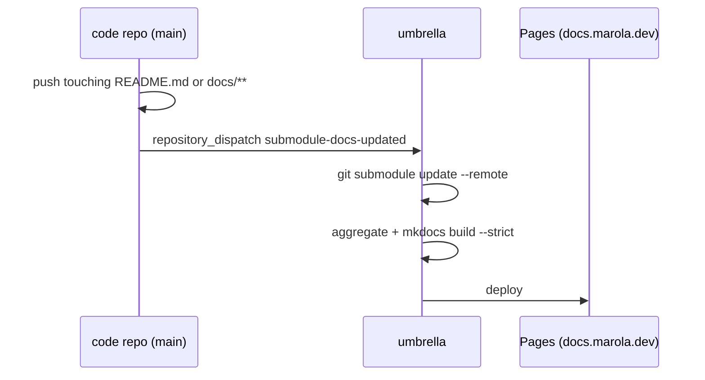

# MIP-0070: Split marola into single-purpose repos under an umbrella

| | |
|---|---|
| **Status** | Draft — for discussion |
| **Author** | Claude (Opus 5.5), with Bruno, from a brainstorm on 2026-09-30 |
| **Created** | 2026-09-30 |
| **Phase** | Repo structure, orthogonal to `ARCHITECTURE.md` §11: no Phase 1 prerequisite, no runtime behaviour change, no paid resource |
| **Related** | `FUTURE-WORK.md` §7 (the earlier split *out of* a shared monorepo), MIP-0056 (OODS: its code and data land in different repos here), MIP-0063 (issue tracking, which stays in the umbrella), MIP-0064 (the docs site this re-homes), MIP-0065 (the workflows this redistributes), reference: [goflink/dispatching-team](https://github.com/goflink/dispatching-team) |
| **Effort** | XL — five new repos; a tooling repo published three ways (flake, plugin marketplace, reusable workflows) with its scripts taught to find the umbrella; a cross-repo docs aggregator; a Pages/DNS move; one app change (`--site` stops reading the site's files from the image); history-preserving extraction of every directory |
| **Gain** | `infra/dev-loop` — each repo builds and gates only its own stack (the site stops compiling Scala, ml stops pulling a JDK); parallel work stops colliding in one tree; `cost/ops` — CI minutes scale with what changed, not with the monorepo |
| **Effort vs Gain** | `do when X lands` — after the in-flight stacks (MIP-0056, MIP-0061, MIP-0063/64/65/68) merge; any PR open against a moved directory has to be recreated otherwise |
| **Depends on** | Coordination, not a merge edge: the MIP-0056 OODS stack (#372–#380) and MIP-0061 (#394/#395) should land first so their history moves with the code. Human-only configuration: one cross-repo credential (GitHub App or fine-grained PAT) for dispatch events, `site-data` pushes and pointer-sync PRs, and one DNS `CNAME` for `docs.marola.dev`. No Phase 1 gate, no paid resource |
| **Blocked by** | none |
| **Risk** | Cross-repo contracts turn out denser than §5.4 shows: every missed coupling becomes a broken build in a repo that can no longer see its producer |
| **Cost so far** | — |

## 1. Summary

`marola-dev/marola` becomes an **umbrella**: the team layer (ways of working, MIPs, issues, the
aggregated docs site) with every code repo as a git submodule. Code moves out, with history, into
single-purpose repos split where the stack or the release cadence changes: `marola-app` (Scala),
`marola-site` (the map), `marola-corpus` (knowledge), `marola-ml` (Python), `marola-oods` (data),
plus `marola-devkit` for the shared harness. Every place where one directory reads another's path
today becomes a versioned artifact that the producer publishes and the consumer pins.

## 2. Motivation

One tree forces one build and one set of gates on everything. `site.yml` runs `sbt` to build the
boards, so a CSS change to the map waits on a Scala compile. `docker-local.yml` fires on
`knowledge/**`, `finetune/Modelfile` and `core/src/main/resources/**` at once, and `ci.yml` path-
filters six directories to avoid running everything. Parallel sessions each need their own worktree
(30+ under `.tmp/wt-*` at the time of writing) to stay out of each other's way. OODS adds a data
tree with daily bot commits to the same history as the code (MIP-0056 §Risk).

The monorepo's real advantage is that an agent sees everything at once. The umbrella keeps that:
check it out with submodules and the whole workspace is one directory again, with the team rules at
the root and each repo's own rules inside it.

## 3. User-visible change

For a marola user: none. The map stays at `https://marola.dev`; the docs move to
`https://docs.marola.dev`, and `marola.dev/docs/*` redirects there.

For a contributor:

```text
# before                                # after
git clone marola-dev/marola             git clone --recurse-submodules marola-dev/marola   # the workspace
just build && just test                 cd marola-app && just build && just test          # one repo's gates
                                        git clone marola-dev/marola-site                   # or one repo, standalone
```

## 4. Data sources and dependencies reviewed

- **The reference umbrella, goflink/dispatching-team** (read 2026-09-30; detail in the Appendix).
  Its AGENTS.md calls itself "the **team layer** of a two-layer harness", with "repo-level
  specifics (build/test/CI, service invariants)" in each submodule and "No build at umbrella level".
  It aggregates every repo's `README.md` + `docs/` into one mkdocs site, deployed from the latest
  `main` of each submodule on non-PR events, and keeps pointers fresh with a daily cron plus
  `repository_dispatch`, feeding one rolling PR. This MIP adopts all four.
- **Nix flake inputs**: already how this repo consumes `lint`, `agentic` and `cuda` from
  `h0ffmann/nix-config` (`flake.nix`), pinned by `flake.lock`.
- **Claude Code plugin marketplace**: a repo with `.claude-plugin/marketplace.json`. Git-based
  sources can be pinned to a `ref`/`sha`, and projects enable plugins in `.claude/settings.json`
  `enabledPlugins`, as this repo already does for `superpowers`. Plugin skills are namespaced
  (`/<plugin>:<skill>`).
- **Cross-repo reusable workflows**: already in use here, since `profile-activity.yml` calls
  `h0ffmann/nix-config/.github/workflows/profile-ping.yml@main`.
- **`repository_dispatch`** needs a credential with write access to the *target* repo. That's the
  reason for the human-provisioned credential.
- **`git filter-repo`**: `--path` selects a union of paths, and `--replace-message` supports
  `regex:`, so a bare `#123` can be rewritten to `marola-dev/marola#123`.
- **GitHub Pages**: a subdomain is a DNS `CNAME`. The map and the docs get separate hosts, which
  avoids depending on the one-domain-per-site rule (partly checked).

## 5. Design

### 5.1 Three layers

| Layer | Holds | Can a repo override it? |
|---|---|---|
| **Umbrella** (`marola`) | Workspace AGENTS.md, ways of working, MIPs and `.tasks.md`, issues and labels, the phase list, the aggregated docs, submodule pointers | — |
| **Devkit** (`marola-devkit`) | The shared harness, versioned: dev-flow scripts, hooks, generic skills and agents, reusable workflows, base flake and `just` module, the invariants block | Yes: a repo opts into each piece, and its AGENTS.md says what it leaves out or changes |
| **Repo** | Its own AGENTS.md, `docs/`, build/test/gates, repo-only skills and rules | It owns them outright |

**Org invariants are the exception to "the repo wins":** cost and deployment safety, the
`agent-ready` gate, the three commit trailers, no secrets in code, phase discipline. A repo may make
these stricter, never looser.

### 5.2 Repo map

Each repo's responsibility is below. The file-by-file assignment is in the Appendix.

| Repo | Responsibility |
|---|---|
| `marola` (umbrella) | Team layer; hosts `docs.marola.dev` |
| `marola-devkit` | Shared harness, consumed by pinned version |
| `marola-app` | The Scala product: pipeline, adapters, CLI, MCP, benchmark runner, the OODS ingest code, the image |
| `marola-site` | The map at `marola.dev`: static page, `areas.json`, `site-data` panels, live checks |
| `marola-corpus` | Sourced ocean knowledge |
| `marola-ml` | Offline Python: DSPy compile, fine-tune, marola-sea, and the model benchmark gate with its kept runs |
| `marola-oods` | The water-quality dataset only (§5.3) |

### 5.3 Why OODS is split into code and data

On its stack tip, `oods` is an sbt module with `.dependsOn(local)`, reusing MIP-0031's parsers.
This MIP doesn't publish the Scala modules as libraries (a decision: publishing `core`/`local`
turns every cross-module change into two PRs and a version bump). So the OODS code, including
`sources.json` (configuration the tests read), `oods-ingest.yml` and `oods_raw_sync.py`, stays with
`marola-app`. What moves out is `data/oods/`. The ingest workflow checks out `marola-oods` and
commits there, and `oods-check` runs in `marola-oods` CI against the pinned app image.

### 5.4 Contracts: pinned artifacts instead of paths

```mermaid
flowchart LR
  devkit[marola-devkit] -. flake / plugin / workflows .-> app & site & corpus & ml
  corpus[marola-corpus] -- tagged tarball --> app[marola-app]
  corpus -- tagged tarball --> ml[marola-ml]
  ml -- compiled prompt, bump PR --> app
  app -- image + resources tarball --> ml
  app -- image: data-only --site --> site[marola-site]
  app -- coverage, smoke --> site
  app -- ingest commits --> oods[marola-oods]
  oods -- export tag --> app
```

| Producer → consumer | Artifact | Pinned by |
|---|---|---|
| app → site | `ghcr.io/marola-dev/marola:<tag>`. `--site` writes **board data only**, from an `--areas` file the site passes in. The image stops copying `site/static` and `site/areas.json`. The image ships `board.schema.json`, and the site validates against it | Image tag in `site.yml`. The site never builds Scala |
| site → app | `areas.json`, `site/fixtures/board.json` | App tests use checked-in fixture copies. The live file is always passed in at run time |
| app → site `site-data` | `coverage/`, `smoke/` (app CI and `docker-smoke.yml` push them with the cross-repo credential, then dispatch `site.yml`); `stats/` (the umbrella runs `repo_stats.py` over every submodule) | Branch content; the site renders whatever is there |
| corpus → app, ml | A release tarball of `knowledge/*.md` | `corpus.version` in each consumer. `just corpus-fetch` unpacks it into `.tmp/knowledge` for `sbt test`, `just ask` and the image build. Inside the umbrella, `MAROLA_KNOWLEDGE_DIR=../marola-corpus` |
| app → ml | The image (the benchmark runner, `--benchmark`) and a **resources tarball** per tag: `core/src/main/resources/*.json` + `benchmark_questions.json` + the board fixture | Tag. `finetune/build_dataset.py` and the gate read the unpacked tarball, not `../core` |
| ml → app | Compiled-prompt JSON, which a bot PR commits into app resources (DSPy stops writing across the tree). Model name/tag on HF/Ollama | The file in app; the model is config |
| oods → app | The export MIP-0056 §5.5 plans | Tag plus its env var |
| every repo → umbrella | `README.md` + `docs/`; Scaladoc/pdoc as a release asset | Pulled by the aggregator (§5.5) |

Rule: no repo reads another repo's tree, in CI or in tests, and no consumer's CI builds its
producer from source.

### 5.5 Docs: per repo, aggregated and hosted by the umbrella



- **Each repo** has `README.md` + `docs/`, a small `mkdocs.yml` and `just docs-serve` (the
  devkit's `mkdocs.sh`), and builds `--strict` standalone. Links: relative inside `docs/`, GitHub
  URLs for code, absolute `docs.marola.dev` URLs for another repo's pages. `notify-umbrella.yml` is
  a reusable devkit workflow, about three lines per repo.
- **API docs**: `api-docs.yml` splits in two. App CI builds Scaladoc, and ml CI builds pdoc for
  `finetune/`. Each publishes a release asset, which the umbrella fetches. The umbrella never builds
  Scala or Python.
- **The umbrella** has its own `docs/`, plus `mkdocs/repos.yml` mapping each submodule to a mount
  point (default `repos/<name>/`; the app's `1-Using-marola` mounts top-level). It triggers on
  dispatch, on pushes to its own `docs/`, on a daily cron and manually. Non-PR builds use
  `--remote`; PR builds use pinned commits. Docs and map deploy independently.

### 5.6 AGENTS.md and the devkit

- **Umbrella AGENTS.md** is a workspace file, not a service file. It holds the repo inventory
  (responsibility, stack, contracts in and out); the scope rules (single-repo: read that repo's
  AGENTS.md first; cross-repo: plan the contract, same branch name, one PR per repo linked, producer
  merges first, pointers bump last); the invariants in full; the MIP, issue and phase flow; and
  submodule mechanics. The phase list (`ARCHITECTURE.md` §11 today, which `issues.sh` parses) moves
  to the umbrella as `docs/PHASES.md`, because phases are an org rule.
- **Each repo's AGENTS.md** covers what the repo is, what it produces and consumes, its commands,
  style and testing, and what it overrides. It also carries the **invariants block**, one line per
  rule. The devkit ships that block at a version, and `just agents-check` compares the repo's copy
  with the one in its *pinned devkit*, never with the umbrella's tree.
- **The devkit finds the umbrella.** Today `uprd.sh`, `lib/mip_ref.sh`, `lib/pr_labels.sh` and
  `issues.sh` read `docs/MIPs/` from the PR's own branch, which a code repo no longer has. They now
  resolve MIPs and `.tasks.md` from `../` inside an umbrella checkout, or otherwise via
  `gh api repos/marola-dev/marola/contents/docs/MIPs`. Every generated issue reference is fully
  qualified (`Closes marola-dev/marola#N`), because a bare `#N` would close nothing in a code repo.
  A `.tasks.md` row names its target repo, `stack.sh` stacks within that repo, and `cost-split`
  attributes usage by commit across repos.
- **Plugin mechanics**: the skills stop hardcoding `scripts/stack.sh`-style paths, since the flake
  puts `stack`, `uprd`, `issues` and `cost-split` on `PATH`. Plugin hooks use
  `${CLAUDE_PLUGIN_ROOT}`. Hooks that only make sense for one stack get parameterised or stay in
  their repo: `stop-gate.sh` is Scala-only today, and `.githooks/pre-commit` runs sbt, so both call
  the repo's own `just quality` instead. `pre-push`'s `MIP:`-trailer check stays in `marola-site`.
  `ci.yml` splits into per-repo workflows calling reusable `scala-ci`, `python-ci` and `static-ci`.

### 5.7 Migration order

GitHub Pages is the constraint that sets the order: today this repo's Pages serves `marola.dev`,
docs included, and one repo has only one Pages site. The umbrella can't serve `docs.marola.dev`
until the map has left it, and no repo with docs can be extracted until the aggregator exists.

0. **Freeze**: land or park the open stacks. A PR open against a moved directory is recreated in
   its new repo.
1. **Prep in the monorepo**: `--site` becomes data-only with `--areas`; the resources tarball and
   corpus fetch exist; `finetune`/`dspy` stop reading `../core`. Every contract in §5.4 works while
   everything is still one tree.
2. **`marola-devkit`**: extract it, teach it to resolve the umbrella (§5.6), then switch *this* repo
   to the flake input, the plugin and the reusable workflows.
3. **`marola-site` plus the docs host swap, in one step**: the site repo takes Pages, `marola.dev`
   and `site-data` (`coverage`/`smoke`/`stats` only). This repo's Pages moves to `docs.marola.dev`
   with the aggregator in place, and the site ships the `/docs/*` redirect. `marola-site` is the
   first submodule.
4. **`marola-corpus`, `marola-ml`**: they become submodules and are aggregated from their first day.
5. **`marola-app` + `marola-oods`**: the remaining code leaves. The umbrella keeps only the team
   layer, and pointer sync switches on.

Every extraction uses `git filter-repo --path … --replace-message` (bare `#N` →
`marola-dev/marola#N`). Issues stay in the umbrella. Secrets move with their workflow (`HF_TOKEN` →
ml, `STEWARD_GH_TOKEN` → app).

## 6. Scoring / safety impact

None. No Scala in `scoring/` changes. The safety rules become org invariants that every repo
restates and `agents-check` enforces.

## 7. Verification plan

- **Self-tests** (the same `--self-test` convention as `scripts/*.py`):
  - `agents-check --self-test`: an edited invariants block fails, an unchanged one passes.
  - `mip-resolve --self-test`: finds MIP-0070 from a clone of a code repo with no umbrella (the
    `gh api` path) and from inside the umbrella (`../`).
  - `uprd --self-test` gains a case asserting a fully qualified `Closes marola-dev/marola#N`.
- **Step 1 (still one repo)**: `site.yml` builds the boards from `cli/run -- --site --areas
  site/areas.json` with no `site/static` in the image. `RagOfflineSpec` passes with
  `MAROLA_KNOWLEDGE_DIR=.tmp/knowledge` from `just corpus-fetch`. `build_dataset.py` runs from the
  unpacked resources tarball.
- **Step 2**: in this repo, `just pr` on a throwaway branch fills the trailers and writes the MIP
  link through the flake-provided scripts, `/marola-devkit:mip` loads from the plugin, and `ci.yml`
  runs through the reusable workflow.
- **Step 3**: `marola-site`'s CI log has no `sbt`, and the boards come from a pinned image.
  `curl -I marola.dev/docs/1-Using-marola/RUN-LOCALLY/` redirects to `docs.marola.dev`.
- **Each extraction**: `git log --follow` on a moved file shows its pre-split history. The repo's
  gates pass from a fresh clone in `nix develop` with no umbrella, and a push to its `docs/`
  redeploys `docs.marola.dev` within one run without a site deploy.
- **Done** means the umbrella holds no code directories, every repo passes its gates standalone,
  and a fresh `--recurse-submodules` clone lets an agent reach every repo's AGENTS.md from the root.

## 8. Risks, limitations, and honest caveats

- **Cross-repo changes cost more.** A board-schema change is now two PRs and an image tag bump.
  The Scala modules stay together precisely to avoid paying that on every core change.
- **The contracts table is only as good as the grep behind it.** Step 1 exists to flush out missed
  couplings while a missed one still just fails a monorepo build.
- **Submodules are awkward**: detached HEAD, pointer noise, a forgotten `--recurse-submodules`.
  The umbrella AGENTS.md states the mechanics, and only the rolling sync PR bumps pointers.
- **The invariants block is a copy.** `agents-check` stops it drifting, but it can't make an agent
  that ignores AGENTS.md read it.
- **Old links**: GitHub links into moved paths (`marola-dev/marola/blob/main/core/...`) break.
  The redirect covers the docs site only.
- **One credential** carries dispatch, `site-data` pushes and pointer sync. The daily cron still
  rebuilds the docs if dispatch fails.

## 9. Alternatives considered

- **Do nothing.** It keeps the one-tree agent context, which the umbrella now provides, and keeps
  every cost in §2.
- **Full modularity** (`core`/`local` as published libraries with semver). This is the most SRP-pure
  option, but every cross-module change would take two PRs and a release. It was rejected in the
  brainstorm and can be revisited per module later.
- **Keep `marola-dev/marola` as the Scala app, with a new umbrella repo.** Issues, MIP history and
  every `#N` reference would have to move or keep pointing at a code repo.
- **Require the umbrella for shared tooling** (`../devkit/scripts`). A single-repo clone couldn't
  run `just pr`, and CI would check the devkit out on every run.
- **Vendor devkit files into each repo with a sync bot.** This is the copy-and-drift model
  `FUTURE-WORK.md` §7 already hit, and local overrides get overwritten.
- **The umbrella owns `marola.dev` and pulls in the site's `dist/`.** URLs would be unchanged, but
  every map deploy would go through the docs pipeline.

## 11. Open questions

- The cross-repo credential: a GitHub App (scoped per repo, no expiry to rotate) or a fine-grained
  PAT? A human creates either one.
- Final repo names (`marola-app` vs `marola-engine`, and so on) before any extraction runs.
- Do repo-specific issues (the site's, say) ever move out of the umbrella, or does MIP-0063 stay
  single-repo?
- `stats/`: should the umbrella's `repo_stats.py` roll every repo into one panel or show a panel per
  repo?
- **Follow-up MIP:** umbrella-level orchestration (`just up` over each repo's compose file) and
  cross-repo flow tests (board → rendered map). Out of scope here; it needs the next MIP number.

## Appendix

### File assignment

| Destination | Files |
|---|---|
| umbrella | `AGENTS.md`/`CLAUDE.md` (rewritten as workspace files), `README.md`/`README.pt-BR.md` (workspace landing), `PHILOSOPHY.md`, CONTRIBUTING/CODE_OF_CONDUCT/SECURITY/LICENSE, `TODO_FL.md`, `docs/3-*`, `docs/4-*`, `docs/MIPs/`, `docs/index.md`, `mkdocs/`, `.github/{labels.yml,ISSUE_TEMPLATE/,CODEOWNERS}`, `profile-activity.yml`, the aggregator and pointer-sync workflows (new), `.claude/rules/docs.md`, `repomix*` (re-pointed at submodules), `scripts/{repo_stats,arxiv_digest,awesome_agentic_digest,mip_graph,gh-billing}.*` |
| devkit | `scripts/{stack,uprd,uprds,pr,cost-fill,branches,issues,pr-label,backfill-pr-labels,mip-stack,docs-mip-stack,deps-stack,deps-merge,mkdocs}.sh`, `scripts/{cost-split,pr_label_nlp}.py`, `scripts/lib/`, the matching `scripts/fixtures/*`, `.githooks/`, `.claude/hooks/`, `.claude/statusline.sh`, `.claude/settings.json`'s shared parts (attribution, hooks, base permissions), skills `mip`, `mip-tasks`, `mip-solve-perpetual`, `triage`, `humanizer`, `ponytail*`, `sharingan`, `skill-copy`, `obsidian-vault`, `voice-note-ingest`, `voice-to-feature`, agents `mip-reviewer`, `mip-claims-auditor`, `.github/{PULL_REQUEST_TEMPLATE.md,actionlint.yaml}`, `ci-short-circuit-pr-close.yml`, `pr-body.yml`, `.ai-jail`, base `flake.nix`/`justfile` modules, `.shellcheckrc`, `ruff.toml`, the runner scripts (`gha-runner`, `setup-runners`, `runner-preflight`, `workflow_runners.py`, `temps`) |
| app | `core/ local/ cli/ project/ build.sbt`, the OODS module + `sources.json` + `oods-ingest.yml` + `oods_raw_sync.py`, `Dockerfile`, `docker-compose.yml`, `.dockerignore`, `.env.example`, `.envrc`, `.scalafmt.conf`, `.scalafix.conf`, `.mcp.json`, `opencode.json`, `.gemini/`, `ci.yml` (its Scala part), `docker.yml`, `docker-smoke.yml`, `marola-e2e.yml`, `scala-steward.yml`, `dependabot.yml` (each repo gets its own), `api-docs.yml` (Scaladoc part), `.claude/rules/scala.md`, agent `jar-verifier`, `docs/1-*`, `docs/2-*`, `scripts/{smoke_record.py,ocr-post.py}` |
| site | `site/`, `site.yml`, `site-health.yml`, the `site-data` branch, `scripts/{site_check.js,site_live_check.py,stamp_site_version.sh,site-data-push.sh,strip_external_scripts.py}`, skill `site-frontend`, the `pre-push` `MIP:`-trailer rule |
| corpus | `knowledge/`, skills `corpus-doc`, `eli5` |
| ml | `dspy/`, `finetune/`, `Dockerfile.local`, `docker-local.yml`, `marola-sea-publish.yml`, the pdoc part of `api-docs.yml`, `scripts/{analyze_training.py,marola-sea-pull.sh,benchmark_gate.py}`, `docs/benchmarks/`, the `cuda` flake input |
| oods | `data/oods/` |

`data/` other than `data/oods/` is runtime output, and gitignored.

### Checked live

- `gh api repos/goflink/dispatching-team/...` (2026-09-30): `AGENTS.md` ("team layer of a
  two-layer harness", scope rules, "Don't bump umbrella submodule pointers until all underlying PRs
  are merged"), `.gitmodules`, `docs/centralized-docs/repo-guide.md` (the README → `index.md`
  mapping and link rules), `deploy-docs.yml` (`git submodule update --remote` except on
  `pull_request`), `sync-submodule-pointers.yml` (a daily cron plus `repository_dispatch:
  submodule-updated`, feeding one rolling PR).
- https://code.claude.com/docs/en/plugin-marketplaces (2026-09-30): `.claude-plugin/marketplace.json`;
  `github`/`git-subdir`/`url` sources; `ref`/`sha` pinning; skills run as `/<plugin>:<skill>`.
- https://docs.github.com/en/rest/repos/repos#create-a-repository-dispatch-event (2026-09-30):
  classic PATs need `repo` scope.
- git-filter-repo `Documentation/git-filter-repo.txt` (2026-09-30): `--path`, `--path-rename`,
  `--replace-message` with `literal:`/`glob:`/`regex:`.
- https://docs.github.com/en/pages/configuring-a-custom-domain-for-your-github-pages-site/about-custom-domains-and-github-pages
  (2026-09-30): subdomains use a `CNAME` record.
- This repo (2026-09-30):
  - `origin/mip-0056/11-raw-offload` has `lazy val oods … .dependsOn(local)`; 78 files, +12,807
    lines by `git diff --stat main...` (three-dot, from the merge base).
  - `Dockerfile` copies `knowledge`, `site/areas.json`, `site/board.schema.json` and `site/static`
    into both runtime images.
  - `uprd.sh` reads `docs/MIPs/` via `git ls-tree` on the PR's head.
  - `finetune/build_dataset.py` reads `core/src/main/resources` and `knowledge/` by relative path.
  - `profile-activity.yml` calls a cross-repo reusable workflow.

### Not checked

- That GitHub Pages refuses the same custom domain on two repos: the page states only the
  user/org-site inheritance rule. Separate hosts avoid the question.
- Reusable-workflow limits (nesting depth, `secrets: inherit` across owners): from memory.
- Whether a repo's `GITHUB_TOKEN` can dispatch to a sibling repo: assumed not, so we budget a credential.
