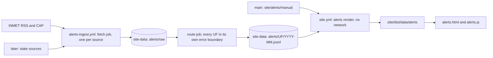

# MIP-0071: Official alerts per state — an append-only store with its own ingest, and an alerts page that reads only the store

| | |
|---|---|
| **Status** | Draft — `Tasks: docs/MIPs/MIP-0071.tasks.md` |
| **Author** | Claude, for M. Hoffmann (#540, plus three requirements given on 2026-09-30: the site reads alerts from RSS or from a store persisted as plain text or SQLite, and never re-fetches history; marola holds every alert for the state of Rio de Janeiro in September 2026; every state gets alerts, independently of the others) |
| **Created** | 2026-09-30 |
| **Phase** | 0 for the store and the ingest (an offline data pipeline, like MIP-0056); 3 for the page, which rides `site.yml` as MIP-0044's pages do. Phase 1 (MIP-0002's Telegram bot) is still not built. Nothing here needs it, and sending alerts to Telegram is out of scope (§8) |
| **Related** | #540 (the request); #535 (fetch/render split, which this design follows); MIP-0034 (§4.1 INMET RSS + CAP 1.2, §4.1b id-walk backfill, §5.2 the map banner; this MIP builds its CAP parser and backfill and takes the site's alert data off the site build); MIP-0044 §11 (proposed dropping `Alerts` from the nav; reversed here); MIP-0054 §5.8 and #536 (the catalogs every page string goes through); MIP-0062 §4.3 (the Navy's avisos: 403, no feed); MIP-0008 §5.5 and `scripts/site-data-push.sh` (the `site-data` branch); MIP-0056 (the sibling store for bathing water, and why it could not commit to `main`); MIP-0022 (the emergency line); MIP-0005 (the static site) |
| **Effort** | XL — a new `core/alerts` package (CAP parser, record, UF routing, pure store rules), four CLI modes, a scheduled workflow that writes to `site-data`, a render step in `site.yml`, and a new page with its own script. No new dependency |
| **Gain** | `user value` — an official warning for a visitor's state is one tap from the map, in the issuer's words with a link, plus a dated archive starting with RJ in September 2026; `infra/dev-loop` — the first data path built on #535's split, and an append-only store that later sources plug into |
| **Effort vs Gain** | `do next` — the maintainer asked for it, MIP-0034 verified INMET's feed in September, and task 1 (a short source check from a machine that can reach INMET) settles whether the September backfill is an id walk or an open question |
| **Depends on** | MIP-0034 shares the CAP parsing. This MIP builds the parser (the CAP half of MIP-0034 task 1) and the backfill (its task 6), so neither MIP waits for the other. MIP-0054 task 1 (#536): only the page task needs `site/i18n/*.json`, the store does not. #535 does not block: the ingest is its own workflow and the render reads only `site-data`, which `site.yml` already fetches. The trigger that would redeploy as soon as an alert lands does wait for #535's render-only path (§5.6). MIP-0044: the page is hand-written like `about.html` until its §5.1 generator exists. No Phase 1 gate. No paid resource: GitHub-hosted runners on a public repository |
| **Blocked by** | none |
| **Risk** | An archive that looks complete and isn't. An alert marola cannot route to a state, or an id INMET no longer serves, drops out of "every RJ alert for September" without a trace, and the page reads as authoritative. The unrouted file (§5.3), the coverage manifest (§5.4) and the page's per-month coverage line exist so that a gap shows |
| **Cost so far** | — |

## 1. Summary

marola.dev gets `alerts.html`: official warnings for every Brazilian state, starting with INMET's,
with active ones on top and a dated archive filterable by state and month. Each entry shows the issuer,
the severity in the issuer's own words, the event, area and validity, a link to the issuer's page,
and the issuer's text verbatim in Portuguese. A scheduled ingest, separate from the site build,
appends every alert to plain-text JSONL files per state per month on the `site-data` branch. The
site build reads those files and nothing else. The first archive month is September 2026 for Rio
de Janeiro, backfilled by walking INMET's alert ids if task 1 confirms those ids are still served.

## 2. Motivation

- The nav on `index.html` and `about.html` has shown `Alerts soon` since #321/#324 with no design
  behind it. MIP-0044 §11 proposed dropping the item; the maintainer wants the page instead (#540).
- MIP-0034 §5.2 designed INMET warnings as a banner shown only while an alert is valid, fetched
  while the board is built. That design keeps no history: the RSS drops expired items (#540), so a
  warning from 29 September is gone from the feed within a day. Fetching during the site build is
  also what #535 says must stop; run 36729154478 failed a CSS-only deploy on one Open-Meteo 503.
- INMET's feed is national. One parse failure, or one state's future source hanging, must not take
  every state's alerts down with it. The maintainer asked for per-state independence explicitly.

## 3. User-visible change

The page in pt-BR, the default. Values in `<…>` come from the issuer's document. The 29/09 entry
is #540's reading of a search summary and is replaced by the real document in task 7.

```
Docs  Alertas  Notícias em breve  Sobre  Contato em breve  Doar em breve         [pt|en] GitHub
Alertas oficiais
O marola não é um serviço de alerta. Estes são avisos oficiais, reproduzidos sem alteração a
partir de quem os emitiu, e podem estar atrasados: confirme sempre no emissor.
Em emergência na água: acione os guarda-vidas ou ligue 193 (Bombeiros) / 192 (SAMU).

Estado [RJ ▾]   Mês [setembro de 2026 ▾]
INMET consultado às 14:07 (horário de Brasília), última ingestão com sucesso às 14:07
Setembro de 2026: ids INMET <primeiro>–<último> verificados, <n> sem resposta

ATIVOS AGORA — nenhum aviso ativo para RJ

ARQUIVO — setembro de 2026
| Perigo Potencial · Tempestade · INMET                                           expirado
| de 29/09/2026 09:25 até 29/09/2026 23:59 (horário de Brasília)
| Área: <areaDesc, como emitido> · <n> municípios ▸
| "<descrição do INMET, sem alteração>"
| ver no INMET · documento CAP
```

With `?lang=en` the chrome changes and the controlled words get a marked gloss. The issuer's text
stays Portuguese:

```
| Perigo Potencial (potential danger, marola's translation) · Tempestade (storm) · INMET   expired
| from 29 Sep 2026 09:25 to 29 Sep 2026 23:59 (Brasília time)
| Official text, in Portuguese as issued:
| "<descrição do INMET, sem alteração>"
```

For a developer:

```
$ just alerts-ingest --source inmet --store .tmp/alerts
inmet: rss 89 items, 3 new ids, 1 changed; walked 55890–55893; pending 0
route: RJ +2 (2026-09.jsonl), SP +1, MG +1; unrouted 0; failed UFs none
check: append-only ok (27 UFs, 1 month touched)
```

## 4. Data sources and dependencies reviewed

No issuer page could be read on 2026-09-30: every host below answered 403 to this session's egress
proxy (Appendix). **Verified** means MIP-0034 verified it on 2026-09-07/08; it is repeated here, not
re-checked. **To verify** is task 1's checklist. No decision in §5 rests on a to-verify item
without a stated fallback.

### 4.1 INMET avisos: an RSS index plus one CAP 1.2 document per alert (picked, every UF)

Verified (MIP-0034 §4.1, §4.1a, §4.1b): `https://apiprevmet3.inmet.gov.br/avisos/rss` is RSS 2.0
with `<copyright>public domain</copyright>` and "O conteudo deste site, podera ser reproduzido desde
que citada a fonte"; 85–89 live items; each `guid` resolves to a CAP 1.2 document at
`/avisos/rss/<id>` carrying `event`, `severity`, `urgency`, `certainty`, `onset`, `expires`,
`description`, `instruction`, `web`, `areaDesc` and a `polygon`. The RSS names severity `Perigo
Potencial` / `Perigo` / `Grande Perigo`; CAP says `Moderate` / `Severe` / `Extreme`. INMET gave no
response to curl's default User-Agent. `/avisos/ativos` is undocumented JSON with `estados` and IBGE
municipality codes. Ids 55000, 50000 and 40000 (sent 2026-07-15, 2025-02-28, 2022-08-29) still
returned full CAP on 2026-09-08; `/avisos/rss/1000` returned 500; `/avisos` and `/avisos/todos` 404.

To verify (task 1):

1. **Whether CAP documents for September 2026 ids are still served.** The backfill depends on it.
   Extrapolating MIP-0034's four samples (about 11 ids a day) puts September near ids 55550–55950;
   that is arithmetic, not a check.
2. **Whether a CAP document carries INMET's Portuguese severity** (in `headline`, a `parameter`, or
   elsewhere) or only the CAP value. If only the CAP value, backfilled entries show `Moderate (CAP)`,
   never a Portuguese word marola derived (§5.2).
3. **Whether CAP carries `geocode` values with IBGE municipality codes.** They make UF routing
   exact (§5.3).
4. **Whether INMET issues CAP `Update`/`Cancel` messages with `references`**, edits a document in
   place under the same id, or does neither.
5. **Whether `Http`'s own User-Agent** (`marola/0.1 (+https://github.com/h0ffmann/marola)`) gets a
   response, or only a browser-like one does.
6. **The human page per alert**, and whether old ids resolve there: `avisos.inmet.gov.br/<id>`
   (MIP-0034's "Not checked"), and `alertas2.inmet.gov.br/<id>`, which a search summary on
   2026-09-30 said bulletins cite (the summary only, no page read).
7. **A rate limit or terms of use** beyond the copyright line. MIP-0034 found none documented.
8. **Id density across the September range**: which ids answer 404 or 500, and whether a gap is
   permanent.

### 4.2 Marinha do Brasil / CHM avisos de mau tempo (later, not designed)

The authoritative marine source (ressaca, strong winds). 403 in MIP-0034 §4.6 (2026-09-07),
MIP-0062 §4.3 (2026-09-19), #540 and here; no feed found. It stays behind MIP-0034 §11.3 ("ask them
for a feed"). Meanwhile a specific Navy warning can enter the archive as a manual record (§5.5).

### 4.3 Rio's state and city civil defence: Alerta Rio, COR, Defesa Civil RJ (not verified)

`alertario.rio.rj.gov.br`, `cor.rio` and `defesacivil.rj.gov.br` answered 403 here. Format, feed,
history and licence are all unknown. Each is a candidate RJ-only adapter and needs its own §4 check
before any code.

### 4.4 The store format

| Option | Verdict | Why |
|---|---|---|
| JSONL, one file per UF per month, append-only | **picked** | Diffable and reviewable; append-only is checkable as a byte prefix; nested fields (municipalities, references) and multi-line verbatim text fit; readable with `jq` or DuckDB without marola; one UF's files are separate from every other UF's |
| SQLite | rejected | A binary rewritten on every run: no diff, no review, and two writers conflict on the one file even when they touch different states; the build would need a JDBC reader. MIP-0056 §4.4 rejected it for the same reasons |
| CSV | rejected | Multi-line verbatim descriptions and list fields make quoting fragile |
| The site build reads INMET's RSS directly | rejected | It is a network call in the build (#535), the feed drops expired items so it carries no history, and it has no per-UF split |
| One JSON file per alert (MIP-0034 task 6's shape) | rejected | About 4,000 files a year, and no single file to check for append-only |

### 4.5 Dependencies

None new. `java.xml` parses CAP (MIP-0034 §4.7); `core/http` fetches with retries on 429, 502, 503
and 504 and exponential backoff (`Http.RetryableStatuses`, `backoffFor`, read today); JSON goes
through `marola.json`. CAP's enumerations (§5.8) are from the OASIS CAP 1.2 standard, not re-read
this session.

**Pick:** INMET for all 27 UFs from the first delivery; every other issuer waits for its own check.

## 5. Design

### 5.1 The pipeline



Three rules:

1. Only `alerts-ingest.yml` talks to issuers. `site.yml` reads the store with `git fetch` and
   sends no request to an issuer.
2. The store is append-only. A pushed line is never edited or removed.
3. Every UF has its own files, and a failure is recorded against the source or UF it belongs to.

### 5.2 The record

One JSON object per line. Field values below are MIP-0034's alert 55649 where verified, `<…>`
otherwise:

```json
{"v":1,"key":"inmet:55649","version":"sha256:<hex>","supersedes":null,
 "issuer":"INMET","issuer_id":"55649","cap_identifier":"<CAP identifier>","cap_status":"Actual",
 "uf":"AM","msg_type":"Alert","references":[],
 "event":"Chuvas Intensas","severity_label":"Perigo Potencial","severity":"Moderate",
 "urgency":"Future","certainty":"Likely","sent":"2026-09-08T<…>-03:00",
 "onset":"2026-09-11T09:34:00-03:00","expires":"2026-09-11T23:59:00-03:00",
 "headline":"<…>","description":"<…>","instruction":"<…>","area_desc":"<…>",
 "municipalities":[{"ibge":"<7 digits>","name":"<município>"}],
 "web":"<issuer page>","source_url":"https://apiprevmet3.inmet.gov.br/avisos/rss/55649",
 "raw":"alerts/raw/inmet/2026-09/55649-<version8>.xml","ingested_at":"<UTC>","via":"live"}
```

- `key` (`issuer:issuer_id`) identifies an alert. `version` is the sha256 of the line's canonical
  JSON without `version`, `supersedes`, `raw`, `ingested_at` and `via`. A line's dedup key is
  `(key, uf, version)`.
- `severity_label` is the issuer's own word or `null`, never computed from `severity`. `severity` is
  the CAP value verbatim; the page orders and colours by it. A non-CAP source maps to it only from a
  table the issuer itself publishes, otherwise `Unknown`.
- Times keep the issuer's offset; the page displays them in `America/Sao_Paulo`.
- `headline`, `description`, `instruction` and `area_desc` are the issuer's text after XML entity
  decoding and nothing else.
- `cap_status` is kept for every document; the page shows only `Actual`.
- `via` is `live`, `backfill`, `reparse` or `manual`.
- Polygons stay in the raw document, not the line: a 291-point polygon copied into five UFs' files
  would be most of the store, for nothing the page shows.

### 5.3 Layout, routing, retention, corrections

| Path | Branch | Written | Holds |
|---|---|---|---|
| `alerts/<UF>/<YYYY-MM>.jsonl` | `site-data` | appended | §5.2 lines, filed by the month of `sent` in `America/Sao_Paulo` |
| `alerts/<UF>/status.json` | `site-data` | overwritten | last attempt and success per source, last error |
| `alerts/raw/<source>/<YYYY-MM>/<issuer_id>-<version8>.xml` | `site-data` | once | the document as fetched |
| `alerts/manifest/<source>.json` | `site-data` | overwritten | newest id, RSS item hashes, pending and unresolved ids, id ranges walked per month |
| `alerts/_unrouted/<YYYY-MM>.jsonl` | `site-data` | appended | alerts no UF rule matched |
| `site/alerts/sources.json` | `main` | by PR | the 27 UFs and their sources (v1: all `inmet`) |
| `site/alerts/manual/<UF>.jsonl` | `main` | by PR | human-curated records (§5.5) |

- **Routing** (`UfResolver`, pure). An alert goes to every UF it covers: by IBGE municipality codes
  when the document carries them (the first two digits are the UF's code); otherwise by `areaDesc`'s
  mesoregion names against `core/src/main/resources/alerts/mesorregioes.json` (IBGE's list, its
  source in the file); otherwise to `_unrouted/`. Unrouted alerts appear in the workflow summary and
  on every UF's status line for that month, so a routing gap is never silent.
- **Month.** A line lives in the file of its `sent` month. The page's month view shows every alert
  whose `[onset, expires]` overlaps the month, so the render also reads the previous month's file.
- **Retention: forever**, lines and raw documents alike. At about 11 alerts a day nationally and
  about 9 KB per CAP document (MIP-0034's one measured document), raw is roughly 36 MB a year before
  git compression. Revisit at 200 MB, MIP-0056 §8's threshold. `CI-CD.md` describes `site-data` as
  "only generated output"; `alerts/` is the first thing there that cannot be regenerated once INMET
  stops serving an id, so task 4 adds the rule "never reset or squash `site-data` without carrying
  `alerts/` over".
- **Idempotent re-ingest.** `AlertStore.append` keeps only lines whose `(key, uf, version)` is not
  already present; the same run twice writes nothing the second time.
- **Corrections and cancellations are appended, never rewritten.** Different content under the same
  id gets a new line with the new `version`, and `supersedes` names the old one. A CAP `Update` or
  `Cancel` gets a line whose `supersedes` names the referenced alert (from CAP `references`); the
  page shows the old entry as "atualizado" or "cancelado pelo emissor em …", still listed. When a
  marola parser bug is fixed, the affected lines are re-derived from `raw/` and appended with
  `via: "reparse"`.
- **Append-only check** (`--alerts-check`, before every push): each JSONL file at the new tip starts
  with the same file's bytes at the old tip, every line parses, no `(key, uf, version)` repeats. A
  failure stops the push.

### 5.4 The ingest: `alerts-ingest.yml` and the INMET adapter

`InmetSource`, per run:

1. Fetch the RSS once. It gives the newest id; each item's hash (title, description, `pubDate`) is
   compared with `manifest/inmet.json`.
2. Fetch the CAP document for each id that is new, whose RSS item changed, or that lies between the
   manifest's newest id and the feed's. That walk recovers a run GitHub skipped and an alert that
   lived less than an hour, provided INMET still serves the id (§4.1 item 1).
3. A 429 or 5xx after `Http`'s own retries (two, exponential from 1 s) puts the id in `pending`
   with a try count. Later runs retry it; after 24 tries it moves to `unresolved`, which the page's
   coverage line lists. One failing id never fails the run.
4. Requests are sequential with a 1 s pause. An hourly run is one RSS request plus the few new CAP
   documents. `Http` does not read `Retry-After` today; #535 item 4 adds it, and the adapter uses it
   once it exists.

Backfill is the same code with `--from-id`, `--to-id` and `--max` (default 600): `via:
"backfill"`, resumable from the manifest.

The workflow:

- `schedule: "23 * * * *"` and `workflow_dispatch` (`mode` incremental or backfill, `from_id`,
  `to_id`, `source`, `dry_run`); `concurrency: alerts-ingest` without cancelling; `ubuntu-latest`;
  `contents: write`; the JDK, sbt and coursier steps copied from `site.yml`.
- Job `fetch`: a matrix over the sources in `site/alerts/sources.json` (v1: `[inmet]`),
  `fail-fast: false`, 15 minutes each. It runs `--alerts-fetch <source>` in a `site-data` worktree,
  commits `alerts/raw/<source>/` and `alerts/manifest/<source>.json`, and pushes with
  `scripts/site-data-push.sh`.
- Job `route`: `needs: fetch`, `if: always()`, no network. It fetches the new `site-data` tip and
  runs `--alerts-route` over the raw documents of the months the fetch touched (the manifest records
  them; normally the current and previous month), appending only lines not already stored. It then
  runs `--alerts-check`, commits `alerts/<UF>/` and `alerts/_unrouted/`, and pushes.
  Each UF runs inside its own error boundary: a failure goes into that UF's `status.json`, the other
  UFs are pushed, and the job then ends red.
- Neither job deploys anything.
- A state source (Alerta Rio, say) is one entry in `sources.json` and one `AlertSource`. It becomes
  one more matrix entry, so it can hang or fail without touching another source or UF.
- The matrix is over sources, not UFs, on purpose. INMET is one national feed; fetching it in 27 UF
  jobs would multiply the load on a host with no documented limit and isolate nothing, because an
  INMET outage is an outage for every UF. The per-UF guarantee sits where UFs actually differ: their
  files, their routing, their own sources.

`site-data` rather than `main`: `main`'s ruleset requires a pull request (MIP-0056 §5.4, checked
through the API on 2026-09-14, not re-checked), so hourly commits there need a bypass nobody has
granted. `site-data` already takes bot pushes from three workflows through `site-data-push.sh`,
which never conflicts on content because each writer owns its directory, and #535 proposes the same
branch for board snapshots.

### 5.5 Manual records

For an issuer with no adapter (the Navy today, or the source of #540's "RJ severity report of
2026-09-29" if it is not INMET), a person adds a line to `site/alerts/manual/<UF>.jsonl` by pull
request: the §5.2 schema, `via: "manual"`, the text copied verbatim from the issuer's page,
`source_url`, and `ingested_at` set to the access date. The render merges these with the store. An
adapter's line for the same `key` wins over a manual one.

### 5.6 The render and the site build (#535)

`--alerts-render <store> <manual> <out>` reads files and writes files:

- `data/alerts/index.json`: `generated_at`, the `site-data` commit read, and per UF the months and
  counts, active count, last attempt and success per source, unrouted count, and per-month coverage
  (ids walked, unresolved ids). All 27 UFs appear, including those with no alerts.
- `data/alerts/<UF>/<YYYY-MM>.json`: every alert valid during the month, resolved to its latest
  version, updates and cancellations marked, newest onset first.
- `data/alerts/active.json`: every UF's alerts not expired at `generated_at`. The page re-checks with
  its own clock.

In `site.yml`, the step that copies `smoke`, `coverage`, `stats` and `docs` out of `site-data` also
extracts `alerts/` into `$RUNNER_TEMP` (not into `site/dist`: the store is not published) and runs
the render. That step has `continue-on-error: true` and a warning annotation, so a broken render
never blocks the map's deploy; the page then says "Alertas indisponíveis". With no `alerts/` on
`site-data` yet, the index says so.

The render makes no request (a spec fails on any `Http` call) and reads JSONL only, never raw CAP.
New alerts reach the page at the next site build, up to three hours later on today's schedule.
Adding `Alerts ingest` to `site.yml`'s `workflow_run` list would cut that to minutes, but while every
site build still re-fetches Overpass and Open-Meteo it would add up to 24 full builds a day, which
is #535's failure mode. That trigger waits for #535's render-only path. Until then the page shows
the lag in its status line.

### 5.7 The page

- `site/static/alerts.html`, hand-written like `about.html` until MIP-0044 §5.1's generator exists.
  `<html lang="pt-BR">`, pt-BR source text, every chrome string through `t()` and
  `site/i18n/{pt-BR,en}.json` with a note in `context.json` (MIP-0054 §5.8). CSP `default-src
  'self'; img-src 'self'; object-src 'none'`.
- `site/static/alerts.js` fetches only relative `data/alerts/…` paths: the index, the chosen UF and
  month, and `active.json`. State and month are `<select>`s mirrored in `?uf=RJ&month=2026-09`, so
  every month has a permalink. With no `uf` the page lists every UF's active alerts and the state
  picker starts empty. The map's `app.js` sets the nav link's `?uf=` from the selected area
  (`site/areas.json` gains `uf`: floripa SC, rio RJ, salvador BA).
- An entry shows the severity label as named (or the CAP value marked `(CAP)` when the source has
  none), event, issuer, `area_desc`, a collapsed municipality list, validity via
  `Intl.DateTimeFormat` in `America/Sao_Paulo`, the status (ativo, expirado, atualizado, cancelado),
  `description` and `instruction` in a `<blockquote lang="pt-BR">`, and links to `web` and
  `source_url`. Colour follows `severity` and always sits beside the text label.
- Glosses exist in `en` only, for the controlled words: event, severity label and status, as catalog
  keys (`alerts.severity.perigo_potencial`), marked "marola's translation". A word without a key gets
  no gloss. The free text is never translated; `en` introduces it as "Official text, in Portuguese as
  issued".
- Fixed copy: the not-an-alerting-service paragraph of §3 and MIP-0022's 193/192 line. The page
  orders alerts by CAP severity, then onset, and does nothing else to them: no summary, no
  paraphrase, no ranking against the swim score, no LLM.
- `Alerts` becomes `<a href="alerts.html">` on every page with the nav. `site.yml`'s publish
  allowlist gains `alerts.html` and `alerts.js`, and `stamp_site_version.sh` stamps `alerts.html`'s
  tags as well as `index.html`'s.
- The map banner for the selected area stays MIP-0034 task 5, re-planned to read
  `data/alerts/active.json`; it is not in this MIP's tasks.

### 5.8 Scala shape

```scala
// core/src/main/scala/marola/alerts/ — pure, no I/O
enum Uf(val ibge: Int):  // all 27, e.g. RJ(33), SC(42), BA(29)
  case RJ extends Uf(33) // …
enum CapSeverity:  case Extreme, Severe, Moderate, Minor, Unknown
enum Via:          case Live, Backfill, Reparse, Manual
final case class AlertRecord(/* §5.2's fields; severityLabel: Option[String], uf: Uf, via: Via */)
object CapParser:  def parse(xml: String): Either[CapError, CapAlert]
object UfResolver: def ufs(alert: CapAlert): Set[Uf]
object AlertStore:
  def append(present: Set[(String, Uf, String)], incoming: List[AlertRecord]): List[AlertRecord]
  def resolve(lines: List[AlertRecord]): List[ResolvedAlert]
  def isAppendOnly(before: String, after: String): Boolean
  def monthOf(sent: OffsetDateTime): YearMonth // America/Sao_Paulo
trait AlertSource:
  def id: String
  def fetch(manifest: Manifest, mode: Mode): FetchResult < Sync // failures inside FetchResult
// cli/src/main/scala/marola/alerts/AlertsCli.scala: --alerts-fetch, --alerts-route,
// --alerts-check, --alerts-render
```

Everything above is deterministic; no model sees or produces anything on this path.

## 6. Scoring / safety impact

None to `Swimability.score`: an alert ranks nothing and suppresses nothing (MIP-0034 §6 stands; a
scoring change needs its own MIP). The presentation rules are the safety content here: the issuer's
text verbatim, severity in the issuer's words, the not-an-alerting-service statement, the 193/192
line, the staleness and coverage lines, and cancelled alerts kept visible. The page says "INMET",
not "official marine warning" (MIP-0034 §8).

## 7. Verification plan

- **Task 1, live, from a machine that reaches INMET** (not this sandbox):
  `curl -sS -A "$UA" https://apiprevmet3.inmet.gov.br/avisos/rss`, then
  `curl -sS -A "$UA" https://apiprevmet3.inmet.gov.br/avisos/rss/<id>` bisecting on `<sent>` to find
  the first id sent from 2026-08-25 (alerts sent late in August can be valid in September) and the
  last sent before 2026-10-01; the same with `Http`'s User-Agent (§4.1 item 5); the `web` URL of an
  old id. Each answer goes into §4.1 and the Appendix with its date, and the documents become fixtures.
- **Tests**, each named with its cases in [`MIP-0071.tasks.md`](./MIP-0071.tasks.md):
  `CapParserSpec`, `UfResolverSpec`, `AlertStoreSpec`, `InmetSourceSpec`, `AlertsRouteSpec`,
  `AlertsRenderSpec` (with a transport that fails on any request), a `scripts/site_check.js` alerts
  block, actionlint and `workflow_runners.py` on the workflow, and screenshots at 390 px and 1280 px.
- **Done** when: `alerts.html` is live with every UF listed; RJ September 2026 shows every alert
  the backfill found, with a coverage line naming the ids walked and any unresolved; #540's report
  is among them (or is a manual record); a site build with the ingest disabled for a day still
  deploys and shows the age of the data.

## 8. Risks, limitations, and honest caveats

- **INMET may not serve September's ids.** Then the backfill is §11.2's decision, and the page says
  where RJ's archive starts rather than implying it covers the whole month.
- **No Portuguese severity in CAP.** Backfilled entries would show the CAP value, marked, and the
  RSS-era entries the Portuguese label. Mixed, but never invented.
- **Up to three hours of lag** until #535's render-only path lets the ingest trigger a deploy.
- **A state is not a beach.** INMET's areas are mesoregions and municipality lists; the page shows
  them as issued and makes no beach-level claim.
- **`site-data` is now an archive.** A reset of that branch would delete history that may no longer
  exist upstream; §5.3's rule in `CI-CD.md` is the guard, and nothing enforces it mechanically.
- **Not an alerting service.** No push, no Telegram, no e-mail. Volunteering a warning to someone
  who did not ask is the proactive behaviour `FUTURE-WORK.md` §9.2 puts behind its own human gate.
- **INMET is the second-best marine source** (MIP-0034 §8). The Navy's avisos stay unreachable.

## 9. Alternatives considered

- **Do nothing, and drop the nav item** (MIP-0044 §11's proposal). The maintainer rejected it (#540).
- **Amend MIP-0034 instead.** It is already three separate things; a store, an archive, a page and
  per-UF isolation are a new surface and a new data path. MIP-0034 keeps the CLI banner and the map.
- **The site build reads INMET's RSS** (the "RSS" branch of requirement 1). A network call in the
  build (#535), no history, no per-UF split.
- **SQLite, CSV, one file per alert.** §4.4.
- **Commit the store to `main`** (MIP-0056's way), or **a 27-job UF matrix each fetching INMET**:
  both in §5.4.
- **A dedicated orphan branch `alerts-data`.** Separates the archive from `api-docs.yml`'s churn,
  at the cost of a second push target and a second fetch in `site.yml`. Revisit if `site-data` ever
  needs a reset.
- **News archives as the backfill source.** Secondary and paraphrased; never a source for this page.

## 11. Open questions

1. **Which report is "the RJ severity report of 2026-09-29"?** #540's first acceptance criterion.
   If it is INMET's, the backfill contains it; otherwise it enters as a manual record.
2. **If INMET does not serve September's ids, where does the backfill come from?** (a) An INMET data
   request under the access-to-information law (Lei 12.527/2011); (b) Wayback Machine captures of
   the RSS during September, partial by construction, though each item is INMET's own document;
   (c) start the archive on the first ingest day and say so on the page. Proposal: (a) and (c)
   together. News articles are not an option.
3. **Every UF in the state picker from day one, inland states included?** The store holds all 27
   either way. Proposal: list all 27; the requirement says every state.
4. **Retention of raw documents** beyond some number of years, if the 200 MB threshold arrives.
5. **Map banner before or after this page?** Proposal: after, as MIP-0034 task 5 against
   `active.json`.
6. **Ask the Navy for a feed** (MIP-0034 §11.3), and check Rio's civil-defence sources (§4.3).

## Appendix

### Checked live

- 2026-09-30, `curl` through this session's proxy, browser-like User-Agent, 20 s timeout: every URL
  returned `curl: (56) CONNECT tunnel failed, response 403` (no status from the host itself):
  `https://apiprevmet3.inmet.gov.br/avisos/rss`, `/avisos/rss/55649`, `/avisos/ativos`,
  `https://avisos.inmet.gov.br/`, `https://alertas2.inmet.gov.br/`,
  `https://www.marinha.mil.br/chm/dados-do-smm-avisos-de-mau-tempo/avisos-de-mau-tempo`,
  `https://alertario.rio.rj.gov.br/`, `https://cor.rio/`, `https://www.defesacivil.rj.gov.br/`.
- 2026-09-30, the WebFetch tool on `https://apiprevmet3.inmet.gov.br/avisos/rss` and `/avisos/rss/55649`:
  `EGRESS_BLOCKED`.
- 2026-09-30, two web searches for INMET alert history. No archive endpoint or documented history
  API came up. One summary said bulletins cite `alertas2.inmet.gov.br/<id>` as an alert's source URL,
  and that INMET's levels are yellow, orange and red; both are summaries, no page was read.
- 2026-09-30, this repository at `73ec8a1`: `.github/workflows/site.yml` (the `site-data` copy loop
  for `smoke coverage stats docs`, the publish allowlist, the 3-hourly schedule),
  `.github/workflows/api-docs.yml` and `ci.yml` (their `site-data` pushes), `scripts/site-data-push.sh`,
  `scripts/stamp_site_version.sh` (stamps `index.html` only), `core/src/main/scala/marola/http/Http.scala`
  (retries on 429/502/503/504, exponential backoff, no `Retry-After`, the User-Agent string),
  `site/static/index.html` and `about.html` (the nav, 4 disabled items), `scripts/site_check.js`
  (the disabled-item count), `site/static/app.js` (`?area=` in the URL, no stored area),
  `site/areas.json` (no `uf` field), `git ls-tree site-data` (`coverage docs smoke stats`, 168 commits).

### Not checked

- Everything under §4.1 "To verify", and every INMET fact marked verified, which is MIP-0034's from
  2026-09-07/08, repeated here.
- The September id range (~55550–55950) and the ~11 ids a day: arithmetic on MIP-0034's four samples.
- The ~9 KB per CAP document and the ~36 MB a year: one document's size times that rate.
- CAP 1.2's element names and enumerations (`severity`, `msgType`, `references`, `status`), from
  memory of the OASIS standard.
- IBGE conventions: the 27 UF codes and a municipality code's first two digits being its UF; and
  whether INMET's `areaDesc` mesoregion names match IBGE's list one to one.
- `main`'s ruleset requiring a pull request: MIP-0056's API check of 2026-09-14.
- Whether GitHub runs an hourly schedule on time; the gap walk exists because it may not.
