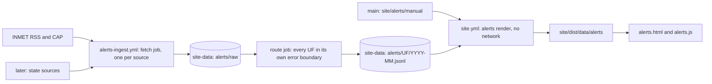

# MIP-0071: Official alerts per state — an append-only store with its own ingest, and a page that reads only the store

| | |
|---|---|
| **Status** | Draft — `Tasks: docs/MIPs/MIP-0071.tasks.md` |
| **Author** | Claude, for M. Hoffmann (#540, and the three requirements of 2026-09-30 listed in §2) |
| **Created** | 2026-09-30 |
| **Phase** | 0 for the store and the ingest (an offline data pipeline, like MIP-0056); 3 for the page, which ships through `site.yml` like MIP-0044's pages. Nothing here needs Phase 1 (MIP-0002's Telegram bot, still unbuilt), and sending alerts to Telegram is out of scope (§8) |
| **Related** | #540 (the request); #535 (the fetch/render split this follows); MIP-0034 (§4.1 INMET RSS and CAP 1.2, §4.1b id-walk backfill, §5.2 the map banner); MIP-0044 §11 (the drop-`Alerts` proposal, reversed here); MIP-0054 §5.8 and #536 (the page's string catalogs); MIP-0062 §4.3 (the Navy's avisos: 403, no feed); MIP-0008 §5.5 and `scripts/site-data-push.sh` (the `site-data` branch); MIP-0056 (the bathing-water store, and why it could not commit to `main`); MIP-0022 (the emergency line); MIP-0005 (the static site) |
| **Effort** | XL — a new `core/alerts` package (CAP parser, record, UF routing, pure store rules), four CLI modes, a scheduled workflow that writes to `site-data`, a render step in `site.yml`, and a new page with its own script. No new dependency |
| **Gain** | `user value` — an official warning for a visitor's state is one tap from the map, in the issuer's words with a link, plus a dated archive starting with RJ in September 2026; `infra/dev-loop` — the first data path built on #535's split, and an append-only store that later sources plug into |
| **Effort vs Gain** | `do next` — the maintainer asked for it, MIP-0034 verified INMET's feed in September, and task 1 (a short source check from a machine that can reach INMET) settles whether the September backfill is an id walk or an open question |
| **Depends on** | MIP-0034 shares the CAP parsing; this MIP builds the parser (the CAP half of MIP-0034 task 1) and the backfill (its task 6), so neither waits for the other. Only the page task waits for MIP-0054 task 1 (#536). #535 does not block: the ingest is its own workflow and the render reads only `site-data`, which `site.yml` already fetches; only the redeploy-on-new-alert trigger waits for it (§5.6). MIP-0044: the page is hand-written until its §5.1 generator exists. No Phase 1 gate. No paid resource: GitHub-hosted runners on a public repository |
| **Blocked by** | none |
| **Risk** | An archive that looks complete and isn't. An alert marola cannot route to a state, or an id INMET no longer serves, drops out of "every RJ alert for September" without a trace while the page reads as authoritative. The unrouted file (§5.3), the coverage manifest (§5.4) and the page's per-month coverage line are there so a gap shows |
| **Cost so far** | — |

## 1. Summary

marola.dev gets `alerts.html`: official warnings for every Brazilian state, INMET's first, active
ones on top and a dated archive by state and month, each in the issuer's words with a link to the
issuer. A scheduled ingest, separate from the site build, appends every alert to JSONL files per
state per month on the `site-data` branch, and the site build reads only those files. The archive
starts with Rio de Janeiro in September 2026, backfilled by walking INMET's alert ids if task 1
confirms they are still served.

## 2. Motivation

The nav has shown `Alerts soon` since #321/#324 with no design behind it, and MIP-0044 §11 proposed
dropping it; the maintainer wants the page instead (#540). MIP-0034 §5.2's banner shows an INMET
warning only while it is valid, fetched during the site build. That keeps no history, because the
RSS drops expired items (#540): a warning from 29 September leaves the feed within a day. Fetching
during the build is also what #535 says must stop (run 36729154478 failed a CSS-only deploy on one
Open-Meteo 503). The maintainer set three requirements on 2026-09-30:

1. The site reads alerts from RSS or from a store persisted as plain text or SQLite, and never
   re-fetches history.
2. marola holds every alert for the state of Rio de Janeiro in September 2026.
3. Every state gets alerts, independently of the others. INMET's feed is national, so one parse
   failure, or one state's future source hanging, must not take every state down.

## 3. User-visible change

The page in pt-BR, the default. Values in `<…>` come from the issuer's document. The 29/09 entry is
#540's reading of a search summary; task 7 replaces it with the real document.

```
Docs  Alertas  Notícias em breve  Sobre  Contato em breve  Doar em breve         [pt|en] GitHub
Alertas oficiais
O marola não é um serviço de alerta. Estes são avisos oficiais, reproduzidos sem alteração a
partir de quem os emitiu, e podem estar atrasados: confirme sempre no emissor.
Em emergência na água: acione os guarda-vidas ou ligue 193 (Bombeiros) / 192 (SAMU).

Estado [RJ ▾]   Mês [setembro de 2026 ▾]
INMET consultado às 14:07 (horário de Brasília), última ingestão com sucesso às 14:07
Setembro de 2026: ids INMET <primeiro>–<último> verificados, <n> sem resposta

ATIVOS AGORA — nenhum aviso ativo para RJ

ARQUIVO — setembro de 2026
| Perigo Potencial · Tempestade · INMET                                           expirado
| de 29/09/2026 09:25 até 29/09/2026 23:59 (horário de Brasília)
| Área: <areaDesc, como emitido> · <n> municípios ▸
| "<descrição do INMET, sem alteração>"
| ver no INMET · documento CAP
```

With `?lang=en` the chrome is English and the entry reads `Perigo Potencial (potential danger,
marola's translation) · Tempestade (storm) · INMET`, the issuer's text still in Portuguese (§5.7).

## 4. Data sources and dependencies reviewed

No issuer page could be read on 2026-09-30: every host below answered 403 to this session's egress
proxy (Appendix). **Verified** means MIP-0034 verified it on 2026-09-07/08, repeated here without a
re-check. **To verify** is task 1's checklist; where a §5 decision rests on one, §5 gives the
fallback.

### 4.1 INMET avisos: an RSS index plus one CAP 1.2 document per alert (picked, every UF)

Verified (MIP-0034 §4.1, §4.1a, §4.1b): `https://apiprevmet3.inmet.gov.br/avisos/rss` is RSS 2.0
with `<copyright>public domain</copyright>` and "O conteudo deste site, podera ser reproduzido desde
que citada a fonte", 85–89 live items; each `guid` resolves to a CAP 1.2 document at
`/avisos/rss/<id>` with `event`, `severity`, `urgency`, `certainty`, `onset`, `expires`,
`description`, `instruction`, `web`, `areaDesc` and a `polygon`. The RSS says `Perigo Potencial` /
`Perigo` / `Grande Perigo` where CAP says `Moderate` / `Severe` / `Extreme`. curl's default
User-Agent got no response. `/avisos/ativos` is undocumented JSON with `estados` and IBGE
municipality codes. Ids 55000, 50000 and 40000 (sent 2026-07-15, 2025-02-28, 2022-08-29) still
returned full CAP on 2026-09-08; `/avisos/rss/1000` returned 500; `/avisos` and `/avisos/todos` 404.

To verify (task 1):

1. Whether September 2026 ids still serve CAP; the backfill depends on it. MIP-0034's four samples
   (about 11 ids a day) put September near ids 55550–55950, by arithmetic, not a check.
2. Whether CAP carries INMET's Portuguese severity (`headline`, a `parameter`, elsewhere). If not,
   backfilled entries show `Moderate (CAP)`, never a Portuguese word marola derived (§5.2).
3. Whether CAP carries `geocode` IBGE municipality codes, which make UF routing exact (§5.3).
4. Whether INMET issues CAP `Update`/`Cancel` with `references`, edits a document in place under the
   same id, or neither.
5. Whether `Http`'s own User-Agent (`marola/0.1 (+https://github.com/h0ffmann/marola)`) gets a
   response, or only a browser-like one does.
6. The human page per alert and whether old ids resolve there: `avisos.inmet.gov.br/<id>`
   (MIP-0034's "Not checked"), and `alertas2.inmet.gov.br/<id>`, which a 2026-09-30 search summary
   said bulletins cite (the summary only, no page read).
7. A rate limit or terms of use beyond the copyright line. MIP-0034 found none documented.
8. Id density across September: which ids answer 404 or 500, and whether a gap is permanent.

### 4.2 Marinha do Brasil / CHM avisos de mau tempo (later, not designed)

The authoritative marine source (ressaca, strong winds): 403 in MIP-0034 §4.6 (2026-09-07),
MIP-0062 §4.3 (2026-09-19), #540 and here; no feed found. A Navy warning can be a manual record
(§5.5).

### 4.3 Rio's state and city civil defence: Alerta Rio, COR, Defesa Civil RJ (not verified)

`alertario.rio.rj.gov.br`, `cor.rio` and `defesacivil.rj.gov.br` answered 403 here; format, feed,
history and licence are unknown. Each is a candidate RJ-only adapter after its own §4 check.

### 4.4 The store format

| Option | Verdict | Why |
|---|---|---|
| JSONL, one file per UF per month, append-only | **picked** | Diffable and reviewable; append-only is checkable as a byte prefix; nested fields (municipalities, references) and multi-line verbatim text fit; `jq` or DuckDB read it without marola; each UF's files are separate from every other UF's |
| SQLite | rejected | A binary rewritten on every run: no diff, no review, and two writers conflict on the one file even when they touch different states; the build would need a JDBC reader. MIP-0056 §4.4 rejected it for the same reasons |
| CSV | rejected | Multi-line verbatim descriptions and list fields make quoting fragile |
| One JSON file per alert (MIP-0034 task 6's shape) | rejected | About 4,000 files a year, and no single file to check for append-only |

### 4.5 Dependencies

None new. `java.xml` parses CAP (MIP-0034 §4.7); `core/http` retries 429, 502, 503 and 504 with
exponential backoff (`Http.RetryableStatuses`, `backoffFor`, read today); JSON goes through
`marola.json`. CAP's enumerations (§5.8) come from the OASIS CAP 1.2 standard, not re-read here.
Pick: INMET for all 27 UFs from the first delivery; every other issuer waits for its own check.

## 5. Design

### 5.1 The pipeline



### 5.2 The record

One JSON object per line; values are MIP-0034's alert 55649 where verified, `<…>` otherwise:

```json
{"v":1,"key":"inmet:55649","version":"sha256:<hex>","supersedes":null,
 "issuer":"INMET","issuer_id":"55649","cap_identifier":"<CAP identifier>","cap_status":"Actual",
 "uf":"AM","msg_type":"Alert","references":[],
 "event":"Chuvas Intensas","severity_label":"Perigo Potencial","severity":"Moderate",
 "urgency":"Future","certainty":"Likely","sent":"2026-09-08T<…>-03:00",
 "onset":"2026-09-11T09:34:00-03:00","expires":"2026-09-11T23:59:00-03:00",
 "headline":"<…>","description":"<…>","instruction":"<…>","area_desc":"<…>",
 "municipalities":[{"ibge":"<7 digits>","name":"<município>"}],
 "web":"<issuer page>","source_url":"https://apiprevmet3.inmet.gov.br/avisos/rss/55649",
 "raw":"alerts/raw/inmet/2026-09/55649-<version8>.xml","ingested_at":"<UTC>","via":"live"}
```

`key` is `issuer:issuer_id`; `version` is the sha256 of the line's canonical JSON without `version`,
`supersedes`, `raw`, `ingested_at` and `via`; `(key, uf, version)` is the dedup key.
`severity_label` is the issuer's own word or `null`, never computed from `severity`, which is the
CAP value verbatim and sets the page's order and colour; a non-CAP source maps to it only from a
table the issuer publishes, else `Unknown`. Times keep the issuer's offset, text fields are the
issuer's after XML entity decoding and nothing else, and the page shows only `cap_status` `Actual`.
Polygons stay in the raw document: a 291-point polygon copied into five UFs' files would be most of
the store, for nothing the page shows.

### 5.3 Layout, routing, retention, corrections

| Path | Branch | Written | Holds |
|---|---|---|---|
| `alerts/<UF>/<YYYY-MM>.jsonl` | `site-data` | appended | §5.2 lines, filed by the month of `sent` in `America/Sao_Paulo` |
| `alerts/<UF>/status.json` | `site-data` | overwritten | last attempt and success per source, last error |
| `alerts/raw/<source>/<YYYY-MM>/<issuer_id>-<version8>.xml` | `site-data` | once | the document as fetched |
| `alerts/manifest/<source>.json` | `site-data` | overwritten | newest id, RSS item hashes, pending and unresolved ids, id ranges walked per month |
| `alerts/_unrouted/<YYYY-MM>.jsonl` | `site-data` | appended | alerts no UF rule matched |
| `site/alerts/sources.json` | `main` | by PR | the 27 UFs and their sources (v1: all `inmet`) |
| `site/alerts/manual/<UF>.jsonl` | `main` | by PR | human-curated records (§5.5) |

`UfResolver` (pure) files an alert under every UF it covers: by IBGE municipality code when the
document has one (the first two digits are the UF's code), else by `areaDesc`'s mesoregion names
against `core/src/main/resources/alerts/mesorregioes.json` (IBGE's list, source in the file), else
in `_unrouted/`, which the workflow summary and every UF's status line for that month report. The
month view shows every alert whose `[onset, expires]` overlaps the month, so the render also reads
the previous month's file.

Retention is forever, for lines and raw documents. At about 11 alerts a day and 9 KB per CAP
document (MIP-0034's one measured document), that is roughly 36 MB a year before git compression;
revisit at MIP-0056 §8's 200 MB. `alerts/` is the first thing on `site-data` that cannot be
regenerated, so task 4 adds "never reset or squash `site-data` without carrying `alerts/` over" to
`CI-CD.md`; nothing enforces that rule mechanically.

`AlertStore.append` keeps only lines whose `(key, uf, version)` is new, so a re-run writes nothing.
Changed content under the same id is a new line with the new `version` and `supersedes` naming the
old one; a CAP `Update` or `Cancel` names its `references` in `supersedes`, and the page keeps the
old entry marked "atualizado" or "cancelado pelo emissor em …". After a parser fix, lines are
re-derived from `raw/` with `via: "reparse"`. Before every push, `--alerts-check` requires each
JSONL file at the new tip to start with its bytes at the old tip, every line to parse, and no
`(key, uf, version)` to repeat.

### 5.4 The ingest: `alerts-ingest.yml` and the INMET adapter

`InmetSource`, per run:

1. Fetch the RSS once and compare each item's hash (title, description, `pubDate`) with
   `manifest/inmet.json`.
2. Fetch CAP for each id that is new, whose item changed, or that lies between the manifest's newest
   id and the feed's; that walk recovers a skipped run or a short-lived alert, if INMET still serves
   the id (§4.1 item 1).
3. A 429 or 5xx that survives `Http`'s own retries puts the id in `pending`, and after 24 tries in
   `unresolved`, which the coverage line lists. One failing id never fails the run.
4. Requests are sequential, 1 s apart; `Retry-After` is honoured once #535 item 4 adds it to `Http`.

Backfill is the same code over `--from-id`/`--to-id`, capped by `--max` (default 600), written as
`via: "backfill"` and resumable from the manifest.

The workflow runs hourly at minute 23 and on `workflow_dispatch` (`mode` incremental or backfill,
`from_id`, `to_id`, `source`, `dry_run`), under `concurrency: alerts-ingest` without cancelling, and
deploys nothing. Job `fetch` is a matrix over `site/alerts/sources.json`'s sources (v1: `[inmet]`),
`fail-fast: false`, 15 minutes each: `--alerts-fetch <source>`, then a push of
`alerts/raw/<source>/` and its manifest through `scripts/site-data-push.sh`. Job `route` (`needs:
fetch`, `if: always()`, no network) runs `--alerts-route` over the months the fetch touched and
`--alerts-check`, then pushes `alerts/<UF>/` and `alerts/_unrouted/`. Each UF routes in its own
error boundary: its failure goes into its `status.json`, the other UFs are pushed, and the job ends
red. A state source (Alerta Rio, say) is one `sources.json` entry and one `AlertSource`, so one more
matrix entry that can hang or fail alone.

### 5.5 Manual records

For an issuer with no adapter (the Navy today, or #540's report if its issuer is not INMET), a
person adds a §5.2 line with `via: "manual"` to `site/alerts/manual/<UF>.jsonl` by pull request,
with the text copied verbatim from the issuer's page, `source_url`, and `ingested_at` set to the
access date. The render merges these; an adapter's line for the same `key` wins.

### 5.6 The render and the site build (#535)

`--alerts-render <store> <manual> <out>` reads JSONL (never raw CAP), makes no request (a spec fails
on any `Http` call), and writes `data/alerts/index.json` (`generated_at`, the `site-data` commit
read, and all 27 UFs with their months, counts, per-source last attempt and success, unrouted count
and per-month coverage; with no `alerts/` yet, it says so), `data/alerts/<UF>/<YYYY-MM>.json` (every
alert valid in the month at its latest version, updates and cancellations marked, newest onset
first) and `data/alerts/active.json` (unexpired at `generated_at`; the page re-checks with its own
clock).

`site.yml` extracts `alerts/` from `site-data` into `$RUNNER_TEMP` in the step that already copies
`smoke`, `coverage`, `stats` and `docs` (the store is not published) and runs the render with
`continue-on-error: true`, so a broken render never blocks the map's deploy; the page then says
"Alertas indisponíveis". New alerts appear at the next site build, up to three hours later.
Triggering `site.yml` from the ingest (`workflow_run`) would make that minutes, but while every
build re-fetches Overpass and Open-Meteo it would mean up to 24 full builds a day, #535's failure
mode. That trigger waits for #535's render-only path; until then the status line shows the lag.

### 5.7 The page

`site/static/alerts.html` is hand-written like `about.html` until MIP-0044 §5.1's generator exists:
`<html lang="pt-BR">`, every chrome string through `t()` and `site/i18n/{pt-BR,en}.json` with a note
in `context.json` (MIP-0054 §5.8), CSP `default-src 'self'; img-src 'self'; object-src 'none'`, and
§3's fixed disclaimer and MIP-0022's 193/192 line. `alerts.js` fetches only relative `data/alerts/…`
paths. State and month are `<select>`s mirrored in `?uf=RJ&month=2026-09`, one permalink per month;
with no `uf` the page lists every UF's active alerts. The map's `app.js` sets the nav link's `?uf=`
from the selected area (`site/areas.json` gains `uf`: floripa SC, rio RJ, salvador BA).

An entry has the severity label as named (or the CAP value marked `(CAP)`), event, issuer,
`area_desc`, a collapsed municipality list, validity in `America/Sao_Paulo` (`Intl.DateTimeFormat`),
status (ativo, expirado, atualizado, cancelado), `description` and `instruction` in a
`<blockquote lang="pt-BR">`, and links to `web` and `source_url`. Colour follows `severity`, always
beside the text label. Alerts are ordered by CAP severity, then onset, with no summary, paraphrase
or ranking against the swim score. In `en`, event, severity label and status get glosses from
catalog keys (`alerts.severity.perigo_potencial`) marked "marola's translation"; a word without a
key gets none, and the free text, introduced as "Official text, in Portuguese as issued", is never
translated. `Alerts` becomes `<a href="alerts.html">` in every page's nav.

### 5.8 Scala shape

```scala
// core/src/main/scala/marola/alerts/ — pure, no I/O
enum Uf(val ibge: Int):  // all 27, e.g. RJ(33), SC(42), BA(29)
  case RJ extends Uf(33) // …
enum CapSeverity:  case Extreme, Severe, Moderate, Minor, Unknown
enum Via:          case Live, Backfill, Reparse, Manual
final case class AlertRecord(/* §5.2's fields; severityLabel: Option[String], uf: Uf, via: Via */)
object CapParser:  def parse(xml: String): Either[CapError, CapAlert]
object UfResolver: def ufs(alert: CapAlert): Set[Uf]
object AlertStore:
  def append(present: Set[(String, Uf, String)], incoming: List[AlertRecord]): List[AlertRecord]
  def resolve(lines: List[AlertRecord]): List[ResolvedAlert]
  def isAppendOnly(before: String, after: String): Boolean
  def monthOf(sent: OffsetDateTime): YearMonth // America/Sao_Paulo
trait AlertSource: // one per issuer in sources.json; failures stay inside FetchResult
  def fetch(manifest: Manifest, mode: Mode): FetchResult < Sync
// cli/src/main/scala/marola/alerts/AlertsCli.scala: --alerts-fetch, --alerts-route,
// --alerts-check, --alerts-render
```

All of it is deterministic; no model sees or produces anything on this path.

## 6. Scoring / safety impact

None to `Swimability.score`: an alert ranks and suppresses nothing (MIP-0034 §6 stands; a scoring
change needs its own MIP). The safety content is the presentation (§3, §5.7): verbatim text, the
issuer's severity words, the disclaimer and 193/192 line, staleness and coverage lines, cancelled
alerts kept visible, and "INMET" rather than "official marine warning" (MIP-0034 §8).

## 7. Verification plan

- Task 1, live, from a machine that reaches INMET:
  `curl -sS -A "$UA" https://apiprevmet3.inmet.gov.br/avisos/rss`, then
  `curl -sS -A "$UA" https://apiprevmet3.inmet.gov.br/avisos/rss/<id>`, bisecting on `<sent>` for
  the first id sent from 2026-08-25 (late-August alerts can be valid in September) and the last sent
  before 2026-10-01; the same with `Http`'s User-Agent (§4.1 item 5); the `web` URL of an old id.
  Each answer goes into §4.1 and the Appendix with its date; the documents become fixtures.
- Tests, each with its cases, are in [`MIP-0071.tasks.md`](./MIP-0071.tasks.md); `AlertsRenderSpec`
  runs on a transport that fails on any request.
- Done when `alerts.html` is live with every UF listed; RJ September 2026 shows every alert the
  backfill found, with a coverage line naming the ids walked and any unresolved; #540's report is
  among them (or is a manual record); and a site build with the ingest off for a day still deploys
  and shows the data's age.

## 8. Risks, limitations, and honest caveats

- If INMET no longer serves September's ids, the backfill becomes §11.2's decision, and the page
  says where RJ's archive starts instead of implying it covers the whole month.
- INMET's areas are mesoregions and municipality lists, shown as issued; no beach-level claim.
- No push, Telegram or e-mail: volunteering a warning is the proactive behaviour `FUTURE-WORK.md`
  §9.2 puts behind its own human gate.
- INMET is the second-best marine source (MIP-0034 §8) while the Navy's avisos stay unreachable.

## 9. Alternatives considered

- Do nothing and drop the nav item (MIP-0044 §11): the maintainer rejected it (#540).
- Amend MIP-0034. It already holds three separate things, and a store, archive, page and per-UF
  isolation are a new surface and data path. MIP-0034 keeps the CLI banner and the map banner.
- The site build reads INMET's RSS (requirement 1's RSS option): a network call in the build
  (#535), no history since the feed drops expired items, and no per-UF split.
- SQLite, CSV or one file per alert: §4.4.
- The store on `main`: its ruleset requires a pull request (MIP-0056 §5.4, API check of
  2026-09-14, not re-checked), so hourly commits would need a bypass nobody has granted.
  `site-data` already takes bot pushes from three workflows through `site-data-push.sh` without
  content conflicts, since each writer owns its directory, and #535 proposes it for board snapshots.
- One ingest job per UF: INMET is one national feed, so 27 jobs would multiply the load on a host
  with no documented limit and isolate nothing, since an INMET outage hits every UF. Isolation sits
  where UFs differ: their files, their routing, their own sources.
- An orphan `alerts-data` branch would keep the archive out of `api-docs.yml`'s churn, for a second
  push target and a second fetch in `site.yml`. Revisit if `site-data` ever needs a reset.

## 11. Open questions

1. Which report is "the RJ severity report of 2026-09-29" (#540's first acceptance criterion)? If
   INMET's, the backfill contains it; otherwise it enters as a manual record (§5.5).
2. If INMET does not serve September's ids, where does the backfill come from? (a) An INMET data
   request under the access-to-information law (Lei 12.527/2011); (b) Wayback Machine captures of
   the RSS during September, partial by construction, though each item is INMET's own document; (c)
   start the archive on the first ingest day and say so on the page. Proposal: (a) and (c) together.
   News articles are secondary and paraphrased, so they are not an option.
3. All 27 UFs in the state picker from day one, inland states included? The store holds them either
   way. Proposal: yes, since the requirement says every state.
4. Retention of raw documents beyond some number of years, if the 200 MB threshold arrives.
5. Map banner before or after this page? Proposal: after, as MIP-0034 task 5 reading `active.json`;
   it is not in this MIP's tasks.
6. Ask the Navy for a feed (MIP-0034 §11.3), and check Rio's civil-defence sources (§4.3).

## Appendix

### Checked live

- 2026-09-30, `curl` through this session's proxy, browser-like User-Agent, 20 s timeout: every URL
  returned `curl: (56) CONNECT tunnel failed, response 403` (no status from the host itself):
  `https://apiprevmet3.inmet.gov.br/avisos/rss`, `/avisos/rss/55649`, `/avisos/ativos`,
  `https://avisos.inmet.gov.br/`, `https://alertas2.inmet.gov.br/`,
  `https://www.marinha.mil.br/chm/dados-do-smm-avisos-de-mau-tempo/avisos-de-mau-tempo`,
  `https://alertario.rio.rj.gov.br/`, `https://cor.rio/`, `https://www.defesacivil.rj.gov.br/`.
- 2026-09-30, the WebFetch tool on `https://apiprevmet3.inmet.gov.br/avisos/rss` and
  `/avisos/rss/55649`: `EGRESS_BLOCKED`.
- 2026-09-30, two web searches for INMET alert history. No archive endpoint or documented history
  API came up. One summary said bulletins cite `alertas2.inmet.gov.br/<id>` as an alert's source
  URL, and that INMET's levels are yellow, orange and red; both are summaries, no page was read.
- 2026-09-30, this repository at `73ec8a1`: `.github/workflows/site.yml` (the `site-data` copy loop
  for `smoke coverage stats docs`, the publish allowlist, the 3-hourly schedule),
  `.github/workflows/api-docs.yml` and `ci.yml` (their `site-data` pushes),
  `scripts/site-data-push.sh`, `scripts/stamp_site_version.sh` (stamps `index.html` only),
  `core/src/main/scala/marola/http/Http.scala` (retries on 429/502/503/504, exponential backoff, no
  `Retry-After`, the User-Agent string), `site/static/index.html` and `about.html` (the nav, 4
  disabled items), `scripts/site_check.js` (the disabled-item count), `site/static/app.js`
  (`?area=` in the URL, no stored area), `site/areas.json` (no `uf` field), `git ls-tree site-data`
  (`coverage docs smoke stats`, 168 commits).

### Not checked

- Everything under §4.1 "To verify", and every INMET fact marked verified, which is MIP-0034's from
  2026-09-07/08, repeated here.
- The September id range (~55550–55950) and the ~11 ids a day: arithmetic on MIP-0034's four
  samples.
- The ~9 KB per CAP document and the ~36 MB a year: one document's size times that rate.
- CAP 1.2's element names and enumerations (`severity`, `msgType`, `references`, `status`), from
  memory of the OASIS standard.
- IBGE conventions: the 27 UF codes and a municipality code's first two digits being its UF; and
  whether INMET's `areaDesc` mesoregion names match IBGE's list one to one.
- `main`'s ruleset requiring a pull request: MIP-0056's API check of 2026-09-14.
- Whether GitHub runs an hourly schedule on time; the gap walk exists because it may not.
