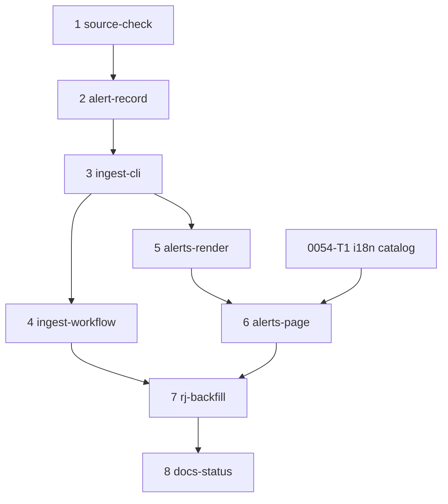

# MIP-0071 tasks — official alerts per state

Ordered delivery of [MIP-0071](./MIP-0071-official-alerts-per-state.md) as stacked PRs
(`.claude/skills/mip-tasks/SKILL.md`, `scripts/stack.sh`). Branch `mip-0071/<k>-<slug>`, each based
on the previous; merge bottom-up, `scripts/stack.sh restack` after each squash-merge. Draft: no row
is filed as an issue yet, and none is `agent-ready` until the MIP is accepted and a human labels it.

Two parts of this list wait on answers only a human can give: which report #540 means by "the RJ
severity report of 2026-09-29" (before task 6's fixture is final and before task 7 closes), and, if
task 1 finds INMET no longer serves September's ids, the choice in the MIP's §11.2 (before task 7).

| # | slug | delivers | tests (must exist before the PR) | depends on |
|---|---|---|---|---|
| 1 | source-check | Run from a machine that reaches INMET (this sandbox gets 403): the MIP's §7 commands. Answers §4.1's eight to-verify items in §4.1 and the Appendix, each with URL, date and result, and records the September id range (first id sent from 2026-08-25, last sent before 2026-10-01), found by bisecting on `sent`. Captures fixtures under `core/src/test/resources/alerts/`: `inmet-rss.xml`; one RJ CAP document from September (#540's report if the maintainer has named it); one alert covering several UFs; one without `polygon` or `geocode` if any exists; one `Update` or `Cancel` if INMET issues them. Docs and fixtures only | No code to test. The evidence is the Appendix lines and the fixture files; `python3 scripts/mip_graph.py --check` stays clean | – |
| 2 | alert-record | `core/src/main/scala/marola/alerts/`: `Uf` (27, IBGE codes), `CapSeverity`, `Via`, `AlertRecord` and its JSON codec (MIP §5.2), `CapParser` (the CAP half of MIP-0034 task 1), `UfResolver` (IBGE codes, then `core/src/main/resources/alerts/mesorregioes.json` with its IBGE source, then unrouted), `AlertStore` (`append`, `resolve`, `isAppendOnly`, `monthOf`). Pure, no I/O | `CapParserSpec` on task 1's fixtures: every §5.2 field; `severityLabel` is `None` when the document has no Portuguese label (never derived from the CAP value); a document without a polygon parses. `UfResolverSpec`: the geocode path, the mesoregion path, an unknown area goes to unrouted, no mesoregion name maps to two UFs, a multi-UF alert yields each UF once. `AlertStoreSpec`: the same batch appended twice adds nothing the second time; changed content appends one line whose `supersedes` names the old version; a `Cancel` resolves the referenced alert as cancelled and keeps it; `isAppendOnly` rejects an edited, removed or reordered line and accepts a pure append; an alert sent 2026-09-30T23:30-03:00 lands in 2026-09 | 1 |
| 3 | ingest-cli | `AlertSource`, `InmetSource` (MIP §5.4 steps 1–4: one RSS fetch, item-hash change detection, the gap walk, `pending` then `unresolved` after 24 tries, 1 s pacing, the User-Agent task 1 found necessary), manifest read and write, and the `cli` modes `--alerts-fetch`, `--alerts-route`, `--alerts-check` over a store directory, with a per-UF error boundary writing `status.json`. `just alerts-ingest`; `docs/1-Using-marola/RUN-LOCALLY.md` gains the command | `InmetSourceSpec` through `Http.withTransport` on the fixtures: new ids are fetched; an unchanged RSS item is not re-fetched; ids between the manifest's newest and the feed's are walked; a 500 on one id puts it in `pending` and the others are stored; 24 failures move it to `unresolved`. `AlertsRouteSpec`: a store whose RJ file has a corrupt line marks RJ failed in `RJ/status.json` and still writes SC and BA; routing the same raw documents twice writes nothing. One `E2E`-tagged live test, run by `just e2e`, excluded from `just test` | 2 |
| 4 | ingest-workflow | `.github/workflows/alerts-ingest.yml` (MIP §5.4: hourly plus dispatch; a `fetch` matrix over `site/alerts/sources.json` with `fail-fast: false`; `route` with `if: always()`; pushes through `scripts/site-data-push.sh`); `site/alerts/sources.json` (all 27 UFs on `inmet`); `docs/3-Working-on-the-repo/CI-CD.md` gains the workflow's row and the rule "never reset or squash `site-data` without carrying `alerts/` over" | actionlint and `scripts/workflow_runners.py` in `quality-other`; one `dry_run` dispatch and one real incremental run on the branch, both linked in the PR; a second run with nothing new pushes nothing | 3 |
| 5 | alerts-render | `--alerts-render` (MIP §5.6): `data/alerts/index.json` with all 27 UFs, `data/alerts/<UF>/<YYYY-MM>.json`, `data/alerts/active.json`, manual records from `site/alerts/manual/` merged with the adapter's line winning on the same `key`. `site.yml` extracts `alerts/` from `site-data` into `$RUNNER_TEMP` and runs the render in a `continue-on-error` step; the store is not published. `docs/2-Building-marola/ARCHITECTURE.md` gains the alert data path | `AlertsRenderSpec` with an `Http` transport that fails the test on any request: a fixture store gives the three outputs; an alert sent in 2026-08 and valid into September is in the 2026-09 file; a cancelled alert is present and marked; an empty store gives an index that says so; a manual line and an adapter line with one `key` render once, as the adapter's. actionlint | 3 |
| 6 | alerts-page | `site/static/alerts.html` and `alerts.js` (MIP §5.7), `.alerts` styles in `style.css`, catalog keys with context notes in `site/i18n/pt-BR.json`, `en.json` and `context.json`; `Alerts` as a link in the nav of every page; `app.js` sets that link's `?uf=` from the selected area and `site/areas.json` gains `uf`; `site.yml`'s allowlist and `scripts/stamp_site_version.sh` cover the new page; `site/fixtures/alerts/` rendered from task 1's RJ fixture; MIP-0044 §11's note already points here | `scripts/site_check.js`, alerts block: the nav on `index.html`, `about.html` and `alerts.html` has `<a href="alerts.html">` and 3 disabled items instead of 4; `alerts.html`'s CSP names no origin but `'self'`; `alerts.js` fetches no absolute URL; from the fixtures the RJ 2026-09-29 entry (or task 1's RJ document) renders issuer, severity label, valid from, valid to, an `https://` link and a `lang="pt-BR"` blockquote; `?lang=en` adds glosses marked as translation and leaves the blockquote unchanged; a missing `index.json` renders the unavailable notice; the `x-pseudo` pass finds no chrome outside `t()`. Manual: screenshots at 390 px and 1280 px | 5, 0054-T1 |
| 7 | rj-backfill | A `workflow_dispatch` with `mode=backfill` over task 1's September id range, and the `site-data` commit it pushes. The MIP's §4.1 and Appendix gain the result: ids walked, unresolved ids, RJ alerts per day. If task 1 found the ids unserved, this task is the maintainer's §11.2 choice, carried out and written up instead | `--alerts-check` green on the pushed tip; `alerts/manifest/inmet.json` covers the whole range with only listed unresolved ids; #540's report is in `alerts/RJ/2026-09.jsonl`, or in a `site/alerts/manual/RJ.jsonl` PR if its issuer has no adapter; the live page shows RJ September with its coverage line | 4, 6 |
| 8 | docs-status | MIP-0071 flips to Implemented with the PR links (or Partially implemented naming what is left); its `docs/MIPs/README.md` row matches; `docs/4-Research-and-plans/FUTURE-WORK.md` §9.2 points here for the official-feed half | `python3 scripts/mip_graph.py --check`; `just build && just test && just quality` | 7 |

Task DAG, edges exactly equal to the `depends on` column above:

## Sequencing notes

- **Task 1 goes first because it can change the design.** If CAP has no Portuguese severity, §5.2's
  `severity_label` is null for backfilled lines; if it has IBGE geocodes, `mesorregioes.json` shrinks
  to a fallback; if September's ids are gone, task 7 changes shape. Nothing after it should start
  before its answers are in the MIP.
- **Task 5 needs only task 3**, so it can be written beside task 4. `scripts/stack.sh` wants a line,
  so it is stacked after 4. Tasks 4 and 5 touch different workflows (`alerts-ingest.yml` is new;
  `site.yml` gains one step), so a restack is a clean rebase.
- **Task 6 lands after MIP-0054 task 1 (#536)** and rebases over task 2 (#537) if that is still in
  flight: all three edit the nav, `site_check.js` and the catalogs. MIP-0044's menu (§5.7) edits the
  same nav; whichever lands second carries the `Alerts` link over.
- **Task 7 is data, not code.** The ≤400-line rule does not apply; the result lives on `site-data`,
  and its PR is the MIP's recorded evidence. It depends on task 6 only so that "shown on the page",
  the maintainer's second requirement, is checked on the real page.
- **Restack hazards:** tasks 5 and 6 both edit `site.yml` (a render step, then the allowlist).
  Both are additive; keep them to separate steps.

## Later (not filed)

- **site-trigger**: add `Alerts ingest` to `site.yml`'s `workflow_run` list, once #535's
  render-only path means a deploy no longer re-fetches the boards (MIP §5.6).
- **navy-chm**: an adapter for the Navy's avisos de mau tempo, once §4.2 has a fetchable source.
- **rj-civil-defence**: Alerta Rio, COR or Defesa Civil RJ, each after its own §4 check.
- **map-banner**: MIP-0034 task 5, re-planned to read `data/alerts/active.json`, with polygons from
  the render.
