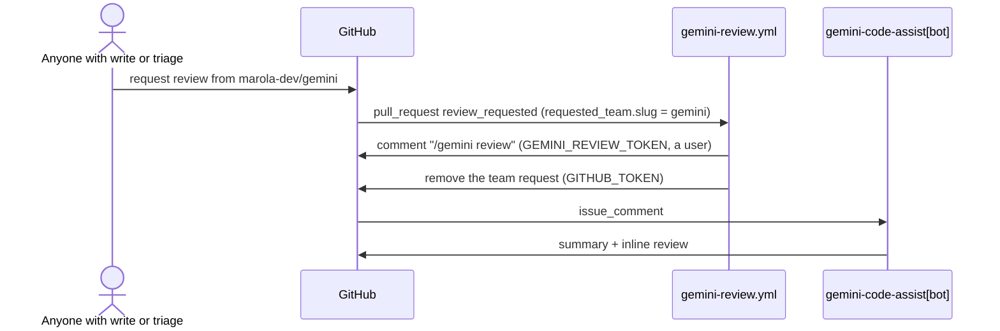

# MIP-0072: A Gemini review on request, by adding the Gemini reviewer

| | |
|---|---|
| **Status** | Draft, issue #546. `Tasks: docs/MIPs/MIP-0072.tasks.md` |
| **Author** | Claude, for M. Hoffmann |
| **Created** | 2026-09-30 |
| **Phase** | 0 (dev-loop; no user-facing surface) |
| **Related** | `GEMINI-CODE-ASSIST.md` (#400; this MIP extends its §2 and corrects §3/§4), `DEV-FLOW.md` §5 route 4, MIP-0060 (§5.5 reserved the hosted route for a human go-ahead), MIP-0065 (`CI-CD.md`, the hosted-runner rule, the maintainer's manual settings), MIP-0063 (issue projection) |
| **Effort** | L by the rubric (a new CI workflow), small in lines: one ~35-line workflow and edits to three docs, no script, no Scala. Most of the work is the human-only install (§5.4) |
| **Gain** | `infra/dev-loop`: one gesture anyone with write or triage access can make, from the PR sidebar or `gh pr edit --add-reviewer`; `cost/ops`: a hosted review at $0 during Google's Preview, before a paid `/code-review` looks |
| **Effort vs Gain** | `do next`, gated on the human install (task H): until the app is on `marola-dev`, neither the gesture nor `/gemini review` does anything |
| **Depends on** | No MIP must land first. The `AGENTS.md` cost gate applies: the only install path left needs a GCP project with a billing account attached (§4.1), so a human confirms before anything is set up. Not gated by Phase 1. Shares `CI-CD.md` and `DEV-FLOW.md` §5 with MIP-0060's unbuilt tasks 2–3 (different rows) |
| **Blocked by** | none |
| **Risk** | Google changes the offer again. The consumer app was shut down on 2026-07-17 and the enterprise version is Preview; a charge or a second shutdown would strand the install and this workflow with it |
| **Cost so far** | — |

## 1. Summary

The maintainer wants a Gemini Code Assist review to start when someone adds "the Gemini reviewer"
to a PR; no gesture does that today. This MIP makes "the Gemini reviewer" an empty org team,
`marola-dev/gemini`. Requesting it runs a small workflow that posts `/gemini review` under a
fine-grained token (third-party repos report that Gemini ignores `github-actions[bot]`, §4.2) and
then removes the team request. Most of the work is a human's: the enterprise app install through
Google Cloud, the team and the token.

## 2. Motivation

State on 2026-09-30. #400 did the repo side: `.gemini/config.yaml` turns off review-on-open
(`pull_request_opened.code_review: false`), so Gemini reviews only when asked, and
`.gemini/styleguide.md` carries the `AGENTS.md` subset a diff reviewer can check. The app is not in
use: no `gemini-code-assist[bot]` comment and no `/gemini` comment exists on any issue or PR (REST
scan, appendix), and nothing suggests it is installed on `marola-dev` (reading that needs org-admin
rights).

`GEMINI-CODE-ASSIST.md` calls the repo private and installs on `h0ffmann/marola`, but the repo is
public under the `marola-dev` org (appendix); it does not mention the consumer app's shutdown on
2026-07-17 (§4.1), and its §4 sketch picks the Developer Connect app (§4.4). Typing is the only
trigger (`DEV-FLOW.md` §5 route 4); no workflow listens to `review_requested` (`grep` over
`.github/workflows/`), and a bot can't simply be requested as a reviewer (§4.3).

## 3. User-visible change

Before: nothing reviews a PR, and no `/gemini review` has ever been answered on marola (§2).

After (PR timeline):

```text
brunogbv requested a review from marola-dev/gemini
h0ffmann commented: /gemini review                  (gemini-review.yml, GEMINI_REVIEW_TOKEN)
github-actions removed the review request for marola-dev/gemini
gemini-code-assist[bot] reviewed: one summary, ≤ 10 inline comments at MEDIUM or above
```

From a terminal: `gh pr edit <N> --add-reviewer marola-dev/gemini`. Typing `/gemini review` by
hand keeps working and stays the route on a fork PR. The comment always carries the token owner's
name; the first timeline line records who asked.

## 4. Data sources and dependencies reviewed

This sandbox's proxy blocks `developers.google.com`, `docs.cloud.google.com`, `docs.github.com`
and `codeassist.google`. Claims about those pages come from search-result summaries and are marked
so; the appendix lists what was fetched directly.

### 4.1 Gemini Code Assist on GitHub

- Google's deprecation page (search summary): the consumer version was deprecated on 2026-06-18
  (no new installs) and shut down on 2026-07-17; the enterprise version is not affected. The app's
  GitHub page (fetched) agrees, "This app is only available for Google Cloud customers", and its
  Marketplace listing returns 404.
- The enterprise version is installed through Google Cloud, as a Developer Connect connection
  created from Gemini Code Assist → Agents & Tools → Source Code Management (search summary; the
  same steps as `GEMINI-CODE-ASSIST.md` §3). "No charges ... during Preview", but reviews stop when
  the project has no valid billing account (search summary). Google's 2025-10-15 blog (fetched)
  also announces the public preview at no charge.
- With review-on-open off, Gemini answers PR comments: `/gemini review`, `/gemini summary`,
  `/gemini <question>`, `/gemini help`. It "listens to comments from any pull request contributor,
  and decides whether it should respond" (search summary). Nothing documents a reaction to
  `review_requested`.
- `pull_request_opened.include_drafts` (default true; search summary of the customize page)
  "enables agent functionality on draft pull requests". marola sets it false; whether that also
  silences `/gemini review` on a draft is **to verify** (task H).

### 4.2 Whether Gemini answers `github-actions[bot]`

The only evidence is third-party. `mikejmckinney/CCTC`'s `agent-review-on-push.yml` (read at
`9847e6d`) posts `/gemini review` with a user PAT because "Gemini Code Assist filters slash commands
posted by `github-actions[bot]` to prevent reviewer loops, so a comment posted under GITHUB_TOKEN is
silently ignored". `peanutDD/upload-download-util` does the same through `GEMINI_REVIEW_TOKEN ||
GITHUB_TOKEN`. Google says nothing either way, and whether comments from other app bots are also
dropped is unknown. **To verify:** task H posts once with the token.

### 4.3 Requesting a reviewer on GitHub

- `github/docs` `pull-request-reviews.md` (read at `d45a621`): "You can request a review from a
  person or team with read access to the repository"; with code review assignment on, "specific
  members will be requested and the team will be removed as a reviewer".
- The `review_requested` payload (`octokit/webhooks` schema, `main`) carries either
  `requested_reviewer` (a user) or `requested_team`, never both.
- For bots, the CCTC workflow records REST `requested_reviewers` answering 422 "Reviews may only be
  requested from collaborators" for Copilot's bot login. GraphQL `requestReviewsByLogin` has a
  `botLogins` field (`cli/cli` `api/queries_pr_review.go`), which `gh` fills only for Copilot;
  whether it accepts `gemini-code-assist[bot]` is **not checked**.
- **Not checked:** whether an empty team can be requested, and whether it must be visible rather
  than secret. Task H tries it on a throwaway PR.

### 4.4 Developer Connect's app choice

`googleapis` `developer_connect.proto`: `GitHubConfig.GitHubApp` is `DEVELOPER_CONNECT = 1`,
`FIREBASE = 2`, `GEMINI_CODE_ASSIST = 3` ("The Gemini Code Assist Application").
`GEMINI-CODE-ASSIST.md` §4's Besom sketch sets `githubApp = "DEVELOPER_CONNECT"`, which likely
explains its open question about whether the reviewer picks up an API-made connection. Recorded
for the Besom candidate MIP; this MIP uses the console path.

### 4.5 This repo

Public, owned by the `marola-dev` organisation (REST). Fine-grained tokens scoped to `marola-dev`
wait for an org owner's approval (#496, the scala-steward token). Only `marola-sea-publish.yml`
may be self-hosted (`scripts/workflow_runners.py`); a new `pull_request` workflow runs on
`ubuntu-latest`, free on a public repo (MIP-0065).

**Pick:** the enterprise app via the console (§4.1), triggered by a team review request (§4.3),
the command posted under a user token (§4.2).

## 5. Design

### 5.1 The gesture

"The Gemini reviewer" is the org team `marola-dev/gemini`: visible, no members, read access to
`marola`, code review assignment off. It shows in the Reviewers picker, and `gh pr edit
--add-reviewer marola-dev/gemini` works from a terminal. With no members, it notifies nobody.

### 5.2 `.github/workflows/gemini-review.yml` (task 2 writes it; sketch passes actionlint 1.7.12)

```yaml
name: Gemini review on request
on:
  pull_request:
    types: [review_requested]
concurrency:
  group: gemini-review-${{ github.event.pull_request.number }}
permissions:
  pull-requests: write
jobs:
  request:
    # Fork PRs get no secrets under pull_request: a human comments `/gemini review` there.
    if: >-
      github.event.requested_team.slug == 'gemini'
      && github.event.pull_request.head.repo.full_name == github.repository
      && github.event.pull_request.state == 'open'
    runs-on: ubuntu-latest
    timeout-minutes: 5
    steps:
      - name: post /gemini review as the token's user
        env:
          # Gemini drops slash commands from github-actions[bot] (MIP-0072 §4.2).
          GH_TOKEN: ${{ secrets.GEMINI_REVIEW_TOKEN }}
          PR: ${{ github.event.pull_request.number }}
        run: |
          set -euo pipefail
          [ -n "$GH_TOKEN" ] || { echo "::error::GEMINI_REVIEW_TOKEN is not set (CI-CD.md, manual settings)"; exit 1; }
          gh api -X POST "repos/$GITHUB_REPOSITORY/issues/$PR/comments" -f body='/gemini review' --silent
      - name: drop the team request, so the next request fires again
        env:
          GH_TOKEN: ${{ github.token }}
          PR: ${{ github.event.pull_request.number }}
        run: gh api -X DELETE "repos/$GITHUB_REPOSITORY/pulls/$PR/requested_reviewers" -f 'team_reviewers[]=gemini' --silent
```

There is no checkout, so no PR code runs. The trigger is `pull_request`, not `pull_request_target`
(§9). The job is advisory and never a required check. If task H finds that the Reviewers box
offers `gemini-code-assist[bot]` itself and Gemini does not react to that request on its own,
task 2 adds `|| github.event.requested_reviewer.login == 'gemini-code-assist[bot]'` to the `if`
and skips the DELETE step for it; otherwise the team is the only gesture.



### 5.3 The token

`GEMINI_REVIEW_TOKEN`: the maintainer's fine-grained personal access token, resource owner
`marola-dev`, repository `marola` only, Pull requests read and write (Issues too only if task H's
post gets a 403), approved by an org owner, stored as a repository Actions secret. It posts one
fixed string; nothing else reads it.

### 5.4 Human-only steps

Task H's checklist in `MIP-0072.tasks.md` lists them, as `GEMINI-CODE-ASSIST.md` will after task 1.

### 5.5 What else changes

Task 1 brings `GEMINI-CODE-ASSIST.md` up to date. Task 2 adds the gesture to its §2 and edits
`.gemini/config.yaml` (the header comment; `include_drafts` only if task H says so), `CI-CD.md` (a
workflow row; the team and secret under the maintainer's manual settings) and `DEV-FLOW.md` §5
route 4 ("request `marola-dev/gemini`").

## 6. Scoring / safety impact

None. No change to `Swimability`, any reply, or anything a user sees.

## 7. Verification plan

1. Task H, by hand, before any workflow: steps 6–7 of its checklist (the install, a draft, the
   empty team, the Reviewers picker, a re-request). Results go in this appendix.
2. Task 2, static: `actionlint` and `scripts/workflow_runners.py` over `.github/workflows/` (both
   in `quality-other`).
3. Task 2, live, on its own PR (a `pull_request` run uses the PR's copy of the workflow): request
   `marola-dev/gemini` → exactly one `/gemini review` comment by the token owner, the team request
   gone, a Gemini review within minutes; request a human → the job is skipped; push, then request
   the team again → a second review.
4. `just docs` green under `--strict` for tasks 1 and 2.
5. Done means three real PRs reviewed through the gesture, and `DEV-FLOW.md` §5 describing it.

## 8. Risks, limitations, and honest caveats

- Google has changed the offer once already (§4.1), and Preview terms can end. With a billing
  account on file, a charge would not show up as a failure.
- An expired or unapproved token turns the job red on the PR's checks and leaves the team request
  in place, which shows the request went unhandled. It blocks nothing.
- Fork PRs are not covered; requesting the team there does nothing, silently.
- Two quick requests post two comments and cost two reviews; the per-PR concurrency group only
  serialises them.
- Each review sends PR content to Google. The repo is public, so this is no longer the private
  source MIP-0060 §5.5 worried about.

## 9. Alternatives considered

- Request `gemini-code-assist[bot]` directly. It is closest to the ask, but nothing documents
  that it works (§4.3); it stays as a second clause if task H shows it does (§5.2).
- A `review/gemini` label on `pull_request: labeled`, removed after posting. The mechanics are
  fully documented and no team is needed; it lost only because the ask was for a reviewer. It is
  the fallback if an empty team cannot be requested (one `.github/labels.yml` row, `just
  labels-sync`).
- Review on open again (`pull_request_opened.code_review: true`) breaks `DEV-FLOW.md` §5
  ("nothing reviews a PR automatically") and spends a review on every PR of a nine-PR stack.
- An org GitHub App token (`actions/create-github-app-token`) has no expiry to rotate, but it
  posts as `<app>[bot]`, and whether Gemini's filter drops every bot is unknown.
- `pull_request_target` would cover forks and is safe in this shape (no checkout), but the repo
  avoids the trigger (MIP-0060 §5.2), and fork authors can still type the command.
- Do nothing. Once the app is installed, typing `/gemini review` works; the workflow adds only the
  gesture. The install is the prerequisite either way.

## 11. Open questions

1. **Cost go-ahead:** a GCP project with a billing account attached, $0 during Preview (§4.1). Does
   the maintainer accept that, knowing the consumer app it replaces was shut down in July?
2. Can an empty, visible team be requested? If not, the label (§9) replaces the team.
3. Does the Reviewers box offer `gemini-code-assist[bot]`, and does Gemini react to a request?
4. Does `include_drafts: false` silence `/gemini review` on drafts?
5. PAT or org GitHub App token, given the filter's reach is unknown?
6. **Follow-up MIP:** which hosted reviewer, now that the repo is public. `GEMINI-CODE-ASSIST.md`
   chose Gemini because a private repo ruled out the free open-source tiers (§8 there), and that
   premise is gone. Needs the next MIP number.

## Appendix

### Checked live

All on 2026-09-30.

- `github.com/apps/gemini-code-assist` (WebFetch): "This app is only available for Google Cloud
  customers"; publisher Google.
- `github.com/marketplace/gemini-code-assist`: HTTP 404.
- `cloud.google.com/blog/products/ai-machine-learning/gemini-code-assist-in-github-for-enterprises`:
  dated 2025-10-15; public preview at no charge; higher PR quota than the individual tier.
- `cloud.google.com/blog/products/ai-machine-learning/gemini-code-assist-and-github-ai-code-reviews`:
  dated 2025-07-31; "automatically assigned as a reviewer" on PR open; `/gemini` commands.
- Web search summaries of `developers.google.com/gemini-code-assist/docs/deprecations/consumer-code-review`
  (dates in §4.1), `docs.cloud.google.com/gemini/docs/code-review/use-code-assist-github` (commands,
  "listens to comments from any pull request contributor"), `.../customize-repo-review` (keys),
  `.../review-repo-code` (Preview no charge, billing, Developer Connect, 100+ PRs/day). The pages
  themselves: blocked by the proxy.
- `raw.githubusercontent.com/github/docs/d45a621.../content/pull-requests/reference/pull-request-reviews.md`:
  the two quotes in §4.3.
- `raw.githubusercontent.com/octokit/webhooks/main/payload-schemas/api.github.com/pull_request/review_requested.schema.json`:
  `oneOf` user `requested_reviewer` / `requested_team`.
- `cli/cli` `api/queries_pr_review.go` at `fc4b137` (code search): `RequestReviewsByLogin(...,
  userLogins, botLogins, teamSlugs, union)`.
- `raw.githubusercontent.com/mikejmckinney/CCTC/9847e6d.../agent-review-on-push.yml`: the §4.2
  quote and the 422 text. `peanutDD/upload-download-util` `gemini-review-kickoff.yml` at `b591906`:
  `GEMINI_REVIEW_TOKEN || GITHUB_TOKEN`.
- `googleapis/googleapis` `google/cloud/developerconnect/v1/developer_connect.proto` at `93d6085`
  (code search): the `GitHubApp` enum in §4.4.
- `api.github.com/repos/marola-dev/marola`: `private: false`, owner type `Organization`.
- `api.github.com/repos/marola-dev/marola/issues/comments` and `/pulls/comments`, all pages: 93 issue
  comments (h0ffmann, dependabot[bot], brunogbv) and 29 review comments (brunogbv, osodracnai); none
  from `gemini-code-assist[bot]`, none containing `/gemini`.
- Sketch in §5.2: `actionlint` 1.7.12 clean (shellcheck not installed here, so its rule did not
  run); `scripts/workflow_runners.py` clean.

### Not checked

- The Google documentation pages themselves (proxy-blocked); every "search summary" above.
- Whether Preview is still free today, and any GA price.
- Gemini's bot-comment filter (§4.2), its reach beyond `github-actions[bot]`, and `include_drafts`.
- Empty or secret teams as reviewers; `requestReviewsByLogin` with a non-Copilot bot.
- Whether the app is installed on `marola-dev` (needs org-admin rights).
- The ≥ 100 reviews/day quota and the data-sharing default, repeated from `GEMINI-CODE-ASSIST.md`.
