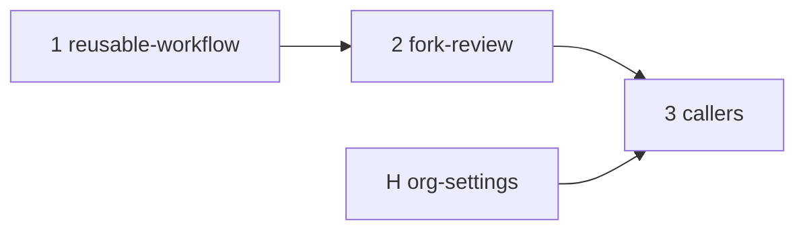

# MIP-0072 tasks

Ordered delivery of [MIP-0072](./MIP-0072-gemini-review-on-request.md). Task 1 and 2 land in
marola-devkit, task 3 is one caller PR per repo, and task H is the maintainer's org settings, not
a PR. This MIP's own PR merges after every row of task 3 has.

| # | slug | delivers | tests (must exist before the PR) | depends on |
|---|---|---|---|---|
| 1 | reusable-workflow | **marola-devkit** — `gemini-review.yml` and `scripts/gemini_review.py` (one API call, one review, one fix commit), v0.4.0: marola-dev/marola-devkit#19, merged | `gemini_review.py --self-test`; live on devkit#19: a review and a fix commit whose push started CI | – |
| 2 | fork-review | **marola-devkit** — callers on `pull_request_target`, a fork's head read as text from `.pr-head`, no fix commit on a fork, v0.5.0: marola-dev/marola-devkit#24, merged | `--root` self-test; live on marola-dev/marola-site#54 (a fork PR) | 1 |
| 3 | callers | each repo's `.github/workflows/gemini.yml` on `@v0.5.0` and a README section: marola #642, marola-dev/marola-site#52, marola-dev/marola-app#37, marola-dev/marola-ml#15, marola-dev/marola-oods#6 merged; **marola-dev/marola-corpus#5 open** | `actionlint` in each repo's CI; requesting `marola-dev/gemini` on a PR there posts a review | 2, H |
| H | org-settings | the maintainer: the `gemini` team (visible, no members), the `marola-gemini-bot` App, the org secrets `GEMINI_API_KEY`, `GEMINI_APP_PRIVATE_KEY` and variable `GEMINI_APP_ID`, each covering every caller repo | the team appears in each repo's Reviewers box | – |

## Task H, still open

- [x] App `marola-gemini-bot` created, with Contents and Pull requests read/write, no Workflows.
- [x] Org secrets and variable set; App installed on the caller repos.
- [ ] Team `gemini` given **Read** on marola-app, marola-ml and marola-corpus (it has marola,
      marola-site, marola-devkit and marola-oods): Org → Teams → `gemini` → Repositories.
