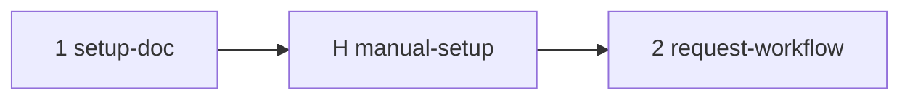

# MIP-0072 tasks

Ordered delivery of [MIP-0072](./MIP-0072-gemini-review-on-request.md). Tasks 1 and 2 are stacked
PRs (`mip-0072/<k>-<slug>`). Task H is the human-only setup, not a PR; its results land in the
MIP's appendix on task 2's branch. No agent can do any of H: it needs the maintainer's Google and
GitHub org-owner sessions, and it is the `AGENTS.md` cost go-ahead.

| # | slug | delivers | tests (must exist before the PR) | depends on |
|---|---|---|---|---|
| 1 | setup-doc | `docs/3-Working-on-the-repo/GEMINI-CODE-ASSIST.md` brought to today: `marola-dev/marola`, a public repo, the consumer shutdown (2026-07-17) and the enterprise-only install; §3 replaced by the "Manual steps" checklist of `MIP-0072.tasks.md`; §4's sketch uses `githubApp = "GEMINI_CODE_ASSIST"`; the private-repo premise of "why this tool" marked as gone, pointing at MIP-0072 §11.6 | `just docs` green (`mkdocs --strict`); `grep -nE 'h0ffmann/marola\|private repo' docs/3-Working-on-the-repo/GEMINI-CODE-ASSIST.md` prints only lines that say the premise no longer holds | – |
| H | manual-setup | Steps 1–9 of "Manual steps" in `MIP-0072.tasks.md`, done by the maintainer; the answers to step 6's three checks written into MIP-0072's appendix | step 6a: a by-hand `/gemini review` on a throwaway PR gets a review from `gemini-code-assist[bot]`; step 7: `marola-dev/gemini` can be requested on that PR; step 9: the secret exists (`gh secret list --repo marola-dev/marola` shows `GEMINI_REVIEW_TOKEN`) | 1 |
| 2 | request-workflow | `.github/workflows/gemini-review.yml` as MIP-0072 §5.2 (plus the bot-login clause, or the label fallback, if H says so); `.gemini/config.yaml` header comment (and `include_drafts` if H's 6b says so); `CI-CD.md`: a workflow row, the team and `GEMINI_REVIEW_TOKEN` under the maintainer's manual settings; `DEV-FLOW.md` §5 route 4 and `GEMINI-CODE-ASSIST.md` §2 describe the gesture; MIP-0072 → Implemented | `actionlint` and `scripts/workflow_runners.py` clean in `quality-other`. Live on this PR (MIP §7.3): request `marola-dev/gemini` → one `/gemini review` comment by the token owner, the team request removed, a Gemini review appears; request a human → job skipped; push, request again → a second review | H |

## Manual steps (task H, human-only)

Expected cost: $0. Google states no charge for Gemini Code Assist on GitHub during Preview, but
the project must have a billing account attached, and Preview terms can change (MIP-0072 §4.1,
§11.1). Actions minutes are free on a public repo; a team and a token cost nothing.

- [ ] 1. Give the go-ahead on the cost gate above, in the MIP PR or its issue. Nothing below
      starts before that.
- [ ] 2. Pick or create a GCP project and attach a billing account. You need Owner on it, or
      Service Usage Admin plus `roles/geminicodeassistmanagement.scmConnectionAdmin` (grant that
      with `gcloud projects add-iam-policy-binding`; the console cannot).
- [ ] 3. Create the connection and install the app: Console → Gemini Code Assist → Agents & Tools
      → Source Code Management → create the connection (enable the Developer Connect and Gemini
      Code Assist Management APIs when asked). When GitHub asks, install on the **`marola-dev`**
      organisation (needs an org owner), **Only select repositories → `marola`**. If an older
      install exists on the personal `h0ffmann` account from before the transfer, remove it.
- [ ] 4. Link the repository: Developer Connect → Link repositories → `marola-dev/marola`.
- [ ] 5. Turn off data sharing: Gemini Code Assist privacy settings → "use my data to improve
      Google products" off.
- [ ] 6. Check by hand, on a throwaway same-repo PR:
      a. comment `/gemini review` → a review by `gemini-code-assist[bot]` appears (the install works);
      b. the same on a draft PR → reviewed or not (`include_drafts: false`, MIP §11.4);
      c. does the Reviewers picker offer `gemini-code-assist[bot]`? If it already reviewed, does
      re-requesting it produce a new review without any workflow (MIP §11.3)?
      d. record a–c in MIP-0072's appendix.
- [ ] 7. Create the team: Org → Teams → New team `gemini`, **visible**, no members, description
      "Request this team for a Gemini Code Assist review (MIP-0072)". Repo → Settings →
      Collaborators and teams → add `gemini` with **Read**. Leave code review assignment off.
      Request it on the throwaway PR; if GitHub refuses an empty team, stop and switch task 2 to
      the label fallback (MIP §9).
- [ ] 8. Create the token: a fine-grained personal access token, resource owner `marola-dev`,
      repository `marola` only, **Pull requests: read and write**, expiry within the org's limit.
      An org owner approves it (#496 shows approval is required). Put the expiry in a calendar.
- [ ] 9. Add the secret: Repo → Settings → Secrets and variables → Actions → New repository
      secret `GEMINI_REVIEW_TOKEN` = the token. Nothing else needs enabling; the workflow runs once
      task 2's PR exists.

## Notes

- Task 1 goes first so step 3 follows a correct guide. Task 2 waits on H because its live test
  needs the app, the team and the secret.
- Tasks 1 and 2 both edit `GEMINI-CODE-ASSIST.md`, in different sections (§3–§4 vs §2), so a
  restack needs no reorder.
- If MIP §4.2 turns out false (Gemini answers `github-actions[bot]`), task 2 posts with
  `GITHUB_TOKEN` and steps 8–9 are undone.
