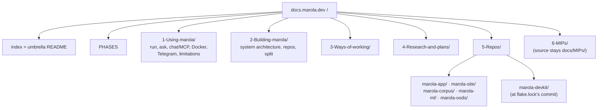

# MIP-0074: Docs after the split — the umbrella is the landing, each repo keeps its low-level docs

| | |
|---|---|
| **Status** | Accepted (2026-10-02, maintainer review on #603) — `Tasks: docs/MIPs/MIP-0074.tasks.md` ([`MIP-0074.tasks.md`](./MIP-0074.tasks.md)) |
| **Author** | Claude (Opus 5.5), from the maintainer's decisions on the post-split docs review |
| **Created** | 2026-10-02 |
| **Phase** | None: docs and repo structure, orthogonal to `docs/PHASES.md`. No Phase 1 prerequisite, no paid resource |
| **Related** | MIP-0070 (§5.5, which this supersedes for docs; §5.4, whose contracts the new org pages document), MIP-0064 (the mkdocs site and its no-`nav:` rule), MIP-0068 (diagrams), MIP-0063 (issues for the tasks) |
| **Effort** | XL — every doc in seven repos is revised, split or rewritten (Appendix D), plus a link-rewriting aggregator with a layout guard, a redirect map, a devkit lint tool and a new org `.github` repo |
| **Gain** | `user value` — docs.marola.dev gets a front door, the org's shape is explained on it, and every repo's README and docs reach it; `infra/dev-loop` — one rule for where a doc goes, checked by a linter in every repo, and no monorepo leftovers misleading the next reader |
| **Effort vs Gain** | `do next` — the site has no landing page, four READMEs never reach it, the devkit is missing from it, and most pages still describe the monorepo |
| **Depends on** | MIP-0070 (Implemented): the submodules, `mkdocs/repos.yml` and `scripts/prepare-docs.sh` this changes. Human-only step: creating `marola-dev/.github`. Licences are out of scope (marola-dev/marola#601). No Phase 1 gate, no paid resource |
| **Blocked by** | none |
| **Risk** | The umbrella's user pages describe marola-app's CLI from another repo, and drift from it unless the app's reference pages stay the single source for flags and settings and the paired-PR rule holds (§8) |
| **Cost so far** | — |


## 1. Summary

docs.marola.dev becomes the umbrella's site. Its root holds every high-level doc: what marola is,
how to use it and what it cannot tell you, the system architecture across repos, how the org is
organised and why it was split, the ways of working, research and MIPs. Every repo, marola-app and
the devkit included, mounts under `5-Repos/<name>/`. There its README is the landing page, followed by
low-level docs only. Most pages were written for the monorepo, so each page in Appendix D gets an
action (keep, revise, rewrite, split, merge, retire, move, new) as well as a destination.

## 2. Motivation

From the post-split review of all seven repos (2026-10-02; evidence in Checked live):

- No front door: the landing page is a table of MIP candidates, mostly marola-app rows.
- Four READMEs never reach the site: `prepare-docs.sh:39` overwrites the README copy with `docs/index.md`.
- The devkit is absent (`/repos/marola-devkit/` returns 404). ml's and corpus's main docs sit outside `docs/`.
- Monorepo leftovers: another repo's recipes, the pre-org URL, a "private repo" premise, a dead link.
- The app shares the root with the umbrella, so its sections interleave with the org's.
- The split itself is explained only in agent-facing `AGENTS.md` and MIP-0070.

## 3. User-visible change

Before: `Start here` (MIP table) · `Development phases` · `marola-app` · `1 Using marola` ·
`2 Building marola` · `3 Working on the repo` · `4 Research and plans` · `MIPs` · `Repos` (4 of 6).



## 4. Data sources and dependencies reviewed

- **`mkdocs-redirects`** (MIT) maps old Markdown paths to new ones and writes a meta-refresh page per
  old path. With `strict: true`, a missing target fails the build. **Pick: 1.2.2.** 1.2.3 requires a
  second distribution, `properdocs`.
- **Material's `404.html` override** (`custom_dir`, documented as overridable). GitHub Pages serves
  it for any missing path on docs.marola.dev. **Pick: it forwards the two generated API prefixes**,
  which a Markdown redirect map cannot cover. marola-site already uses this pattern (`redirect_check.js`).
- **Today's site**: 112 sitemap URLs, 27 outside `MIPs/`. All 27 are mapped in Appendix B. No repo
  has a `mkdocs.yml` or community-health files. `marola-dev/.github` returns 404. All repos are MIT.

## 5. Design

### 5.1 The root and the four org pages

**The root belongs to the umbrella, and nothing else mounts there** (D2). The umbrella follows D1 too:
its README becomes the site's `index.md`, kept as it is apart from what the split requires (§5.4),
and `docs/index.md` moves to `MIPs/CANDIDATES.md`. There is no `nav:` and no nav plugin (MIP-0064),
so every top-level section is numbered and sorts by prefix. The top level reads: index · PHASES · 1
Using marola · 2 Building marola · 3 Ways of working · 4 Research and plans · 5 Repos · 6 MIPs.
`3-Working-on-the-repo/` becomes `3-Ways-of-working/`. Repos mount at `5-Repos/<name>/`, which
replaces the review's `repos/<name>/` spelling of D2; the labels are generated ("Marola app").
MIPs stay at `docs/MIPs/` in the umbrella's tree, because `mip_graph.py`, the devkit's MIP tools
and skills, and about 70 MIPs' cross-links all key on that path. prepare-docs places that directory
at `6-MIPs/` on the site and rewrites links into it (Appendix A). A doc is high-level, and so belongs to the
umbrella, when its reader needs no single repo's code to act on it.

The split is first-class content:

| Page | Contents |
|---|---|
| landing (umbrella `README.md`) | Today's README as it is (what marola is, run it, the repos, contributing). Only split-driven changes: "workspace" → "umbrella", the repo table links each repo's `5-Repos/` page, the health-file links are re-pointed, and the low-level badges (lines of code, coverage, Scala/JDK/Ollama/MCP) move to the README of the repo they measure |
| `2-Building-marola/REPOS.md` | The three layers (MIP-0070 §5.1) · **the routing table, its only copy**: one row per repo with what it owns, the artifact it publishes, its consumers, and the workflow or pin file that moves it (e.g. marola-corpus · `knowledge/` · `marola-corpus-<tag>.tar.gz` · app, ml · `release.yml` → `corpus.version`). AGENTS.md links it instead of restating it (§7) · **the contracts**: one producer→consumer diagram plus a table of artifacts and pins (the app image and `marola-image`; corpus and `ml-resources` tarballs; each repo's `api-docs` branch; `corpus.version` and `resources.version`; compiled-prompt PRs; `site-data`; OODS ingest commits and export; `notify-umbrella` dispatches) · no repo reads another's tree · the org invariants |
| `2-Building-marola/SPLIT.md` | Why (MIP-0070 §2) · the decisions and what they beat: submodules, OODS split into code and data, contracts instead of paths, no published Scala libraries, aggregated docs, the devkit as a flake · what moved where (MIP-0070's file assignment) · timeline (#521 → #574…#599) · what was given up |
| `3-Ways-of-working/WORKING-ACROSS-REPOS.md` | Clone with submodules · detached HEAD and branching inside a submodule · where a change belongs · producer releases, consumers bump, the pointer moves last via `pointer-sync` · issues per repo, umbrella parent and sub-issues, fully qualified references · cross-repo PRs on one branch name · which checkout a recipe needs |

`2-Building-marola/ARCHITECTURE.md` keeps its URL and becomes the **system** page: the vision, the
request pipeline across repos, the local-first integration pattern (which the `mip` skill cites),
the target Telegram architecture, a one-line summary of the public data sources, and the cloud
options. **What marola cannot tell you stays with users**: today's ARCHITECTURE §8–9 limitations go
to an umbrella page, `1-Using-marola/LIMITATIONS.md`. The app's `1-design_heuristics.md` keeps the
heuristics' internals and links back to it (§6).

### 5.2 The per-repo skeleton

- **README is the landing page**: what the repo is, plus a status line · run or try it · repo map
  · contracts (consumes / publishes / pinned by) · docs and AGENTS.md links. No `docs/index.md`.
- **Numbered pages, not directories.** The nav label is the page's H1. A page that outgrows itself
  splits into `_` siblings, which sort after their parent (`-` < `.` < `_`): `1-design.md`, then
  `1-design_integrations.md`. The pages: `1-design` (patterns, module map, effect boundary) ·
  `2-libraries` (each library and pinned tool, why, version, alternatives) · `3-development`
  (this repo's build, test, CI, releases, secrets and cost) · `4-reference` (this repo's config,
  CLI, data formats, and hand-written API notes). Both are low-level because they are specific to
  one repo. General guidelines (how every repo tests, releases, reviews and runs CI) are umbrella
  `3-Ways-of-working/` pages, which the repo pages link and do not restate.
- **ADRs** live at `docs/adr/NNNN-<slug>.md` (template: Appendix C). prepare-docs generates
  `adr/index.md` (number, title, status), and a hand-written one fails. An ADR records a decision
  that starts and ends inside one repo. Anything crossing a repo boundary, or visible to users, is a
  MIP.
- **API docs** are generated output only: Scaladoc for marola-app, pdoc for marola-ml, and
  rendered OpenAPI later. They are never committed to the default branch. Each repo owns
  generation, through a reusable devkit workflow plus its own generator (`just api-docs`, e.g.
  `sbt doc` + `strip_external_scripts.py`, or pdoc):
  - **On a push to the default branch**, the workflow generates the docs and force-pushes one
    commit (the output, plus its source sha in the message) to an orphan `api-docs` branch in
    the same repo. Only the latest output is kept, so the branch never grows. It uses the default
    `GITHUB_TOKEN` with `contents: write` and `concurrency: api-docs` (the latest run wins), so no
    extra credential is needed. marola-site's `site-data` is the same kind of CI-written data
    branch.
  - **On a PR**, the same generator runs as a check (it must succeed) and commits nothing.
  - The site path `5-Repos/<name>/api-docs/` stays as the mount point. Hand-written API notes go
    in the repo's `4-reference` pages.
  - The trade-off: generated docs are not reviewed in PR diffs. The PR check only proves they
    build.
- **Not in a repo**: using marola, anything spanning repos, process, research, MIPs.

### 5.3 The build

**What the site documents.** Non-PR builds track each submodule's `main` (`docs.yml`'s `--remote`),
not the umbrella's gitlinks. So `<sha>`, the commit code links point at, is the commit each repo was
built from: its `main` tip at build time. prepare-docs records it per repo in
`generated-docs/build.json`, and each repo landing shows it in one line. PR builds use the pinned
gitlinks. The reason: docs follow the code readers see on GitHub's `main`, and a code link never
points at code newer than its prose. The devkit is the exception and mounts at `flake.lock`'s locked
commit, because the pinned devkit, not its `main`, is what every repo runs.

**prepare-docs.** Each repo mounts at `5-Repos/<name>/`. The umbrella mounts at the root, with `docs/MIPs/` placed at `6-MIPs/`. It fails
when a repo has no `README.md`, or has both `README.md` and `docs/index.md`. It copies the README to
`<mount>/index.md` and copies `docs/**` beside it. It rewrites links as Appendix A specifies,
including own-repo `github.com/…/blob/main/…` links, which are normalised to `<sha>`. It generates
`adr/index.md` and runs today's relative-link check over everything it wrote.

**Redirects.** Page moves go through `redirect_maps`. Prefix moves (`/repos/`, `/MIPs/`, `/api/`) go
through `mkdocs/overrides/404.html`, which keeps the path, query and hash. A moved page in any repo gets a
`redirect_maps` entry in the same PR pair.

**API trees.** Before mkdocs runs, prepare-docs fetches each repo's `api-docs` branch with
`git fetch --depth 1 https://github.com/marola-dev/<repo> api-docs`. The repos are public, so no
token is needed. It unpacks the branch under `<mount>/api-docs/`, and a repo without the branch is
skipped with a notice. The trees are inside the build, so pages link them relatively. The
`api-docs.tar.gz` release jobs in app and ml `release.yml` are retired after the pair in §5.7. The
app's `ml-resources` asset stays. Per-version docs published on tags are a possible follow-up,
not designed here.

**Required changes**, all landed by the umbrella PR of §5.7 step 3 at the latest (the devkit
source, the branch fetch and the redirect machinery go first, in step 2):

| File | Change |
|---|---|
| `.github/workflows/docs.yml`, `ci.yml` (`docs` filter) | Path filters add `README.md`, `flake.lock`, `scripts/prepare-docs.sh`, `scripts/lib/repos_manifest.sh`. The release-asset fetch step is removed |
| `scripts/lib/repos_manifest.sh` | Accepts `  source: flake-lock` (that value only). `mount:` and trailing comments still fail |
| `mkdocs/repos.yml` | `mount:` removed (every repo at `5-Repos/<name>/`); `- name: marola-devkit` + `source: flake-lock` added |
| `scripts/prepare-docs.sh` | Everything above. `mount_at_root` deleted. The devkit is read with python3 from `flake.lock` (`nodes.marola-devkit.locked.rev`) and fetched with `git fetch --depth 1 <url> <rev>` into `.tmp/docs-sources/` (no nix in CI) |
| `scripts/fetch-api-docs.sh` (+ self-test) | rewritten: fetches the `api-docs` branches as above and is called by prepare-docs; the release-asset path is removed |
| `scripts/mkdocs.sh` | The `docs/index.md` check (`:132`) and self-test (`:201`) move to the build directory's `index.md` |
| `mkdocs/mkdocs.yml`, `Dockerfile` | `theme.custom_dir: overrides`, `redirects` plugin (+ `mkdocs-redirects==1.2.2`), `validation: anchors: warn`, `strip_external_scripts.py --check` kept on the output, `not_in_nav` → `6-MIPs/*.tasks.md` and `6-MIPs/*/screenshots/*` |

### 5.4 Placement, page by page

Appendix D has every current doc in seven repos: its destination, its action and the reason. The
actions are **keep** (links only) · **revise** (named facts, paths, commands or scope fixed in place)
· **rewrite** (same purpose, new text) · **split** (section by section, each part rewritten for its
home, never pasted) · **merge** · **retire** · **move** · **new**. RUN-LOCALLY and ARCHITECTURE are
split section by section. The three root pages that keep their URL with new content (RUN-LOCALLY,
TELEGRAM-SETUP, ARCHITECTURE) carry a "moved from this page" note. They also keep a heading stub for
each removed section that links to its new home, so old `#anchors` still land on a pointer.

**Retired**: FABLE_REVIEW (every finding is fixed except one, now marola-dev/marola-app#26: the
Recommender's clock default from EFFECTS-MAP), TODO_FL (its talk and outreach plan moved to
marola-dev/marola#602), ROADMAP, `docs/superpowers/`, the umbrella's duplicate `.gemini/styleguide.md`, ARCH §11,
AGENT-SKILLS §2.2 and FUTURE-WORK §7 (except §7.3, which becomes an app ADR).

### 5.5 Conventions

- **Links**: relative inside a repo, written to work on GitHub. Absolute `https://docs.marola.dev/…`
  across repos, the umbrella included.
- **Recipes**: a doc names only its own repo's recipes and the devkit's. Any other recipe carries the
  checkout marker that §7's check reads.
- **Order**: numbered directories at the root, numbered pages in repos, ADRs `NNNN`. No `nav:`.
  Files sort before directories.
- **Naming**: "the umbrella" (or `marola-dev/marola`) is the repo, "marola" is the product, and a
  repo is `marola-<name>`. "Workspace" is retired.

### 5.6 Org-level items

In scope: the stale facts, the devkit on the site, the app's `.env.example` and `marola-dev/.github` (org-default
CONTRIBUTING pointer, SECURITY, CODE_OF_CONDUCT, `profile/README.md`), which a human creates. Content and data licences (corpus, oods) are out of scope and stay as they are
(marola-dev/marola#601).
MIP-0070 §5.5's per-repo `mkdocs.yml` is dropped. A devkit `docs-lint` (§7) runs in every repo's
`quality-other`, and the rendered preview stays `just docs-serve` in an umbrella checkout.
MIP-0070's §5.5 gets a "superseded for docs by MIP-0074" line in step 3.

### 5.7 Rollout

1. The devkit's `docs-lint` and `api-docs` workflow, its README landing, then a tag.
2. **Before the pair, each step safe on today's aggregator.** The guard, a small umbrella PR:
   today's `mount_at_root` fails unless marola-app has `docs/index.md` and nothing outside
   `docs/1-Using-marola/` and `docs/2-Building-marola/`, so an aggregator that meets an app layout
   it does not expect fails instead of deploying; a self-test proves that the old aggregator with
   the new app layout fails. The redirect machinery, the link rewriter, the branch fetch and the
   devkit source land too, unwired where they would change the site. app and ml adopt the devkit
   `api-docs` workflow, which runs harmlessly beside the old release job. site, corpus, ml, oods
   and devkit move to README landings and drop `docs/index.md`: the new aggregator refuses a repo
   with both, and today's already copies the README when `docs/index.md` is absent.
3. **The pair**: marola-app's restructure and the umbrella PR (aggregator, §5.3's table,
   redirects). The umbrella receives RUN-LOCALLY, TELEGRAM-SETUP and ARCHITECTURE with their links
   fixed and nothing else; every Appendix B URL is final from the pair on, so the four org pages
   and the content rewrites follow as ordinary PRs that change content, never URLs.
   The umbrella PR's CI builds against the app PR's head first. Whichever merges first, the other
   side's guard (step 2, or D1 against `docs/index.md`) turns `docs.yml` red. The live site stays on
   its last good deploy until the second merge, and is never deployed half-moved.
4. Every repo's skeleton pages and revised content, then the umbrella's pages section by section.
   Each repo turns the `docs-lint` gate on in its last content PR, once its tree passes.
5. Once the umbrella reads the branches, the `api-docs.tar.gz` release jobs in app and ml are
   removed.
6. `marola-dev/.github` is created, then the umbrella's root health files go.

## 6. Scoring / safety impact

None. No scoring code changes. The user-facing limitations keep their wording and stay on umbrella
user pages (§5.1). The corpus's unverified-sources status moves up into its README.

## 7. Verification plan

- **prepare-docs `--self-test`**: one case per Appendix A row, plus the landing rule, the
  `mount:`/`source:` parsing, the devkit rev, `build.json` and the ADR index (Appendix E).
- **API docs, per repo**: the PR check runs the generator in app and ml CI, and a broken generator
  fails the PR. After a push to `main`, `git ls-remote <repo> api-docs` shows a new single-commit tip
  whose message names that push's sha. fetch-api-docs `--self-test` (against a local bare repo)
  covers: branch present → unpacked under `api-docs/`; branch absent → a notice, exit 0.
- **Guard**: the step-2 self-test. **404 forward**: `scripts/docs_redirect_check.js` under node
  (`flake.nix:47`), in the style of marola-site's `redirect_check.js`.
- **Build**: `just docs` (`--strict`, anchors at warn) with every repo at its new commit and the
  `api-docs` branches fetched.
- **`scripts/site_links_check.py`** (stdlib, no network), after the build: every
  `https://docs.marola.dev/…` href in `generated-docs` resolves. `--old-sitemap <file>`: every `<loc>`
  of the previous live sitemap resolves as a page, a redirect stub or a 404-forward entry, so a
  move cannot silently drop a URL.
- **Stale-content check**, in devkit `docs-lint`. It scans `README.md` and `docs/**/*.md`, prose and
  fenced blocks both, but not inline URLs. `docs/MIPs/**` and `SPLIT.md` are allow-listed as whole
  files, because they are dated records.
  - (a) `just <recipe>` must be defined in the repo's justfile or `devkit.just`, unless it is marked:
    in prose, the same sentence contains "in a marola-<name> checkout"; in a fence, the first line is
    `# in a marola-<name> checkout`.
  - (b) A relative path or bare-prose path beginning `core/`, `local/`, `cli/`, `finetune/`, `dspy/`,
    `knowledge/` or `site/` fails outside the repo that owns it. Absolute GitHub URLs are allowed.
  - (c) Any of these fails: `docs/1-Using-marola`, `docs/2-Building-marola` (except in the umbrella,
    which owns both directories),
    `marola-dev/marola/blob/main/docs/2-`, the pre-org repo URL, the word "monorepo".
  - (d) `docs/index.md` fails. Every repo has one until its landing, so a repo adds `docs-lint` to
    `quality-other` in its last content PR (§5.7 step 4), not before.
  - (e) A relative link that leaves the repo fails.
  - Self-test cases: `recipe_defined_ok`, `foreign_recipe_fails`, `foreign_recipe_marked_in_prose_ok`,
    `foreign_recipe_marked_in_fence_ok`, `marker_in_other_sentence_fails`, `app_path_in_prose_fails`,
    `app_path_in_github_url_ok`, `app_path_in_fence_fails`, `monorepo_word_fails`,
    `mips_dir_allowlisted`, `docs_index_fails`, `escaping_link_fails`,
    `umbrella_owns_its_numbered_dirs_ok`.
- **Routing table, one copy**: `scripts/agents_repos_check.sh` in the umbrella's `quality-other` fails
  when AGENTS.md has a table row naming a repo (`^\| \[?marola-(app|site|corpus|ml|oods|devkit)`) or
  names a pin file (`marola-image`, `corpus.version`, `resources.version`), and passes when it links
  `docs/2-Building-marola/REPOS.md`. Self-tests: `table_row_fails`, `pin_name_fails`, `link_only_ok`.
- **After deploy**: for each "plugin" row of Appendix B, `curl -s <old> | grep http-equiv` names the
  new URL, and the new URL returns 200. Each "404 forward" old URL serves the forwarding page.
  `/5-Repos/marola-devkit/` returns 200.
- **Done** means `MIP-0074.tasks.md` is fully merged, `docs-lint` passes in all seven repos, and the
  landing is the umbrella README.

## 8. Risks, limitations, and honest caveats

- **Drift.** The umbrella's user pages describe app commands. They link the app's `4-reference_*`
  pages for every flag and variable, and the app's AGENTS.md requires a paired umbrella PR when a
  user step changes. `docs-lint` (a) catches only renamed recipes, not changed behaviour.
- **Cross-repo breakage shows up in the wrong repo.** Renaming a page in repo X breaks absolute links
  in repo Y. Only the umbrella's next build sees it (red, site frozen). Whoever renamed the page
  fixes it with a `redirect_maps` entry.
- **The site tracks `main`, not the pins** (§5.3). A page can describe a `main` that the umbrella's
  gitlinks have not reached yet.
- **API docs are not reviewed in PRs.** Only the build is checked. The `api-docs` branch is outside
  `main-rule` (which targets `~DEFAULT_BRANCH`), so anyone with write access could push to it. The next
  push to `main` overwrites it.
- **Stated, not tested**: mkdocs-redirects 1.2.2 has not been built with mkdocs 1.6.1. Its stubs and
  the 404 page use inline script, which is fine: Pages sends no CSP, and
  `strip_external_scripts.py` checks external `src` only. The header's `repo_url` is the umbrella's
  on every page. The landing's raw-HTML `<h1>` is kept as is (decision 3), so the page title falls back
to the nav label.

## 9. Alternatives considered

- Do nothing. Or the review's D1 (b) and D2 (a): the maintainer chose README landings and
  `repos/` mounts (now `5-Repos/`).
- A separate umbrella landing page besides its README: it breaks the one rule.
- Pinning code links to the umbrella's gitlinks while the prose tracks `main`: prose and code
  would disagree.
- A nav plugin to order the sidebar: rejected by the maintainer in favour of numbered sections.
- Renaming `docs/MIPs/` to `docs/6-MIPs/` in the tree: it would break `mip_graph.py`, the devkit's
  MIP tools and every MIP link, for a site-only concern.
- Redirects all in the 404 page: unchecked at build time. Hand-written stubs: they reimplement the
  plugin.
- API docs committed to the default branch through PRs: shared generated files (the search index,
  the nav) conflict across stacked PRs; history grows for good (the app's Scaladoc alone is 17 MB in
  1368 files); every contributor needs the toolchain; and the stale check depends on byte-stable
  output.
- API docs from release assets only (today): the docs lag `main` and only move on tags.
- The devkit as a docs-only submodule: a second pin besides `flake.lock`, against `AGENTS.md:44`.
- Per-repo `mkdocs.yml`: seven theme configs to keep in step. `docs-lint` catches what breaks the
  build, without Docker.

## 11. Open questions

None. The maintainer decided every question raised in review.

### Follow-ups

- **Follow-up MIP** (needs the next number): agent graph tooling in marola-devkit. It covers a
  pinned graphify, an offline `graph` recipe that writes outside the checkout, a parser for workflow
  and pin-file edges, and a plugin skill. The umbrella builds the workspace graph as a CI artifact,
  never committed. That MIP also revisits AGENTS.md to reference the graph setup. The spike found
  4530 nodes / 7978 edges in 2.6 s, but 0 real cross-repo wiring edges, because the 85 workflow YAMLs
  are absent without an LLM. Routing scored 3 hits, 3 partial and 2 misses out of 8 questions.
- **Not MIPs**: `repo_stats.py` reads the `marola-app/` tree in CI, and must also emit per-repo badge
  endpoints for decision 3. And a "lands in" column for MIPs.

## Appendix

### A. Link-rewrite rules (§5.3)

These apply to the README (copied to `<mount>/index.md`) and to `docs/**` links that leave
`docs/`. Inline links, reference definitions (`[x]: …`) and HTML `href=`/`src=` all follow the same
rules. `<repo>` is the repo being mounted. `<sha>` is the commit it was built from (§5.3).

| Link in a repo's file | Becomes |
|---|---|
| `docs/x.md`, `./docs/x.md` | `x.md` |
| `docs/x.md#a` | `x.md#a`; the anchor is checked (`validation.anchors: warn` under strict) |
| `docs/` (the "full docs" link) | `index.md`, the landing itself |
| `docs/index.md` | fails: banned by D1, and absent |
| `docs/sub/` with `docs/sub/index.md` | `sub/index.md` |
| `docs/sub/` without an index | fails, except `docs/adr/` → `adr/index.md` (generated) |
| `docs/img/a.png` (Markdown or ``) | `img/a.png` |
| a path under an `exclude_docs` pattern (`docs/benchmarks/2026-09-05.md`) | `https://github.com/marola-dev/<repo>/blob/<sha>/docs/benchmarks/2026-09-05.md` |
| `#a` | unchanged, anchor checked |
| from `docs/**`: `../README.md`, `../README.md#a` | the mount's `index.md`, `index.md#a` |
| README anchors whose heading has emoji or punctuation | rewritten to Python-Markdown `toc`'s slug of the heading text; if no heading matches, the anchor check fails |
| a file outside `docs/` (`AGENTS.md`, `scripts/x.sh`) | `https://github.com/marola-dev/<repo>/blob/<sha>/<path>` |
| a directory outside `docs/` (`knowledge/`) | `https://github.com/marola-dev/<repo>/tree/<sha>/<path>` |
| `https://github.com/marola-dev/<repo>/(blob\|tree)/<branch>/<path>` (own repo, any branch name) | the same URL with `<sha>` in place of `<branch>` |
| umbrella only: `marola-<name>/README.md` or `marola-<name>/docs/x.md` (e.g. `../marola-app/…` from `docs/**`) | the site path `5-Repos/marola-<name>/index.md` or `5-Repos/marola-<name>/x.md`, made relative |
| umbrella only: `marola-<name>/<code path>` | `https://github.com/marola-dev/marola-<name>/blob/<that repo's sha>/<path>` |
| `/…` root-absolute (e.g. API.md's `/api/scala/core/marola.html`) | fails; link the fetched tree relatively (`api-docs/scala/core/marola.html`). A link into a repo whose `api-docs` branch does not exist yet fails as broken |
| an image outside `docs/` | fails: move it under `docs/` |
| `../…` out of the repo, or a path missing at `<sha>` | fails, naming the file and the link |
| any other `https://…`, `mailto:` (docs.marola.dev included) | unchanged |
| umbrella only: `MIPs/x.md` (from `docs/**`), `docs/MIPs/x.md` (from the README) | the same page under `6-MIPs/`, made relative |
| inside code spans and fences | untouched |

### B. Redirect map (§5.3)

404-forward prefixes are matched longest first.

| Old URL | New URL | How |
|---|---|---|
| `/1-Using-marola/RUN-LOCALLY/`, `/1-Using-marola/TELEGRAM-SETUP/`, `/2-Building-marola/ARCHITECTURE/` | unchanged; umbrella content with heading stubs (§5.4) | — |
| `/marola-app/` | `/5-Repos/marola-app/` | plugin |
| `/2-Building-marola/EFFECTS-MAP/` | `/5-Repos/marola-app/1-design_effects/` | plugin |
| `/2-Building-marola/SCALA3-JDK-REVIEW/` | `/5-Repos/marola-app/2-libraries_scala3-jdk/` | plugin |
| `/2-Building-marola/API/` | `/5-Repos/marola-app/4-reference_api/` | plugin |
| `/api/**` | `/5-Repos/marola-app/api-docs/**` | 404 forward |
| `/repos/marola-ml/api/**` | `/5-Repos/marola-ml/api-docs/python/**` | 404 forward |
| `/repos/**` (site, corpus, ml, oods landings) | `/5-Repos/**` | 404 forward |
| `/MIPs/**` (index, every MIP and task file) | `/6-MIPs/**` | 404 forward |
| `/3-Working-on-the-repo/{AGENT-SKILLS,CI-CD,DEV-FLOW,DIAGRAMS,ISSUE-FLOW}/` | `/3-Ways-of-working/…/` | plugin (5) |
| `/3-Working-on-the-repo/{GEMINI-CODE-ASSIST,SELF-DOCUMENTING}/` | `/4-Research-and-plans/…/` | plugin (2) |
| `/4-Research-and-plans/FABLE_REVIEW/` | the GitHub blob at the last commit that had it | plugin (external target) |
| `/4-Research-and-plans/ROADMAP/` | `/6-MIPs/` (the index's verdicts are the ordering) | plugin |
| `/PHASES/`, the rest of `4-Research-and-plans` | unchanged | — |

### C. ADR template (§5.2)

```markdown
# ADR-NNNN: <the decision, as one sentence>

| | |
|---|---|
| **Status** | Proposed / Accepted / Superseded by ADR-NNNN |
| **Date** | YYYY-MM-DD |
| **Related** | MIP-NNNN, PR #N, ADR-NNNN |

## Context
## Decision
## Consequences
## Alternatives
```

### D. Placement and action, page by page (§5.4)

App paths are under `marola-app/docs/`, and ARCH = its `2-Building-marola/ARCHITECTURE.md`.
Every row's last step is `docs-lint` (§7).

#### marola (umbrella)

| Current | Destination | Action | Why |
|---|---|---|---|
| `README.md` | site root `index.md` + GitHub | revise, only what the split requires: "workspace" → "umbrella", the repo table links `5-Repos/` pages, CONTRIBUTING/SECURITY/CoC links re-pointed once those leave the root; the lines-of-code, coverage and Scala/JDK/Ollama/MCP badges move to the READMEs of the repos they measure (the app's mostly); status badges (CI, site, live map, licence) stay | the landing (D1); decision 3 keeps it as it is otherwise |
| `README.pt-BR.md` | stays, GitHub only | revise: the same split-driven changes as the README, nothing else | decision 3: keep the READMEs as they are |
| `CLAUDE.md` | stays | revise: "workspace" → "umbrella" | naming rule |
| `AGENTS.md` | stays | revise: "The repos" table is removed and replaced by one line linking `docs/2-Building-marola/REPOS.md`, the routing table's only copy (checked, §7); "where a change belongs" and "submodule mechanics" keep the rule and link the new pages; "Writing a doc is a deploy" loses the root mount and `docs/index.md`; paths updated (`3-Ways-of-working/`, `PHILOSOPHY.md`) | one copy of the table, so AGENTS.md stays small and cannot drift |
| `PHILOSOPHY.md` | `docs/3-Ways-of-working/PHILOSOPHY.md` | move + revise: app file paths become docs.marola.dev links; `just context-mip` (`justfile:145`) and `repomix-instruction-mip-review.md` re-pointed | high-level, and invisible on the site today |
| `CONTRIBUTING.md` | `docs/3-Ways-of-working/CONTRIBUTING.md`; a short pointer in `marola-dev/.github` | rewrite: no "one-person repo", issues go to the repo the PR lands in, real dependabot scope, Scala style → app | org-wide guide; every repo inherits the pointer |
| `SECURITY.md`, `CODE_OF_CONDUCT.md` | `marola-dev/.github/` | revise: the pre-org URL → org URLs, no "one-person project" | org defaults that cover every repo |
| `TODO_FL.md` | the plan → marola-dev/marola#602 | retire | outreach work belongs in an issue, not in a file |
| `docs/index.md` | `docs/MIPs/CANDIDATES.md` (site: `6-MIPs/CANDIDATES/`) | rewrite: one row per candidate idea, links absolute where the page is a repo's, the FUTURE-WORK duplicate dropped | not a landing page; MIP material belongs with MIPs |
| `docs/PHASES.md` | stays | revise: current-status line per phase with its MIP, no "(done, this change)", app references as absolute links | stale wording, a relative link into the app |
| — | `1-Using-marola/` (RUN-LOCALLY, ASK-THE-OCEAN-NOTES, CHAT-AND-MCP, DOCKER, TELEGRAM-SETUP, LIMITATIONS) | new, from the app's RUN-LOCALLY and ARCH splits below | using marola, and what it cannot tell you, is high-level |
| — | `2-Building-marola/REPOS.md`, `SPLIT.md` | new (§5.1) | the split as content |
| `3-Working-on-the-repo/` | `3-Ways-of-working/` | move (redirects, App. B) | it now means the org |
| `…/DEV-FLOW.md` | `3-Ways-of-working/DEV-FLOW.md` | split: §1–6 revised (umbrella paths, cross-repo PRs link WORKING-ACROSS-REPOS); §1 absorbs RUN-LOCALLY §8; §7's `mip-solve-perpetual` mechanics → devkit `4-reference_plugin.md`; §8 → `DOCS-SITE.md`; §9 → devkit `4-reference_tools.md`, linked | §8 lists the app's directories as this repo's; §9 is the devkit's reference |
| — | `3-Ways-of-working/DOCS-SITE.md` | new, from DEV-FLOW §8, CI-CD's docs row, prepare-docs' header: mounts, landing rule, link rules, skeleton, preview, redirects | "how the site is built" is scattered over three files |
| — | `3-Ways-of-working/WORKING-ACROSS-REPOS.md`, `NEW-REPO.md` | new: §5.1; the checklist for adding a repo (flake, justfile import, hooks, settings, workflows, AGENTS block, labels, ruleset, repos.yml, docs skeleton) | the split as content; adoption is org process |
| `…/ISSUE-FLOW.md` | `3-Ways-of-working/` | revise: "The commands" → devkit `4-reference_tools.md`, linked | the command table duplicates DEV-FLOW §9 |
| `…/CI-CD.md` | `3-Ways-of-working/` | split: umbrella workflows, org secrets, self-hosted rule and manual settings stay, revised; the per-repo narrative (`:36-72`) → one line per repo plus each repo's `3-development.md`; the `:138` claim (ml prompt PRs come "here") fixed to marola-app | it re-describes other repos' workflows, which will drift |
| `…/AGENT-SKILLS.md` | `3-Ways-of-working/` | split: rewrite as "skills across the org, which repo has which"; §1.1 → devkit `4-reference_plugin.md`; §2.2 (one person's user-scope plugins) retired | §1 is empty post-split |
| `…/DIAGRAMS.md` | `3-Ways-of-working/` | keep | org-wide authoring rule |
| `…/GEMINI-CODE-ASSIST.md` | `4-Research-and-plans/` | move + rewrite: the premise (a private repo) is false; the Besom plan stays as research; app setup moves to app `3-development.md` if adopted | stale and mostly a plan |
| `…/SELF-DOCUMENTING.md` | `4-Research-and-plans/` | move | it is research behind MIP-0018 |
| `4-…/AGENT-FRAMEWORKS-SURVEY.md`, `AGENT-STACK-SURVEY.md`, `AWESOME-AGENTIC-ENGINEERING.md` | stay | revise: links into app code become absolute GitHub links | cross-cutting research |
| `4-…/FUTURE-WORK.md` | stays, smaller | split: §1, §4, §8, §9, §10, §11 stay, revised; §2, §3, §5, §6 → app `2-libraries.md` as library reviews; §7 retired, with §7.3 → app `adr/0001-three-sbt-modules.md` | library reviews belong with the code they judge |
| `4-…/ROADMAP.md` | redirect to `MIPs/` | retire | its own §9: stale roadmaps are worse than none; the MIP index verdicts and the issue queue are the ordering now |
| `4-…/FABLE_REVIEW.md` | the one open finding → marola-dev/marola-app#26 | retire | a dated monorepo import review; every other finding is fixed |
| `4-…/SKILLS.md` | stays | revise: app classes cited by absolute link | it orders what a person practises and uses app code only as the exercise ground; low-level docs explain code, this does not |
| `MIPs/README.md`, `MIP-*.md`, `*.tasks.md` | stay in `docs/MIPs/`; served at `6-MIPs/` | revise `README.md:4` (the skill path → `/marola-devkit:mip`); MIP-0070 §5.5 gets "superseded for docs by MIP-0074"; otherwise dated records | — |
| `MIPs/MIP-0009/screenshots/README.md` | stays | keep, add to `not_in_nav` | a stray sidebar section |
| `docs/superpowers/` | — | retire | dated working notes, already off-site |
| `docs/img/`, `docs/assets/` | stay | keep | the README image rewrites to `img/…` |
| `.gemini/styleguide.md` | — | retire | marola-app already carries its own copy |
| `.claude/rules/docs.md` | stays | revise: no `docs/index.md`; the landing, link, skeleton and checkout-marker rules; DIAGRAMS path | it describes the old index |
| `repomix-instruction*.md`, `.github/PULL_REQUEST_TEMPLATE.md` | stay | keep | tool input / devkit-managed |

#### marola-app

| Current | Destination | Action | Why |
|---|---|---|---|
| `README.md` | landing | rewrite to the shared shape: MCP and chat server, "no Telegram loop yet", the badges from the umbrella | the root mount drops it today |
| `docs/index.md` | — | merge into README's Contracts; retire | D1 |
| RUN-LOCALLY §1–4, 4.1, 5, 6, 12 | umbrella `1-Using-marola/RUN-LOCALLY.md` (same URL; heading stubs for §5.1–5.2, §7–11) | split → rewrite for a reader with an app checkout; flags and env vars link `4-reference_*`; `MAROLA_LLM_PROVIDER` (read nowhere in the code) dropped | the user path |
| RUN-LOCALLY §5.1 | umbrella `1-Using-marola/ASK-THE-OCEAN-NOTES.md` | split → rewrite; the embedder choice → app `4-reference_config.md` | user task vs settings table |
| RUN-LOCALLY §5.2 | umbrella `1-Using-marola/CHAT-AND-MCP.md` (run `--serve-chat`, expose it, connect an MCP client); the widget config → site `1-design_chat-widget.md` | split → rewrite each half | the widget is marola-site's code |
| RUN-LOCALLY §7 | app `3-development.md` (testing: golden spec, fixtures and re-recording, parser fixtures, `oods/` fixtures, E2E, coverage) | split → rewrite | developer material |
| RUN-LOCALLY §8 | umbrella DEV-FLOW §1 | merge | `just context-mips` is an umbrella recipe |
| RUN-LOCALLY §9 | app `4-reference_cli.md` (`--site`, `--areas`, `--site-out`); a pointer to site `3-development.md` | split → rewrite | a CLI mode; the map is the site's |
| RUN-LOCALLY §10 | umbrella `1-Using-marola/DOCKER.md` (run the published image); app `3-development.md` (tags, compose profiles, native build) | split → rewrite | using vs building |
| RUN-LOCALLY §11 | app `3-development.md` (observability: MLflow ledger, traces) | split → revise: `just mlflow-ui` exists nowhere | developer material |
| `1-Using-marola/TELEGRAM-SETUP.md` | umbrella `1-Using-marola/TELEGRAM-SETUP.md` (same URL, moved-from note) | revise: PHASES link absolute, a "preparation for Phase 1" banner | Phase-1 preparation, cross-cutting |
| ARCH §1–2, §3b "use 3, planned", §4, §5 intro, §6 | umbrella `2-Building-marola/ARCHITECTURE.md` (same URL, moved-from note, heading stubs) | split → rewrite as the system architecture | vision, product direction (MIP-0007), target, pattern and cloud options are system-level |
| ARCH §3, §3b (uses 1–2), §5b | app `1-design.md` | split → rewrite: regenerate the module tree (it lists ~25 of ~60 sources) | app internals |
| ARCH §3.1 | app `4-reference_cli.md` | split → rewrite into a table of every flag and mode from `Main.scala`, the four MCP tools, and `/health`/`/ask` | `--benchmark` and `--site-out` appear in no doc |
| ARCH §5a, §5c–§5g | app `1-design_integrations.md` | split → revise: paths, statuses | the six integrations, in code |
| ARCH §5h | umbrella `REPOS.md` (corpus → app/ml flow) + app `1-design_integrations.md` (retrieval) | split → rewrite each half | cross-repo vs in-app |
| ARCH §7 | app `4-reference.md` (data sources); a one-line summary in umbrella ARCHITECTURE; the tile policy → site `4-reference.md` | split → revise | the full table is reference; which public data marola uses is user-facing |
| ARCH §8–9 | umbrella `1-Using-marola/LIMITATIONS.md` (what marola cannot tell you, wording kept); app `1-design_heuristics.md` (the heuristics' internals, linking back) | split → rewrite each half | users need the limits; the code needs the mechanics (§6) |
| ARCH §11 | — | retire | a "moved to PHASES" stub |
| `2-Building-marola/EFFECTS-MAP.md` | app `1-design_effects.md` | move + revise: drop "see git history" (filtered by the split) | design and patterns |
| `2-Building-marola/SCALA3-JDK-REVIEW.md` | app `2-libraries_scala3-jdk.md` | move | language/JDK choices |
| `2-Building-marola/API.md` | app `4-reference_api.md` | move + revise: `just docs` is not an app recipe; `/api/…` links → relative `api-docs/scala/…`; ml's pdoc linked at `https://docs.marola.dev/5-Repos/marola-ml/api-docs/python/` | `api-docs/` holds generated output only |
| — | app `api-docs` branch (`scala/`) | new: the devkit workflow plus `just api-docs`, force-pushed on every `main` push, checked on PRs | replaces the release asset |
| — | app `2-libraries.md`, `4-reference_config.md` (every `MAROLA_*` var), `adr/0001-three-sbt-modules.md`, `3-development.md` (+ the nine workflows and release assets) | new, from FUTURE-WORK §2/3/5/6/7.3, `AppConfig.scala`, umbrella CI-CD | missing reference |
| `.env.example` | stays | rewrite: the app's `MAROLA_*` placeholders instead of `DATABASE_URL`/`COST_GOVERNOR_*` | another project's file |
| `AGENTS.md` | stays | revise `:34` (the root-mount claim) and the docs paths | stale after D2 |
| `README.md` | stays | revise: receives the umbrella's Scala coverage, lines-of-code and Scala/JDK/Ollama/MCP badges | decision 3: low-level stats belong to the repo they measure |
| `scripts/fixtures/ocr/README.md`, `.gemini/styleguide.md`, `CLAUDE.md`, `.claude/agents/jar-verifier.md` | stay | keep | test provenance / agent and tool config, not pages |
| `.claude/rules/scala.md` | stays | revise: doc paths only (`docs/2-Building-marola/…` → the skeleton) | agent rules, not a page |

#### marola-site, marola-corpus, marola-ml, marola-oods, marola-devkit

| Current | Destination | Action | Why |
|---|---|---|---|
| site `README.md` + `docs/index.md` | landing | merge: contracts and checks into README; the image-bump steps get one home (`3-development.md`) | D1; the bump is in both files and AGENTS.md |
| site — | `1-design.md` (files, board → markers, CSP and no-third-party rule), `1-design_chat-widget.md`, `2-libraries.md` (vendored Leaflet, no build step), `3-development.md` (`site.yml`, the `site-data` layout, health checks, i18n bundling, the `MIP:` trailer), `4-reference.md` (`areas.json` fields, tile policy, board schema pin) | new, from AGENTS.md, app RUN-LOCALLY §5.2 and ARCH §7 | none of this has a doc |
| corpus `README.md` + `docs/index.md` | landing | rewrite: status line (sources not yet human-verified), "marola" → marola-app, marola-ml added as a consumer | the main caveat is hidden today |
| corpus `knowledge/README.md` | stays as a format reminder; the format and chunking → `1-design.md`; per-document source and verification → `4-reference.md`; the embedder table → app `4-reference_config.md` | split | off-site, and the embedder table is the app's |
| corpus — | `3-development.md` (the reproducible tarball, release, bumping both consumers, trying a change from an app checkout) | new | scattered over README and AGENTS.md |
| corpus `.claude/skills/eli5/` | umbrella `.claude/skills/eli5/` | move + revise: paths via the submodules | it explains ocean topics and app internals, and only the umbrella checkout sees both |
| corpus `.claude/skills/corpus-doc/`, `knowledge/*.md` | stay | revise the skill: its index/ask steps need an app checkout | content, not pages |
| ml `README.md` + `docs/index.md` | landing; the gate and re-baselining → `3-development_benchmark-gate.md` | merge + rewrite: the `marola-sea-v1` one-off moves to the publish page | D1 |
| ml `dspy/README.md` | `3-development_prompt-compile.md`; a 3-line pointer stays | split → revise: the dead ARCHITECTURE link, `core/…` paths, `just mlflow-up` qualified | off-site |
| ml `finetune/README.md` | `3-development_finetune.md`; a 3-line pointer stays | split → revise: `just run`/`e2e`/`quality-other` qualified or removed, resources from the tarball | off-site, stale recipes |
| ml — | `1-design.md` (three jobs, none on the request path), `2-libraries.md`, `3-development.md` (environment, GPU, self-hosted runner, cost and who may run what, publishing, pins) | new | AGENTS.md-only today |
| ml `docs/benchmarks/` | stays, off-site | keep; README links to it go to GitHub at `<sha>` (App. A) | a ledger |
| ml — | `api-docs` branch (`python/`) | new: the same workflow with pdoc; the README links `api-docs/python/` | App. B forwards there |
| oods `README.md` + `docs/index.md` | landing; checks → `3-development.md` | rewrite: a status line instead of PR-number history, the tree labelled "planned (MIP-0056)" (licence: #601) | D1; history belongs in the MIP |
| devkit `README.md` + `docs/index.md` | landing | merge + revise: the stale mkdocs line (`README.md:27`), the false "the site mounts this" claim, the missing tools (`workflow-runners`, `pr-label-nlp`, `backfill-pr-labels`) | D1, and it is not mounted today |
| devkit `docs/workflows.md` | `4-reference_workflows.md` | move + revise: no monorepo wording, `MAROLA_CROSS_REPO_PAT` | stale |
| devkit — | `1-design.md` (layout, how tools find the umbrella), `3-development.md` (self-test first, `devkit-ci`, the release rule), `4-reference_{tools,config,hooks,plugin,runners}.md`, `CHANGELOG.md` at the root | new, from DEV-FLOW §7/§9, ISSUE-FLOW, AGENT-SKILLS §1.1, `flake.nix`, scripts' `--help` | 8 of 14 `MAROLA_*` vars documented nowhere; no changelog |
| devkit `plugins/marola-devkit/skills/mip/SKILL.md` | stays | revise: drop the FABLE_REVIEW citation (`:21`); "ARCHITECTURE.md §5" (`:28`, `:66`) → the system ARCHITECTURE's integration-pattern section by URL | it points at retired and renumbered pages |
| devkit `agents/invariants.md`, the other 12 skills, 2 agents | stay | keep | not pages; summarised in `4-reference_plugin.md` |
| `AGENTS.md` (site, corpus, ml, oods, devkit) | stay | revise: the docs paragraph → skeleton, link rules, checkout marker | stale after D1 |
| `CLAUDE.md`, repo skills (`site-frontend`, `corpus-doc` above), PR templates (all five) | stay | keep | agent and GitHub files, not pages |

### E. prepare-docs self-test cases (§7)

`readme_and_docs_index_fails`, `missing_readme_fails`, `mount_key_rejected`, `source_flake_lock_accepted`,
`source_other_value_rejected`, `umbrella_readme_is_root_index`, `rewrite_docs_and_dot_docs`,
`rewrite_keeps_anchor`, `bare_docs_link_to_index`, `docs_index_link_fails`, `dir_link_to_index`,
`dir_link_without_index_fails`, `adr_index_generated`, `handwritten_adr_index_fails`,
`image_md_and_html_rewritten`, `image_outside_docs_fails`, `excluded_path_to_blob_at_sha`,
`code_file_to_blob_at_sha`, `code_dir_to_tree_at_sha`, `own_github_main_link_pinned`,
`other_repo_github_link_untouched`, `docs_page_parent_readme_to_index`, `readme_anchor_emoji_slug`,
`umbrella_submodule_docs_to_site_path`, `umbrella_submodule_code_to_blob`, `root_absolute_fails`,
`parent_escape_fails`, `missing_path_fails`, `absolute_urls_untouched`,
`reference_definition_and_html_href`, `code_span_and_fence_untouched`, `devkit_fetched_at_locked_rev`,
`build_json_records_shas`.

### Checked live

- `https://docs.marola.dev/sitemap.xml`, 2026-10-02: 112 URLs, 27 outside `MIPs/` (the list Appendix B uses).
- `https://docs.marola.dev/{,1-Using-marola/RUN-LOCALLY/,2-Building-marola/{ARCHITECTURE,API}/,marola-app/,repos/marola-{site,ml,corpus,oods}/,repos/marola-ml/api/,api/scala/core/marola.html}`, 2026-10-02: 200.
- `https://docs.marola.dev/api/` and `/repos/marola-devkit/`, 2026-10-02: 404. `/nope/x`: 404 with the site's own 404 page. No `content-security-policy` header (server: GitHub.com).
- docs.marola.dev live sidebar, 2026-10-02: index, PHASES, `marola-app` page, then `1`–`4`, then MIPs, then Repos (files before directories; "API reference" first in section 2).
- `https://pypi.org/pypi/mkdocs-redirects/json`, 2026-10-02: 1.2.3 (2026-03-28) requires `mkdocs<=1.6.1,>=1.2`, `properdocs>=1.6.5`, MIT; 1.2.2 (2024-11-07) requires `mkdocs>=1.1.1`.
- `ProperDocs/properdocs-redirects` README and `mkdocs_redirects/plugin.py` (master), 2026-10-02: `redirect_maps`, warns on a missing target, `use_directory_urls` handling, template = canonical + inline script + meta refresh.
- `squidfunk/mkdocs-material` `docs/customization.md` (master), 2026-10-02: `custom_dir` theme extension; `404.html` listed as an overridable template.
- `https://api.github.com/repos/marola-dev/.github`, 2026-10-02: 404. `raw.githubusercontent.com/marola-dev/<repo>/main/{CONTRIBUTING,SECURITY}.md` for app, site, corpus, ml, oods, devkit: 404.
- Shallow clones on 2026-10-02, matching the umbrella's pins: app `16ab0c4`, site `568199a`, corpus `c62001b`, ml `50d08b3`, oods `dad1e0a`, devkit `d1872de` (= `flake.lock`'s locked rev for `v0.2.3`). Read: every `.md` (Appendix D), each `LICENSE` (all MIT), the app's `.env.example` (`DATABASE_URL`, three `COST_GOVERNOR_*`), `grep MAROLA_LLM_PROVIDER` over the app's `core`/`local`/`cli` (no hits), the app's and ml's `release.yml` (`api-docs.tar.gz`), marola-site's `404.html` forward.
- `gh api repos/marola-dev/marola-app/rulesets` and `/rulesets/24350712`, 2026-10-02: one ruleset, `main-rule`, target `branch`, conditions `ref_name.include: ["~DEFAULT_BRANCH"]`, rules `non_fast_forward`, `deletion`, `pull_request`. It does not cover an `api-docs` branch.
- `gh api repos/marola-dev/marola-site/branches` and `scripts/site-data-push.sh`, 2026-10-02: a CI-written `site-data` branch exists, pushed by workflows.
- `gh release view` / `download`, 2026-10-02: marola-app `v0.1.0` `api-docs.tar.gz` 2,055,556 B, unpacked 17 MB, 1368 entries (187 HTML); marola-ml `v0.1.0` 292,846 B.
- Umbrella at `8387c25`: `scripts/prepare-docs.sh`, `scripts/fetch-api-docs.sh`, `scripts/lib/repos_manifest.sh`, `mkdocs/{repos.yml,mkdocs.yml,Dockerfile}`, `.github/workflows/docs.yml`, `flake.nix`, and the file:line citations in §2 and Appendix D, re-read. `git log origin/main`: #599 is MIP-0070 task 17.

### Not checked

- Any of the new code: the rewrite engine, the guard, `docs-lint`, the 404 override, `site_links_check.py`. These are written, not run.
- mkdocs 1.6's `validation.anchors` setting and the Python-Markdown `toc` slug of emoji headings, assumed from memory.
- That mkdocs copies the fetched HTML trees under `api-docs/` as static files without warnings under strict, and validates relative links into them.
- The reusable devkit `api-docs` workflow itself; the other repos' rulesets were assumed to match marola-app's.
- The graphify numbers in §11 come from the controller's spike report (graphify 0.9.73, 2026-10-02), not re-run.
- mkdocs-redirects 1.2.2 actually building with mkdocs 1.6.1 and material 9.7.7 in this image.
- How Material's privacy plugin treats external badge images (the landing keeps static badges either way).
- Whether GitHub's `profile/README.md` and org-default community files behave as described for this org. That comes from GitHub's general documentation, not fetched this session.
- Line counts and "~25 of ~60 sources" figures repeated from the review's reports, not recounted.
- Any OpenAPI renderer; the agencies' data terms for oods.
