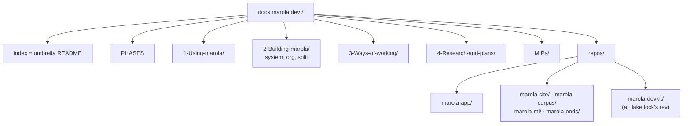
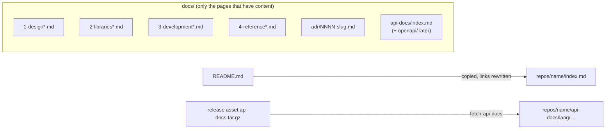
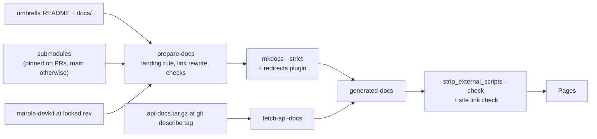

# MIP-0074: Docs after the split — the umbrella is the landing, each repo keeps its low-level docs

| | |
|---|---|
| **Status** | Draft |
| **Author** | Claude (Opus 5.5), from the maintainer's decisions on the post-split docs review |
| **Created** | 2026-10-02 |
| **Phase** | None: docs and repo structure, orthogonal to `docs/PHASES.md`. No Phase 1 prerequisite, no paid resource |
| **Related** | MIP-0070 (§5.5, which this supersedes for docs; §5.4, whose contracts the new org pages document), MIP-0064 (the mkdocs site and its no-`nav:` rule), MIP-0068 (diagrams), MIP-0063 (issues for the tasks) |
| **Effort** | XL — every doc in seven repos is revised, split or rewritten (§5.4), plus a link-rewriting aggregator, a redirect map, a devkit lint tool and a new org `.github` repo |
| **Gain** | `user value` — docs.marola.dev gets a front door, the org's shape is explained on it, and every repo's README and docs reach it; `infra/dev-loop` — one rule for where a doc goes, checked by a linter in every repo, and no monorepo leftovers misleading the next reader |
| **Effort vs Gain** | `do next` — the site has no landing page, four READMEs never reach it, the devkit is missing from it, and most pages still describe the monorepo |
| **Depends on** | MIP-0070 (Implemented): the submodules, `mkdocs/repos.yml` and `scripts/prepare-docs.sh` this changes. Human-only steps: creating `marola-dev/.github`, and picking the content and data licences (§11). No Phase 1 gate, no paid resource |
| **Blocked by** | none |
| **Risk** | The umbrella's user pages describe marola-app's CLI from another repo, and drift from it unless the app's reference pages stay the single source for flags and settings (§8) |
| **Cost so far** | — |

## 1. Summary

docs.marola.dev becomes the umbrella's site. Its root holds every high-level doc: what marola is,
how to use it, the system architecture across repos, how the org is organised and why it was split,
the ways of working, research and MIPs. Every repo, the devkit and marola-app included, mounts
under `repos/<name>/`. There its README is the landing page, followed by low-level docs only: design
and patterns, library choices, ADRs and API docs. Most pages were written for the monorepo, so this
is a content revision as well as a move. §5.4 gives each page an action as well as a destination.

## 2. Motivation

The post-split review (2026-10-02, two read-only passes over all seven repos) found:

- **No front door.** The landing page, `docs/index.md`, is a table of MIP candidates. Most of its
  rows are marola-app pages (`docs/index.md:12-33`). Nothing on the site says what marola is or which
  repos exist. The repo and contract table is only in `AGENTS.md`, and AGENTS.md is not published.
- **READMEs dropped silently.** `prepare-docs.sh:37` writes the README as `<mount>/index.md`, and
  `:39` then overwrites it with `docs/index.md`. site, corpus, ml and oods all have both files. The
  app's README is skipped by design (`mount_at_root`, `:46`).
- **The devkit is absent**: `/repos/marola-devkit/` returns 404.
- **Docs outside `docs/`**: `finetune/README.md` (321 lines), `dspy/README.md` (152 lines) and
  `knowledge/README.md` never reach the site.
- **Monorepo leftovers.** These include recipes that live in another repo (`just context-mips` and
  `just gh-billing` in the app's RUN-LOCALLY, `just e2e` in ml's finetune README), the pre-org repo
  URL in `SECURITY.md:6`, "a **private** repo" (`GEMINI-CODE-ASSIST.md:8`), "a one-person repo"
  (`CONTRIBUTING.md:3`), a 404 link in `dspy/README.md:13`, a `.env.example` belonging to another
  project, and `UMBRELLA_DISPATCH_TOKEN` in the devkit's `workflows.md:130`, where every caller
  passes `MAROLA_CROSS_REPO_PAT`.
- **The app shares the root with the umbrella.** Its `1-`/`2-` sections interleave with the
  umbrella's `3-`/`4-`, and twelve umbrella links into it work only on the combined site.
- **The split is undocumented for humans.** How the repos relate, what each one pins, and how to
  work across them is written only in agent-facing `AGENTS.md:35-75` and MIP-0070.

## 3. User-visible change

Before (live sidebar): `Start here` (MIP table) · `Development phases` · `marola-app` · `1 Using
marola` · `2 Building marola` (API reference, Architecture, Effects map, Scala 3 review) · `3 Working
on the repo` · `4 Research and plans` · `MIPs` · `Repos` (4 of 6, landing on a stub table).

After:

```text
docs.marola.dev/
  (index)                 the umbrella README: what marola is, run it, start here by role, the repos
  Development phases
  1 Using marola          run it locally · ask the ocean notes · chat and MCP · Docker · Telegram setup
  2 Building marola       system architecture · the org and its repos · why and how it was split
  3 Ways of working       dev flow · issue flow · working across repos · the docs site · CI/CD · …
  4 Research and plans
  MIPs                    index · candidates · MIP-NNNN
  repos/marola-app/       README · design · libraries · development · reference · ADRs · API docs
  repos/marola-site/ …    the same shape, for site, corpus, ml, oods, devkit
```

## 4. Data sources and dependencies reviewed

### 4.1 `mkdocs-redirects` (page redirects)

A MkDocs plugin with a `redirect_maps` setting that maps an old Markdown path to a new one. For each
old path it writes an HTML page that carries a `<meta http-equiv="refresh">`, a canonical link and a
one-line inline script that keeps the `#anchor`. The plugin warns when a target does not exist, and
`strict: true` turns that warning into a build failure. Licence: MIT. Releases: 1.2.3 (2026-03-28)
requires `properdocs>=1.6.5` and `mkdocs<=1.6.1`, and 1.2.2 (2024-11-07) requires only
`mkdocs>=1.1.1`. Upstream is now maintained under the ProperDocs organisation. **Pick: pin 1.2.2**
next to `mkdocs==1.6.1` in `mkdocs/Dockerfile`, to avoid a second MkDocs distribution. The pin has
not been built here (Appendix).

### 4.2 Material's `404.html` override (prefix forwards)

Material documents `custom_dir` theme extension and lists `404.html` among the templates it can
override. GitHub Pages serves that page for any missing path on docs.marola.dev: `/nope/x` returned
404 with the site's own 404 page. The plugin can only map Markdown pages, so it cannot cover the
generated API trees. marola-site already forwards prefixes the same way (`site/static/404.html`,
tested by `scripts/redirect_check.js`). **Pick: a small override for the two API prefixes**
(§5.3).

### 4.3 What the site and repos have today (all checked 2026-10-02)

The sitemap lists 112 URLs. 27 of them are outside `MIPs/`, and these are the URLs Appendix B moves
or keeps. The API trees are `/api/scala/{core,local,cli}/…` (app) and `/repos/marola-ml/api/` (ml, a
top-level `index.html`). `/api/` itself returns 404. `marola-dev/.github` returns 404, and none of
the six other repos has a CONTRIBUTING or SECURITY file. All six repos are MIT. No repo has a
`mkdocs.yml`. The umbrella pins the devkit at `v0.2.3`, locked to rev `d1872de` in `flake.lock`.

## 5. Design

### 5.1 Information architecture



**The root belongs to the umbrella, and nothing else mounts there** (D2). The umbrella follows the
same landing rule as the other repos (D1), so its README becomes the site's `index.md` and
`docs/index.md` is retired. The section directories keep their `1-`…`4-` prefixes, because with no
`nav:` (MIP-0064) the filenames alone set the order. `3-Working-on-the-repo/` becomes
`3-Ways-of-working/`, since it now covers the whole org.

**High-level means the umbrella.** A doc belongs to the umbrella when its reader needs no single
repo's code to act on it: using marola, the system across repos, the org, process, research,
proposals. It belongs to a repo when it explains that repo's code, choices or interfaces.

**The split is first-class content.** It lives on four umbrella pages:

| Page | Contents |
|---|---|
| landing (umbrella `README.md`) | What marola is (two paragraphs) · run it in five minutes · **start here, by who you are** (use it / change the app / change the map / add knowledge / train models / work the process / propose something), with a link per row · the repo table with one line each and its docs link · contributing, licence |
| `2-Building-marola/REPOS.md` (new): the org and its repos | The three layers: umbrella, devkit, repo (MIP-0070 §5.1) · each repo: what it owns, what it does not, its docs link · **the contracts**: one producer→consumer diagram plus the table of artifacts and pins (the app image and `marola-image`; release tarballs: corpus, `ml-resources`, `api-docs`; `corpus.version` and `resources.version`; compiled-prompt PRs; `site-data`; OODS ingest commits and export; `notify-umbrella` dispatches) · the rule that no repo reads another repo's tree · the org invariants a repo cannot loosen |
| `2-Building-marola/SPLIT.md` (new): why and how marola was split | Why: one build for everything, colliding worktrees, a data tree in the code history (MIP-0070 §2) · the decisions and the alternatives they beat: submodules under an umbrella, OODS split into code and data, contracts instead of paths, no published Scala libraries, docs aggregated by the umbrella, the devkit as a flake and not a submodule · what moved where (MIP-0070's file assignment, linked) · timeline (MIP #521 → tasks #574…#599) · what was given up (atomic cross-repo changes) |
| `3-Ways-of-working/WORKING-ACROSS-REPOS.md` (new) | Clone with submodules · detached HEAD and how to branch inside a submodule · where a change belongs · cross-repo order: producer releases, consumers bump pins, the pointer moves last through `pointer-sync` · issues: one per PR in its own repo, umbrella parent and sub-issues, fully qualified references, `tasks-to-issues` across repos · cross-repo PRs: same branch name, linked · recipes and which checkout they need |

`2-Building-marola/ARCHITECTURE.md` keeps its URL. It becomes the **system** architecture (§5.4):
the product vision, the request pipeline as one diagram across the app, corpus, ml and site, the
local-first integration pattern (today's §5 intro, which the `mip` skill cites), the target
Telegram architecture and the cloud options. The app's internals move to `repos/marola-app/`.

### 5.2 The per-repo skeleton



- **README is the landing page**, in this order: what the repo is, plus a status line · run or try
  it · repo map · contracts (consumes / publishes / pinned by) · docs and AGENTS.md links. A repo has
  no `docs/index.md`.
- **Pages, not directories**, numbered by role. The nav takes each label from the page's H1, so
  the digit stays out of the sidebar. A page that outgrows itself splits into siblings
  (`1-design.md`, `1-design-integrations.md`), which sort together.
  `1-design`: design and patterns, the module map, the effect boundary. `2-libraries`: each library
  and pinned tool: what it is for, why it was chosen, its version, the alternatives reviewed.
  `3-development`: build, test, fixtures, CI workflows, releases, secrets and cost, for this repo
  only. `4-reference`: config, CLI, data formats, the exhaustive tables.
- **ADRs**: `docs/adr/NNNN-<slug>.md`, numbered from 0001 in each repo. An ADR records a decision
  that starts and ends inside one repo. A decision that crosses a repo boundary, changes what a user
  sees, or needs the MIP rules (sources verified, cost stated) is a MIP. An ADR never overrides a
  MIP. Template: Appendix C.
- **API docs**: generation stays in each repo's release workflow. `docs/api-docs/` in the repo
  holds only hand-written sources: an `index.md` (what is documented and the way in), and later
  `openapi/<service>.yaml`. Generated output is never committed. `fetch-api-docs` unpacks the
  release's `api-docs.tar.gz` under `repos/<name>/api-docs/`. The contract gains one rule: the
  tarball's top level holds only language directories (`scala/`, `python/`), so the generated trees
  cannot collide with `index.md` (marola-ml's pdoc moves under `python/`). The fetch also takes the
  newest `v*` tag reachable from the commit being built (`git describe --tags --abbrev=0`) instead
  of "latest", so the API docs match the prose. An OpenAPI spec is rendered statically at build time,
  with no third-party script. The renderer is chosen by the MIP that adds the first spec (the chat
  server's `/health` and `/ask` are the obvious first one).
- **Not in a repo**: how to use marola, anything spanning repos, process, research, MIPs, and
  another repo's recipes. Those go in the umbrella, or are qualified with "in a marola-app checkout".

### 5.3 The build

`mkdocs/repos.yml` loses `mount:`: every entry mounts at `repos/<name>/`, and a `mount:` key fails
the parse. The devkit joins as a non-submodule source:

```yaml
- name: marola-app
- name: marola-site
- name: marola-corpus
- name: marola-ml
- name: marola-oods
- name: marola-devkit
  source: flake-lock   # fetched at flake.lock's locked rev, so the site documents the pinned devkit
```



**The landing rule.** prepare-docs fails when a repo, the umbrella included, has no `README.md`, or
has both `README.md` and `docs/index.md`. The README is copied to `<mount>/index.md` (the umbrella's
mount is the root) and `docs/**` is copied beside it. `mount_at_root` is deleted.

**Link rewriting.** The rules apply to the README, and to `docs/**` links that leave `docs/`.
`<sha>` is the commit being built: the submodule's HEAD, the umbrella's HEAD, or the devkit's locked
rev. Pinning it keeps a code link from pointing at newer code than the prose describes. The full
case table is Appendix A. In short: links into `docs/` become site-relative, links to code become
pinned GitHub URLs, absolute URLs are untouched, and a link out of the repo, a root-absolute link or
a missing target fails the build.

**Redirects.** Page moves use `mkdocs-redirects` `redirect_maps` in `mkdocs.yml`. A strict build
fails on a missing target, so the map is checked on every build. The two generated prefixes use
`mkdocs/overrides/404.html`, which keeps the path, query and hash. marola-site's `/docs/*` forward
then reaches these with one more hop. The map is Appendix B. Three URLs keep their path with new
content (`/1-Using-marola/RUN-LOCALLY/`, `/1-Using-marola/TELEGRAM-SETUP/`,
`/2-Building-marola/ARCHITECTURE/`). `/marola-app/`, the app's other `2-Building-marola/` pages, `/api/**`,
`/repos/marola-ml/api/**`, `3-Working-on-the-repo/*` and `FABLE_REVIEW` move or are retired.

### 5.4 Placement and action, page by page

Actions: **keep** (only links fixed) · **revise** (stale facts, paths, commands or scope corrected
in place; what changes is named) · **rewrite** (same purpose, new text for the post-split
audience) · **split** (section by section, each part rewritten for its new home, not pasted) ·
**merge** · **retire**. Every row's last step is the stale-content check (§7). App paths are under
`marola-app/docs/`, and ARCH = its `2-Building-marola/ARCHITECTURE.md`.

**marola (umbrella)**

| Current | Destination | Action | Why |
|---|---|---|---|
| `README.md` | site root `index.md` + GitHub | rewrite: add "start here, by who you are", "workspace" → "umbrella", keep 3–4 org badges (the Scala/JDK/coverage ones go to the app README), `docs/` links made relative to the rewrite | the landing (D1) |
| `README.pt-BR.md` | stays, GitHub only | rewrite to match the new README's sections | it lacks "What you get" and "Contributing", and orders sections differently |
| `AGENTS.md` | stays | revise: repo table, "where a change belongs" and "submodule mechanics" keep the rule and link the new pages; "Writing a doc is a deploy" loses the root mount and `docs/index.md`; paths updated (`3-Ways-of-working/`, `PHILOSOPHY.md`) | agent rules stay; the explanation moves to the site |
| `PHILOSOPHY.md` | `docs/3-Ways-of-working/PHILOSOPHY.md` | revise: app file paths become docs.marola.dev links | high-level, and invisible on the site today |
| `CONTRIBUTING.md` | `docs/3-Ways-of-working/CONTRIBUTING.md`; a short pointer in `marola-dev/.github` | rewrite: no "one-person repo", issues go to the repo the PR lands in, real dependabot scope, Scala style → app | org-wide guide; every repo inherits the pointer |
| `SECURITY.md`, `CODE_OF_CONDUCT.md` | `marola-dev/.github/` | revise: the pre-org URL → org URLs, no "one-person project" | org defaults that cover every repo |
| `TODO_FL.md` | out of the repo | retire | a talk-CFP list, neither doc nor tracked work |
| `docs/index.md` | `docs/MIPs/CANDIDATES.md` | rewrite: one row per candidate idea, links absolute where the page is a repo's, the FUTURE-WORK duplicate dropped | not a landing page; MIP material belongs with MIPs |
| `docs/PHASES.md` | stays | revise: current-status line per phase with its MIP, no "(done, this change)", app references as absolute links | stale wording, a relative link into the app |
| new | `1-Using-marola/` (5 pages) | written from the app's RUN-LOCALLY split, below | using marola is high-level |
| new | `2-Building-marola/REPOS.md`, `SPLIT.md` | new (§5.1) | the split as content |
| `3-Working-on-the-repo/` | `3-Ways-of-working/` | rename (redirects) | it now means the org |
| `…/DEV-FLOW.md` | `3-Ways-of-working/DEV-FLOW.md` | split: §1–6 revised (umbrella paths, cross-repo PRs link WORKING-ACROSS-REPOS); §1 absorbs RUN-LOCALLY §8; §7's `mip-solve-perpetual` mechanics → devkit `4-reference-plugin.md`; §8 → `DOCS-SITE.md`; §9 → devkit `4-reference-tools.md`, linked | §8 lists the app's directories as this repo's; §9 is the devkit's reference |
| new | `3-Ways-of-working/DOCS-SITE.md` | written from DEV-FLOW §8, CI-CD's docs row, prepare-docs' header: mounts, landing rule, link rules, skeleton, preview, redirects | "how the site is built" is scattered over three files |
| new | `3-Ways-of-working/WORKING-ACROSS-REPOS.md`, `NEW-REPO.md` | new: §5.1; the checklist for adding a repo (flake, justfile import, hooks, settings, workflows, AGENTS block, labels, ruleset, repos.yml, docs skeleton) | the split as content; adoption is org process |
| `…/ISSUE-FLOW.md` | `3-Ways-of-working/` | revise: "The commands" → devkit `4-reference-tools.md`, linked | the command table duplicates DEV-FLOW §9 |
| `…/CI-CD.md` | `3-Ways-of-working/` | split: umbrella workflows, org secrets, self-hosted rule and manual settings stay, revised; the per-repo narrative (`:36-72`) → one line per repo plus each repo's `3-development.md`; the `:138` claim (ml prompt PRs come "here") fixed to marola-app | it re-describes other repos' workflows, which will drift |
| `…/AGENT-SKILLS.md` | `3-Ways-of-working/` | split: rewrite as "skills across the org, which repo has which"; §1.1 → devkit `4-reference-plugin.md`; §2.2 (one person's user-scope plugins) retired | §1 is empty post-split |
| `…/DIAGRAMS.md` | `3-Ways-of-working/` | keep | org-wide authoring rule |
| `…/GEMINI-CODE-ASSIST.md` | `4-Research-and-plans/` | rewrite: the premise (a private repo) is false; the Besom plan stays as research; app setup moves to app `3-development.md` if adopted | stale and mostly a plan |
| `…/SELF-DOCUMENTING.md` | `4-Research-and-plans/` | keep | it is research behind MIP-0018 |
| `4-…/AGENT-FRAMEWORKS-SURVEY.md`, `AGENT-STACK-SURVEY.md`, `AWESOME-AGENTIC-ENGINEERING.md` | stay | revise: links into app code become absolute GitHub links | cross-cutting research |
| `4-…/FUTURE-WORK.md` | stays, smaller | split: §1, §4, §8, §9, §10, §11 stay, revised; §2, §3, §5, §6 → app `2-libraries.md` as library reviews; §7 retired, with §7.3 → app `adr/0001-three-sbt-modules.md` | library reviews belong with the code they judge |
| `4-…/ROADMAP.md` | stays | revise: a dated banner; a refresh is separate work | "the eighteen MIPs" is stale |
| `4-…/FABLE_REVIEW.md` | retired; open items → marola-app issues (filed by a human) | retire | a dated monorepo import review, most items fixed |
| `4-…/SKILLS.md` | stays | revise: app classes cited by absolute link | a learning ladder for a person, not code docs |
| `MIPs/README.md`, `MIP-*.md`, `*.tasks.md` | stay | revise `README.md:4` only (the skill path → `/marola-devkit:mip`); MIPs are dated records | — |
| `MIPs/MIP-0009/screenshots/README.md` | stays | keep, add to `not_in_nav` | a stray sidebar section |
| `docs/superpowers/` | — | retire | dated working notes, already off-site |
| `docs/img/`, `docs/assets/` | stay | keep | the README image rewrites to `img/…` |
| `.gemini/styleguide.md` | — | retire | marola-app already carries its own copy |
| `.claude/rules/docs.md` | stays | revise: no `docs/index.md`; add the landing, link and skeleton rules | it describes the old index |
| `repomix-instruction*.md`, `.github/PULL_REQUEST_TEMPLATE.md` | stay | keep | tool input / devkit-managed |

**marola-app** (mounted at `repos/marola-app/`)

| Current | Destination | Action | Why |
|---|---|---|---|
| `README.md` | landing | rewrite to the shared shape: MCP and chat server, "no Telegram loop yet", the badges from the umbrella | the root mount drops it today |
| `docs/index.md` | — | merge into README's Contracts; retire | D1 |
| RUN-LOCALLY §1–4, 4.1, 5, 6, 12 | umbrella `1-Using-marola/RUN-LOCALLY.md` | split → rewrite for a reader with an app checkout; flags and env vars link `4-reference-*`; `MAROLA_LLM_PROVIDER` (read nowhere in the code) dropped | the user path |
| RUN-LOCALLY §5.1 | umbrella `1-Using-marola/ASK-THE-OCEAN-NOTES.md` | split → rewrite; the embedder choice → app `4-reference-config.md` | user task vs settings table |
| RUN-LOCALLY §5.2 | umbrella `1-Using-marola/CHAT-AND-MCP.md` (run `--serve-chat`, expose it, connect an MCP client); the widget config → site `1-design-chat-widget.md` | split → rewrite each half | the widget is marola-site's code |
| RUN-LOCALLY §7 | app `3-development.md` (testing: golden spec, fixtures and re-recording, parser fixtures, `oods/` fixtures, E2E, coverage) | split → rewrite | developer material |
| RUN-LOCALLY §8 | umbrella DEV-FLOW §1 | merge | `just context-mips` is an umbrella recipe |
| RUN-LOCALLY §9 | app `4-reference-cli.md` (`--site`, `--areas`, `--site-out`); a pointer to site `3-development.md` | split → rewrite | a CLI mode; the map is the site's |
| RUN-LOCALLY §10 | umbrella `1-Using-marola/DOCKER.md` (run the published image); app `3-development.md` (tags, compose profiles, native build) | split → rewrite | using vs building |
| RUN-LOCALLY §11 | app `3-development.md` (observability: MLflow ledger, traces) | split → revise: `just mlflow-ui` exists nowhere | developer material |
| `1-Using-marola/TELEGRAM-SETUP.md` | umbrella `1-Using-marola/TELEGRAM-SETUP.md` (same URL) | revise: PHASES link absolute, a "preparation for Phase 1" banner | Phase-1 preparation, cross-cutting |
| ARCH §1–2, §4, §5 intro, §6 | umbrella `2-Building-marola/ARCHITECTURE.md` (same URL) | split → rewrite as the system architecture | vision, target, pattern and cloud options are system-level |
| ARCH §3 + §3b, §5b | app `1-design.md` | split → rewrite: regenerate the module tree (it lists ~25 of ~60 sources) | app internals |
| ARCH §3.1 | app `4-reference-cli.md` | split → rewrite into a table of every flag and mode from `Main.scala`, the four MCP tools, and `/health`/`/ask` | `--benchmark` and `--site-out` appear in no doc |
| ARCH §5a, §5c–§5g | app `1-design-integrations.md` | split → revise: paths, statuses | the six integrations, in code |
| ARCH §5h | umbrella `REPOS.md` (corpus → app/ml flow) + app `1-design-integrations.md` (retrieval) | split → rewrite each half | cross-repo vs in-app |
| ARCH §7 | app `4-reference.md` (data sources); the tile policy → site `4-reference.md` | split → revise | reference tables |
| ARCH §8–9 | app `1-design-heuristics.md` | split → revise | honest limitations of the app's own logic |
| ARCH §11 | — | retire | a "moved to PHASES" stub |
| `2-Building-marola/EFFECTS-MAP.md` | app `1-design-effects.md` | revise: drop "see git history" (filtered by the split) | design and patterns |
| `2-Building-marola/SCALA3-JDK-REVIEW.md` | app `2-libraries-scala3-jdk.md` | keep | language/JDK choices |
| `2-Building-marola/API.md` | app `api-docs/index.md` | revise: `just docs` is not an app recipe | the way into the generated trees |
| new | app `2-libraries.md`, `4-reference-config.md` (every `MAROLA_*` var), `adr/0001-three-sbt-modules.md`, `3-development.md` (+ the nine workflows and release assets) | new, from FUTURE-WORK §2/3/5/6/7.3, `AppConfig.scala`, umbrella CI-CD | missing reference |
| `.env.example` | stays | rewrite: the app's `MAROLA_*` placeholders instead of `DATABASE_URL`/`COST_GOVERNOR_*` | another project's file |
| `AGENTS.md` | stays | revise `:34` (the root-mount claim) and the docs paths | stale after D2 |
| `scripts/fixtures/ocr/README.md`, `.gemini/styleguide.md` | stay | keep | test provenance / tool config, not pages |

**marola-site, marola-corpus, marola-ml, marola-oods, marola-devkit**

| Current | Destination | Action | Why |
|---|---|---|---|
| site `README.md` + `docs/index.md` | landing | merge: contracts and checks into README; the image-bump steps get one home (`3-development.md`) | D1; the bump is in both files and AGENTS.md |
| site (new) | `1-design.md` (files, board → markers, CSP and no-third-party rule), `1-design-chat-widget.md`, `2-libraries.md` (vendored Leaflet, no build step), `3-development.md` (`site.yml`, the `site-data` layout, health checks, i18n bundling, the `MIP:` trailer), `4-reference.md` (`areas.json` fields, tile policy, board schema pin) | new, from AGENTS.md, app RUN-LOCALLY §5.2 and ARCH §7 | none of this has a doc |
| corpus `README.md` + `docs/index.md` | landing | rewrite: status line (sources not yet human-verified), a content-licence section, "marola" → marola-app, marola-ml added as a consumer | the main caveat is hidden today |
| corpus `knowledge/README.md` | stays as a format reminder; the format and chunking → `1-design.md`; per-document source and verification → `4-reference.md`; the embedder table → app `4-reference-config.md` | split | off-site, and the embedder table is the app's |
| corpus (new) | `3-development.md` (the reproducible tarball, release, bumping both consumers, trying a change from an app checkout) | new | — |
| corpus `.claude/skills/eli5/` | umbrella `.claude/skills/eli5/` | revise: paths via the submodules | it explains ocean topics and app internals, and only the umbrella checkout sees both |
| corpus `.claude/skills/corpus-doc/`, `knowledge/*.md` | stay | revise the skill: its index/ask steps need an app checkout | content, not pages |
| ml `README.md` + `docs/index.md` | landing; the gate and re-baselining → `3-development-benchmark-gate.md` | merge + rewrite: the `marola-sea-v1` one-off moves to the publish page | D1 |
| ml `dspy/README.md` | `3-development-prompt-compile.md`; a 3-line pointer stays | split → revise: the dead ARCHITECTURE link, `core/…` paths, `just mlflow-up` qualified | off-site |
| ml `finetune/README.md` | `3-development-finetune.md`; a 3-line pointer stays | split → revise: `just run`/`e2e`/`quality-other` qualified or removed, resources from the tarball | off-site, stale recipes |
| ml (new) | `1-design.md` (three jobs, none on the request path), `2-libraries.md`, `3-development.md` (environment, GPU, self-hosted runner, cost and who may run what, publishing, pins) | new | AGENTS.md-only today |
| ml `docs/benchmarks/` | stays, off-site | keep | a ledger |
| oods `README.md` + `docs/index.md` | landing; checks → `3-development.md` | rewrite: a status line instead of PR-number history, the tree labelled "planned (MIP-0056)", a data-licence section | D1; history belongs in the MIP |
| devkit `README.md` + `docs/index.md` | landing | merge + revise: the stale mkdocs line (`README.md:27`), the false "the site mounts this" claim, the missing tools (`workflow-runners`, `pr-label-nlp`, `backfill-pr-labels`) | D1, and it is not mounted today |
| devkit `docs/workflows.md` | `4-reference-workflows.md` | revise: no monorepo wording, `MAROLA_CROSS_REPO_PAT` | stale |
| devkit (new) | `1-design.md` (layout, how tools find the umbrella), `3-development.md` (self-test first, `devkit-ci`, the release rule), `4-reference-{tools,config,hooks,plugin,runners}.md`, `CHANGELOG.md` at the root | new, from DEV-FLOW §7/§9, ISSUE-FLOW, AGENT-SKILLS §1.1, `flake.nix`, scripts' `--help` | 8 of 14 `MAROLA_*` vars documented nowhere; no changelog |
| `AGENTS.md`, `CLAUDE.md`, skills, agents, PR templates (all five) | stay | revise each AGENTS.md's docs paragraph to the skeleton and link rules | agent files, not pages |

### 5.5 Conventions

- **Links**: relative inside a repo, written so they work on GitHub (the rewrite makes them work on
  the site). Absolute `https://docs.marola.dev/…` across repos, the umbrella included. Code links are
  relative in the README and rewritten to pinned GitHub URLs.
- **Recipes**: a doc names only its own repo's recipes and the devkit's. Any other recipe is
  qualified with "in a marola-app checkout".
- **Numbering and nav order**: numbered directories only at the umbrella root, numbered pages inside
  repos, ADRs `NNNN`, MIPs unchanged. There is still no `nav:`. Files sort before directories, so the
  root reads index, PHASES, 1–4, MIPs, repos.
- **Naming**: "umbrella" everywhere ("workspace" is retired). A repo is "marola-<name>", "marola" on
  its own is the umbrella, and the product is "marola".

### 5.6 Org-level items

- **In scope**: the stale facts (§2), the devkit on the site, the `.env.example`, and the licence
  *sections* in the corpus and oods READMEs. Which licence goes in them is a §11 question.
- **In scope, done by a human**: create `marola-dev/.github` (org defaults: CONTRIBUTING pointer,
  SECURITY, CODE_OF_CONDUCT, `profile/README.md` with the repo table). The umbrella then drops its
  root copies and inherits them.
- **MIP-0070 §5.5's standalone per-repo `mkdocs.yml` + `just docs-serve` is dropped.** It was
  never built. In its place, a devkit `docs-lint` runs in every repo's `quality-other` with no
  Docker: the landing rule, the link rules, and the recipe and monorepo-leftover checks (§7). A
  full rendered preview stays `just docs-serve` in an umbrella checkout, with the submodule on your
  branch.

### 5.7 Rollout

1. Stale facts in every repo, as small direct PRs.
2. devkit: `docs-lint` and its own docs, then a tag; every repo adopts it.
3. site, corpus, ml, oods: README landing, skeleton pages, content revised. Each repo drops
   `docs/index.md`, which today's aggregator also handles: the README then shows. ml's tarball
   moves its pdoc under `python/` in a new release.
4. **Paired**: marola-app's restructure merges, then the umbrella PR follows at once (pointer bump,
   `repos.yml`, prepare-docs, fetch-api-docs, the 404 override, the redirect map, the pages that
   receive the app's sections, the new org pages). Between the two merges the scheduled `--remote`
   build fails `--strict`, and the live site stays on its last good deploy.
5. `marola-dev/.github`, then the umbrella's root health files go.

## 6. Scoring / safety impact

None. No scoring code changes. User-facing safety caveats keep their wording, including the
corpus's unverified-sources status, which is promoted to its README.

## 7. Verification plan

- **prepare-docs `--self-test`**, new cases: `readme_and_docs_index_fails`, `missing_readme_fails`,
  `mount_key_rejected`, `umbrella_readme_is_root_index`, `rewrite_docs_and_dot_docs`,
  `rewrite_keeps_anchor`, `dir_link_to_index`, `dir_link_without_index_fails`,
  `image_md_and_html_rewritten`, `image_outside_docs_fails`, `code_file_to_blob_at_sha`,
  `code_dir_to_tree_at_sha`, `docs_page_parent_readme_to_index`, `parent_escape_fails`,
  `root_absolute_fails`, `missing_path_fails`, `absolute_urls_untouched`,
  `reference_definition_and_html_href`, `code_span_and_fence_untouched`,
  `devkit_fetched_at_locked_rev`.
- **fetch-api-docs `--self-test`**: `unpacks_under_api_docs`, `top_level_file_rejected`,
  `tag_from_git_describe`.
- **404 forward**: `scripts/docs_redirect_check.js` runs the override's mapping over a table of old
  → new URLs under node (in the umbrella flake, `flake.nix:47`), the way marola-site's
  `redirect_check.js` does.
- **Build**: `just docs`, a `--strict` build with every submodule at the new commits and the devkit
  at its locked rev. A redirect to a missing target fails it.
- **Site link check**: `scripts/site_links_check.py` (stdlib only, no network) verifies that every
  `https://docs.marola.dev/…` href in the built HTML resolves to a file in `generated-docs`, redirect
  stubs included.
- **Stale-content check** (in `docs-lint`, every repo): (a) every `just <recipe>` in a repo's docs
  is defined in that repo's justfile or `devkit.just`, or sits in a sentence naming its checkout; (b)
  no monorepo leftovers: no `core/src/…`, `local/…` or `cli/…` path outside marola-app, no
  `docs/1-Using-marola`/`docs/2-Building-marola` path, no `marola-dev/marola/blob/main/docs/2-…`
  link, no pre-org repo URL, and no "monorepo" outside dated MIPs and `SPLIT.md`; (c) no
  `docs/index.md`; (d) no relative link leaving the repo. Allow-listed by file, never by line.
- **After deploy**: for each "plugin" row in Appendix B,
  `curl -s https://docs.marola.dev/<old>/ | grep -o 'http-equiv="refresh"[^>]*'` names the new URL,
  and `curl -s -o /dev/null -w '%{http_code}' https://docs.marola.dev/<new>/` returns 200. For each
  "404 forward" row, the old URL returns the 404 page carrying the forward, and the new URL returns
  200. `/repos/marola-devkit/` returns 200.
- **Done** means every §5.4 row has landed, `docs-lint` passes in all seven repos, the site's
  landing is the umbrella README, and the four org pages exist.

## 8. Risks, limitations, and honest caveats

- **Drift across repos.** The umbrella's `1-Using-marola/` pages describe app commands that change
  in marola-app. The mitigation is that they describe tasks and link the app's `4-reference-cli`/
  `-config` for every flag and variable, which are the single source. The app's AGENTS.md gains a
  rule: a CLI or config change that alters a user step opens the paired umbrella PR. Without that
  rule, the drift returns.
- **Anchors break.** A deep link into today's ARCHITECTURE (say `#5a-…`) still lands on the same
  URL, but on the system page, without that section.
- **The rollout window** in §5.7 step 4 is a red docs build until the umbrella PR merges.
- **mkdocs-redirects 1.2.2 is not the newest release** (1.2.3 pulls in `properdocs`). It is
  unbuilt here. Its stubs carry an inline script, as the 404 override does. docs.marola.dev sends no
  CSP header (Pages), and `strip_external_scripts.py --check` targets only external `<script src>`.
- **Badges on the landing** are external images. How the privacy plugin handles them at build time
  was not checked.
- **Header links**: `repo_url` is the umbrella for every page, so a repo page's GitHub icon points
  at the wrong repo.
- **Nav**: "repos" sorts after "MIPs", and directory labels are title-cased ("Marola app"). §11
  asks whether that is acceptable.

## 9. Alternatives considered

- **Do nothing**: the site keeps no front door and drops four READMEs.
- **`docs/index.md` as each repo's site landing, README for GitHub** (the review's D1 (b)): two
  front doors per repo to keep in sync. The maintainer chose the README.
- **Keep the app at the root with `0-` org prefixes** (the review's D2 (a)): no URL churn, but the
  app cannot add sections and the site reads as one product's manual. The maintainer chose
  `repos/marola-app/`.
- **A separate umbrella landing page** besides its README: it breaks the one-rule-everywhere.
- **Copy READMEs with no rewrite, or point every link at GitHub**: the first breaks links, the
  second sends readers off-site for pages the site has.
- **Redirects all in the 404 page, or hand-written stubs**: the plugin checks targets at build time
  and the 404 page does not. Hand-written stubs reimplement the plugin.
- **Commit generated API docs under `docs/api-docs/`**: generated HTML in every repo's history, for
  no gain over a release asset.
- **The devkit as a docs-only submodule**: a second pin for one thing, independent of
  `flake.lock`, against "not a submodule" (`AGENTS.md:44`).
- **Per-repo `mkdocs.yml` (MIP-0070 §5.5)**: seven copies of the theme config to keep in step.
  `docs-lint` catches what breaks a build, without Docker.

## 11. Open questions

1. **Licences**: what licence does the corpus's paraphrased content carry (the repo is MIT; the
   sources include NOAA, IMA/SC and Wikipedia), and what does oods state per agency? The agencies'
   terms were not checked.
2. **Nav order and labels**: accept "repos" after "MIPs" and title-cased directory labels, or add a
   nav plugin? That would revisit MIP-0064's no-`nav:` decision, and no plugin was evaluated here.
3. **The umbrella README as the site's front page**: its emoji headings, Thanks and Contact sections
   will show on docs.marola.dev. Keep them, or trim the README for both audiences?
4. **FABLE_REVIEW and TODO_FL**: retire them as proposed (open review items become app issues; the
   CFP list moves off-repo), or keep them somewhere?
- **Follow-up (issue, not a MIP)**: `scripts/repo_stats.py` counts LOC from the `marola-app/`
  submodule tree in CI, against MIP-0070 §5.4.
- **Follow-up MIP** (needs the next number): record which repos a MIP lands in, in the template and
  the index, now that tasks span repos.

## Appendix

### A. Link-rewrite rules (§5.3)

| Link (inline, reference-style `[x]: …`, or HTML `href=`/`src=`) | Becomes |
|---|---|
| `docs/x.md`, `./docs/x.md`, `docs/x.md#a` | `x.md`, `x.md#a` |
| `docs/sub/` | `sub/index.md` if that exists; otherwise the build fails |
| `docs/img/a.png` (Markdown image or ``) | `img/a.png` |
| `#a` | unchanged |
| a file outside `docs/` (`AGENTS.md`, `LICENSE`, `scripts/x.sh`) | `https://github.com/marola-dev/<repo>/blob/<sha>/<path>` |
| a directory outside `docs/` (`knowledge/`, `finetune/`) | `https://github.com/marola-dev/<repo>/tree/<sha>/<path>` |
| from `docs/**`: `../README.md` | the mount's `index.md` |
| an image outside `docs/` | fails: move it under `docs/` |
| `../…` out of the repo, `/…` root-absolute, or a path missing at `<sha>` | fails, naming the file and the link |
| `https://…` (docs.marola.dev and GitHub included), `mailto:` | unchanged |
| inside code spans and fences | untouched (today's `prose()`) |

### B. Redirect map (§5.3)

| Old URL | New URL | How |
|---|---|---|
| `/1-Using-marola/RUN-LOCALLY/`, `/1-Using-marola/TELEGRAM-SETUP/`, `/2-Building-marola/ARCHITECTURE/` | unchanged; each becomes the umbrella's rewritten page | — |
| `/marola-app/` | `/repos/marola-app/` | plugin |
| `/2-Building-marola/EFFECTS-MAP/` | `/repos/marola-app/1-design-effects/` | plugin |
| `/2-Building-marola/SCALA3-JDK-REVIEW/` | `/repos/marola-app/2-libraries-scala3-jdk/` | plugin |
| `/2-Building-marola/API/` | `/repos/marola-app/api-docs/` | plugin |
| `/api/**` | `/repos/marola-app/api-docs/**` | 404 forward |
| `/repos/marola-ml/api/**` | `/repos/marola-ml/api-docs/python/**` | 404 forward |
| `/3-Working-on-the-repo/{AGENT-SKILLS,CI-CD,DEV-FLOW,DIAGRAMS,ISSUE-FLOW}/` | `/3-Ways-of-working/…/` | plugin (5) |
| `/3-Working-on-the-repo/{GEMINI-CODE-ASSIST,SELF-DOCUMENTING}/` | `/4-Research-and-plans/…/` | plugin (2) |
| `/4-Research-and-plans/FABLE_REVIEW/` | the GitHub blob at the last commit that had it | plugin (external target) |
| `/repos/marola-{site,corpus,ml,oods}/`, `/PHASES/`, `/MIPs/**`, the rest of `4-Research-and-plans` | unchanged | — |

### C. ADR template (§5.2)

```markdown
# ADR-NNNN: <the decision, as one sentence>

| | |
|---|---|
| **Status** | Proposed / Accepted / Superseded by ADR-NNNN |
| **Date** | YYYY-MM-DD |
| **Related** | MIP-NNNN, PR #N, ADR-NNNN |

## Context
## Decision
## Consequences
## Alternatives
```

### Checked live

- `https://docs.marola.dev/sitemap.xml`, 2026-10-02: 112 URLs, 27 outside `MIPs/` (the list Appendix B uses).
- `https://docs.marola.dev/{,1-Using-marola/RUN-LOCALLY/,2-Building-marola/{ARCHITECTURE,API}/,marola-app/,repos/marola-{site,ml,corpus,oods}/,repos/marola-ml/api/,api/scala/core/marola.html}`, 2026-10-02: 200.
- `https://docs.marola.dev/api/` and `/repos/marola-devkit/`, 2026-10-02: 404. `/nope/x`: 404 with the site's own 404 page. No `content-security-policy` header (server: GitHub.com).
- docs.marola.dev live sidebar, 2026-10-02: index, PHASES, `marola-app` page, then `1`–`4`, then MIPs, then Repos (files before directories; "API reference" first in section 2).
- `https://pypi.org/pypi/mkdocs-redirects/json`, 2026-10-02: 1.2.3 (2026-03-28) requires `mkdocs<=1.6.1,>=1.2`, `properdocs>=1.6.5`, MIT; 1.2.2 (2024-11-07) requires `mkdocs>=1.1.1`.
- `ProperDocs/properdocs-redirects` README and `mkdocs_redirects/plugin.py` (master), 2026-10-02: `redirect_maps`, warns on a missing target, `use_directory_urls` handling, template = canonical + inline script + meta refresh.
- `squidfunk/mkdocs-material` `docs/customization.md` (master), 2026-10-02: `custom_dir` theme extension; `404.html` listed as an overridable template.
- `https://api.github.com/repos/marola-dev/.github`, 2026-10-02: 404. `raw.githubusercontent.com/marola-dev/<repo>/main/{CONTRIBUTING,SECURITY}.md` for app, site, corpus, ml, oods, devkit: 404.
- Shallow clones on 2026-10-02, matching the umbrella's pins: app `16ab0c4`, site `568199a`, corpus `c62001b`, ml `50d08b3`, oods `dad1e0a`, devkit `d1872de` (= `flake.lock`'s locked rev for `v0.2.3`). Read: every `.md` (§5.4), each `LICENSE` (all MIT), the app's `.env.example` (`DATABASE_URL`, three `COST_GOVERNOR_*`), `grep MAROLA_LLM_PROVIDER` over the app's `core`/`local`/`cli` (no hits), the app's and ml's `release.yml` (`api-docs.tar.gz`), marola-site's `404.html` forward.
- Umbrella at `8387c25`: `scripts/prepare-docs.sh`, `scripts/fetch-api-docs.sh`, `scripts/lib/repos_manifest.sh`, `mkdocs/{repos.yml,mkdocs.yml,Dockerfile}`, `.github/workflows/docs.yml`, `flake.nix`, and the file:line citations in §2 and §5.4, re-read.

### Not checked

- Any of the new code: the rewrite engine, `docs-lint`, the 404 override, `site_links_check.py`. These are written, not run.
- mkdocs-redirects 1.2.2 actually building with mkdocs 1.6.1 and material 9.7.7 in this image.
- How Material's privacy plugin treats external badge images.
- Whether GitHub's `profile/README.md` and org-default community files behave as described for this org. That comes from GitHub's general documentation, not fetched this session.
- Line counts and "~25 of ~60 sources" figures repeated from the review's reports, not recounted.
- Any OpenAPI renderer; the agencies' data terms for oods.
