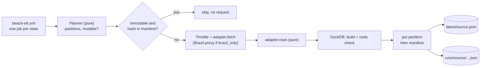

# MIP-0075: A water-quality store in Cloudflare R2, loaded weekly per state, so a build stops calling the agencies

| | |
|---|---|
| **Status** | Draft — design input: marola-oods `specs/001-beach-persistence/` (branch `claude/zen-brown-d4e27k`, still written for Postgres; §11) |
| **Author** | Claude, from the maintainer's decisions on marola-dev/marola-oods#1 (2026-10-02) and on this MIP's PR (2026-10-04: object storage first, R2, a database later) |
| **Created** | 2026-10-02 (revised 2026-10-04: Supabase → R2) |
| **Phase** | 2 (`docs/PHASES.md`: a cloud backend) while Phase 1 is not done; §11 asks for an explicit, scoped exception |
| **Related** | marola-dev/marola-oods#1 (the sketch this MIP turns into a design), MIP-0056 (OODS: §4.4's Parquet layout and §5.2's adapters, planner and DuckDB transform, reused here with R2 in place of git), MIP-0031 and MIP-0067 (INEA/INEMA parsers, curated coordinates), MIP-0001 (`WaterQualityClient`), MIP-0005 §5.4 ("every build fetches", which this ends for water quality), MIP-0057 (the GCP opt-in, the Phase 2 precedent), MIP-0070 (where code, data and workflows live) |
| **Effort** | M — store and adapter code in marola-app's `oods` module on DuckDB (already MIP-0056's one new dependency), a per-state workflow in marola-oods, a download step in marola-site's `site.yml`; no database, no new Scala client |
| **Gain** | `user value` — the map keeps each agency's last verdict through an outage, and more states become one adapter each; `infra/dev-loop` — a site build no longer depends on agency hosts, and the store is testable on a local directory or MinIO; `cost/ops` — ~1 fetch per agency per week instead of one per build every 3 h, and nothing running between loads |
| **Effort vs Gain** | `do when X lands` — the adapters, the Parquet build and the tests run locally now; the hosted bucket waits on the maintainer's Phase 2 exception and a person creating the R2 bucket and its two tokens |
| **Depends on** | MIP-0056's design (the `oods` module, `SourceAdapter`, the planner, the DuckDB SQL), reused, not waited on: this MIP's tasks build them. MIP-0070 (Implemented): the repos. A person: the Cloudflare account with R2 enabled, the bucket, two scoped API tokens (§5.6), and for RJ/BA the Brazil proxy of marola-dev/marola-site#20. Phase 1 gate: yes, unless §11's exception is granted |
| **Blocked by** | none |
| **Risk** | Object storage has no transactions or constraints: a crashed run or a bad adapter can leave a partition half-written or wrong, so the order of writes (§5.4) and the checks (§7) carry what Postgres's constraints did |
| **Cost so far** | — |

## 1. Summary

A Cloudflare R2 bucket holds every monitoring point the agencies publish and every sample, as
Parquet in MIP-0056 §4.4's layout, with English columns that carry the federal Praia Limpa
dictionary's fields, partitioned by source (one or more per state) and year. Beside the Parquet,
one small JSON per source holds the latest sample per point in `CachedWaterQualityClient`'s format.
A GitHub Actions job per state, running marola-app's `oods` entrypoint from the pinned image,
loads it weekly the day after the agency publishes: idempotent, throttled, resumable, and on
record. The map's build downloads the latest JSON instead of calling IMA, INEA and INEMA every
three hours, so an agency outage no longer empties the map.

The store is files, not a database: the data is append-mostly, read in batches (a build, a
forecasting job, DuckDB or pandas), and nothing needs a server running between weekly loads. A
database (Supabase was this MIP's first draft) comes back as its own MIP when something needs
queries per request (§9).

## 2. Motivation

From marola-dev/marola-oods#1, all observed:

- **An outage empties water quality.** On 2026-10-01 `site health` (marola-site run 36937931760)
  found no sampling points in any area. `CachedWaterQualityClient` keeps the last good fetch on
  the runner's disk, and the runner throws it away.
- **INEA and INEMA answer only Brazilian IPs**, so GitHub-hosted runners can't reach them
  (marola-dev/marola-site#4).
- **Every build re-downloads bulletins that change weekly**, eight times a day.
- **3 of 14 monitoring states are covered**, and nothing keeps history beyond what MIP-0056 planned.

How each agency is fetched today (marola-app `local/src/main/scala/marola/water/`, read at
`06280ba`):

| Agency | Client | Request per build | Coordinates | Counts | Sample date |
|---|---|---|---|---|---|
| IMA/SC | `ImaScWaterQualityClient` | `POST /relatorio/mapa`, ~207 KB, 260 points × last 5 samples; PDF backup | feed | E. coli (field named `enterococciPer100ml`) | lab date |
| INEA/RJ | `IneaRjWaterQualityClient` | 2 city pages → newest zone PDFs → `IneaPdfParser` | curated JSON | none | filename date |
| INEMA/BA | `InemaBaWaterQualityClient` | one PDF at a pinned `idcampanha=83453` → `InemaPdfParser` | curated JSON | none | **the fetch day** |

## 3. User-visible change

Nothing new on the page; what changes is what it survives. Before, an agency down at build time:

```text
Florianópolis · Campeche — water: no data
```

After, the store's last bulletin, dated, until the existing 45-day rule ages it out:

```text
Florianópolis · Campeche — water: PRÓPRIA (4/5 pts, sampled 2026-09-28)
```

For a person, one query per state, straight off the bucket (`oods status --state SC`, or DuckDB
with an R2 secret):

```text
state | ibge_code | municipality  | beach_name | point_name | condition | proper_count/classified | proper_ratio | lat     | lon     | water_lat | water_lon
SC    | 4205407   | Florianópolis | Campeche   | Ponto 35   | propria   | 3/4                     | 0.75         | -27.680 | -48.480 | -27.671   | -48.475
```

## 4. Data sources and dependencies reviewed

### 4.1 The agencies

Unchanged from MIP-0001, MIP-0031 and MIP-0067: IMA/SC (JSON feed, CSV per beach-year since 2003,
weekly PDF), INEA/RJ (zone PDFs, curated coordinates), INEMA/BA (campaign PDFs, curated
coordinates). The 11 other states are surveyed in marola-dev/marola-oods#1 "Who publishes what",
from search results and public scrapers; none was opened from here (`*.gov.br` is blocked), so
each new state's adapter PR verifies its own source first.

### 4.2 The Praia Limpa dictionary (MMA)

The federal app's open-data dictionary names the fields a monitoring point carries: `ESTADO`,
`CODMUN`, `MUNICIPIO`, `NOME_PONTO`, `NOME_BALNEARIO`, `REFERENCIA_LOCALIZACAO`,
`BALNEABILIDADE`, `LATITUDE`, `LONGITUDE`. The store carries each, in English (§5.2). Its only
open dataset covers 2021-01-04 to 2022-09-16; whether the app still runs is unknown (§11).

### 4.3 The store: Cloudflare R2

Decided by the maintainer on this MIP's PR (2026-10-04), after a comparison of object stores on
the same PR: persist to object storage first, R2 rather than Backblaze B2, a database later.
R2 is S3-compatible, so every tool below speaks to it through the S3 API at
`https://<account_id>.r2.cloudflarestorage.com`.

Its free tier, as the PR comparison and Cloudflare's pricing page summarise it (not re-read here,
`developers.cloudflare.com` is blocked; see Not checked): 10 GB-month of storage, 1 million
Class A (write, list) and 10 million Class B (read) operations a month, and **no egress fee**,
which is the reason over B2: forecasting and model work will read the history repeatedly, and B2
charges egress above three times the stored volume. Above the free tier, storage is about
$0.015 per GB-month.

Estimated use, from MIP-0056's counts: SC's full history (~190k samples) is 1–3 MB of Parquet;
14 states with history stay well under 100 MB. A week's loads are a few hundred writes, and eight
builds a day read one small JSON per source, a few thousand reads a month. Both are orders of
magnitude inside the free tier, so the expected monthly cost is $0.

The previous draft's Supabase risk goes away with it: there is no project to pause after a week
idle, and no connection pooler mode to get right.

### 4.4 DuckDB from Scala

MIP-0056 already adds `org.duckdb:duckdb_jdbc` to the `oods` module, and only there, for its
Parquet build and views (MIP-0056.tasks task 4). DuckDB's `httpfs` extension reads and writes
S3-compatible stores and has an R2 secret type, so the same SQL writes a local directory in tests
and the bucket in CI:

```sql
LOAD '/app/duckdb/httpfs.duckdb_extension';            -- baked into the image, never downloaded
CREATE SECRET r2 (TYPE r2, KEY_ID getenv('R2_ACCESS_KEY_ID'),
                  SECRET getenv('R2_SECRET_ACCESS_KEY'), ACCOUNT_ID getenv('R2_ACCOUNT_ID'));
COPY (SELECT * FROM sample_rows WHERE year = 2026 ORDER BY point_key, sampled_on, sampled_at)
  TO 'r2://marola-oods/oods/parquet/ima-sc/samples/year=2026/samples.parquet' (FORMAT parquet);
```

Checked on DuckDB 1.5.5 (2026-10-04, Python build, same engine as the JDBC jar): `httpfs` loads
from a local file with `autoinstall_known_extensions` and `autoload_known_extensions` off; the
`TYPE r2` secret is created with scope `r2://`; and `COPY … TO 'r2://marola-oods/…'` becomes an
HTTP `PUT` to `https://<account_id>.r2.cloudflarestorage.com/marola-oods/…` (it failed there only
because this sandbox blocks the host). The extension's version must match the engine's exactly,
so the image pins both: `duckdb_jdbc` 1.5.6.0 and `httpfs` v1.5.6, fetched at `docker build`
time from `extensions.duckdb.org` (or the `duckdb-extension-httpfs` wheel on PyPI).

The Scala libraries that can drive it, read from Maven Central on 2026-10-04:

| Library | Version | Scala 3 | DuckDB | Fit here |
|---|---|---|---|---|
| **`org.duckdb:duckdb_jdbc`** (official) | 1.5.6.0 (2026-09-28) | Java, any | the engine itself: an 85 MB jar bundling `libduckdb_java` for linux amd64/arm64, macOS and Windows; `DuckDBAppender` for bulk inserts | **proposed**: plain JDBC at the Kyo boundary, SQL in resource files |
| [duck4s](https://github.com/softinio/duck4s) | 0.1.4 (2026-03) | yes | a Scala 3 wrapper returning `Either`, with batch helpers | pins `duckdb_jdbc` 1.4.4.0, so it would need an override; 0.1.x and one maintainer. A thin layer the module can write itself |
| [Magnum](https://github.com/AugustNagro/magnum) | 2.0.0-M3 | yes | generic JDBC: `sql"…"` interpolation, `DbCodec` derivation; its `DbType`s are Postgres, MySQL, H2, SQLite, ClickHouse, Oracle, not DuckDB | an option for typed reads (`oods status`); its repositories need a `DbType`, so writes stay plain SQL |
| [Anorm](https://github.com/playframework/anorm) | 3.1.0 | yes | generic JDBC, string SQL with row parsers | works, adds little over raw JDBC for SQL that lives in files |
| ScalaSql | 0.3.2 | yes | dialects Postgres, MySQL, SQLite, MsSql only | no DuckDB dialect |
| `kyo-sql` | 1.0.0-RC7 | yes | native Postgres, MySQL, SQLite and Dolt drivers, no JDBC | cannot reach DuckDB |
| doobie | 1.0.0-RC12 | yes | generic JDBC on cats-effect | reaches Kyo only through `kyo-cats`, pinned at RC5: two effect systems in one module |
| Quill | 4.8.6 (2024-10) | yes | JDBC contexts, no DuckDB idiom | stale, macro-heavy |

So the module uses `duckdb_jdbc` directly: the work is SQL statements over files (`read_json`,
`read_csv`, `COPY … TO`), not row mapping, and the rows an adapter produces go in through
`DuckDBAppender`. One in-process connection per run, opened and closed in a Kyo `Scope`, every
call wrapped in `Sync.defer` (JDBC blocks). No connection pool: DuckDB is embedded, and one writer
per run is the design (§5.4). This MIP needs **no new dependency** beyond MIP-0056's: no
`kyo-sql`, no Postgres driver, no AWS SDK. marola-app is on Kyo 1.0.0-RC7 already.

For the map's build, which has no Scala in it, any S3 client reads the bucket: the AWS CLI with
`--endpoint-url` (preinstalled on GitHub-hosted runners) is the proposal.

### 4.5 Fetching through the Brazil proxy

The adapters fetch with the app's own `marola.http.Http`, a thin `java.net.http.HttpClient`
wrapper with retries, timeouts and the `Http.withTransport` seam the tests already use (marola-app
`core/src/main/scala/marola/http/Http.scala`). DuckDB does not fetch the agencies: IMA's feed is a
`POST`, the INEA and INEMA bulletins are PDFs the Scala parsers read, and keeping every agency
request in one client keeps the throttle and the "no agency host in a build" test in one place.

The route to Brazil is marola-dev/marola-site#20's, reused:

- `br-proxy.sh` starts a tinyproxy on the runner that forwards only `sources.json`'s
  `brazil_only` hosts to the `MAROLA_BR_PROXY` upstream (the Oracle Always Free VM, behind a
  password) and sends everything else direct.
- The JVM is pointed at that local proxy with `-Dhttp.proxyHost/-Dhttps.proxyHost` (INEMA is plain
  `http://`, so both) through `JDK_JAVA_OPTIONS`, and `HttpClient.newBuilder()` picks it up through
  the default `ProxySelector`, with no code change.
- The password stays in tinyproxy's upstream line, never in the JVM. That avoids a JDK trap:
  `HttpClient` refuses Basic proxy authentication on `CONNECT` tunnels unless
  `jdk.http.auth.tunneling.disabledSchemes` is cleared, which is a global setting.
- DuckDB's writes to R2 must not take that route. `httpfs` uses its own `http_proxy` setting,
  empty by default (checked on 1.5.5), and tinyproxy would send R2 direct in any case, since it is
  not a `brazil_only` host.

The HTTP clients considered for the adapters, read from Maven Central on 2026-10-04:

| Client | Version | Proxy | Fit here |
|---|---|---|---|
| **`marola.http.Http`** (`java.net.http`) | JDK 25 | `ProxySelector` (system properties by default) | **proposed**: already used by every agency client, with retries and a test seam |
| `kyo-http` | 1.0.0-RC7 | none found among its classes | the app's `Http` was kept over it on purpose; no proxy class in the RC7 jar |
| sttp client4 | 4.0.27 | `BackendOptions.httpProxy` | no maintained Kyo backend (`kyo-sttp` stopped at 1.0-RC1) |
| requests-scala | 0.9.3 | `proxy = (host, port)` per request | synchronous, no Kyo integration; a second client for no gain |
| http4s Ember | 1.0.0-M48 | no built-in proxy support | cats-effect, as doobie above |

## 5. Design

### 5.1 Where things live

| Piece | Repo | Path |
|---|---|---|
| Adapters, Parquet build, `oods` entrypoint, DuckDB SQL | marola-app | `oods/src/main/{resources/sql,scala/marola/oods}/` |
| The per-state workflow, its source list, marola's water positions | marola-oods | `.github/workflows/beach-etl.yml`, `etl/sources.json`, `etl/water-positions.csv` |
| The design detail (spec, layout, checks, tasks) | marola-oods | `specs/001-beach-persistence/` |
| The data | R2 | `r2://marola-oods/oods/…` (§5.2) |
| The download into the build | marola-site | `site.yml` |

The `oods` module joins the JVM image as a second main class (`marola.oods.Main`), as the MCP
server already is; `cli` depends on it so the one assembly carries it. marola-oods pulls the pinned
image, never builds Scala (MIP-0070 §5.4). The SQL ships in the image, so the tests run the same
transform the bucket gets.

MIP-0056 §5.1 put `data/oods/` in git on marola-oods's `main`; for water quality this MIP puts the
same tree in R2 instead, so no workflow commits data to git and MIP-0056 §11's question about
write access to `main` goes away.

### 5.2 The layout

The bucket's tree is MIP-0056 §5.1's, minus the raw files git would have kept for diffs:

```text
oods/
  sources.json                          the registry: source_id, institute, state, channel, cron, season, brazil_only, licence
  parquet/<source_id>/points.parquet
  parquet/<source_id>/samples/year=YYYY/samples.parquet
  latest/<source_id>.json               CachedWaterQualityClient's v1 format: the build's one read (§5.5)
  manifest/<source_id>.json             per partition: content hash, rows, written_at (the resume ledger)
  runs/<source_id>/<started_at>.json    one record per run (what site health reads)
```

Raw bulletins (PDF, CSV) are not kept: the Parquet is the record, and a re-parse refetches from
the agency. Keeping them under `raw/` is a cheap addition if a parser bug ever needs old inputs
(§11).

The columns are those of the previous draft's tables, unchanged, so a later database can load the
Parquet as is:

```dbml {bg-dark=white}
Table point {
  source_id text [not null]
  point_key text [not null, note: "the agency's stable id"]
  state char(2) [not null, note: "ESTADO"]
  ibge_code char(7) [note: "CODMUN"]
  municipality text [not null, note: "MUNICIPIO"]
  beach_name text [not null, note: "NOME_BALNEARIO"]
  point_name text [not null, note: "NOME_PONTO"]
  location_desc text [note: "REFERENCIA_LOCALIZACAO"]
  lat double [note: "LATITUDE, the agency's"]
  lon double [note: "LONGITUDE, the agency's"]
  geo_source text [note: "feed | curated | none"]
  indexes { (source_id, point_key) [unique] }
}
Table sample {
  source_id text
  point_key text
  sampled_on date [not null]
  sampled_at time
  condition text [not null, note: "BALNEABILIDADE: propria | impropria | unknown"]
  agency_label text [note: "as printed: 'Em alerta'"]
  indicator text [note: "e_coli | enterococci | thermotolerant_coliforms"]
  indicator_value int
  unit text [note: "NMP/100mL | UFC/100mL"]
  channel text [not null]
  indexes { (source_id, point_key, sampled_on, sampled_at, channel) [unique] }
}
Table water_position {
  source_id text
  point_key text
  water_lat double [note: "marola's, in git, never written by the ETL"]
  water_lon double
  water_geo_source text
}
Ref: sample.(source_id, point_key) > point.(source_id, point_key)
Ref: water_position.(source_id, point_key) - point.(source_id, point_key)
```

What Postgres enforced in the previous draft, and where it lives now:

- **Columns are MIP-0056 §5.3's**, plus #1's `agency_label`, `unit` and
  `thermotolerant_coliforms`.
- **Keys and checks** (the natural keys above, `condition`'s vocabulary, coordinates inside
  Brazil's bounding box): the opaque types and smart constructors in Scala (`Uf`, `IbgeCode`,
  `LatLon`), which fail in an adapter's unit test, and `oods check`, which runs every assertion
  of the spec's `schema-check.sql`, ported to DuckDB SQL, over a partition before it is uploaded.
  A partition that fails is not written.
- **Idempotent writes**: a partition is rewritten only when the content hash of its sorted rows
  differs from the manifest's (MIP-0056 §5.3), so a re-run writes nothing.
- **The ETL cannot write marola's water positions**: they are not in the bucket at all. They live
  in marola-oods's `etl/water-positions.csv`, changed by one reviewed PR each, and are joined when
  `latest/` is built. Set together or not at all, inside Brazil's bounding box, checked by that
  repo's CI. This is the "separate table" the previous draft rejected for every reader's join; in
  files, the join happens once, at export.
- **Views** become DuckDB SQL over the Parquet (MIP-0056's `views.sql`): `sample_dedup` (channel
  precedence `csv > pdf > json`), `latest_per_point`, `point_fitness`, and the flat `beach_point`
  of §3.

### 5.3 BALNEABILIDADE: the agency's verdict, and marola's share beside it

`sample.condition` and `agency_label` are the agency's own and nothing recomputes them (MIP-0001,
#1). `point_fitness` is marola's summary over the last 5 deduplicated samples (CONAMA 274's
window): `proper_count`, `classified_count`, `proper_ratio = proper / classified`. An `unknown`
sample counts in the window, never in the ratio; an all-unknown point has a NULL ratio, not 1.0,
the bug marola-app#15 just fixed in `Swimability`.

### 5.4 The ETL



```scala
trait OodsStore:                                   // DuckDB on r2:// behind it; a local directory in tests
  def manifest(source: SourceId): Manifest < (Async & Abort[StoreFailure])
  def writePartition(p: Partition, rows: Chunk[SampleRow]): ContentHash < (Async & Abort[StoreFailure])
  def writePoints(source: SourceId, rows: Chunk[PointRow]): ContentHash < (Async & Abort[StoreFailure])
  def writeManifest(source: SourceId, m: Manifest): Unit < (Async & Abort[StoreFailure])
  def writeLatest(source: SourceId, positions: WaterPositions): Unit < (Async & Abort[StoreFailure])
  def recordRun(run: RunRecord): Unit < (Async & Abort[StoreFailure])

final case class PointRow(sourceId: SourceId, pointKey: PointKey, state: Uf, ibgeCode: Option[IbgeCode],
    municipality: String, beachName: String, pointName: String, locationDesc: Option[String],
    position: Option[LatLon], geoSource: GeoSource)  // no water_* field: no adapter can produce one
```

Effect rows are indicative; the real ones are checked against the pinned Kyo jar when written
(`.claude/rules/scala.md`). Every persisted enum has a `label`/`fromLabel`.

- **Write order is the transaction.** A run writes each changed partition, then the source's
  manifest, then `latest/`, then its run record. An object `PUT` is atomic, so a reader sees an
  old or a new file, never half of one; a run killed between steps leaves a partition the
  manifest does not know yet, and the next run rewrites it (same hash, so same bytes). Only one
  job writes a source's prefix at a time (`concurrency` per state).
- **Per state, sized to the data.** Incremental runs go in one go (SC: one `POST /relatorio/mapa`).
  A backfill is throttled as MIP-0056 §5.2 says (≥ 250 ms per host, ≤ 4 in flight, 3 attempts on
  5xx/timeouts, stop on 429/403) and budgeted (`--max-minutes 300`, under the 360-minute job cap):
  it stops between partitions as `partial`, and the next dispatch resumes from the manifest.
  SC's 2003→ backfill is ~3,400 requests, about an hour.
- **Every run is on record**: `runs/<source_id>/<started_at>.json` is written as `failed` at start
  and overwritten once at the end (`new_bulletin | no_new_bulletin | partial | failed`, bulletin
  date, rows written, error), so a crash still leaves a record for `site health`.
- **Adapters reuse `local`'s parsers**; INEA codes with no curated coordinate are stored with
  `geo_source = 'none'` (today they are dropped); INEMA's missing sample date is never presented as
  a lab date.
- **Workflow** (`beach-etl.yml`): one cron line per publication day (`17 12 * * 5` RJ, `17 12 * * 6`
  SC and BA), mapped to sources by `etl/sources.json`; `workflow_dispatch` for a state, a mode and
  a year range; a matrix with one job per state, `concurrency` per state; secrets in §5.6;
  `permissions: contents: read`.

### 5.5 The map's read path

`site.yml` downloads `oods/latest/*.json` with the read-only token
(`aws s3 cp --recursive --endpoint-url https://<account_id>.r2.cloudflarestorage.com`) into a
directory, points `MAROLA_WATER_CACHE_DIR` at it (MIP-0056 §5.5) and turns the live agency clients
off: a build calls no agency host (#1's acceptance). The app gains no storage client and the page
never calls R2 (#1 "Out of scope"; the page keeps `script-src 'self'`). The download is also kept
on `site-data`, and a build whose download fails reuses the previous one. This replaces
marola-dev/marola-site#20's `site-data:water/` stopgap.

### 5.6 What a person sets up in Cloudflare

None of this exists yet; the repos show no Cloudflare account, bucket or token in use for storage.

1. A Cloudflare account with R2 enabled (R2 asks for a payment method even on the free tier, as
   far as the PR comparison and memory go; see Not checked).
2. One bucket, `marola-oods`, private (no public access and no `r2.dev` URL: no agency states a
   licence, MIP-0056 §11), in the automatic location.
3. Two R2 API tokens, each scoped to that bucket only:
   - **Object Read & Write**, for the ETL: marola-oods secrets `R2_ACCESS_KEY_ID` and
     `R2_SECRET_ACCESS_KEY`;
   - **Object Read only**, for the build: marola-site secrets `R2_READ_ACCESS_KEY_ID` and
     `R2_READ_SECRET_ACCESS_KEY`.
4. The account id as a variable, `R2_ACCOUNT_ID`, in both repos (it is part of the endpoint URL,
   not a secret), and the bucket name as `OODS_BUCKET`.
5. Optionally, a billing notification on the account, so a usage spike above the free tier is
   seen before it is billed.

`MAROLA_BR_PROXY` stays as marola-dev/marola-site#20 provisions it. `.env.example` gains the
placeholders for a local run; no key is ever committed.

## 6. Scoring / safety impact

None to `Swimability.score` or its thresholds. The verdict stays the agency's; the 45-day freshness
rule still decides when a stored bulletin stops counting. `proper_ratio` is shown, never scored.

## 7. Verification plan

- **Checks** (the spec's `schema-check.sql`, ported to DuckDB): every assertion passes on the
  fixtures, and the check fails when `point_fitness` is broken to count unknowns, as the Postgres
  version did on 2026-10-02.
- **Unit** (`sbt oods/test`, no Docker, no network): one `*AdapterSpec` per agency from a captured
  bulletin to exact rows; `PlannerSpec`; `ThrottleSpec` (fake clock, recording transport: spacing,
  retries, stop on 429); `LoadSpec` on a local-directory `OodsStore` ("the same source run twice
  writes no file", "a 5xx leaves the store untouched and records `failed`", "a run killed after a
  partition and before the manifest is completed by the next run", "a partition that fails
  `oods check` is never written").
- **Integration** (`Integration` tag, Testcontainers on MinIO as the S3-compatible stand-in,
  excluded from `just test` like `E2E`, its own CI job): `R2OodsStoreIT` runs the same load
  through DuckDB's `httpfs` against an S3 endpoint.
- **Live**: a person dispatches the SC backfill, then the weekly run twice; the second prints
  `files+=0`. marola-site: `site.yml` passes with agency hosts blocked (#1's named test).
- **Done**: SC, RJ and BA in the bucket; each weekly run green or a dated run record saying why; a
  build that calls no agency host.

## 8. Risks, limitations, and honest caveats

- **No transactions, no constraints.** Write order (§5.4) and `oods check` stand in for them; a
  bug in either can publish a wrong partition. The manifest's hashes make every write
  reproducible, and R2 object versioning is not available to fall back on (not checked), so a
  bad week is repaired by re-running the load with the fix.
- **DuckDB weighs 85 MB in the image**, and `httpfs` must match the engine's version exactly:
  a `duckdb_jdbc` bump without the extension fails at `LOAD`, so both move in one PR and the
  integration test loads the extension the image ships.
- **R2's S3 compatibility is not complete.** DuckDB's `httpfs` and the AWS CLI are both used
  against R2 widely; the integration test runs on MinIO, so the first live run is the real test.
- **One account, one person.** The bucket and tokens belong to whoever creates them; tokens are
  rotated by that person, and losing the account loses the store (the agencies remain the source,
  so a backfill rebuilds it).
- **The ratio is marola's, from a 5-sample window that differs per agency's cadence** (SC monthly
  off-season): it is labelled as a share, never as the classification.
- **Agency coordinates can sit on land**; `water_lat/lon` fixes are by hand, one reviewed PR each.
- **No licence** is stated by any agency; a private bucket is fine, making it public is
  MIP-0056 §11's open question.
- **Brazil-only hosts** depend on one free VM a person runs; when it is down, RJ and BA keep their
  last data and the other states are unaffected.

## 9. Alternatives considered

- **Do nothing** (marola-site#20's `site-data:water/` stopgap): keeps the last fetch, but no
  history, no per-state schedule, no record of runs.
- **Supabase Postgres** (this MIP's first draft, 2026-10-02): constraints, upserts and column
  grants for free, but a server that must stay awake (the free project pauses after a week idle),
  a new pre-1.0 client (`kyo-sql`, with the Kyo RC7 bump), and a row store for data that is read in
  batches. Comes back as its own MIP, loading this Parquet, once something needs per-request
  queries (the maintainer, on this PR: "first persist them in raw object storage … and then move
  to real DB server").
- **Backblaze B2**: the other object store compared on this PR, about half R2's storage price,
  but egress is free only up to three times the stored volume; repeated reads for model training
  favour R2's free egress while the data is under 10 GB.
- **GCS** (#1's plan for history; the maintainer's Google AI Pro credits cover about $10 a month):
  workable, but egress is billed and the credit needs a billing account; R2 holds recent data and
  history in one place for $0.
- **Parquet in git** (MIP-0056 §4.4): free and reviewable, but a commit per week of binary
  partitions on marola-oods's `main`, and a workflow that needs write access to it.
- **SQLite or DuckDB file on `site-data`**: free and simple, but a binary blob in git per week and
  no partitioning by year.

## 11. Open questions

- **Phase**: grant a scoped Phase 2 exception (free tier only, read by CI, never by a user's
  request path), or wait for Phase 1? Maintainer.
- **Account**: who creates the Cloudflare account and bucket, and confirms the $0 expectation and
  the payment method R2 asks for?
- **Raw files**: keep the fetched PDFs and CSVs under `raw/` (a few hundred MB over the years,
  still inside the free tier), or only the Parquet (proposed)?
- **Praia Limpa**: is the MMA app still fed? Its 2021–2022 CSV could seed backfills; confirm from a
  Brazilian IP.
- **The spec**: marola-oods `specs/001-beach-persistence/` still describes Postgres; its DDL and
  checks are ported to the layout above in the same PR that builds the store.
- **Follow-up MIP:** a database (Supabase or otherwise) loading this Parquet, when a per-request
  reader appears. Needs the next MIP number.
- **Follow-up MIP:** the OSM beaches/facilities/trails store (#1 §4, marola-site#13's fetch/render
  split). No paid resource; can ship before this one. Needs the next MIP number.

## Appendix

### Checked live

- marola-app `06280ba` source: the three clients, `FallbackWaterQualityClient`,
  `CachedWaterQualityClient`, `SamplingPointCoordinates`, `build.sbt`, `.claude/rules/scala.md` (read 2026-10-02).
- `contracts/schema.sql` + `schema-check.sql` on PostgreSQL 16.14 (2026-10-02): all assertions pass;
  a negative control (unknowns counted) fails with `US2.1: got 3/4 of 5 = 0.60`. These are the
  checks §7 ports to DuckDB; the port itself is not done.
- DuckDB 1.5.5 (Python wheel) with `httpfs` v1.5.5 from the `duckdb-extension-httpfs` wheel
  (2026-10-04): loaded from a file with auto-install off; `CREATE SECRET (TYPE r2, …)` gives scope
  `r2://`; `COPY … TO 'r2://marola-oods/test/t.parquet'` issued a `PUT` to
  `https://<account_id>.r2.cloudflarestorage.com/marola-oods/test/t.parquet`; the `http_proxy*`
  settings exist and are empty.
- Maven Central (2026-10-04): every version in §4.4's and §4.5's tables; the `duckdb_jdbc`
  1.5.6.0 jar's native libraries and `DuckDBAppender`; the dialect and `DbType` classes in the
  ScalaSql 0.3.2 and Magnum 2.0.0-M3 jars; no proxy class in `kyo-http` 1.0.0-RC7; duck4s
  0.1.4's pom pinning `duckdb_jdbc` 1.4.4.0.
- marola-app `core/src/main/scala/marola/http/Http.scala` and marola-dev/marola-site#20's
  description (the tinyproxy route), read 2026-10-04.
- This MIP's PR thread (2026-10-04): the object-storage comparison (B2 vs R2: 10 GB free each, B2
  about half the storage price, R2 free egress) and the maintainer's choice.

### Not checked

- `developers.cloudflare.com` (blocked here): R2's free-tier limits, the storage price, whether
  enabling R2 needs a payment method, and object versioning come from the PR comparison and
  memory.
- A real write to R2: the sandbox blocks `*.r2.cloudflarestorage.com`, so §4.4's `COPY` stopped at
  the TLS connect. The first integration run against the bucket is the test.
- The JDBC jar loading `httpfs` from a file inside the JVM image (checked on the Python build of
  the same engine); the GraalVM native image is not used by the `oods` entrypoint.
- MinIO image tags and `testcontainers-scala` versions: pick at implementation.
- Every agency host (`*.gov.br` blocked); the size estimates in §4.3 and §5.4 are arithmetic from
  MIP-0056's counts, not measured.
