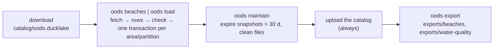

# MIP-0075: An open ocean data lake on Cloudflare R2, beaches first, so a build stops calling Overpass and the agencies

| | |
|---|---|
| **Status** | Draft — the human-facing spec is marola-oods `specs/001-beach-persistence/spec.md` (marola-dev/marola-oods#3); this MIP holds the design and the tasks |
| **Author** | Claude, from the maintainer's decisions on marola-dev/marola-oods#1 (2026-10-02), on this MIP's first PR (2026-10-04: object storage first, a database later) and on marola-dev/marola-oods#3 (2026-10-05: DuckLake, beaches first) and on marola#691 (2026-10-07: Cloudflare R2) |
| **Created** | 2026-10-02 (revised 2026-10-04: Supabase → R2; 2026-10-05: R2 → B2, Parquet + manifest → DuckLake, beaches first; 2026-10-07: B2 → R2) |
| **Tasks** | [MIP-0075.tasks.md](./MIP-0075.tasks.md) |
| **Phase** | 2 (`docs/PHASES.md`: a cloud backend) while Phase 1 is not done; §11 asks for an explicit, scoped exception |
| **Related** | marola-dev/marola-oods#1 (the sketch), MIP-0056 (OODS: its adapters, planner, columns and DuckDB views, reused here with R2 in place of git), MIP-0031 and MIP-0067 (INEA/INEMA parsers, curated coordinates), MIP-0001 (`WaterQualityClient`), MIP-0005 §5.4 ("every build fetches", which this ends), MIP-0034's alerts amendment (marola#669, a third writer of this lake), MIP-0057 (the GCP opt-in, the Phase 2 precedent), MIP-0070 (where code, data and workflows live) |
| **Effort** | M — an `oods` module in marola-app on DuckDB with its `ducklake` and `httpfs` extensions, two workflows in marola-oods, a download step in marola-site's `site.yml`; no server, no new Scala client |
| **Gain** | `user value` — the map keeps its beaches and each agency's last verdict through an Overpass or agency outage, and more states become one adapter each; `infra/dev-loop` — a site build stops depending on Overpass and agency hosts, and the store runs on a local directory or MinIO in tests; `cost/ops` — one fetch per source per week instead of one per build every 3 h, $0 inside R2's free tier |
| **Effort vs Gain** | `do when X lands` — everything up to the first live run builds and tests locally now; the first write to the bucket waits on §11's Phase 2 exception and the maintainer's smoke test |
| **Depends on** | MIP-0056's design (the `oods` module, `SourceAdapter`, the planner, the views), reused, not waited on: this MIP's tasks build them. MIP-0070 (Implemented). A person: the R2 bucket, its ETL token and the marola-oods secrets, then the smoke test (§5.6), and for RJ/BA the Brazil proxy of marola-dev/marola-site#20. Phase 1 gate: yes, unless §11's exception is granted |
| **Blocked by** | none |
| **Risk** | The catalog is one DuckDB file downloaded and uploaded per job: two writers at once would lose one's commits, so every writer shares one concurrency group (§5.4) |
| **Cost so far** | — |

## 1. Summary

A private Cloudflare R2 bucket, `br-open-ocean-data-storage`, holds marola's open ocean data as one
[DuckLake](https://ducklake.select/): tables whose rows are Parquet files under `lake/`, and a
catalog, `catalog/oods.ducklake`, that records every table, file and snapshot. Two ETLs in
marola-app's `oods` module write it, each run weekly from a marola-oods workflow on the pinned
image:

1. **The beach ETL** (first): per map area, the OSM beaches, facilities and trails the app already
   fetches, plus one `BeachSnapshot` JSON per area that the site build reads instead of Overpass.
2. **The water-quality ETL** (second): per state, every monitoring point and sample the agencies
   publish, idempotent, throttled and resumable, plus one `<source>.json` that the build reads
   instead of IMA, INEA and INEMA.

Each run is one transaction per area or partition, a re-run that finds nothing new commits nothing,
and 30 days of snapshots give time travel and rollback. The store is files and a catalog file, not
a database: nothing runs between loads. A database comes back as its own MIP when something needs
queries per request (§9).

## 2. Motivation

From marola-dev/marola-oods#1, all observed:

- **An outage empties the map.** On 2026-10-01 `site health` (marola-site run 36937931760) found no
  sampling points in any area. `CachedWaterQualityClient` keeps the last good fetch on the runner's
  disk, and the runner throws it away. Overpass time-outs do the same to beaches between snapshots.
- **INEA and INEMA answer only Brazilian IPs**, so GitHub-hosted runners can't reach them
  (marola-dev/marola-site#4).
- **Every build re-downloads data that changes weekly**, eight times a day.
- **3 of 14 monitoring states are covered**, and nothing keeps history.

How each agency is fetched today (marola-app `local/src/main/scala/marola/water/`, read at
`06280ba`):

| Agency | Client | Request per build | Coordinates | Counts | Sample date |
|---|---|---|---|---|---|
| IMA/SC | `ImaScWaterQualityClient` | `POST /relatorio/mapa`, ~207 KB, 260 points × last 5 samples; PDF backup | feed | E. coli (field named `enterococciPer100ml`) | lab date |
| INEA/RJ | `IneaRjWaterQualityClient` | 2 city pages → newest zone PDFs → `IneaPdfParser` | curated JSON | none | filename date |
| INEMA/BA | `InemaBaWaterQualityClient` | one PDF at a pinned `idcampanha=83453` → `InemaPdfParser` | curated JSON | none | **the fetch day** |

## 3. User-visible change

Nothing new on the page; what changes is what it survives. Before, an agency down at build time:

```text
Florianópolis · Campeche — water: no data
```

After, the lake's last bulletin, dated, until the existing 45-day rule ages it out:

```text
Florianópolis · Campeche — water: PRÓPRIA (4/5 pts, sampled 2026-09-28)
```

For a person, one query per state against the lake (`oods status --state SC`, or DuckDB with the
catalog attached read-only):

```text
state | ibge_code | municipality  | beach_name | point_name | condition | proper_count/classified | proper_ratio | lat     | lon     | water_lat | water_lon
SC    | 4205407   | Florianópolis | Campeche   | Ponto 35   | propria   | 3/4                     | 0.75         | -27.680 | -48.480 | -27.671   | -48.475
```

## 4. Data sources and dependencies reviewed

### 4.1 The sources

- **OSM through Overpass**, as the app fetches it today: `BeachFinder.nearby`,
  `OverpassAccessibilityClient.near` (parking, toilets, shower, lifeguard within 300 m) and
  `TrailFinder.nearby` (marola-app `core/src/main/scala/marola/{beaches,trails}/`).
- **The agencies**, unchanged from MIP-0001, MIP-0031 and MIP-0067: IMA/SC (JSON feed, CSV per
  beach-year since 2003, weekly PDF), INEA/RJ (zone PDFs, curated coordinates), INEMA/BA (campaign
  PDFs, curated coordinates). The 11 other states are surveyed in marola-dev/marola-oods#1 "Who
  publishes what"; `*.gov.br` is blocked from here, so each new state's adapter PR verifies its own
  source first.

### 4.2 The Praia Limpa dictionary (MMA)

The federal app's open-data dictionary names the fields a monitoring point carries. The lake keeps
MIP-0056 §5.3's English names and maps each:

| Praia Limpa | Column | Note |
|---|---|---|
| ESTADO | `point.state` | UF, `[A-Z]{2}` |
| CODMUN | `point.ibge_code` | 7 digits, the join key |
| MUNICIPIO, NOME_BALNEARIO, NOME_PONTO, REFERENCIA_LOCALIZACAO | `municipality`, `beach_name`, `point_name`, `location_desc` | the agency's spelling |
| BALNEABILIDADE | `sample.condition` (+ `agency_label`), and `point_fitness` | §5.3 |
| LATITUDE, LONGITUDE | `point.lat`, `point.lon` | the agency's position |
| CREATED_AT, UPDATED_AT | `point.first_seen`, `last_seen` | |

Its only open dataset covers 2021-01-04 to 2022-09-16; whether the app still runs is unknown (§11).

### 4.3 The store: Cloudflare R2

Decided by the maintainer on marola#691 (2026-10-07). R2 is S3-compatible at
`https://<ACCOUNT_ID>.r2.cloudflarestorage.com` (region `auto`, path-style URLs), with no egress
fee. Its free tier, as Cloudflare documents it: 10 GB-month of storage, 1 million Class A (write,
list) and 10 million Class B (read) operations a month. Enabling R2 needs a payment method on the
account (card or PayPal), even to stay inside the free tier; usage above it is billed.

Estimated use: SC's full history (~190k samples) is a few MB of zstd Parquet, beaches tens of KB,
the catalog about 4 MB, so 14 states with 30 days of snapshots stay far under 100 MB. Eight builds
a day download a few hundred KB of exports; each job moves the catalog twice and writes a few
hundred files at most. Both are well inside the free tier: $0 a month.

R2 has no object versioning, so the catalog upload replaces the only copy (§8). DuckLake never
overwrites a data file (each has a fresh UUID name), so the catalog is the only object rewritten.

### 4.4 The table format: DuckLake

Asked of the maintainer: plain Parquet, Delta Lake or DuckLake, knowing the storage is object storage. DuckLake
was picked. Its data is Parquet in the bucket, so it keeps what plain Parquet gave, and its catalog
adds what this MIP's previous draft built by hand from write order and a manifest: transactions,
`UPDATE` and `DELETE`, snapshots with time travel, partitions and schema changes. It is a DuckDB
extension, free, with no server.

```sql
LOAD httpfs; LOAD ducklake;                      -- both baked into the image, loaded from files
CREATE SECRET oods (TYPE s3, KEY_ID ?, SECRET ?, ENDPOINT '<ACCOUNT_ID>.r2.cloudflarestorage.com',
                    REGION 'auto', URL_STYLE 'path', SCOPE 's3://br-open-ocean-data-storage');
ATTACH 'ducklake:/work/oods.ducklake' AS oods
  (DATA_PATH 's3://br-open-ocean-data-storage/lake/', DATA_INLINING_ROW_LIMIT 0);
```

Checked on 2026-10-05 with DuckDB 1.5.5 and `ducklake` 1.5.5, catalog and data in a local directory
(the sandbox blocks R2; on 2026-10-07 the secret above turned a `COPY` into
`PUT https://<ACCOUNT_ID>.r2.cloudflarestorage.com/br-open-ocean-data-storage/…` and stopped at the
blocked connect). DuckDB's own `TYPE r2` secret would work too, but it scopes `r2://` paths; a
`TYPE s3` secret keeps the `s3://` paths the app, the tests on MinIO and §5.2 already use:

- An identical second load changes no row and creates **no snapshot**; a changed row creates one.
- `SELECT … AT (VERSION => n)` returns the earlier rows; a rolled-back transaction leaves nothing.
- `ALTER TABLE sample SET PARTITIONED BY (source_id)` writes `sample/source_id=…/` directories
  (re-checked 2026-10-06 on marola-dev/marola-oods#22; a year partition was dropped there: a
  source's whole history is a few MB, and per-file min/max on `sampled_on` prunes a date filter).
- `ducklake_expire_snapshots`, `ducklake_cleanup_old_files` and `ducklake_merge_adjacent_files` run.
- A `READ_ONLY` attach reads and refuses `INSERT`.
- **`MERGE INTO` accepts one `UPDATE`/`DELETE` action** on a DuckLake table, so an upsert is three
  statements in one transaction (§5.4), not one `MERGE`.
- Small inserts are inlined into the catalog by default; `DATA_INLINING_ROW_LIMIT 0` keeps every
  row in Parquet in the bucket, and the catalog holds metadata only.
- A plain `read_parquet` glob over `lake/` returns wrong rows after an update, because deletes are
  separate `-delete.parquet` files: readers attach the lake or read the exports.

The catalog is a DuckDB file, and a DuckDB file cannot be opened for writing over S3, so each job
downloads it, commits, and uploads it back (§5.4). Rejected: a Postgres or MySQL catalog (a server
again, the reason Supabase went, though it would allow concurrent writers); SQLite (the same round
trip plus another extension); Delta Lake (from the JVM only `delta-kernel`, which appends or
replaces a whole table, and DuckDB's `delta` extension does not write); plain Parquet with a
manifest (idempotency and crash-safety by hand).

Values for the secret come from the environment through the app, never DuckDB's `getenv()`, and it
is never `PERSISTENT` (a persistent secret is written in plain text under
`~/.duckdb/stored_secrets`). The extensions must match the engine exactly, so the image bakes
`httpfs` and `ducklake` for the pinned engine and loads them with `autoinstall_known_extensions`
off: a job never downloads code at run time.

### 4.5 DuckDB from Scala

`org.duckdb:duckdb_jdbc` 1.5.6.0, called directly behind an `OodsStore` trait and wrapped in Kyo
at the boundary (`Sync.defer` per call, `Scope` for the connection; Kyo 1.0.0-RC7, marola-app's
pin). The jar (~85 MB) bundles the native libraries and `DuckDBAppender`: parsed rows go through
the appender into a temporary table, then `oods check` and the upsert run against the lake table.
One connection per run, no pool.

The libraries compared, read from Maven Central on 2026-10-04:

| Library | Version | Fit here |
|---|---|---|
| **`org.duckdb:duckdb_jdbc`** (official) | 1.5.6.0 | **taken**: the engine itself |
| [duck4s](https://github.com/softinio/duck4s) | 0.1.4 | pins `duckdb_jdbc` 1.4.4.0, an engine behind the one tested; one maintainer |
| [Magnum](https://github.com/AugustNagro/magnum), [Anorm](https://github.com/playframework/anorm) | 2.0.0-M3, 3.1.0 | generic JDBC, so they work; optional later for typed reads, not needed to write |
| ScalaSql, `kyo-sql`, doobie, Quill | 0.3.2, 1.0.0-RC7, 1.0.0-RC12, 4.8.6 | no DuckDB dialect or driver; doobie brings cats-effect |

### 4.6 Fetching through the Brazil proxy

The adapters fetch with the app's own `marola.http.Http` (`java.net.http`, with retries and the
`Http.withTransport` test seam). DuckDB never fetches a source: IMA's feed is a `POST`, the INEA
and INEMA bulletins are PDFs the Scala parsers read. The route to Brazil is
marola-dev/marola-site#20's: `br-proxy.sh` starts a tinyproxy that forwards only `sources.json`'s
`brazil_only` hosts to `MAROLA_BR_PROXY` and sends everything else direct; the JVM uses it through
`-Dhttp(s).proxyHost` in `JDK_JAVA_OPTIONS`, and the password stays in tinyproxy's upstream line
(`HttpClient` refuses Basic proxy auth on `CONNECT` tunnels unless a global setting is cleared).
DuckDB's own `http_proxy` stays empty, so R2 is reached directly. Clients compared (2026-10-04):
`kyo-http` RC7 has no proxy class; sttp4 has no maintained Kyo backend; requests-scala and http4s
Ember add a second client for no gain.

## 5. Design

### 5.1 Where things live

| Piece | Repo | Path |
|---|---|---|
| `oods` module: store, loaders, adapters, `marola.oods.Main` | marola-app | `oods/src/main/scala/marola/oods/` |
| The two ETL workflows and their inputs | marola-oods | `.github/workflows/{beach,water-quality}-etl.yml`, `etl/areas.json`, `etl/sources.json`, `etl/water-positions.csv` |
| The spec humans review | marola-oods | `specs/001-beach-persistence/spec.md` |
| The lake contract: migrations, views, checks | marola-oods | `lake/{migrations/NNNN_*.sql,views.sql,checks.sql}`, released by tag as `marola-oods-lake-<tag>.tar.gz` and pinned in marola-app's `lake-contract.version` |
| The data | R2 | `s3://br-open-ocean-data-storage/` (§5.2) |
| The download into the build | marola-site | `site.yml` |

`marola.oods.Main` ships in the JVM image as a second main class, as the MCP server does; `cli`
depends on `oods` so the one assembly carries it, and the workflows run it with
`--entrypoint java`. marola-oods pulls the pinned image and never builds Scala (MIP-0070 §5.4).
The pinned contract ships in the image, so the tests run the migrations, views and checks the
bucket gets.

MIP-0056 §5.1 put `data/oods/` in git on marola-oods's `main`; this MIP puts the data in the bucket
instead, so no workflow commits data to git and MIP-0056 §11's question about write access to
`main` goes away.

### 5.2 The layout

```text
s3://br-open-ocean-data-storage/
  catalog/oods.ducklake                        the DuckLake catalog (a DuckDB file): tables, files, snapshots
  lake/main/<table>/…/ducklake-<uuid>.parquet  every row; written and named by DuckLake, never by hand
  lake/main/sample/source_id=<id>/             sample's partitions
  exports/beaches/<BeachSnapshot.key>.json     BeachSnapshot v1, one per area (MAROLA_BEACHES_DIR)
  exports/water-quality/<source_id>.json       CachedWaterQualityClient v1, water positions joined (MAROLA_WATER_CACHE_DIR)
```

`exports/beaches/` is named by `BeachSnapshot.key(origin, radius, limit)`
(`m27.6000_m48.4800_r30.0_n80.json` for floripa), the key the app already computes, so a changed
radius cannot silently reuse a stale list. Exports are rewritten only after the catalog upload
succeeds, so a build never reads data the catalog does not have. Raw bulletins (PDF, CSV) are not
kept (§11).

| Table | One row is | Key | Written by |
|---|---|---|---|
| `beach` | a named beach in an area | `(area_id, beach_name)` | beach ETL |
| `facility` | a facility kind at a beach, count > 0 | `(area_id, beach_name, facility)` | beach ETL |
| `trail` | a named trail | `(area_id, trail_name)` | beach ETL |
| `source` | an agency publication | `source_id` | water-quality ETL, mirrored from `etl/sources.json` |
| `point` | a monitoring spot | `(source_id, point_key)` | water-quality ETL |
| `sample` | a result at a point on a date from a channel; partitioned by `source_id` | `(source_id, point_key, sampled_on, sampled_at, channel)` | water-quality ETL |
| `water_position` | marola's in-water position | `(source_id, point_key)` | mirrored from `etl/water-positions.csv` |
| `fetch_partition` | one unit of fetch work (an IMA/SC beach-year) with its content hash and `immutable` flag | `(source_id, partition_key)` | water-quality ETL |
| `fetch_run` | one execution of one area or source: mode, outcome, requests, rows changed, snapshot id, error, key name | `(job, started_at)` | both ETLs, always |

```dbml {bg-dark=white}
Table beach {
  area_id text [not null, note: "etl/areas.json"]
  beach_name text [not null, note: "OSM name; BeachFinder keeps one per name"]
  lat double
  lon double
  distance_km double
}
Table facility {
  area_id text
  beach_name text
  facility text [note: "parking | toilets | shower | lifeguard"]
  count int
}
Table trail {
  area_id text
  trail_name text
  length_km double
  difficulty text [note: "OSM sac_scale, verbatim"]
  surface text
  geometry "list(lat, lon)"
  near_beach text
  near_beach_km double
}
Table point {
  source_id text [not null]
  point_key text [not null, note: "the agency's stable id"]
  state char(2) [not null]
  ibge_code char(7)
  municipality text [not null]
  beach_name text [not null]
  point_name text [not null]
  location_desc text
  lat double [note: "the agency's"]
  lon double
  geo_source text [note: "feed | curated | none"]
  first_seen date
  last_seen date
}
Table sample {
  source_id text
  point_key text
  sampled_on date [not null]
  sampled_at time
  channel text [not null, note: "csv | pdf | json | …"]
  condition text [not null, note: "propria | impropria | unknown"]
  agency_label text [note: "as printed: 'Em alerta'"]
  indicator text [note: "e_coli | enterococci | thermotolerant_coliforms | unknown"]
  indicator_value int
  indicator_qualifier text [note: "exact | below | above"]
  unit text [note: "NMP/100mL | UFC/100mL"]
}
Table water_position {
  source_id text
  point_key text
  water_lat double [note: "marola's, in git, never authored by the ETL"]
  water_lon double
  water_geo_source text
}
Ref: facility.(area_id, beach_name) > beach.(area_id, beach_name)
Ref: sample.(source_id, point_key) > point.(source_id, point_key)
Ref: water_position.(source_id, point_key) - point.(source_id, point_key)
```

DuckLake has no keys or checks, so they live in two places:

- **Scala**: opaque `Uf`, `IbgeCode`, `AreaId`, `LatLon` with smart constructors (two letters;
  seven digits; `[a-z-]+`; inside Brazil's box), and every persisted enum with `label`/`fromLabel`,
  so a bad row fails first in an adapter's unit test.
- **`oods check`**: before a batch commits, it refuses a duplicate key or a value outside its
  vocabulary (`lake/checks.sql`). A batch that fails is not written.

No OSM id is kept: `Beach` has none, and `BeachFinder` already merges node, way and relation by
name. Water positions are not authored in the lake: the ETL's key can write anything there, so they
live in `etl/water-positions.csv` (one reviewed PR each; all three set or none, inside Brazil's
box, checked by that repo's CI) and each run copies them into `water_position`.

The views are DuckDB SQL stored in the catalog (`lake/views.sql`):

| View | One row per | Use |
|---|---|---|
| `sample_dedup` | (point, date, time) | channel precedence `csv > pdf > json > rest` |
| `latest_per_point` | point | the newest deduplicated sample; feeds the water-quality export |
| `point_fitness` | point with samples | `proper_count / classified_count` over the last 5 (§5.3) |
| `beach_point` | point | the flat, Praia Limpa-shaped record of §3 |
| `beach_card` | beach | a beach with its facility counts and trail count |

### 5.3 BALNEABILIDADE: the agency's verdict, and marola's share beside it

`sample.condition` and `agency_label` are the agency's own and nothing recomputes them (MIP-0001,
#1). `point_fitness` is marola's summary over the last 5 deduplicated samples (CONAMA 274's
window): `proper_count`, `classified_count`, `proper_ratio = proper / classified`. An `unknown`
sample counts in the window, never in the ratio; an all-unknown point has a NULL ratio, not 1.0,
the bug marola-app#15 fixed in `Swimability`. A view, so it is never stale.

### 5.4 The ETL



Each area, and each partition batch of a source, is one transaction:

```sql
BEGIN;
UPDATE beach b SET … FROM incoming i WHERE <key matches> AND (b.cols) IS DISTINCT FROM (i.cols);
INSERT INTO beach SELECT i.* FROM incoming i ANTI JOIN beach b USING (area_id, beach_name);
DELETE FROM beach b WHERE b.area_id = ? AND NOT EXISTS (SELECT 1 FROM incoming i WHERE <key matches>);
COMMIT;
```

Samples are never deleted by a load, and points only move `last_seen`.

The schema comes from the pinned contract: on attach, `DuckLakeStore` applies every
`lake/migrations/NNNN_*.sql` whose version is not in `schema_migration`, each in one transaction
with its row and the file's md5, then `views.sql` when its md5 differs from the version-0 row. A
duplicate version or an applied file whose md5 changed stops the run before anything is written.
So the first `oods-lake` job creates the catalog, a schema change reaches the bucket inside the
concurrency group, and a current catalog gets no snapshot. marola-oods's `lake-migrate.sh` applies
the same rules to a local lake. The row case classes `derive` `kyo-schema`'s `Schema`, and a test
compares `Structure.of[Row]` with the migrated tables' columns, because neither `kyo-schema` nor
`kyo-sql` (1.0.0-RC7) generates DDL, and types alone cannot produce a migration history.

```scala
trait OodsStore:                       // DuckLakeStore behind it; a local lake in tests, MinIO in IT
  def upsertArea(area: AreaId, beaches: Chunk[BeachRow], facilities: Chunk[FacilityRow],
      trails: Chunk[TrailRow]): Changed < (Sync & Abort[StoreFailure])
  def upsertPartition(p: Partition, points: Chunk[PointRow], samples: Chunk[SampleRow],
      hash: ContentHash): Changed < (Sync & Abort[StoreFailure])
  def knownPartitions(source: SourceId): Map[PartitionKey, PartitionState] < (Sync & Abort[StoreFailure])
  def openRun(job: JobId, mode: Mode): RunId < (Sync & Abort[StoreFailure])
  def closeRun(run: RunId, outcome: RunOutcome, stats: RunStats): Unit < (Sync & Abort[StoreFailure])
  def maintain(keepDays: Int): Unit < (Sync & Abort[StoreFailure])
  def export(to: ExportTarget, positions: WaterPositions): Unit < (Sync & Abort[StoreFailure])
```

Effect rows are indicative; the real ones are checked against the pinned Kyo jar when written
(`.claude/rules/scala.md`).

- **The catalog round trip.** A job downloads `catalog/oods.ducklake` with the runner's AWS CLI
  (`--endpoint-url https://<ACCOUNT_ID>.r2.cloudflarestorage.com --region auto`; the R2 token's
  access key pair are its AWS credentials). Only an empty `list-objects-v2`
  listing means a first run, in which DuckLake creates the catalog; a refused or failed listing
  stops the job, so an unreadable catalog is never replaced by an empty one. The catalog is
  uploaded **even when the load failed**, because its `fetch_run` row records the failure; the
  exports run only after the upload succeeded.
- **One writer at a time.** Two uploads would lose one's commits, so every workflow that writes
  the lake (both ETLs here, and the alerts of MIP-0034's amendment, marola#669) shares `concurrency: group: oods-lake`
  with `cancel-in-progress: false`, and a matrix runs with `max-parallel: 1`.
- **A crash is safe.** A job killed before the upload leaves the bucket's catalog as it was:
  readers see the last good snapshot, and the Parquet files it wrote are orphans that a later
  `oods maintain` deletes.
- **The beach ETL** calls `BeachFinder.nearby(…, snapshots = None)`, so it always asks Overpass and
  never reads a stale snapshot back. A run that would shrink an area below half its stored beaches
  is refused (`SuspiciousShrink`): an Overpass answer cut by a timeout would otherwise empty it.
  Facilities or trails failing alone end `partial` with the beaches written. Its areas come from
  marola-oods's `etl/areas.json` (`id`, `lat`, `lon`, `radius_km`, `beach_limit`; floripa, rio,
  salvador), copied from marola-site's `site/areas.json` by a PR, because no repo reads another's
  tree; a mismatch shows as a missing snapshot, never a wrong one.
- **The water-quality ETL** plans partitions per source and year (MIP-0056 §5.2): the current year
  is mutable, and the previous one while `today − 45 days` falls in it; an immutable partition with
  a matching hash in `fetch_partition` is skipped without a request. A backfill is throttled
  (≥ 250 ms per host, ≤ 4 in flight, 3 attempts on 5xx and time-outs, stop on 429/403) and
  budgeted (`--max-minutes 300`, under the 360-minute job cap): it stops between partitions as
  `partial`, and the next dispatch resumes. SC's 2003→ backfill is ~3,400 requests, about an hour.
  Adapters reuse `local`'s parsers; INEA codes with no curated coordinate are kept with
  `geo_source = 'none'` (today they are dropped); INEMA's missing sample date is never presented as
  a lab date.
- **Every run is on record**: `fetch_run` is inserted as `failed` in its own transaction at start
  and updated once at the end (`new_bulletin | no_new_bulletin | unchanged | partial | failed`).

The entrypoint:

| Command | Does |
|---|---|
| `oods beaches --areas FILE [--area ID]… [--dry-run]` | the beach ETL |
| `oods load (--state UF \| --source ID)… --sources FILE [--water-positions FILE] [--mode incremental\|backfill] [--from-year Y] [--to-year Y] [--max-minutes M] [--dry-run]` | the water-quality ETL |
| `oods maintain [--keep-days 30]` | expire old snapshots, delete the files only they used |
| `oods export [--water-positions FILE]` | rewrite `exports/` from the lake |
| `oods check` / `oods status [--area ID \| --state UF]` | the checks over the whole lake / the newest run and data per job |

It reads provider-neutral settings, so tests and a later provider change touch only the workflow:
`OODS_S3_KEY_ID`, `OODS_S3_SECRET` (held in a type whose `toString` is redacted), `OODS_S3_ENDPOINT`,
`OODS_S3_REGION` (`auto` on R2), `OODS_S3_URL_STYLE` (`path`, on R2 and MinIO), `OODS_S3_USE_SSL`, `OODS_BUCKET`
(or `file:///…` for a local lake), `OODS_CATALOG` (the local catalog path), `OODS_KEY_NAME`
(stored in `fetch_run`), `MAROLA_BR_PROXY`. Exit codes: 0 every job ended without `failed`; 1 at
least one `failed` (the others still wrote); 2 usage or a missing setting; 3 `oods check` found a
violation or the catalog will not open. One status line per job on stderr:

```text
oods: beaches-floripa unchanged requests=3 beaches=80 facilities=151 trails=37 changed=0 snapshot=- 4.2s
oods: ima-sc incremental new_bulletin bulletin=2026-09-26 requests=1 points=260 samples+=260 changed=260 snapshot=41 1.8s
```

The workflows, in marola-oods, `permissions: contents: read` and `packages: read`, no write token:

| Workflow | Trigger | Runs |
|---|---|---|
| `beach-etl.yml` | `43 6 * * 1` (Monday), or dispatch with `area` and `dry_run` | `oods beaches` over every area in sequence, `timeout-minutes: 30` |
| `water-quality-etl.yml` | `17 12 * * 5` (Fri: `inea-rj`), `17 12 * * 6` (Sat: `ima-sc`, `inema-ba`), or dispatch with `state`, `mode`, years, `max_minutes`, `dry_run` | a `plan` job mapping the schedule to sources (a schedule matching none fails), then `oods load` per state, `timeout-minutes: 330`; `br-proxy.sh` first when a source is `brazil_only` |

Both map the secrets `CLOUDFLARE_R2_ACCESS_KEY_ID` and `CLOUDFLARE_R2_SECRET_ACCESS_KEY` and the
variable `CLOUDFLARE_R2_TOKEN_NAME` onto the `OODS_*` names, and build the endpoint from the
variable `CLOUDFLARE_R2_ACCOUNT_ID`; the bucket, region and URL style sit in `env` (none of them
secret).

### 5.5 The map's read path

`site.yml` downloads `exports/` with the read-only token into two directories, points
`MAROLA_BEACHES_DIR` and `MAROLA_WATER_CACHE_DIR` at them and turns the live agency clients off: a
build calls no agency host (#1's acceptance), and Overpass only for what has no snapshot yet. The
app gains no storage client and the page never calls R2 (the page keeps `script-src 'self'`). A
build whose download fails reuses the previous one kept on `site-data`. This replaces
marola-dev/marola-site#20's `site-data:water/` stopgap and is marola-site's own task, specified
there.

### 5.6 What a person sets up in Cloudflare

All of it is the maintainer's: an agent creates no bucket, token or secret. R2 has no service
accounts; the closest is an **Account API token**, owned by the account rather than by a person,
so it outlives anyone leaving.

1. **Enable R2.** Cloudflare dashboard → R2 Object Storage → Purchase R2 Plan: add a payment method
   (card or PayPal). Optionally, Billing → Notifications → a usage alert for R2.
2. **The bucket.** R2 → Create bucket: name `br-open-ocean-data-storage`, location Automatic,
   default storage class Standard. Leave Public access off (Settings: no `r2.dev` URL, no custom
   domain).
3. **The ETL token.** R2 → Manage R2 API Tokens → Create **Account API token**: name
   `marola-oods-etl`, permission **Object Read & Write**, "Apply to specific buckets only" →
   `br-open-ocean-data-storage`, TTL forever. The page shows the Access Key ID and Secret Access
   Key once; copy both straight into step 5.
4. **The account ID.** R2's overview shows it; the S3 endpoint is
   `https://<ACCOUNT_ID>.r2.cloudflarestorage.com`. Not secret.
5. **marola-oods, Settings → Secrets and variables → Actions**: secrets
   `CLOUDFLARE_R2_ACCESS_KEY_ID` and `CLOUDFLARE_R2_SECRET_ACCESS_KEY`; variables
   `CLOUDFLARE_R2_ACCOUNT_ID` and `CLOUDFLARE_R2_TOKEN_NAME` (`marola-oods-etl`, stored in
   `fetch_run`). Delete the B2 ones, `BACKBLAZE_ETL_APP_KEY`, `BACKBLAZE_ETL_KEY_ID` and
   `BACKBLAZE_ETL_KEY_NAME`, and, in Backblaze, the empty B2 bucket and its key.
6. **The smoke test**, in a local `duckdb`: a session `TYPE s3` secret as in §4.4 with the ETL
   token, `COPY` one row to `s3://br-open-ocean-data-storage/smoke/hello.parquet` and read it back,
   then attach a throwaway DuckLake with `DATA_PATH 's3://br-open-ocean-data-storage/smoke/lake/'`,
   update a row and read the row from before the update `AT (VERSION => 2)` (`snapshots()`
   shows the ids: 0 the schema, 1 the table, 2 the insert, 3 the update); delete `smoke/` afterwards (R2 → the bucket →
   Objects, or `aws s3 rm --recursive` with the flags of §5.4).
7. **When marola-site reads the store**: a second Account API token, `marola-site-read`,
   **Object Read only**, this bucket only, as secrets `CLOUDFLARE_R2_READ_ACCESS_KEY_ID` and
   `CLOUDFLARE_R2_READ_SECRET_ACCESS_KEY` and variable `CLOUDFLARE_R2_ACCOUNT_ID` in marola-site.
   Readers download the catalog and attach it `READ_ONLY`, or read `exports/`.

`MAROLA_BR_PROXY` stays as marola-dev/marola-site#20 provisions it. `.env.example` gains
placeholders for a local run; no key is ever committed.

## 6. Scoring / safety impact

None to `Swimability.score` or its thresholds. The verdict stays the agency's; the 45-day freshness
rule still decides when a stored bulletin stops counting. `proper_ratio` is shown, never scored.

## 7. Verification plan

- **Contract** (`lake/checks.sql` with `views.sql`, plain DuckDB and inside a local DuckLake,
  in marola-oods's CI): every assertion passes on the fixtures, and the check fails when
  `point_fitness` is broken to count unknowns (`US3.1: expected 3/4 of 5 = 0.75, got 3/4 of 5 =
  0.6`, run 2026-10-05).
- **Unit** (`sbt oods/test`, no Docker, no network): `DuckLakeStoreSpec` on a local lake ("an
  identical load makes no snapshot", "time travel returns the old rows", "a failed batch rolls
  back", "a gone key is deleted", "maintain expires old snapshots", "a read-only attach refuses a
  write"); `BeachLoadSpec` from captured Overpass answers through `Http.withTransport` (exact rows,
  a snapshot `BeachSnapshot.decode` reads back, `unchanged` on a re-run, `failed` and rolled back
  when every mirror 504s, `partial` when trails 429, the shrink refused); one `*AdapterSpec` per
  agency from a captured bulletin to exact rows; `PlannerSpec`; `ThrottleSpec` (fake clock,
  recording transport); `LoadSpec` ("a second run changes no row", "a 5xx records `failed`", "a 429
  stops without a retry", "a killed backfill resumes after the committed partitions").
- **Integration** (`Integration` tag, Testcontainers on MinIO, excluded from `just test`, its own
  CI job): `DuckLakeStoreIT` runs the same suite with `DATA_PATH` on S3 and the catalog closed and
  re-attached.
- **Live**: the maintainer's smoke test (§5.6); then `beach-etl.yml` dispatched with `area=all`
  twice, the second printing `changed=0 snapshot=-`; then the SC backfill and the weekly run twice.
  marola-site: `site.yml` passes with agency hosts blocked (#1's named test).
- **Done**: every area's beaches and SC, RJ and BA's samples in the lake; each weekly run green or
  a `fetch_run` row saying why; a build that calls no agency host.

## 8. Risks, limitations, and honest caveats

- **One writer at a time.** A workflow that writes the lake without joining `oods-lake` can lose
  another job's commits. Every writer's contract names the group, and §5.4 says why.
- **The catalog is a single object.** A bad upload replaces it, and R2 keeps no old versions, so
  the protection is the job order (upload only after a
  clean attach) and the agencies remaining the source (a backfill rebuilds the lake).
- **DuckDB weighs 85 MB in the image**, and both extensions must match the engine exactly: a
  `duckdb_jdbc` bump without them fails at `LOAD`, so they move in one PR and the image's smoke
  step loads what it ships.
- **DuckLake is young** (1.x, 2025): its `MERGE` limit is one example of a gap; the store hides it
  behind `OodsStore`.
- **R2 is checked only through its docs** from here: the sandbox cannot reach the host, so the
  maintainer's smoke test is the first real write.
- **R2 bills above the free tier** to the payment method on file; the usage alert of §5.6 is the
  warning, and §4.3's estimate is far below the limits.
- **The ratio is marola's**, from a 5-sample window that differs per agency's cadence: labelled as
  a share, never as the classification.
- **Agency coordinates can sit on land**; `water_lat/lon` fixes are by hand, one reviewed PR each.
- **No licence** is stated by any agency; a private bucket is fine, making it public is
  MIP-0056 §11's open question.
- **Brazil-only hosts** depend on one free VM a person runs; when it is down, RJ and BA keep their
  last data and the other states are unaffected.

## 9. Alternatives considered

- **Do nothing** (marola-site#20's `site-data:water/` stopgap): keeps the last fetch, but no
  history, no per-state schedule, no record of runs.
- **Supabase Postgres** (this MIP's first draft, 2026-10-02): constraints and upserts for free, but
  a server that pauses after a week idle and a new pre-1.0 client. Comes back as its own MIP, over
  this lake, once something needs per-request queries.
- **Backblaze B2** (this MIP from 2026-10-05 to 2026-10-07): S3-compatible and no card for the free
  tier, but downloads are free only up to three times the stored volume, and versioning needs a
  lifecycle rule to keep the rewritten catalog from piling up. The maintainer moved back to R2 on
  marola#691.
- **Cloudflare D1** (marola#667): an HTTP query API, rows-read billing, 100 parameters per
  statement; a fit for per-request reads later, not batch history.
- **Plain Parquet with a manifest**, **Delta Lake**, **a Postgres catalog**: §4.4.
- **Parquet in git** (MIP-0056 §4.4): free and reviewable, but a commit per week of binary
  partitions on marola-oods's `main`, and a workflow that needs write access to it.

## 11. Open questions

- **Phase**: grant a scoped Phase 2 exception (free tier only, written by scheduled CI, read by the
  build, never by a user's request path), or wait for Phase 1? Maintainer.
- **Raw files**: keep the fetched PDFs and CSVs under `raw/` (a few hundred MB over the years,
  inside the free tier), or only the lake (proposed)?
- **Areas**: should marola-site publish `areas.json` as an artifact, making marola-oods's copy
  unnecessary?
- **Praia Limpa**: is the MMA app still fed? Its 2021–2022 CSV could seed backfills; confirm from a
  Brazilian IP.
- **Follow-up MIP:** a database loading this lake, when a per-request reader appears.

## Appendix

### Checked live

- marola-app `06280ba` source: the three agency clients, `CachedWaterQualityClient`,
  `SamplingPointCoordinates`, `build.sbt` (2026-10-02); `BeachFinder`, `BeachSnapshot`,
  `OverpassAccessibilityClient`, `TrailFinder` on `main` (2026-10-05).
- DuckDB 1.5.5 with `ducklake` 1.5.5 and `httpfs` 1.5.5 from their PyPI wheels (2026-10-05): every
  fact in §4.4's list, on a local catalog and data directory; `lake/views.sql` and
  `checks.sql` inside the lake, and on DuckDB 1.5.6 plain.
- Maven Central (2026-10-04): every version in §4.5's table; the `duckdb_jdbc` 1.5.6.0 jar's native
  libraries and `DuckDBAppender`; no proxy class in `kyo-http` 1.0.0-RC7.
- marola-app `core/src/main/scala/marola/http/Http.scala` and marola-dev/marola-site#20's
  description (the tinyproxy route), 2026-10-04.
- DuckDB 1.5.5 `httpfs` with §4.4's secret (2026-10-07): a `COPY` addressed
  `https://<ACCOUNT_ID>.r2.cloudflarestorage.com/br-open-ocean-data-storage/…`, path style; the
  connect itself is blocked here.

### Not checked

- A real write to R2 (the sandbox blocks the host): the maintainer's smoke test.
- R2's free-tier limits and dashboard steps (§4.3, §5.6): from Cloudflare's docs, whose site the
  sandbox also blocks; the smoke test confirms the token and endpoint.
- DuckLake writes and deletes on S3: checked on a local directory only; the MinIO suite is the
  first S3 run.
- Attaching the catalog read-only straight from `s3://`, which would spare readers the download.
- The JDBC jar loading both extensions from files inside the JVM image (checked on the Python build
  of the same engine).
- Every agency host (`*.gov.br` blocked); the size estimates are arithmetic, not measured.
