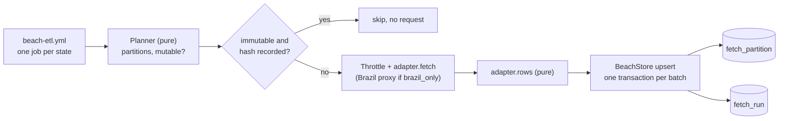

# MIP-0075: A water-quality store in Supabase, loaded weekly per state, so a build stops calling the agencies

| | |
|---|---|
| **Status** | Draft — design input: marola-oods `specs/001-beach-persistence/` (branch `claude/zen-brown-d4e27k`); Kyo bump: marola-app branch `claude/zen-brown-d4e27k` |
| **Author** | Claude, from the maintainer's decisions on marola-dev/marola-oods#1 (2026-10-02) |
| **Created** | 2026-10-02 |
| **Phase** | 2 (`docs/PHASES.md`: a cloud backend) while Phase 1 is not done; §11 asks for an explicit, scoped exception |
| **Related** | marola-dev/marola-oods#1 (the sketch this MIP turns into a design), MIP-0056 (OODS: §5.2's adapters and planner, §5.3's columns; this replaces §4.4's Parquet-in-git for recent data), MIP-0031 and MIP-0067 (INEA/INEMA parsers, curated coordinates), MIP-0001 (`WaterQualityClient`), MIP-0005 §5.4 ("every build fetches", which this ends for water quality), MIP-0057 (the GCP opt-in, the Phase 2 precedent), MIP-0070 (where code, data and workflows live), `FUTURE-WORK.md` §2 (kyo-schema) |
| **Effort** | L — a Postgres schema with migrations, store and adapter code in marola-app's `oods` module on a new client (`kyo-sql`), a per-state workflow in marola-oods; the Kyo RC5 → RC7 bump it needs is done and green |
| **Gain** | `user value` — the map keeps each agency's last verdict through an outage, and more states become one adapter each; `infra/dev-loop` — a site build no longer depends on agency hosts, and the store is testable on a local Postgres; `cost/ops` — ~1 fetch per agency per week instead of one per build every 3 h |
| **Effort vs Gain** | `do when X lands` — the schema, adapters and tests can be built and tested locally now; the hosted store waits on the maintainer's Phase 2 exception and a person creating the Supabase project |
| **Depends on** | MIP-0056's design (the `oods` module, `SourceAdapter`, the planner), reused, not waited on: this MIP's tasks build them. MIP-0070 (Implemented): the repos. A person: the Supabase project (free plan expected, §4.3), the `OODS_DATABASE_URL` secret, and for RJ/BA the Brazil proxy of marola-dev/marola-site#20. Phase 1 gate: yes, unless §11's exception is granted |
| **Blocked by** | none |
| **Risk** | The free project pauses after a week without activity; if neither the weekly load nor the 3-hourly build keeps it awake, the store goes dark until someone notices and it needs Pro (§8) |
| **Cost so far** | — |

## 1. Summary

A Postgres schema in Supabase holds every monitoring point the agencies publish and their recent
samples, in English columns that carry the federal Praia Limpa dictionary's fields, indexed by
state. A GitHub Actions job per state, running marola-app's `oods` entrypoint from the pinned
image, loads it weekly the day after the agency publishes: idempotent, throttled, resumable, and
on record. The map's build then reads the store instead of calling IMA, INEA and INEMA every three
hours, so an agency outage no longer empties the map.

## 2. Motivation

From marola-dev/marola-oods#1, all observed:

- **An outage empties water quality.** On 2026-10-01 `site health` (marola-site run 36937931760)
  found no sampling points in any area. `CachedWaterQualityClient` keeps the last good fetch on
  the runner's disk, and the runner throws it away.
- **INEA and INEMA answer only Brazilian IPs**, so GitHub-hosted runners can't reach them
  (marola-dev/marola-site#4).
- **Every build re-downloads bulletins that change weekly**, eight times a day.
- **3 of 14 monitoring states are covered**, and nothing keeps history beyond what MIP-0056 planned.

How each agency is fetched today (marola-app `local/src/main/scala/marola/water/`, read at
`06280ba`):

| Agency | Client | Request per build | Coordinates | Counts | Sample date |
|---|---|---|---|---|---|
| IMA/SC | `ImaScWaterQualityClient` | `POST /relatorio/mapa`, ~207 KB, 260 points × last 5 samples; PDF backup | feed | E. coli (field named `enterococciPer100ml`) | lab date |
| INEA/RJ | `IneaRjWaterQualityClient` | 2 city pages → newest zone PDFs → `IneaPdfParser` | curated JSON | none | filename date |
| INEMA/BA | `InemaBaWaterQualityClient` | one PDF at a pinned `idcampanha=83453` → `InemaPdfParser` | curated JSON | none | **the fetch day** |

## 3. User-visible change

Nothing new on the page; what changes is what it survives. Before, an agency down at build time:

```text
Florianópolis · Campeche — water: no data
```

After, the store's last bulletin, dated, until the existing 45-day rule ages it out:

```text
Florianópolis · Campeche — water: PRÓPRIA (4/5 pts, sampled 2026-09-28)
```

For a person, one query per state (Supabase Studio or `oods status --state SC`):

```text
state | ibge_code | municipality  | beach_name | point_name | condition | proper_count/classified | proper_ratio | lat     | lon     | water_lat | water_lon
SC    | 4205407   | Florianópolis | Campeche   | Ponto 35   | propria   | 3/4                     | 0.75         | -27.680 | -48.480 | -27.671   | -48.475
```

## 4. Data sources and dependencies reviewed

### 4.1 The agencies

Unchanged from MIP-0001, MIP-0031 and MIP-0067: IMA/SC (JSON feed, CSV per beach-year since 2003,
weekly PDF), INEA/RJ (zone PDFs, curated coordinates), INEMA/BA (campaign PDFs, curated
coordinates). The 11 other states are surveyed in marola-dev/marola-oods#1 "Who publishes what",
from search results and public scrapers; none was opened from here (`*.gov.br` is blocked), so
each new state's adapter PR verifies its own source first.

### 4.2 The Praia Limpa dictionary (MMA)

The federal app's open-data dictionary names the fields a monitoring point carries: `ESTADO`,
`CODMUN`, `MUNICIPIO`, `NOME_PONTO`, `NOME_BALNEARIO`, `REFERENCIA_LOCALIZACAO`,
`BALNEABILIDADE`, `LATITUDE`, `LONGITUDE`. The store carries each, in English (§5.2). Its only
open dataset covers 2021-01-04 to 2022-09-16; whether the app still runs is unknown (§11).

### 4.3 The store: Supabase Postgres

Decided by the maintainer in #1: recent water quality in Supabase, history in GCS (a follow-up,
§11). Free plan: 500 MB database, 5 GB egress, two free projects, paused after one week idle; Pro
is $25/month with $10 of compute credit (search-result summaries, supabase.com blocked here; see
Not checked). Estimated size with SC's full history: ~190k samples, ~60–80 MB, so the free plan
fits; the pause is the risk (§8).

### 4.4 The Scala client: `kyo-sql` + `kyo-sql-postgres` 1.0.0-RC7

Supabase has no Scala SDK. Decided by the maintainer on 2026-10-02 over JDBC, Skunk, doobie and
PostgREST (§9). Read from Maven Central and the jars on 2026-10-02:
- depends on `kyo-core`, `kyo-schema-json`, `kyo-net` only, built for Scala 3.9.0 (the app's);
  no JDBC, Netty or cats-effect;
- a native wire-protocol client (`PostgresClient`, `PostgresConfig`, `SqlClient`) with TLS
  (`SslRequest`), SCRAM authentication, prepared statements, `COPY` and a pool; clear-text
  passwords without TLS are refused;
- first published in RC6. The app's RC5 → RC7 bump is done on marola-app's branch: no code change,
  281/281 tests, scalafmt and scalafix clean; the native image is left to that PR's dispatch of
  `docker.yml`, since its `native` job skips pull requests.

Because it prepares statements, it connects through Supavisor **session** mode (port 5432);
transaction mode (6543) does not support them (#1, citing Supabase's Supavisor FAQ; not re-read).

## 5. Design

### 5.1 Where things live

| Piece | Repo | Path |
|---|---|---|
| Schema migrations, store, adapters, `oods` entrypoint | marola-app | `oods/src/main/{resources/db/migration,scala/marola/oods}/` |
| The per-state workflow and its source list | marola-oods | `.github/workflows/beach-etl.yml`, `etl/sources.json` |
| The design detail (spec, DDL, checks, contracts, tasks) | marola-oods | `specs/001-beach-persistence/` |

The `oods` module joins the JVM image as a second main class (`marola.oods.Main`), as the MCP
server already is; `cli` depends on it so the one assembly carries it. marola-oods pulls the pinned
image, never builds Scala (MIP-0070 §5.4). Migrations ship in the image, so the integration tests
run the same SQL the store gets.

### 5.2 The schema

All of it in an `oods` schema that is not in Supabase's exposed schemas (PostgREST serves `public`
to the anon key, and a view there would bypass RLS). Full DDL:
marola-oods `specs/001-beach-persistence/contracts/schema.sql`; executable checks next to it.

```dbml {bg-dark=white}
Table source {
  source_id text [pk, note: "'ima-sc'"]
  state char(2) [not null]
  channel text [not null]
  cron text [not null]
  brazil_only boolean [not null]
}
Table point {
  source_id text [not null]
  point_key text [not null, note: "the agency's stable id"]
  state char(2) [not null, note: "ESTADO"]
  ibge_code char(7) [note: "CODMUN"]
  municipality text [not null, note: "MUNICIPIO"]
  beach_name text [not null, note: "NOME_BALNEARIO"]
  point_name text [not null, note: "NOME_PONTO"]
  location_desc text [note: "REFERENCIA_LOCALIZACAO"]
  lat double [note: "LATITUDE, the agency's"]
  lon double [note: "LONGITUDE, the agency's"]
  water_lat double [note: "marola's; the ETL cannot write it"]
  water_lon double
  created_at timestamptz
  updated_at timestamptz
  indexes { (source_id, point_key) [pk]
            (state, municipality)
            ibge_code }
}
Table sample {
  sample_id bigint [pk]
  source_id text
  point_key text
  sampled_on date [not null]
  sampled_at time
  condition text [not null, note: "BALNEABILIDADE: propria | impropria | unknown"]
  agency_label text [note: "as printed: 'Em alerta'"]
  indicator text [note: "e_coli | enterococci | thermotolerant_coliforms"]
  indicator_value int
  unit text [note: "NMP/100mL | UFC/100mL"]
  channel text [not null]
}
Table fetch_run {
  source_id text
  started_at timestamptz
  outcome text [note: "new_bulletin | no_new_bulletin | partial | failed"]
}
Table fetch_partition {
  source_id text
  partition_key text [note: "the resume ledger"]
  content_hash text
}
Ref: point.source_id > source.source_id
Ref: sample.(source_id, point_key) > point.(source_id, point_key)
Ref: fetch_run.source_id > source.source_id
Ref: fetch_partition.source_id > source.source_id
```

Rules the schema enforces, each asserted by `schema-check.sql` (run on Postgres 16, 2026-10-02):

- **Columns are MIP-0056 §5.3's**, plus #1's `agency_label`, `unit` and
  `thermotolerant_coliforms`, so a row moves to Parquet unchanged.
- **`sample`'s natural key is `unique nulls not distinct`** on (source, point, date, time,
  channel): a primary key would force `sampled_at` not null, and most PDFs print no time.
- **Upserts carry `where … is distinct from excluded …`**, so a re-run writes nothing and
  `updated_at` does not move.
- **The ETL role cannot write `water_lat`/`water_lon`/`water_geo_source`**: column-level grants,
  because a column `revoke` does not undo a table `grant`. Set together or not at all, and inside
  Brazil's bounding box, which also rejects a swapped lat/lon.
- **Views**: `sample_dedup` (channel precedence `csv > pdf > json`, MIP-0056 §5.3),
  `latest_per_point`, `point_fitness`, and the flat `beach_point` of §3.

### 5.3 BALNEABILIDADE: the agency's verdict, and marola's share beside it

`sample.condition` and `agency_label` are the agency's own and nothing recomputes them (MIP-0001,
#1). `point_fitness` is marola's summary over the last 5 deduplicated samples (CONAMA 274's
window): `proper_count`, `classified_count`, `proper_ratio = proper / classified`. An `unknown`
sample counts in the window, never in the ratio; an all-unknown point has a NULL ratio, not 1.0,
the bug marola-app#15 just fixed in `Swimability`.

### 5.4 The ETL



```scala
trait BeachStore:                                  // kyo-sql-postgres behind it; a recording double in tests
  def upsertPoints(rows: Chunk[PointRow]): Int < (Async & Abort[StoreFailure])
  def upsertSamples(rows: Chunk[SampleRow]): Int < (Async & Abort[StoreFailure])
  def knownPartitions(source: SourceId): Map[String, ContentHash] < (Async & Abort[StoreFailure])
  def recordPartition(p: FetchedPartition): Unit < (Async & Abort[StoreFailure])
  def openRun(source: SourceId, mode: Mode, at: Instant): RunId < (Async & Abort[StoreFailure])
  def closeRun(id: RunId, outcome: RunOutcome): Unit < (Async & Abort[StoreFailure])

final case class PointRow(sourceId: SourceId, pointKey: PointKey, state: Uf, ibgeCode: Option[IbgeCode],
    municipality: String, beachName: String, pointName: String, locationDesc: Option[String],
    position: Option[LatLon], geoSource: GeoSource)  // no water_* field: no adapter can produce one
```

Effect rows are indicative; the real ones are checked against the RC7 jar when written
(`.claude/rules/scala.md`). `Uf`, `IbgeCode`, `LatLon` are opaque types with smart constructors,
so the database's checks fail first in an adapter's unit test. Every persisted enum has a
`label`/`fromLabel`.

- **Per state, sized to the data.** Incremental runs go in one go (SC: one `POST /relatorio/mapa`).
  A backfill is throttled as MIP-0056 §5.2 says (≥ 250 ms per host, ≤ 4 in flight, 3 attempts on
  5xx/timeouts, stop on 429/403) and budgeted (`--max-minutes 300`, under the 360-minute job cap):
  it stops between partitions as `partial`, and the next dispatch resumes from `fetch_partition`.
  SC's 2003→ backfill is ~3,400 requests, about an hour.
- **Every run is on record**: `fetch_run` is inserted as `failed` at start and closed once, so a
  crash still leaves a row for `site health`.
- **Adapters reuse `local`'s parsers**; INEA codes with no curated coordinate are stored with
  `geo_source = 'none'` (today they are dropped); INEMA's missing sample date is never presented as
  a lab date.
- **Workflow** (`beach-etl.yml`): one cron line per publication day (`17 12 * * 5` RJ, `17 12 * * 6`
  SC and BA), mapped to sources by `etl/sources.json`; `workflow_dispatch` for a state, a mode and
  a year range; a matrix with one job per state, `concurrency` per state; secrets
  `OODS_DATABASE_URL` and `MAROLA_BR_PROXY`; `permissions: contents: read`.

### 5.5 The map's read path

`site.yml` exports `latest_per_point` per source to `CachedWaterQualityClient`'s on-disk JSON
(MIP-0056 §5.5) and points `MAROLA_WATER_CACHE_DIR` at it, through a read-only role, with the
live agency clients off: a build calls no agency host (#1's acceptance). The app gains no database
client and the page never calls Supabase (#1 "Out of scope"). The export is also kept on
`site-data`, and a build whose export fails reuses the previous one. This replaces
marola-dev/marola-site#20's `site-data:water/` stopgap.

## 6. Scoring / safety impact

None to `Swimability.score` or its thresholds. The verdict stays the agency's; the 45-day freshness
rule still decides when a stored bulletin stops counting. `proper_ratio` is shown, never scored.

## 7. Verification plan

- **Schema** (done): `schema.sql` + `schema-check.sql` pass on Postgres 16, and the check fails
  when `point_fitness` is broken to count unknowns.
- **Unit** (`sbt oods/test`, no Docker): one `*AdapterSpec` per agency from a captured bulletin to
  exact rows; `PlannerSpec`; `ThrottleSpec` (fake clock, recording transport: spacing, retries, stop
  on 429); `LoadSpec` on a `RecordingBeachStore` ("the same source run twice writes no rows",
  "a 5xx leaves the store untouched and records `failed`", "a killed backfill resumes").
- **Integration** (`Integration` tag, Testcontainers on `supabase/postgres` at the hosted major,
  excluded from `just test` like `E2E`, its own CI job): `PostgresBeachStoreIT` runs every
  `schema-check.sql` case through `kyo-sql-postgres`, on the shipped migrations.
- **Not SQLite**: the client only speaks the Postgres protocol, and the schema uses Postgres-only
  features; a SQLite pass would not test the shipped code.
- **Live**: a person dispatches the SC backfill, then the weekly run twice; the second prints
  `samples+=0`. marola-site: `site.yml` passes with agency hosts blocked (#1's named test).
- **Done**: SC, RJ and BA in the store; each weekly run green or a dated `fetch_run` saying why; a
  build that calls no agency host.

## 8. Risks, limitations, and honest caveats

- **The free project pauses** after a week idle (search-result summaries). The weekly loads and the
  3-hourly build's read should keep it awake. A paused store fails the load (`DatabaseUnavailable`)
  and the build's export; the build reuses its previous export (§5.5), so the map keeps the last
  stored bulletins, dated, until the 45-day rule ages them out, and `site health` goes red.
- **`kyo-sql` is new and pre-1.0.** The `BeachStore` trait limits a swap to JDBC to one class.
- **The ratio is marola's, from a 5-sample window that differs per agency's cadence** (SC monthly
  off-season): it is labelled as a share, never as the classification.
- **Agency coordinates can sit on land**; `water_lat/lon` fixes are by hand, one reviewed PR each.
- **No licence** is stated by any agency; a private store is fine, publishing it is MIP-0056 §11's
  open question.
- **Brazil-only hosts** depend on one free VM a person runs; when it is down, RJ and BA keep their
  last data and the other states are unaffected.

## 9. Alternatives considered

- **Do nothing** (marola-site#20's `site-data:water/` stopgap): keeps the last fetch, but no
  history, no per-state schedule, no record of runs.
- **Parquet in git** (MIP-0056 §4.4): kept for history (GCS, follow-up); for "latest per point" a
  database answers the build's one query without a DuckDB step in the app.
- **SQLite or DuckDB file on `site-data`**: free and simple, but a binary blob in git per week, no
  concurrent writers, and a different engine from the one a test would use.
- **Clients**: JDBC (the fallback: no bump, but hand-mapped rows), Skunk and doobie (reach Kyo only
  through `kyo-cats`, pinned at RC5: two effect systems in one module), PostgREST (needs the schema
  exposed and a `service_role` key in CI).
- **A separate table for water positions**: cleaner provenance, but every reader joins it; column
  grants already stop the ETL.

## 11. Open questions

- **Phase**: grant a scoped Phase 2 exception (free plan only, read by CI, never by a user's
  request path), or wait for Phase 1? Maintainer.
- **Plan**: free or Pro ($25/month)? A person creates the project and confirms.
- **Retention**: keep every sample until the GCS history exists (proposed), then the last 5?
- **Praia Limpa**: is the MMA app still fed? Its 2021–2022 CSV could seed backfills; confirm from a
  Brazilian IP.
- **Follow-up MIP:** the water-quality history in GCS (#1 §1: Parquet per source and year, Workload
  Identity Federation). Needs the next MIP number.
- **Follow-up MIP:** the OSM beaches/facilities/trails store (#1 §4, marola-site#13's fetch/render
  split). No paid resource; can ship before this one. Needs the next MIP number.

## Appendix

### Checked live

- marola-app `06280ba` source: the three clients, `FallbackWaterQualityClient`,
  `CachedWaterQualityClient`, `SamplingPointCoordinates`, `build.sbt`, `.claude/rules/scala.md` (read 2026-10-02).
- `repo1.maven.org/maven2/io/getkyo/*/maven-metadata.xml` (2026-10-02): `kyo-core`, `kyo-direct`,
  `kyo-combinators` latest 1.0.0-RC7; `kyo-sql`, `kyo-sql-postgres` published RC6 and RC7 only.
- `kyo-sql_3-1.0.0-RC7.pom`, `kyo-sql-postgres_3-1.0.0-RC7.pom` (2026-10-02): dependencies as §4.4.
- The RC7 jars' class lists (2026-10-02): `PostgresClient`, `PostgresConfig`, `SqlClient`,
  `PreparedStmt`, `Copy*`, `NetTlsConfig`, `SqlConnectionScram*`, `SqlConnectionSslRequestFailedException`,
  `SqlConnectionClearPasswordRequiresTlsException`; class-file major 69 (JDK 25).
- marola-app on RC7, Temurin 25 (2026-10-02): compile clean, `sbt test` 281/281, scalafmt and
  scalafix clean, fat jar runs `--report-sighting` offline.
- `contracts/schema.sql` + `schema-check.sql` on PostgreSQL 16.14 (2026-10-02): all assertions pass;
  a negative control (unknowns counted) fails with `US2.1: got 3/4 of 5 = 0.60`.

### Not checked

- supabase.com (blocked here): plan limits, pausing and Pro price come from search-result summaries
  (makerkit.dev, jetadmin.io, 2026); the Supavisor session/transaction-mode rule is #1's citation.
- The GraalVM native image on RC7 (ghcr.io and Oracle's registry blocked here).
- `supabase/postgres` image tags and `testcontainers-scala` versions: pick at implementation.
- `kyo-sql-postgres` against a real Supabase pooler (SCRAM through Supavisor): first integration run.
- Every agency host (`*.gov.br` blocked); the size estimates in §4.3 and §5.4 are arithmetic from
  MIP-0056's counts, not measured.
