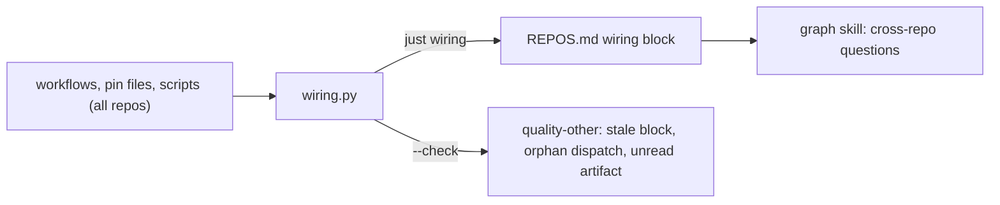

# MIP-0076: Agent routing tooling — a generated wiring table for cross-repo questions, a pinned offline graph for symbols

| | |
|---|---|
| **Status** | Accepted (2026-10-03, maintainer review on #635) — `Tasks: docs/MIPs/MIP-0076.tasks.md` ([`MIP-0076.tasks.md`](./MIP-0076.tasks.md)) |
| **Author** | Claude (Opus 5.5), from the maintainer's graphify question and two offline spikes (2026-10-02, 2026-10-03) |
| **Created** | 2026-10-03 |
| **Phase** | None: dev-loop tooling, outside `docs/PHASES.md`'s sequence. No Phase 1 prerequisite, no paid resource |
| **Related** | MIP-0074 §11 (the follow-up note this answers) and its `REPOS.md` routing table, MIP-0017 §9 (rejected graphify for the monorepo; §2 says what changed), MIP-0070 §5.4 (the contracts the wiring table describes), MIP-0063 (named graphify as a later harness layer), MIP-0060 (precedent: a third-party agent tool pinned through Nix) |
| **Effort** | M — one stdlib+PyYAML extractor with fixtures (~200 lines, prototyped), one devkit tool wrapping a nixpkgs package, one plugin skill, a generated block in `REPOS.md`, one umbrella CI job, and a one-line `notify-umbrella` change in five repos; no Scala |
| **Gain** | `infra/dev-loop` — "who produces, consumes or triggers X" gets a parsed answer in one ~650-token table, and that table cannot drift; "where is symbol X" in an unfamiliar repo gets one bounded query instead of reading trees |
| **Effort vs Gain** | `do when MIP-0074 lands` — the wiring table goes into the `REPOS.md` MIP-0074 creates (task 27, marola-dev/marola#617), and the graph indexes the docs MIP-0074 rewrites |
| **Depends on** | MIP-0074: `REPOS.md` (task 27) and the restructured docs. Uses the devkit's existing nixpkgs lock, which already carries `graphify` 0.9.66. No Phase 1 gate. Creates no paid resource, and §5.2 rules out a model call on the tool's own path |
| **Blocked by** | 0074 |
| **Risk** | The graph half goes unused: it answers only symbol questions, 3 of 8 in both spikes, and loses to `git grep` whenever the agent knows the keyword. The wiring table carries most of the value |
| **Cost so far** | — |

## 1. Summary

Two tools, split by the kind of question. Cross-repo questions get a **wiring table**: a devkit
extractor parses every repo's workflows, dispatches, release uploads and pin files into a generated
block in the umbrella's `REPOS.md`, checked for staleness like the MIP graph. Symbol questions get
**`graph`**: a devkit tool running a pinned graphify offline and keyless, with its output outside the
checkout and a small default answer budget. A plugin skill tells an agent which to use, and when
plain `git grep` is cheaper than both.

## 2. Motivation

The maintainer's question (2026-10-02): as the umbrella and its submodules grow, so does what an
agent must read before acting. Could a graph act as a routing table that sends it to the right
repo and file, and so avoid context rot?

MIP-0017 §9 rejected graphify because marola was "small enough that `Explore`/`Grep` … already gives
an agent working context in seconds". MIP-0070 removed that premise. There are now six repos plus
the devkit, and an agent started in one sees only that tree. A question like "which image does the
map's board use" crosses three repos and two pin files.

Two offline spikes measured it on the real workspace (Appendix), with 0 tokens and no network:

- **graphify graphs the whole umbrella in one run**: 4,921 nodes and 8,447 edges in 3.7 s on 0.9.74.
- **It answers symbol questions only**: 3 hits, 3 partials and 2 misses out of 8 real questions, in
  both spikes. Every miss or partial was about the wiring between repos. That wiring is invisible to
  it: `.yml` is a "document" for its LLM pass, and pin files, justfiles and Dockerfiles are skipped.
- **Injecting parsed wiring into graphify's graph barely helps `query`.** One of the four wiring
  questions moved from miss to partial, because matching is lexical over labels. `update` also evicts
  injected nodes outside the scan root.
- **A generated Markdown table of the same facts answers 5 of 8 questions**, all the wiring ones, in
  2.5 KB read once. graphify answers 3 of 8 at about 1.8 KB per question.
- **The extractor found a real gap** that grep and the graph both missed: `pointer-sync.yml` listens
  for `submodule-updated`, but nothing sends it. Every repo's `notify-umbrella` sends only
  `submodule-docs-updated`, on docs pushes. Confirmed against each repo's `main` on 2026-10-03.

## 3. User-visible change

None for marola's users. For an agent or contributor:

```console
$ just wiring            # umbrella: regenerate REPOS.md's wiring block
$ just wiring --check    # quality-other: fail if the block is stale
$ just graph build       # any repo: ~3 s, output in ~/.cache/marola-graph/<repo>/
$ just graph query "where is the swimability score computed?"
NODE Swimability  src=marola-app/core/src/main/scala/marola/scoring/Swimability.scala …
```

A sample of the generated block, from the spike 2 prototype on 2026-10-03:

| Artifact | Published by | Pinned in | Read by |
|---|---|---|---|
| `ghcr.io/marola-dev/marola-app` image | `marola-app/.github/workflows/docker.yml` | `marola-ml/marola-image`, `marola-oods/marola-image`, `marola-site/marola-image` | `marola-ml/scripts/app-image.sh`, …, `marola-site/scripts/board-schema.sh` |

## 4. Data sources and dependencies reviewed

- **graphify** (`Graphify-Labs/graphify`, PyPI `graphifyy`, Apache-2.0; the wheel also ships a
  `LICENSE-MIT` for code from before the relicensing). It parses code locally with tree-sitter, and
  sends docs, YAML, PDFs and images to an LLM pass. Upstream releases about daily: 0.9.74 came out on
  2026-10-02. **Pick: the nixpkgs package** `pkgs/by-name/gr/graphify`, 0.9.66 both on
  `nixos-unstable` and at the devkit's locked nixpkgs (`b4fd65b`). It includes `tree-sitter-scala`
  and has `GRAPHIFY_OUT` (the output-dir override, honoured end to end since 0.8.45). Updates arrive
  through the devkit's normal `nix flake update`, with no second pinning mechanism. Lagging upstream
  by a few weeks is a feature for a tool this young.
- **graphify's MCP server** (the `mcp` extra) is the same engine as the CLI. Its node lists matched
  the CLI's for all 8 questions, and it adds about 6.6 KB of tool schemas. **Rejected.**
- **graphify's installers, hooks and `--strict`** write assistant config and hooks, and strict mode
  blocks an agent's first file read. Since 0.9.72, any CLI command also refreshes installed skills.
  **Rejected**: they collide with the devkit's `core.hooksPath` and its plugin.
- **graphify's LLM pass**: about 0.6–0.7M input tokens per full pass, and it would return the wiring as
  inferred edges. **Rejected** (§9).
- **Claude Code and generated files** (code.claude.com docs, 2026-10-03):
  - `.claudeignore` has no effect; the supported mechanism is `Read(...)` rules in
    `permissions.deny`.
  - Editing repo files keeps the prompt cache.
  - An untracked `graphify-out/` still changes the git-status snapshot each session starts from, and
    invites agents to read 5–10 MB of JSON.
  - So the output goes outside the checkout.
- **The wiring sources** are marola's own files: `.github/workflows/*.yml` in every repo,
  `.gitmodules`, `flake.lock`, the pin files (`marola-image`, `corpus.version`, `resources.version`)
  and whatever scripts, justfiles, Dockerfiles or `build.sbt` name them.

## 5. Design

### 5.1 The wiring extractor and `REPOS.md`'s generated block

`scripts/wiring.py` in marola-devkit (stdlib plus PyYAML, added to the devkit's `python`), on `PATH`
as `wiring`, with a `wiring` recipe in `devkit.just`. It runs in the umbrella, where every submodule
is checked out, and reads the devkit's tree from the flake's store path. It parses:

| Source | Yields |
|---|---|
| `on:` per workflow (`repository_dispatch.types`, `workflow_run`, `workflow_call`, push `paths` hitting a pin) | what triggers each workflow |
| `event_type=` / `…/dispatches` in `run:`, and `uses: marola-dev/<repo>/.github/workflows/X@ref` with its `event-type` | who sends each dispatch, and each reusable-workflow ref |
| `gh release upload/create`, `IMAGE: ghcr.io/…` + `build-push-action`, `actions/deploy-pages` | what each workflow publishes or deploys |
| pin files, and any script/justfile/Dockerfile/`build.sbt` naming one or its `releases/download` URL | where each artifact is pinned, and who reads the pin |

It writes four tables, between `<!-- wiring:start -->`/`<!-- wiring:end -->` markers in
`docs/2-Building-marola/REPOS.md`:
- artifact → published by → pinned in → read by;
- dispatch → sent by → triggers;
- pin bump → workflow;
- deploy → site.

`wiring --check` regenerates the block and fails on any difference, the same pattern as
`mip_graph.py`'s block in `docs/MIPs/README.md`. It also fails on two more conditions:
- a dispatch type that is listened for but never sent, or sent but never listened for;
- an artifact with no reader. An artifact the regex can't resolve is excepted with a one-line
  `wiring.allow` entry giving a reason. Today that is `api-docs.tar.gz`, fetched through variables
  in `fetch-api-docs.sh`, and `ghcr.io/marola-dev/marola-ml`, which the maintainer keeps (decided
  2026-10-03) although no workflow or script in the org reads it.



**Decided 2026-10-03: the wiring lives as a generated block inside `REPOS.md`.** REPOS.md's per-repo
rows (what each repo owns, MIP-0074 §5.1) stay hand-written. The artifact and dispatch facts become
generated, which removes the drift MIP-0074 §8 accepts for them. `REPOS.md` stays the one copy, as
the maintainer decided for MIP-0074. That amends MIP-0074 task 27: its contracts table of artifacts
and pins is written as an empty `wiring:start`/`wiring:end` block, or as a hand-written table that
step 3 below replaces.

### 5.2 `graph` in marola-devkit

`scripts/graph.sh` on `PATH`, with `pkgs.graphify` added to `runtimeDeps`, plus a `graph *args` recipe.
Every repo gets it with its next devkit bump.

- **`graph build`** runs `graphify extract . --code-only --no-label` and then `graphify update .` (the
  local Markdown pass) in place, with `GRAPHIFY_OUT=${XDG_CACHE_HOME:-$HOME/.cache}/marola-graph/<repo>`.
  It records `HEAD` and `git submodule status` in `build.json` beside the graph. graphify honours
  `.gitignore` by default, so `.tmp/wt-*` worktrees and `.env` stay out. An uninitialised submodule
  is an error, not a silent gap. A repo with noise to drop commits a `.graphifyignore`: the umbrella
  drops `**/vendor/**` (leaflet.js was 81 nodes of noise) and the non-canonical `board.schema.json`.
- **No model call on this path.** Every graphify call runs under `env -i`, passing only `PATH`, `HOME`
  (the cache dir), `GRAPHIFY_OUT`, `GRAPHIFY_NO_AUTO_REFRESH=1` and `OLLAMA_BASE_URL=http://127.0.0.1:9`.
  Where unprivileged user namespaces exist, it also runs under `unshare -rn`, with a notice when it
  can't. The tool never passes `--backend`, and refuses `extract` without `--code-only`.
- **`graph query|path|explain`** pass `--graph <cache>/graph.json`, and `query` defaults to `--budget
  400`. Spike 2 found `--budget` only truncates: start nodes and order were identical at 2000, 800 and
  400, so all hits survive at about 1.8 KB instead of 6.6 KB. They print a staleness line when `HEAD` or
  a submodule SHA differs from `build.json`; a rebuild takes about 3 s.
- Never: graphify's installers or hooks; committing any of its output; reading `GRAPH_REPORT.md`
  (about 21k tokens) into context.

### 5.3 The plugin skill

`plugins/marola-devkit/skills/routing/SKILL.md`, a routing rule rather than a tutorial:

- **"What produces, consumes, pins or triggers X?"** Read the wiring block in `REPOS.md`: the
  umbrella's copy, or docs.marola.dev from a submodule.
- **"Where is symbol or concept X?" when the keyword is unknown or the repo unfamiliar.** Use
  `just graph query`, then read only the files it names.
- **The keyword is known.** Use `git grep` (with `--recurse-submodules` in the umbrella).
- Never read `GRAPH_REPORT.md` or `graph.json` whole.

### 5.4 The umbrella

- **`AGENTS.md`**: one paragraph under "The repos" (MIP-0074 task 27 turns that section into a link
  to `REPOS.md`), naming the wiring block, `just graph` and the skill.
- **`quality-other`** runs `wiring --check`, so a PR that changes a workflow or pin fails until the
  block is regenerated. pointer-sync's PR gets it too: it moves submodules, so it regenerates the
  block in the same commit.
- **A `graph` job in `ci.yml`**, path-filtered to submodule pointers and the devkit pin. It runs
  `just graph build` on the PR's pinned commits as a smoke test of each devkit/graphify bump, and
  uploads `graph.json` plus `build.json` as an artifact with 7-day retention for a session without
  Nix. It is never committed and never deployed.

### 5.5 Rollout

1. **marola-devkit**: `wiring` with fixtures and `wiring.allow` support. The reusable
   `notify-umbrella.yml` sends `submodule-updated` on every push to `main`, and also
   `submodule-docs-updated` when the push touched `README.md` or `docs/**` (a `git diff --name-only`
   over the pushed range, instead of the caller's `paths:` filter). Release.
2. **marola-devkit**: `graph` and the routing skill. Release.
3. **each code repo** (app, site, corpus, ml, oods): bump the devkit, and drop `paths:` from the
   `notify-umbrella.yml` caller so it runs on every push to `main`. One small PR per repo.
4. **marola**: devkit bump; the wiring block in `REPOS.md`; `wiring --check` in `quality-other`; the
   `AGENTS.md` paragraph; the CI job; pointer-sync regenerating the block. The routing re-test (§7)
   goes in the PR description.

**Decided 2026-10-03: every code repo sends `submodule-updated` on each push to `main`**, as MIP-0070
described. Steps 1 and 3 close the gap the extractor found, so step 4's `wiring --check` gates with no
allow entry for it. Until step 3 lands everywhere, pointer-sync's daily cron keeps pointers moving, as
it does today.

## 6. Scoring / safety impact

None. No code path in marola-app changes; this is dev tooling.

## 7. Verification plan

- **`wiring.py`**, pytest with fixture repos:
  - `dispatch_types_listened`, `dispatch_send_step`, `reusable_workflow_ref_and_event_type`;
  - `release_upload_assets`, `image_publish`, `deploy_pages_site`, `pin_file_and_reader`;
  - `check_fails_on_stale_block`, `check_fails_on_orphan_dispatch`, `check_fails_on_unread_artifact`,
    `allow_entry_needs_reason`.
- **`graph.sh --self-test`**, with a fake `graphify` on `PATH` that records its argv and environment:
  - `env_scrubbed` (no `*_API_KEY`, `ANTHROPIC_*` or `OPENAI_*` gets through);
  - `no_auto_refresh_set`;
  - `refuses_extract_without_code_only`;
  - `output_outside_checkout` (`git status --porcelain --ignored` is empty after a build);
  - `uninitialised_submodule_fails`;
  - `stale_notice_on_new_head`;
  - `query_default_budget_400`.
- **Live**: after MIP-0074, on a fresh `--recurse-submodules` clone, re-run the 8 questions using the
  skill's rule and record the result in the umbrella PR. Done means **at least 7 of 8 answered right
  first** (spike 2: 5 from the table, 3 from the graph), with 0 tokens in graphify's report footer.
- **CI**: `quality-other` turns red on a test branch that adds an unread pin or an unsent dispatch type.

## 8. Risks, limitations, and honest caveats

- **The extractor knows marola's idioms**: its pin names, `gh release`, dispatch steps. Anything
  fetched through variables is invisible to it (`fetch-api-docs.sh` today), and the INFERRED edges
  come from regexes over shell text. `wiring.allow` makes each blind spot explicit instead of silent.
- **Accidental LLM spend** if someone runs bare `graphify` instead of `graph`. The skill names only
  `just graph`.
- **Network isolation is best effort.** `unshare -rn` needs unprivileged user namespaces, which
  Ubuntu 24.04 restricts (`AGENTS.md`'s ai-jail note). The guarantee is `env -i`, `--code-only` and
  `--no-label`; the namespace is defence in depth.
- **Graph answers are lexical.** Stop words pull in noise: "point" ranked `SamplingPointCoordinates`
  above the Telegram entry point. When every start node is reached, the budget is ignored and output
  grew to 13 KB once.
- **Staleness**: the graph answers for the tree it was built from, and the staleness line is the only
  defence. The wiring block cannot go stale on `main`, because `--check` gates it.
- **Upstream churn**: graphify changes daily. The nixpkgs pin and the CI smoke job catch a breaking
  change at bump time, not in a session.

## 9. Alternatives considered

- **Do nothing**: MIP-0017's call, which was right for the monorepo. After the split, the cross-repo
  questions are exactly the ones an agent can no longer grep for.
- **Only a hand-written `REPOS.md`** (MIP-0074 as accepted): it answers the wiring questions, but it
  drifts, and it missed the unsent `submodule-updated`.
- **Wiring injected into graphify's graph** (prototyped in spike 2): `path` is exact (0.2–0.35 KB) once
  you know the labels, but `query` rarely reaches the injected nodes. It also has to be re-injected
  after every `update`, which evicts nodes outside the scan root, and it ties us to graphify's private
  eviction rules.
- **graphify's LLM pass over YAML and docs**: about 0.6–0.7M tokens per pass, for edges that come back
  as inferred, when a ~200-line parser gets them exactly and for free.
- **graphify's MCP server**: the same answers plus about 6.6 KB of schemas.
- **Per-repo graphs merged with `merge-graphs`**: no repo-to-repo edges, and it drops about 900
  doc→code links.
- **Committing graph output**: 5.9 MB that churns on every change.
- **A PyPI/uv pin instead of nixpkgs**: a second pinning mechanism beside the devkit's flake.
- **The wiring as a separate generated file** instead of a block in `REPOS.md`: a second place for the
  same facts, against the maintainer's one-copy decision on MIP-0074.

## 11. Open questions

None. The maintainer decided the three questions the spikes raised (2026-10-03):

- **The wiring block lives in `REPOS.md`**, generated (§5.1), which amends MIP-0074 task 27.
- **Every code repo sends `submodule-updated`** on each push to `main` (§5.5 steps 1 and 3).
- **`ghcr.io/marola-dev/marola-ml` stays.** It is a `wiring.allow` entry, not a retirement (§5.1).

## Appendix

### Spike 1 report (2026-10-02)

Measured on a fresh clone in a scratch directory, not in this repo. Kept verbatim apart from
heading levels; "below" and "Proposal" refer to this report, which §5 supersedes.

Verdict: **go with conditions** for a follow-up MIP. Treat it as an optional, local, on-demand
symbol and doc-mention index for in-repo routing, not as the cross-repo routing table: the graph does
not contain the cross-repo wiring (workflows, image pins, tarball pins, dispatch events).

#### Versions and setup

- graphify 0.9.73 (PyPI `graphifyy`), installed into a scratchpad venv with `uv venv` + `uv pip install`.
  No `uv tool install`, no `graphify install`, no `graphify <platform> install`, no `hook install`.
- Umbrella `marola-dev/marola` at `8387c25`, cloned with `--recurse-submodules`. Submodules: marola-app
  `16ab0c4`, marola-corpus `c62001b`, marola-ml `50d08b3`, marola-oods `dad1e0a`, marola-site `568199a`.
  marola-devkit cloned separately at `d1872de`.
- **No-LLM guarantee, enforced rather than trusted.** Every graphify call went through a wrapper:
  `unshare -rn env -i HOME=<scratchpad>/fakehome PATH=<venv>/bin:/usr/bin:/bin OLLAMA_BASE_URL=http://127.0.0.1:9 graphify …`
  That means no network namespace, no API keys in the environment, and a fake HOME, so nothing reaches
  `~/.cache` or `~/.graphify`. This matters because graphify auto-detects a backend from whatever keys
  are set (Gemini → Kimi → Claude → OpenAI → … → Ollama), and `cluster-only`/`label` name communities
  with that backend unless you pass `--no-label`. The report footer said `Token cost: 0 input · 0 output`.
  The fake HOME was still empty at the end, and the clone's `git status` showed only `?? graphify-out/`:
  no `.gitignore`, `CLAUDE.md` or `.claude/` was written.

#### Commands

```
gfy extract . --code-only --no-label --timing     # per repo dir, and once at the umbrella root
gfy update .                                      # incremental; no LLM ("Code graph updated")
gfy query "<question>"                            # default --budget 2000 tokens
gfy explain "pointer-sync.sh";  gfy path "corpus-fetch.sh" "Corpus"
gfy merge-graphs <7 graph.json> --out merged.json
```

#### 1. Multi-repo

**One run at the umbrella root walks all five checked-out submodules into one graph.** No flags
needed: the 202 code files it found equal the sum of the per-repo runs (16+139+23+4+17+3). It works
because the submodule worktrees are plain directories on disk. Nothing in graphify is
submodule-aware, so an un-initialised submodule just drops out silently.

| Graph | Files (code) | Nodes / edges, `extract --code-only` | Nodes / edges, after `update` (adds .md) | Cold build | graph.json |
|---|---|---|---|---|---|
| umbrella only | 16 | 195 / 343 | 1889 / 2058 | 0.7 s | 0.18 MB (code-only) |
| marola-app | 139 | 1655 / 3401 | 1771 / 3683 | 1.5 s | 2.0 MB |
| marola-site | 23 | 504 / 767 | 534 / 793 | 1.2 s | 0.40 MB |
| marola-corpus | 4 | 8 / 12 | 60 / 51 | 0.3 s | 7 KB |
| marola-ml | 17 | 213 / 426 | 270 / 478 | 0.6 s | 0.22 MB |
| marola-oods | 3 | 9 / 14 | 31 / 32 | 0.3 s | 8 KB |
| marola-devkit | 52 | 536 / 1121 | 688 / 1256 | 1.1 s | 0.58 MB |
| **workspace (one run)** | 202 | **2556 / 4950** | **4530 / 7978** | **2.6 s** (3.4 s incl. timing) | 3.0 MB → **5.5 MB** |

Whole `graphify-out/` after `update`: 17 MB in total. That is graph.json 5.5 MB, graph.html 4.5 MB,
GRAPH_REPORT.md 84 KB (~21k tokens, too big to load as context), manifest.json 100 KB, plus the AST
cache. Peak RSS is about 105 MB.

**Surprise: `update` is not the same as `extract --code-only`.** `update` also runs graphify's local,
deterministic Markdown extractor (headings, plus inline code-span mentions resolved to code symbols as
`references` edges, from `markdown_resolution.py`). That pass made no LLM calls, which the netns
enforces. It nearly doubles the graph. A CI recipe has to pick one of the two on purpose.

**Merging:** `merge-graphs` works (7 graphs → 5209 nodes / 8351 edges in 0.5 s, 6.5 MB). It prefixes
ids with `repo::` and adds a `repo` attribute. It is a disjoint union, though: **zero repo-to-repo
edges**, only edges into shared external nodes (`kyo`, `java`, …). Its cross-repo pass
(`cross_repo_calls.py`) only binds typed member calls across repos, and marola's repos never call
each other. A merge also loses the ~900 doc→code edges that the single workspace run finds.
Conclusion: graph the umbrella in one run; don't merge per-repo graphs.

#### 2. Cross-repo edges

- Code-only workspace graph: **3** repo-to-repo edges, all spurious. They are `rationale_for` edges
  from the umbrella's `scripts/strip_external_scripts.py` docstrings to marola-app's copy of the same
  file, a dedup artefact.
- After `update` (Markdown mentions): ~900 repo-to-repo `references` edges, almost all
  umbrella docs/MIPs → marola-app Scala symbols (818), plus umbrella → site (57) and a few ml/corpus →
  app. A 15-edge sample was mostly right (MIP-0055 §5.6 → `KnowledgeStore`, MIP-0031 → `.waterVerdict()`)
  with some noise (a nix-tooling plan → `TrailFinderSpec.find()`). These are **"which doc talks about
  this code"** edges, not wiring.
- **Missing, and these are exactly the edges a cross-repo agent needs.** `.yml`/`.yaml` are in
  graphify's `DOC_EXTENSIONS`, so they get only the LLM semantic pass: **all 85 workflow/YAML files are
  absent** from a no-LLM graph. That covers pointer-sync.yml, docs.yml, notify-umbrella.yml, site.yml,
  release.yml and every `repository_dispatch` type. `marola-image`, `corpus.version`, justfiles,
  Dockerfiles and `.nix` are unclassified and skipped (80 files). So there is no edge for:
  app image → site/ml/oods (`marola-image` pins), corpus tarball → app/ml (`corpus.version`,
  `corpus-fetch.sh`), ml-resources produced by app `release.yml` → consumed by ml
  `resources-fetch.sh`, notify-umbrella → `repository_dispatch` → pointer-sync/docs.
- The board-schema contract is in the graph twice: `marola-app/cli/src/main/resources/board.schema.json`
  and `marola-site/site/board.schema.json`, 215 nodes each. **Nothing links the two copies.**

#### 3. Routing quality (workspace graph after `update`, 4530 nodes)

Output cost: each `query` printed 47–75 lines, **6.4–8.0 KB (~1.6–2.5k tokens)**, because the default
budget is 2000 tokens and most queries hit the "TRUNCATED: showing 43 of 301 nodes" path. For the
baseline, `git grep --recurse-submodules -l -i -E <kw> -- ':!*.md'` printed 62–1234 bytes. Caveat in
grep's favour: I picked the keywords knowing the answers, while graphify took the plain-English
question. "Right first" means the right repo + file in the first NODE `src=` lines.

| # | Question | graphify query | grep baseline |
|---|---|---|---|
| 1 | Where is the swimability score computed? | **Hit**, 1st: `marola-app/.../scoring/Swimability.scala` (6.6 KB) | hit within 15 files (852 B) |
| 2 | What builds the map's boards, which image? | **Partial**: BoardSpec/Main/SiteBuilder (app) found; the first src is the wrong repo's `marola-ml/scripts/app-image.sh`; `marola-site/.github/workflows/site.yml` + `marola-image` absent (6.4 KB) | `marola-image` → site.yml, board-schema.sh, site justfile (297 B) |
| 3 | Where does the RAG corpus come from, how pinned? | **Partial**: `Corpus.scala` 1st; the pin (`corpus.version`, `corpus-fetch.sh`, corpus `release.yml`) absent (6.7 KB) | `corpus.version` → 10 files across app/corpus/ml (311 B) |
| 4 | What consumes ml-resources? | **Hit** (consumer): `marola-ml/scripts/resources-fetch.sh` 1st, full answer in 36 nodes; the producer (app `release.yml`) absent (8.0 KB) | 4 files, producer + consumer (144 B) |
| 5 | Which workflow moves the submodule pointers? | **Miss**: AGENTS.md, then MIP-0040/Reviewer noise; `pointer-sync.sh` is a node but wasn't reached; the workflow isn't in the graph (6.6 KB) | `.github/workflows/pointer-sync.yml` 2nd (423 B) |
| 6 | Where is the Telegram bot's entry point? | **Partial**: `Main.scala` 5th, after SamplingPointCoordinates (the word "point") and TELEGRAM-SETUP.md (6.5 KB) | 27 files, mostly issue templates (1234 B) |
| 7 | How does a marola-site docs change reach docs.marola.dev? | **Miss**: marola-site/docs/index.md, .mcp.json, DEV-FLOW.md; notify-umbrella → docs.yml → prepare-docs.sh is absent (6.6 KB) | `submodule-docs-updated` → docs.yml, pointer-sync.yml (62 B) |
| 8 | Where is the Open-Meteo forecast fetched? | **Hit**, 2nd: `OpenMeteoClient.scala` (6.5 KB) | 3 files incl. it (191 B) |

Score: 3 hits, 3 partial, 2 misses. Every hit is a "where is symbol X" question about Scala/Python in
one repo. Every miss or partial is about the artefact/workflow wiring between repos. `explain
"pointer-sync.sh"` is cheap (523 B) and accurate, but you have to know the node name already, and
it only shows the script's own functions, not who runs it. `path "corpus-fetch.sh" "Corpus"` and
`path "SiteBuilder" "board-schema.sh"`: "No directed path found." Matching is lexical, so stop words
like "point" or "entry" pull in noise.

#### 4. Freshness and cost of keeping it current

- A full rebuild of the whole workspace takes ~2.6 s on a laptop; `update` takes 3.3–4.5 s (it
  re-renders the report and graph.html each time). Staleness costs nothing to fix, so incremental
  support (`update`, `watch`, `check-update`, manifest-based) is a nice-to-have, not a requirement.
- The graph records `built_at_commit`, the umbrella HEAD only. It doesn't capture submodule SHAs, so
  after pointer-sync it can't tell whether a submodule's slice is stale. A recipe would have to
  record `git submodule status` next to it.
- Regeneration points: local on demand (cheapest, always fresh), or a CI job after pointer-sync.
  graphify's own hooks (`hook install`, which writes git hooks and a merge driver into git config)
  break this repo's `core.hooksPath` = devkit model and are excluded.
- If committed: 5.5 MB graph.json that churns on every code change, plus `.graphify_root`/cache files
  that are machine-local. **Don't commit it to any working tree.** The README's prompt-cache warning
  says graphify writes into the workspace and every write invalidates Claude Code's prompt cache
  unless ignored. Its suggested `.claudeignore` is unverified: I don't know that Claude Code honours
  that file. The safe form is an output path outside the checkout, read with `--graph <path>`.
  graphify always writes `graphify-out/` under the scanned root, so a recipe has to scan from a
  scratch copy or move the outputs afterwards.

#### 5. The docs semantic pass (not run)

- What it adds over the local Markdown pass: LLM-extracted concepts/relations from .md and, crucially,
  from **.yml** (the workflows), plus PDFs/images. Of everything graphify offers, only this path could
  capture the cross-repo wiring, and even then it would come back as LLM-inferred edges, not parsed
  ones.
- Size: 261 doc-class files (85 of them YAML), ~351k words / 2.6 MB ≈ **~0.6–0.7M input tokens per full
  pass**, plus JSON output and retries. Truncated chunks are bisected up to 3 levels (up to 8× calls
  per chunk) unless `GRAPHIFY_MAX_RETRY_DEPTH=0`. Backend: auto-detected from env keys, default Claude
  model `claude-sonnet-4-6`; `--backend claude-cli` spends the subscription, `--backend ollama` is free
  and local but slow. `--update` re-extracts only changed docs.
- Worth it? **Not now.** MIP-0074 is restructuring the docs, which would invalidate the pass, and the
  inferred workflow edges are what we'd least want to trust. A ~50-line deterministic parser of
  `.github/workflows/*.yml` + pin files (below) gets the wiring exactly, for free.

#### Proposal: umbrella vs devkit vs each repo

**marola-devkit** (shared tooling, versioned with the devkit tag):
- graphify pinned (uv lock in a `tools/graphify/` dir, or a flake package), never `uv tool install`.
- A `graph` recipe/script that runs **netns-isolated with env scrubbed** (the wrapper above, or at
  minimum `env -i` + `--no-label` + `--backend` unset), uses a chosen mode (`extract --code-only` then
  `update`, i.e. code + local Markdown), writes to `${XDG_CACHE_HOME}/marola-graph/<repo>/` (outside
  the checkout), and records `git submodule status` alongside.
- `.graphifyignore` defaults: `**/vendor/**` (leaflet.js is 81 nodes of noise), `graphify-out/`,
  `.tmp/`, generated `board.schema.json` copies except one canonical copy.
- **A small wiring extractor** (the gap graphify doesn't fill): parse workflows for
  `repository_dispatch` types/sends, `uses: marola-dev/marola-devkit/...@`, and pin files
  (`marola-image`, `corpus.version`, release asset names) into nodes/edges in graphify's graph.json
  schema, merged into the umbrella graph. This is where the cross-repo routing value is.
- The agent skill/snippet: "for 'where is symbol X', try `graph query`/`explain` first; for
  'what consumes/produces/triggers X', read the wiring table". Shipped as a plugin skill, **not** via
  `graphify claude install` (hooks; strict mode blocks the first raw Read).
- Later, optionally: a reusable CI workflow that builds the graph and uploads it as an artifact.

**umbrella (marola):**
- The workspace graph is built in one run at the root (multi-repo works; merge doesn't add edges).
  Publish it as a CI artifact after pointer-sync / on `docs.yml`'s schedule, or just build it locally
  in under 5 s. No branch, no docs-site page (5.5 MB, low human value).
- AGENTS.md routing guidance: a hand-written, deterministic **repo routing table** (repo → owns →
  artefact produced → consumers → workflow that moves it). This answers Q2–Q7 better than any graph
  query today, in about 30 lines.
- The `just graph` entry point, delegating to the devkit recipe.

**each repo:** nothing committed. A repo-local `just graph` (devkit recipe) for single-repo sessions is
fine, but the per-repo graphs are small enough that grep wins there too (marola-corpus 8 nodes,
marola-oods 9).

**Would NOT do:** `graphify install` / `claude install` / `hook install` / `--strict`; commit
graph.json; run the semantic pass in CI with an API key; rely on `merge-graphs` for cross-repo
structure; load GRAPH_REPORT.md (~21k tokens) into agent context.

#### Risks

- Accidental LLM spend: any env with an API key + a bare `graphify extract`/`cluster-only` (no
  `--code-only`/`--no-label`) calls a model. The devkit wrapper has to scrub env and kill the network.
- Prompt-cache invalidation if outputs land in the working tree.
- Fast-moving upstream (0.9.73, a YC startup steering toward a hosted platform): CLI semantics have
  already drifted between versions (README notes ghost-duplicate fixes, a Terraform id regen), so pin it.
- Query output is ~2k tokens per question, versus 0.1–1 KB for a good grep. It only beats grep when
  the agent doesn't know the keyword.
- Lexical matching produces confident-looking wrong first hits (Q2 wrong repo, Q6 "point").

#### Open questions

- Does Claude Code honour `.claudeignore`, or must outputs live outside the repo? (I assumed outside.)
- Does graphify's MCP server (`[mcp]` extra) give better routing than the CLI query? Not tested.
- Would `--budget 800` keep hits while cutting cost? Not measured.
- Is a wiring extractor emitting graphify-schema JSON maintainable in devkit, or should the routing
  table just be generated Markdown (`just routing-table`) and skip graphify entirely?

### Spike 2 report (2026-10-03)

Measured on fresh clones in a scratch directory, not in this repo. Kept verbatim apart from heading
levels; §5 supersedes its proposal.

Verdict: **use graphify only for "where is symbol X", at `--budget 400`. Generate the cross-repo wiring
as a Markdown table from a small deterministic extractor, not as nodes injected into graphify.** The
extractor works and its `path` answers are exact, but `query` almost never surfaces the injected nodes,
and `update` drops some of them.

Setup, the same as spike 1. Umbrella `273bd11` (app `0b2f982`, corpus `c62001b`, ml `50d08b3`, oods
`dad1e0a`, site `e25d12b`) and devkit `141541b`, freshly cloned into the scratchpad. Every graphify call
ran under `unshare -rn env -i HOME=<scratch>/fakehome PATH=<venv>/bin:/usr/bin:/bin OLLAMA_BASE_URL=http://127.0.0.1:9
GRAPHIFY_NO_AUTO_REFRESH=1 [GRAPHIFY_OUT=<abs>] graphify …`, with `--code-only --no-label` on extract.
At the end the fake HOME was empty, and both clones had no untracked or ignored files.

#### 1. Upstream drift

- **Version: 0.9.74**, published to PyPI 2026-10-02 16:21 UTC, two days after 0.9.73. Release cadence is
  about daily (0.9.67 through 0.9.74 in about a week).
- **Licence.** Still Apache-2.0 (`License-Expression`, GitHub `spdx_id`). The wheel now also ships
  `LICENSE-MIT` and a `NOTICE`: code contributed before the relicensing stays available under MIT. No
  problem for us.
- **YAML: unchanged.** `.yml`/`.yaml` are still in `DOC_EXTENSIONS`, so they get only the LLM doc pass.
  The one exception is package manifests (`apm.yml` etc.), which go through the code path. Workflows
  still never enter a no-LLM graph.
- **Output dir: it exists, and spike 1 missed it.** The `GRAPHIFY_OUT` env var takes an absolute path
  (`paths.py`, #686). With `GRAPHIFY_OUT=<scratch>/out-ws`, `extract` and `update` wrote everything
  there, and the clone stayed clean (`git status --porcelain --ignored` was empty). No scratch copy or
  move step is needed. `query/path/explain --graph <abs>` read the graph from there.
- **Multi-repo/submodules: nothing new.** The only mention of submodules is gitlink handling in
  `detect.py`. `merge-graphs` and `cross_repo_calls` are unchanged.
- **New safety item.** Since 0.9.72, any non-install CLI command auto-refreshes stale installed skills.
  It writes `SKILL.md` and makes `.bak` copies. `GRAPHIFY_NO_AUTO_REFRESH=1` turns this off, and it now
  belongs in the devkit wrapper. It was a no-op here because the fake HOME has no skills.
- **Did the spike-1 numbers move?** Two things changed at once: the repos and the version. I measured
  both, on the same commit:

| Workspace (umbrella + 5 submodules, 209 code files) | 0.9.73 | 0.9.74 | spike 1 (0.9.73, old commit, 202 files) |
|---|---|---|---|
| `extract --code-only` nodes / edges | 2604 / 5021 | **2640 / 5099** | 2556 / 4950 |
| `update` nodes / edges | 4885 / 8354 | **4921 / 8447** | 4530 / 7978 |
| time, extract / update | – | 2.7 s / 3.7 s (RSS 105 / 173 MB) | 2.6 s / 3.3–4.5 s |
| graph.json after update | – | 5.9 MB (graph.html 4.9 MB, report 92 KB) | 5.5 MB |

The version change accounts for +36 nodes / +78 edges (Scala abstract `def`s, from changelog #3962).
The rest is repo growth. Timings are flat.

#### 2. Query budget (CLI `query`, workspace graph, 0.9.74)

The default budget is 2000. `--budget` only truncates: the start nodes and their order were identical
at all three budgets for all 8 questions. So the hit/partial/miss result cannot change, and it matches
spike 1.

| # | Question | Result (any budget) | bytes @2000 | @800 | @400 |
|---|---|---|---|---|---|
| 1 | swimability score | **hit**, Swimability.scala 1st | 6654 | 3034 | 1816 |
| 2 | map boards + image | partial (ml `app-image.sh` 1st, BoardSpec/Main; no site.yml/pin) | 6569 | 2928 | 1797 |
| 3 | RAG corpus + pin | partial (Corpus.scala 1st; no pin/release) | 6714 | 3080 | 1943 |
| 4 | consumes ml-resources | **hit**, resources-fetch.sh 1st | 8110 | 3028 | 1784 |
| 5 | workflow moving pointers | miss (break-ui SKILL.md, MIP-0040, AGENTS.md) | 6679 | 3059 | 1809 |
| 6 | Telegram entry point | partial (Main 5th, after SamplingPointCoordinates "Entry") | 6614 | 3037 | 1851 |
| 7 | site docs → docs.marola.dev | miss (site docs/index.md, MIP-0074, .mcp.json) | 6767 | 3091 | 1891 |
| 8 | Open-Meteo fetch | **hit**, OpenMeteoClient 2nd | 6689 | 2960 | 1770 |

**At `--budget 400` all 3 hits survive** in the first 2 NODE lines, at about 1.8 KB per answer: ~27% of
the default output (8–15 nodes instead of 36–58). The cost is that the "TRUNCATED: answer may be among
the N cut nodes" banner is always present. Q4 at 400 still names `fetch()`/`release()` in
resources-fetch.sh. One trap: if every start node is reached, the budget is ignored ("complete answer
over budget"). Q4 on the wired graph printed 13 KB at `--budget 2000`.

#### 3. MCP server (`[mcp]` extra)

- Start it with `python -m graphify.serve <graph.json>`. Transports are `stdio` (the default) and
  `http` (Streamable HTTP, optional `--api-key`). Tools:
  - `query_graph(question, mode=bfs|dfs, depth=3, token_budget=2000, context_filter[])`
  - `get_node(label|node_id)`
  - `get_neighbors(label, relation_filter, token_budget)`
  - `get_community(community_id, token_budget)`
  - `god_nodes(top_n, exclude_hubs_percentile)`
  - `graph_stats()`
  - `shortest_path(source, target, max_hops=8, undirected)`
  - `list_prs`, `get_pr_impact(pr_number)`, `triage_prs`. These three need GitHub, so they are useless
    offline.

  It also exposes 6 resources (`graphify://report`, stats, god-nodes, surprises, audit, questions).
- **It runs offline.** I drove it under the netns wrapper with a 60-line stdio JSON-RPC client:
  initialize, tools/list, then `query_graph` × 8 questions × 3 budgets, `shortest_path`, `get_node`.
  The server identified as `graphify 0.9.74`.
- **No better than the CLI.** It is the same engine. The NODE lists were identical to the CLI's for all
  8 questions at 800, and the bytes were within ±3. Its default `depth=3` (CLI: 2) finds more nodes, but
  they are then truncated to the same output. On top of that, the tool schemas are 6.6 KB (~1.6k tokens)
  of definitions. Claude Code's tool search defers MCP tools by default, which softens this.
  `shortest_path corpus-fetch.sh → Corpus`: "No path found", the same as spike 1.

#### 4. Wiring extractor prototype

`wiring_extract.py`: 203 lines (176 non-blank, non-comment), stdlib + PyYAML, 0.17 s. Its inputs:
- `.gitmodules` and `flake.lock`, for the devkit ref.
- Each repo's workflows: `on.repository_dispatch.types`, `workflow_run`, `workflow_call` input
  defaults, push/PR `paths` that hit a pin file, `event_type=`/`dispatches` in `run:`, and
  `uses: marola-dev/<repo>/.github/workflows/X@ref` with its `with: event-type` (or the reusable
  workflow's default). Also `gh release upload|create` asset names, `IMAGE: ghcr.io/…` +
  `build-push-action`, `actions/deploy-pages` (domain from the CNAME echo or mkdocs `site_url`), and
  the `scripts/*` that a step runs.
- The pin files `marola-image`, `corpus.version`, `resources.version`, plus any script, justfile,
  Dockerfile or build.sbt that names a pin, and its `releases/download` URL.

Edges run along the flow (producer → artifact → pin → consumer), so `path` can follow them. They
reuse graphify's own file-node ids, so the wiring joins the code graph. The schema came from
`validate.py`: `file_type` must be one of the 6 valid types, `confidence` one of
EXTRACTED/INFERRED/AMBIGUOUS. Every injected edge is tagged `context: "wiring"`.

**Output: 83 nodes, 179 edges.** That is 53 workflows, 6 pins, 4 assets, 2 images, 3 events, 2 sites,
7 repos, and 6 files graphify skips (justfile, Dockerfile, build.sbt). Confidence:
- EXTRACTED: contains 53, uses_reusable 41, triggers 10, submodule 5, pinned_in 3, deploys 2.
- INFERRED, i.e. regexed from shell text: runs 32, read_by 12, dispatches 8, publishes 6,
  downloaded_by 3, pinned_in 3.

Merged into graph.json: 5004 nodes.

**`query` after injection (Q2, Q3, Q5, Q7):** start-node selection is lexical over labels, and the
existing doc/code nodes outrank the new ones.
- Q2, Q3: still partial, 0 wiring nodes in the answer.
- Q5: still a miss. The `pointer-sync.yml` workflow node never matches "workflow … pointers".
- Q7: **miss → partial.** The 1st node is now `docs.marola.dev (marola GitHub Pages site)` with
  `src=.github/workflows/docs.yml`, but the notify-umbrella → dispatch half of the chain is not in the
  output.
- Bytes are unchanged (±100).

**`path` after injection is exact and cheap (197–344 B), once you know a label:**

```
release.yml workflow (marola-corpus) --publishes--> marola-corpus-<tag>.tar.gz --downloaded_by--> marola-app/scripts/corpus-fetch.sh
notify-umbrella.yml (marola-site) --dispatches--> submodule-docs-updated --triggers--> docs.yml --deploys--> docs.marola.dev
docker.yml (marola-app) --publishes--> ghcr.io/marola-dev/marola-app --pinned_in--> marola-image (marola-site) --triggers--> site.yml
release.yml (marola-app) --publishes--> ml-resources-<tag>.tar.gz --downloaded_by--> resources-fetch.sh
```

The first of these printed "target match was ambiguous" (two `corpus-fetch.sh`, app and ml). `path
"…tar.gz" "Corpus"` (the Scala class) fails: nothing links the fetched tarball to `Corpus.scala`,
because the build-time handoff runs through Dockerfile/build.sbt resources.

**Does `update` keep injected nodes? Partly.** Injected nodes whose `source_file` exists under the scan
root survive (`_origin: "semantic"`). Anything with a path outside it is evicted as deleted: all 14
devkit nodes and 55 edges, including all 41 `uses_reusable` edges. Before I fixed the file-id join,
injected nodes on re-extracted code files were evicted too. The rule is to **re-run the extractor after
every `update`**. It is idempotent (it replaces everything tagged `context=wiring`), but it ties us to
graphify's private eviction rules (`watch.py`, `_origin`), which have changed in recent releases.

**The Markdown form** (`--md`, generated from the same scan) is 2,555 bytes (~650 tokens) for the whole
workspace. It has four tables:
- artifact → published by → pinned in → pin read by
- dispatch event → sent by → triggers
- pin bump → workflow
- deploy workflow → site

A sample row: `| ghcr.io/marola-dev/marola-app container image | marola-app/.github/workflows/docker.yml |
marola-ml/marola-image, marola-oods/marola-image, marola-site/marola-image | marola-ml/scripts/app-image.sh, …,
marola-site/scripts/board-schema.sh |`.

It answers Q2, Q3, Q4, Q5 (pointer-sync.yml as the receiver of `submodule-*-updated`) and Q7. That is
5/8 for 2.5 KB loaded once, against graphify `query`'s 3/8 at ~1.8 KB *per question*. Q1, Q6 and Q8 are
symbol questions, out of its scope.

| Form | Answers | Bytes | Keeping it correct |
|---|---|---|---|
| graphify `query` @400 | 3/8 (symbol questions) | ~1.8 KB per question | rebuild ~3 s; lexical noise |
| graph + wiring, `query` | 3 hits + Q7 partial | ~1.8 KB per question | extractor + re-inject after each `update`; depends on graphify internals |
| graph + wiring, `path` | Q2/3/4/7 exact | 0.2–0.35 KB, but needs labels | same |
| **generated routing.md** | **5/8 (all the wiring)** | **2.5 KB once** | extractor only; a diffable table that a CI check can regenerate and compare |

**Findings the extractor surfaced that grep and graphify both missed:**
- **Nothing sends `submodule-updated`.** pointer-sync.yml listens for it, and MIP-0070 says every code
  repo dispatches it on each push to main. Only `submodule-docs-updated` is ever sent.
- Some assets have no consumer:
  - app `api-docs.tar.gz`: the umbrella's `fetch-api-docs.sh` downloads through `$repo`/`$ASSET_NAME`
    variables, which the regex can't resolve. This is a known extractor miss.
  - ml `api-docs.tar.gz`: the same miss.
  - `ghcr.io/marola-dev/marola-ml`: no consumer found.
- Reusable-workflow refs are skewed: the umbrella is at `@v0.2.4`, every submodule at `@v0.2.2`.

#### 5. Claude Code and ignore files

- **`.claudeignore` does not exist.** The permissions doc says verbatim: "If your project has a
  `.claudeignore` file, it has no effect, so move its entries into `Read` deny rules"
  (code.claude.com/docs/en/permissions, §Read and Edit). The supported mechanism is
  `permissions.deny: ["Read(./graphify-out/**)"]`, gitignore-style patterns, applied best-effort to
  Grep/Glob/@-mentions. `respectGitignore` only affects the `@` file picker (settings-reference).
- **Prompt cache.** "Editing files in your repository" is listed under *actions that keep the cache*.
  File contents enter context only when read, and a changed file that was already read only gets an
  appended system-reminder (code.claude.com/docs/en/prompt-caching). So graphify's README warning
  overstates the effect for Claude Code. Writing graph files into the tree does not invalidate the
  cached prefix by itself.

  The real costs are different:
  - an untracked `graphify-out/` changes the git-status snapshot at session start. That snapshot is
    part of the prefix, so sequential sessions stop sharing a cache.
  - agents may Read or Grep 5–10 MB of JSON/HTML.
  - `git status` noise.

  Writing outside the checkout through `GRAPHIFY_OUT=<abs>` is not the *only* safe option, but it is
  the simplest, and a `Read` deny rule would still be needed for the in-tree form.

#### Not checked

- Whether better node labels (workflow descriptions from the header comments) would get wiring nodes
  ranked by `query`. That would be tuning to the question set.
- `get_neighbors`/`context_filter=['wiring']` as a routing call.
- Running the extractor in CI.
- Windows/macOS.
- The 0.9.74 HTTP transport.
- The private-name scan from spike 1. Its list lives under the main checkout's `.tmp/`, which this
  spike was told not to touch.

#### Checked live (2026-10-03)

- https://pypi.org/pypi/graphifyy/json (0.9.74, uploaded 2026-10-02T16:21:07)
- https://github.com/Graphify-Labs/graphify (`gh api`: licence Apache-2.0, releases v0.9.74 2026-10-02 and
  v0.9.73 2026-09-30, CHANGELOG.md 0.9.69–0.9.74)
- https://code.claude.com/docs/en/permissions (the `.claudeignore` sentence, Read deny rules)
- https://code.claude.com/docs/en/settings-reference (`respectGitignore`)
- https://code.claude.com/docs/en/prompt-caching (actions that keep or invalidate the cache, cache scope)
- https://code.claude.com/docs/en/settings (a `permissions.deny` `Read(./.env)` example)

Hygiene: the clones, both venvs (0.9.74 and the 0.9.73 comparison), the fake HOME and all outputs were
deleted. What remains is this report and `wiring_extract.py`. Nothing was written outside the scratchpad.

### Checked live

- `gh api repos/NixOS/nixpkgs/contents/pkgs/by-name/gr/graphify/package.nix`, 2026-10-03, on
  `nixos-unstable` and at the devkit's locked `b4fd65b`: `version = "0.9.66"`, `buildPythonApplication`,
  `tree-sitter-scala` among the dependencies, optional `mcp = [ mcp starlette ]`, licence `asl20 mit`.
  At the umbrella's own lock (`0968519`): 0.9.53. Commit history: 0.9.48 → 0.9.53 (09-02) → 0.9.61
  (09-13) → 0.9.66 (09-23).
- `Graphify-Labs/graphify` `CHANGELOG.md` (master) and `graphify/paths.py` at `v0.9.66`, 2026-10-03:
  `GRAPHIFY_OUT` honoured end to end since 0.8.45 (#1423) and present at 0.9.66; skill auto-refresh
  and `GRAPHIFY_NO_AUTO_REFRESH` since 0.9.72.
- `notify-umbrella.yml` on `main` of marola-app, -site, -corpus, -ml, -oods, 2026-10-03: each calls the
  devkit's reusable workflow `@v0.2.4` on pushes touching `README.md`/`docs/**`, with no `event-type`,
  so the default `submodule-docs-updated` is sent. The umbrella's `pointer-sync.yml:9` listens for
  `[submodule-updated, submodule-docs-updated]`, and its comment says the former is not sent today.
  Spike 2 saw the submodules at `@v0.2.2`: that was the umbrella's pinned commits, not `main`.
- `marola-dev/marola-devkit` at `141541b` (shallow clone, 2026-10-03): `flake.nix`'s `tools` map,
  `runtimeDeps`, `consumerTools`; `devkit.just`; `plugins/marola-devkit/{skills,hooks}`.
- `docs/MIPs/MIP-0017-agentic-tooling-survey.md:87,169` (the earlier rejection),
  `MIP-0074-…md:90,275,331`, and `MIP-0074.tasks.md` row 27 (marola-dev/marola#617, open on
  2026-10-03).
- Everything in the two spike reports was measured in those sessions; their own "Checked live" lists
  apply.

### Not checked

- Whether GitHub-hosted `ubuntu-latest` runners allow `unshare -rn`.
- nixpkgs' 0.9.66 build itself: both spikes ran PyPI wheels (0.9.73, 0.9.74). The 0.9.73 → 0.9.74
  difference was +36 nodes, so 0.9.66 is expected to be close, not verified.
- That graphify honours `.gitignore` during `extract` by default: from its README (`--no-gitignore`
  disables it). Both spikes ran on fresh clones, where nothing was ignored.
- Any of the new code: `wiring.py` exists as a 203-line prototype in spike 2's scratch area, not in
  any repo. `graph.sh`, the skill and the CI job are designs only.
