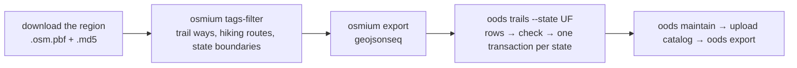

# MIP-0078: Open trail providers in the B2 lake — a weekly per-state trail ETL from OSM extracts, and an export per map area

| | |
|---|---|
| **Status** | Draft — [Tasks](./MIP-0078.tasks.md) |
| **Author** | Claude, for M. Hoffmann (project thread, 2026-10-06: "in case we need an ETL per state, which repository would fit … Create MIP for adopting backblaze b2 for OPEN trail providers, to enrich map"; plan issue marola-dev/marola#678) |
| **Created** | 2026-10-06 |
| **Phase** | 2 (`docs/PHASES.md`: a cloud store), the same scoped exception MIP-0075 §11 asks for. Free tier only, written by scheduled CI, read by the site build, never on a user's request path |
| **Related** | MIP-0030 (the trails on the board and the map; revised in the same PR), MIP-0075 (the B2 DuckLake, its `oods` module, the `oods-lake` round trip, the `trail` table its beach ETL writes), MIP-0070 §5.4 (where code, data and workflows live), MIP-0005 §5.4 (the build that fetches) |
| **Effort** | M — one migration and one view, the `spatial` extension beside `ducklake`/`httpfs`, a `TrailLoad` and `oods trails` in marola-app's `oods` module, one workflow and two input files in marola-oods, a download in marola-site's `site.yml` |
| **Gain** | `user value` — trails are drawn from a whole state's OSM data, long hiking routes included, and stay on the map through an Overpass outage; `infra/dev-loop` — a build makes no Overpass call for trails; `cost/ops` — one Geofabrik download per region per week, $0 inside B2's free tier |
| **Effort vs Gain** | `do when MIP-0075 lands` — the store, the round trip and the export step are MIP-0075 rows 1–6, 10 and 11, already filed |
| **Depends on** | MIP-0075 rows 1–6 (the `oods` module and `DuckLakeStore`), 10 (`oods export`), 11 (the `oods-lake` composite action) and 22 (migrations). The same people's gates as MIP-0075: the Phase 2 exception, the bucket smoke test and the read-only key for marola-site |
| **Blocked by** | 0075 |
| **Risk** | The Sudeste extract is 820 MB. The job downloads it each week and filters it with `osmium` before DuckDB sees anything, so a runner's disk and memory are never handed the whole region |
| **Cost so far** | — |

## 1. Summary

A weekly ETL loads every named trail and hiking route in a state's OpenStreetMap data into
MIP-0075's B2 DuckLake. One `trail_route` table is partitioned by state (`uf`), and each row
carries its provider, licence and OSM id. A `trail_source` table records each provider and its
licence, and only a provider whose licence was checked gets a row. Today that is OSM alone, read
from Geofabrik's regional extracts (ODbL). An `area_trail` view picks the trails near each map
area's beaches and lakes, and `oods export` writes them as `exports/trails/<key>.json`, which the
build reads instead of Overpass (MIP-0030 §5). The code goes in marola-app's `oods` module, the
workflow and inputs in marola-oods, and marola-site only downloads the export.

## 2. Motivation

- **The map has no trails.** The board has carried them since 2026-09-07, but the toggle is still
  "em breve" and every build asks Overpass for them again. Overpass time-outs already broke main's
  deploys on 2026-10-06 (marola-dev/marola-site#63).
- **The area query misses long routes.** MIP-0030's first query found no `route=hiking` relation
  near Florianópolis and dropped relations. The Transcarioca is one (relation 6906578, MIP-0030
  §4.1). A state-wide load finds every route once, wherever its members run.
- **A provider needs a licence on record.** Hoffmann asked for Wikiloc "or other free provider".
  Wikiloc grants no reuse (MIP-0030 §4.3). A table that carries each provider's licence and
  attribution lets a second open provider join later without a schema change, and keeps out any
  provider without one.
- **Where should a per-state ETL live?** MIP-0070 §5.4 and MIP-0075 §5.1 already answer it. Code
  goes in marola-app (the `oods` sbt module), data in B2, and the workflow and its inputs in
  marola-oods, which holds no code. marola-site is a static page with a build, and an ETL there
  would make it read OSM extracts and write the lake, both of which it never does.

## 3. User-visible change

On the map, with the toggle on (MIP-0030 §3), Florianópolis, Rio and Salvador show the same
trails as today plus the hiking routes near them. They stay up through an Overpass outage. The
about page says: "Trilhas: OpenStreetMap (© colaboradores do OpenStreetMap, ODbL), via Geofabrik,
atualizadas toda semana". In the lake:

```sql
SELECT uf, kind, count(*), round(sum(length_km)) AS km FROM trail_route GROUP BY ALL;
-- SC  path   …   …
-- SC  route  …   …
-- RJ  route  …   …        -- Trilha Transcarioca among them
```

The counts are blank on purpose: no extract has been loaded yet (§7).

## 4. Data sources and dependencies reviewed

### 4.1 Geofabrik's Brazil extracts — checked 2026-10-06

`download.geofabrik.de/south-america/brazil.html`: five regional `.osm.pbf` files (Sul 406 MB,
Sudeste 820 MB, Nordeste 421 MB, Centro-Oeste 196 MB, Norte 152 MB), rebuilt daily (the page
showed data up to 2026-10-04). Each has an `.md5` beside it and comes under ODbL 1.0, with no key
and no usernames. Geofabrik has no per-state extract, so the job takes the region a state is in
and assigns `uf` from the state's own boundary in the same file (§5.3). Not checked: the
download's speed from a GitHub runner, and Geofabrik's fair-use wording on repeated downloads. A
weekly download per region is far below what its mirrors serve.

### 4.2 The tools — checked 2026-10-06, not run

- **osmium-tool** (nixpkgs). `osmium tags-filter` keeps only the trail ways, the route relations
  and their members, and the state boundaries. `osmium export -f geojsonseq` writes one feature
  per line with its tags and id. Both stream the file, so a region never sits in memory.
- **DuckDB `spatial`**. Checked on duckdb.org's function list: `ST_GeomFromGeoJSON`,
  `ST_Length_Spheroid` (metres on the ellipsoid), `ST_Contains`, `ST_AsGeoJSON`, and `ST_Read`
  (GDAL). `ST_ReadOSM` reads a `.pbf` directly but joins nodes to ways in SQL, which over a whole
  region is the memory risk `osmium` avoids. The extension is vendored and loaded from a file the
  way MIP-0075 row 2 does it for `ducklake` and `httpfs`.

### 4.3 Providers

MIP-0030 §4.3 has the review: OSM is the source, Waymarked Trails is a cross-check over the same
data, and Wikiloc, AllTrails and the Transcarioca's own downloads offer no reuse terms. An official
open trail dataset (ICMBio's parks, a state park agency) would be a second `trail_source` row once
its licence and format are checked. None has been (§11).

## 5. Design

### 5.1 Where things live

| Piece | Repo | Path |
|---|---|---|
| `TrailLoad`, `oods trails`, the `trail_route` rows | marola-app | `oods/src/main/scala/marola/oods/trails/` |
| The migration, `area_trail` and the checks | marola-oods (copied into marola-app by MIP-0075 row 4's byte-identity test) | `specs/001-beach-persistence/contracts/{migrations/0002_trails.sql,views.sql,checks.sql}` |
| The workflow and its inputs | marola-oods | `.github/workflows/trail-etl.yml`, `etl/trail-states.json`, `etl/trail-sources.json` |
| The data | B2 | `lake/main/trail_route/uf=<UF>/`, `exports/trails/<BeachSnapshot.key>.json` |
| The read | marola-site, marola-app | `site.yml` downloads `exports/trails/`; `TrailFinder` reads `MAROLA_TRAILS_DIR` (MIP-0030 §5) |

### 5.2 The tables

| Table | One row is | Key | Written by |
|---|---|---|---|
| `trail_source` | a provider with its licence | `source_id` | trail ETL, mirrored from `etl/trail-sources.json` |
| `trail_route` | a named way or a route relation in a state; partitioned by `uf` | `(source_id, uf, osm_ref)` | trail ETL |
| `lake` | a named lake or pond in a state, a trail anchor beside MIP-0075's `beach` | `(source_id, uf, osm_ref)` | trail ETL |

```dbml {bg-dark=white}
Table trail_source {
  source_id text [not null, note: "osm-geofabrik"]
  name text
  licence text [not null, note: "ODbL-1.0"]
  attribution text [not null, note: "© OpenStreetMap contributors"]
  url text
  licence_checked_on date [not null]
}
Table trail_route {
  source_id text [not null]
  uf char(2) [not null, note: "from the state boundary holding the trail's midpoint"]
  osm_ref text [not null, note: "way/123 | relation/6906578"]
  kind text [not null, note: "path | route"]
  name text [not null]
  network text [note: "lwn | rwn | nwn, routes only"]
  sac_scale text [note: "verbatim"]
  surface text
  trail_visibility text
  length_km double [note: "the mapped geometry, ST_Length_Spheroid"]
  geometry text [note: "GeoJSON LineString | MultiLineString"]
  osm_version_at date [note: "the extract's date"]
}
Table lake {
  source_id text
  uf char(2)
  osm_ref text
  name text
  geometry text [note: "GeoJSON Polygon | MultiPolygon"]
}
Ref: trail_route.source_id > trail_source.source_id
Ref: lake.source_id > trail_source.source_id
```

`area_trail` (in `views.sql`) joins `trail_route` to MIP-0075's `beach` table and to `lake`. It
returns each route within 0.5 km of an area's beach or lake in the board's `trails` shape (MIP-0030
§3), merging same-named ways within an area. `checks.sql` refuses a `trail_route` row whose
`source_id` has no `trail_source` row, an unknown `kind`, a `uf` not in `etl/trail-states.json`, or
a geometry outside Brazil's box. So a provider without a recorded licence cannot load.

MIP-0075's `trail` table (`(area_id, trail_name)`, written by its beach ETL through Overpass) stays
as filed until this MIP's export exists. Its tasks 11 and 12 then stop the beach ETL from
calling `TrailFinder` and drop the table, so the two never disagree for long.

### 5.3 The ETL



- **Per state, one transaction.** `oods trails --state SC --features sul.geojsonseq --sources
  etl/trail-sources.json` reads the GeoJSONSeq with DuckDB `spatial`. It keeps the features whose
  midpoint lies inside the state's `boundary=administrative`, `admin_level=4` polygon (from the same
  file, matched by `ISO3166-2=BR-SC`) and upserts that state's partition with MIP-0075 §5.4's three
  statements. A re-run with an unchanged extract commits nothing.
- **What `osmium` keeps**: `w/highway=path,track` with a `name`, `r/route=hiking,foot`
  (members included, `--add-referenced`), named `wr/natural=water` with `water=lake,pond` (the
  anchors MIP-0030's query uses), and `r/boundary=administrative` with `admin_level=4`.
- **A shrink is refused.** A load that would leave a state with under half its stored routes is
  refused (`SuspiciousShrink`, as in MIP-0075's beach ETL).
- **The workflow** `trail-etl.yml` runs Sunday at `23 5 * * 0`, or on dispatch with `state` and
  `dry_run`. It is a matrix over `etl/trail-states.json` (`SC → sul`, `RJ → sudeste`,
  `BA → nordeste`) with `max-parallel: 1`, under `concurrency: oods-lake` and with
  `timeout-minutes: 60`, and it uses MIP-0075 row 11's `oods-lake` composite action. It holds
  `contents: read` and `packages: read` only. Each region is downloaded once per run and removed
  after its states load, and no raw file goes to the bucket. `osmium` and the DuckDB CLI come from
  marola-oods's `flake.nix`. `oods trails` runs in the pinned image, like `oods beaches`.
- **The export.** `oods export` also writes `exports/trails/<BeachSnapshot.key>.json` for every
  area in `etl/areas.json`, from `area_trail`, after the catalog upload succeeds.

```scala
final case class TrailRouteRow(source: TrailSourceId, uf: Uf, osmRef: OsmRef, kind: TrailKind,
    name: String, network: Option[String], sacScale: Option[String], surface: Option[String],
    visibility: Option[String], lengthKm: Double, geometry: GeoJson, extractDate: LocalDate)

trait OodsStore:   // MIP-0075 §5.4's trait, one method added
  def upsertState(source: TrailSourceId, uf: Uf, rows: Chunk[TrailRouteRow]): Changed < (Sync & Abort[StoreFailure])
```

Effect rows are indicative and are checked against the pinned Kyo jar when written.

### 5.4 The build's read

`site.yml` downloads `exports/trails/` beside `exports/beaches/` with the read-only key of MIP-0075
§5.6 and sets `MAROLA_TRAILS_DIR`. The page itself never calls B2, Geofabrik or Overpass, so
`script-src 'self'` and the about page's third-party list stay as they are. A failed download falls
back to `TrailFinder`'s Overpass query (MIP-0030 §5).

## 6. Scoring / safety impact

None.

## 7. Verification plan

- `TrailLoadSpec` (marola-app): a GeoJSONSeq fixture cut from a real Sul extract around Pântano do
  Sul, made with the workflow's own `osmium` commands, gives exact rows. A way outside SC's
  boundary is dropped. A re-run makes no snapshot. A half-size input is refused. A row with an
  unknown `source_id` fails `oods check` and writes nothing.
- `LakeSqlSpec` gains `0002_trails.sql`, and `checks.sql` fails on a `trail_route` row with no
  `trail_source`. `LakeExportSpec`: a loaded state's `exports/trails/<key>.json` decodes into
  MIP-0030's `Trail` list, and `TrailFinder` reads it with no request.
- marola-oods: `actionlint`, and `etl-inputs-check.sh --self-test` covers both new files. A person
  dispatches `dry_run` for `SC`, then `state=all` twice, and the second run prints `changed=0`. The
  PR records the run links, row counts, region download time, peak disk and seconds per state.
- Done means marola.dev draws trails from the export with Overpass blocked in the build, and the
  Transcarioca shows in Rio.

## 8. Risks, limitations, and honest caveats

- **Download size.** The three regions add up to about 1.65 GB per week from Geofabrik. A GitHub
  runner has the disk for one region at a time, and the matrix runs one state at a time.
- **Assigning `uf` by midpoint** puts a route that crosses a state line in one state only. The
  Transcarioca is inside RJ, so that is acceptable for the three areas we have.
- **OSM's gaps stay gaps.** Only 68 of the Transcarioca's 180 km are mapped. Most Florianópolis
  trails have no `sac_scale`.
- **B2's free tier.** Trails for three states are a few MB of Parquet against 10 GB. No raw
  extract is kept.
- **Two trail tables for a while.** Between this MIP's export and its last task, MIP-0075's `trail`
  table and `area_trail` can differ. The build reads only the export.

## 9. Alternatives considered

- **Overpass per area, as today**: no history, one query per build, and an outage removes the
  trails.
- **Overpass per state into the lake**: a state-wide query for every path stays far over
  `[timeout:60]` and against Overpass's fair use, and Geofabrik exists for exactly this.
- **`ST_ReadOSM` straight on the `.pbf`**: no extra tool, but it builds every way from its nodes in
  SQL over the whole region (§4.2).
- **A shell and SQL ETL inside marola-oods**: smaller, but it gives marola-oods code of its own,
  which its AGENTS.md rules out, and it duplicates `oods check`, `fetch_run` and the upsert that
  `DuckLakeStore` already has.
- **The ETL in marola-site**: the site would read OSM extracts and write the lake, and MIP-0070
  §5.4 keeps it a consumer.
- **Wikiloc or AllTrails tracks**: no reuse terms (MIP-0030 §4.3).

## 10. Exam-coverage mapping

None.

## 11. Open questions

- **Phase**: MIP-0075 §11's exception covers this too, or this waits for Phase 1. Maintainer.
- **A second open provider**: is there an official open trail dataset (ICMBio's federal parks, the
  INEA or IMA state parks) with a licence and a machine-readable format? Not checked. Each one found
  becomes a `trail_source` row and its own adapter.
- **More states**: `etl/trail-states.json` holds only the three map areas' states. Should it cover
  every coastal state now, at about one more region download each?

## Appendix

### Checked live (2026-10-06)

- Geofabrik's Brazil page: the regions, sizes, daily rebuild and ODbL notice.
- Waymarked Trails' API: relation 6906578's tags and lengths.
- duckdb.org's spatial function list: the functions named in §4.2.
- marola-app `main`: `TrailFinder` (the area query), and `Main`'s `--site` passing trails to
  `Board.build`. marola-site `main`: the trilhas toggle `disabled` with the class `soon`.

### Not checked

- `osmium` on a real Sul extract: the filter's output size and run time.
- A Geofabrik download from a GitHub runner.
- DuckDB `spatial` loaded from a file inside the JVM image.
