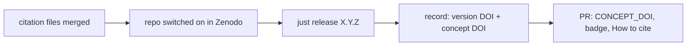

# MIP-0079: Citable releases, a Zenodo DOI per release, the umbrella first

| | |
|---|---|
| **Status** | Draft. Issue #682. `Tasks: docs/MIPs/MIP-0079.tasks.md` |
| **Author** | Claude, for M. Hoffmann |
| **Created** | 2026-10-06; revised 2026-10-07 (umbrella first, `.zenodo.json` as the source, `just release`) |
| **Phase** | None: publishing metadata, outside `docs/PHASES.md`'s sequence. No Phase 1 prerequisite, no paid resource |
| **Related** | MIP-0052 (the wave model the WW3 GPU Lab is groundwork for), MIP-0033 §5.6 (GitHub Releases for Release 0), MIP-0070 §5.4 (each repo's release contract), MIP-0075 (the data marola-oods would publish), #684 (citations both ways) |
| **Effort** | M: a validator and generator, a release script, two workflows and README sections in the umbrella; then the same files in three repos through the devkit; the rest is the maintainer's switch in Zenodo and his releases |
| **Gain** | `user value`: marola as a whole, and each code and data repo, can be cited by DOI, from GitHub's "Cite this repository", a README badge or the Zenodo record; `cost/ops`: $0, and each release gets an archive outside GitHub |
| **Effort vs Gain** | `cheap win`: the umbrella's part is one PR; it clears an item on the list of what awesome-open-climate-science wants before it lists marola |
| **Depends on** | No MIP. The maintainer signs in to Zenodo with GitHub, grants it access to the `marola-dev` org (only an org admin can), switches the repos on and cuts each release (an agent may not tag or release). marola-oods joins once MIP-0075 publishes data (§5.7) |
| **Blocked by** | none |
| **Risk** | A wrong field in a released record stays there forever: a DOI cannot be deleted, only superseded by the next release. `scripts/citation.py --check` runs before every tag for that reason |
| **Cost so far** | — |

## 1. Summary

Each GitHub release of the umbrella, and later of marola-app, marola-ml and marola-corpus, is
archived on Zenodo with its own DOI through Zenodo's GitHub integration. `.zenodo.json` is the one
hand-edited citation file per repo; `scripts/citation.py` validates it against Zenodo's own
vocabularies and generates `CITATION.cff` from it, so GitHub's "Cite this repository" and the
Zenodo record always agree. `just release X.Y.Z` cuts a release, `just contributor-add` adds a
person. The umbrella's record lists every repo as a part of it and the WW3 GPU Lab
(10.5281/zenodo.23221352) as related work, and once the DOIs exist each README carries the badge
and the "How to cite" section the WW3 GPU Lab uses.

## 2. Motivation

None of the repos can be cited today: no `CITATION.cff` or `.zenodo.json` in any of the seven
(checked 2026-10-06), no DOI, and a GitHub URL plus a commit is all a paper could point at. The
2026-10-05 assessment of marola for pangeo-data/awesome-open-climate-science named
"CITATION.cff + Zenodo DOI" as one of the things to have before applying. The maintainer's
h0ffmann/ww3-gpu went through the same steps on 2026-10-07 and has a working record (concept DOI
10.5281/zenodo.23221351, v0.1.0 10.5281/zenodo.23221352); this MIP follows its shape, and that
code base is the groundwork for running a spectral wave model inside marola (MIP-0052).

## 3. User-visible change

Before: no repo has a citation box or a DOI.

After the first archived release, on github.com/marola-dev/marola:

- The sidebar shows **Cite this repository**, with APA and BibTeX from `CITATION.cff`.
- The README's badge row opens with a DOI badge, the WW3 GPU Lab's style:

```markdown
[](https://doi.org/10.5281/zenodo.NNNNNNNN)
```

- A "How to cite" section (and "Como citar" in `README.pt-BR.md`) gives the concept DOI for the
  project as a whole, the release's own DOI for pinning the exact code, and the reference as
  BibTeX, APA and ABNT (NBR 6023).
- On zenodo.org, one record per release, with the description, both authors (ORCID and
  affiliation where known), keywords, licence, and under related works the six repos (`hasPart`),
  the GitHub repo (`isSupplementTo`), docs.marola.dev (`isDocumentedBy`) and the WW3 GPU Lab
  (`references`).

Before that release, the "How to cite" section already exists and points at the sidebar button.

## 4. Data sources and dependencies reviewed

### 4.1 Zenodo's GitHub integration

Zenodo is a free archive run by CERN and OpenAIRE. Once a repo is switched on in Zenodo's GitHub
settings, "new releases from the repository will be automatically ingested and archived". Zenodo's
OAuth app asks for `admin:repo_hook` (to install the webhook), `read:org`, `read:user` and
`user:email`, and has no access to private repos. For an org repo, the person switching it on
needs Admin on it, and Zenodo must be granted access to the org under the OAuth app's
"Organization access". A release created by Actions with `GITHUB_TOKEN` is archived: ww3-gpu's
v0.1.0 was published by `github-actions[bot]` and has its DOI. No API key, no billing.

### 4.2 Metadata: `.zenodo.json`, with `CITATION.cff` generated from it

Zenodo reads a subset of CITATION.cff and, if a `.zenodo.json` exists, uses **only** that.
`.zenodo.json` carries what CFF cannot: `related_identifiers` with Zenodo's relation vocabulary
(how the umbrella names its repos and the WW3 GPU Lab), `contributors` with a role, an HTML
description, `notes`, `communities` and `grants`. GitHub's "Cite this repository" reads only
`CITATION.cff`. Both are needed, so one is generated from the other: `.zenodo.json` is the source,
because it holds strictly more, and the CFF's fields (title, abstract, authors with ORCID and
affiliation, licence, keywords, repository, homepage, concept DOI) are all derivable from it.
This reverses the first draft's "CFF alone", which could not cite the other repos.

### 4.3 Zenodo's deposit vocabularies

developers.zenodo.org lists the allowed `relation` values (`hasPart`, `isPartOf`, `references`,
`isSupplementTo`, `isDocumentedBy`, …), contributor `type` values (`ProjectMember`,
`Researcher`, `Supervisor`, …), and the creator shape (`name` as "Family, Given", optional
`affiliation` and `orcid`). `scripts/citation.py` encodes these lists, so a typo fails CI instead
of failing the release on Zenodo.

### 4.4 Zenodo's deposit API (for data)

A personal token with `deposit:write` and `deposit:actions` can create a record and new versions
of it; `sandbox.zenodo.org` is a separate test instance with its own account and token. Not used
for code; one of the two paths for marola-oods (§5.7).

## 5. Design

### 5.1 Which repos

| Repo | Releases today | In scope | Zenodo type |
|---|---|---|---|
| marola (umbrella) | tag `v0.1.0`, no GitHub release | **first** (§5.3) | software |
| marola-app | `v0.1.0`, `release.yml` on each `v*` tag | yes (§5.6) | software |
| marola-ml | `v0.1.0`, made by hand | yes (§5.6) | software |
| marola-corpus | `v0.1.0`, `release.yml` on each `v*` tag | yes (§5.6) | dataset |
| marola-oods | none; data lands in B2 per MIP-0075 | later (§5.7) | dataset |
| marola-site | none: a deployed page, not a release | no; cited as a part of the umbrella | |
| marola-devkit | tags only, no GitHub releases | no; cited as a part of the umbrella | |

The umbrella goes first: one record that names every repo is the citation for "marola", and it
proves the tooling before it moves to the devkit.

### 5.2 The files, in the umbrella (#682's PR)

- `.zenodo.json`: title, `upload_type`, HTML description, creators, licence `mit`,
  `access_right: open`, `language: eng`, keywords, related identifiers, notes. No `version`,
  `publication_date` or `doi`: Zenodo takes the version from the tag, the date from the release,
  and mints the DOI.
- `CITATION.cff`: generated, with a header line saying so; valid against the CFF 1.2.0 schema.
- `scripts/citation.py`: validates (`--check` also fails on stale generated text), regenerates the
  CFF and the READMEs' BibTeX, APA and ABNT references (between `<!-- citation:start/end -->`),
  `add`s a person, and has a `--self-test`. It checks required fields, the relation and
  contributor-type vocabularies, "Family, Given" names, ORCID iDs with their ISO 7064 checksum, bare
  DOIs and https URLs, and that no Zenodo-owned field is set.
- `scripts/release.sh` (`just release X.Y.Z [--dry-run]`): refuses unless `main` is checked out,
  clean and level with `origin/main`, the tag is new `vMAJOR.MINOR.PATCH`, and
  `citation.py --check` and the pointer guard (§5.8) pass; then tags and pushes. `--dry-run` runs
  every check and tags nothing; it replaces a release candidate, since every archived release is a
  permanent DOI. `just releases` lists past tags.
- `.github/workflows/release.yml`: a `v*` tag reruns the citation check and the guard, then becomes
  a published release with generated notes.
- `.github/workflows/citation.yml`: on a change to either file or the script, `--check` and the
  CFF project's `cffconvert --validate`. `just quality` runs the check and both self-tests.
- README and README.pt-BR: a "How to cite" / "Como citar" section with the generated references.

### 5.3 Authors and contributors

Creators (cited authors) are **Hoffmann, Matheus** (ORCID 0009-0009-1056-7661, Escola Politécnica,
UFRJ; his chosen citation name, which ww3-gpu's record moves to too) and **Valério, Bruno** (full
name, ORCID and affiliation pending, §11). A later person is added with `just contributor-add
"Family, Given" [--orcid ID] [--affiliation TEXT] [--type ProjectMember]`, which lists them under
Zenodo's `contributors` with a role, or with `--author` as a cited creator (and so in the CFF). An
edit reaches Zenodo only with the next release, because Zenodo reads the tagged commit.

### 5.4 Citing the other repos and related work

The umbrella's `related_identifiers` name each of the six repos as `hasPart`, by GitHub URL
today. When a repo gets its own concept DOI (§5.6), its entry switches to that DOI, and the repo's
own `.zenodo.json` names the umbrella's concept DOI as `isPartOf`, so the link shows on both
records. The WW3 GPU Lab is `references` (10.5281/zenodo.23221352, the record the maintainer
named), with a sentence in `notes` saying why.

### 5.5 The DOIs and the badge

The first release published after the switch creates the record, with two identifiers:

- **Version DOI**: one per release, citing exactly that code.
- **Concept DOI**: one per repo, grouping every version and resolving to the latest. It goes in
  the badge, in `CITATION.cff` (`doi:` and an `identifiers` entry, via `CONCEPT_DOI` in
  `citation.py`) and first in the "How to cite" section.



The "How to cite" section then mirrors ww3-gpu's: the concept DOI for the project, the release's
DOI for the exact code, then BibTeX (`@software`, `publisher = {Zenodo}`, the concept `doi`),
APA and ABNT, in both READMEs; setting `CONCEPT_DOI` and running `just citation` rewrites the
references.

### 5.6 The code and data repos

After the umbrella's first record, `citation.py` and `release.sh` move to marola-devkit as tools
(`citation`, `release`) with the repo URL and homepage as arguments, and each of marola-app,
marola-ml and marola-corpus gets `.zenodo.json`, the generated CFF and `citation.yml` on the
devkit's pin. marola-app and marola-corpus keep their own `release.yml`, which already creates the
release; marola-ml, released by hand today, gets the umbrella's. Each repo's release docs gain one
sentence saying a published release is archived on Zenodo.

### 5.7 marola-oods, later

When MIP-0075's lake has data worth citing: either a GitHub release carrying the exports,
archived by the same integration, or an ETL step that uploads a new version through the deposit
API with a `ZENODO_DEPOSIT_TOKEN` secret, tested against `sandbox.zenodo.org` first. Either way a
dataset record with its own concept DOI, `isPartOf` the umbrella. Not a task until MIP-0075
publishes data.

### 5.8 Hard rule: a pointer move is not a release

The umbrella's `chore/pointer-sync` PR moves submodule pointers daily. A release made of nothing
but those would mint a Zenodo version whose archive differs from the last one only in gitlink
hashes, which cites nothing new. So **a submodule pointer move never makes a release or a Zenodo
version**: `scripts/release.sh --guard <ref>` diffs the ref against the previous `v*` tag
(`git diff --raw`, dropping mode-160000 lines) and refuses when nothing else changed. `just
release` runs it before tagging, and `release.yml` runs it again before publishing, so a tag
pushed by hand also gets no release and Zenodo sees nothing. A submodule's own changes reach
Zenodo through that repo's record (§5.6), not the umbrella's. The rule is in `AGENTS.md`
(Submodule mechanics) and the `zenodo-release` skill.

## 6. Scoring / safety impact

None.

## 7. Verification plan

- `python3 scripts/citation.py --self-test` and `scripts/release.sh --self-test` in `just
  quality`; `citation.py --check` in `just quality` and `citation.yml`; `cffconvert --validate`
  in `citation.yml`; the generated CFF validated against the CFF 1.2.0 JSON schema once by hand.
- `just release 0.2.0 --dry-run` on a clean, level main prints the tag and push.
- The guard's self-test, and on a scratch repo: a tag whose only change is a pointer is refused;
  a doc change, or the first tag, passes.
- The first release: a record with the description, both creators, the keywords, licence MIT and
  the related works as listed in §3, the tag as its version; both DOIs resolve.
- The badge PR: the badge renders and links to the record; GitHub's BibTeX shows the `doi`.
- Done: four records (umbrella, app, ml, corpus), each README with its badge and "How to cite",
  and the umbrella's `hasPart` entries on DOIs.

## 8. Risks, limitations, and honest caveats

- **A DOI is permanent.** A record can't be deleted, only superseded. Hence the check before the
  tag, and the dry run.
- **Edits wait for a release.** Zenodo reads `.zenodo.json` at the tagged commit; a new author or
  keyword shows only on the next release.
- **What is archived.** Zenodo stores the release's source archive; whether release assets (the
  ml-resources and corpus tarballs) are archived too was not checked. The umbrella's archive is
  docs and scripts, not the submodules' code, which their own records hold.
- **Pointer-only tags.** A tag pushed by hand that the guard refuses stays a bare tag with no
  release; delete it rather than leave it.
- **Not a peer review.** A DOI makes the work citable; it says nothing about its quality.

## 9. Alternatives considered

- **Do nothing.** A GitHub URL breaks when a repo moves and doesn't pin a version.
- **CITATION.cff alone** (the first draft). Zenodo would read it, but it has no way to say
  `hasPart` or `references` with Zenodo's relations, or give a contributor a role.
- **Both files kept by hand.** ww3-gpu does this, with a rule to keep them saying the same thing;
  generating one from the other makes that rule a check.
- **The devkit first.** A tool, a tag and a pin bump before one record exists; the umbrella proves
  the shape first.
- **Software Heritage alone.** It archives code but gives no DOI; Zenodo deposits there anyway.

## 11. Open questions

- **Bruno Valério's citation name** ("Family, Given" as he publishes), ORCID and affiliation.
- **The umbrella's first release number**: `v0.2.0` (the tag `v0.1.0` exists, from 2026-10-01,
  with no GitHub release). Default: `v0.2.0`.
- **A Zenodo community** (`marola`) to group the records: `.zenodo.json` can now carry it.
  Default: no.
- **Follow-up:** a "Como citar" line on marola.dev's about page once the DOIs exist, through the
  site's own frontend skills; #684 covers citing the work marola builds on.

## Appendix

### Checked live

- https://help.zenodo.org/docs/github/enable-repository/ (2026-10-06): steps (GitHub menu, Sync
  now, toggle); "new releases from the repository will be automatically ingested and archived".
- https://help.zenodo.org/docs/github/describe-software/ and `/citation-file/`, `/zenodo-json/`
  (2026-10-06): `.zenodo.json` wins when both exist; CFF subset fields; `grants` and `communities`
  only in `.zenodo.json`; GitHub uses CFF for citation suggestions.
- https://support.zenodo.org/help/en-gb/24-github-integration/51-… (2026-10-06): org repos need
  Admin and the OAuth app's org access, then Sync now.
- https://support.zenodo.org/help/en-gb/24-github-integration/127-… (2026-10-06): scopes
  `read:user`, `user:email`, `admin:repo_hook`, `read:org`; no private repos.
- https://support.zenodo.org/help/en-gb/1-upload-deposit/97-what-is-doi-versioning (2026-10-06):
  a DOI per version and one "representing all of the versions".
- https://developers.zenodo.org/ (2026-10-06, 2026-10-07): sandbox; `deposit:write` +
  `deposit:actions`; the relation and contributor-type vocabularies and the creator fields in §4.3.
- https://docs.github.com/…/about-citation-files (2026-10-06): root `CITATION.cff`, "Cite this
  repository", APA and BibTeX.
- h0ffmann/ww3-gpu at `fee29ba` (2026-10-07): `.zenodo.json` + `CITATION.cff`, `release.yml`,
  `scripts/release.sh`, `citation.yml` (cffconvert action 2.0.0), the README badge and "How to
  cite"; concept DOI 10.5281/zenodo.23221351, v0.1.0 10.5281/zenodo.23221352.
- api.github.com/repos/h0ffmann/ww3-gpu/releases (2026-10-07): v0.1.0 published by
  `github-actions[bot]`, not draft, not prerelease.
- The umbrella's generated `CITATION.cff` against the CFF 1.2.0 schema
  (citation-file-format/citation-file-format@1.2.0 `schema.json`, 2026-10-07): valid, with and
  without a `doi`.
- GitHub API (2026-10-06): releases: marola-app, marola-ml, marola-corpus `v0.1.0` each;
  marola-devkit none; the umbrella has tag `v0.1.0` and no release. All seven MIT.
- zenodo.org and doi.org from this sandbox: refused by the egress proxy.

### Not checked

- That the concept DOI resolves to the latest version (Zenodo's page says it represents all
  versions).
- The badge URL, fetched directly; it is the one ww3-gpu's README uses.
- Whether release assets are archived, and how Zenodo shows `hasPart` entries given by URL.
- `cffconvert` in nixpkgs (CI uses the action instead).
