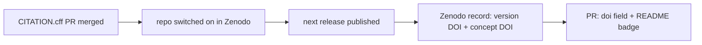

# MIP-0079: Citable releases, a Zenodo DOI per release and a CITATION.cff per repo

| | |
|---|---|
| **Status** | Draft. Issue #682. `Tasks: docs/MIPs/MIP-0079.tasks.md` |
| **Author** | Claude, for M. Hoffmann |
| **Created** | 2026-10-06 |
| **Phase** | None: publishing metadata, outside `docs/PHASES.md`'s sequence. No Phase 1 prerequisite, no paid resource |
| **Related** | MIP-0033 §5.6 (GitHub Releases for Release 0), MIP-0070 §5.4 (each repo's release contract), MIP-0075 (the data marola-oods would publish), MIP-0052 (cites a Zenodo-archived code base as its model) |
| **Effort** | S: one `CITATION.cff` and a README section in three repos, then one line and a badge each once the DOI exists; the rest is a human's switch in Zenodo |
| **Gain** | `user value`: a researcher can cite marola-app, marola-ml and marola-corpus by DOI, from GitHub's "Cite this repository" or the README badge; `cost/ops`: $0, and each release gets an independent archive outside GitHub |
| **Effort vs Gain** | `cheap win`: three small PRs and a few minutes of the maintainer's time; it also clears an item on the list of what awesome-open-climate-science wants before it lists marola |
| **Depends on** | No MIP. The maintainer signs in to Zenodo with GitHub and grants it access to the `marola-dev` org (only an org admin can), and cuts the next release in each repo (an agent may not tag or release). marola-oods joins once MIP-0075 publishes data (§5.6) |
| **Blocked by** | none |
| **Risk** | The release workflows create releases with `GITHUB_TOKEN`; if Zenodo's webhook did not fire for those, marola-app and marola-corpus would need a hand-made release instead (§8, checked on the first release) |
| **Cost so far** | — |

## 1. Summary

Each GitHub release of marola-app, marola-ml and marola-corpus is archived on Zenodo with its own
DOI, through Zenodo's GitHub integration. Each of those repos carries a `CITATION.cff`, which
GitHub turns into a "Cite this repository" box and Zenodo reads as the release's metadata. The
READMEs carry a DOI badge pointing at the concept DOI, the one identifier that always means "this
project, every version". marola-oods follows when it has a dataset to publish.

## 2. Motivation

None of the repos can be cited today: no `CITATION.cff` in any of the seven (checked
2026-10-06), no DOI, and a GitHub URL plus a commit is all a paper could point at. The
2026-10-05 assessment of marola for pangeo-data/awesome-open-climate-science named
"CITATION.cff + Zenodo DOI" as one of the things to have before applying. marola-app, marola-ml
and marola-corpus each already have a `v0.1.0` release, so the archive starts with the next one.

## 3. User-visible change

Before: a repo's sidebar has no citation box; the README has no DOI.

After, on github.com/marola-dev/marola-app:

- The sidebar shows **Cite this repository**, with APA and BibTeX generated from `CITATION.cff`.
- The README shows a DOI badge next to the existing ones, linking to the Zenodo record.
- A "Citing" section in the README:

```markdown
## Citing

Cite marola-app by its concept DOI, [10.5281/zenodo.NNNNNNN](https://doi.org/10.5281/zenodo.NNNNNNN),
which always resolves to the latest release; each release's own DOI is on its Zenodo page.
GitHub's "Cite this repository" gives the same reference as APA or BibTeX.
```

On zenodo.org: one record per release (`v0.1.1`, `v0.2.0`, …), each with the source archive,
its version DOI, and a link to the concept DOI that groups them.

## 4. Data sources and dependencies reviewed

### 4.1 Zenodo's GitHub integration

Zenodo is a free archive run by CERN and OpenAIRE. Once a repo is switched on in Zenodo's GitHub
settings, "new releases from the repository will be automatically ingested and archived". Zenodo's
OAuth app asks for `admin:repo_hook` (to install the webhook), `read:org`, `read:user` and
`user:email`, and has no access to private repos. For an org repo, the person switching it on
needs Admin on the repo, and Zenodo must be granted access to the org under the OAuth app's
"Organization access". No API key, no billing. Pick: this, for every repo that releases.

### 4.2 Metadata: `CITATION.cff` or `.zenodo.json`

Zenodo reads a subset of CITATION.cff (title, version, license, type, abstract, authors with
ORCID, keywords) and, if a `.zenodo.json` exists, uses **only** that and ignores
`CITATION.cff`. `.zenodo.json` adds what CFF lacks: `grants` (funding) and `communities`. GitHub
renders "Cite this repository" from a root `CITATION.cff` only. Pick: `CITATION.cff` alone. One
file serves both GitHub and Zenodo, so the two cannot drift; marola has no grant to declare, and
a Zenodo community is an open question (§11), not a reason for a second file now.

### 4.3 Zenodo's deposit API (for data)

A personal token with `deposit:write` and `deposit:actions` can create a record and a new version
of it from a script; `sandbox.zenodo.org` is a separate test instance with its own account and
token. Not used for the three code repos; it is one of the two paths in §5.6 for marola-oods.

## 5. Design

### 5.1 Which repos

| Repo | Releases today | In scope | Zenodo type |
|---|---|---|---|
| marola-app | `v0.1.0`, `release.yml` on each `v*` tag | yes | software |
| marola-ml | `v0.1.0`, made by hand | yes | software |
| marola-corpus | `v0.1.0`, `release.yml` on each `v*` tag | yes | dataset |
| marola-oods | none; data lands in B2 per MIP-0075 | later, §5.6 | dataset |
| marola-site | none: a deployed page, not a release | no | |
| marola-devkit | tags only, no GitHub releases | no: internal tooling nobody cites | |
| marola (umbrella) | none: docs and pointers | no; its README lists the DOIs (§5.5) | |

A release-less repo gains nothing: Zenodo archives releases, not commits.

### 5.2 `CITATION.cff`

At each in-scope repo's root, CFF 1.2.0. marola-app's:

```yaml
cff-version: 1.2.0
message: "If you use marola-app, please cite it using the metadata below."
title: "marola-app: the best hour to swim at a nearby beach, from open data"
type: software
authors:
  - family-names: Hoffmann
    given-names: Matheus
license: MIT
repository-code: "https://github.com/marola-dev/marola-app"
url: "https://marola.dev"
abstract: >-
  A Scala 3 pipeline that ranks nearby beaches by the hour from OpenStreetMap, Open-Meteo and
  official bathing-water reports, with a deterministic safety veto and a reviewed LLM summary,
  runnable locally with a free Ollama model.
keywords: [ocean, beaches, bathing water quality, Brazil, open data]
```

No `version` or `date-released`: they would go stale between releases, and Zenodo takes the
version from the release tag (§11 checks that). marola-corpus uses `type: dataset`. The author
list and ORCID are the maintainer's call (§11).

### 5.3 The switch (a human)

1. Sign in at zenodo.org with GitHub.
2. In GitHub's Authorized OAuth Apps, give Zenodo access to `marola-dev` (org owner).
3. Zenodo → GitHub → **Sync now**, then switch on marola-app, marola-ml and marola-corpus.

### 5.4 The first archived release and the DOIs

The first release published after the switch creates the Zenodo record. From then on:

- **Version DOI**: one per release, citing exactly that code.
- **Concept DOI**: one per repo, created with the first record, grouping every version and
  resolving to the latest. It goes in the README badge and in `CITATION.cff`'s `doi:` field, so
  "Cite this repository" stays right across releases without an edit per release.

Because the concept DOI does not exist until that first release, the order is fixed:



The badge's Markdown is copied from the repo's row on Zenodo's GitHub page, which offers it.

### 5.5 Docs

Each repo's release docs (marola-app's `docs/3-development.md` §Releases, marola-corpus's
§Releasing and AGENTS.md "Cutting a release", marola-ml's `docs/3-development.md`) gain one
sentence: a published release is archived on Zenodo, and its version DOI appears there within
minutes. The umbrella's README gets a "Citing marola" line listing the three concept DOIs once
they exist.

### 5.6 marola-oods, later

When MIP-0075's lake has data worth citing, one of two paths, decided then:

- A GitHub release in marola-oods carrying the exports, archived by the same integration.
- A step in the ETL workflow that uploads a new version through the deposit API with a token
  secret (`ZENODO_DEPOSIT_TOKEN`), tested against `sandbox.zenodo.org` first.

Either way the record is a dataset with its own concept DOI. It is not a task here until MIP-0075
publishes data.

## 6. Scoring / safety impact

None.

## 7. Verification plan

- Each `CITATION.cff` PR: the file renders on the PR's branch with "Cite this repository" and no
  parse warning; `cffconvert --validate` locally, if the maintainer wants a second check.
- The first release after the switch: a Zenodo record appears with the CFF's title, authors,
  licence and the tag as its version; the concept DOI resolves.
- The DOI PR: the badge renders and links to the record; GitHub's BibTeX shows the `doi`.
- Done: three repos with a concept DOI in `CITATION.cff` and README, and the umbrella README
  listing them.

## 8. Risks, limitations, and honest caveats

- **Releases made by Actions.** marola-app's and marola-corpus's `release.yml` create the release
  with `GITHUB_TOKEN`. GitHub stops such events from starting new workflow runs; whether repository
  webhooks still fire was not checked. If the first release produces no Zenodo record, the
  fallback is a release created by hand from the tag, and `release.yml` uploads its asset to it
  (it already handles an existing release).
- **What is archived.** Zenodo stores the release's source archive; whether release assets (the
  ml-resources and corpus tarballs) are archived too was not checked. For the corpus the source
  archive already holds `knowledge/`, so nothing is lost.
- **A DOI is permanent.** A record can't be deleted after publication, only superseded. A
  release with a wrong CITATION.cff stays on Zenodo with that metadata; the next release fixes it.
- **Not a peer review.** A DOI makes the code citable; it says nothing about quality.

## 9. Alternatives considered

- **Do nothing.** Citing a GitHub URL breaks when a repo moves and doesn't pin a version.
- **`.zenodo.json` as well.** Two metadata files that must agree, and Zenodo would ignore the
  CFF; worth it only for a community or a grant (§11).
- **A CI gate validating `CITATION.cff`.** A devkit tool, a release and a pin bump in three repos
  to check a file that changes once per repo. GitHub flags a broken file on its page; revisit if
  a release ever fails on metadata.
- **Software Heritage alone.** It archives code but gives no DOI; Zenodo already deposits
  software in it.
- **One DOI for the whole org.** Zenodo works per repo, and the repos release independently.

## 11. Open questions

- **Authors.** Matheus Hoffmann alone, or also Bruno Valério and @aracyla (or "marola
  contributors")? An ORCID for each, if they have one.
- **A Zenodo community** (`marola`) to group the records: needs `.zenodo.json`, which then
  carries all the metadata. Default: no.
- **The next release in each repo** (a human's act): `v0.1.1`, or wait for a release with real
  changes? Default: the next real one.
- Whether Zenodo takes the version from the tag when the CFF has none (§5.2), checked on the
  first release.
- **Follow-up:** a "Como citar" line on marola.dev's about page once the DOIs exist, through the
  site's own frontend skills.

## Appendix

### Checked live

- https://help.zenodo.org/docs/github/enable-repository/ (2026-10-06): steps (GitHub menu, Sync
  now, toggle); "new releases from the repository will be automatically ingested and archived".
- https://help.zenodo.org/docs/github/describe-software/ and `/citation-file/`, `/zenodo-json/`
  (2026-10-06): `.zenodo.json` wins when both exist; CFF subset fields; `grants` and `communities`
  only in `.zenodo.json`; GitHub uses CFF for citation suggestions.
- https://support.zenodo.org/help/en-gb/24-github-integration/51-… (2026-10-06): org repos need
  Admin and the OAuth app's org access, then Sync now.
- https://support.zenodo.org/help/en-gb/24-github-integration/127-… (2026-10-06): scopes
  `read:user`, `user:email`, `admin:repo_hook`, `read:org`; no private repos.
- https://support.zenodo.org/help/en-gb/1-upload-deposit/97-what-is-doi-versioning (2026-10-06):
  a DOI per version and one "representing all of the versions".
- https://developers.zenodo.org/ (2026-10-06): sandbox with separate account and token;
  `deposit:write` + `deposit:actions`; new-version action.
- https://docs.github.com/…/about-citation-files (2026-10-06): root `CITATION.cff`, "Cite this
  repository", APA and BibTeX.
- https://lasp-developer-guide.readthedocs.io/…/citing_software.html (2026-10-06): Zenodo's GitHub
  page offers the badge Markdown per repo.
- GitHub API (2026-10-06): releases: marola-app, marola-ml, marola-corpus `v0.1.0` each;
  marola-devkit none. No `CITATION.cff` or `.zenodo.json` in the seven repos; all MIT.
- zenodo.org and doi.org from this sandbox: refused by the egress proxy; the API record of
  MIP-0052's Zenodo reference could not be read (robots.txt).

### Not checked

- That the concept DOI resolves to the latest version (Zenodo's page says it represents all
  versions; inbo's checklist docs say a DOI "always points at the latest release").
- Whether pre-releases and Actions-created releases are archived, and whether release assets are.
- The badge URL shape (taken from Zenodo's page when the DOI exists, not written by hand).
- How Zenodo maps CFF `type: dataset`, and the version when the CFF has none.
- `cffconvert` in nixpkgs.
