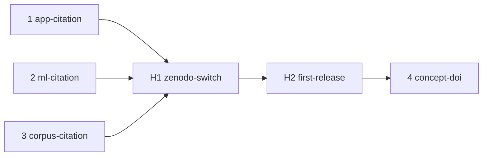

# MIP-0079 tasks

Ordered delivery of [MIP-0079](./MIP-0079-zenodo-dois-and-citation.md). Tasks 1–3 are one PR each
in their own repo and can land in any order; H1 and H2 are the maintainer's, not PRs; task 4 is
one PR per repo once that repo's first Zenodo record exists. marola-oods (§5.6) gets a row when
MIP-0075 publishes data.

| # | slug | delivers | tests (must exist before the PR) | depends on |
|---|---|---|---|---|
| 1 | app-citation | **marola-app**: `CITATION.cff` (§5.2), a README "Citing" section without the DOI yet, one sentence in `docs/3-development.md` §Releases | the PR branch's file view shows "Cite this repository" with no parse warning | – |
| 2 | ml-citation | **marola-ml**: the same, `type: software`, the sentence in `docs/3-development.md` | as 1 | – |
| 3 | corpus-citation | **marola-corpus**: the same with `type: dataset`, the sentence in `docs/3-development.md` §Releasing and AGENTS.md "Cutting a release" | as 1 | – |
| H1 | zenodo-switch | the maintainer: sign in to Zenodo with GitHub, grant it `marola-dev` org access, Sync now, switch on the three repos (§5.3) | the three repos show as enabled on Zenodo's GitHub page | 1, 2, 3 |
| H2 | first-release | the maintainer: the next `v*` release in each repo | a Zenodo record per repo with the CFF's metadata and the tag as version; if none appears for an Actions-made release, the §8 fallback | H1 |
| 4 | concept-doi | each repo: `doi:` (the concept DOI) in `CITATION.cff`, the badge from Zenodo's page in the README, the DOI in the "Citing" section; then the umbrella README's "Citing marola" line and this MIP's status | the badge links to the record; GitHub's BibTeX carries the `doi` | H2 |

