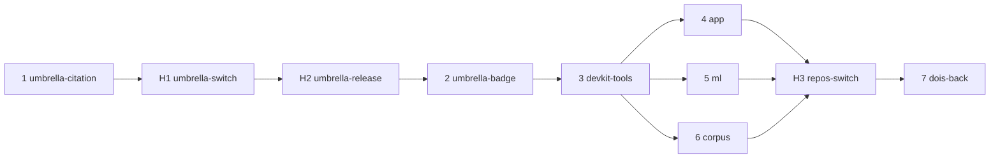

# MIP-0079 tasks

Ordered delivery of [MIP-0079](./MIP-0079-zenodo-dois-and-citation.md). The umbrella goes first
(1, H1, H2, 2); its tooling then moves to the devkit (3) and to the code and data repos (4–6).
H rows are the maintainer's, not PRs. marola-oods (§5.7) gets a row when MIP-0075 publishes data.

| # | slug | delivers | tests (must exist before the PR) | depends on |
|---|---|---|---|---|
| 1 | umbrella-citation | **marola**: `.zenodo.json`, the generated `CITATION.cff`, `scripts/citation.py`, `scripts/release.sh` (`just release`, `releases`, `citation`, `contributor-add`), `release.yml`, `citation.yml`, "How to cite" in both READMEs: #696 | `citation.py --self-test`, `--check`; `release.sh --self-test`; `cffconvert --validate` in `citation.yml` | – |
| H1 | umbrella-switch | the maintainer: sign in to Zenodo with GitHub, grant it `marola-dev` org access, Sync now, switch on `marola-dev/marola` (§4.1) | the repo shows as enabled on Zenodo's GitHub page | 1 |
| H2 | umbrella-release | the maintainer: `just release 0.2.0` on a clean main | a record with the §3 metadata and both DOIs | H1 |
| 2 | umbrella-badge | **marola**: `CONCEPT_DOI` in `citation.py`, the DOI badge first in the README's badge row, "How to cite" with concept and version DOIs, BibTeX, APA and ABNT in both READMEs | `citation.py --check`; the badge links to the record | H2 |
| 3 | devkit-tools | **marola-devkit**: `citation` and `release` tools (repo URL and homepage as arguments), recipes in `devkit.just`, a reusable `citation.yml`, a tag | each tool's `--self-test` | 2 |
| 4 | app-citation | **marola-app**: `.zenodo.json` (`isPartOf` the umbrella's concept DOI), generated CFF, `citation.yml` on the devkit pin; one sentence in `docs/3-development.md` §Releases | `citation --check` in its quality gate | 3 |
| 5 | ml-citation | **marola-ml**: the same, plus the umbrella's `release.yml` (released by hand today) | as 4 | 3 |
| 6 | corpus-citation | **marola-corpus**: the same with `upload_type: dataset`; the sentence in `docs/3-development.md` §Releasing and AGENTS.md "Cutting a release" | as 4 | 3 |
| H3 | repos-switch | the maintainer: switch on and release marola-app, marola-ml and marola-corpus | a record per repo | 4, 5, 6 |
| 7 | dois-back | each repo: badge and "How to cite" as in 2; **marola**: its `hasPart` entries move from URLs to the repos' concept DOIs | `citation --check` in each repo | H3 |

