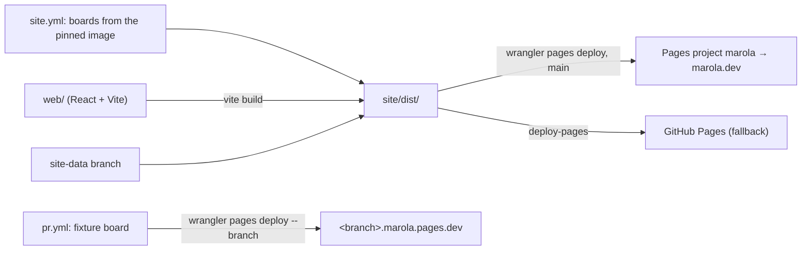

# MIP-0080: marola-site in React on Vite, served from Cloudflare Pages

| | |
|---|---|
| **Status** | Draft |
| **Author** | Claude, from the maintainer's requests of 2026-10-07 (a React rewrite of the site; then Cloudflare Pages and Vite + React as the stack) |
| **Created** | 2026-10-07 |
| **Phase** | 3 (`docs/PHASES.md`: the site is Phase 3's first deploy artefact). Phase 1 (the Telegram bot) is not done, and this MIP does nothing for it |
| **Related** | MIP-0005 (the map and static site), MIP-0009 (the `site_check.js` harness), MIP-0054 (i18n), MIP-0078 (marola-site's move to a Cloudflare Worker; cited in marola-site but has no document, §11), MIP-0035 (the map plugin API, Draft) |
| **Effort** | L: the page is rewritten (≈1,500 lines of `app.js`, `ui.js`, `flow.js`, `chat.js` and three HTML pages), the 1,114-line `site_check.js` harness is replaced by a Vitest suite, and `site.yml` gains a Node build and swaps the Worker deploy for a Pages deploy. The hosting swap alone is S (§5.1) |
| **Gain** | `infra/dev-loop`: components and a module graph in place of one 818-line `app.js` that builds DOM from strings, tests that render components instead of stubbing a DOM by hand, a dev server with hot reload, and a preview URL per PR on Pages. `user value`: none directly; visitors should see the same page |
| **Effort vs Gain** | `cheap win` for the hosting swap (task 1), which stands alone. `expensive, defer` for the rewrite: its whole gain is maintainability, so do it when the page next grows a surface plain JS carries badly (MIP-0035's plugin layers, FUTURE-WORK §1's per-activity views) |
| **Depends on** | Nothing has to merge first. It replaces MIP-0078's Worker as marola.dev's host and keeps its GitHub Pages fallback. A person creates the Pages project, widens the Cloudflare API token, and moves the `marola.dev` custom domain from the Worker to Pages (§5.1). All of it is free, so no paid-resource gate applies, but `AGENTS.md` keeps deploys a human's act. The rewrite touches the same files as any open marola-site visible change, so it should not run beside one. No Phase 1 gate, since this is not a cloud backend |
| **Blocked by** | none |
| **Risk** | A rewrite that ships a page which looks the same but quietly drops a behaviour `site_check.js` covers today (a score band, a no-data state, the 404 forwarder, the CSP), on a public-safety page |
| **Cost so far** | — |

## 1. Summary

Serve marola.dev from a Cloudflare Pages project, deployed by `site.yml` with Direct Upload, in
place of today's Worker. Then rebuild the page as a React 19 app built by Vite into the same static
`site/dist/`. The page stays static: no server, no Pages Functions, no LLM, boards precomputed
every 3 h. It also keeps `script-src 'self'`, because a Vite build emits no inline script (§4.2).
Pages serves static requests free and unlimited, finds `404.html` by itself, and gives each branch
a preview URL. The hosting swap is a small change that ships on its own first. The rewrite follows
when it is worth its cost.

## 2. Motivation

marola-site's own `AGENTS.md` says "Plain JavaScript, no framework and no build step", and its
`docs/2-libraries.md` says `just site-build` "does not bundle or transpile anything". That was the
right call for MIP-0005's single Leaflet page. The page has grown well beyond it:

- `site/static/app.js` is 818 lines (47 KB). From one file it fetches `areas.json` and the boards,
  builds the map, the markers, the list, the card, the hour slider and the four GIBS raster layers.
  The UI is HTML strings plus a hand-written `icon(name)` inliner.
- `scripts/site_check.js` (1,114 lines) tests that file by running it in a `vm` with a hand-built
  stub DOM and a stub `mapboxgl`. Each new DOM API the page uses means more stub.
- Each visible change needs before and after screenshots at two sizes (marola-site `AGENTS.md`),
  taken locally. A reviewer can't open the change itself, because nothing deploys a branch.

## 3. User-visible change

None intended. The same three pages and `404.html`, the same pt-BR and English copy, the same map,
layers, bands and emergency panel.

Two differences are measurable:

- **URLs.** Pages redirects `/about.html` to `/about` (§4.1). Old links keep working through the
  redirect, and the page's own links move to the extension-less form.
- **JavaScript.** The page's own scripts total about 102 KB unminified today, next to the 1.8 MB
  vendored Mapbox GL CSP build. React 19 plus react-dom adds about 219 KB minified before gzip
  (§4.2's empty build).

The parity checklist in §7 is the acceptance test.

## 4. Data sources and dependencies reviewed

### 4.1 Hosting: Cloudflare Pages, Direct Upload

- **Cost.** "On both free and paid plans, requests to static assets are free and unlimited". A
  request is static when it invokes no Function, and this site has none (Pages Functions pricing,
  2026-10-07).
- **Free plan limits.** 20,000 files per site, 25 MiB per file, 500 builds a month with one at a
  time, and 100 custom domains per project (Pages limits, 2026-10-07). The site is three areas'
  boards, the panels from the 17-file `site-data` branch, and a 1.8 MB Mapbox build: far below
  every limit. Whether a Direct Upload counts toward the 500 builds was not checked. The schedule
  plus pushes is under 300 a month either way.
- **Deploy.** `cloudflare/wrangler-action@v4` runs `pages deploy <dir> --project-name=<name>`, with
  secrets `CLOUDFLARE_API_TOKEN` (Account → Cloudflare Pages → Edit) and `CLOUDFLARE_ACCOUNT_ID`.
  The same action and both secrets already exist in `site.yml`, but today's token is scoped to "Edit
  Cloudflare Workers" (Direct Upload with CI guide, 2026-10-07).
- **Serving.** A top-level `404.html` is served for a missing file, found by walking up the
  directory tree. Without one, Pages switches to single-page mode and every path serves `/`, so
  `404.html` must ship. `/contact.html` redirects to `/contact`. Assets stay cached on the CDN until
  the next deploy, and an `Etag`/`304` pair is sent to browsers (Serving Pages, 2026-10-07).
- **Headers.** `_headers` allows 100 rules, each line up to 2,000 characters. It applies to static
  responses but not to Functions. The docs don't say outright that it covers HTML responses (Headers,
  2026-10-07).
- **Previews.** Each branch gets a hashed `<hash>.<project>.pages.dev` URL and a
  `<branch>.<project>.pages.dev` alias. Previews are public by default, and Cloudflare Access can
  restrict them. The page describes previews for Git-connected projects only, and doesn't say
  whether a Direct Upload with `--branch` makes one (Preview deployments, 2026-10-07).
- **Why not Git integration.** A board build needs the pinned app image (Docker) and the Brazil
  proxy over Tailscale (marola-site `docs/3-development.md`). Pages' own builder has neither, so
  `site.yml` keeps building in GitHub Actions and uploads the result.

Today's host, the Worker `marola` (static assets, `wrangler.jsonc`, live since 2026-10-07), would
serve a Vite build just as well. Cloudflare publishes a migration guide from Pages to Workers, not
the reverse, and says "Workers has a distinctly broader set of features". This MIP still picks
Pages because this site uses none of those features. In exchange it gets automatic `404.html` and
`index.html` handling with no config file, and branch previews built into the product. Workers can
do previews too, but only with `preview_urls` and Workers Builds set up (migration guide,
2026-10-07). §9 keeps the Worker as the alternative.

### 4.2 Framework: Vite 8 + React 19

An empty React app was built with Vite in a scratch directory on 2026-10-07 (npm `latest`: vite
8.3.3, react and react-dom 19.3.0, @vitejs/plugin-react 6.1.2). Its `dist/index.html` has one
`<script type="module" crossorigin src="/assets/index-<hash>.js">` and no inline script, so
`default-src 'self'` holds unchanged. The bundle is 219,465 B minified, mostly react-dom. Its
filenames are content-hashed, which replaces `site.yml`'s `?v=<sha>` cache-bust step.

For the map, `react-map-gl` 8.1.3 has a `./mapbox` entry point and lists `mapbox-gl >=1.13.0` as a
peer dependency (npm registry, 2026-10-07). Whether it takes the vendored CSP build and
`workerUrl` without a `blob:` worker was not checked (§11).

## 5. Design

All changes are in marola-site. The umbrella only gets this MIP.

### 5.1 Task 1: the hosting swap (ships first, on today's plain-JS page)

The human steps, none of them by an agent:

- create the Pages project `marola` (Direct Upload);
- widen `CLOUDFLARE_API_TOKEN` to Pages → Edit, or replace it;
- after the first green Pages deploy, move the `marola.dev` custom domain from the Worker to the
  project.

`site.yml`'s step becomes `command: pages deploy site/dist --project-name=marola --branch=main`,
still `continue-on-error`, with GitHub Pages as the fallback. `wrangler.jsonc` and the `CNAME`
step's Worker comment go away, and `site_live_check.py` runs against marola.dev after the domain
moves. The page's internal links to `about.html` and `support.html` become `/about` and `/support`.
`docs/3-development.md`, `AGENTS.md`'s cost section and the umbrella's `docs/PHASES.md` name Pages.
Removing the Worker is a final human step, once Pages has served for a week.

### 5.2 Tasks 2 onward: the rewrite

- **Layout.** `web/` holds `index.html`, `about.html`, `support.html` and `404.html` as Vite
  multi-page inputs (`build.rollupOptions.input`), plus `src/`. The source can be TypeScript or JSX
  (§11). Files under `web/public/` are copied as-is: `vendor/` (Mapbox GL CSP build and worker,
  Inter, waves.mp3, licences), `favicon.svg`, `img/` and `_headers`. `site/static/` is deleted in
  the last task.
- **Components** split `app.js` along its existing seams: `MapView` (Mapbox, markers, raster
  layers), `FlowLayer` (`flow.js`'s WebGL custom layer, ported nearly verbatim behind a ref),
  `BeachList`, `BeachCard`, `HourSlider`, `LayerRail`, `EmergencyPanel`, `ChatWidget`. The band
  logic (`colour()`/`band()`, five bands) moves to a pure `bands.ts` with no React import and keeps
  its CSS classes. Anything that decides what a visitor reads about safety stays a pure function.
- **Map.** Use `react-map-gl/mapbox` with `mapLib` pointed at the vendored CSP build and
  `workerUrl` at `vendor/mapbox-gl-csp-worker.js`. If §11's check fails, fall back to a ~50-line
  `useMapbox` hook over the same vendored build. That hook is what `app.js` does today.
- **i18n.** `site/i18n/*.json` stays the source of truth (MIP-0054). `i18n_bundle.py` keeps its
  checks, and a `useT()` hook imports the catalogs. The generated `i18n.js` goes away.
- **Config.** `mapbox-config.js` stays a separate, unbundled file that `scripts/mapbox_config.sh`
  writes at deploy. The token never enters the bundle, so `vite build` needs no secret.
- **Headers and CSP.** `_headers` sets `Cache-Control: public, max-age=31536000, immutable` on
  `/assets/*`, which is safe because the names are content-hashed. The CSP stays in each page's
  `<meta>` tag, as today. Moving it to `_headers` waits on §11's HTML check. A build check fails if
  any emitted HTML holds an inline `<script>` or a `style=` attribute.
- **`site.yml`.** It adds `actions/setup-node`, `npm ci` and `npm run build` (writing `site/dist/`)
  before the existing copy of boards and panels. The `?v=<sha>` stamp is dropped, and the publish
  allowlist gains `assets/` and `_headers`.
- **PR previews.** A `pr.yml` job builds the page against `site/fixtures/board.json`. That needs
  no image and no proxy, so a fork PR is never handed a secret: the job runs only for same-repo
  branches. It uploads with `--branch=<branch>`, and the PR body links `<branch>.marola.pages.dev`
  beside its screenshots.
- **Rules that change.** marola-site's `AGENTS.md` Code style ("no framework and no build step")
  and `docs/2-libraries.md` are rewritten in the same PR that lands the build. `flake.nix` already
  provides node.

Nothing goes through an LLM, and the page still renders only what the boards hold.

## 6. Scoring / safety impact

None to scoring: `Swimability` is in marola-app, and the page only renders the board. The page's
own safety-relevant logic is the band thresholds (no data, unfit or `score <= 0`, 1–39, 40–69,
≥70), the `unfit` veto display, the water-quality drop colours and the emergency numbers. It moves
unchanged into pure functions, and each one keeps a unit test (§7). A preview URL shows fixture
data, so it gets a banner saying so and is never linked as the map.

## 7. Verification plan

- **Task 1.**
  - Check the first Pages deploy at `marola.pages.dev`: `curl -sI` on `/`, `/about`, `/about.html`
    (expect a redirect), `/docs/x` (expect `404.html` and its forwarder), `/data/areas.json` and
    `/vendor/mapbox-gl-csp-worker.js`.
  - After the domain moves, run `just site-live-check` and Playwright on all three pages with no
    CSP violations in the console.
  - `site-health.yml` stays green for a week before the Worker is removed.
- **Unit (Vitest)**: `bands.test.ts` (each band edge: `null`, `0`, `1`, `39`, `40`, `69`, `70`,
  `unfit:true` with a high score), `waterDot.test.ts`, `i18n.test.ts` (every key resolves in both
  locales).
- **Component (Vitest + Testing Library, jsdom, `mapbox-gl` mocked)**: port each assertion in
  `site_check.js` to a named test. Run it against `site/fixtures/board.json` and the frozen
  `board-schema1.json`, and against the board schema from the image (`BOARD_SCHEMA`, as today).
  `site_check.js` is deleted only once every assertion has a counterpart, with a mapping table in
  the PR body.
- **Build checks**: no inline `<script>` or `style=` in `site/dist/*.html`; the allowlist still
  passes; `redirect_check.js` still passes against the built `404.html`.
- **Rewrite done**:
  - marola.dev serves the Vite build from Pages.
  - Before and after screenshots at 1280 × 800 and 390 × 844 match on all three pages.
  - The PR's preview URL opened.
  - No CSP violation, and `site-health.yml` stays green for a week.

## 8. Risks, limitations, and honest caveats

- **Parity drift.** A rewrite reproduces what its author noticed. The mitigation is §7's
  assertion-by-assertion port of `site_check.js` before deleting it.
- **Domain cutover.** Moving `marola.dev` between the Worker and Pages leaves a short window where
  the domain may not resolve. Do it at a quiet hour, and keep the Worker until Pages has served for
  a week.
- **Previews are public** by default and show fixture data. They need the banner, and optionally
  Cloudflare Access.
- **Cloudflare's direction is Workers, not Pages** (§4.1). If Pages stops getting features, moving
  back is a one-step change in `site.yml` plus a `wrangler.jsonc`, the reverse of task 1.
- **Payload.** About 219 KB more JS before gzip. Mapbox's 1.8 MB already dominates, but on a slow
  phone at a beach it is not free.
- **Dependency surface.** `npm ci` brings in a lockfile with hundreds of transitive packages, where
  today there are zero. Add Dependabot or Renovate for `web/`, or accept manual bumps.
- **Two rules are reversed** (no framework, no build step). Both were deliberate, so a reviewer
  should weigh that cost and not just the code.
- **Mapbox in React.** React's StrictMode double-mounts effects in dev, so the map must be created
  once per container and removed on unmount, or dev runs bill two map loads.

## 9. Alternatives considered

- **Do nothing.** The page works and the Worker costs $0. This is the honest default for the
  rewrite until the page next grows.
- **Stay on the Worker, rewrite anyway.** Equally free, and already live. It loses the built-in
  previews and automatic 404 handling, and those are what task 1 is for. It is also the fallback if
  Pages disappoints (§8).
- **Pages with Git integration.** Pages' builder can't run the pinned image or reach the Brazil
  proxy (§4.1).
- **Vite with no framework.** Modules, a dev server and hashed assets, with no React and no
  payload increase. It leaves the string-built DOM as it is. This is the best fallback if the
  maintainer wants the build step without the rewrite.
- **Preact or Svelte.** Smaller runtimes, but React was asked for and has the larger Mapbox
  ecosystem (react-map-gl). Worth revisiting if §8's payload concern wins.

## 11. Open questions

- **TypeScript or JSX?** A build step makes TS nearly free. The board schema could generate the
  types.
- **Does react-map-gl take the CSP build?** Check before task 2 by passing `mapLib` and `workerUrl`
  with the vendored files under `script-src 'self'`. If it fails, use the `useMapbox` hook (§5.2).
- **Does a Direct Upload with `--branch` make a preview alias?** Check on the first `pr.yml` run.
  If not, previews need a second Pages project for PRs.
- **Does `_headers` cover HTML responses?** Check with `curl -sI` after task 1. If so, the CSP could
  move from `<meta>` to a header, which would also allow `frame-ancestors`.
- **Keep GitHub Pages as the fallback?** That is MIP-0078's call. This MIP keeps it.
- **Follow-up MIP:** MIP-0078 is cited in marola-site (`site.yml`, `AGENTS.md`,
  `docs/3-development.md`) but has no document in this index. MIP-0077 and MIP-0079 exist only on
  branches. The Cloudflare move needs its MIP written, or the citations need correcting. This MIP
  then supersedes its hosting choice.

## Appendix

### Checked live

- marola-site `origin/main` `5bf85b7`, 2026-10-07: `wrangler.jsonc` (Worker static assets, custom
  domain `marola.dev`), `site.yml` (`cloudflare/wrangler-action@v4` with `command: deploy`,
  `continue-on-error`, GitHub Pages fallback), `AGENTS.md` ("no framework and no build step"),
  `site/areas.json` (3 areas), `site-data` (17 files), file sizes (`app.js` 818 lines / 47,269 B;
  `site_check.js` 1,114 lines; `vendor/mapbox-gl-csp.js` 1.8 MB).
- <https://developers.cloudflare.com/pages/functions/pricing/>, 2026-10-07: "On both free and paid
  plans, requests to static assets are free and unlimited".
- <https://developers.cloudflare.com/pages/platform/limits/>, 2026-10-07: 500 builds a month with
  1 concurrent build, 20,000 files, 25 MiB per asset, 100 custom domains per project.
- <https://developers.cloudflare.com/pages/how-to/use-direct-upload-with-continuous-integration/>,
  2026-10-07: `wrangler-action@v4` with `pages deploy <dir> --project-name=<name>`; a token with
  Account → Cloudflare Pages → Edit; `deployments: write` for `GITHUB_TOKEN`.
- <https://developers.cloudflare.com/pages/configuration/serving-pages/>, 2026-10-07: `404.html`
  is looked up the directory tree; with no `404.html`, single-page mode; `.html` is redirected to
  the extension-less URL; assets are cached until the next deploy.
- <https://developers.cloudflare.com/pages/configuration/headers/>, 2026-10-07: 100 rules, 2,000
  characters per line, not applied to Functions responses.
- <https://developers.cloudflare.com/pages/configuration/preview-deployments/>, 2026-10-07: hash
  and branch-alias URLs, public by default, Cloudflare Access to restrict; described for
  Git-connected projects.
- <https://developers.cloudflare.com/workers/static-assets/migration-guides/migrate-from-pages/>,
  2026-10-07: the guide runs Pages → Workers; "Workers has a distinctly broader set of features";
  Workers needs explicit `not_found_handling` and `preview_urls`.
- npm registry, 2026-10-07: react / react-dom 19.3.0 (2026-09-09), vite 8.3.3 (2026-10-06),
  @vitejs/plugin-react 6.1.2 (2026-10-05), react-map-gl 8.1.3 (2026-09-02; peers
  `mapbox-gl >=1.13.0`; exports `./mapbox`, `./maplibre`, `./mapbox-legacy`).
- Local build, 2026-10-07: an empty `vite build` with React gives one external module script and a
  219,465 B bundle.

### Not checked

- Whether Direct Uploads count toward the 500 builds a month.
- Whether a Direct Upload with `--branch` creates a preview alias (§11).
- Whether `_headers` applies to HTML responses (§11).
- react-map-gl with the Mapbox CSP build and a same-origin `workerUrl` (§11).
- Cloudflare's terms on commercial use for Pages.
- How long the custom-domain move between a Worker and a Pages project takes.
- The size of a real port. 219 KB is the empty-app floor, not a measurement of marola's page.
- A pin at least two weeks old: vite 8.3.3 is a day old, so implementation should pin the previous
  minor.
