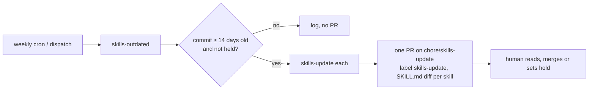

# MIP-0080: Vendored skills pinned in `skills.lock`, with a weekly reviewed update PR per repo

| | |
|---|---|
| **Status** | Draft — `Tasks: docs/MIPs/MIP-0080.tasks.md` ([`MIP-0080.tasks.md`](./MIP-0080.tasks.md)) |
| **Author** | Claude (Fable 5.1), from the maintainer's "Draft MIP" go-ahead on the vendored-skill drift research (2026-10-08) |
| **Created** | 2026-10-08 |
| **Phase** | None: dev-loop tooling, outside `docs/PHASES.md`'s sequence. No Phase 1 prerequisite, no paid resource |
| **Related** | MIP-0070 §5.4 (contracts are pinned artifacts, never another tree) and §9 (the rejected devkit sync bot, which this is not), MIP-0011 §5 item 8 (skills as repo files), MIP-0013 (why skills are plain files under `.claude/skills/`), MIP-0063 §5.6 (filing is a human's act), the devkit's `sharingan` skill (how a skill gets vendored today), marola-dev/agent-skills (the daily drift report), marola-dev/marola-devkit#39 and #40 (the drift this would have caught) |
| **Effort** | M — one stdlib Python tool in the devkit with a self-test, one reusable workflow, one lock file and one caller workflow per vendoring repo, a small change to agent-skills' `refresh.py`; no Scala |
| **Gain** | `infra/dev-loop` — every vendored skill names the commit it came from, a stale copy fails `just quality` instead of being discovered by a daily report nobody reads, and an upstream change arrives as a diff to review, not as a surprise |
| **Effort vs Gain** | `cheap win` — the tool is a few hundred lines over `git hash-object` and the GitHub contents API, and the first lock files are written from what is already on disk |
| **Depends on** | Nothing merges first. The devkit ships the tool and the reusable workflow in one release; each vendoring repo takes it with its next devkit bump. agent-skills' change is independent and can land in any order. No Phase 1 gate, no paid resource: the workflow runs on GitHub-hosted minutes in public repos |
| **Blocked by** | none |
| **Risk** | The weekly PRs are merged without reading the diff, which turns a reviewed update into the force-sync §9 rejects; the 14-day cooldown and the per-skill diff in the PR body are the only defences |
| **Cost so far** | — |

## 1. Summary

Every byte-identical copy of a third-party Claude Code skill gets a row in a per-repo
`skills.lock`: the upstream repo, path and commit, a git blob sha per file, the licence, and an
optional patch for a local edit. A devkit tool, `skills-vendor`, checks the copies against the lock
offline (in `just quality`), reports upstream drift on request, and refetches one skill at a pinned
commit. A reusable workflow opens one batched, labelled PR per repo each week with the updates
that have sat upstream for at least 14 days. Nothing is ever force-synced: a human reads the
SKILL.md diff and merges, or holds the skill.

## 2. Motivation

Four repos vendor skills from outside the org, copied byte for byte with their licence beside them
(the `sharingan` skill's "vendor verbatim" row): marola-site has 14 (`frontend-design` and
`webapp-testing` from anthropics/skills, `design-taste-frontend` from Leonxlnx/taste-skill,
`emil-design-eng`, `review-animations` and `break-ui` from emilkowalski/skill,
`karpathy-guidelines` from forrestchang/andrej-karpathy-skills, eight `mapbox-*` from
mapbox/mapbox-agent-skills); the devkit plugin has `humanizer` (blader/humanizer) and `ponytail`,
`ponytail-review`, `ponytail-audit` (DietrichGebert/ponytail); the umbrella has `citation-cff`;
h0ffmann/ww3-gpu has `humanizer` and the three `ponytail-*`, each with one added audience
paragraph.

No repo records the upstream commit. `sharingan` step 1 pins the commit while porting, but the pin
lives in the agent's scratchpad and dies with the session; the only trace on disk is a `version:`
field some upstreams keep in their front matter. So drift is invisible from inside a repo, and is
seen only by marola-dev/agent-skills' daily `refresh.py`, which matches a copy to a watched repo by
skill *name* and compares the `SKILL.md` blob sha. That report found, and the repos did not:

- `humanizer` at 3.0.0 in the devkit and ww3-gpu while upstream is 3.1.0 (`225a6f3`), which adds a
  tell and fixes a section reference (agent-skills review R5, marola-dev/marola-devkit#39);
- `ponytail-review` and `ponytail-audit` behind `552acd5`, which numbers findings and adds the
  `reuse:` tag (R6, marola-dev/marola-devkit#40).

A report alone does not move a copy. MIP-0070 §5.4's rule is that a consumer moves to a new
producer version by bumping a pin in a PR; vendored skills are the one consumed artifact in the org
with no pin to bump.

## 3. User-visible change

None for marola's users. For a contributor or agent:

```console
$ just skills-check                 # offline, in `just quality`: every copy's blob shas match the lock
skills-check: 14 skills, 61 files, all match skills.lock
$ just skills-outdated              # network, advisory
humanizer      3 files behind blader/humanizer@225a6f3 (2026-09-21): SKILL.md
ponytail       up to date (DietrichGebert/ponytail@552acd5)
mapbox-*       held: upstream renamed references/ (2026-10-01), see lock
$ just skills-update humanizer      # refetch at upstream HEAD (or --sha), rewrite copy and lock
skills-update: humanizer -> blader/humanizer@225a6f3, 1 file changed, local_edits reapplied: none
```

And once a week, a PR titled `chore(skills): update humanizer, ponytail-review` on
`chore/skills-update`, labelled `skills-update`, whose body carries each skill's SKILL.md diff.

## 4. Data sources and dependencies reviewed

- **The copies on disk** (read 2026-10-08 in this workspace): the 14 marola-site skills, each with
  `LICENSE`, `LICENSE.txt` or `LICENSE.md` beside `SKILL.md`, the eight `mapbox-*` also with
  `AGENTS.md`, `references/` and `evals/`; the devkit's `humanizer` (front matter
  `version: "3.0.0"`) and three `ponytail*`; the umbrella's `citation-cff` (`LICENSE`, `evals/`,
  `examples/`, `references/`); ww3-gpu's four, with the audience paragraph under the front matter.
  Adapted skills that are rewritten rather than copied (`eli5`, `architecture-diagram`, the devkit's
  own) are out of scope: a lock row means "this is upstream's bytes, plus at most one patch".
- **agent-skills' `refresh.py`** (read 2026-10-08): stdlib only; a copy is `identical to` or
  `differs from` the first watched skill of the same name, by the `SKILL.md` blob sha alone, with
  `SKIP_DIRS` excluding `vendor/`, `fixtures/` and the like. It cannot tell a local edit from
  drift, matches the wrong upstream when two watched repos share a name, and sees only one file.
- **Git blob shas.** `git hash-object <file>` gives the same sha the GitHub contents and trees
  APIs return for that blob, so a copy can be checked against the lock offline and the lock
  against upstream with one tree call per repo, which is what `refresh.py` already relies on.
- **The GitHub REST API** (`repos/{owner}/{repo}/commits?path=…`, `git/trees/{sha}?recursive=1`,
  `contents/{path}?ref=…`): unauthenticated reads are rate-limited to 60 an hour per IP; a
  workflow's `GITHUB_TOKEN` gets 1,000. The weekly run touches about five upstream repos per
  vendoring repo.
- **Upstream repos** (not reachable from this session, Appendix): the licences on disk are MIT or
  Apache-2.0; the `version:` front matter where present is the only upstream-side version.

## 5. Design

### 5.1 `skills.lock`

One JSON file per vendoring repo, beside the skills it describes: `.claude/skills/skills.lock` in
a repo, `plugins/marola-devkit/skills/skills.lock` in the devkit. Schema version 1:

```json
{
  "version": 1,
  "skills": {
    "humanizer": {
      "upstream": "blader/humanizer",
      "path": "",
      "commit": "0123456789abcdef0123456789abcdef01234567",
      "files": { "SKILL.md": "<blob sha>", "LICENSE": "<blob sha>" },
      "license": "MIT",
      "local_edits": null,
      "hold": null
    }
  }
}
```

- `upstream` is `owner/repo`; `path` the skill's directory in that repo (`""` at the root, as
  blader/humanizer keeps it). `commit` is the 40-character sha the copy was taken at, or `null`
  for a copy whose origin commit nobody recorded (the state of every copy today); `null` means
  "check only, never report outdated" until `skills-update` writes a real one.
- `files` lists every file of the copy, relative to the skill directory, with its git blob sha.
  `skills-check` fails on a sha that differs, a file in the lock that is missing, or a file in the
  directory that is not in the lock (a quiet local edit).
- `license` is the SPDX id from upstream, or `null`; `skills-update` refuses an upstream whose
  licence is not in `sharingan`'s allowed table.
- `local_edits` is a path, relative to the lock, to a unified diff applied on top of upstream's
  files (ww3-gpu's audience paragraph). The `files` shas are of the patched bytes.
  `skills-update` refetches upstream, reapplies the patch, and stops with the `.rej` in place if it
  does not apply.
- `hold` is a one-line reason to skip this skill in the weekly PR (an upstream rename under
  review, a change the maintainer declined). `skills-outdated` still shows it.

### 5.2 `skills-vendor` in marola-devkit

`scripts/skills-vendor.py`, stdlib only, on `PATH` through the flake like `wiring` and `graph`
(MIP-0076), with three recipes in `devkit.just`. The lock's location is found by walking up from
the cwd, so the same recipe works in a repo and in the devkit.

| Recipe | Network | Does |
|---|---|---|
| `just skills-check` | no | hashes every file under each locked skill and compares with the lock; non-zero on any difference. Runs in each repo's `just quality` |
| `just skills-outdated` | yes | for each skill with a `commit`, the latest upstream commit touching `path`, its date, and which locked files changed; one line per skill, `held:` or `unpinned:` where it applies. Exit 0 always |
| `just skills-update <name> [--sha S]` | yes | fetches `path` at `S` (default: upstream's default-branch head) into the skill directory, deletes files upstream dropped, reapplies `local_edits`, rewrites the row and `files`; leaves the diff uncommitted for review |

A first `skills-update --init <name> <owner/repo> <path>` writes a row from what is on disk, with
`commit: null`, so adopting the lock changes no skill bytes. `sharingan` step 1 ends by calling it,
so a newly ported skill is locked with its real commit from day one.

### 5.3 The weekly workflow

`skills-update.yml` is a reusable workflow in the devkit, called by each vendoring repo on
`schedule: '0 6 * * 1'` and `workflow_dispatch`, like `notify-umbrella.yml` is called today:



- It applies only updates whose upstream commit is at least 14 days old, so a push that upstream
  reverts within two weeks never reaches a PR, and skips every `hold`.
- One PR per repo, batched, on `chore/skills-update`; a later run with nothing new leaves it
  alone, and one with more updates pushes to the same branch. The body lists each skill as
  `upstream@old..new (date)` followed by its SKILL.md diff in a `diff` fence, so the review happens
  on GitHub without a checkout. Label `skills-update` (added to the devkit's `labels.yml`).
- Never a required check, never a merge, never a push to `main`. A failing run (rate limit,
  upstream gone, a patch that no longer applies) ends in the log and, for a patch, a PR comment;
  it does not open a half-applied PR.

### 5.4 Rollout and the drift report

1. **marola-devkit**: the tool with its self-test, the three recipes, `skills-update.yml`, the
   label, its own `plugins/marola-devkit/skills/skills.lock` (four rows), `skills-check` in its
   `just quality`, a `docs/4-reference_tools.md` row and a `docs/4-reference_workflows.md` row.
   Release (`v0.6.0` at the time of writing, MIP-0076's `v0.5.x` having landed).
2. **marola-site, marola, ww3-gpu**: devkit bump; `.claude/skills/skills.lock`; `skills-check` in
   `just quality`; the caller workflow. The umbrella's row is `citation-cff`; ww3-gpu's four rows
   carry `local_edits`.
3. **marola-dev/agent-skills**: `refresh.py` reads each watched marola-dev repo's `skills.lock`
   (and ww3-gpu's) and takes `upstream`, `path` and `commit` from it, comparing every locked
   file rather than `SKILL.md` alone; name matching stays as the fallback for a copy with no
   lock row. `upstream_of` becomes exact, and the report gains "pinned at … / upstream at …".
4. Each repo's `AGENTS.md` names the lock in its vendored-skills sentence; the umbrella's
   `AGENT-SKILLS.md` §1 gets one line.

The first lock files carry `commit: null` for every row. The first weekly run therefore opens
no PR; a human runs `just skills-update <name>` once per skill, reviews the diff that closes
marola-dev/marola-devkit#39 and #40, and from then on the cron does the fetching.

### 5.5 Security

A `SKILL.md` steers an agent that has tool access, so a change to one is reviewed like code: an
upstream commit that adds "run this script" lands in a PR diff a human reads, never in a session
unannounced. The 14-day cooldown is against the push-then-revert shape of a compromised upstream
account. `skills-update` fetches with `GITHUB_TOKEN` only, over the REST API, and writes only
under the locked skill's directory; `hold` is the stop button per skill.

## 6. Scoring / safety impact

None. No code path in marola-app changes; this is dev tooling.

## 7. Verification plan

- **`skills-vendor --self-test`** (in the devkit's `tests/self-tests.sh`), over a temp directory
  with a fake upstream served from fixture files:
  - `check_passes_on_matching_lock`, `check_fails_on_changed_file`, `check_fails_on_missing_file`,
    `check_fails_on_unlisted_file`;
  - `init_writes_null_commit_and_changes_no_bytes`;
  - `update_rewrites_files_and_commit`, `update_deletes_dropped_files`,
    `update_reapplies_local_edits`, `update_stops_on_rejected_patch`,
    `update_refuses_unlisted_license`;
  - `outdated_skips_null_commit`, `outdated_reports_hold`, `outdated_exit_zero_when_behind`;
  - `lock_found_from_subdirectory`.
- **`actionlint`** on the workflow; a `workflow_dispatch` run on a scratch branch of marola-site
  with one row's `commit` set 30 days back opens a PR with that skill's diff and no other (run
  and PR links in the devkit PR).
- **agent-skills**: `refresh.py --self-test` adds `upstream_from_lock` and
  `name_match_fallback_without_lock`; a refresh run after step 2 shows the devkit's `humanizer`
  as "pinned at <null→sha> / upstream at 225a6f3".
- Done means `just quality` runs `skills-check` in the devkit, marola-site, the umbrella and
  ww3-gpu, and #39 and #40 are closed by diffs that came through `skills-update`.

## 8. Risks, limitations, and honest caveats

- **Rubber-stamped PRs** are the real risk (metadata table). The body's diff is there to be read;
  a repo that finds it is merging without reading should drop the cron and keep `skills-outdated`.
- **The cooldown is a heuristic.** Fourteen days catches a reverted push, not a patient attacker;
  the review is the control, the cooldown only lowers the noise.
- **Upstream renames and moves** (a skill moved into a `skills/` subdirectory, a file split) show
  up as `outdated` with a path that no longer exists; `skills-update` fails with the 404 and the
  row needs a hand edit of `path`. `hold` covers it until then.
- **Local edits as patches** work for one paragraph; a copy that diverges further is an adapted
  skill and should leave the lock, as `sharingan`'s "adapt with a credit line" row already says.
- **`commit: null` rows are blind**: they check bytes but cannot say what they are behind. The
  state is temporary by design (§5.4), and `skills-outdated` prints them as `unpinned:` so they do
  not read as current.
- **Rate limits**: the workflow's token allows 1,000 calls an hour; a repo with 14 skills over 5
  upstreams uses under 30. A fork or a private upstream needs a token the workflow does not have,
  and is out of scope.

## 9. Alternatives considered

- **Do nothing (the drift report alone)**: it found R5 and R6 and nothing moved; a report with no
  pin to bump is MIP-0070 §5.4's "reads another tree" in a softer form.
- **A blocking "must be latest" CI check**: every upstream push breaks every consumer's `main`
  at once, with no review step; the opposite of a pin.
- **Install upstreams as plugins from their marketplaces**: cloud sessions do not install
  project-enabled external plugins; a plugin renames its skills (`/mapbox:…`), so `site-frontend`'s
  ordering breaks; the pin is set by the marketplace author, not by us; and not every upstream
  publishes one (not checked against each upstream, Appendix).
- **agent-skills as an umbrella submodule holding the copies**: Claude Code loads project skills
  only from the started repo's `.claude/skills/` and its parents, and `AGENTS.md` says to start in
  the repo being changed; agent-skills holds no copies by design, and a repo reading another's
  tree is what MIP-0070 §5.4 forbids.
- **`git subtree`**: it pins a commit, but splits history across every vendoring repo, cannot
  carry a local patch cleanly, and `git subtree pull` is the force-sync §5.3 avoids.
- **`npx skills` or a similar installer**: no documented ref pinning, and it adds Node to repos
  that have none.
- **The devkit sync bot MIP-0070 §9 rejected**: that was a bot overwriting devkit files in every
  repo, with local overrides lost. This opens a reviewed PR with the diff in its body, keeps local
  edits as a patch, and never writes to `main`.

## 11. Open questions

- **Lock location in the devkit**: beside the plugin's skills (`plugins/marola-devkit/skills/`),
  as proposed, or at the repo root like a code repo's? Beside the skills keeps one walk-up rule.
- **Who reviews ww3-gpu's PRs**: it is outside marola-dev; the caller workflow and the label are the
  same, the merge is the maintainer's.
- **Should `skills-check` also fail on a `LICENSE` missing beside a locked skill?** It would make
  `sharingan`'s licence rule a gate. Proposed yes, as a second check in the same tool.
- **Follow-up MIP:** none found.

## Appendix

### Checked live

Nothing outside this workspace was reachable from this session: the GitHub API answered 403 to
`gh api` and to a plain fetch for `blader/humanizer`, `DietrichGebert/ponytail`,
`anthropics/skills` and `mapbox/mapbox-agent-skills` (2026-10-08). What was checked is on disk:

- The skill directories and licence files listed in §4, read 2026-10-08 in marola-site, the devkit,
  the umbrella and ww3-gpu; `humanizer`'s `version: "3.0.0"` front matter; ww3-gpu's audience
  paragraph in each of its four copies.
- marola-dev/agent-skills `scripts/refresh.py` and `docs/4-reference_review.md` R5–R6, read
  2026-10-08: the name-based match, the `SKILL.md`-only blob comparison, and the upstream shas
  `225a6f3` (humanizer 3.1.0) and `552acd5` (ponytail).
- MIP-0070 §5.4 and §9, the `sharingan` skill's steps 1–2 and its licence table, MIP-0076 §5.2's
  precedent for a devkit tool on `PATH`, read 2026-10-08.

### Not checked

- The upstream shas, dates and version numbers are repeated from agent-skills' review, not fetched
  here. The `commit` values in the first lock files are `null` for that reason.
- That cloud sessions do not install project-enabled external plugins, and that a plugin prefixes
  its skills (`/mapbox:…`): taken from the research that preceded this MIP, not re-tested.
- Whether each upstream publishes a marketplace or plugin at all; the §9 row holds either way.
- GitHub's rate limits (60 unauthenticated, 1,000 with `GITHUB_TOKEN`) and that `git hash-object`
  equals the contents API's `sha`: from memory of the REST docs, consistent with `refresh.py`'s
  working assumption, not fetched this session.
