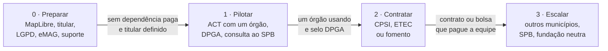

# MIP-0082: O marola como GovTech — pré-requisitos, um piloto com um órgão e os caminhos de contratação

| | |
|---|---|
| **Status** | Draft |
| **Author** | Hoffmann, a partir de um spike pedido no projeto Marola Agent (2026-10-08). Escrita em português por exceção, a pedido dele |
| **Created** | 2026-10-08 |
| **Phase** | Nenhuma: adoção e governança, não um backend. Não exige a Fase 2 (nuvem paga), mas disputa a mesma equipe que a Fase 1 (`docs/PHASES.md`) |
| **Related** | MIP-0005 (o mapa e o site estático), MIP-0031 e MIP-0067 (balneabilidade do INEA e do INEMA), MIP-0022 (rodapé de segurança), MIP-0079 (DOI no Zenodo), `FUTURE-WORK.md` §9.2 (alertas como canal complementar aos oficiais) |
| **Effort** | M — uma migração de mapa no marola-site (Mapbox para MapLibre) e duas páginas novas; o resto são decisões e acordos de pessoas, não código |
| **Gain** | `community/outreach` — um órgão usuário e o selo de Bem Público Digital dão ao marola credibilidade fora da universidade; `cost/ops` — sem Mapbox, o custo por carregamento de mapa some; `user value` — o aviso chega a quem consulta o canal oficial |
| **Effort vs Gain** | `do next` para os pré-requisitos (§5.1), que valem por si; `do when X lands` para o piloto e o DPGA, X = o titular decidido (§11) |
| **Depends on** | Nenhuma MIP precisa entrar antes. O piloto depende de um órgão disposto e de um responsável na UFRJ, atos de pessoas. Nenhum recurso pago é provisionado |
| **Blocked by** | none |
| **Risk** | O piloto dá ao órgão um aviso que ele publica como seu, e um erro de dado (balneabilidade velha, previsão errada) vira responsabilidade pública; §5.3 limita o piloto ao painel determinístico e à fonte oficial citada |
| **Cost so far** | — |

### Readiness

| | |
|---|---|
| **Manually reviewed** | no |
| **Written by** | Hoffmann, com Claude Code |
| **Tasks** | [`MIP-0082.tasks.md`](./MIP-0082.tasks.md) |
| **Tests** | nenhum teste novo de código: `site_check.js` cobre a migração (§7), e o resto são verificações de página |
| **Spec-kit** | none |
| **Issues** | not filed — Draft |

## 1. Summary

O marola já tem código aberto (MIT) e dados públicos, mas um órgão público não consegue adotá-lo
hoje: o mapa depende de uma conta Mapbox paga, o projeto não tem um titular que assine um acordo, e
não há política de privacidade nem declaração de suporte. Esta MIP resolve esses cinco
pré-requisitos, propõe um primeiro piloto sem dinheiro por um Acordo de Cooperação Técnica (ACT)
com a UFRJ, a submissão ao registro de Bens Públicos Digitais, e só depois a contratação por CPSI
ou fomento.

## 2. Motivation

A pergunta veio de outra: o marola poderia ser um projeto Apache? Hoje não. A ASF exige migrar de
MIT para Apache-2.0, um champion da fundação e contribuidores de várias organizações, e não aceita
dependência proprietária como o Mapbox (`marola-site/site/static/vendor/LICENSE.mapbox-gl`: "licensed
under the Mapbox TOS for use only with the relevant Mapbox product(s)"). E mesmo que pudesse, o
selo Apache pesa pouco para um gestor público. O que pesa é licença aberta sem dependência paga,
um titular com quem assinar, conformidade com a LGPD e o eMAG, e um caso de uso real.

O levantamento nos repositórios em 2026-10-08:

| Aspecto | Hoje | O que um órgão veria |
|---|---|---|
| Licença | MIT em todos os repositórios do marola-dev | Bom |
| Copyright | "marola.dev" (não é pessoa jurídica); Matheus Hoffmann no umbrella | Ninguém para assinar |
| Mapa base | Mapbox GL JS 3.32, termos da Mapbox, cobrança acima da faixa gratuita | Conta paga e termos herdados |
| Dados | OpenStreetMap, Open-Meteo, balneabilidade oficial, NASA GIBS | Bom: fontes públicas e citáveis |
| LLM | Ollama local; `marola-llama3.2` herda a licença comunitária da Llama 3.2, Qwen3 é Apache-2.0 | Preferir o Apache-2.0 |
| Equipe | Cerca de seis pessoas, quase todas da Poli/UFRJ (contagem em clones rasos) | Precisa de suporte institucional |

## 3. User-visible change

Antes: marola.dev é um projeto de estudantes, com mapa da Mapbox e sem política de privacidade.

Depois, na página "Sobre" e no rodapé:

```text
marola é mantido por <titular> e usado por <órgão> em <município>.
Mapa: MapLibre e <provedor de tiles abertos>.
Bem Público Digital (DPGA) · Privacidade · Termos · Suporte
```

Para o órgão: um painel por praia com a balneabilidade oficial dele, a previsão e o veto de
segurança, que ele pode linkar ou hospedar.

## 4. Data sources and dependencies reviewed

### 4.1 Registro de Bens Públicos Digitais (DPGA)

O [padrão](https://www.digitalpublicgoods.net/standard) tem nove indicadores: relevância para os
ODS, licença aberta, titularidade clara, independência de plataforma, documentação, extração de
dados não pessoais, privacidade e leis aplicáveis, boas práticas, e "não causar dano" (9A–9C). Pelo
[guia de submissão](https://www.digitalpublicgoods.net/submission-guide), só um representante
autorizado do titular submete, a análise leva cerca de 30 dias e o selo é renovado todo ano. O
guia não lista as licenças aceitas; aponta para uma wiki que não foi lida.

### 4.2 CPSI, pelo Marco Legal das Startups (LC 182/2021)

É uma licitação especial para testar uma solução. Segundo a
[Conjur](https://www.conjur.com.br/2023-set-21/interesse-publico-procedimento-contratacao-startups-administracao/):
teto de R$ 1,6 milhão, 12 meses prorrogáveis por mais 12, pessoa física ou jurídica, isolada ou em
consórcio (art. 13). Uma solução aprovada pode ser contratada sem nova licitação por até 24 meses,
prorrogáveis, e até 5 vezes o teto (art. 14). O
[Desafio Rio 2025](https://cienciaetecnologia.prefeitura.rio/wp-content/uploads/sites/40/2025/08/Edital-de-Consulta-Publica-no-01-Desafio-Rio-2025-COMPLETO.pdf),
da Prefeitura do Rio, usou o CPSI, citou a ETEC como alternativa e listou "melhoria da previsão do
tempo" entre dez desafios.

### 4.3 Portal do Software Público Brasileiro (SPB)

É o catálogo federal de software livre para reuso entre órgãos. Uma
[página do IME-USP](https://www.ime.usp.br/~paulormm/projects/4_project) descreve a nova geração do
portal, mas não diz se está no ar nem como se entra. O processo atual não foi encontrado.

### 4.4 Fundações neutras

A ASF (Apache) exige Apache-2.0 e diversidade de organizações; OSGeo e NumFOCUS cobrem software
geoespacial e científico. Nenhuma foi consultada nesta sessão (Appendix).

**Escolha:** pré-requisitos primeiro, ACT e DPGA em paralelo, CPSI ou fomento com o piloto em
mãos, fundação só depois.

## 5. Design

### 5.1 Pré-requisitos

1. **MapLibre no lugar do Mapbox** (marola-site). MapLibre GL JS (BSD-3) no `vendor/`, `app.js` e
   `flow.js` trocando `mapboxgl` por `maplibregl` (a camada customizada do `flow.js` usa a API de
   custom layer, que o MapLibre mantém), um estilo com tiles abertos escolhido num ADR, e saem
   `mapbox-config.js`, `scripts/mapbox_config.sh`, a variável `MAPBOX_PUBLIC_TOKEN` e as origens
   Mapbox da CSP. Atende ao indicador de independência de plataforma do DPGA.
2. **Titular.** Uma decisão de pessoa (§11): a UFRJ, uma associação sem fins lucrativos ou uma
   pessoa. As linhas de copyright, o `CITATION.cff` e a página "Sobre" passam a nomeá-lo.
3. **Privacidade e termos (LGPD).** Uma página no marola-site dizendo o que o site, o bot do
   Telegram (quando existir) e os logs coletam, por quanto tempo e para quê.
4. **Acessibilidade (eMAG).** Uma passada pelo modelo de acessibilidade do governo federal; o que
   não for corrigido fica listado na própria página.
5. **Suporte.** Quem responde quando o serviço cai, a disponibilidade esperada e como o órgão
   hospeda sozinho (o site é estático; `just site-build` gera tudo).

### 5.2 Roteiro



Cada fase começa quando o critério da anterior passa. A fase 1 é a decisiva: o primeiro órgão
usuário é o argumento de todos os editais e da submissão ao DPGA.

### 5.3 O piloto (ACT)

Um Acordo de Cooperação Técnica entre a UFRJ e um órgão (Prefeitura do Rio, INEA, Defesa Civil ou
Corpo de Bombeiros). Não há repasse de dinheiro, então não há licitação. O órgão fornece dados e
valida; a UFRJ opera. O escopo do piloto é o painel determinístico já existente para as praias do
órgão: balneabilidade oficial citada com data, previsão e o veto de segurança. O resumo gerado por
LLM fica fora do piloto até ser validado (MIP-0040).

### 5.4 DPGA

Submissão pelo representante do titular, depois de §5.1 itens 1–3. Relevância para os ODS 14 (vida
na água) e 3 (saúde). Renovação anual na agenda do titular.

### 5.5 SPB

Uma consulta ao Ministério da Gestão sobre o processo atual. Se o portal estiver ativo, o marola
entra depois do piloto, com o órgão como referência.

### 5.6 Contratação

Com o piloto em mãos: o CPSI quando um edital trouxer um desafio compatível (previsão, segurança
costeira, balneabilidade), a ETEC quando um órgão quiser encomendar pesquisa à UFRJ, ou fomento
(FAPERJ, Finep, CNPq) para pagar a equipe. Qualquer contrato exige quem o assine: o titular de §5.1
item 2 ou uma empresa criada para isso.

### 5.7 O que fica fora

Migrar para Apache-2.0 ou entrar em fundação; hospedagem paga; qualquer recurso em nuvem.

## 6. Scoring / safety impact

Nenhum no código. O piloto expõe o veto de segurança e a balneabilidade oficial a um público maior,
e por isso o painel continua determinístico e cita a fonte oficial com data (MIP-0022).

## 7. Verification plan

- Migração: `node scripts/site_check.js` verde; `just site-live-check` sem nenhuma requisição a
  `*.mapbox.com`; capturas antes e depois em 1280 × 800 e 390 × 844, como o AGENTS.md do
  marola-site exige.
- Páginas: privacidade, termos e suporte linkadas do rodapé, em pt-BR e inglês (`i18n_bundle.py`).
- Pronto quando: o marola aparece no registro do DPGA, e a página "Sobre" nomeia o titular e o
  primeiro órgão usuário.

## 8. Risks, limitations, and honest caveats

- **Responsabilidade pelo aviso.** O órgão responde pelo que publica; o piloto mostra a
  balneabilidade dele, não uma opinião do marola.
- **Continuidade.** Projeto acadêmico acaba quando a turma se forma; o ACT precisa de um
  responsável que fique na UFRJ.
- **Concorrência com a Fase 1.** O piloto usa a mesma equipe que o bot do Telegram.
- **Tiles abertos.** Um provedor gratuito de tiles pode ter limite de uso; o ADR da migração
  escolhe um com termos claros ou um servidor próprio.

## 9. Alternatives considered

- **Não fazer nada.** O marola continua um projeto acadêmico, com custo Mapbox crescente.
- **Apache primeiro.** Bloqueado hoje (licença, champion, diversidade) e pesa pouco para governo.
- **CPSI direto, sem piloto.** Sem caso real a proposta é fraca, e falta quem assine.
- **Uma empresa agora.** Viável depois, se o CPSI pedir; antes, a UFRJ cobre o piloto sem custo.

## 11. Open questions

- Quem é o titular formal? **Default:** a UFRJ, por um professor responsável; Hoffmann decide.
- Qual órgão primeiro? **Default:** a Prefeitura do Rio, que já usa CPSI e tem o INEA como fonte;
  Hoffmann decide.
- O SPB está ativo e como se entra? **Default:** fora do roteiro até a consulta de §5.5.
- Qual provedor de tiles abertos? **Default:** decidido no ADR da migração no marola-site.

## Appendix

### Checked live

- https://www.digitalpublicgoods.net/standard, 2026-10-08: nove indicadores, 9 dividido em A–C.
- https://www.digitalpublicgoods.net/submission-guide, 2026-10-08: representante autorizado,
  análise em cerca de 30 dias, renovação anual; licenças aceitas numa wiki não lida.
- https://www.conjur.com.br/2023-set-21/interesse-publico-procedimento-contratacao-startups-administracao/,
  2026-10-08: CPSI até R$ 1,6 mi, 12 + 12 meses; contrato posterior até 24 meses e 5 vezes o teto.
- Edital de Consulta Pública 01/2025, Desafio Rio, 2026-10-08: CPSI e ETEC, dez desafios incluindo
  previsão do tempo, POC até R$ 1,6 mi, fornecimento até R$ 8 mi.
- https://www.ime.usp.br/~paulormm/projects/4_project, 2026-10-08: nova geração do SPB descrita,
  sem estado atual nem processo de entrada.
- `marola-site/site/static/vendor/LICENSE.mapbox-gl` e os `LICENSE` de cada repositório, lidos em
  2026-10-08.

### Not checked

- Os requisitos da ASF, OSGeo e NumFOCUS, que vêm de conhecimento prévio.
- O ACT e a ETEC no Marco Legal de CT&I (Lei 13.243/2016), também de conhecimento prévio.
- Editais de fomento e programas de aceleração GovTech abertos agora.
- A lista de licenças aceitas pelo DPGA.
- A compatibilidade do `flow.js` com a API de custom layer do MapLibre, que a migração confirma.
</content>
</invoke>
