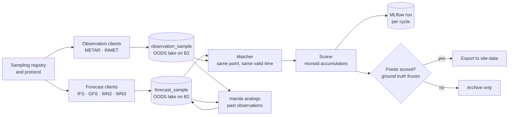
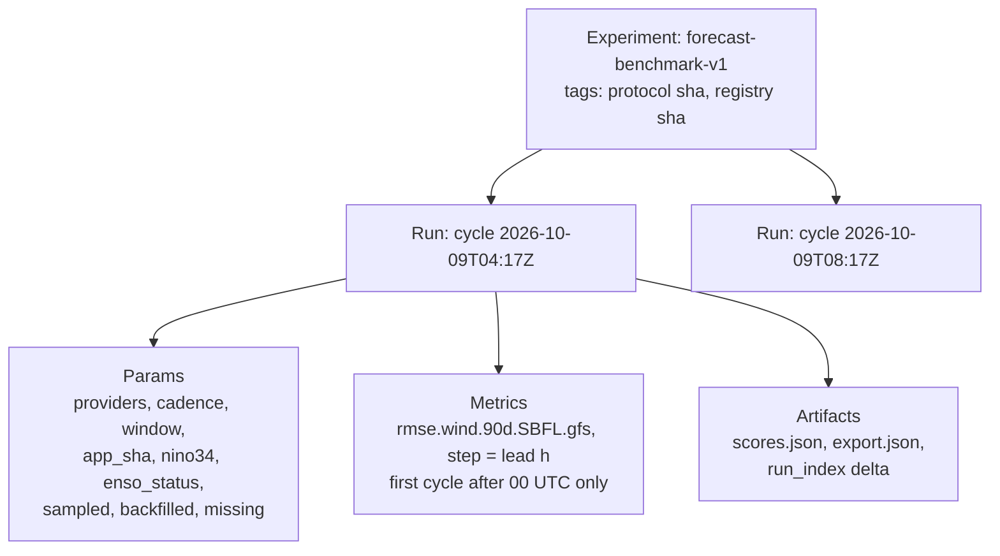

# MIP-0083: A forecast experiment in marola-app — IFS, GFS and WeatherNext sampled every 4 hours at registered points, scored against ground truth, with runs in MLflow and samples in the OODS lake

| | |
|---|---|
| **Status** | Draft — redefined from scratch by the owner on 2026-10-09 (the earlier Accepted text, its two amendments and the marola-eval move are superseded; `git log` keeps them) |
| **Author** | Hoffmann, from #724 and #723, redefined in the project thread on 2026-10-09 |
| **Created** | 2026-10-09 |
| **Phase** | None: R&D outside the phase list (#724). It writes to MIP-0075's B2 bucket, which already exists and is free; it provisions nothing. Phase 1 (the Telegram bot) is not done, and nothing here moves it |
| **Related** | #724 (the source issue), #723 (the study: points, protocol, paper), MIP-0075 (the OODS lake on B2 and its DuckDB store), MIP-0010 (MLflow and `RunLedger`), marola-dev/marola-site#99 (the page), h0ffmann/ww3-gpu#92 (the wind chapter), marola-dev/marola-app#72 (task 1, written before this redefinition) |
| **Effort** | L — an sbt module with four forecast clients, two observation clients, a registry, a scorer, an MLflow ledger on B2 and lake tables; a scheduled workflow. Two new dependencies (`kyo-config`, `kyo-schema-json`, §4.9) plus MIP-0075's `duckdb_jdbc` |
| **Gain** | `user value` — marola.dev can say which forecast has been right lately at a given coast; `community/outreach` — an open, continuously updated comparison of physics and AI models on the Brazilian coast through a strong El Niño |
| **Effort vs Gain** | `do next` for tasks 1–8 and 12 (local and free, and a WeatherNext 2 run not sampled is lost); `do when X lands` for task 10, X = Google's approval of WeatherNext 3 access |
| **Depends on** | MIP-0075's bucket and key (exist since 2026-10-05) and its `OodsStore` (task 5 there, reused here); Google's approval for WeatherNext 3 (task 11, a person's act); #723 freezing the strong-wind thresholds before any score is published |
| **Blocked by** | none |
| **Risk** | A run is skipped or fetched twice and the record drifts from what each publisher actually issued, so every score answers a different question than it claims; §5.5 makes every expected run an explicit `sampled`, `backfilled` or `missing` row keyed by provider and run time |
| **Cost so far** | — |

### Readiness

| | |
|---|---|
| **Manually reviewed** | no |
| **Written by** | Hoffmann, with Claude Code |
| **Tasks** | [`MIP-0083.tasks.md`](./MIP-0083.tasks.md) |
| **Tests** | `GroundTruthSpec`, `SamplingRegistrySpec`, `ProtocolSpec`, `ForecastClientSpec`, `ObservationClientSpec`, `ScoreMonoidSpec`, `MatcherSpec`, `AnalogSpec`, `LakeSamplesSpec`, `CycleSpec`, `ExportSpec` in marola-app's `experiment` module (§7) |
| **Spec-kit** | none |
| **Issues** | not filed — Draft. marola-dev/marola-app#63–#71, filed for the superseded text, are closed or rewritten once this is Accepted |

## 1. Summary

marola-app gains an `experiment` sbt module, written in Kyo, that every 4 hours (adjustable)
samples 10 m wind and 2 m temperature forecasts from ECMWF IFS, NOAA GFS and Google WeatherNext 2,
and WeatherNext 3 once Google grants access, at a registry of sampling points. It pairs every
matured forecast with what an instrument measured at that point, and keeps bias, RMSE and CRPS
over a 90-day window. Each cycle is an MLflow run (params, metrics, artifacts); every forecast and
observation sample is a row in MIP-0075's OODS lake on Backblaze B2. Nothing is published until
the ground-truth step has frozen the points it scores against. marola also issues its own
forecast, an analog ensemble built from the coast's own observations (§5.11), chosen so its errors
track the providers' as little as a skilful forecast can; it is scored as one more provider, and
every pair of providers' error correlation is measured.

## 2. Motivation

#723 asks whether a free AI model matches a physics model on this coast, and a one-off answer goes
stale with every model upgrade. Two facts make it urgent:

- **Open-Meteo serves only the latest WeatherNext 2 run**, with no single-run archive (v Open-Meteo
  single-runs page, 2026-10-09), so a run not sampled by the cycle that saw it is gone.
- **A strong El Niño is under way** (#723, citing NOAA CPC's 2026-10-08 advisory); its peak,
  October 2026 to March 2027, is the most informative window of the study.

marola-app already has an `Http` with fixture replay, a `JsonValue`, `RunLedger` with an MLflow
REST implementation (MIP-0010), and, with MIP-0075, a DuckDB store on B2. What it lacks is a
forecast client that takes `models=`, any observation client, and anything that runs on a schedule.

## 3. User-visible change

Nothing changes in the CLI, the bot or the board. New surfaces:

```bash
# in a marola-app checkout
just experiment-cycle      # one cycle against a local MLflow and a local lake directory
just experiment-rescore    # rebuild every score from the lake's samples alone
```

and, once points are `scored` (§5.8), `forecast-benchmark/latest.json` on marola-site's
`site-data` for the wind page (marola-site#99).

## 4. Data sources and dependencies reviewed

### 4.1 How wind forecasts are fetched (point 1)

| Route | Providers | Fit |
|---|---|---|
| **Open-Meteo APIs** (forecast, ensemble, single-run) | IFS (`ecmwf_ifs`), GFS (`ncep_gfs013`), WeatherNext 2 (`google_weathernext2_ensemble`) | **taken**: one JSON client for three providers, `cell_selection=nearest` for every model, no key for non-commercial use, ~10,000 calls a day |
| Google's WeatherNext 3 channels (BigQuery, Earth Engine, GCS Zarr) | WeatherNext 3 | **taken for WN3 only**: not on Open-Meteo (§4.3) |
| The originals (ECMWF open data, NOAA NOMADS or AWS) | IFS, GFS | rejected as the main route: GRIB2 decoding on the JVM and a grid rule per provider; kept as #723 step 2's one-off cross-check of Open-Meteo's re-gridding |

Open-Meteo facts (v its docs pages, 2026-10-09):

- **IFS HRES 9 km**: 4 runs a day, hourly to 90 h, up to 15 days; single runs kept from 2024-03-14,
  so a missed run is backfilled.
- **GFS**: 0.11° for surface fields, hourly to 120 h then 3-hourly, 16 days, 4 runs a day; single
  runs kept from 2026-04-02. The id `ncep_gfs013` is from Open-Meteo's website source ⚠ until a
  live call records it.
- **WeatherNext 2**: 64 members, 0.25°, 6-hourly native (`temporal_resolution=native`), 15 days;
  Open-Meteo processes only the 00 and 12 UTC runs; no single-run archive.
- Each model's metadata JSON gives `last_run_initialisation_time` and `last_run_availability_time`;
  wait 10 minutes after the latter. The URL pattern is ⚠ until task 4 records it.

### 4.2 How forecast temperature is fetched (point 2)

The same requests carry `temperature_2m`: IFS, GFS and WeatherNext 2 all list it (v Open-Meteo
docs, 2026-10-09; WeatherNext 2 also lists its ensemble spread). No second client is needed.
WeatherNext 3's station-trained 2 m temperature comes at 0.05° (§4.3). Observed temperature comes
from the same METAR and INMET records as the wind (§4.5).

### 4.3 WeatherNext 3 (point 3)

Announced 2026-09-03: 64 members, a run every UTC hour, 15 days for the 00/06/12/18 cycles and
48 h for the others; 2 m temperature and dew point at 0.05°, surface wind at 0.1° (v WinBuzzer,
2026-09-05). Access (v developers.google.com/weathernext access guide, 2026-10-09): a Data Request
Form with a Google account, usually approved in 5–7 business days, one approval for Cloud
Storage, BigQuery and Earth Engine; researchers and students qualify; no paid contract needed.
BigQuery and Earth Engine carry the surface mean and percentiles, GCS the full ensemble as Zarr
(Requester Pays). Data older than 1 h is CC BY 4.0; real-time data is under Google's experimental
terms.

**Outreach (TODO, a person's act):** apply through the form, preferably as UFRJ (Hoffmann's Poli
account) and UFSC (LabECO, the ww3-gpu co-advisors), naming #723 and this MIP; record the answer
here. Until then WeatherNext 3 is a `ProviderId` with no client. The client reads BigQuery's
statistics (mean and percentiles) at the registry's points: CRPS needs members, so WN3 is scored
on its mean until the Zarr route is costed ⚠.

### 4.4 The initial provider list (point 5)

| Provider | Publisher | Kind | Members | Runs sampled | Backfill |
|---|---|---|---|---|---|
| IFS HRES 9 km | ECMWF | physics | 1 | 00/06/12/18 | single-run API |
| GFS | NOAA/NCEP | physics | 1 | 00/06/12/18 | single-run API |
| WeatherNext 2 | Google DeepMind | AI | 64 | 00/12 | none: lost if not sampled |
| WeatherNext 3 | Google DeepMind | AI | 64 (mean and percentiles via BigQuery) | 00/06/12/18 | Google's archive (backfill in progress ⚠) |

AIFS, AIGFS, ICON, UKMO and MONAN are later rows: each is one `ProviderId` case (§5.3). The 2025
NHC verification (GFS's 120 h track error 362.3 n mi, the largest; DeepMind's ensemble best to
72 h) and Hurricane Isaias's split between AI and physics guidance (outcome pending) are context,
not evidence for this coast (v NHC Verification_2025.pdf; M. Lowry, 2026-10-07).

### 4.5 Ground truth

- **METAR** (`https://aviationweather.gov/api/data/metar?ids=SBFL&format=json`): no key, 100
  requests a minute, a custom User-Agent; **only the last 15 days** are kept (v aviationweather.gov
  data API page, 2026-10-09). Wind in knots, temperature in °C.
- **INMET automatic stations**: hourly 10 m wind and 2 m temperature; the API at
  `apitempo.inmet.gov.br` may need a token ⚠; whether its wind is a 10-minute or hourly mean ⚠.
- **NOAA CPC's Niño-3.4** anomaly and ENSO status, stored with every cycle (#723) ⚠ file not
  fetched.

### 4.6 MLflow on B2 (point 6)

MLflow stores artifacts on Backblaze B2 natively: `b2://<bucket>@s3.<region>.backblazeb2.com/<path>`
with `AWS_ACCESS_KEY_ID`/`AWS_SECRET_ACCESS_KEY` from a B2 **application** key (the master key
does not work with the S3 API), `AWS_DEFAULT_REGION=us-east-005`, and boto3 beside MLflow (v
MLflow artifact-store docs, 2026-10-09). The tracking store stays a SQLite file, downloaded and
uploaded per cycle as MIP-0075 does its catalog. marola pins MLflow 3.16.0.

### 4.7 B2 from Scala (point 7)

MIP-0075 §4.5 already settled it: `org.duckdb:duckdb_jdbc` 1.5.6.0 with the `httpfs` and
`ducklake` extensions, an `OodsStore` trait, wrapped in Kyo at the boundary (`Sync.defer` per
call, `Scope` for the connection), B2 reached as S3 at `s3.us-east-005.backblazeb2.com`, the secret
built from the environment and never `PERSISTENT`. This MIP adds tables to that lake (§5.6) and no
second S3 client. Compared: the AWS SDK v2 S3 client with an endpoint override (works, ~10 MB of
jars, but writes objects, not tables); `kyo-sql` (no DuckDB dialect at RC7, MIP-0075 §4.5).

### 4.8 Window, cadence and registry (point 9)

The experiment window is **90 days**, the cadence **every 4 hours**; both are values in
`protocol.json`, not code, so a change is a reviewed commit whose git sha every MLflow run
records. The cron line is the one place the cadence also lives (§5.9).

### 4.9 Kyo modules (point 8)

Kyo 1.0.0-RC7, marola-app's pin. Its repository at tag `v1.0.0-RC7` (1d54c02, 2026-09-28) has 70
modules; 62 are on Maven Central as `io.getkyo:<m>_3:1.0.0-RC7` (each `.pom` fetched 2026-10-09;
`kyo-bench`, `kyo-compat`, `kyo-examples`, `kyo-scheduler-finagle`, `kyo-test`, two test kits and
the website are not published).

| Module | Use here | |
|---|---|---|
| `kyo-core`, `kyo-direct`, `kyo-combinators` | effects at the I/O boundary, direct style | already in marola-app |
| `kyo-prelude`, `kyo-data` | `Abort`, `Env`, `Var`, `Emit`; `Chunk`, `Maybe`, `Result` | pulled in by `kyo-core` |
| `kyo-config` | `StaticFlag` for the lake path, MLflow URI and dry-run switch | **add**; the protocol stays a file (§4.8) |
| `kyo-schema`, `kyo-schema-json` | `derives Schema` codecs for the registry, protocol and export | **add**, replacing hand-written readers like task 1's; checked against the jar before use (`.claude/agents/jar-verifier.md`) |
| `kyo-stats-registry`, `kyo-stats-otlp` | counters per cycle | later, if MLflow's metrics are not enough |
| `kyo-http` | HTTP client | not now: marola's `Http` has the fixture seam every spec uses, and RC7's client has no proxy class (MIP-0075 §4.6) |
| `kyo-flow` | durable workflows | rejected: a cycle is idempotent and re-run from the lake (§5.5), so a workflow engine's persistence buys nothing |
| `kyo-sql`, `kyo-sql-sqlite` | SQL | not usable: no DuckDB dialect; MLflow's SQLite is MLflow's, read only through its REST API |
| `kyo-stm`, `kyo-actor`, `kyo-reactive-streams` | concurrency | not needed: one cycle, one writer |
| the rest (`kyo-ai`, `kyo-browser`, `kyo-mcp`, `kyo-pod`, `kyo-ui`, `kyo-zio`, …) | — | unrelated to this job |

## 5. Design

### 5.1 The flow



The registry decides where to sample; clients write samples to the lake; the matcher and scorer
read only the lake, so a score is always recomputable from stored samples (§5.5); MLflow records
each cycle; the export waits for the ground-truth gate (§5.8). marola's analog model (§5.11) reads
the observation history and today's large-scale forecast and writes its own forecast back to the
lake as one more provider.

### 5.2 Category-theory principles, in Kyo

The module is written so that its laws are testable, not as theory for its own sake:

- **Scores are commutative monoids.** A score cell (provider, point, lead, bin) keeps `n`, `Σe`,
  `Σe²`, `Σ|e|` and the CRPS sums; `combine` adds them and `empty` is zeros. Bias, RMSE and mean
  CRPS are read off at the end. Per-day partials then combine into any window in any order, so the
  90-day score is a fold over 90 daily cells, `rescore` equals the logged score by construction,
  and `ScoreMonoidSpec` checks associativity, identity and commutativity on fixed cases.
- **Providers are natural transformations into one sample type.** Each client maps its native
  payload into `ForecastSample` (provider, run, point, valid time, lead, variable, value, members);
  unit conversion is a `map` on the value, and the laws `map(identity) == identity` and
  `map(f andThen g) == map(f) andThen map(g)` hold by being plain case-class copies.
- **Matching is a pullback.** Forecasts and observations are joined over the shared key
  (point, valid time); nothing else may pair two samples.
- **The cycle is Kleisli composition in Kyo.** `fetch: Point => Chunk[ForecastSample] < (Sync & Abort[FetchError])`,
  `store`, `match`, `score` and `log` compose with `map`/`flatMap`; the effect row in each
  signature is the only place I/O may happen. Pure parts (registry, matcher, scorer) carry no Kyo
  effect at all (marola-app's `scala.md`).

### 5.3 Where the code lives

`experiment/` in marola-app, `dependsOn(core, local)` for `Http`, `JsonValue`, `RunLedger` and
`OodsStore`. marola-app#72's `verify` project is renamed `experiment` and its `GroundTruth` becomes
part of the registry (task 1).

| File (`experiment/src/main/scala/marola/experiment/`) | What |
|---|---|
| `GroundTruth.scala` | the instruments and their lifecycle (from #72) |
| `SamplingRegistry.scala` | sampling points (§5.4) |
| `Protocol.scala` | providers, variables, leads, bins, window, cadence, `min_n` |
| `Provider.scala` | `enum ProviderId(label)`: `IfsHres`, `Gfs`, `WeatherNext2`, `WeatherNext3`, `MarolaAnalog` (§5.11) |
| `Analogs.scala` | §5.11: the analog library, the search and the analog members |
| `ForecastSource.scala` | `trait ForecastSource { def latestRun: Maybe[Instant] < (Sync & Abort[FetchError]); def fetch(run: Instant, points: Chunk[SamplingPoint]): Chunk[ForecastSample] < (Sync & Abort[FetchError]) }` |
| `OpenMeteoForecasts.scala`, `WeatherNext3Forecasts.scala` | the sources |
| `Observations.scala` | `MetarClient`, `InmetClient` → `ObservationSample` |
| `Score.scala` | the monoid (§5.2) |
| `Matcher.scala`, `Scorer.scala` | §5.5 |
| `LakeSamples.scala` | the lake tables over `OodsStore` (§5.6) |
| `Cycle.scala`, `Export.scala`, `Main.scala` | `cycle`, `rescore`, `screen`, `export` |

### 5.4 The sampling-point registry (point 9)

`experiment/src/main/resources/experiment/sampling-points.json`, checked by `SamplingRegistrySpec`:
every point has `id`, `lat`, `lon`, `kind` (`station`: tied to a ground-truth instrument and
scorable; `coast`: a beach or offshore point, sampled and never scored), `ground_truth` (the
instrument id, for `station`), `added_on` and `retired_on`. A point is sampled from `added_on`; a
retired point keeps its rows. The ground-truth file (#72) stays the source of the instruments'
status; the registry only says where forecasts are sampled.

### 5.5 Sampling, matching and scoring

- **Grid rule:** the nearest cell for every provider (`cell_selection=nearest`; nearest on WN3's
  grid); the cell centre is stored with every sample, and the station-to-cell distance and grid
  spacing are reported beside every score.
- **Time grid:** valid times 00/06/12/18 UTC (WeatherNext 2's native step); leads every 6 h from 6
  to 240 h; headline leads 24, 72, 120 and 240 h.
- **Runs:** each cycle reads every provider's latest run time, samples a run not yet in the run
  index, then walks the expected runs since the last cycle: a missed IFS or GFS run is
  `backfilled` from the single-run API, a missed WeatherNext 2 run is `missing` with a reason.
  A missing run is a row, never a gap filled from a neighbour.
- **Pairs:** a METAR within ±10 min of the valid time, or the INMET record for that hour. Wind
  speed (m/s) and direction (scored only when observed speed ≥ 2 m/s), 2 m temperature (°C).
- **Scores:** bias, RMSE, CRPS (standard kernel form over members; equal to absolute error for a
  single run), direction MAE, `n`, `days`, `low_sample = n < min_n`; bins by observed wind (calm
  < 5.5, moderate 5.5–10.8, strong ≥ 10.8 m/s); windows 7, 30 and 90 days.
- **Error correlation:** each cell also keeps `Σeᵢeⱼ` for every pair of providers on shared
  pairs, so the error correlation matrix is read off any window like the other scores (§5.11).

### 5.6 What goes where: MLflow and the lake (points 6 and 7)

| Store | Holds | Why there |
|---|---|---|
| OODS lake on B2, tables `experiment_point`, `forecast_sample`, `observation_sample`, `run_index` | every sample, partitioned by provider and month | the record the paper and `rescore` read; queryable with DuckDB by anyone with read access |
| MLflow (SQLite file and artifacts under `b2://…/mlflow/`) | one run per cycle: params, the cycle's daily score cells as metrics, the export | the comparison UI and lineage of each cycle |

The lake writes go through MIP-0075's `OodsStore` and share its `oods-lake` concurrency group, so
there is one writer for the lake and MLflow's file alike.



One experiment per protocol version: a change to the protocol or the registry starts
`forecast-benchmark-v2`, so no run mixes two protocols. Metrics are logged once a day (about 900
rows a day at four providers, two variables and four headline leads ⚠ to measure); `scores.json`
keeps every window, bin and lead.

### 5.7 Ground truth first

marola-app#72's `ground-truth.json` and `docs/4-reference_ground-truth.md` stay as written: the
candidate instruments, #723's strong-wind thresholds (placeholders until frozen) and the rules the
loader enforces. Every candidate is sampled from day one; none is scored until `scored`.

### 5.8 Publishing (point 4)

The export (`forecast-benchmark/latest.json` on marola-site's `site-data`, the schema vendored by
marola-site#99) is written only when at least one point is `scored`, which needs #723's frozen
thresholds and the screen (task 2). Before that, cycles sample, store and log, and the export
step is skipped with a logged reason. Each later protocol version's results are also published as
a dated Zenodo dataset by the study (#723, MIP-0079), not by this job.

### 5.9 One cycle on GitHub Actions

`.github/workflows/experiment.yml` in marola-app: `schedule: cron "17 */4 * * *"` (off minute 0),
`workflow_dispatch`, `concurrency: oods-lake` (MIP-0075's group), secrets `B2_KEY_ID` and
`B2_APPLICATION_KEY` (MIP-0075's ETL key, or a key scoped to the experiment's prefixes ⚠). Steps:
JDK 25, `sbt experiment/assembly`, download `mlflow.db` and the lake catalog with their versions,
`pip install mlflow==3.16.0 boto3`, start `mlflow server` on localhost with
`--artifacts-destination b2://…`, run `cycle`, upload `mlflow.db` and the catalog back, then the
export (§5.8). No cloud resource is created; no IaC is needed.

### 5.10 What is deterministic

Everything, marola's analog model included. No LLM touches the experiment, its scores or the export.

### 5.11 marola's own forecast: an analog ensemble of local observations (amended 2026-10-09)

The owner asked for marola's own wind forecast with errors that are not highly correlated with
the providers'. A blend of IFS, GFS and WeatherNext (the first version of this section) fails that
by construction: it is a weighted average of the very errors it should avoid. Any skilful
forecast correlates with the truth, so what can be lowered is the **error** correlation, and only
with information the global models lack. At a coastal station that is the local wind climate:
sea breeze, terrain channelling and the instrument's exposure, at scales a 9–25 km grid cannot
resolve. The pick is an **analog ensemble** (AnEn; Delle Monache et al. 2013,
doi:10.1175/MWR-D-12-00281.1 ⚠ not re-read for this amendment), `marola_analog`.

- **How it forecasts.** For a station, lead and issue time, find the k = 20 past forecasts most
  similar to today's in a few large-scale predictors, and issue the 20 wind and temperature
  values **observed** at those analogs' valid times. The output is drawn from what the
  instrument actually measured, so a bias, a missed sea breeze or a smoothed peak in the model
  does not pass through.
- **Predictors chosen to stay away from the providers' surface wind:** IFS mean sea-level
  pressure gradient across the point, 850 hPa wind, 2 m land-sea temperature contrast, hour
  of day and day of year; plus, up to 24 h lead, the latest observation. The 10 m wind is left out
  on purpose: it is the field the providers get wrong locally, and matching on it would copy
  their errors. Whether Open-Meteo's IFS single-run API serves 850 hPa wind and MSL pressure is ⚠
  until task 12 records it.
- **The library:** IFS single runs from 2024-03-14 (Open-Meteo's archive, §4.1) at each station,
  paired with the Iowa Environmental Mesonet METAR archive (§11): about 2.5 years, roughly 3,600
  runs per station and lead. The backfill is about 3,600 calls per station, spread over days to
  stay inside Open-Meteo's daily limit.
- **Search:** distance is the weighted sum of standardised predictor differences in a ±3 h window
  around the lead (Delle Monache's metric), with weights fixed by #723 on the first year and then
  frozen. With a few thousand candidates the search is a plain sort in Scala, with no index and
  no ML library.
- **Strictly causal.** The library holds only runs whose valid time is before the issue time, so
  every member is something a forecaster could have known then. `AnalogSpec` checks that a later
  observation changes nothing.
- **An ensemble by construction:** 20 members, scored with CRPS against WeatherNext's 64, so
  its spread is tested, not assumed.
- **Measured, not claimed.** §5.5's error-correlation cells (`Σeᵢeⱼ` per pair of providers,
  another monoid) give the correlation of `marola_analog`'s errors with each provider's per
  station and lead, logged to MLflow and shown beside every score.
- **What to expect.** Lower error correlation and a real chance to win at 0–48 h, where local
  effects dominate. At 5–10 days its skill comes from IFS's large-scale fields, so the
  correlation with IFS rises with lead; the export shows both curves.
- **Wind direction** is the circular mean of the members' directions, never computed from
  averaged u and v.
- **Coast points** have no observations and get no analog forecast.
- **MLflow:** each run logs `analog_k`, `analog_predictors`, `analog_weights_sha` and the library
  size as params. A change to any of them starts a new experiment version (§5.6).

## 6. Scoring / safety impact

None. `Swimability.score` reads nothing this produces; using the winning model there is a later
decision made with this data (#724).

## 7. Verification plan

munit specs in `experiment/`, fixtures replayed through `Http.withTransport`, the lake on a local
directory as MIP-0075 tests it:

- `GroundTruthSpec` (#72's eight cases).
- `SamplingRegistrySpec`: `station_point_needs_ground_truth`, `coast_point_never_scored`,
  `retired_point_keeps_rows`.
- `ProtocolSpec`: `cadence_and_window_read_from_file`, `unknown_provider_is_malformed`.
- `ForecastClientSpec`: `ifs_gfs_wind_and_temperature_parsed`, `weathernext2_native_steps_and_64_members`,
  `cell_selection_nearest_sent`, `gfs_gap_backfilled_from_single_run`, `weathernext2_gap_recorded_missing`.
- `ObservationClientSpec`: `metar_knots_to_ms_and_temperature`, `inmet_hour_parsed`.
- `ScoreMonoidSpec`: `combine_is_associative`, `empty_is_identity`, `combine_is_commutative`,
  `ninety_daily_cells_equal_one_window`, `crps_of_single_run_is_abs_error` — values worked by hand.
- `MatcherSpec`: `pairs_only_same_point_and_valid_time`, `metar_outside_10_min_is_missing`.
- `LakeSamplesSpec`: `samples_round_trip_through_local_lake`, `rerun_cycle_writes_no_duplicates`.
- `CycleSpec` with a recording `RunLedger`: `cycle_logs_params_and_artifacts`,
  `export_skipped_until_a_point_is_scored`, `failed_fetch_ends_run_failed`.
- `ExportSpec`: `export_matches_schema`.
- `AnalogSpec`: `twenty_nearest_by_weighted_distance`, `members_are_observed_values`,
  `later_observation_does_not_change_forecast`, `ten_m_wind_not_a_predictor`,
  `direction_is_circular_mean` — on a hand-built library of 30 runs.
- `ScoreMonoidSpec` also: `error_correlation_of_identical_errors_is_one`.

Live, after the workflow lands: two dispatches back to back (the second waits on `oods-lake`), and
`just experiment-rescore` equal to the last cycle's `scores.json`. **Done** when 7 days of
unattended cycles show in MLflow with no unexplained gap in `run_index`.

## 8. Risks, limitations, and honest caveats

- **Open-Meteo re-grids the originals**; #723 step 2's cross-check stays a task of the study.
- **Point verification favours the finer grid** near a coast; the cell distance is reported, not
  removed.
- **METAR and INMET measure differently** (10-minute mean vs possibly hourly ⚠); scores are split
  by instrument kind.
- **GitHub drops scheduled runs under load**; a dropped cycle loses no WeatherNext 2 run unless
  three in a row are dropped (runs are 12 h apart).
- **marola's analog model can look better than it is.** A library that peeks at the future, or
  predictor weights tuned on the scored window, would flatter it. The library is strictly causal
  and the weights are frozen on a year outside the window (§5.11).
- **Its library is short.** About 2.5 years
  holds few analogs for rare states; strong-wind members are sparse, and the strong bin's score
  will say so.
- **It is conditioned on IFS.** If IFS's archive or grid changes (a cycle upgrade), old analogs
  stop matching new forecasts. The library restarts from the upgrade date, which the run index
  records.
- **The ensemble mean is not a forecast anyone issued**; CRPS is the fair comparison and the
  export shows both.
- **WeatherNext 3 may never be granted**, or only its statistics; the experiment runs on three
  providers meanwhile.
- **Sharing the lake's writer group** makes the experiment wait behind a long ETL; at 4-hour
  cadence that costs minutes.

## 9. Alternatives considered

- **Do nothing / #723 alone:** stale at the next model upgrade, and the El Niño WeatherNext 2
  members are lost.
- **A new repo (marola-eval) in Scala, Rust or Haskell:** proposed earlier on 2026-10-09 and
  withdrawn by the owner; the app keeps its HTTP, JSON and ledger code by staying here.
- **GCS for MLflow, with WIF and Besom:** a second cloud for the one bucket B2 already provides.
- **An always-on MLflow:** Phase 2 (MIP-0057).
- **GRIB from the originals:** §4.1.
- **`kyo-flow` for durability:** §4.9.
- **A stacked blend of the providers for marola's forecast** (the first version of §5.11): its
  errors are a weighted average of the providers', the opposite of what the owner asked for.
- **A regional model of marola's own (WRF):** paid compute every cycle, and its boundary
  conditions come from GFS or IFS, so its errors inherit theirs.
- **A learned post-processor (gradient boosting, a neural net) on the providers' output:** more
  parameters than 2.5 years of 6-hourly pairs support, and correlated with its inputs; marola-ml
  if the analog model leaves skill on the table.

## 11. Open questions

- **Which 5-year archive does the strong-wind screen read, given METAR keeps 15 days?**
  **Default:** the Iowa Environmental Mesonet METAR archive and INMET's historical files ⚠,
  checked in task 2; #723 freezes the thresholds.
- **Does INMET's API need a token?** **Default:** if yes, an Actions secret `INMET_TOKEN` the owner
  requests; METAR-only points run meanwhile.
- **WeatherNext 3: statistics or full ensemble?** **Default:** BigQuery statistics (mean and
  percentiles) until the Zarr route's Requester Pays cost is stated and confirmed by the owner.
- **A B2 key scoped to the experiment, or MIP-0075's ETL key?** **Default:** a scoped application
  key, created by the owner.
- **Is `min_n = 30` right?** **Default:** yes until #723 calibrates it.
- **Is marola's analog forecast shown on marola.dev, and under what name?** **Default:** not
  before it beats the best single provider's 30-day CRPS at a `scored` point for some lead. Then
  it is shown as "marola (from this station's own record)", marked experimental, with its error
  correlation beside it.
- **Which predictor weights?** **Default:** equal weights until #723 fits them on the first
  library year, then frozen.

## Appendix

### Checked live

- https://open-meteo.com/en/docs and its ecmwf, gfs, google-weathernext, single-runs and licence
  pages, 2026-10-09: ids, grids, steps, runs, `temperature_2m`, backfill dates; ids also read from
  github.com/open-meteo/open-meteo-website at its 2026-10-09 tip.
- https://developers.google.com/weathernext/guides/access-forecast, 2026-10-09: WeatherNext 3
  access, channels, licence. https://winbuzzer.com/2026/09/05/google-weathernext-3-hourly-runs-finer-local-forecasts-xcxwbn/,
  2026-10-09: WN3's runs and grids.
- https://mlflow.org/docs/latest/self-hosting/architecture/artifact-store/, 2026-10-09: `b2://`
  URIs, application key, `AWS_DEFAULT_REGION`.
- github.com/getkyo/kyo at `v1.0.0-RC7` (1d54c02) and each module's `.pom` on Maven Central,
  2026-10-09: the module list of §4.9.
- https://aviationweather.gov/data/api/, 2026-10-09: METAR endpoint, limits, 15 days.
- https://www.nhc.noaa.gov/verification/pdfs/Verification_2025.pdf and M. Lowry's 2026-10-07
  post, 2026-10-09: §4.4's context.
- MIP-0075 §4.3–§4.5 (B2, DuckLake, DuckDB from Scala) at marola `main`, 2026-10-09.

### Not checked

- Any live call to Open-Meteo, aviationweather.gov or INMET (this session's proxy refused them);
  task 4 records the first fixtures.
- `kyo-config` and `kyo-schema-json` against their jars; whether MLflow 3.16.0's server needs
  `boto3` alone for `b2://`.
- INMET's token and wind averaging; CPC's file; the Open-Meteo metadata URL.
- WeatherNext 3's BigQuery schema and cost per query.
